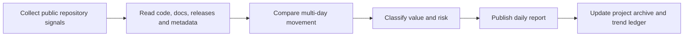

# GitHub Researcher

<h3 align="center">Daily, evidence-linked research on fast-moving open-source projects and developer trends.</h3>

<p align="center">
  More than a ranking table: what changed, why it may matter, how strong the signal is, and what remains unverified.
</p>

<p align="center">
  <a href="README.zh-CN.md">简体中文</a> ·
  <a href="https://github-research.aiutil.com">Live research site</a> ·
  <a href="daily/2026-09-09.md">Latest report</a> ·
  <a href="https://aiutil.com">AIUtil</a>
</p>

<p align="center">
  <a href="https://github.com/aiutil/github-researcher/actions/workflows/ci.yml"></a>
  <a href="LICENSE"></a>
  
</p>


## Latest report · 2026-09-09

| Repositories analyzed today | Research archive | Core directions | Weekly star movement |
| ---: | ---: | ---: | ---: |
| 10 | 561 | 7 | 10K+ |

| Repository | Snapshot | Category |
| --- | --- | --- |
| [openai/NavierStokesAndEuler](projects/navierstokesandeuler.md) | 635 stars | 学术 / 形式化 |
| [henryzawadzki6542/cloudflare-turnstile-bypass](projects/cloudflare-turnstile-bypass.md) | 367 stars | 工具型 |
| [gazijarin/itsgiving](projects/itsgiving.md) | 307 stars | 工具型 |
| [Sophomoresty/turnstile-bypass](projects/turnstile-bypass.md) | 305 stars | 工具型 |
| [lfzk550/fanzha-ai-proxy](projects/fanzha-ai-proxy.md) | 285 stars | 工具型 |
| [tristanbuckmaster/fluid_lean](projects/fluid-lean.md) | 168 stars | 学术 / 形式化 |
| [noskillish/bankmcp](projects/bankmcp.md) | 160 stars | 工具型 |
| [cclank/clay-safari](projects/clay-safari.md) | 135 stars | 工具型 |


## Current trend signals

1. **Signal 1** · score 98 · repositories: openai/NavierStokesAndEuler, tristanbuckmaster/fluid_lean
2. **Signal 2** · score 90 · repositories: henryzawadzki6542/cloudflare-turnstile-bypass, Sophomoresty/turnstile-bypass, biusberline/cloudflare-turnstile-solver
3. **Signal 3** · score 86 · repositories: lfzk550/fanzha-ai-proxy, eternity4719/HowToLiveBetter, jtydhr88/screenwriting-skills
4. **Signal 4** · score 84 · repositories: noskillish/bankmcp

The structured source reports are written in Chinese today; the charts, repository snapshots, methodology, and evidence boundaries are bilingual. Follow the [latest report](daily/2026-09-09.md) for the complete source-linked reasoning record.

## Recent research cadence

| Date | Repositories analyzed | Core directions |
| --- | ---: | ---: |
| [2026-09-09](daily/2026-09-09.md) | 10 | 7 |
| [2026-09-08](daily/2026-09-08.md) | 9 | 6 |
| [2026-09-07](daily/2026-09-07.md) | 10 | 6 |
| [2026-09-06](daily/2026-09-06.md) | 8 | 6 |
| [2026-09-05](daily/2026-09-05.md) | 10 | 7 |
| [2026-09-03](daily/2026-09-03.md) | 10 | 6 |
| [2026-09-02](daily/2026-09-02.md) | 8 | 5 |

## Why this repository exists

GitHub Trending reveals attention, not durable value. This project records dated repository facts, reads the underlying code and documentation, compares multi-day movement, separates observations from inference, and keeps explicit risks such as unverifiable benchmarks or suspicious star patterns.

## Research workflow



- `daily/` contains dated research reports with source snapshots.
- `projects/` contains durable project records and later corrections.
- `indexes/` tracks cross-project trends over time.
- `docs/` is the generated public site.
- `scripts/generate_readme.py` regenerates both READMEs and the activity chart from committed data.

## Evidence boundaries

Stars, forks, releases, licenses, languages, and timestamps are treated as observable GitHub facts at collection time. Product quality, architectural significance, market direction, and suspected manipulation are research judgments. Author claims are labeled until independently reproduced; corrections stay in the dated record.

## Generate and verify

```bash
python3 -m pip install pyyaml
python3 scripts/generate_readme.py
git diff --exit-code -- README.md README.zh-CN.md docs/images/research-activity.svg
```

The scheduled research worker runs in AIUtil's private automation environment. Tokens, private runtime memory, and operator state are not committed.

## Security

Do not add access tokens, private repository content, user-level activity, or unredacted operator memory. Report vulnerabilities privately through [GitHub Security Advisories](https://github.com/aiutil/github-researcher/security/advisories/new).

## License

Apache License 2.0. See [NOTICE](NOTICE).
