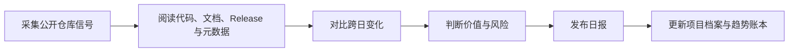

# GitHub 趋势研究

<h3 align="center">每日追踪快速增长的开源项目，用可核验事实解释变化、趋势、价值与风险。</h3>

<p align="center">
  不只搬运 Star 排名：记录发生了什么、为什么可能重要、信号有多强，以及哪些结论仍未验证。
</p>

<p align="center">
  <a href="README.md">English</a> ·
  <a href="https://github-research.aiutil.com">在线研究站</a> ·
  <a href="daily/2026-08-13.md">最新日报</a> ·
  <a href="https://aiutil.com">AIUtil</a>
</p>

<p align="center">
  <a href="https://github.com/aiutil/github-researcher/actions/workflows/ci.yml"></a>
  <a href="LICENSE"></a>
  
</p>


## 最新研究 · 2026-08-13

| 今日深度分析 | 项目档案 | 核心趋势方向 | 本周 Star 变化 |
| ---: | ---: | ---: | ---: |
| 12 | 448 | 4 | 15k+ |

**今日核心判断：** H3 生态全面减速——h3.c +377（1,201→1,578，+31.4%，从 +831% 回落），MiniMax-H3 官方 +234（5,194→5,428，+4.5%），爆发期结束进入长尾（可核验：连续 API 数据序列；'爆发期结束'为基于增速衰减曲线的推断） · guillaumemeyer/watermarks-remover 两日破 2k（2,008⭐/187 fork/0 issue/Python/MIT），AI 来源水印剥离作为独立 Skill 品类出现（可核验：README 多层剥离能力；作者 Microsoft MVP 身份可核验；'双重用途'风险为推断） · sohaibdevv/youtube-music 疑似恶意软件投递样本（848⭐/0 fork/0 issue + 密码保护 ZIP 下载 'ytm4all'），与 WeChat-AI 的'刷量'模式不同——0 fork + 密码 ZIP 是经典恶意软件投递特征（可核验：API 0 fork + README 密码模式；'恶意软件'判断为推断未下载验证）

| 项目 | 当日快照 | 分类 |
| --- | --- | --- |
| [antirez/h3.c](projects/h3c.md) | 1,578 stars | 观察型 |
| [guillaumemeyer/watermarks-remover](projects/watermarks-remover.md) | 2,008 stars | 工具型 |
| [firecrawl/anydoc](projects/anydoc.md) | 15,040 stars | 工具型 |
| [MiniMax-AI/MiniMax-H3](projects/minimax-h3.md) | 5,428 stars | 观察型 |
| [sohaibdevv/youtube-music](projects/youtube-music.md) | 848 stars | 观察型 |
| [ShawnPana/phone-harness](projects/phone-harness.md) | 1,630 stars | 观察型 |
| [FareedKhan-dev/kimi-k3-in-c](projects/kimi-k3-in-c.md) | 5,168 stars | 观察型 |
| [dmmulroy/anti-slop](projects/anti-slop.md) | 290 stars | 工具型 |


## 当前趋势信号

1. **H3 生态全面减速——h3.c +377（1,201→1,578，+31.4%，从昨日 +831% 断崖式回落），MiniMax-H3 官方 +234（5,194→5,428，+4.5%，从 +24.7% 回落），衍生生态 448→505（+57）。增速序列 h3.c: +831%→+31.4%，MiniMax-H3: +55%→+24.7%→+4.5%。爆发期明确结束，进入长尾扩散。fork/subscribers 仍在增长（h3.c 57→86、subs 10→15），说明深度开发者仍在进入，但注意力增速已回归常态。'推理成本是瓶颈'的核心判断不受减速影响——减速是注意力饱和的自然结果** · 相关项目：h3c, minimax-h3 · 强度：88
2. **guillaumemeyer/watermarks-remover 两日破 2k（2,008⭐/187 fork/0 issue/Python/MIT/创建 08-11）——AI 来源水印剥离作为独立 Skill 品类出现。README 显示多层剥离能力：Layer A 确定性 Unicode/隐藏字符清除、Layer B 统计水印（SynthID/Kirchenbauer）重写钩子、Files 层 C2PA/EXIF/XMP 元数据剥离。作者 guillaumemeyer 为 Microsoft MVP（2012 年注册，36 仓库，43 followers），信誉可核验。热度来源判断：'AI 来源检测 vs 隐私'的张力是真需求——但'双重用途'风险（可被用于绕过来源验证）需显式标注为待观察** · 相关项目：watermarks-remover · 强度：86
3. **sohaibdevv/youtube-music 疑似恶意软件投递样本（848⭐/0 fork/0 issue/TypeScript/MIT/创建 08-11）。与 WeChat-AI 的刷量模式（fork≈star）不同，此项目呈现 0 fork + 密码保护 ZIP 下载（README 明确 'Password: ytm4all'）——这是经典恶意软件投递特征（非开源代码分发模式）。848 star / 0 fork 的极端背离进一步支持'非自然热度'判断。作者 sohaibdevv（2024-10 注册，95 公开仓库，9 followers）。可核验：API 0 fork/0 issue + README 密码 ZIP 模式。推断但未下载验证：实际是否含恶意载荷。作为'恶意软件投递伪装开源'的新对照案例入库** · 相关项目：youtube-music · 强度：65
4. **Coding Agent 治理工具群涌现——anti-slop（290⭐/5 fork/TypeScript，Oxlint 规则拒绝低证据 TS/JS 模式）、claudish-to-english（598⭐/36 fork，本地 LLM 将 AI 术语翻译为通俗英语）、HERO-Anti-OverDefense（118⭐，约束 Agent 过度防御的粘贴式合约）。三者从不同角度（代码质量、可读性、行为约束）切入 Agent 输出治理，暗示 Coding Agent 已从'能写代码'进入'写得靠谱'的成熟阶段。可核验：三者 README 能力描述 + star/fork 数据。推断：是否形成持久品类待观察** · 相关项目：anti-slop · 强度：82

## 最近 7 期更新量

| 日期 | 深度分析项目 | 核心趋势方向 |
| --- | ---: | ---: |
| [2026-08-13](daily/2026-08-13.md) | 12 | 4 |
| [2026-08-12](daily/2026-08-12.md) | 12 | 4 |
| [2026-08-11](daily/2026-08-11.md) | 12 | 4 |
| [2026-08-10](daily/2026-08-10.md) | 12 | 4 |
| [2026-08-09](daily/2026-08-09.md) | 12 | 4 |
| [2026-08-08](daily/2026-08-08.md) | 13 | 4 |
| [2026-08-07](daily/2026-08-07.md) | 12 | 4 |

## 为什么做这个项目

GitHub Trending 展示注意力，不等于长期价值。本项目记录带日期的仓库事实，阅读代码、文档和 Release，对比跨日变化，区分事实与推断，并保留 Benchmark 未复现、许可证变化或异常 Star 等风险。

## 研究工作流



- `daily/`：带来源快照的每日研究报告。
- `projects/`：可持续修订的项目档案。
- `indexes/`：跨项目、跨日期的趋势记录。
- `docs/`：生成后的公开站点。
- `scripts/generate_readme.py`：从已提交数据生成双语 README 和活动图表。

## 证据边界

Star、Fork、Release、许可证、语言与时间戳属于采集时可观察的 GitHub 事实；产品质量、架构意义、市场方向和疑似刷星属于研究判断。作者自述在独立复现前会明确标注，后续修正保留在带日期的记录里。

## 生成与验证

```bash
python3 -m pip install pyyaml
python3 scripts/generate_readme.py
git diff --exit-code -- README.md README.zh-CN.md docs/images/research-activity.svg
```

定时研究任务运行在 AIUtil 私有自动化环境中，Token、私有运行记忆和运营状态不进入仓库。

## 安全

请勿提交访问令牌、私有仓库内容、用户级活动数据或未经脱敏的运营记忆。安全问题请通过 [GitHub Security Advisories](https://github.com/aiutil/github-researcher/security/advisories/new) 私下报告。

## 开源协议

Apache License 2.0，详见 [NOTICE](NOTICE)。
