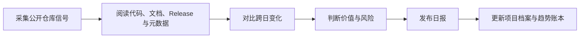

# GitHub 趋势研究

<h3 align="center">每日追踪快速增长的开源项目，用可核验事实解释变化、趋势、价值与风险。</h3>

<p align="center">
  不只搬运 Star 排名：记录发生了什么、为什么可能重要、信号有多强，以及哪些结论仍未验证。
</p>

<p align="center">
  <a href="README.md">English</a> ·
  <a href="https://github-research.aiutil.com">在线研究站</a> ·
  <a href="daily/2026-08-12.md">最新日报</a> ·
  <a href="https://aiutil.com">AIUtil</a>
</p>

<p align="center">
  <a href="https://github.com/aiutil/github-researcher/actions/workflows/ci.yml"></a>
  <a href="LICENSE"></a>
  
</p>


## 最新研究 · 2026-08-12

| 今日深度分析 | 项目档案 | 核心趋势方向 | 本周 Star 变化 |
| ---: | ---: | ---: | ---: |
| 12 | 445 | 4 | 15k+ |

**今日核心判断：** antirez/h3.c 爆发（129→1,201，+831%/+1,072），Redis 之父原生推理引擎三日破千，'推理成本是瓶颈'判断被市场二次确认（可核验：API star/fork/subscribers；README 能力描述可核验；M5 Max 性能为作者自述未复现） · anydoc 昨日'稳态'判断被逆转——delta 从 +719 反弹到 +957（13,399→14,356，+7.1%），上一日'成熟稳态'判断明确修正（可核验：连续八日 API 数据；反弹原因待观察，可能与 H3 生态热度外溢/周末效应有关） · SMNETSTUDIO/WeChat-AI 疑似刷量样本（1,406⭐/1,040 fork/1 subscriber/0 issue/无描述/2天，fork≈star 零参与度），继 open-kimi-ppt-skill 后又一个'热度≠价值'对照案例

| 项目 | 当日快照 | 分类 |
| --- | --- | --- |
| [antirez/h3.c](projects/h3c.md) | 1,201 stars | 观察型 |
| [firecrawl/anydoc](projects/anydoc.md) | 14,356 stars | 工具型 |
| [MiniMax-AI/MiniMax-H3](projects/minimax-h3.md) | 5,194 stars | 观察型 |
| [SMNETSTUDIO/WeChat-AI](projects/wechat-ai.md) | 1,406 stars | 观察型 |
| [ShawnPana/phone-harness](projects/phone-harness.md) | 1,488 stars | 观察型 |
| [FareedKhan-dev/kimi-k3-in-c](projects/kimi-k3-in-c.md) | 4,891 stars | 观察型 |
| [oil-oil/oil-motion](projects/oil-motion.md) | 1,475 stars | 工具型 |
| [KKKKhazix/human-writing](projects/human-writing.md) | 2,405 stars | 工具型 |


## 当前趋势信号

1. **antirez/h3.c 爆发（129→1,201，+831%/+1,072），连续三日从 129→1,201。Redis 创始人 Salvatore Sanfilippo 的 MiniMax-H3 原生 Metal 推理引擎三日破千星。fork 7→57（+50），subscribers 1→10。README 能力（prompt→video/audio、首尾帧 !first/!last、Ref2VA 引用 !ref-image、core-reuse/--reuse token reduction、--layers 跳层）均可核验。M5 Max 性能数据为作者自述未独立复现。'推理成本是真瓶颈'判断被市场二次确认——当顶级系统工程师亲自下场写 C/Metal，说明瓶颈攻关已进入深栈层** · 相关项目：h3c, minimax-h3 · 强度：92
2. **anydoc 昨日'稳态'判断被逆转——delta 从 +719（08-11）反弹到 +957（08-12，13,399→14,356，+7.1%），fork 675→751（+76）。昨日报告判断'delta 稳定在 600-700 区间两日，真实需求曲线进入成熟稳态'，今日数据明确修正：绝对增量不降反升，打破单调收敛假设。可核验：连续八日 API 数据序列。反弹原因待观察（推断：H3 生态热度外溢到文档摄入、周末曝光累积、或新发布/集成事件，但 pushed_at 仍为 08-10，无新 commit）。这是一个'基于有限数据过早下稳态结论'的方法论修正案例** · 相关项目：anydoc · 强度：90
3. **SMNETSTUDIO/WeChat-AI 疑似刷量样本（1,406⭐/1,040 fork/1 subscriber/0 open issue/无 description/创建 08-10/2天）。fork≈star（fork/star=0.74）且零参与度（1 subscriber、0 issue）是典型的自动化批量部署/刷量信号，与 open-kimi-ppt-skill 归档后 fork 异常增长同构。API 全部字段可核验。作为'热度≠价值'的对照案例入库，与 anydoc（真实需求：star/fork 同步增长、subscribers 35）形成方法论对照** · 相关项目：wechat-ai · 强度：68
4. **MiniMax-H3 官方仓库持续高位（4,164→5,194，+1,030/+24.7%），衍生生态搜索 379→448（'minimax-h3'）。连续四日 +699→+924→+1,471→+1,030，增速从 +55% 回落到 +24.7% 但绝对增量仍破千。antirez/h3.c 爆发 + 官方仓库持续 + 衍生生态扩张，三者共振确认 H3 是本周最强生态级信号。kimi-k3-in-c 同步 +242（+5.2%），本地 MoE 推理赛道头部双项目并行放量** · 相关项目：minimax-h3, kimi-k3-in-c · 强度：90

## 最近 7 期更新量

| 日期 | 深度分析项目 | 核心趋势方向 |
| --- | ---: | ---: |
| [2026-08-12](daily/2026-08-12.md) | 12 | 4 |
| [2026-08-11](daily/2026-08-11.md) | 12 | 4 |
| [2026-08-10](daily/2026-08-10.md) | 12 | 4 |
| [2026-08-09](daily/2026-08-09.md) | 12 | 4 |
| [2026-08-08](daily/2026-08-08.md) | 13 | 4 |
| [2026-08-07](daily/2026-08-07.md) | 12 | 4 |
| [2026-08-06](daily/2026-08-06.md) | 11 | 4 |

## 为什么做这个项目

GitHub Trending 展示注意力，不等于长期价值。本项目记录带日期的仓库事实，阅读代码、文档和 Release，对比跨日变化，区分事实与推断，并保留 Benchmark 未复现、许可证变化或异常 Star 等风险。

## 研究工作流



- `daily/`：带来源快照的每日研究报告。
- `projects/`：可持续修订的项目档案。
- `indexes/`：跨项目、跨日期的趋势记录。
- `docs/`：生成后的公开站点。
- `scripts/generate_readme.py`：从已提交数据生成双语 README 和活动图表。

## 证据边界

Star、Fork、Release、许可证、语言与时间戳属于采集时可观察的 GitHub 事实；产品质量、架构意义、市场方向和疑似刷星属于研究判断。作者自述在独立复现前会明确标注，后续修正保留在带日期的记录里。

## 生成与验证

```bash
python3 -m pip install pyyaml
python3 scripts/generate_readme.py
git diff --exit-code -- README.md README.zh-CN.md docs/images/research-activity.svg
```

定时研究任务运行在 AIUtil 私有自动化环境中，Token、私有运行记忆和运营状态不进入仓库。

## 安全

请勿提交访问令牌、私有仓库内容、用户级活动数据或未经脱敏的运营记忆。安全问题请通过 [GitHub Security Advisories](https://github.com/aiutil/github-researcher/security/advisories/new) 私下报告。

## 开源协议

Apache License 2.0，详见 [NOTICE](NOTICE)。
