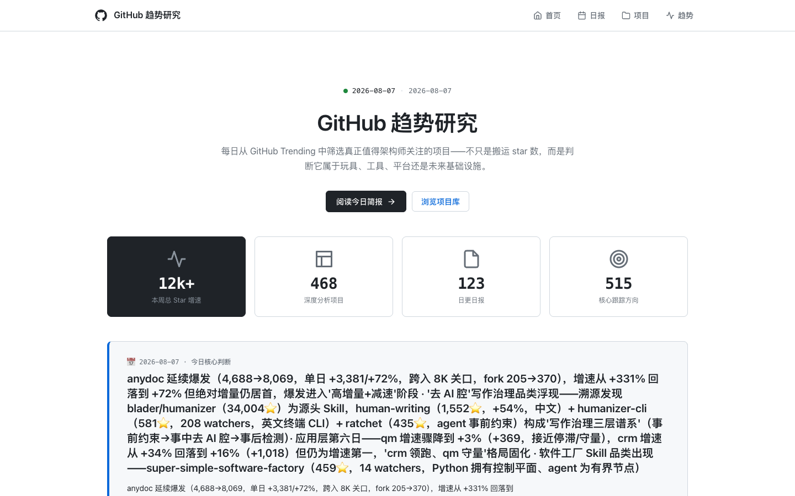
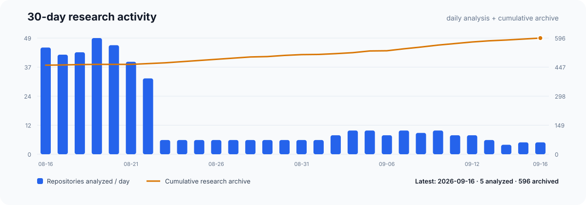

# GitHub 趋势研究

<h3 align="center">每日追踪快速增长的开源项目，用可核验事实解释变化、趋势、价值与风险。</h3>

<p align="center">
  不只搬运 Star 排名：记录发生了什么、为什么可能重要、信号有多强，以及哪些结论仍未验证。
</p>

<p align="center">
  <a href="README.md">English</a> ·
  <a href="https://github-research.aiutil.com">在线研究站</a> ·
  <a href="daily/2026-08-09.md">最新日报</a> ·
  <a href="https://aiutil.com">AIUtil</a>
</p>

<p align="center">
  <a href="https://github.com/aiutil/github-researcher/actions/workflows/ci.yml"></a>
  <a href="LICENSE"></a>
  
</p>



## 最新研究 · 2026-08-09

| 今日深度分析 | 项目档案 | 核心趋势方向 | 本周 Star 变化 |
| ---: | ---: | ---: | ---: |
| 12 | 441 | 4 | 14k+ |

**今日核心判断：** MiniMax-H3 反而加速（1,070→1,769，+699/+65%），生态仓库 265→314，模型仓库自身增速超过衍生生态，'生成质量瓶颈'让位于'推理成本+工作流'瓶颈的判断被市场继续确认 · anydoc 进入稳态（10,866→12,055，+1,189/+11%，增速序列 +331%→+72%→+35%→+11%，五日衰减率单调收窄，教科书式真实需求曲线收敛完成） · open-kimi-ppt-skill 被作者归档（archived=true，1588⭐/1113 fork）——昨日 fork 异常暴增（343→914）后的可疑信号今天落地为归档，刷量/弃坑判断被验证 · Swiftlet（456⭐，Swift+Metal 在 iPhone 17 上跑 35B MoE，峰值 2.6GB RAM）——本地 MoE 流式加载路线从 C99（kimi-k3-in-c）扩展到 Apple/Swift 原生栈

| 项目 | 当日快照 | 分类 |
| --- | --- | --- |
| [firecrawl/anydoc](projects/anydoc.md) | 12,055 stars | 工具型 |
| [MiniMax-AI/MiniMax-H3](projects/minimax-h3.md) | 1,769 stars | 观察型 |
| [0xwilliamortiz/claude-red](projects/claude-red.md) | 681 stars | 工具型 |
| [leonickson1/Swiftlet](projects/swiftlet.md) | 456 stars | 观察型 |
| [jd-opensource/JoyAI-Video-Edit](projects/joyai-video-edit.md) | 512 stars | 观察型 |
| [trycompai/crm](projects/crm.md) | 7,751 stars | 平台候选 |
| [yc-software/qm](projects/qm.md) | 12,525 stars | 平台候选 |
| [Binaryify/open-kimi-ppt-skill](projects/open-kimi-ppt-skill.md) | 1,588 stars (archived) | 观察型 |



## 当前趋势信号

1. **MiniMax-H3 反而加速——官方仓库增速从 +0 跃到 +65%（1,070→1,769），生态仓库 265→314，模型仓库自身增速反超衍生生态，视频生成赛道'生成质量瓶颈'让位于'推理成本+工作流编排'瓶颈的判断被市场继续确认，加速器类（Spectrum/Turbo）持续领跑衍生生态** · 相关项目：minimax-h3 · 强度：88
2. **anydoc 进入稳态放量（10,866→12,055，+1,189/+11%，fork 506→575）——增速序列 +331%→+72%→+35%→+11%，五日衰减率单调收窄（衰减率本身在收敛），教科书式真实需求曲线收敛完成；稳态增量 +1K/日，万星量级头部位置巩固** · 相关项目：anydoc · 强度：90
3. **open-kimi-ppt-skill 被作者归档（archived=true，1588⭐/1113 fork）——昨日报告的 fork 异常暴增（343→914 单日+571，fork/star=0.58 异常）今天落地为归档，'疑似刷量或批量部署'判断被验证；同日 anydoc 稳态、claude-red 稳健增长（+23%）形成对比，验证'分清热度与价值'的方法论价值** · 相关项目：open-kimi-ppt-skill · 强度：78
4. **本地 MoE 推理路线扩展到 Apple 原生栈——Swiftlet（456⭐，Swift+Metal 在 iPhone 17 上跑 35B Qwen3.6 MoE，峰值 2.6GB RAM，按需流式加载 expert），与 kimi-k3-in-c（C99，今日继续 +16% 加速）构成'本地大模型推理'赛道的多语言/多平台覆盖** · 相关项目：swiftlet, kimi-k3-in-c · 强度：83

## 最近 7 期更新量

| 日期 | 深度分析项目 | 核心趋势方向 |
| --- | ---: | ---: |
| [2026-08-09](daily/2026-08-09.md) | 12 | 4 |
| [2026-08-08](daily/2026-08-08.md) | 13 | 4 |
| [2026-08-07](daily/2026-08-07.md) | 12 | 4 |
| [2026-08-06](daily/2026-08-06.md) | 11 | 4 |
| [2026-08-05](daily/2026-08-05.md) | 10 | 4 |
| [2026-08-04](daily/2026-08-04.md) | 8 | 4 |
| [2026-08-03](daily/2026-08-03.md) | 5 | 3 |

## 为什么做这个项目

GitHub Trending 展示注意力，不等于长期价值。本项目记录带日期的仓库事实，阅读代码、文档和 Release，对比跨日变化，区分事实与推断，并保留 Benchmark 未复现、许可证变化或异常 Star 等风险。

## 研究工作流


- `daily/`：带来源快照的每日研究报告。
- `projects/`：可持续修订的项目档案。
- `indexes/`：跨项目、跨日期的趋势记录。
- `docs/`：生成后的公开站点。
- `scripts/generate_readme.py`：从已提交数据生成双语 README 和活动图表。

## 证据边界

Star、Fork、Release、许可证、语言与时间戳属于采集时可观察的 GitHub 事实；产品质量、架构意义、市场方向和疑似刷星属于研究判断。作者自述在独立复现前会明确标注，后续修正保留在带日期的记录里。

## 生成与验证

```bash
python3 -m pip install pyyaml
python3 scripts/generate_readme.py
git diff --exit-code -- README.md README.zh-CN.md docs/images/research-activity.svg
```

定时研究任务运行在 AIUtil 私有自动化环境中，Token、私有运行记忆和运营状态不进入仓库。

## 安全

请勿提交访问令牌、私有仓库内容、用户级活动数据或未经脱敏的运营记忆。安全问题请通过 [GitHub Security Advisories](https://github.com/aiutil/github-researcher/security/advisories/new) 私下报告。

## 开源协议

Apache License 2.0，详见 [NOTICE](NOTICE)。
