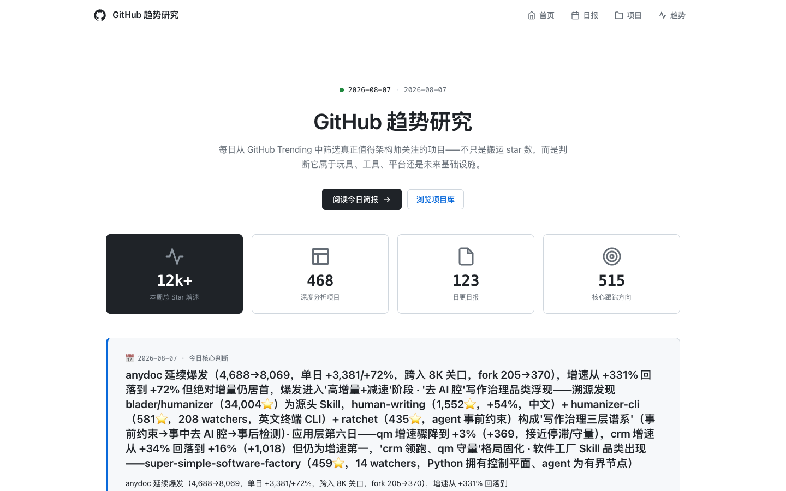
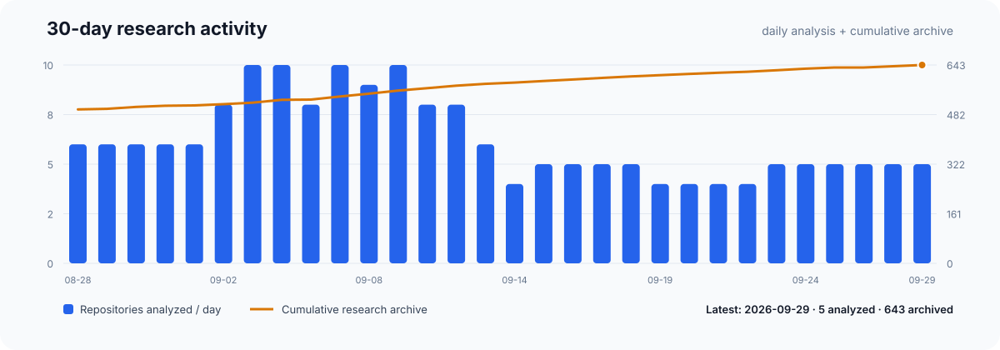

# GitHub 趋势研究

<h3 align="center">每日追踪快速增长的开源项目，用可核验事实解释变化、趋势、价值与风险。</h3>

<p align="center">
  不只搬运 Star 排名：记录发生了什么、为什么可能重要、信号有多强，以及哪些结论仍未验证。
</p>

<p align="center">
  <a href="README.md">English</a> ·
  <a href="https://github-research.aiutil.com">在线研究站</a> ·
  <a href="daily/2026-09-29.md">最新日报</a> ·
  <a href="https://aiutil.com">AIUtil</a>
</p>

<p align="center">
  <a href="https://github.com/aiutil/github-researcher/actions/workflows/ci.yml"></a>
  <a href="LICENSE"></a>
  
</p>



## 最新研究 · 2026-09-29

| 今日深度分析 | 项目档案 | 核心趋势方向 | 本周 Star 变化 |
| ---: | ---: | ---: | ---: |
| 5 | 643 | 3 | 13k+ |

**今日核心判断：** Opus 5.5 视频严肃工程化跨工作流 + Awesome list 四件套 + plugin marketplace 二次分发——昨日 yihui-dev/awesome-opus5-5-videos 2 天 692⭐ ⑂80 fork/star 11.6% 把 389 个 X 上 Opus 5.5 写代码做的病毒视频 + 完整 prompt + 元数据 + Skillry 网站 live remake + 最新更新日志（2026-09-28: 107 videos added）做成 Awesome list 严肃工程化四件套（prompts/.md 单文件 + data/videos.json + live remake + 持续更新）；昨日 lemomo-ai/lemo-opuscar 3 天 512⭐ ⑂67 fork/star 13.1% 39 种影片风格 + 60 MB 本地缓存 + plugin marketplace 二次分发 + OPUSCAR 98（98 Years of Best Picture 6:25）把 Opus 5.5 写代码做视频从单点作品推到「39 风格库 + 导演指南 + 本地缓存 + 双语 README + 1080p MP4 下载 + canvas / WebGL 逐帧渲染 + 原创配乐 + 本地 TTS + ffmpeg 合成」严肃工程化形态；Agent Skill 严肃工程化向「纪律化设计 + 1,400+ 参考库 + checkpoint 强约束」演化——昨日 kaankiziltug/logo-design-skill 3 天 405⭐ ⑂18 fork/star 4.5% 13 步骤纪律化设计流程 + 1,400+ 真实 SVG logo 参考库 + 纯 Python 工具（audit / 16 px / one-colour / squint / mirror / shelf test / mockup boards / favicon 套件）+ checkpoint 强约束 + 8 平台兼容（Claude / Gemini CLI / Codex CLI / Cursor / GitHub Copilot）+ MIT + The New 100 #14；3D 多人协作 agent 工具 + 每个 project 一个 floor——昨日 AgentSystemLabs/agent-office 3 天 269⭐ ⑂59 fork/star 21.9% WASD + Space + 鼠标拖动 orbit camera 在卡通 3D office 走 + 每 worker 一个 laptop terminal + 所有人跳进那个 terminal + 电梯选 GitHub 仓库自动 clone + 每个 project 一个 floor 刷成自己的颜色 + MIT；严肃工程化个人 / 团队协作工具从「单点 CLI / App」推到「3D 多人协作 + 每 project 一个 floor + 跨 worker voice + lounge TV 共享屏幕」严肃工程化形态。

| 项目 | 当日快照 | 分类 |
| --- | --- | --- |
| [lemomo-ai/lemo-opuscar](projects/lemo-opuscar.md) | 512 stars | 工具型 |
| [yihui-dev/awesome-opus5-5-videos](projects/awesome-opus5-5-videos.md) | 692 stars | 工具型 |
| [kaankiziltug/logo-design-skill](projects/logo-design-skill.md) | 405 stars | 工具型 |
| [AgentSystemLabs/agent-office](projects/agent-office.md) | 269 stars | 工具型 |
| [dzhng/jevgrep](projects/jevgrep.md) | 1373 stars | 工具型 |



## 当前趋势信号

1. **Opus 5.5 视频严肃工程化跨工作流 + Awesome list 四件套 + plugin marketplace 二次分发——昨日 yihui-dev/awesome-opus5-5-videos 2 天 692⭐ ⑂80 fork/star 11.6% 389 prompts + Skillry live remake + 持续更新 + lemomo-ai/lemo-opuscar 3 天 512⭐ ⑂67 fork/star 13.1% 39 风格 + 60 MB 本地缓存 + plugin marketplace + OPUSCAR 98 + 双语 README + 1080p MP4（趋势分 92）** · 相关项目：yihui-dev/awesome-opus5-5-videos, lemomo-ai/lemo-opuscar · 强度：92
2. **Agent Skill 严肃工程化向「纪律化设计 + 1,400+ 参考库 + checkpoint 强约束 + 8 平台兼容 + MIT」演化——昨日 kaankiziltug/logo-design-skill 3 天 405⭐ ⑂18 fork/star 4.5% 13 步骤 + 1,400+ SVG logo + 纯 Python 工具 + checkpoint + The New 100 #14（趋势分 86）** · 相关项目：kaankiziltug/logo-design-skill · 强度：86
3. **3D 多人协作 agent 工具 + 每个 project 一个 floor——昨日 AgentSystemLabs/agent-office 3 天 269⭐ ⑂59 fork/star 21.9% WASD + Space + orbit camera + 每 worker 一个 laptop terminal + 电梯选 GitHub 仓库自动 clone + 每 project 一个 floor 刷成自己的颜色 + MIT（趋势分 80）** · 相关项目：AgentSystemLabs/agent-office · 强度：80
4. **Jev 决策模型 CLI 工具层 + 多 provider + 多 harness 严肃工程化持续 04 日同步增长——昨日 dzhng/jevgrep 3 天 1373⭐ ⑂83 fork/star 6.0%（较 09-28 699⭐ 增长 ~96%）+ supermemoryai/company-brain 4 天 780⭐ ⑂109 fork/star 14.0%（较 09-28 664⭐ 增长 ~17%）+ feitangyuan/onetake 3 天 814⭐ ⑂53 fork/star 6.5%（较 09-28 529⭐ 增长 ~54%）+ amitshekhariitbhu/ai-system-design 持续 4 日 + anishfn/shapeshift 持续 5 日（趋势分 78）** · 相关项目：dzhng/jevgrep, supermemoryai/company-brain, feitangyuan/onetake, amitshekhariitbhu/ai-system-design, anishfn/shapeshift · 强度：78

## 最近 7 期更新量

| 日期 | 深度分析项目 | 核心趋势方向 |
| --- | ---: | ---: |
| [2026-09-29](daily/2026-09-29.md) | 5 | 3 |
| [2026-09-28](daily/2026-09-28.md) | 5 | 3 |
| [2026-09-26](daily/2026-09-26.md) | 5 | 3 |
| [2026-09-25](daily/2026-09-25.md) | 5 | 3 |
| [2026-09-24](daily/2026-09-24.md) | 5 | 3 |
| [2026-09-23](daily/2026-09-23.md) | 5 | 3 |
| [2026-09-22](daily/2026-09-22.md) | 4 | 3 |

## 为什么做这个项目

GitHub Trending 展示注意力，不等于长期价值。本项目记录带日期的仓库事实，阅读代码、文档和 Release，对比跨日变化，区分事实与推断，并保留 Benchmark 未复现、许可证变化或异常 Star 等风险。

## 研究工作流


```mermaid
flowchart LR
  A["采集公开仓库信号"] --> B["阅读代码、文档、Release 与元数据"]
  B --> C["对比跨日变化"]
  C --> D["判断价值与风险"]
  D --> E["发布日报"]
  E --> F["更新项目档案与趋势账本"]
```

- `daily/`：带来源快照的每日研究报告。
- `projects/`：可持续修订的项目档案。
- `indexes/`：跨项目、跨日期的趋势记录。
- `docs/`：生成后的公开站点。
- `scripts/generate_readme.py`：从已提交数据生成双语 README 和活动图表。

## 证据边界

Star、Fork、Release、许可证、语言与时间戳属于采集时可观察的 GitHub 事实；产品质量、架构意义、市场方向和疑似刷星属于研究判断。作者自述在独立复现前会明确标注，后续修正保留在带日期的记录里。

## 生成与验证

```bash
python3 -m pip install pyyaml
python3 scripts/generate_readme.py
git diff --exit-code -- README.md README.zh-CN.md docs/images/research-activity.svg
```

定时研究任务运行在 AIUtil 私有自动化环境中，Token、私有运行记忆和运营状态不进入仓库。

## 安全

请勿提交访问令牌、私有仓库内容、用户级活动数据或未经脱敏的运营记忆。安全问题请通过 [GitHub Security Advisories](https://github.com/aiutil/github-researcher/security/advisories/new) 私下报告。

## 开源协议

Apache License 2.0，详见 [NOTICE](NOTICE)。
