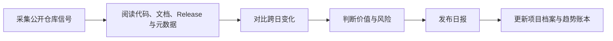

# GitHub 趋势研究

<h3 align="center">每日追踪快速增长的开源项目，用可核验事实解释变化、趋势、价值与风险。</h3>

<p align="center">
  不只搬运 Star 排名：记录发生了什么、为什么可能重要、信号有多强，以及哪些结论仍未验证。
</p>

<p align="center">
  <a href="README.md">English</a> ·
  <a href="https://github-research.aiutil.com">在线研究站</a> ·
  <a href="daily/2026-10-08.md">最新日报</a> ·
  <a href="https://aiutil.com">AIUtil</a>
</p>

<p align="center">
  <a href="https://github.com/aiutil/github-researcher/actions/workflows/ci.yml"></a>
  <a href="LICENSE"></a>
  
</p>


## 最新研究 · 2026-10-08

| 今日深度分析 | 项目档案 | 核心趋势方向 | 本周 Star 变化 |
| ---: | ---: | ---: | ---: |
| 6 | 675 | 5 | 900k+ |

**今日核心判断：** openai/math 2 天 9205⭐ ⑂886 fork/star 9.6% 把「LLM 数学研究」从「单题演示 + 论文 + 闭源模型」推到「OpenAI 自家未发布模型 + 722 篇手稿（372 个结论族）+ 部分 Lean 形式化 + BSD/准 Riemann/Milne/Kaplansky/量子铁磁体自发性磁化/稀释自旋玻璃 Mézard-Parisi 等顶级未解问题推进 + 4000 题 + 3h ChatGPT Pro 思考计算 + Apache-2.0 + overview.pdf + CONTENTS.md + formalization.yaml」严肃工程化形态 · storytold ArtCraft Adobe 全家桶——filmcraft 8 天 3143⭐ ⑂985 fork/star 31.4% + lightcraft 8 天 2859⭐ ⑂836 + pdfcraft 8 天 2208⭐ ⑂759 + vectorcraft 8 天 2108⭐ ⑂806 + effectcraft 7 天 1585⭐ ⑂642 把「Adobe 创意套件（Photoshop/Premiere Pro/Lightroom/Acrobat/Illustrator/After Effects）」从「单 photocraft 2026-10-07 严肃工程化」推到「photocraft 7 天 16286⭐ + filmcraft + lightcraft + pdfcraft + vectorcraft + effectcraft 五条 Rust 100% 重实现 + 跨 macOS/Windows/Linux/FreeBSD/Web + MCP server + ArtCraft 团队 + Discord 社区 + getartcraft.com 全家桶 + MIT OR Apache-2.0」Adobe 杀手组合形态 · yetone/magpie 15 天 5833⭐ ⑂426 fork/star 7.3% 把「Coding Agent 模型路由」从「env 变量手动配置」推到「magpie 菜单栏网关——Claude Code on Kimi + Codex on DeepSeek + Gemini CLI on GLM + OpenCode on ChatGPT 计划 + 配额耗尽自动切下一个账户 + 本地网关 + macOS/Windows/Linux/Docker/Termux + MIT + usemagpie.ai」严肃工程化形态 · CopilotKit/OpenDots 9 天 4167⭐ ⑂575 fork/star 13.8% 把「常驻 AI 同事」从「聊天框 + 工具调用」推到「OpenDots 模板化持续 agent——每 agent 一台专属电脑 + 跨 text/calls/Slack + CopilotKit Intelligence + AG-UI + 本地 Docker eval + 自托管 + Web/Mobile + MIT + Trendshift #2 TypeScript」严肃工程化形态 · 延续跟踪 Niko1221/Strata 14 天 16959⭐（+1343 昨日） + storytold/photocraft 8 天 16286⭐（+10429 昨日） + NandhaKishorM/laya 20 天 31421⭐（+226 昨日） + jaredpalmer/kev 21 天 持续 + KKKKhazix/AIHOT 持续——5 条新主线严肃工程化：（A openai/math 撤回自家模型与 OSS Slack 形式化 Lean 形式化 BSD/准 Riemann/Milne/Kaplansky/量子铁磁体自发性磁化/稀释自旋玻璃 Mézard-Parisi 等顶级未解问题推进 + 4000 题 3h ChatGPT Pro 思考计算）+（B storytold ArtCraft 5 条 Rust 100% 重实现 Adobe 创意套件 + 跨 macOS/Windows/Linux/FreeBSD/Web + MCP server + ArtCraft 团队 + Discord + MIT OR Apache-2.0）+（C yetone/magpie Coding Agent 模型路由菜单栏网关 + 配额自动切换账户 + 多 OS/Docker/Termux）+（D CopilotKit/OpenDots 持续 agent 模板 + 每 agent 一台专属电脑 + CopilotKit Intelligence + AG-UI）+（E firelex/jeff v1.3 + 0.8B base + 15 adapters + GGUF llama.cpp + Jeff-Code 47% faster coding agent + 1435⭐ ⑂68 fork/star 4.7%）。

| 项目 | 当日快照 | 分类 |
| --- | --- | --- |
| [openai/math](projects/math.md) | 9205 stars | 基础设施候选 |
| [storytold/filmcraft](projects/filmcraft.md) | 3143 stars | 工具型 |
| [yetone/magpie](projects/magpie.md) | 5833 stars | 工具型 |
| [CopilotKit/OpenDots](projects/opendots.md) | 4167 stars | 工具型 |
| [storytold/lightcraft](projects/lightcraft.md) | 2859 stars | 工具型 |
| [firelex/jeff](projects/firelex-jeff.md) | 1435 stars | 工具型 |


## 当前趋势信号

1. **openai/math 2 天 9205⭐ ⑂886 fork/star 9.6% 把「LLM 数学研究」从「单题演示 + 闭源」推到「OpenAI 自家未发布模型 + 722 篇手稿 + 372 个结论族 + 部分 Lean 形式化 + BSD/准 Riemann/Milne/Kaplansky/量子铁磁体自发性磁化/稀释自旋玻璃 Mézard-Parisi 等顶级未解问题推进 + 4000 题 3h ChatGPT Pro 思考计算 + Apache-2.0 + overview.pdf + CONTENTS.md + formalization.yaml」严肃工程化形态（趋势分 95）** · 相关项目：openai/math · 强度：95
2. **storytold ArtCraft 5 条 Rust 100% 重实现 Adobe 创意套件（filmcraft 8 天 3143⭐ ⑂985 fork/star 31.4% + lightcraft 8 天 2859⭐ + pdfcraft 8 天 2208⭐ + vectorcraft 8 天 2108⭐ + effectcraft 7 天 1585⭐）——把「Adobe 创意套件（Photoshop/Premiere Pro/Lightroom/Acrobat/Illustrator/After Effects）」从「单 photocraft 严肃工程化」推到「5 条 Rust 100% 重实现 + 跨 macOS/Windows/Linux/FreeBSD/Web + MCP server + ArtCraft 团队 + Discord + MIT OR Apache-2.0」Adobe 杀手组合形态（趋势分 90）** · 相关项目：storytold/filmcraft, storytold/lightcraft, storytold/pdfcraft, storytold/vectorcraft, storytold/effectcraft · 强度：90
3. **yetone/magpie 15 天 5833⭐ ⑂426 fork/star 7.3% 把「Coding Agent 模型路由」从「env 变量手动配置」推到「magpie 菜单栏网关——Claude Code on Kimi + Codex on DeepSeek + Gemini CLI on GLM + OpenCode on ChatGPT 计划 + 配额耗尽自动切下一个账户 + 本地网关 + macOS/Windows/Linux/Docker/Termux + MIT + usemagpie.ai」严肃工程化形态（趋势分 85）** · 相关项目：yetone/magpie · 强度：85
4. **CopilotKit/OpenDots 9 天 4167⭐ ⑂575 fork/star 13.8% 把「常驻 AI 同事」从「聊天框 + 工具调用」推到「OpenDots 模板化持续 agent——每 agent 一台专属电脑 + 跨 text/calls/Slack + CopilotKit Intelligence + AG-UI + 本地 Docker eval + 自托管 + Web/Mobile + MIT + Trendshift #2 TypeScript」严肃工程化形态（趋势分 80）** · 相关项目：CopilotKit/OpenDots · 强度：80

## 最近 7 期更新量

| 日期 | 深度分析项目 | 核心趋势方向 |
| --- | ---: | ---: |
| [2026-10-08](daily/2026-10-08.md) | 6 | 5 |
| [2026-10-07](daily/2026-10-07.md) | 4 | 5 |
| [2026-10-06](daily/2026-10-06.md) | 4 | 7 |
| [2026-10-05](daily/2026-10-05.md) | 4 | 4 |
| [2026-10-03](daily/2026-10-03.md) | 5 | 4 |
| [2026-10-01](daily/2026-10-01.md) | 5 | 4 |
| [2026-09-30](daily/2026-09-30.md) | 5 | 3 |

## 为什么做这个项目

GitHub Trending 展示注意力，不等于长期价值。本项目记录带日期的仓库事实，阅读代码、文档和 Release，对比跨日变化，区分事实与推断，并保留 Benchmark 未复现、许可证变化或异常 Star 等风险。

## 研究工作流


```mermaid
flowchart LR
  A["采集公开仓库信号"] --> B["阅读代码、文档、Release 与元数据"]
  B --> C["对比跨日变化"]
  C --> D["判断价值与风险"]
  D --> E["发布日报"]
  E --> F["更新项目档案与趋势账本"]
```

- `daily/`：带来源快照的每日研究报告。
- `projects/`：可持续修订的项目档案。
- `indexes/`：跨项目、跨日期的趋势记录。
- `docs/`：生成后的公开站点。
- `scripts/generate_readme.py`：从已提交数据生成双语 README 和活动图表。

## 证据边界

Star、Fork、Release、许可证、语言与时间戳属于采集时可观察的 GitHub 事实；产品质量、架构意义、市场方向和疑似刷星属于研究判断。作者自述在独立复现前会明确标注，后续修正保留在带日期的记录里。

## 生成与验证

```bash
python3 -m pip install pyyaml
python3 scripts/generate_readme.py
git diff --exit-code -- README.md README.zh-CN.md docs/images/research-activity.svg
```

定时研究任务运行在 AIUtil 私有自动化环境中，Token、私有运行记忆和运营状态不进入仓库。

## 安全

请勿提交访问令牌、私有仓库内容、用户级活动数据或未经脱敏的运营记忆。安全问题请通过 [GitHub Security Advisories](https://github.com/aiutil/github-researcher/security/advisories/new) 私下报告。

## 开源协议

Apache License 2.0，详见 [NOTICE](NOTICE)。
