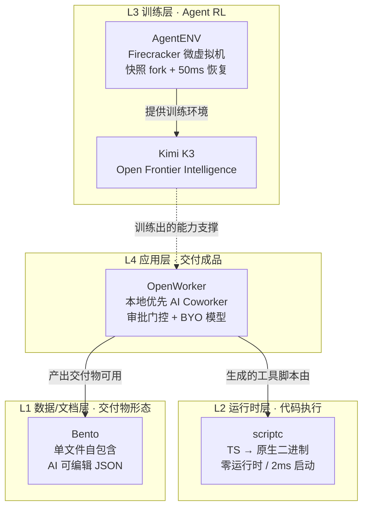

# GitHub 趋势研究简报 - 2026-07-29

> 本报基于 GitHub Search API（gh CLI）+ 仓库 README 深度阅读，聚焦架构师视角的真问题。数据采集时间：2026-07-29。

## 今日核心判断

今天 GitHub 趋势的信号非常一致：**Agent 基础设施栈正在从「能跑」走向「可大规模训练、可交付成品」**。四个项目从不同层共同验证同一件事——Agent 的价值不在于对话，而在于闭环交付与底层运行时的工程化。

1. **应用层（OpenWorker）**：Andrew Ng 把「AI 交付成品而非聊天」做成产品级桌面应用，审批门控是信任建模的核心。
2. **训练层（AgentENV）**：Moonshot 开源了为 Kimi K3 做 Agent RL 训练的 Firecracker 微虚拟机平台——这是 Agent 基础设施真正下沉到「虚拟化层」的标志性事件。
3. **语言运行时层（scriptc）**：Vercel Labs 让 TypeScript 摆脱 Node/V8 依赖，原生编译，Agent 生成代码的运行成本骤降。
4. **文档形态层（Bento）**：单文件自包含 + AI 可编辑 JSON，定义了「文件即软件」的本地优先文档新范式。

---

## 今日重点趋势

### 1. 本地优先 AI Coworker 范式：交付成品而非对话（评分 92）

OpenWorker（9.9K⭐，7 天内）是 Andrew Ng（吴恩达）亲自出品的开源项目，定位是**桌面端 AI Coworker**，核心差异点不是「能聊天」，而是**交付 finished work**：一份文档、一封带数据的 Slack 回复、一个更新过的日历、一个整理过的收件箱。

架构上值得注意的三点：
- **审批门控（approval-gated）**：所有写操作、发送、shell 命令执行前必须经过用户批准；无人值守的任务会把「待批准项」暂存到 inbox。这是 Agent 信任建模走向工程化的关键设计。
- **BYO 模型 + 本地优先**：支持 OpenAI / Anthropic / Google / GLM / DeepSeek / Kimi / Qwen / MiniMax / Mistral / Grok，以及 Ollama 全本地。数据只通过你选择的模型和集成离开机器。
- **基于 aisuite 构建**：Andrew Ng 自家的多模型抽象层，25+ 连接器（GitHub/Slack/Jira/Notion/Linear/HubSpot/Outlook/Gmail/Calendar），任何 MCP 工具可插入。

**架构师判断**：这代表了 Agent 应用层的正确形态——**本地运行、模型可换、动作需授权、交付成品**。对企业的吸引力在于数据不出域 + 模型供应链自主。真正的问题是 25+ 连接器的稳定性和 aisuite 抽象层的成熟度（仍在 beta）。

### 2. Agent RL 训练基础设施开源化：Firecracker 微虚拟机即服务（评分 90）

AgentENV（1.4K⭐，Rust）是 kvcache-ai 出品、**明确为 Kimi K3 的 Agent RL 训练提供底座**的分布式环境平台。这是今天最硬核的基础设施信号：

- **Firecracker microVM + overlaybd 按需加载**：大规模运行 OCI 镜像，本地磁盘做有界缓存（可超过磁盘容量），无需预热每台主机。
- **快照即资源**：环境启动/恢复 < 50ms，暂停 < 100ms；空闲环境快速释放 CPU/内存，有新工作时恢复。**增量快照内存+文件系统变更 < 100ms，即使在重度磁盘修改下。**
- **原生 fork**：一个运行中的环境可 fork 成多个独立沙箱，用于并行 agent 工作流。快照持久化到 S3 兼容对象存储。
- **密度与性能保持**：ublk 高性能 I/O，跨存储与内存快照共享主机页缓存，内存 ballooning 回收可回收内存，支持高 overcommit。

**架构师判断**：这是 Agent 训练基础设施从「论文」走向「可复现工程」的里程碑。当 RL 训练 Agent 需要「环境实例即 fork、即快照、即迁移」时，Firecracker + 快照语义是正确抽象。开源意味着中等规模团队也能复现头部实验室的训练管线。**风险**：强依赖 `/dev/kvm`（Linux 6.8+），当前无鉴权（仅限可信网络），生产化还需时日。

### 3. 零运行时语言编译：TS→Native 打破 JS 引擎依赖（评分 86）

scriptc（2.1K⭐，Vercel Labs）把普通 TypeScript 编译成小型快速的原生可执行文件——**二进制里没有 Node、没有 V8、没有任何 JS 引擎**。实测 `fib.ts` 编译出 178KB 二进制、2ms 启动。

技术亮点在于**三档静态度显式化**的设计哲学：
1. **静态编译**（默认）：原生代码，无引擎。覆盖类/闭包/泛型单态化/async-await 栈式协程/异常/解构/迭代器/正则等。
2. **动态运行**（`--dynamic`）：嵌入式 JS 引擎（quickjs-ng ~620KB）执行无法静态化的部分（npm 依赖的 JS、any 类型代码）。跨回静态代码的每个值运行时校验——撒谎的类型抛可捕获的 TypeError 而非损坏内存。
3. **拒绝**：其余全部带具体错误码、代码帧、重写提示地失败。**永不静默错误编译。**

`scriptc coverage` 命令逐构造报告静态覆盖率（实测一个 app 99% 语句可静态编译）。Node API 表面（fs/path/crypto/net/http/https/tls）和 WHATWG fetch 全部原生实现。

**架构师判断**：这对 Agent 生成代码的部署成本是降维打击——Agent 生成的 TS 工具可以直接编译成小二进制分发，无需 Node 运行时。Vercel Labs 出品意味着它瞄准的是 Edge/Serverless 场景的冷启动优化。局限：macOS arm64 为主平台，需 clang，动态 JS 仍需 quickjs-ng 兜底。

### 4. 单文件自包含应用 + AI 可编辑 JSON：本地优先文档新形态（评分 84）

Bento（2.8K⭐）把整套办公套件（幻灯片编辑器/播放器/协作）装进**单个 HTML 文件**（~560KB）。文件即软件——你发给对方，对方用任意浏览器打开就能编辑/播放，无需安装任何东西。

核心理念对立于「租用云文档」：
- **自重写保存**：文件用 File System Access API 重写自己的数据块（保存时把 deck 写回文件顶部），旧文件保留为回滚。
- **文档即纯 JSON**：数据是文件顶部一个可读的 JSON 块，无二进制格式。**Agent 可直接原地编辑 `.bento.html`**（`window.bento.loadDoc`），chatbot 可 round-trip JSON——无需插件、无需 API。
- **CRDT 协作**：自研 CRDT（字符级文本合并），离线编辑精确合并回来；同步 relay 是盲中继（只存密文）。
- **签名自更新 + ECDSA**：更新写入新文件，旧文件保留为回滚，服务器永不触碰文档。

**架构师判断**：「文件即软件 + AI 可编辑 JSON」是一个值得认真对待的范式。它让 Agent 与文档的交互从「调 API」退化为「读写文件」，降低了 Agent 生成/修改交付物的摩擦。对架构师的启发是：**为 AI 可编辑性设计的本地优先文档格式，可能成为 Agent 交付物的新载体**。

---

## 重点项目深度分析

### 🧑‍💻 OpenWorker — 9,965 stars · 平台候选 · Score 92

**评分明细（0-10）：**
| 维度 | 分 | 理由 |
|------|----|----|
| 热度质量 | 9 | Andrew Ng 个人品牌 + 7 天近万星 + 1307 fork |
| 技术创新度 | 7 | 范式创新（交付成品）强，底层基于 aisuite 属组合式创新 |
| 工程成熟度 | 6 | 公开 beta，Windows 未签名，打磨中 |
| 架构启发价值 | 9 | 审批门控 + 本地优先 + BYO 模型 = 企业 Agent 信任模型 |
| 企业落地潜力 | 8 | 数据不出域 + 模型供应链自主，PoC 价值高 |
| 中期趋势概率 | 9 | 本地优先 AI Coworker 是确定性趋势 |
| 平台化潜力 | 8 | 连接器 + MCP + 调度 = 平台雏形 |
| 基础设施潜力 | 5 | 更偏应用层，非底层 |

**总分 61/80** · **归类：平台候选** · **建议：深度跟踪 + PoC**

### ⚡ AgentENV — 1,411 stars · 基础设施候选 · Score 90

详见项目档案。这是今日最具基础设施价值的项目。

### 🔷 scriptc — 2,099 stars · 工具型 · Score 86

详见项目档案。TS→Native 编译器，Agent 代码部署成本降维。

### 🍱 Bento — 2,806 stars · 工具型 · Score 84

详见项目档案。文件即软件 + AI 可编辑 JSON。

---

## Agent 基础设施分层演化（今日视角）

## 风险与机遇

**机遇：**
- Agent RL 训练基础设施开源（AgentENV）意味着中等团队可复现头部实验室训练管线，降低 Agent 能力门槛。
- 本地优先 + 审批门控（OpenWorker）是企业 Agent 信任建模的正确方向，数据合规痛点被正面解决。
- TS→Native（scriptc）让 Agent 生成代码的分发成本趋近于零，Edge/Serverless 冷启动问题被结构性缓解。

**风险/泡沫点：**
- OpenWorker 仍在 beta，25+ 连接器稳定性未经规模化验证；Andrew Ng 个人品牌带动的热度需与工程成熟度分开看。
- AgentENV 当前无鉴权、强依赖 KVM，生产化前不可暴露公网——这是明确的早期阶段信号。
- scriptc 的「99% 可静态编译」在真实大型项目（含大量动态 npm 依赖）下可能退化，quickjs-ng 兜底的性能边界需实测。

---

## 重点项目档案

- 🧑‍💻 [openworker](projects/openworker.html) — 本地优先 AI Coworker
- ⚡ [agentenv](projects/agentenv.html) — Agent RL 训练 Firecracker 平台
- 🔷 [scriptc](projects/scriptc.html) — TypeScript→原生编译器
- 🍱 [bento](projects/bento.html) — 单文件自包含办公套件

---
> 数据来源: GitHub Search API (gh CLI) + 仓库 README 深度阅读 | 生成时间: 2026-07-29
