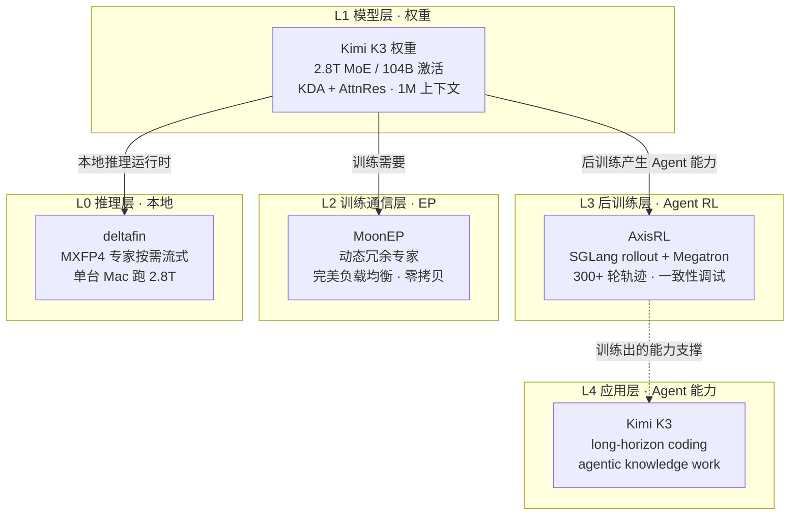

# GitHub 趋势研究简报 - 2026-07-30

> 本报基于 GitHub Search API（gh CLI）+ 仓库 README/技术报告深度阅读，聚焦架构师视角的真问题。数据采集时间：2026-07-30。

## 今日核心判断

今天 GitHub 趋势的信号高度集中：**Moonshot AI 发布 Kimi K3 —— 首个开源 3T 级模型，且在 72 小时内带动了一个完整的基础设施生态涌入 trending。** 这不是单点事件，而是一次"模型发布即生态动员"：模型权重（Kimi-K3）、训练通信库（MoonEP）、本地推理运行时（deltafin）、Agent RL 后训练框架（axrl）从不同层共同验证同一件事——**3T 级 MoE 的全栈工程化已经发生，且开源。**

1. **模型层（Kimi K3）**：2.8T 参数、104B 激活的 MoE，采用全新的 Kimi Delta Attention (KDA) + Attention Residuals (AttnRes) 架构，Stable LatentMoE（896 专家选 16），号称相比 K2 有约 2.5× 整体 scaling 效率提升。1M 上下文窗口 + 原生多模态（MoonViT-V2 视觉编码器）。
2. **训练通信层（MoonEP）**：专家并行（EP）通信库，用"动态冗余专家"实现每个 rank 恒定接收 `S×K` tokens 的完美均衡——零拷贝、静态形状，通信延迟低于 DeepEP v2 且对路由不均衡免疫。
3. **本地推理层（deltafin）**：社区项目，把 2.8T MoE 通过"专家按需 HTTP 流式加载到磁盘缓存"塞进单台 Apple Silicon Mac。M1 Max 64GB 实测 0.0687 token/s——是可行性的概念验证，远非生产可用。
4. **后训练框架层（AxisRL）**：Agentic RL 后训练框架，SGLang rollout + Megatron 训练，处理 300+ 轮轨迹与数百亿参数规模，直击多轮 Agent RL 的工程化难题。

> **证据边界声明**：本报告中 Kimi K3 的架构参数、评测分数来自仓库官方 README 与技术报告（可核验事实）；"2.5× scaling 效率提升"为官方声称（待独立复现）；deltafin 的 0.0687 token/s 为项目方在 M1 Max 上的单点实测（待观察，非生产指标）；评测对标项（Claude Fable 5 / GPT-5.6 等）为厂商自报，存在选择性披露风险。

---

## 今日重点趋势

### 1. Kimi K3 发布：3T 级开源模型 + 全栈基础设施同日涌现（评分 93）

Kimi-K3（5,511⭐，MoonshotAI 官方，7 月 27 日创建）是**首个开源的 3T 级模型**。核心架构事实（来自官方 README/技术报告）：

- **参数规模**：2.8T 总参数，104B 激活参数（MoE）。
- **新架构**：Kimi Delta Attention (KDA) + Attention Residuals (AttnRes)，93 层（1 Dense + 69 KDA + 24 Gated MLA）。
- **Stable LatentMoE**：896 个专家中选 16 个（+ 2 共享专家），官方称相比 Kimi K2 有约 2.5× 整体 scaling 效率提升（待独立验证）。
- **上下文**：1,048,576 tokens（1M）。
- **量化**：MXFP4 权重 / MXFP8 激活（量化感知训练）。
- **多模态**：原生支持文本 + 图像，MoonViT-V2 视觉编码器（401M 参数）。
- **定位**：long-horizon coding、agentic knowledge work、reasoning。

**官方评测对标**（来自仓库 README，厂商自报，存在选择性披露风险）：在 GPQA Diamond（93.5）、Terminal-Bench 2.1（88.3）、ProgramBench（77.8）等基准上对标 Claude Fable 5、GPT-5.6 Sol、GPT-5.5、GLM-5.2、Claude Opus 4.8。其中 SWE-Marathon（42.0）和 Terminal-Bench 2.1（88.3）表现突出，但部分项（FrontierSWE 81.2 vs Claude Fable 5 的 86.6）落后。

**架构师判断**：这是开源模型规模的新里程碑——首个公开权重的 3T 级模型。但"开源 3T"的真正价值不在于跑分本身，而在于它**同日带动了整条基础设施链**：MoonEP（怎么训练）、deltafin（怎么本地跑）、axrl（怎么做 Agent RL）。一个模型发布能动员社区在训练、推理、后训练三层同时产出，说明 MoE 工程化的知识已经足够下沉。**待观察**：独立复现的评测结果、实际推理成本、长上下文稳定性。

### 2. MoE 训练通信库赛道：MoonEP 动态冗余专家对标 DeepEP（评分 88）

MoonEP（858⭐，MoonshotAI 官方，MIT）是一个**专家并行（Expert Parallelism）通信库**，核心创新是用"动态冗余专家"（dynamic redundant experts）实现**完美负载均衡**：

- **完美均衡**：每个 rank 恒定接收 `S × K` tokens，无论路由多倾斜——通过在线规划冗余专家、预取后反向传播梯度。
- **零拷贝 + 静态形状**：融合 permute/unpermute，token 直接写到远程 rank 的专家分组位置，返回 buffer view 给计算层。固定 `S × K` buffer，静态形状消除逐层 MoE 主机同步。
- **对标 DeepEP v2**（官方 benchmark，H20 EP=8）：MoonEP 通信时间在所有不均衡水平下低于 DeepEP v2；DeepEP 延迟由最热 rank 决定、随不均衡退化，MoonEP 几乎不受影响。端到端训练中 DeepEP 在高不均衡下会因内存碎片 OOM，MoonEP 不受影响。

**架构师判断**：这是大规模 MoE 训练的硬核基础设施贡献。EP 通信的负载不均衡是 MoE 扩展的核心瓶颈——MoonEP 用"冗余专家"把均衡问题从"接受不均衡"转为"主动消除不均衡"，静态形状还顺带解决了内存碎片。这直接关系到 K3 这种 896 专家模型的训练可行性。**注意**：benchmark 是项目方自报（H20 EP=8），独立复现待验证；当前仅支持 NVIDIA GPU（振武 PPU 在审）。

### 3. 超参数模型本地推理边界探索：2.8T MoE 按需流式加载进单机（评分 84）

deltafin（308⭐，gavamedia，社区项目）是一个**实验性项目**，探索在单台工作站上运行远超内存容量的 MoE 模型：

- **核心机制**：MXFP4 专家按需经 HTTP 流式加载到本地磁盘缓存，融合 NEON 内核 + Metal/MPS 计算，贪心解码、可复现。
- **实测**：M1 Max 64GB 上 0.0687 token/s（14.6 秒/token）——明确标注为"一台初代机器的参考值，非新硬件上限"。
- **跨平台**：macOS Apple Silicon + Linux x86-64/aarch64，自动选择 MPS/CUDA/CPU。

**架构师判断**：这更像一个"我们能跑多远"的极限探索，而非实用推理方案（14.6s/token 无法用于交互）。但它的工程价值在于验证了一个范式——**MoE 的稀疏性（2.8T 中仅激活 104B）使得"专家按需加载"在原理上可行**，磁盘缓存 + 静态形状让重复专家命中本地。这对边缘/离线场景的超大 MoE 部署有启发。**待观察**：在更高内存机器（如 192GB M3 Ultra）上的实际吞吐、专家缓存命中率。

### 4. Agent 后训练框架成熟化：多轮 Agent RL 走向工程化（评分 83）

AxisRL（569⭐，XYZ AI Lab，Apache-2.0）是 **Agentic RL 后训练框架**，把多轮 Agent 强化学习的系统层工程化：

- **引擎组合**：SGLang（高吞吐 rollout）+ Megatron（大规模分布式训练）。
- **规模**：用于 300+ 轮轨迹的 Agent RL 工作流，数百亿参数规模训练。
- **多目标**：PPO、GRPO/GRPO2、GSPO、TOPR、TIS 等可配置策略。
- **核心工程问题**：rollout-trainer 一致性——tokenization、chat template、logprobs、routing、packing、weight sync 的微小差异会导致 loss spike / reward 不稳定。AxisRL 提供 mismatch 分析、routing replay、spike replay 做可复现调试。

**架构师判断**：这呼应了昨日 AgentENV（Firecracker 微虚拟机为 K3 Agent RL 训练提供环境）的信号——**Agent RL 的工程化正在从"能跑"走向"可观测、可复现"**。AxisRL 关注的不是环境实例（那是 AgentENV 的范畴），而是 rollout 与 trainer 之间的一致性契约。两者是互补关系。

---

## 重点项目深度分析

### 🧠 Kimi K3 — 5,511 stars · 基础设施候选 · Score 93

**评分明细（0-10）：**

| 维度 | 分 | 理由 |
|------|----|----|
| 热度质量 | 9 | 官方发布 + 3 天 5.5K⭐ + 397 fork + 11 issues，真模型权重 |
| 技术创新度 | 9 | 首个开源 3T 级；KDA + AttnRes 新注意力架构；Stable LatentMoE |
| 工程成熟度 | 7 | 权重已发布可下载；但生态（推理/部署）刚起步 |
| 架构启发价值 | 9 | 896 专家 + 16 激活 + 2.5× scaling 效率声称重新定义 MoE 扩展曲线 |
| 企业落地潜力 | 7 | 2.8T 参数推理成本高；需量化/蒸馏才能落地 |
| 中期趋势概率 | 9 | 开源前沿模型权重是确定性趋势；3T 是新标杆 |
| 平台化潜力 | 6 | 模型本身非平台，但带动生态（MoonEP/deltafin/axrl）|
| 基础设施潜力 | 8 | 作为基础设施级模型权重，定义新的训练/推理需求 |

**总分 64/80** · **归类：基础设施候选** · **建议：深度跟踪 + 评测复现**

### ⚖️ MoonEP — 858 stars · 基础设施候选 · Score 88

详见项目档案。MoE 训练通信库，完美负载均衡，对标 DeepEP v2。

### 🍎 deltafin — 308 stars · 观察型 · Score 84

详见项目档案。2.8T MoE 单机推理极限探索。

### 🔄 AxisRL — 569 stars · 基础设施候选 · Score 83

详见项目档案。多轮 Agent RL 后训练框架，rollout-trainer 一致性工程化。

---

## Kimi K3 全栈基础设施分层（今日视角）

## 风险与机遇

**机遇：**
- **开源 3T 级模型 + 全栈基础设施同日涌现**：K3 模型权重 + MoonEP 训练通信库 + deltafin 本地推理 + axrl Agent RL，让中等团队第一次能接触到前沿模型的训练/推理/后训练全链路。MoE 工程化知识的下沉是结构性变化。
- **MoonEP 的"完美均衡"思想**：把 EP 负载不均衡从"接受现实"转为"主动消除"，静态形状顺带解决内存碎片——这对所有大规模 MoE 训练有借鉴价值，不限于 K3。
- **MoE 稀疏性使超参数模型本地推理在原理上可行**（deltafin 验证）：2.8T 中仅激活 104B，专家按需加载是合理工程方向。

**风险/泡沫点：**
- **K3 评测为厂商自报**：对标 Claude Fable 5 / GPT-5.6 等的分数存在选择性披露风险；GPQA 93.5、Terminal-Bench 88.3 等需独立复现。"2.5× scaling 效率"为官方声称（待验证）。
- **2.8T 参数的推理成本**：即使 MoE 仅激活 104B，2.8T 权重的存储与带宽需求极高；deltafin 的 14.6s/token 说明单机推理远非实用，企业落地需大量量化/蒸馏工程。
- **MoonEP benchmark 为项目方自报**（H20 EP=8），与 DeepEP v2 的对比需独立验证；当前仅支持 NVIDIA GPU。
- **热度 ≠ 价值**：K3 的 5.5K⭐ 部分来自 Moonshot 品牌效应与"首个开源 3T"的话题性，模型实际能力与生产成熟度需分开评估。

---

## 重点项目档案

- 🧠 [kimi-k3](projects/kimi-k3.html) — 首个开源 3T 级模型
- ⚖️ [moonep](projects/moonep.html) — MoE 专家并行完美负载均衡通信库
- 🍎 [deltafin](projects/deltafin.html) — 2.8T MoE 单台 Mac 推理
- 🔄 [axrl](projects/axrl.html) — Agentic RL 后训练框架

---
> 数据来源: GitHub Search API (gh CLI) + 仓库 README/技术报告深度阅读 | 生成时间: 2026-07-30
