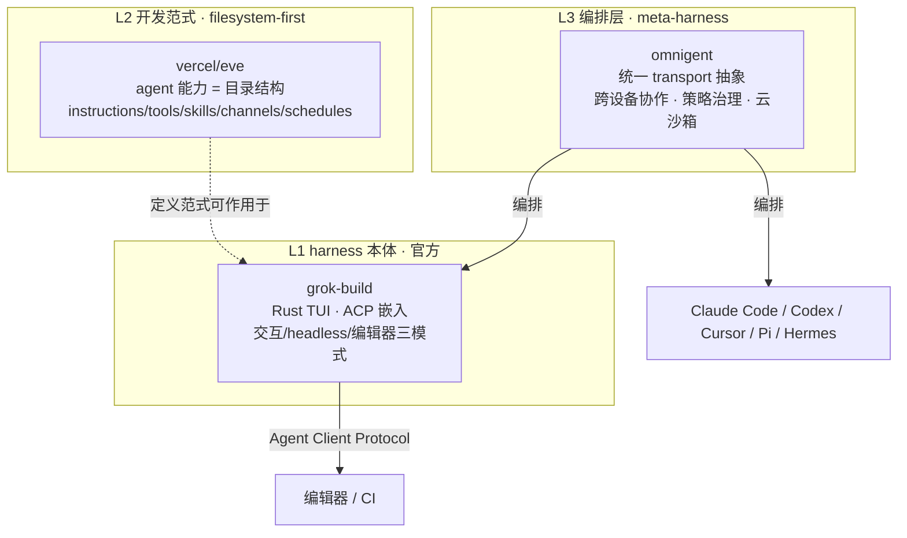

# GitHub 趋势研究简报 - 2026-07-31

> 本报基于 GitHub Search API（gh CLI）+ 仓库 README 深度阅读，聚焦架构师视角的真问题。数据采集时间：2026-07-31。

## 今日核心判断

今天 GitHub 趋势的信号从昨日的\"单一模型发布动员生态\"转向**两条结构性主线叠加**：

1. **Coding agent harness 层进入多极化竞争**。SpaceXAI 官方开源 `grok-build`（23.5K⭐，Rust TUI），与 omniscent 的 `omnigent`（meta-harness，7.9K⭐）和 Vercel 的 `eve`（filesystem-first，4.2K⭐）在三个不同抽象层次同时放量。这不是偶然同框——它说明 **\"coding agent 的 harness/编排层\"正在从单一工具变成一个独立品类**，且官方实验室（SpaceXAI）、框架厂（Vercel）、社区（omnigent）各占一条路线。
2. **前沿 MoE 本地推理从\"极限探索\"固化为\"工程范式\"**。`colibri` 在 19 天内从 3.85K 飙至 21K⭐，纯 C、零依赖、把 744B MoE 跑上消费硬件。它的工程内核（VRAM/RAM/存储三级内存层级 + 专家按需流式 + LRU 预取）与昨日追踪的 deltafin（K3 单机）是同一范式家族——**MoE 稀疏性使\"前沿模型跑在已有硬件上\"从噱头变成可复现的工程路径**。

与此同时，昨日的主角 **Kimi K3 全栈生态仍在深化**：K3 5.5K→7.5K、MoonEP 858→923、deltafin 308→466、axrl 569→641、AgentENV 1.4K→2.6K——五层（模型/训练通信/本地推理/后训练/环境）齐增。这验证了昨日\"模型发布即生态动员\"的判断仍在生效。

> **证据边界声明**：star 数、fork 数、创建时间、license、语言均来自 GitHub API（可核验事实）。\"harness 层成为独立品类\"\"本地推理范式确立\"为基于多个独立项目同框的**推断**（待后续多周数据验证持续性）。grok-build 的 README 自述为\"SpaceXAI's coding agent harness\"（照录原文）；其 contributors 接口当前仅返回 1 个贡献者、无正式 release tag，源码\"periodically synced from the SpaceXAI monorepo\"——这些是**待观察项**，不代表其工程成熟度。

---

## 今日重点趋势

### 1. Coding agent harness 多极化：官方入场 + meta-harness + filesystem-first 三线并进（评分 90）

三条路线在同一周内同时放量，且抽象层次互补：

- **官方厂商 harness（grok-build）**：`xai-org/grok-build`，23,556⭐ / 4,478 fork，Rust，Apache-2.0，2026-07-14 创建。README 自述为\"SpaceXAI's coding agent harness and TUI\"——全屏鼠标交互 TUI，理解代码库、编辑文件、执行 shell、搜索网页、管理长任务；支持交互式、headless（脚本/CI）、经 Agent Client Protocol (ACP) 嵌入编辑器三种模式。预编译二进制覆盖 macOS/Linux/Windows。这是**头部 AI 实验室把自家 coding agent harness 完整开源**的信号，与 OpenAI 的 Codex、Anthropic 的 Claude Code 同台。
- **meta-harness 编排层（omnigent）**：`omnigent-ai/omnigent`，7,924⭐ / 1,177 fork，Python，Apache-2.0，alpha。定位\"Agent 层的编排\"——不替换你的 agent，用统一 transport 抽象层管理 Claude Code/Codex/Cursor/OpenCode/Hermes/Pi + 自定义 agent，跨设备实时协作、策略治理（审批/预算/工具限制）、云沙箱（Modal/Daytona/Islo/E2B/CoreWeave/K8s 等）。
- **filesystem-first 开发框架（vercel/eve）**：`vercel/eve`，4,198⭐ / 407 fork，TypeScript，Apache-2.0。把 agent 能力映射为约定目录结构（`instructions.md`/`tools/`/`skills/`/`channels/`/`schedules/`），\"filesystem is the authoring interface\"，30 天从 1.3K 增至 4.2K。

**架构师判断**：三者抽象层次不同——grok-build 是\"一个 harness 本体\"，eve 是\"用文件系统定义 harness 的开发范式\"，omnigent 是\"在多个 harness 之上的编排层\"。它们同框放量说明：**当 coding agent 数量超过用户能手动切换的阈值，\"harness 本身\"与\"跨 harness 编排\"就会各自成为独立品类**。这是 Agent 工具链分层成熟的结构性信号。**风险**：grok-build 当前 contributors 接口仅返回 1、无 release tag（源码从 monorepo 周期同步），生产成熟度待独立评估；omnigent 仍为 alpha。

### 2. 前沿 MoE 本地推理范式确立：colibri 纯 C 引擎把 744B MoE 跑上消费硬件（评分 87）

`JustVugg/colibri`（21,218⭐ / 2,206 fork，C，Apache-2.0，2026-07-01 创建，v1.1.0）在 19 天内从 7 月 12 日的 3,850⭐ 飙至 21K⭐——**这是本周本地推理赛道最强的增长信号**。核心机制（来自 README，可核验）：

- **统一内存层级**：把 VRAM、RAM、NVMe storage 当作同一份权重的放置层级；\"有限快内存改变速度，不改变模型语义\"——默认策略\"never silently changes model precision or router semantics\"。
- **专家按需流式 + JIT**：路由热度驱动 per-layer LRU + 学习型 pinned hot-store + 一层提前预取；batched expert unions、`O_DIRECT`、双 SSD 加权条带化攻击流式路径。
- **异构执行**：CPU/CUDA/Metal/NUMA/部分或全专家驻留共享同一 runtime。
- **可观测**：Web dashboard 实时展示 token 指标、每轮时间分解、VRAM/RAM/disk 三级条；\"Brain\" 页把全部专家可视化为活体皮层。

README 公开实测：6× RTX 5090 全专家驻留下 4 tok/s、TTFT 1.6s、disk 0（即无需磁盘流式）。

**架构师判断**：colibri 把昨日 deltafin（K3 单机 14.6s/token）验证的\"MoE 稀疏性 → 专家按需加载\"范式，推进到了**多 GPU 全驻留可用吞吐**的区间。与 deltafin 一起，二者共同确立了一个工程范式家族：**前沿 MoE 的推理瓶颈是 I/O 与放置策略，而非 FLOPS**。colibri 的价值在于它把这件事做到了\"纯 C、零引擎依赖、token 级可验证\"的参考实现程度。**待观察**：6×5090 配置门槛仍高；单人项目（bus factor=1）；非 SLA 研究运行时。

### 3. Kimi K3 全栈生态持续深化（评分 84，连续性追踪）

昨日主角 Kimi K3 的全栈基础设施在一日内集体增长，验证\"模型发布即生态动员\"判断仍在延续：

| 层 | 项目 | 昨日(07-30) | 今日(07-31) | 增量 |
|----|------|------------|------------|------|
| 模型权重 | MoonshotAI/Kimi-K3 | 5,511 | 7,520 | +2,009 |
| 训练通信 | MoonshotAI/MoonEP | 858 | 923 | +65 |
| 本地推理 | gavamedia/deltafin | 308 | 466 | +158 |
| 后训练 | XYZ-AI-Lab/axrl | 569 | 641 | +72 |
| 训练环境 | kvcache-ai/AgentENV | ~1,411 | 2,595 | +1,184 |

**架构师判断**：AgentENV（+1,184）与 K3（+2,009）增速最陡，说明\"3T 级 MoE + Agent RL 环境\"的组合仍在吸引注意。但需区分**热度与价值**：K3 评测仍为厂商自报（待独立复现），AgentENV 54 open issues 说明工程尚早。生态\"齐增\"证明的是社区注意力，不等于各层已生产可用。

---

## 重点项目深度分析

### 🛰️ grok-build — 23,556 stars · 基础设施候选 · Score 90

**评分明细（0-10）：**

| 维度 | 分 | 理由 |
|------|----|----|
| 热度质量 | 9 | 官方实验室开源 + 17 天 23.5K⭐ + 4.5K fork，Rust 工程化 |
| 技术创新度 | 7 | TUI/ACP 嵌入/headless 三模式是工程整合，非基础架构创新 |
| 工程成熟度 | 6 | 源码从 monorepo 周期同步，contributors 接口仅 1，无 release tag（待观察）|
| 架构启发价值 | 8 | 头部实验室把 coding agent harness 完整开源，定义 harness 品类基线 |
| 企业落地潜力 | 7 | 预编译三平台二进制降低部署门槛，但生产成熟度待验证 |
| 中期趋势概率 | 8 | 官方背书的 coding agent 是确定性品类 |
| 平台化潜力 | 7 | ACP 协议可被其他编辑器嵌入，有平台化路径 |
| 基础设施潜力 | 8 | 作为 coding agent harness 基础设施候选 |

**总分 60/80** · **归类：基础设施候选** · **建议：跟踪官方 release 节奏与 ACP 生态采纳**

### 🐦 colibri — 21,218 stars · 基础设施候选 · Score 87

详见项目档案。纯 C/零依赖 GLM-5.2 744B MoE 引擎，统一内存层级 + 专家按需流式。

### 🤖 omnigent — 7,924 stars · 平台候选 · Score 85

详见项目档案。Agent meta-harness，统一编排多 harness + 跨设备协作 + 策略治理。

### 🌙 vercel/eve — 4,198 stars · 平台候选 · Score 83

详见项目档案。Filesystem-first durable agent 框架，agent 能力即目录结构。

---

## Coding Agent Harness 分层（今日视角）

## 风险与机遇

**机遇：**
- **harness 层成为独立品类**：当 coding agent 超过手动切换阈值，harness 本体（grok-build）、开发范式（eve）、跨 harness 编排（omnigent）各自成赛道。对架构师意味着：选型需在\"用谁的 harness\"\"怎么定义 agent\"\"怎么编排多个 agent\"三个维度分别决策。
- **本地前沿 MoE 推理范式确立**：colibri + deltafin 共同验证\"MoE 推理瓶颈是 I/O/放置而非 FLOPS\"，对边缘/离线/私有部署有结构性启发——6×5090 全驻留已到 4 tok/s 可用区间。

**风险/泡沫点：**
- **grok-build 工程成熟度待证**：contributors 接口仅 1、无 release tag、源码从 monorepo 周期同步——这些是 GitHub API 可核验的事实缺口，不代表不成熟但需独立评估，不应因\"官方\"光环等同于生产可用。
- **colibri bus factor=1**：单人项目，21K⭐ 部分来自\"纯 C 跑 744B\"的话题性；非 SLA 研究运行时，不应作为生产推理方案。
- **热度 ≠ 价值**：K3 生态五层齐增证明的是社区注意力，不等于各层生产成熟；K3 评测、MoonEP benchmark 均为自报（待独立复现）。
- **harness 品类可能被原生能力收编**：若 Claude Code/Codex 原生支持多 agent 编排，omnigent 的 meta-harness 价值会下降（adapter 维护成本高、抽象越深越脆弱）。

---

## 重点项目档案

- 🛰️ [grok-build](projects/grok-build.html) — SpaceXAI 官方 coding agent harness 与 TUI
- 🐦 [colibri](projects/colibri.html) — 纯 C/零依赖 GLM-5.2 744B MoE 推理引擎
- 🤖 [omnigent](projects/omnigent.html) — Agent meta-harness 编排层
- 🌙 [eve](projects/eve.html) — Filesystem-first durable agent 框架

---
> 数据来源: GitHub Search API (gh CLI) + 仓库 README 深度阅读 | 生成时间: 2026-07-31
