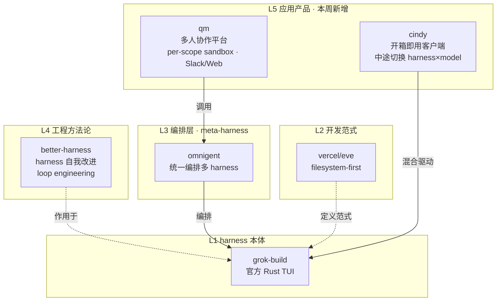

# GitHub 趋势研究简报 - 2026-08-01

> 本报基于 GitHub Search API（gh CLI）+ 仓库 README 深度阅读，聚焦架构师视角的真问题。数据采集时间：2026-08-01。

## 今日核心判断

今天的 GitHub 趋势出现两个清晰的信号转移：

1. **Coding agent 的竞争前沿从"harness 本体"转移到"应用层产品形态"**。昨天（07-31）我们观察到 grok-build/omnigent/eve 三条路线在 harness 层多极化；今天这个趋势进一步扩散到**应用层**：`qm`（1.4K⭐）把 harness 做成**多人协作平台**（每人独立沙箱+Slack 集成）；`cindy`（1.3K⭐）把多 harness 做成**开箱即用的桌面/移动客户端**；`better-harness`（1.3K⭐）则走向**harness 工程化方法论**。这意味着——**当 harness 本身成为基础设施，"怎么用 harness 交付产品"就变成了新战场**。

2. **边缘/微型推理的边界被推到了物理极限**。`esp32-ai`（2.6K⭐）用 Google 的 Per-Layer Embeddings 思路，把 28.9M 参数 LLM 塞进 512KB SRAM 的 ESP32-S3（8 美元），靠把 25M 参数表留在 flash、每 token 只读 ~450B 实现 9.5 tok/s。这与本周追踪的 colibri（744B MoE 跑消费 GPU）、deltafin（2.8T 跑单台 Mac）是**同一个范式家族的极端验证**——"模型推理瓶颈是内存放置策略，而非算力"。quill（3.2K⭐）则把这个思路用于**全本地 macOS 会议转录**，用 Parakeet TDT 0.6B 做端侧 ASR。

与此同时，昨日主角 Kimi K3 生态仍在增长但**斜率明显趋平**：K3 7,520→7,709（+189，昨日 +2,009）、AgentENV 2,595→2,690（+95，昨日 +1,184）。MoonEP/deltafin/axrl 增量更小。这说明"模型发布即生态动员"的脉冲效应正在衰减，注意力开始转移。

> **证据边界声明**：star 数、fork 数、创建时间、license、语言均来自 GitHub API（可核验事实）。"harness 竞争前沿转移"和"边缘推理范式家族"为基于多个独立项目同框的**推断**（待后续多周数据验证）。esp32-ai 的 9.5 tok/s、28.9M 参数、Per-Layer Embeddings 来源均为作者 README 自述（含作者自述的参数计数 bug 修正历史），模型仅训练于 TinyStories、不能回答问题或执行指令——这是**能力边界**，非推理速度的夸大。qm/cindy 均为早期项目，生产成熟度未经验证。

---

## 今日重点趋势

### 1. Coding agent 应用层产品化：多人协作平台 / 开箱即用客户端 / harness 工程化（评分 88）

昨天 harness 层的"三线并进"（grok-build/omnigent/eve）在今天扩散为应用层的多种产品形态。三个项目创建于同一周（7/21-7/29），各自占据一个产品方向：

- **多人协作平台（qm）**：`yc-software/qm`，1,367⭐ / 125 fork，TypeScript，MIT，2026-07-29 创建。定位"multiplayer agent harness for work"——不是个人助手，而是**面向初创团队**的共享 agent。每人/每房间有独立 scope（记忆、文件、keychain、权限、crons、web apps、durable sandbox），可在 Slack 和 Web 间无缝切换。统一编排 Pi/OpenCode/Claude Code/Codex，支持 org 级安全策略（Strict/Auto/Dangerous 三档）。
- **开箱即用客户端（cindy）**：`makecindy/cindy`，1,260⭐ / 161 fork，TypeScript，Apache-2.0，2026-07-22 创建。定位"open-source AI agent that works out of the box"——Electron 桌面 + React Native 移动客户端，首个支持 Claude Code 和 Codex 两个 harness，**可在任务中途切换 harness×model 组合**而工作区/记忆/技能/工具保持连续。本地运行，用真实文件和已登录应用。
- **harness 工程化方法论（better-harness）**：`QoderAI/better-harness`，1,309⭐ / 104 fork，JavaScript，MIT，2026-07-21 创建。定位"help your coding agents get better at getting better"——不是新 harness，而是让现有 harness（Claude Code/Codex/Qoder/Cursor）**自我改进**的工程化框架，topics 含 `harness-design`/`harness-engineering`/`loop-engineering`。

**架构师判断**：这三个项目与昨天的 grok-build/omnigent/eve 构成了一条清晰的**分层演进链**：harness 本体（grok-build）→ harness 编排（omnigent）→ harness 开发范式（eve）→ **harness 应用产品（qm/cindy）+ harness 工程方法论（better-harness）**。当底层 harness 成为商品，产品化的竞争自然上移。值得注意：qm 的"多人 scope + Slack 集成"与 cindy 的"多 harness 混合驱动"分别代表了**协同维度**和**异构组合维度**的差异化。**风险**：均为早期项目（创建 7-11 天），star 在 1.2K-1.4K 区间，社区验证尚浅；qm 和 cindy 的"开箱即用"承诺依赖 Claude Code/Codex 的稳定性，而这些 harness 本身仍在快速迭代。

### 2. 边缘推理边界推到物理极限：esp32-ai 把 28.9M LLM 跑上 8 美元微控制器（评分 85）

`slvDev/esp32-ai`（2,627⭐ / 322 fork，Python，MIT，2026-07-23 创建）代表了本周"边缘推理"趋势的极端案例。核心机制（README 自述，可核验）：

- **Per-Layer Embeddings 下沉到微控制器**：借鉴 Google Gemma 3n/4 的 Per-Layer Embeddings 设计，把 25M 参数的 embedding 表留在 flash（慢速大容量），只把"思考核心"（每 token 实际计算的参数）放在 SRAM（512KB 快速内存）。每 token 仅从 flash 读取 ~450B（约 6 行），"大部分参数从不被加载，只是坐在 flash 里被少量采样"。
- **三级内存布局**：SRAM（快/小）放思考核心 → PSRAM（中速）放输出头和工作内存 → FLASH（大/慢）放 25M 参数表。
- **实测数据**：ESP32-S3（512KB SRAM + 8MB PSRAM + 16MB flash），28.9M 参数，4-bit 量化后 14.9MB，端到端 ~9.5 tok/s（纯计算 9.7 tok/s），完全离线。
- **诚实的能力边界**：模型训练于 TinyStories，只能写简单的短故事，**不能回答问题、执行指令、写代码或掌握事实**。作者明确指出："The memory trick does not change [the reasoning limit]... What is interesting here is the architecture, fitting a large model onto a tiny chip, rather than what a 28.9 million parameter model can say."

与此同框的 `digimata/quill`（3,195⭐ / 193 fork，Swift，MIT，2026-07-24 创建）把同一思路用于实用工具：极简全本地 macOS 会议录音+转录。单 Swift 二进制、菜单栏托盘、麦克风+系统音频双轨录制（免费两方话者分离），用 Parakeet TDT 0.6B v2 经 Core ML 端侧转录（Apple Silicon 约 20s/小时音频），数据完全不离机。

**架构师判断**：esp32-ai 与本周的 colibri（744B MoE / VRAM-RAM-NVMe 三级）、deltafin（2.8T MoE / HTTP 流式）共享同一个核心洞察——**"模型推理瓶颈是内存放置策略，而非算力"**，但把它推到了前所未有的极端（512KB SRAM）。Per-Layer Embeddings 的"把不计算的参数留在慢存储"与 MoE 的"把不激活的专家留在磁盘"是同一原理的两种表现。quill 则证明这个范式在**端侧实用工具**上已有可交付的产品形态。**待观察**：esp32-ai 是单人项目（README 含作者自述的参数计数 bug 修正历史）、0 releases、模型能力极有限；其价值在架构启发而非实用。quill 的 2 contributors 同样偏小团队。

### 3. Kimi K3 全栈生态延续增长，但斜率趋平（评分 80，连续性追踪）

昨日主角 Kimi K3 的全栈基础设施仍在增长，但增速明显放缓：

| 层 | 项目 | 昨日(07-31) | 今日(08-01) | 增量 | 昨日增量 |
|----|------|------------|------------|------|---------|
| 模型权重 | MoonshotAI/Kimi-K3 | 7,520 | 7,709 | +189 | +2,009 |
| 训练环境 | kvcache-ai/AgentENV | 2,595 | 2,690 | +95 | +1,184 |
| 训练通信 | MoonshotAI/MoonEP | 923 | 958 | +35 | +65 |
| 后训练 | XYZ-AI-Lab/axrl | 641 | 750 | +109 | +72 |
| 本地推理 | gavamedia/deltafin | 466 | 553 | +87 | +158 |

**架构师判断**：K3（+189）和 AgentENV（+95）的增量较昨日（+2,009 / +1,184）下降约一个数量级，说明"模型发布即生态动员"的**脉冲效应正在衰减**。axrl（+109）和 deltafin（+87）逆势保持正增长，说明后训练和本地推理方向仍有独立关注度。但整体而言，注意力正在从 K3 生态向新的热点（harness 应用层、边缘推理）转移。**注意区分热度与价值**：K3 评测仍为厂商自报（待独立复现），生态"增长趋平"不等于价值下降——它只是说明社区的发现阶段接近完成。

---

## 重点项目深度分析

### 👥 qm — 1,367 stars · 平台候选 · Score 86

**评分明细（0-10）：**

| 维度 | 分 | 理由 |
|------|----|----|
| 热度质量 | 7 | 3 天 1.4K⭐，fork 125 说明有试用意愿 |
| 技术创新度 | 8 | "多人 scope + Slack/Web 统一身份"是协同维度的真实差异化 |
| 工程成熟度 | 6 | 早期项目，部署目录架构清晰但生产验证缺失 |
| 架构启发价值 | 8 | per-scope durable sandbox + harness 无关 core 是清晰的分层 |
| 企业落地潜力 | 7 | 面向初创团队定位精准，安全策略三档设计合理 |
| 中期趋势概率 | 7 | harness 应用化是确定方向，但竞争激烈 |
| 平台化潜力 | 8 | web apps + shared skills + admin control 有平台骨架 |
| 基础设施潜力 | 6 | 更偏应用层而非基础设施 |

**总分 57/80** · **归类：平台候选** · **建议：跟踪 Slack 集成深度与 per-scope 沙箱的隔离强度**

### 🔧 esp32-ai — 2,627 stars · 观察型 · Score 83

详见项目档案。28.9M LLM on $8 ESP32-S3，Per-Layer Embeddings + flash 参数表。

### 🎯 cindy — 1,260 stars · 平台候选 · Score 82

详见项目档案。开箱即用多 harness agent 客户端，任务中途切换 harness×model。

### 🪶 quill — 3,195 stars · 工具型 · Score 81

详见项目档案。极简全本地 macOS 会议录音+转录，Parakeet TDT 端侧 ASR。

---

## Coding Agent 分层演进（今日视角）

## 风险与机遇

**机遇：**
- **harness 应用层是新蓝海**：当 grok-build/omnigent/eve 把 harness 基础设施铺设完毕，"怎么用 harness 交付多人协作产品"（qm）、"怎么让非技术用户开箱即用"（cindy）成为差异化战场。对架构师意味着：选 harness 只是第一步，产品形态设计才是竞争核心。
- **边缘推理范式家族成型**：esp32-ai（512KB SRAM）、quill（macOS 端侧）、colibri（多 GPU）、deltafin（单台 Mac）共同验证"推理瓶颈是内存放置策略"。对嵌入式/IoT/隐私场景有结构性启发——离线 AI 不再是噱头而是工程路径。

**风险/泡沫点：**
- **应用层项目均为早期**：qm/cindy/better-harness 创建于 7/21-7/29，star 1.2K-1.4K，生产成熟度未经验证。它们的"开箱即用"承诺依赖 Claude Code/Codex 的稳定性，而这些 harness 本身仍在快速迭代——**上游 breaking change 可能使下游应用层项目维护成本激增**。
- **esp32-ai 能力边界常被误读**：28.9M 参数 + 9.5 tok/s 的数字容易让人高估其实用性。作者明确声明模型仅能写 TinyStories 级别的短故事，不能问答/指令/编码。**热度（2.6K⭐）来自"把 LLM 塞进微控制器"的话题性，而非产品成熟度**。
- **K3 生态增长趋平≠价值下降**：增量下降一个数量级是注意力转移的正常表现，不代表 K3 或其生态项目的技术价值降低。但需警惕"趋平"被误读为"失败"。
- **harness 品类可能被原生能力收编**：若 Claude Code/Codex 原生支持多人协作或多 harness 混合，qm/cindy 的差异化会被削弱（重复昨日判断，但应用层比编排层更脆弱）。

---

## 重点项目档案

- 👥 [qm](projects/qm.html) — 多人协作 agent harness for work
- 🔧 [esp32-ai](projects/esp32-ai.html) — 28.9M LLM on $8 ESP32-S3 微控制器
- 🎯 [cindy](projects/cindy.html) — 开箱即用多 harness agent 客户端
- 🪶 [quill](projects/quill.html) — 极简全本地 macOS 会议录音+转录

---
> 数据来源: GitHub Search API (gh CLI) + 仓库 README 深度阅读 | 生成时间: 2026-08-01
