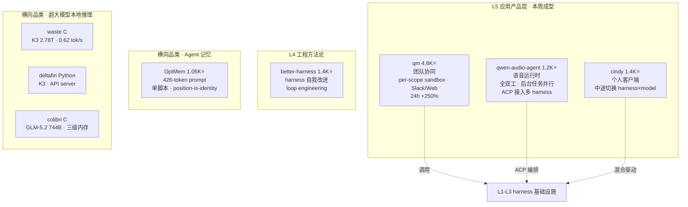

# GitHub 趋势研究简报 - 2026-08-02

> 本报基于 GitHub Search API（gh CLI）+ 仓库 README 深度阅读，聚焦架构师视角的真问题。数据采集时间：2026-08-02。

## 今日核心判断

今天的 GitHub 趋势出现一个**可核验的爆发信号**和两个**新成型的品类**：

1. **qm 单日爆发（+250%）把"harness 应用层产品化"从趋势判断升级为既成事实**。昨日我们判断 qm（1,367⭐）代表 harness 竞争前沿向应用层转移；今天 qm 在 24h 内飙至 **4,782⭐（+3,415，+250%）**，fork 同步从 125 涨到 469（+344）。这是可核验事实——它现在是本周全站搜索（created>2026-07-20, stars>300）里**仅次于 Kimi-K3 本体**的第二名，且增速远超 K3（K3 今日仅 +108）。与此同时，`qwen-audio-agent`（1,181⭐）以**全双工实时语音 + 后台任务并行**的形态加入应用层——它把 agent 做成"始终在场的语音助理"，后台 Agent 经 ACP 接入 OpenCode/Claude Code/Codex/Hermes/Kimi Code。这意味着应用层不再是单点，而是**多条产品形态同时涌现**。

2. **Agent 记忆/持久化独立成一个品类**。`OptMem`（1,058⭐，作者 VictorTaelin——HVM/Formality 的作者）用一个 **426-token 的 prompt + 单个无依赖 Python 脚本**实现 agent 永久记忆：append-only log + 重建式树摘要，position-is-identity（每条记录定长，位置即身份，每次 lookup 一次 seek），1M 记忆（608MB）时 `wake` 仅 0.03s。它的设计哲学是**极致极简 + 数据格式即索引**——没有数据库、没有后台进程、没有依赖，merges 一次只来一个、由 agent 在输出里处理。这代表了一类"把记忆从基础设施里拆出来做成可插拔最小单元"的尝试。

3. **Kimi K3 本地推理出现第三种独立实现**。`sqliteai/waste`（652⭐）用**纯 C、零依赖**在 64GB MacBook Pro 跑全量 Kimi K3 2.78T（明确非蒸馏/非剪枝），trunk 驻内存 + expert 从 NVMe 流式读取 + RAM 做有界 expert cache，实测 0.45-0.62 tok/s。这与 `deltafin`（Python，589⭐）和此前追踪的 `colibri`（纯 C，744B）构成**三个独立团队、三种语言/策略**对同一命题——"把超出 RAM 的 MoE 跑起来"——的并行验证。命题收敛，实现分化。

与此同时，昨日主角 Kimi K3 生态**斜率继续趋平**：K3 7,709→7,817（+108，昨日 +189）、AgentENV 2,690→2,731（+41，昨日 +95）。值得注意 axrl 逆势 +133（高于昨日 +109），后训练方向仍有独立注意力。

> **证据边界声明**：star 数、fork 数、创建时间、license、语言、发布版本均来自 GitHub API（可核验事实）。"qm 爆发验证应用层进入主流""agent 记忆独立成品类""本地推理三极分化"为基于多个独立项目同框的**推断**（待多周数据验证）。OptMem 的 0.03s/1M 记忆、waste 的 0.62 tok/s、qm 的部署能力均为**作者 README 自述**（waste 已声明"logits 与 PyTorch 参考 3.6e-06 一致"为自验，非第三方复现）。waste 与 qwen-audio-agent 均为早期项目，生产成熟度未经验证。`decimen-optical-transfer`（3,031⭐）的 star/watcher 比 ≈159:1、无描述、stargazers 列表接口异常，疑似刷星，**标记不推荐**，不纳入 key_projects。

---

## 今日重点趋势

### 1. qm 单日爆发 +250%，harness 应用层产品化进入主流（评分 89）

可核验数据：

| 项目 | 昨日(08-01) | 今日(08-02) | 增量 | fork 变化 |
|------|------------|------------|------|----------|
| yc-software/qm | 1,367 | 4,782 | **+3,415 (+250%)** | 125 → 469 (+344) |
| QwenAudio/qwen-audio-agent | — | 1,181 | 新进入 | 79 |
| makecindy/cindy | 1,260 | 1,364 | +104 | 161 → 172 |

**qm 的爆发特征**：fork 同步暴涨（+344）说明不只是"看"，而是有人在**尝试部署**——这与纯 star 灌水的项目（见下方 decimen）有本质区别。qm 的定位（面向初创团队的多人协作 agent harness，per-scope sandbox + Slack/Web）在昨日的应用层判断之上给出了最强的市场回应。

**qwen-audio-agent 的差异化**：它不是又一个 coding harness 客户端，而是把 agent 做成**始终在场的实时语音助理**——全双工语音、自然打断、前台对话与后台任务并行（任务完成后结果自然回到对话）。后台 Agent 经 ACP（Agent Communication Protocol）接入 OpenCode/Claude Code/Codex/Hermes/Kimi Code/Qoder 等。v1.0.0 已于 2026-07-30 发布（含内置 Gateway 的 macOS 桌面版）。它代表应用层的另一个产品形态：**语音优先 + 多 harness 编排**。

**架构师判断**：应用层从昨天的"qm/cindy/better-harness 三点"扩展为今天的多形态矩阵——团队协同（qm）、个人客户端（cindy）、语音运行时（qwen-audio-agent）、工程方法论（better-harness）。当底层 harness 商品化，**"用 harness 交付什么产品"成为主战场**，qm 的爆发是这个判断的最强市场验证。**待观察**：qm 的 250% 增速能否持续（若明后日回落到 +几百则属脉冲式热度；若维持 +1000/天量级则确认进入主流）；qwen-audio-agent 的 v1.0.0 仅 3 天，语音质量与后台任务可靠性待独立验证。

### 2. Agent 记忆独立成品类：OptMem 的极简主义（评分 85）

`VictorTaelin/OptMem`（1,058⭐ / 61 fork，Python，2026-07-25 创建）核心机制（README 自述，可核验）：

- **426-token prompt + 单 Python 脚本**：整个集成就是 installer 打印一段 markdown，贴到 agent 的 `AGENTS.md`/`CLAUDE.md` 顶部即完成。工具 `~/.optmem/memo` 是单个无依赖 Python 文件。
- **Append-only log + 重建式树摘要**：`LOG.txt` 是所有记忆的 append-only 单行记录（≤280B/条），`TREE/` 是从 log 单独重建的摘要缓存。记忆从不编辑，摘要可随时重建。
- **Position-is-identity**：记录定长，位置即身份，每次 lookup 是一次 seek。1M 记忆（608MB）时 `wake` 仅 0.03s。
- **Merges 一次一个**：合并在 `note` 的输出里逐个到来，**从无后台进程**——agent 在正常输出里处理。

**架构师判断**：OptMem 代表一类清晰的设计取向——**把记忆从"需要数据库/向量库/后台服务"降维到"一个文件 + 一个 prompt"**。其"数据格式即索引"（定长记录 → seek 即查询）和"缓存可重建"（TREE 只是从 LOG 派生的缓存）是值得借鉴的工程哲学。这与本周 qm 的 per-scope memory、cindy 的跨会话记忆形成对比——前者把记忆做成**可插拔的最小独立单元**，后者把记忆**内嵌在平台里**。两种路线的取舍（独立性 vs 集成度）值得长期观察。**待观察**：作者 VictorTaelin（HVM/Formality）有技术公信力，但 OptMem 是单人项目的极简实现，在多 agent 并发写、长上下文窗口压缩效率上的边界未经规模验证。

### 3. Kimi K3 本地推理三极分化：waste（纯 C）加入战局（评分 82）

`sqliteai/waste`（652⭐ / 53 fork，C，Apache-2.0，2026-07-28 创建）——WASTE = Weight-Aware Streaming Tensor Engine：

- **纯 C、零运行时依赖**，可嵌入。trunk 驻内存，selected experts 直接从磁盘流式读取，剩余 RAM 做有界 expert cache。
- **全量 Kimi K3 2.78T**（明确非蒸馏/非剪枝），转成 982 GiB 容器，64GB MacBook Pro 跑 0.45-0.62 tok/s。MoE 每 token 仅激活约 4%，idle weight 不需要在内存、只需要"reachable in time"。
- **作者自验**：每层与 PyTorch 参考对齐，最终 logits 一致到 3.6e-06，vision tower 与自身 oracle 一致到 2.3e-06。作者明确承认"slow（0.5 tok/s）"，并称"未发现其他万亿级消费机磁盘流式的公开演示"——但**声明这是"我们的搜索结果"而非调研，无对比表，欢迎反例**。

三种实现的对比（今日视角）：

| 实现 | 语言 | 策略 | 目标模型 | stars |
|------|------|------|----------|-------|
| deltafin (gavamedia) | Python | OpenAI 兼容 API server + 本地 | Kimi K3 全量 | 589 |
| waste (sqliteai) | C（零依赖） | trunk 驻内存 + NVMe expert 流式 + RAM 有界 cache | Kimi K3 2.78T 全量 | 652 |
| colibri (JustVugg) | C（零依赖） | VRAM/RAM/NVMe 三级 | GLM-5.2 744B | 21K（此前追踪） |

**架构师判断**：命题收敛于"**推理瓶颈是内存放置策略而非算力**"（本周反复出现），但实现分化为 Python（易用/API 优先）与纯 C（极致体积/依赖控制）两路。waste 与 colibri 同为纯 C 零依赖，但 waste 瞄准万亿级 K3 单机消费硬件，colibri 瞄准 744B 多 GPU——是同一原理的不同规模验证。**注意**：waste 的 0.62 tok/s 是"可用性下限"（26 秒答一句话），其价值在**可行性证明**（万亿级可在单台消费机跑）而非实用速度；作者诚实地把它定位为"工程问题而非可行性问题"。deltafin 与 waste 谁先达到"日常可用"速度待观察。

---

## 重点项目深度分析

### 👥 qm — 4,782 stars · 平台候选 · Score 89

**24h 爆发复盘**：1,367 → 4,782（+3,415，+250%），fork 125 → 469（+344）。**fork 与 star 同步暴涨**是真实部署意愿的强信号——对比下方 decimen（3K⭐ / 19 watcher / stargazers 接口异常）的纯灌水特征，qm 的 star/fork/watcher 结构健康。它现在是本周全站搜索仅次于 Kimi-K3 本体的第二名，且增速（+3,415/day）远超 K3（+108/day）。

**评分调整理由**：从昨日 86 升至 89——热度质量（fork 暴涨验证真实部署）、中期趋势概率（应用层获市场强确认）两维提升。详见项目档案（已更新）。

### 🧠 OptMem — 1,058 stars · 工具型 · Score 85

详见项目档案。426-token prompt + 单 Python 脚本的极简 agent 记忆，position-is-identity。

### 🎙️ qwen-audio-agent — 1,181 stars · 平台候选 · Score 84

详见项目档案。全双工实时语音 agent 运行时，后台 Agent 经 ACP 接入多 harness，v1.0.0 已发布。

### 💽 waste — 652 stars · 观察型 · Score 82

详见项目档案。纯 C 零依赖跑全量 K3 2.78T，trunk 驻内存 + expert 磁盘流式。

### 🔷 scriptc — 2,677 stars · 工具型 · Score 86（已存档，更新）

2,099 → 2,677（+578）。TypeScript→原生二进制编译器，本周非 AI 类的重要发现。已有档案（2026-07-29），本次仅更新 stars 与最近动态。

---

## 应用层产品形态矩阵（今日视角）

## 风险与机遇

**机遇：**
- **harness 应用层获市场强确认**：qm 的 +250% 不是我们的推断，而是市场用 star/fork 投的票。对架构师意味着：选 harness 之后的**产品形态设计**（团队协同 / 语音 / 个人客户端）是当前最大的差异化窗口。
- **Agent 记忆可独立交付**：OptMem 证明记忆可以做成 426-token + 单脚本的可插拔单元，不必绑定在某个平台里。对自建 agent 栈的团队，记忆层的选型从此多了一个极简选项。
- **万亿级单机推理可行性已被独立验证三次**：waste/deltafin/colibri 三个独立团队、三种实现，命题不再依赖单一项目。

**风险/泡沫点：**
- **qm 爆发的脉冲性待验**：+250% 可能部分来自"登上 trending 后的注意力脉冲"。明后日若回落到 +几百/天，则确认是脉冲而非趋势；若维持 +1000/天量级，则确认进入主流。**不应把今日单点爆发直接外推**。
- **应用层对上游 harness 的结构性依赖**：qm/qwen-audio-agent/cindy 都依赖 Claude Code/Codex/OpenCode 的稳定性，这些 harness 本身仍在快速迭代——上游 breaking change 可能使下游应用层维护成本激增。qwen-audio-agent 的 9 个后台 Agent 接入里，4 星（Codex/Claude Code 外部 ACP 适配）的成熟度低于 5 星。
- **waste/optmem 均为早期单点实现**：waste 的 0.62 tok/s 是可用性下限（价值在可行性证明）；OptMem 的并发写与长上下文压缩边界未经规模验证。**热度（652/1058⭐）来自"把不可能变可能/把复杂变极简"的话题性，实用性待工程化推进**。
- **刷星项目干扰判断**：`decimen-optical-transfer`（3,031⭐，star/watcher ≈159:1，无描述，stargazers 接口异常）疑似刷星，**已在搜索结果里排在 qm/scriptc/quill 之上**——若不甄别会被误判为热点。本研究将其标记不推荐，不纳入 key_projects。
- **K3 生态持续趋平**：K3 +108、AgentENV +41 较昨日再降。趋平≠价值下降（社区发现阶段接近完成），但注意力确实在转移。

---

## 重点项目档案

- 👥 [qm](projects/qm.html) — 多人协作 agent harness for work（24h +250%，已更新）
- 🧠 [OptMem](projects/optmem.html) — 426-token prompt + 单脚本的极简 agent 记忆（新增）
- 🎙️ [qwen-audio-agent](projects/qwen-audio-agent.html) — 全双工实时语音 agent 运行时（新增）
- 💽 [waste](projects/waste.html) — 纯 C 零依赖跑全量 K3 2.78T（新增）
- 🔷 [scriptc](projects/scriptc.html) — TypeScript→原生二进制编译器（已更新 stars）

---
> 数据来源: GitHub Search API (gh CLI) + 仓库 README 深度阅读 | 生成时间: 2026-08-02
