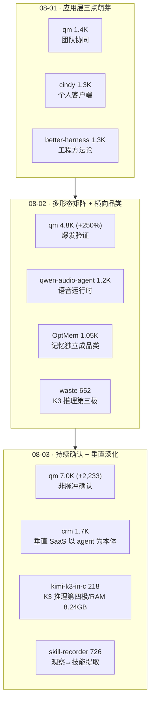

# GitHub 趋势研究简报 - 2026-08-03

> 本报基于 GitHub Search API（gh CLI）+ 仓库 README 深度阅读，聚焦架构师视角的真问题。数据采集时间：2026-08-03。

## 今日核心判断

今天的 GitHub 趋势用三个独立信号回应了昨日的待观察之问，并把竞争前沿向前推进了一层：

1. **qm 第二日续涨回答了"脉冲 vs 趋势"之问**。昨日（08-02）最大的悬念是：qm 的 +250%（4,782⭐）是否只是登上 trending 后的注意力脉冲？今天的答案是——**不是**。qm 在第二天继续增长 4,782→7,015（+2,233，+47%），fork 同步从 469 涨到 736（+267）。增速百分比从 +250% 正常化到 +47% 是符合预期的衰减曲线，但**绝对量级仍远超同期一切项目**（K3 今日仅 +75，colibri +979 是另一回事）。这是可核验事实。昨日"应用层产品化从趋势判断升级为市场既成事实"的判断，今天获得了第二天的数据支撑。

2. **K3 本地推理出现第四种独立实现，RAM 下限被压到 8.24GB**。`FareedKhan-dev/kimi-k3-in-c`（218⭐，便携 C99）在纯 C 零依赖路线里把**驻留内存量**推到新低：peak RSS 仅 8.24GB（对比 waste 的 64GB 要求、deltafin 的更高内存），引擎本体 176KB，0 GPU，1.56TB 检查点全在 NVMe。其核心架构声明是"**同一模型在 8GB 与 224GB 产生字节一致输出**"——因为计算是确定性的，差别只在字节从哪里来（内存 vs 磁盘）以及多快。作者 FareedKhan-dev 有技术公信力（train-llm-from-scratch 8.8K⭐、all-agentic-architectures 4K⭐），且所有性能数据标注"来自 docs/data/ 的实测输出"。这与 waste（64GB/0.62 tok/s）、deltafin（Python/API server）、colibri（744B 多 GPU）构成**四个独立实现**，命题从"万亿级能否在消费机跑"深化为"RAM 下限能压到多低、速度-内存 Pareto 前沿在哪"。同期 waste 652→1,010（+358）持续放量，该品类在成熟。

3. **垂直应用层出现第一个清晰的产品本体范式**。`trycompai/crm`（1,731⭐，MIT）是一个 **agentic-first CRM**——它的设计宣言是"**agent 不是 CRM 的一个功能，CRM 是 agent 记笔记的地方**"。agent 跑在自己的部署、自己的调度、自己的工作队列上，花研究预算、到预算耗尽就停；API 层（NestJS）刻意"无智能"，只报告"发生了某事"并写一行到队列，由 agent 租约那行并决定它意味着什么。三个设计决策尤其值得关注：(a) **证据账本取代置信度**——工具不接受置信度分数（"模型自评确定性会错，且错在让自己显得有用的方向"），只报告观察到的事实，强证据写记录、弱证据变成人类裁决的建议；(b) **deny-all egress 沙箱**——agent 的 bash 沙箱无网络无数据库（web_fetch 在 app 运行时跑），消除"带凭据+出口的 shell 即数据外泄形状"；(c) **以 Vercel eve 为底座**——这是 07-31 追踪的 filesystem-first 框架 eve 首个可观察的生产级应用。这意味着应用层从昨日的"通用 harness 产品化（qm/cindy）"深化为"垂直 SaaS 以 agent 为核心重建"。

> **证据边界声明**：star 数、fork 数、subscribers、创建时间、license、语言、release tag 均来自 GitHub API（可核验事实）。"qm 续涨确认非脉冲"为基于两日数据的**推断**（第三日数据将进一步确认，但两天 +2,233/+3,415 的连续大增量已是强信号）。kimi-k3-in-c 的 8.24GB RSS、176KB 引擎、32.69 s/token 均为**作者 README 自述 + 标注来自 docs/data/ 实测**，非第三方复现；"字节一致输出"是确定性计算的**数学推论**（同模型同输入，差别仅在读取来源），但"8GB 与 224GB 字节一致"仍需独立验证 checkpoint 完整性。trycompai/crm 的"证据账本""deny-all egress"为 README 描述的设计，**生产部署成熟度未经独立验证**；contributors 仅 2 人（carhartlewis 34 / ripgrim 14）。decimen-optical-transfer 昨日 3,031→今日 3,620，几乎持平，**印证了昨日"刷星"判断**——真实热门项目不会在爆发次日停滞。

---

## 今日重点趋势

### 1. qm 第二日续涨 +2,233，应用层产品化确认非一日脉冲（评分 90）

可核验数据（连续两日追踪）：

| 指标 | 08-01 | 08-02 | 08-03 | 两日累计 |
|------|-------|-------|-------|----------|
| stars | 1,367 | 4,782 | 7,015 | +5,648 (+413%) |
| forks | 125 | 469 | 736 | +611 (+489%) |
| 日增速 | — | +3,415 (+250%) | +2,233 (+47%) | — |

**为什么这回答了"脉冲 vs 趋势"**：脉冲型热度（如登上 trending 后的注意力爆炸）的特征是**单日尖峰后快速回落**——通常是第二天回落到几十到几百的增量。qm 第二天 +2,233 虽较首日 +3,415 衰减，但绝对量级仍处于"主流项目"区间（对比：K3 本体今日 +75，cindy +104）。fork 增量（+267）同步保持，说明部署意愿未停。增速百分比从 +250% → +47% 是**健康的衰减曲线**，而非脉冲崩塌。

**横切对比**：在 created>2026-07-27, stars>300 的搜索里，qm（7,015⭐）已是**全站第一名**，超过 decimen-optical-transfer（3,620⭐，疑似刷星）和所有 K3 衍生项目。

**架构师判断**：应用层产品化从昨日的"市场既成事实"进一步确认为**持续性趋势**。待观察的下一个验证点是：第三日（08-04）若仍维持 +1000/天量级，则完全确认；若骤降到 +几百则需重新评估脉冲成分占比。但两天连续大增量已是强信号。

### 2. K3 本地推理第四极：kimi-k3-in-c 把 RAM 下限打到 8.24GB（评分 87）

`FareedKhan-dev/kimi-k3-in-c`（218⭐ / 23 fork，C99，Apache-2.0，2026-08-01 创建）：

- **Peak RSS 8.24GB**：实测命令显示 `PEAK RSS for the whole run: 8.24 GB`（8 token / 261.5s / 32.69 s·token⁻¹）。对比 waste 的 64GB Mac 要求，这是**一个数量级的内存下限降低**。
- **176KB 引擎 + 0 GPU + 0 依赖**：纯 C99，no BLAS, no framework。1.56TB 检查点全在 NVMe。
- **"同一模型 8GB 与 224GB 字节一致输出"**：dense trunk 驻内存到所选深度，其余流式；1.45TB routed experts 从不驻留，直接从 packed 4-bit 形式相乘。作者的论证是——**计算是确定性的，差别只在字节从哪来**，因此"底部的答案和顶部一样"。
- **作者公信力**：FareedKhan-dev 的其他仓库 train-llm-from-scratch（8,868⭐）、all-agentic-architectures（4,044⭐）、all-rl-algorithms（1,882⭐）显示这是一个有从零实现经验的系统/ML 作者，非匿名新号。

四种 K3 本地推理实现的当前对比（今日视角）：

| 实现 | 语言 | peak RSS | 速度 | 策略特点 | stars |
|------|------|----------|------|----------|-------|
| waste (sqliteai) | C 零依赖 | ~64GB | 0.45-0.62 tok/s | trunk 驻内存 + expert 磁盘流式 + RAM 有界 cache | 1,010 |
| kimi-k3-in-c (FareedKhan) | C99 零依赖 | **8.24GB** | 32.69 s/tok（最低预算） | trunk 深度可配 + 全 expert 流式 + fit cascade | 218 |
| deltafin (gavamedia) | Python | 较高 | ~14.6 s/token (M1 Max) | MXFP4 expert HTTP 流式 + OpenAI 兼容 API server | 615 |
| colibri (JustVugg) | C 零依赖 | 多 GPU | 4 tok/s (6×5090) | VRAM/RAM/NVMe 三级（瞄准 GLM-5.2 744B） | 22,197 |

**架构师判断**：命题从"万亿级能否在消费机跑"（已由多项目确认）深化为"**速度-内存 Pareto 前沿在哪**"。kimi-k3-in-c 用极慢（32s/token）换极低内存（8.24GB），waste 用中等内存（64GB）换接近可用（0.62 tok/s），deltafin 用 API server 换易用性。这条 Pareto 前沿的探索本身就是品类成熟的标志。**注意**：kimi-k3-in-c 的 8.24GB 是"能跑"的下限而非"能用"的速度——32 秒一个 token 意味着它的价值和 waste 一样在**可行性证明**（RAM 下限的极限在哪），而非日常使用。waste 今日 +358（652→1,010）说明纯 C 万亿级推理持续获得关注。

### 3. 垂直应用层成型：trycompai/crm 以 agent 为产品本体（评分 86）

`trycompai/crm`（1,731⭐ / 205 fork，TypeScript，MIT，2026-07-31 创建）——"An open-source, agentic-first CRM"：

核心设计宣言（README，可核验）：

> "The agent is not a feature of the CRM; the CRM is where the agent keeps its notes."

三个架构决策值得拆解：

1. **证据账本取代置信度**：agent 的工具**不接受置信度分数**。README 原文——"No tool accepts a confidence score, because a model asked to grade its own certainty will, and it will be wrong in the direction that makes it look useful."。工具只报告观察到的事实（`crm.signature-block`、`github.account-identity`），一个账本对证据定价，强证据写记录，弱证据变成人类裁决的建议。**"一个自信但错误的客户事实比空白字段更糟，因为没人能看出它错了。"**

2. **deny-all egress 沙箱**：agent 的 bash 沙箱**无网络、无数据库**。`web_fetch` 在 app 运行时跑，`web_search` 在模型 provider 跑，沙箱里的 shell 只做文本处理。沙箱**永远不被给予 `DATABASE_URL`**。README 论证："A shell with credentials and egress is exfiltration-shaped even in an internal tool; a shell with neither is a text processor."

3. **以 Vercel eve 为底座**：agent 部署（`apps/agent`）构建在 [eve](https://eve.dev)——07-31 追踪的 filesystem-first durable agent 框架。tool 是文件、skill 是 markdown、schedule 是文件，runtime 处理持久化（session 跨 redeploy 存活、工作恢复）。这是 **eve 首个可观察的生产级应用**——验证了 filesystem-first 范式从框架走向产品。

**架构师判断**：这代表应用层的**第二次深化**。昨日（08-02）的应用层是"通用 harness 产品化"（qm 多人协同 / cindy 个人客户端 / qwen-audio-agent 语音运行时）——它们都是把现有 harness 包成不同形态的产品。trycompai/crm 是另一种路径：**把一个垂直领域（CRM）的整个产品逻辑以 agent 为核心重建**——不是"给 CRM 加个 agent"，而是"agent 是产品，CRM 是它的 UI/持久层"。这与 qm 的差异不是好坏，而是**通用平台 vs 垂直重写**的两条路线。eve 作为底座被采用，也说明 07-31 追踪的 filesystem-first 范式正在获得真实采用。

---

## 重点项目深度分析

### 👥 qm — 7,015 stars · 平台候选 · Score 90

**两日续涨复盘**：1,367（08-01）→ 4,782（08-02，+250%）→ 7,015（08-03，+47%）。fork 125→469→736。**第二天 +2,233 的绝对量级确认非脉冲**。详见项目档案（已更新，score 89→90）。

### 📋 trycompai/crm — 1,731 stars · 平台候选 · Score 86

**首个 agentic-first 垂直 SaaS 范式**：以 Vercel eve 为底座，agent 是产品本体，数据库只是笔记。证据账本（无置信度）、deny-all egress 沙箱、单租户内部设计。3 天 1.7K⭐ + 205 fork（fork/star 比 12%，健康）。详见项目档案（新增）。

### 💠 kimi-k3-in-c — 218 stars · 观察型 · Score 83

**K3 本地推理第四极**：便携 C99，peak RSS 8.24GB（比 waste 低一个数量级），"8GB 与 224GB 字节一致输出"。作者有从零实现公信力。详见项目档案（新增）。

### 🎥 microsoft/skill-recorder — 726 stars · 工具型 · Score 84

Microsoft 官方桌面应用。录屏捕获工作会话 → GitHub Copilot CLI 重建为"意图 + 有序步骤" → 生成可复用 Skill（`SKILL.md`）或定时 Automation，面向 Microsoft Scout / Copilot Cowork / Copilot Studio。这是**"从观察到技能"的反向路径**——多数 agent 工具是从 skill 到执行，skill-recorder 是从人类执行到 skill 提取。源码发布模式（pin commit + 本地构建，不全局安装）。详见项目档案（新增）。

### 💽 waste — 1,010 stars · 观察型 · Score 83

652→1,010（+358），v0.6.2 发布（cgroup-aware budget：按 cgroup limit 而非 host RAM 自动预算）。本地推理三极之一持续放量。详见项目档案（已更新）。

---

## 应用层演进路线（三日累积视角）

## 风险与机遇

**机遇：**
- **应用层获连续两日市场确认**：qm 两日累计 +5,648 stars / +611 forks，"应用层产品化"不再是单日脉冲。对架构师意味着：harness 选型之后的**产品形态设计**（通用平台 qm vs 垂直重写 crm vs 语音 qwen-audio-agent）是当前最大的差异化窗口，且窗口在扩大。
- **垂直 SaaS 以 agent 为核心重写成为可行路径**：trycompai/crm 证明"agent 是产品本体"不只是理念——它有完整的工程实现（证据账本、deny-all 沙箱、eve 底座）。这为其他垂直领域（客服/法务/财务）的 agent-native 重写提供了参考架构。
- **K3 本地推理 Pareto 前沿被四个独立实现探索**：waste（64GB/可用速度）、kimi-k3-in-c（8.24GB/极限慢）、deltafin（Python/API）、colibri（多 GPU）覆盖了速度-内存-易用性的不同权衡点，品类在成熟。
- **eve 获得首个生产级采用**：trycompai/crm 以 eve 为底座，验证 filesystem-first 范式从框架走向产品。

**风险/泡沫点：**
- **qm 增速仍在衰减，第三日是最终确认点**：+250% → +47% 是健康衰减，但若 08-04 骤降到 +几百，则脉冲成分占比仍需修正。**不应把两日数据直接外推为长期趋势。**
- **trycompai/crm 极早期 + 极少 contributors**：创建 3 天，仅 2 名 contributors（carhartlewis 34 commits / ripgrim 14 commits）。"证据账本""deny-all egress"是**设计声明**，生产环境下的 agent 决策质量、证据定价准确性、长期维护承诺均未经规模验证。单租户内部设计也限制了适用场景。
- **kimi-k3-in-c 32s/token 是"能跑"非"能用"**：与 waste（0.62 tok/s）一样，价值在可行性证明（RAM 下限）而非日常使用。8.24GB 的低内存是以极端慢速换来的。读者不应误读为"K3 可在 8GB 机器日常本地跑"。
- **skill-recorder 强绑定 Microsoft 生态**：需 Copilot 访问权限，面向 Scout/Copilot Cowork/Copilot Studio，跨生态适用性有限。源码发布模式（本地构建）对非技术用户有门槛。
- **刷星项目持续干扰**：decimen-optical-transfer 昨日 3,031→今日 3,620，几乎停滞，**印证昨日刷星判断**。WilonityLoader（1,213⭐/0 fork，游戏作弊工具描述）和 flashloan-scalper-bot（213⭐/153 fork，疑似诈骗）也具有刷星/欺诈特征，已排除。

---

## 重点项目档案

- 👥 [qm](projects/qm.html) — 多人协作 agent harness（第二日续涨 +2,233，已更新 score 90）
- 📋 [crm](projects/crm.html) — Agentic-first 开源 CRM，以 eve 为底座（新增）
- 💠 [kimi-k3-in-c](projects/kimi-k3-in-c.html) — 便携 C99 跑全量 K3，RAM 下限 8.24GB（新增）
- 🎥 [skill-recorder](projects/skill-recorder.html) — Microsoft 官方录屏→Skill 生成（新增）
- 💽 [waste](projects/waste.html) — 纯 C 零依赖 K3 推理（652→1,010，已更新）

---
> 数据来源: GitHub Search API (gh CLI) + 仓库 README 深度阅读 | 生成时间: 2026-08-03
