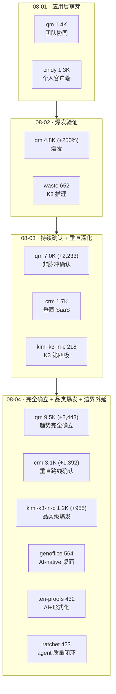

# GitHub 趋势研究简报 - 2026-08-04

> 本报基于 GitHub Search API（gh CLI）+ 仓库 README/Releases 深度阅读，聚焦架构师视角的真问题。数据采集时间：2026-08-04。

## 今日核心判断

今天的 GitHub 趋势用三个维度回答了前日的待观察之问，并外延出一个新信号：

1. **应用层产品化趋势第三日完全确认——脉冲假设彻底排除。** qm 在第三日继续增长 7,015→9,458（+2,443，+35%），fork 736→998（+262）。关键不是百分比（+35% 继续健康衰减），而是**第三日的绝对增量（+2,443）反而高于第二日（+2,233）**——这与脉冲型热度（尖峰后快速回落）的模式完全相反。三日连涨（+3,415 / +2,233 / +2,443）无一日回落，从 1,367 到 9,458，三日累计 +8,091 stars / +873 forks。昨日"是否趋势"的待观察之问今日有了确定答案：**这是趋势，不是脉冲**。与此同时，crm 第二日续涨 +1,392（1,731→3,123），genoffice（AI-native 办公套件）564⭐ 同步放量——应用层不是单点爆发，而是**通用平台（qm）/ 垂直重写（crm）/ 桌面生产力（genoffice）多路线并行扩张**。

2. **K3 本地推理从个别项目变为品类级爆发。** kimi-k3-in-c 今日 +955（218→1,173，单日近 5.4 倍），是今日增速最猛的项目；waste +510（1,010→1,520）连续三日增速递增（+342/+358/+510）。两者同步放量说明"万亿级本地推理"已从单点项目（waste 首日 652）扩散为**品类级系统性关注**。值得注意：kimi-k3-in-c 的"最低 RAM（8.24GB）"卖点的传播力今日首次超过 waste 的"接近可用速度（0.62 tok/s）"——这反映了社区对**极限边界**的好奇强于对**可用性**的追求，但需警惕把"能跑"误读为"能用"（32s/token）。

3. **AI 推理能力边界外延——OpenAI 官方发布 ten-proofs。** `openai/ten-proofs`（432⭐，Lean，Apache-2.0）用 Lean 4 形式化了论文《Ten advances in mathematics and theoretical computer science》中的十个结果（高维球填充、二进码/球码、非 sofic 群构造、Connes 刚性猜想反例、算术电路复杂度、量子并行重复、最近向量问题、Ehrhart 体积猜想、多色 Ramsey 数、极图紧致性反例）。这是 **AI 推理 ↔ 形式化验证交叉点**的高公信力信号（OpenAI 官方，非第三方复现），且每个形式化可被任何人用 `lake build` 独立验证。在近期趋势被应用层和本地推理主导时，这标志着 AI 能力从"写代码/跑任务"外延到**推进数学前沿并以可验证形式呈现**。

4. **agent 质量基础设施成型——ratchet 把规则注入从开环变闭环。** `0xwilliamortiz/ratchet`（423⭐ / 85 fork / **285 watchers**）是一个 Claude Code 的 `PostToolUse` hook：agent 读取极简规则后，这个工具读 agent 的每一次编辑、测量复杂度（依赖膨胀/wrapper/yagni 等）、实时回灌进同一会话。285 watchers（>stars 的异常比例）显示这击中了真实痛点：**agent 生成代码的复杂度膨胀**。它与 skill-recorder（从观察到技能）正交互补，共同构成 agent 工作流的质量基础设施——前者管"技能从哪来"，后者管"执行后是否守住底线"。

> **证据边界声明**：star 数、fork 数、subscribers、创建时间、license、language、release tag 均来自 GitHub API（可核验事实）。"qm 第三日增量反超第二日"为基于连续三日 GitHub API 数据的**可核验事实**；"应用层趋势完全确立"是基于三日无回落数据的**强推断**（第四日数据将进一步巩固，但三日 +8,091 且增量递增已是极强信号）。ten-proofs 的十个 Lean 形式化**能编译只证明内部自洽**，不直接证明"形式化的就是论文宣称的定理"——formalization 与 informal claim 的对应仍需人工对照（README 的 formalization.yaml 可能承担此职责，未深入验证）。kimi-k3-in-c 的 8.24GB RSS、32s/token 均为**作者 README 自述 + 标注来自 docs/data/ 实测**，非第三方复现。genoffice 的"字节保真往返"为 README 设计声明，**复杂 docx（宏/嵌入对象）下的实际表现未经独立验证**，且 AI 功能强绑定 Genspark 服务（无账号则 AI 不可用）。ratchet 的六类探测器为启发式判断，**误报率未经公开评测**。

---

## 今日重点趋势

### 1. 应用层产品化第三日完全确认——脉冲假设彻底排除（评分 92）

可核验数据（连续三日追踪 qm）：

| 指标 | 08-01 | 08-02 | 08-03 | 08-04 | 三日累计 |
|------|-------|-------|-------|-------|----------|
| stars | 1,367 | 4,782 | 7,015 | 9,458 | +8,091 (+592%) |
| forks | 125 | 469 | 736 | 998 | +873 (+698%) |
| 日增速 | — | +3,415 (+250%) | +2,233 (+47%) | +2,443 (+35%) | — |

**为什么这彻底排除了脉冲假设**：脉冲型热度的特征是**单日尖峰后快速回落**——第二天增量骤降到几百，第三天趋近于零。qm 的实际表现是：第二日 +2,233（较首日 +3,415 衰减 34%），**第三日 +2,443 反而高于第二日**。这在脉冲模型下是不可能的——真实趋势才会出现这种"衰减后回升"。fork 同步从 736→998（+262），说明部署意愿未停。

**多路线并行扩张的证据**：应用层不是 qm 一枝独秀。今日观测到三条并行路线同步放量：
- **通用平台**：qm（9,458⭐，团队 agent 协同，三日 +8,091）
- **垂直重写**：crm（3,123⭐，agentic-first CRM，两日 +1,392）
- **桌面生产力**：genoffice（564⭐，AI-native 办公套件，字节保真往返）

这三者代表应用层的不同切片，同步增长说明**应用层产品化是结构性的多路线扩张，而非单点爆发**。

**架构师判断**：应用层产品化从"市场既成事实"（08-02）→"持续性趋势"（08-03）→**"完全确立的趋势"（08-04）**。待观察从"是否趋势"转为"趋势天花板在哪"——qm 突破 10K⭐ 后的增速、crm 是否吸引外部 contributors、genoffice 是否解开 Genspark 服务绑定，是下一阶段的关键观察点。

### 2. K3 本地推理品类级爆发——极端低内存卖点引爆（评分 88）

今日 K3 本地推理品类出现两个同步放量信号：

- **kimi-k3-in-c +955（218→1,173，近 5.4 倍）**：单日增速最猛。fork 23→176（+153），说明有人在尝试复现/部署。"8.24GB RAM 跑全量 K3"的极端内存下限卖点在第三日引爆。
- **waste +510（1,010→1,520）**：连续三日增速递增（+342/+358/+510），fork 89→111。

**为什么这是品类级爆发而非单点**：昨日（08-03）K3 推理还是"waste 续涨 + kimi-k3-in-c 新出现"的两点信号；今日两者同步爆发，且增量量级相近（+955 / +510），说明社区在**同时关注"可用速度"（waste）与"极限低内存"（kimi-k3-in-c）两个端点**。这是品类成熟的标志——从"能否跑"深化为"速度-内存 Pareto 前沿的系统性探索"。

**一个值得警惕的传播偏向**：kimi-k3-in-c 今日增量（+955）首次超过 waste（+510），说明"最低 RAM"卖点的传播力强于"接近可用速度"。但这可能误导——kimi-k3-in-c 是 32s/token（极限慢），价值在**可行性证明（RAM 下限）**而非日常使用；waste 是 0.62 tok/s（接近可用）。读者不应因"8.24GB"而误读为"K3 可在 8GB 机器日常本地跑"。

**架构师判断**：K3 本地推理品类已从"个别项目"升级为"系统性关注品类"。四个独立实现（waste/kimi-k3-in-c/deltafin/colibri）覆盖速度-内存-易用性的不同权衡点，Pareto 前沿被持续探索。下一观察点：是否有第三方独立验证 kimi-k3-in-c 的 8.24GB RSS 与字节一致输出。

### 3. AI 推理边界外延——OpenAI ten-proofs 标志形式化验证交叉品类（评分 85）

`openai/ten-proofs`（432⭐ / 39 fork，Lean，Apache-2.0，2026-08-01 创建）用 Lean 4 形式化了论文《Ten advances in mathematics and theoretical computer science》的十个结果：

1. 高维球填充（达 Cohn–Elkies 阈值的渐近上界）
2. 二进码与球码（指数级更强的上界）
3. 非 sofic 群构造（解决"是否每个群都允许有限置换近似"）
4. Connes 刚性猜想的反例
5. 算术电路复杂度（permanent 的新下界，含 n⁴/log n 公式下界）
6. 量子并行重复（任意有限两人量子博弈的指数并行重复）
7. 最近向量问题（多项式因子近似硬度）
8. Ehrhart 体积猜想（每维的最大体积尖锐界）
9. 多色 Ramsey 数（超指数下界，解决 Erdős 问题 183）
10. 极图紧致性/退化性猜想的反例（解决 Erdős 问题 146 和 180）

**为什么这标志一个交叉品类**：AI 推理产出的数学"发现"面临根本信任问题——**怎么知道它是对的？** 传统证明靠同行评审，但前沿组合数学证明极长易错。ten-proofs 的路径是 `claim → formalize → independently check`：AI 产出非形式断言，Lean 形式化层翻译为机器可检查，验证层（`lake build` + ComparatorChallenges）确认编译通过。这与"AI 写代码跑测试"同构，但处在更高抽象层（数学真理）。对架构师的启发：**当 AI 系统输出需要高可信度时，形式化验证层是比人工 review 更强的保证**——前提是领域有可用的 proof assistant。

**架构师判断**：这属于 L0 基础研究/范式信号，不在应用产品分层内。它的价值不是可集成工具，而是 **AI 能力边界的一个可核验坐标点**：证明 AI 推理已能在前沿数学产生可验证贡献。跟踪频率可低于应用层项目——此类仓库更新稀疏，重点关注 OpenAI 是否持续发布此类形式化、社区是否复现/质疑。

### 4. agent 质量基础设施成型——ratchet 把规则从开环变闭环（评分 84）

`0xwilliamortiz/ratchet`（423⭐ / 85 fork / **285 watchers**，JavaScript，MIT，2026-07-31 创建）——"Your agent reads the rules. This checks whether it followed them."

**它闭合的环**：所有给 coding agent 的极简规则集（"优先标准库、不加依赖、保持 diff 小"）都是**开环**的——模型读了规则，然后没人检查它是否遵守。ratchet 的 `PostToolUse` hook 在 agent 仍工作时测量每次 Edit/MultiEdit/Write，实时报告违规。**不依赖模型"被 system prompt 说服"，而是客观测量 + 闭环反馈。**

**六类探测器 + 四档模式**：dep（新增依赖）、exists（同名符号已存在）、stdlib（手写标准库已有的东西）、native（依赖/代码做了平台已做的事）、wrapper（函数体只转发）、yagni（只有一个实现的接口）。模式：advise（仅 findings）/ guard（默认，findings + budget 警告）/ strict（超 budget 阻断编辑）/ off。

**285 watchers 的信号**：watchers > stars（423）的异常比例，说明这是**被深度关注而非浅层 star**的工具——核心使用者质量高。这击中了真实痛点：agent 在长会话中漂移导致复杂度膨胀。

**架构师判断**：ratchet 与 skill-recorder（从观察到技能）正交互补，共同构成 agent 工作流的质量基础设施。ratchet 的哲学"棘轮单向转动——复杂性只降不升，除非显式反转并记录"与 crm 的"证据账本取代置信度"异曲同工——都拒绝让模型自评，转用客观证据。

---

## 重点项目深度分析

### 👥 qm — 9,458 stars · 平台候选 · Score 90

**三日完全确认**：1,367（08-01）→ 4,782（08-02）→ 7,015（08-03）→ 9,458（08-04）。第三日 +2,443 反超第二日 +2,233，**脉冲假设彻底排除**。详见项目档案（已更新）。

### 💠 kimi-k3-in-c — 1,173 stars · 观察型 · Score 83

**爆发性增长 +955（近 5.4 倍）**：218→1,173，fork 23→176。"最低 RAM"卖点引爆。但 32s/token 的速度意味着价值仍在可行性证明。详见项目档案（已更新）。

### 📐 openai/ten-proofs — 432 stars · 观察型 · Score 82

**AI + 形式化验证交叉品类**：OpenAI 官方，Lean 4 形式化十项数学成果，每个可 `lake build` 独立验证。详见项目档案（新增）。

### 📄 genoffice — 564 stars · 平台候选 · Score 84

**AI-native 桌面生产力**：五个 Electron app 共享引擎，AI 编辑为一等公民，字节保真往返（仅脏块重生成），有签名安装包。强绑定 Genspark 服务是最大采用门槛。详见项目档案（新增）。

### 🔧 ratchet — 423 stars · 工具型 · Score 83

**agent 规则闭环检查**：PostToolUse hook 实时测复杂度，285 watchers 高质量关注。与 skill-recorder 正交互补。详见项目档案（新增）。

### 📋 crm — 3,123 stars · 平台候选 · Score 86

**垂直 agentic SaaS 持续确认**：第二日 +1,392（1,731→3,123），以 eve 为底座。详见项目档案（已更新）。

### 🎥 skill-recorder — 1,366 stars · 工具型 · Score 84

**续涨 +640（726→1,366）**，与 ratchet 正交互补。详见项目档案（已更新）。

### 💽 waste — 1,520 stars · 观察型 · Score 83

**续涨 +510（1,010→1,520）**，连续三日增速递增。详见项目档案（已更新）。

---

## 应用层演进路线（四日累积视角）

## 风险与机遇

**机遇：**
- **应用层获连续三日市场确认，多路线并行扩张**：qm（通用平台）/ crm（垂直重写）/ genoffice（桌面生产力）同步放量，说明应用层产品化是结构性的。对架构师意味着：harness 选型之后的**产品形态设计**是当前最大的差异化窗口，且窗口在扩大并分化。
- **K3 本地推理品类成熟，Pareto 前沿被四极探索**：waste（可用速度）/ kimi-k3-in-c（极限低内存）/ deltafin（API 易用）/ colibri（多 GPU）覆盖不同权衡点。品类从"能否跑"深化为"速度-内存前沿在哪"。
- **AI + 形式化验证交叉品类出现**：ten-proofs 证明 AI 推理能在前沿数学产生可验证贡献。对高可信度场景（金融/安全/合规），形式化验证层可能成为 AI 输出的标准保证机制。
- **agent 质量基础设施成型**：ratchet（执行后约束）+ skill-recorder（技能提取）正交互补，为 agent 工程提供了质量治理工具链。

**风险/泡沫点：**
- **不应把三日数据外推为长期增速**：qm 的 +250% → +47% → +35% 是健康衰减，但突破 10K⭐ 后增速可能进一步下降。趋势已确立≠增速无限。
- **kimi-k3-in-c 的"8.24GB"易被误读**：32s/token 是"能跑"非"能用"。读者不应误读为"K3 可日常本地跑"。8.24GB RSS 与字节一致输出仍为作者自述，未见独立复现。
- **genoffice 强绑定 Genspark 服务**：AI 功能经 Genspark 服务端路由，本地不存 API key——无账号则 AI 不可用。开源的是客户端壳而非完整可独立运行产品。
- **ten-proofs 形式化正确 ≠ 数学结论正确**：Lean 编译通过只证明内部自洽，formalization 与 informal claim 的对应需人工对照。
- **ratchet 强绑定 Claude Code + 启发式探测器**：跨 agent 适用性待适配；六类探测器误报率未经公开评测。
- **刷星/欺诈项目持续干扰**：WilonityLoader（1,220⭐/0 fork，游戏作弊）、decimen-optical-transfer（4,232⭐，疑似刷星，fork 498）持续出现，已排除。

---

## 重点项目档案

- 👥 [qm](projects/qm.html) — 多人协作 agent harness（第三日 +2,443，9,458⭐，趋势完全确认，已更新）
- 💠 [kimi-k3-in-c](projects/kimi-k3-in-c.html) — 便携 C99 跑全量 K3（+955，1,173⭐，爆发性增长，已更新）
- 📐 [ten-proofs](projects/ten-proofs.html) — OpenAI Lean 4 数学形式化（新增）
- 📄 [genoffice](projects/genoffice.html) — AI-native 办公套件（新增）
- 🔧 [ratchet](projects/ratchet.html) — agent 规则闭环检查（新增）
- 📋 [crm](projects/crm.html) — Agentic-first CRM（+1,392，3,123⭐，已更新）
- 🎥 [skill-recorder](projects/skill-recorder.html) — Microsoft 录屏→Skill（+640，已更新）
- 💽 [waste](projects/waste.html) — 纯 C K3 推理（+510，1,520⭐，已更新）

---
> 数据来源: GitHub Search API (gh CLI) + 仓库 README/Releases 深度阅读 | 生成时间: 2026-08-04
