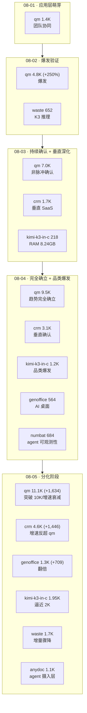

# GitHub 趋势研究简报 - 2026-08-05

> 本报基于 GitHub Search API（gh CLI）+ 仓库 README/Releases 深度阅读，聚焦架构师视角的真问题。数据采集时间：2026-08-05。

## 今日核心判断

今天的 GitHub 趋势在第四日给出三个结构性信号——应用层进入分化阶段、K3 品类叙事分裂、以及一个全新品类（agent 可观测性）出现：

1. **应用层进入第四日，从"齐涨"转向"分化"。** qm 突破 10K 关口（9,458→11,092，+1,634，+17%），增速继续健康衰减（+250%→+47%→+35%→+17%），但**不再是增速最快**的应用层项目——crm 第四日 +1,446（3,123→4,569，+46%）增速反超 qm，genoffice 翻倍 +709（564→1,273，+125%）。关键判断升级：08-04 已确认"应用层是趋势而非脉冲"，今日数据说明**趋势内部不是齐涨，而是多路线各自验证 PMF**——通用平台（qm，量级领先但增速衰减）、垂直重写（crm，增速反超）、桌面生产力（genoffice，增速最快）。这意味着"应用层产品化"的下一个问题不再是"是否趋势"，而是**"哪条路线的 PMF 最强"**。

2. **K3 本地推理品类出现叙事分裂——"极限低内存"压过"可用速度"。** kimi-k3-in-c 第四日持续 +779（1,173→1,952，逼近 2K），但 waste 增量骤降 +510→+145（1,520→1,665，-72%）。这不是"K3 品类降温"——kimi-k3-in-c 仍在放量——而是**社区注意力在品类内部从"可用速度端"迁移到"极限低内存端"**。传播偏向在第四日得到量化确认：昨日已观察到 kimi-k3-in-c 增量（+955）首超 waste（+510），今日差距进一步拉大（+779 vs +145）。架构师应注意：这反映社区对**极限边界的猎奇**持续强于对**可用性**的追求，但不应误读为"低内存方案更接近可用"——kimi-k3-in-c 仍是 32s/token（能跑非能用），waste 仍是 0.62 tok/s（接近可用）。

3. **Agent 可观测性/治理品类出现——Perplexity 官方 numbat。** `perplexityai/numbat`（684⭐ / 68 fork，Go，Apache-2.0，v0.1.2）是 Perplexity 官方的端点 agent 可见性工具：通过本地 hooks/plugins、OTLP/HTTP 日志、磁盘会话产物三类输入，把 Claude/Codex/Gemini CLI/Copilot/OpenCode/Grok/Hermes/OpenClaw/Pi/Kimi Code/Qwen/Cline/Kiro/Crush 等**十余个 agent 的活动归一到同一事件模型**，用 CEL 规则引擎实时检测，支持可选 pre-action 阻断和事后取证重建。这与 ratchet（执行后复杂度约束）、skill-recorder（技能提取）正交互补，共同构成**agent 工作流的三层质量基础设施**：技能从哪来（skill-recorder）→ 执行时守住底线（ratchet）→ 事后可追溯、可阻断（numbat）。Perplexity 官方入场（非个人项目）提升了这个品类的公信力信号。

4. **Agent 摄入层扩张——Firecrawl 官方 anydoc。** `firecrawl/anydoc`（1,086⭐ / 40 fork，Rust，MIT，2 天，v0.1.3）把 Word/PPT/Excel/ODP/RTF/EPUB/CSV/PDF 转 GitHub-Flavored Markdown，单数毫秒，Node/Python 绑定，且作为 Agent Skill 分发（`npx skills add firecrawl/anydoc`）。这扩展了 agent 的**文档摄入基础设施**——agent 要处理真实世界的 office 文档，需要一个统一、快速、格式无关的解析层。anydoc 把 Firecrawl 已有的 web→Markdown 能力扩展到 office 文档，与 Firecrawl 主线形成自然延伸。

> **证据边界声明**：star/fork/subscribers/created_at/pushed_at/license/language 均来自 GitHub API（可核验事实）。所有"第四日增量"均为连续四日 GitHub API 数据的可核验计算。"应用层进入分化阶段"为基于四日数据的**强推断**（分化的定义是"多路线增速出现交叉"——crm 增速反超 qm、genoffice 翻倍，均为可核验事实）。"叙事分裂"为基于增量对比的**推断**（waste 增量骤降 + kimi-k3-in-c 持续放量是事实，"叙事迁移"是解释性推断）。numbat 的覆盖矩阵（支持十余个 agent）为**README/docs 自述**，未逐一验证每个 agent 的 hook 实现深度；pre-action 阻断为设计声明，默认关闭（所有 shipped 规则为 monitor-only）。anydoc 的"单数毫秒"为 README 设计声明，未独立基准测试；"格式无关输出一致性"未在复杂宏/嵌入对象场景下验证。kimi-k3-in-c 的 8.24GB RSS、32s/token、字节一致输出仍为作者 README 自述，未见第三方独立复现。

---

## 今日重点趋势

### 1. 应用层第四日分化——crm 增速反超 qm，genoffice 翻倍（评分 90）

连续四日追踪数据（可核验）：

| 指标 | 08-01 | 08-02 | 08-03 | 08-04 | 08-05 | 四日累计 |
|------|-------|-------|-------|-------|-------|----------|
| qm stars | 1,367 | 4,782 | 7,015 | 9,458 | 11,092 | +9,725 (+711%) |
| qm 日增速 | — | +3,415 | +2,233 | +2,443 | +1,634 | — |
| qm 增速% | — | +250% | +47% | +35% | +17% | — |
| qm forks | 125 | 469 | 736 | 998 | 1,200 | +1,075 |
| crm stars | — | — | 1,731 | 3,123 | 4,569 | +2,838（自 08-03） |
| crm 日增速 | — | — | — | +1,392 | +1,446 | — |
| genoffice stars | — | — | — | 564 | 1,273 | +709（自 08-04） |

**为什么今日标志"分化"而非"齐涨"**：08-04 之前，应用层三条路线（qm/crm/genoffice）都在增长，但量级差异大、难以判断各自的 PMF 强度。今日的关键数据点是**crm 增速（+1,446）反超 qm（+1,634）的百分比**——crm +46% vs qm +17%。这不是 qm 降温（+1,634 绝对增量仍可观），而是 crm 在更小的基数上展现了更强的相对吸引力。genoffice +125%（翻倍）则说明 AI-native 桌面生产力这个切片也在快速验证。**三条路线的增速出现了交叉和分化**，这是品类成熟的标志——市场开始区分"哪个形态更值钱"。

**qm 突破 10K 关口的信号**：11,092⭐ 是应用层 harness 类项目首次突破万星量级。但 subscribers 仅 51（相对 11K⭐ 偏低），open_issues 从 113 降到 105（健康的 issue 处理）。fork 1,200 说明部署意愿持续。pushed_at 停在 08-04，说明热度由已有版本驱动，非新发布刺激。

**架构师判断**：应用层从"是否趋势"（08-03）→"完全确立"（08-04）→**"内部分化"（08-05）**。下一阶段的关键问题升级为：哪条路线的 PMF 最强、最具持续力？通用平台（qm，量级护城河但增速衰减）、垂直重写（crm，增速反超但 eve 底座绑定）、桌面生产力（genoffice，增速最快但 Genspark 服务绑定）各有结构性权衡。

### 2. K3 本地推理品类叙事分裂——waste 退潮、kimi-k3-in-c 持续放量（评分 84）

连续四日追踪：

| 项目 | 08-02 | 08-03 | 08-04 | 08-05 | 四日累计 |
|------|-------|-------|-------|-------|----------|
| kimi-k3-in-c | — | 218 | 1,173 | 1,952 | +1,734（自 08-03） |
| kimi-k3-in-c 日增速 | — | — | +955 | +779 | — |
| waste | 652 | 1,010 | 1,520 | 1,665 | +1,013 |
| waste 日增速 | — | +358 | +510 | +145 | — |

**今日的关键转折**：waste 增量从 +510（08-04）骤降到 +145（08-05），-72%。kimi-k3-in-c 仍维持 +779。两者增量比从昨日的 1.9:1 扩大到今日的 5.4:1。这不是品类整体降温（kimi-k3-in-c 仍在放量），而是**注意力在品类内部的端点间迁移**——从"可用速度端"（waste，0.62 tok/s）转向"极限低内存端"（kimi-k3-in-c，8.24GB / 32s/token）。

**为什么这是"叙事分裂"而非"品类降温"**：如果品类整体降温，两者应同步下降。实际是 kimi-k3-in-c 继续增长、waste 单独骤降，说明社区在品类内部**重新分配注意力**。这印证了 08-04 的判断——"'最低 RAM'卖点的传播力强于'接近可用速度'"，今日数据量化了这个传播偏向的强度。

**需要警惕的误读**：叙事热度 ≠ 可用性。waste 增量骤降不意味着 waste 的技术路线（可用速度）不重要——恰恰相反，**真正日常可用的本地推理仍需 waste 路线（0.62 tok/s）而非 kimi-k3-in-c（32s/token）**。kimi-k3-in-c 的热度来自"RAM 下限的极限探索"这个话题性命题，而非日常实用性。架构师不应据热度排序决定技术选型。

**架构师判断**：K3 本地推理品类已从"能否跑"（08-02）→"Pareto 前沿探索"（08-03）→"品类级爆发"（08-04）→**"叙事分裂"（08-05）**。下一观察点：waste 是否推出新版本（cgroup-aware budget 是 v0.6.2）或被其他可用速度方案替代。

### 3. Agent 可观测性/治理品类出现——Perplexity numbat（评分 85）

`perplexityai/numbat`（684⭐ / 68 fork / 5 subscribers，Go，Apache-2.0，2026-07-24 创建，v0.1.2）——Perplexity 官方，"Endpoint visibility into AI agent activity"。

**它闭合的环**：ratchet 是"执行时约束"（agent 编辑后实时测复杂度），skill-recorder 是"技能从哪来"（录屏→Skill 提取），但两者都缺一个维度——**agent 做过什么、何时做的、能否追溯、能否在事中阻断**。numbat 填这个缺口：三类输入（本地 hooks/plugins、OTLP/HTTP 日志、磁盘会话产物）归一到统一事件模型，CEL 规则引擎实时检测，支持可选 pre-action 阻断（默认关闭，所有 shipped 规则为 monitor-only）和事后取证重建。

**覆盖广度是关键信号**：numbat 的覆盖矩阵列出 Claude、Codex、Gemini CLI、Copilot、OpenCode、Grok、Hermes、OpenClaw、Pi、Kimi Code、Qwen、Cline、Kiro、Crush 等**十余个 agent**。这不是针对单一 agent 的工具，而是**试图成为 agent 生态的统一可观测性层**——类似"agent 世界的 EDR（端点检测与响应）"。这个定位的价值在于：当企业部署多个 agent 时，需要一个**格式无关的活动记录与审计层**，numbat 正在填补这个位置。

**三层栈成型**：

| 层 | 项目 | 作用 | 时机 |
|----|------|------|------|
| 技能提取 | skill-recorder | 从人类执行提取 Skill | 事前 |
| 执行约束 | ratchet | 编辑后测复杂度、回灌 | 事中 |
| 可观测/取证/阻断 | numbat | 端点活动可见 + 可选阻断 + 事后追溯 | 事中+事后 |

**架构师判断**：numbat 把"agent 质量/安全"从单点工具（ratchet 的执行约束）扩展为**完整的可观测性品类**。Perplexity 官方入场（非个人项目）提升了公信力。但需注意：subscribers 仅 5（相对 684⭐ 偏低），fork 68 说明已有部署尝试，但**生产成熟度未经独立验证**（v0.1.2，pre-action 阻断为设计声明，默认关闭）。覆盖矩阵为 docs 自述，未逐一验证每个 agent 的 hook 实现深度。

### 4. Agent 摄入层扩张——Firecrawl anydoc（评分 82）

`firecrawl/anydoc`（1,086⭐ / 40 fork / 2 subscribers，Rust，MIT，2026-08-03 创建，v0.1.3）——Firecrawl 官方，"Convert Word/PPT/Excel/ODP/RTF/EPUB/CSV/PDF to clean GitHub-Flavored Markdown"。

**为什么值得关注**：agent 要处理真实世界的 office 文档（合同、报告、表格、演示），需要一个统一、快速、格式无关的解析层。anydoc 把 Firecrawl 已有的 web→Markdown 能力（firecrawl 主仓库 149K⭐）扩展到 office 文档，单数毫秒级，Node/Python 绑定，且作为 Agent Skill 分发（`npx skills add firecrawl/anydoc`，兼容 Claude Code/Codex/Cursor/OpenCode）。

**与文档解析赛道的关系**：这呼应了 07-14 追踪的"代码知识图谱范式"（Graphify，tree-sitter AST→非向量检索）——两者都在解决"agent 如何摄入结构化信息"，但 anydoc 面向 office 文档（二进制→Markdown），Graphify 面向代码库（AST→图谱）。anydoc 的"格式无关输出一致性"是设计声明，复杂宏/嵌入对象场景下的实际表现未独立验证。

**架构师判断**：agent 摄入层正在从"web 抓取"（Firecrawl 主线）扩展到"office 文档解析"（anydoc）。这是 agent 基础设施的横向扩张——agent 要成为通用生产力工具，必须能读真实世界的文档格式。Firecrawl 官方背书 + 2 天 1.1K⭐ 说明需求真实。但 subscribers 仅 2（极低），fork 40，v0.1.3，**尚处早期**。

---

## 重点项目深度分析

### 👥 qm — 11,092 stars · 平台候选 · Score 90

**第四日突破 10K**：9,458→11,092（+1,634，+17%），增速持续健康衰减（+250%→+47%→+35%→+17%）。fork 998→1,200。虽被 crm 反超增速，但绝对量级仍领先应用层所有项目。详见项目档案（已更新）。

### 📋 crm — 4,569 stars · 平台候选 · Score 87

**第四日增速反超 qm**：3,123→4,569（+1,446，+46%），fork 205→485（+280）。垂直 agent 路线在更小基数上展现更强相对吸引力。score 86→87。详见项目档案（已更新）。

### 📄 genoffice — 1,273 stars · 平台候选 · Score 85

**第四日翻倍**：564→1,273（+709，+125%），增速最快。AI-native 桌面生产力路线获得强验证。score 84→85。详见项目档案（已更新）。

### 💠 kimi-k3-in-c — 1,952 stars · 观察型 · Score 83

**逼近 2K**：1,173→1,952（+779），fork 176→318（+142）。"极限低内存"叙事延续，与 waste 的叙事分裂加剧。详见项目档案（已更新）。

### 🦝 perplexityai/numbat — 684 stars · 工具型 · Score 84

**Agent 可观测性品类出现**：Perplexity 官方，端点 agent 活动可见性 + 取证 + 可选阻断，覆盖十余个 agent。与 ratchet/skill-recorder 构成三层栈。详见项目档案（新增）。

### 📑 firecrawl/anydoc — 1,086 stars · 工具型 · Score 82

**Agent 摄入层扩张**：Firecrawl 官方，office 文档→LLM-ready Markdown，单数毫秒，2 天 1.1K⭐。详见项目档案（新增）。

### 🎥 skill-recorder — 1,751 stars · 工具型 · Score 84

**续涨 +385**（1,366→1,751），三层栈的"技能提取层"。详见项目档案（已更新）。

### 🔧 ratchet — 430 stars · 工具型 · Score 83

**第四日 +7（几乎持平）**，285 watchers 保持异常比例。三层栈的"执行约束层"。详见项目档案（已更新）。

### 💽 waste — 1,665 stars · 观察型 · Score 82

**增量骤降 +510→+145**，可用速度叙事退潮。仍在 Pareto 可用速度端。score 83→82。详见项目档案（已更新）。

### 📐 ten-proofs — 470 stars · 观察型 · Score 82

**+38**（432→470），平缓符合预期（研究类仓库更新稀疏）。详见项目档案（已更新）。

---

## 应用层五日演进路线

## 风险与机遇

**机遇：**
- **应用层进入分化阶段，PMF 窗口打开**：qm（量级护城河）、crm（增速反超）、genoffice（翻倍）三条路线各自验证。对架构师意味着：应用层不再是"选不选"，而是"选哪条路线"——通用平台、垂直重写、桌面生产力各有结构性权衡，窗口在分化。
- **Agent 可观测性品类成型，三层栈补齐**：skill-recorder（技能提取）→ ratchet（执行约束）→ numbat（可观测/取证/阻断）。numbat 的多 agent 覆盖（十余个）填补了"统一可观测性层"的空白，企业部署多 agent 时有了审计基础。
- **Agent 摄入层扩张到 office 文档**：anydoc 把 agent 的文档处理能力从 web 扩展到 office，为 agent 进入真实办公场景扫清摄入障碍。
- **K3 品类叙事分裂反而说明品类成熟**：注意力在端点间迁移（而非整体消退）是品类成熟的标志——市场开始区分"极限探索"与"可用方案"的不同价值。

**风险/泡沫点：**
- **不应把分化初期的增速交叉外推为长期格局**：crm 今日增速反超 qm 是单日数据，需至少再观察 2-3 日确认是否趋势性。qm 的量级护城河（11K⭐）仍显著。
- **waste 增量骤降需区分"叙事退潮"与"项目问题"**：+510→+145 可能是注意力迁移，也可能是 waste 的 cgroup-aware budget 未带来新关注。需观察 waste 是否有新版本或社区反馈。
- **numbat 生产成熟度未验**：v0.1.2，pre-action 阻断为设计声明（默认关闭，shipped 规则全为 monitor-only），覆盖矩阵为 docs 自述，未逐一验证每个 agent 的 hook 实现深度。subscribers 仅 5（相对 684⭐ 偏低）。
- **anydoc 的"单数毫秒"与"格式无关一致性"为设计声明**：复杂宏/嵌入对象/扫描页（需 OCR）场景下的实际表现未独立验证。v0.1.3，subscribers 仅 2。
- **kimi-k3-in-c 的 8.24GB/32s/token/字节一致输出仍为作者自述**：未见第三方独立复现。热度来自话题性（RAM 极限）而非实用性。
- **genoffice 强绑定 Genspark 服务**：AI 功能经服务端路由，无账号则 AI 不可用。
- **刷星/欺诈项目持续干扰**：decimen-optical-transfer（4,527⭐/546 fork，star/watcher 异常）、WilonityLoader（900⭐/0 fork，游戏作弊）、MEV-Ethereum-Trading-Bot（2,289⭐/1,653 fork，疑似诈骗）、x4gKing/3x-ui-multi（687⭐/1,794 fork，fork/star 异常）持续出现，已排除。

---

## 重点项目档案

- 👥 [qm](projects/qm.html) — 多人协作 agent harness（第四日 +1,634，突破 10K，11,092⭐，已更新）
- 📋 [crm](projects/crm.html) — Agentic-first CRM（+1,446，4,569⭐，增速反超，已更新 score 87）
- 📄 [genoffice](projects/genoffice.html) — AI-native 办公套件（翻倍，1,273⭐，已更新 score 85）
- 💠 [kimi-k3-in-c](projects/kimi-k3-in-c.html) — 便携 C99 K3 推理（+779，1,952⭐，已更新）
- 🦝 [numbat](projects/numbat.html) — Perplexity agent 可观测性（新增）
- 📑 [anydoc](projects/anydoc.html) — Firecrawl office 文档解析（新增）
- 🎥 [skill-recorder](projects/skill-recorder.html) — Microsoft 录屏→Skill（+385，已更新）
- 🔧 [ratchet](projects/ratchet.html) — agent 规则闭环检查（+7，已更新）
- 💽 [waste](projects/waste.html) — 纯 C K3 推理（+145，增量骤降，已更新 score 82）
- 📐 [ten-proofs](projects/ten-proofs.html) — OpenAI Lean 4 形式化（+38，已更新）

---
> 数据来源: GitHub Search API (gh CLI) + 仓库 README/Releases 深度阅读 | 生成时间: 2026-08-05
