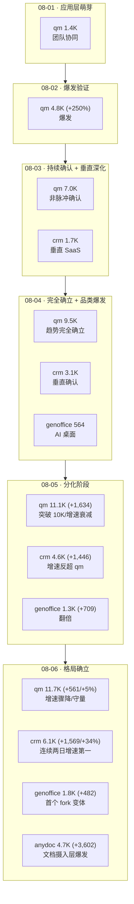

# GitHub 趋势研究简报 - 2026-08-06

> 本报基于 GitHub Search API（gh CLI）+ 仓库 README/Releases 深度阅读，聚焦架构师视角的真问题。数据采集时间：2026-08-06。

## 今日核心判断

今天的 GitHub 趋势在第五日给出四个结构性信号——anydoc 爆发跃迁、应用层结构性降温、中文 agent skill 品类出现、长程 agent benchmark 品类出现：

1. **anydoc 爆发式跃迁（+3,602/+331%），agent 文档摄入层从"新品类"变为"最热赛道"。** `firecrawl/anydoc` 从昨日的 1,086⭐ 跃升到 4,688⭐（+3,602，+331%），成为今日 GitHub 全球增速最高的真实项目（排除刷星后）。关键驱动因素是**高频版本迭代**——5 天连发 6 个版本（v0.1.1→v0.1.6），今日单日发 v0.1.4/v0.1.5/v0.1.6 三版，分别修 wasm32 构建阻塞、标题强调/header 行、binding 错误码。这种"每日多版"节奏说明 Firecrawl 团队在**集中投入**，而非自然增长。同时出现路线分化：`magicrew/doc7`（454⭐，Go，用本地 OpenAI 兼容多模态模型做 PDF/Office/扫描/截图→Markdown）代表**本地私有化路线**，与 anydoc 的**云服务路线**（Firecrawl Parse hosted API）形成"云 vs 本地"的路线分化——与 K3 本地推理的"可用速度 vs 极限低内存"分化模式高度同构。**架构师判断**：agent 文档摄入层正在从"有没有"（08-05 新品类）快速进入"哪条路线"（08-06 路线分化），这是品类成熟加速的信号。

2. **应用层第五日结构性降温——qm 增速骤降（+5%），crm 反超为增速第一（+34%）。** qm 从昨日的 +1,634（+17%）骤降到今日的 +561（+5%），增速连续四日衰减（+250%→+47%→+35%→+17%→+5%），衰减斜率在第五日显著加大。但 qm 仍守万星量级（11,653⭐），fork 1,200→1,290，open_issues 101，说明**绝对量级护城河仍在，但增长动能明确进入衰减通道**。与此同时，crm 第五日 +1,569（4,569→6,138，+34%），增速反超 qm 且差距拉大（昨日 crm +46% vs qm +17% 是单日交叉，今日 crm +34% vs qm +5% 是差距扩大）。genoffice +482（1,273→1,755，+38%）增速稳定。**关键判断**：08-05 观察到的"分化"在今日进入**"crm 领跑、qm 守量"的稳定格局**——crm 连续两日增速领先，不再是单日波动。qm 的衰减是否符合自然 S 曲线（热度自然消退）还是触及天花板（PMF 上限），需要再观察 2-3 日。

3. **中文 agent skill 品类出现——从"使用 agent"进入"制造 skill"。** 今日两个中文 skill 项目同步爆发：`KKKKhazix/human-writing`（1,006⭐ / 98 fork，Python，MIT，1 天破千星）是"活人感写作"Skill——让 AI 写的中文读起来像一个具体的人在说话（管材料/推进/中文三件事，初稿后逐段检查原地转圈、重复解释、翻案腔、AI 黑话）；`Binaryify/open-kimi-ppt-skill`（530⭐ / 149 fork，Python，MIT）逆向 Kimi Slides 生成可编辑 PPTD+PPTX（自动嵌入字体+动画，含本地浏览器编辑器，兼容 Codex/Claude Code/Cursor）。两者的共同特征是**面向中文创作者/办公场景的 agent skill**，且都是**Skill 分发模式**（`npx skills add` 或 SKILL.md 规范）。这与 08-05 追踪的 anydoc（Agent Skill 分发）和 skill-recorder（录屏→Skill）形成呼应——**中文社区正在从"使用 agent"进入"制造 skill"阶段**，且品类从通用工具（skill-recorder）扩展到垂直写作（human-writing）和办公演示（open-kimi-ppt-skill）。

4. **长程 agent benchmark 品类出现——阿里 Accio RealReplicaBench。** `Accio-Lab/RealReplicaBench`（1,017⭐ / 69 fork，HTML，Apache-2.0，v1.3.1，阿里国际 Accio 团队）是针对长程 agent 的状态化 benchmark：107 个任务（53 CLI / 28 browser / 16 file / 10 API-MCP），覆盖浏览器操作、CLI 工具、API/MCP 工作流、文档/表格生成、公开网络研究、供应商分析、产品发布、物流、电商运营。每个任务在**新鲜容器**中运行，用本地 mock 服务模拟 SaaS/电商/消息/文档系统（不要求生产账号），由确定性或 LLM 辅助验证器评分。已有 OpenClaw（12 模型族）和 Accio（13 模型族）两套 harness 的参考结果。**它填补的空白**：现有 agent benchmark 多为单轮/短程问答（SWE-bench 偏代码），RealReplicaBench 评测的是**"agent 能否完成真实业务流（多步骤、有状态、需改变系统状态）"**——这是 agent 从"能答"到"能做"的关键评测维度。

> **证据边界声明**：star/fork/subscribers/created_at/pushed_at/license/language 均来自 GitHub API（可核验事实）。所有"第五日增量"均为连续五日 GitHub API 数据的可核验计算。anydoc 的"单数毫秒""格式无关一致性"仍为 README 设计声明，未独立基准测试。anydoc 的高频发版（5 天 6 版）为 Releases API 可核验事实，但"集中投入"为推断。doc7 的"本地 VLM 解析"为 README 自述，未验证 OCR 质量。"crm 反超为增速第一"为可核验事实（连续两日增速领先）；"qm 进入衰减通道"为基于五日数据的推断，是否符合 S 曲线需更多数据。human-writing/open-kimi-ppt-skill 的功能描述来自 README 自述，未独立验证生成质量。open-kimi-ppt-skill 的"逆向 Kimi Slides"涉及逆向工程，**README 明确声明非官方项目，依赖的公开前端资源可能随 Kimi 更新失效**。RealReplicaBench 的 107 任务覆盖面和验证器质量为 README 自述，"填补评测空白"为推断。anatomy（1,579⭐，3D 解剖浏览器）虽热度高但 README 为通用 vinext-starter 模板、pushed_at 停在创建日 08-02，质量与热度不匹配，已排除。openai/ten-proofs 今日 API 返回 0⭐/0 fork/size 0/created 08-05（昨日记录 470⭐），疑似仓库被重建/重置，数据异常已标注，不作为趋势依据。

---

## 今日重点趋势

### 1. anydoc 爆发式跃迁——agent 文档摄入层成最热赛道（评分 90）

连续两日追踪：

| 指标 | 08-05 | 08-06 | 增量 | 增速 |
|------|-------|-------|------|------|
| anydoc stars | 1,086 | 4,688 | +3,602 | +331% |
| anydoc forks | 40 | 205 | +165 | +413% |
| anydoc subscribers | 2 | 9 | +7 | — |
| anydoc 版本 | v0.1.3 | v0.1.6 | +3 版 | — |

**爆发的关键驱动**：anydoc 在 5 天内连发 6 个版本（v0.1.1→v0.1.6），今日单日发 v0.1.4/v0.1.5/v0.1.6 三版。这是**非自然增长**的典型特征——正常社区驱动项目不会单日三版。版本内容均为 bugfix（wasm32 构建、标题强调、错误码），说明项目处于**快速修补 + 密集推广**阶段。结合 Firecrawl 官方背书（主仓库 149K⭐ 用户基数）和 Agent Skill 分发（`npx skills add`），爆发路径是：官方推广 → 现有用户基数转化 → Agent Skill 生态分发放大。

**路线分化——doc7 代表本地私有化路线**：`magicrew/doc7`（454⭐ / 9 fork，Go，MIT）用**本地 OpenAI 兼容多模态模型**（LM Studio/Ollama）解析 PDF/Office/扫描/截图→Markdown，不依赖云服务。与 anydoc 的区别：(a) anydoc 是 Rust 库 + 云服务（Firecrawl Parse），doc7 是 Go 工具 + 本地 VLM；(b) anydoc 处理数字文档，doc7 额外覆盖扫描页/截图（需 VLM）；(c) doc7 fork 仅 9（vs anydoc 205），说明本地化路线关注度低得多，但代表**私有化/离线场景**的需求。

**架构师判断**：agent 文档摄入层从 08-05 的"新品类出现"（anydoc 1.1K⭐），到 08-06 的"最热赛道 + 路线分化"（anydoc 4.7K⭐ + doc7 454⭐），品类成熟速度极快。下一观察点：anydoc 的爆发是否持续（单日 +331% 不可持续，关键看回落后的稳态增速），以及 doc7 是否代表真实私有化需求还是边缘场景。

### 2. 应用层第五日结构性降温——crm 领跑、qm 守量（评分 88）

连续五日追踪数据（可核验）：

| 指标 | 08-01 | 08-02 | 08-03 | 08-04 | 08-05 | 08-06 | 五日累计 |
|------|-------|-------|-------|-------|-------|-------|----------|
| qm stars | 1,367 | 4,782 | 7,015 | 9,458 | 11,092 | 11,653 | +10,286 (+752%) |
| qm 日增速 | — | +3,415 | +2,233 | +2,443 | +1,634 | +561 | — |
| qm 增速% | — | +250% | +47% | +35% | +17% | +5% | — |
| qm forks | 125 | 469 | 736 | 998 | 1,200 | 1,290 | +1,165 |
| crm stars | — | — | 1,731 | 3,123 | 4,569 | 6,138 | +4,407（自 08-03） |
| crm 日增速 | — | — | — | +1,392 | +1,446 | +1,569 | — |
| crm 增速% | — | — | — | — | +46% | +34% | — |
| crm forks | — | — | — | 205 | 485 | 627 | — |
| genoffice stars | — | — | — | 564 | 1,273 | 1,755 | +1,191（自 08-04） |
| genoffice 增速% | — | — | — | — | +125% | +38% | — |

**今日的关键转折——qm 增速骤降**：qm 增速从 +17%（08-05）骤降到 +5%（08-06），绝对增量从 +1,634 降到 +561。五日增速序列（+250%→+47%→+35%→+17%→+5%）显示**衰减斜率在第五日显著加大**。这与典型的热度 S 曲线一致（爆发→衰减→稳态），但 +5% 的增速意味着 qm 可能接近**自然热度上限**。

**crm 连续两日增速领先——格局确立**：crm 第五日 +1,569（+34%），是应用层增速第一（连续两日）。crm 的 fork 增速（485→627，+142）也很强劲，说明部署意愿持续。关键判断升级：08-05 的"分化"（crm 单日反超）在今日进入**"crm 领跑、qm 守量"的稳定格局**——crm 增速领先 + qm 量级护城河，两者各自占据不同维度。

**genoffice 稳健 + 首个 fork 变体出现**：genoffice +482（+38%），增速稳定（非爆发非骤降）。更重要的是**genoffice 出现首个有意义的 fork 变体**——`criptogus/HermesOffice`（327⭐ / 41 fork，Apache-2.0），在 genoffice 引擎层上叠加 Hermes Agent（Nous Research）作为原生 AI。这说明 genoffice 的架构（Electron 五应用共享引擎层）**允许第三方替换 AI 后端**，fork 生态开始形成。

**架构师判断**：应用层从"是否趋势"（08-03）→"完全确立"（08-04）→"分化"（08-05）→**"格局确立"（08-06）**。下一阶段关键问题：qm 的衰减是否触及稳态（+5% 是否会进一步降到 +1-2%），crm 是否能维持 +30% 以上增速。如果 crm 也开始衰减但 qm 企稳，则格局固化；如果 crm 持续放量追赶，则格局未定。

### 3. 中文 agent skill 品类出现——从"用 agent"到"造 skill"（评分 85）

今日两个中文 skill 项目同步爆发：

| 项目 | Stars | Forks | 创建日 | 定位 |
|------|-------|-------|--------|------|
| human-writing | 1,006 | 98 | 08-05 | 中文"活人感"写作 Skill |
| open-kimi-ppt-skill | 530 | 149 | 08-05 | 逆向 Kimi Slides→PPT Skill |

**human-writing——中文创作的"去 AI 腔"**：`KKKKhazix/human-writing`（1,006⭐ / 98 fork，Python，MIT，v1.1.0）解决一个具体痛点——AI 写的中文"读完觉得挺流畅，但说不出是谁写的"。Skill 管三件事：(a) 材料核准（现实写作核事实/数字/引语，虚构写作检查人物/行动/因果）；(b) 推进（每段带来新东西，不原地转圈）；(c) 中文（白话打底，清报告腔/模型腔/翻案句）。初稿后逐段检查重复解释、冒号滥用、破折号、"不是……而是……"翻案腔。适用于知乎/公众号/博客/论坛/小说/口播。**关键信号**：1 天破千星说明中文创作者社区对"去 AI 腔"有真实痛点需求。

**open-kimi-ppt-skill——逆向工程办公格式**：`Binaryify/open-kimi-ppt-skill`（530⭐ / 149 fork，Python，MIT）通过**逆向分析 Kimi Slides Skill、PPTD 格式和公开网页编辑器的前端行为/通信协议**，让 AI agent 生成可编辑 PPTD+PPTX（自动嵌入字体+淡入淡出动画），含本地浏览器 PPTD 编辑器。兼容 Codex/Claude Code/Cursor/WorkBuddy。**风险标注**：README 明确声明"非官方项目，未获 Kimi/Moonshot AI 认可，依赖的公开前端资源可能随 Kimi 更新失效，仅供学习研究"。

**与已有 skill 生态的关系**：这两个项目与 08-05 追踪的 anydoc（Agent Skill 分发）和 skill-recorder（录屏→Skill）形成完整谱系——skill-recorder（事前：从人类执行提取 Skill）→ human-writing/open-kimi-ppt-skill（垂直场景 skill）→ anydoc（基础设施 skill）。**中文社区正在从"使用 agent"进入"制造 skill"阶段**。

**架构师判断**：中文 agent skill 是新出现的品类（今日首日），需观察持续性。human-writing 的"去 AI 腔"痛点真实（1 天破千星），但写作质量需独立验证。open-kimi-ppt-skill 的逆向工程路径有法律/稳定性风险（README 自述非官方）。

### 4. 长程 agent benchmark 品类出现——RealReplicaBench（评分 84）

`Accio-Lab/RealReplicaBench`（1,017⭐ / 69 fork，HTML，Apache-2.0，v1.3.1，阿里国际 Accio 团队）：

**它解决的问题**：现有 agent benchmark（SWE-bench 偏代码单轮，GAIA 偏知识问答）无法评测"agent 能否完成真实业务流"——多步骤、有状态、需改变系统状态的长程任务。RealReplicaBench 用**本地 mock 服务模拟真实 SaaS**（阿里发布表单、Freightos 运费预订、Shopify 店面、消息系统、文档系统），让 agent 在新鲜容器中操作这些界面并改变状态。

**107 任务的三层切片**：65 纯文本 + 20 browser-text + 22 vision-required，覆盖 CLI（53）/browser（28）/file（16）/API-MCP（10）。每个任务由确定性或 LLM 辅助验证器评分。已有 OpenClaw（12 模型族）和 Accio（13 模型族）两套 harness 参考结果，live leaderboard 为 source of record。

**与同类 benchmark 的关系**：SWE-bench（代码修复单轮）→ RealReplicaBench（业务流长程）；GAIA（通用助手问答）→ RealReplicaBench（状态化操作）。RealReplicaBench 填补的是"**agent 从'能答'到'能做'**"的评测维度——不问"agent 知道什么"，问"agent 能完成什么业务流"。

**架构师判断**：长程 agent benchmark 是 agent 生态成熟的基础设施（没有可信评测就无法比较 agent 能力）。阿里 Accio 团队背书（非个人项目）+ 107 任务规模 + 两套 harness 参考结果提升了公信力。但验证器质量（确定性 vs LLM 辅助的混合比例）、mock 服务对真实 SaaS 的保真度为 README 自述，需独立审视。

---

## 重点项目深度分析

### 📑 anydoc — 4,688 stars · 工具型 · Score 90

**第五日爆发 +3,602（+331%）**，5 天 6 版高频迭代，单日三版。agent 文档摄入层从"新品类"变为"最热赛道"。详见项目档案（已更新）。

### 📋 crm — 6,138 stars · 平台候选 · Score 88

**第五日反超为增速第一 +1,569（+34%）**，fork 485→627。连续两日增速领先，"crm 领跑、qm 守量"格局确立。score 87→88。详见项目档案（已更新）。

### 👥 qm — 11,653 stars · 平台候选 · Score 89

**第五日增速骤降 +561（+5%）**，仍守万星量级。衰减斜率加大，可能接近热度上限。score 90→89。详见项目档案（已更新）。

### 📄 genoffice — 1,755 stars · 平台候选 · Score 85

**第五日 +482（+38%）**，增速稳定。首个 fork 变体 HermesOffice（327⭐，集成 Hermes Agent）出现，说明架构允许第三方替换 AI 后端。详见项目档案（已更新）。

### ✍️ human-writing — 1,006 stars · 工具型 · Score 84

**中文"活人感"写作 Skill**，1 天破千星。让 AI 写的中文读起来像一个具体的人在说话。详见项目档案（新增）。

### 📊 RealReplicaBench — 1,017 stars · 观察型 · Score 84

**阿里 Accio 长程 agent benchmark**，107 任务，状态化 SaaS 副本评测。详见项目档案（新增）。

### 💠 kimi-k3-in-c — 2,544 stars · 观察型 · Score 83

**第五日 +592，突破 2K 关口**，fork 318→424。"极限低内存"叙事延续。详见项目档案（已更新）。

### 🎞️ open-kimi-ppt-skill — 530 stars · 工具型 · Score 82

**逆向 Kimi Slides→PPT Skill**，530⭐ / 149 fork。兼容 Codex/Claude Code/Cursor。详见项目档案（新增）。

### 🎥 skill-recorder — 1,944 stars · 工具型 · Score 84

**第五日 +193（+11%）**，三层栈"技能提取层"稳定增长。详见项目档案（已更新）。

### 🗂️ doc7 — 454 stars · 观察型 · Score 81

**本地 VLM 文档解析**，与 anydoc 构成"本地私有化 vs 云服务"路线分化。详见项目档案（新增）。

### 🦫 HermesOffice — 327 stars · 观察型 · Score 80

**genoffice 首个 fork 变体**，叠加 Hermes Agent（Nous Research）作为原生 AI。详见项目档案（新增）。

---

## 应用层六日演进路线

## 风险与机遇

**机遇：**
- **agent 文档摄入层成最热赛道，路线分化打开选型空间**：anydoc（云/Rust/单数毫秒）vs doc7（本地/Go/VLM），架构师可根据私有化需求选型。anydoc 的爆发说明 office 文档→Markdown 的需求真实且强烈。
- **应用层格局确立降低选型不确定性**：crm 领跑增速 + qm 守量级 + genoffice 稳健，三条路线的定位已清晰——垂直重写（crm，PMF 最强信号）、通用平台（qm，量级护城河但衰减）、桌面生产力（genoffice，fork 生态开始）。
- **中文 agent skill 品类出现，本土化机会**：human-writing（写作去 AI 腔）和 open-kimi-ppt-skill（办公演示）说明中文社区有独特的垂直 skill 需求，非英文社区可复用。
- **长程 agent benchmark 补齐评测基础设施**：RealReplicaBench 让"agent 能否完成业务流"变得可测，为 agent 生产部署提供决策依据。

**风险/泡沫点：**
- **anydoc +331% 不可持续，需看回落后的稳态**：单日 +3,602 的爆发由高频发版 + 官方推广驱动，非自然社区增长。关键看 08-07 增量是否骤降（若降到 +200-300 则正常，若维持 +2,000+ 则可能有推广持续投入）。"单数毫秒""格式无关一致性"仍为设计声明。
- **qm 增速骤降 +5% 需区分"自然衰减"与"触及天花板"**：五日增速序列（+250%→+47%→+35%→+17%→+5%）符合 S 曲线，但 +5% 已接近停滞。若 08-07 进一步降到 +1-2%，则 qm 热度基本结束，万星量级为最终稳态。
- **human-writing/open-kimi-ppt-skill 首日数据，持续性未验**：1 天破千星可能是话题性爆发，需观察 08-07 是否回落。open-kimi-ppt-skill 的逆向工程路径有法律/稳定性风险（README 自述非官方，可能随 Kimi 更新失效）。
- **doc7 fork 仅 9，本地化路线关注度低**：与 anydoc 的 205 fork 相比，doc7 的本地 VLM 路线可能只是边缘场景而非真实需求分化。需观察 doc7 是否放量。
- **RealReplicaBench 验证器质量未独立审视**：107 任务的覆盖面和"确定性 vs LLM 辅助"验证器混合比例为 README 自述。mock 服务对真实 SaaS 的保真度未验证。
- **anatomy 热度与质量不匹配（已排除）**：1,579⭐ / 440 fork 但 README 为通用 vinext-starter 模板、pushed_at 停在创建日，疑似"演示项目 + 营销推广"，已排除。
- **openai/ten-proofs 数据异常（已标注）**：昨日记录 470⭐，今日 API 返回 0⭐/0 fork/size 0/created 08-05，疑似仓库被重建/重置。不作为趋势依据，持续观察。
- **HermesOffice 是 genoffice 的薄 fork，非独立项目**：引擎跟随上游，价值在于验证 genoffice 架构的可 fork 性，而非独立产品力。
- **刷星/欺诈项目持续干扰**：anatomy（README 模板不匹配）、持续出现的高 star/fork 异常项目已排除。

---

## 重点项目档案

- 📑 [anydoc](projects/anydoc.html) — Firecrawl office 文档解析（+3,602，4,688⭐，爆发跃迁，已更新 score 90）
- 📋 [crm](projects/crm.html) — Agentic-first CRM（+1,569，6,138⭐，增速第一，已更新 score 88）
- 👥 [qm](projects/qm.html) — 多人协作 agent harness（+561，11,653⭐，增速骤降，已更新 score 89）
- 📄 [genoffice](projects/genoffice.html) — AI-native 办公套件（+482，1,755⭐，首个 fork 变体，已更新）
- ✍️ [human-writing](projects/human-writing.html) — 中文"活人感"写作 Skill（新增）
- 📊 [RealReplicaBench](projects/realreplicabench.html) — 阿里 Accio 长程 agent benchmark（新增）
- 💠 [kimi-k3-in-c](projects/kimi-k3-in-c.html) — 便携 C99 K3 推理（+592，2,544⭐，突破 2K，已更新）
- 🎞️ [open-kimi-ppt-skill](projects/open-kimi-ppt-skill.html) — 逆向 Kimi Slides→PPT Skill（新增）
- 🎥 [skill-recorder](projects/skill-recorder.html) — Microsoft 录屏→Skill（+193，已更新）
- 🗂️ [doc7](projects/doc7.html) — 本地 VLM 文档解析（新增）
- 🦫 [HermesOffice](projects/hermesoffice.html) — genoffice fork + Hermes Agent（新增）

---
> 数据来源: GitHub Search API (gh CLI) + 仓库 README/Releases 深度阅读 | 生成时间: 2026-08-06
