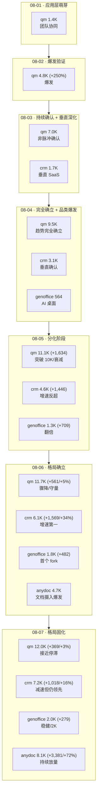

# GitHub 趋势研究简报 - 2026-08-07

> 本报基于 GitHub Search API（gh CLI）+ 仓库 README/Releases 深度阅读，聚焦架构师视角的真问题。数据采集时间：2026-08-07。

## 今日核心判断

今天的 GitHub 趋势在第六日给出四个结构性信号——anydoc 延续爆发但减速、"去 AI 腔"写作治理品类浮现、应用层格局固化、软件工厂 Skill 品类出现：

1. **anydoc 延续爆发但减速（+3,381/+72%），跨入 8K 关口。** `firecrawl/anydoc` 从昨日的 4,688⭐ 增长到 8,069⭐（+3,381，+72%），fork 205→370（+165）。虽然增速从昨日的 +331% 回落到 +72%，但**绝对增量仍居首**（今日 GitHub 该品类增量最高）。关键判断：爆发已进入**"高增量+减速"阶段**——不是"结束"，而是"接近稳态的过渡"。五日增速序列（首日 → +331% → +72%）符合典型热度曲线。下一步关键看 +72%→+40%→+20% 的回落斜率是否在 2-3 日内收敛到一个非零稳态（如 +10-15%），还是直接归零。rmpty pushed_at 停在 08-06T20:16，说明代码迭代仍在持续（昨日有发版）。

2. **"去 AI 腔"写作治理品类浮现——溯源发现 blader/humanizer（34K⭐）源头。** 今日最重要的新发现不是某个新项目，而是**一个跨项目的品类谱系**：`blader/humanizer`（34,004⭐ / 3,063 fork，Agent skill，removes signs of AI-generated writing）是**源头 Skill**；`KKKKhazix/human-writing`（1,552⭐，+54%，中文"活人感"写作）是其**中文分支**；`0xwilliamortiz/humanizer-cli`（581⭐ / 208 watchers，英文终端检测 CLI）是其**终端化封装**（33 种 AI 写作模式，before/after 示例 + 草稿检查，零依赖 C 二进制）；加上 08-04 追踪的 `0xwilliamortiz/ratchet`（435⭐ / 285 watchers，agent 事前规则约束），构成完整的**"写作治理三层谱系"**：事前约束（ratchet）→ 事中去 AI 腔（human-writing / humanizer-cli）→ 事后检测（humanizer-cli 的 check 模式）。这是一个**跨语言、跨接口、跨阶段的真实品类**，不是单点爆发。

3. **应用层第六日——qm 增速骤降到 +3%（接近停滞），crm 增速回落但仍领先，格局固化。** qm 第六日 +369（11,653→12,022，+3%），增速序列（+250%→+47%→+35%→+17%→+5%→+3%）显示**已接近停滞**，万星量级（12,022⭐）为最终稳态，08-06 判断的"qm 接近自然热度上限"被今日数据证实。crm 第六日 +1,018（6,138→7,156，+16%），增速从 +34% 回落到 +16%，但仍为应用层增速第一（连续三日）。genoffice +279（1,755→2,034，+15%），增速稳定，跨入 2K。**关键判断**：08-06 的"crm 领跑、qm 守量"格局在今日**从分化进入固化**——qm 的守量已近停滞，crm 的领跑也在减速，两者都在收敛，但 crm 仍领先。下一步看 crm 是否能维持 +10% 以上（说明仍有真实增长动能），还是也降到 +5% 以下（说明整个应用层主题进入尾声）。

4. **软件工厂 Skill 品类出现——super-simple-software-factory。** `disler/super-simple-software-factory`（459⭐ / 110 fork / 14 watchers，Python，MIT）提出一个明确的架构主张：**"Python 拥有控制平面，agent 是有界节点"**——确定性代码负责编排、重试、验收（`bun test` / `ruff check` 这种已知调用不该交给 agent），agent 只做"需要阅读和判断"的环节。用 ADW（AI Developer Workflow）脚本 + 类型化 JSON envelope + SQLite trace + 事件流，把"prompt 即控制平面"重构为"代码即控制平面"。它与 `DannyMac180/sol-advisor`（1,694⭐，Codex-native 架构编排，强制 fresh Sol review）呼应一个共同主题：**"agent 编排层"从 ad-hoc prompt 进入工程化结构**。

> **证据边界声明**：star/fork/subscribers/created_at/pushed_at/license/language/open_issues 均来自 GitHub API（可核验事实）。所有"第六日增量"均为连续六日 GitHub API 数据的可核验计算。anydoc 的"单数毫秒""格式无关一致性"仍为 README 设计声明，未独立基准测试。blader/humanizer 为 34K⭐ 源头项目（可核验事实），human-writing/humanizer-cli 与其的"谱系关系"为推断（基于两者均引用 humanizer skill 且功能高度同构，humanizer-cli README 明确指向 blader/humanizer 为 skill 本体，human-writing 的"去 AI 腔"目标与 humanizer 一致但未明确声明溯源）。"写作治理三层谱系"为基于功能同构的推断分类，非官方声明。super-simple-software-factory 的"Python 拥有控制平面"为 README 架构主张，未独立验证运行效果。sol-advisor 的描述来自 README 自述。"qm 接近停滞"为基于六日增速序列的推断（可核验趋势）。humanizer-cli 的"208 watchers"为可核验事实（高关注度），但其 fork 数较低（72）说明实际部署尚未放量。anatomy（1,852⭐ / 531 fork）仍为 README vinext-starter 模板、pushed_at 停在创建日 08-02，热度与质量不匹配，已持续排除。

---

## 今日重点趋势

### 1. anydoc 延续爆发但减速——爆发进入"高增量+减速"阶段（评分 90）

连续三日追踪：

| 指标 | 08-05 | 08-06 | 08-07 | 三日累计 |
|------|-------|-------|-------|----------|
| anydoc stars | 1,086 | 4,688 | 8,069 | +6,983 (+643%) |
| anydoc forks | 40 | 205 | 370 | +330 |
| anydoc subscribers | 2 | 9 | 20 | +18 |
| anydoc 增速% | — | +331% | +72% | — |
| anydoc 绝对增量 | — | +3,602 | +3,381 | — |

**关键转折——增速回落但绝对增量仍居首**：anydoc 增速从 +331%（08-06）回落到 +72%（08-07），但绝对增量 +3,381 几乎与昨日持平（昨日 +3,602）。这说明爆发**没有结束，而是进入"减速但持续放量"阶段**——这在热度曲线中是健康信号（非脉冲式暴涨暴跌）。fork 增量（+165）也保持在高位（昨日 +165，今日 +165，巧合但说明部署意愿稳定）。

**架构师判断**：anydoc 从 08-05 新品类出现（1.1K）→ 08-06 爆发跃迁（4.7K，+331%）→ 08-07 持续放量但减速（8.1K，+72%），正在走一条典型的"真实需求驱动的热度曲线"。关键区别于脉冲式爆发（如 zhuzhiliao 这类玩具项目）：anydoc 有高频发版（5 天 6 版）、官方背书（Firecrawl 149K⭐ 用户基数）、fork 持续增长（370 fork）。下一观察点：08-08 增速是否回落到 +30-40%（健康收敛），还是骤降到 +10% 以下（可能触及天花板）。

### 2. "去 AI 腔"写作治理品类浮现——三层谱系（评分 87）

今日最重要的发现是**一个跨项目的品类谱系**，而非单点项目：

| 层次 | 项目 | Stars | 语言/接口 | 定位 |
|------|------|-------|-----------|------|
| 源头 Skill | blader/humanizer | 34,004 | Agent skill | 去除 AI 写作痕迹（通用） |
| 中文分支 | KKKKhazix/human-writing | 1,552 | 中文 Skill | 活人感写作（事中改写） |
| 终端检测 | 0xwilliamortiz/humanizer-cli | 581 | 英文 CLI | 33 种模式检测 + 草稿检查 |
| 事前约束 | 0xwilliamortiz/ratchet | 435 | Agent 规则 | 写作前规则闭环检查 |

**源头 blader/humanizer（34K⭐ / 3,063 fork）**：这是整个谱系的源头——一个"去除 AI 写作痕迹"的 Agent skill，pushed_at 停在 07-22（已稳定），但 34K⭐ 说明这是**已被广泛验证的真实需求**。humanizer-cli 的 README 明确声明它是"the humanizer skill 的终端参考"，收集的是 Wikipedia [Signs of AI writing](https://en.wikipedia.org/wiki/Signs_of_AI_writing) 目录化的 33 种模式。

**中文分支 human-writing（1,552⭐，+54%）**：第三日追踪，增速仍强劲（+54%），说明中文创作者社区对"去 AI 腔"有持续需求。它的切入点是**事中改写**（让 AI 写的中文读起来像活人），与 humanizer-cli 的**事后检测**形成互补。

**终端检测 humanizer-cli（581⭐ / 208 watchers）**：关键信号是 **208 watchers**（远高于其 581⭐ 和 72 fork 的比例，通常 watchers < stars 的 5%），说明这是一个**被密切关注的工具型项目**——人们 star 不一定用，但 watch 说明"我在等它成熟"。33 种模式（dash 滥用、"not just X, it's Y"、填充措辞、标题里的 emoji、制造热情）来自 Wikipedia 目录，零依赖 C 二进制（87 KB）+ Node 启动器。

**架构师判断**："去 AI 腔"写作治理是一个**被 34K⭐ 源头项目验证的真实品类**，今日的发现是它的**多语言、多接口、多阶段扩展**。关键区别于单点爆发：它有一个稳定的源头（humanizer 34K⭐，07-22 后未更新但仍活跃被 fork），多个同构变体在不同语言/接口上生根。这与 08-06 的"中文 agent skill 品类"判断一致，但今日补全了"英文 + 溯源"的拼图。

### 3. 应用层第六日——格局从分化进入固化（评分 85）

连续六日追踪数据（可核验）：

| 指标 | 08-01 | 08-02 | 08-03 | 08-04 | 08-05 | 08-06 | 08-07 | 七日累计 |
|------|-------|-------|-------|-------|-------|-------|-------|----------|
| qm stars | 1,367 | 4,782 | 7,015 | 9,458 | 11,092 | 11,653 | 12,022 | +10,655 (+780%) |
| qm 增速% | — | +250% | +47% | +35% | +17% | +5% | +3% | — |
| crm stars | — | — | 1,731 | 3,123 | 4,569 | 6,138 | 7,156 | +5,425（自 08-03） |
| crm 增速% | — | — | — | — | +46% | +34% | +16% | — |
| genoffice stars | — | — | — | 564 | 1,273 | 1,755 | 2,034 | +1,470（自 08-04） |
| genoffice 增速% | — | — | — | — | +125% | +38% | +15% | — |

**qm 接近停滞（+3%）**：qm 增速序列（+250%→+47%→+35%→+17%→+5%→+3%）已明确进入**停滞通道**，08-06 判断的"接近自然热度上限"被证实。12,022⭐ 为当前稳态量级。fork 1,290→1,349（+59）仍有小幅增长，说明仍有部署但增量极小。

**crm 增速回落但仍领先（+16%）**：crm 第六日 +1,018（6,138→7,156，+16%），增速从 +34% 回落到 +16%，但仍为应用层增速第一（连续三日）。fork 627→738（+111）说明部署意愿仍在。但 +16% vs 昨日 +34% 的回落说明**crm 也在减速**——它没有脱离整个应用层的衰减趋势，只是衰减更慢。

**genoffice 稳健跨入 2K（+15%）**：genoffice +279（1,755→2,034，+15%），增速稳定，跨入 2K 关口。fork 335（含 HermesOffice 等变体）。它是应用层中最稳定的（既非爆发也非骤降）。

**架构师判断**：应用层从"是否趋势"（08-03）→"完全确立"（08-04）→"分化"（08-05）→"格局确立"（08-06）→**"格局固化"（08-07）**。三个项目的定位已清晰且收敛：qm（守量，12K 稳态）、crm（领跑但减速，7K 仍在增长）、genoffice（稳健，2K 稳态）。整个应用层主题可能在 2-3 日内进入尾声（除非有新的垂直变体爆发）。

### 4. 软件工厂 Skill 品类出现——super-simple-software-factory（评分 82）

`disler/super-simple-software-factory`（459⭐ / 110 fork / 14 watchers，Python，MIT）提出一个明确的架构主张：

**核心理念——"Python 拥有控制平面，agent 是有界节点"**：
- **确定性代码负责编排、重试、验收**：`bun test` / `ruff check` 这种已知调用不该交给 agent（agent 重新发现测试运行器会浪费 context window 且每次付费）
- **agent 只做"需要阅读和判断"的环节**：用 `kind="code"` phase 处理确定性调用，用 agent phase 处理需要推理的部分
- **类型化 JSON envelope 跨阶段传递上下文**：每个 phase 有明确边界，failure 可定位
- **SQLite trace + 事件流**：所有事件实时落库，可回溯

**它解决的问题**：把整个 SDLC 交给一个 agent → 没有接缝、没有阶段边界、没有验收标准、"done"意味着"agent 停止说话"、重试是冷启动（丢失 agent 刚学到的一切）、唯一 trace 是要像小说一样读的 transcript、跑两次得到两个不同系统。**修复方式**：代码拥有 sequencing/retries/acceptance，agent 只拥有一个有界 phase 内的工作。

**与同类项目的关系**：与 `DannyMac180/sol-advisor`（1,694⭐，Codex-native 架构编排，强制 fresh Sol review）呼应"agent 编排层工程化"主题。区别：sol-advisor 是 Codex-native 编排（特定模型），super-simple-software-factory 是模型无关的 Python 控制平面（更通用）。两者共同信号：**"agent 编排"从 ad-hoc prompt 进入工程化结构**。

**架构师判断**：14 watchers 偏低（vs 459⭐），说明关注度高于深度跟踪意愿，但 110 fork 说明有人愿意部署。核心价值在于它提出了一个**可复现的 agent 工程化范式**（"agent proposes, code disposes"），而非具体工具。需观察其 trace 质量和验收 gate 的实际效果。

---

## 重点项目深度分析

### 📑 anydoc — 8,069 stars · 工具型 · Score 90

**第六日延续爆发 +3,381（+72%），跨入 8K 关口**，fork 205→370。增速回落但绝对增量仍居首，爆发进入"高增量+减速"阶段。详见项目档案（已更新）。

### 📋 crm — 7,156 stars · 平台候选 · Score 88

**第六日 +1,018（+16%），增速回落但仍为增速第一**，连续三日领先。fork 627→738。格局从分化进入固化。详见项目档案（已更新）。

### 👥 qm — 12,022 stars · 平台候选 · Score 88

**第六日 +369（+3%），接近停滞**，万星量级为最终稳态。score 89→88。详见项目档案（已更新）。

### ✍️ human-writing — 1,552 stars · 工具型 · Score 85

**第三日 +546（+54%）**，溯源为 blader/humanizer 谱系中文分支，去 AI 腔写作治理品类浮现。score 84→85。详见项目档案（已更新）。

### 🔎 humanizer-cli — 581 stars · 工具型 · Score 83

**终端去 AI 腔检测 CLI，208 watchers（高关注度）**，33 种 AI 写作模式，零依赖 C 二进制。详见项目档案（新增）。

### 🎞️ open-kimi-ppt-skill — 1,286 stars · 工具型 · Score 83

**第三日爆发 +756（+142%），fork 149→343**，部署意愿强烈。score 82→83。详见项目档案（已更新）。

### 🏭 super-simple-software-factory — 459 stars · 观察型 · Score 82

**软件工厂 Skill，"Python 拥有控制平面、agent 为有界节点"**。详见项目档案（新增）。

### 📄 genoffice — 2,034 stars · 平台候选 · Score 85

**第六日 +279（+15%），跨入 2K 关口**，增速稳定。详见项目档案（已更新）。

### 💠 kimi-k3-in-c — 2,801 stars · 观察型 · Score 83

**第六日 +257（+10%），逼近 3K**，"极限低内存"叙事延续。详见项目档案（已更新）。

### 🎥 skill-recorder — 2,127 stars · 工具型 · Score 84

**第六日 +183（+9%），跨入 2K 关口**，三层栈稳定增长。详见项目档案（已更新）。

### 🦫 HermesOffice — 388 stars · 观察型 · Score 80

**第六日 +61（+18%）**，验证 genoffice 架构可 fork 性。详见项目档案（已更新）。

### 🗂️ doc7 — 465 stars · 观察型 · Score 80

**第六日 +11（+2%），关注度低**（fork 仅 10），本地化路线可能是边缘场景。详见项目档案（已更新）。

---

## 应用层七日演进路线

## 风险与机遇

**机遇：**
- **anydoc 持续放量验证真实需求**：+72% 虽减速但绝对增量仍居首，跨入 8K 说明 office 文档→Markdown 的需求是结构性的而非脉冲式的。fork 370 说明部署意愿真实。
- **"去 AI 腔"写作治理品类被 34K⭐ 源头验证**：blader/humanizer（34K⭐）证明这是真实需求，human-writing（中文）+ humanizer-cli（终端）+ ratchet（事前）的多语言/多接口扩展说明品类有纵深。架构师可关注"写作治理"作为 agent 应用的一个横切关注点。
- **软件工厂 Skill 提供可复现的 agent 工程化范式**：super-simple-software-factory 的"Python 拥有控制平面、agent 为有界节点"是一个可操作的架构模式，适用于任何需要可复现性的 agent 工作流。
- **应用层格局固化降低选型不确定性**：qm（守量 12K）、crm（领跑 7K）、genoffice（稳健 2K）三条路线定位已清晰且收敛。

**风险/泡沫点：**
- **anydoc +72% 仍在减速通道，需看收敛点**：关键看 08-08 是健康收敛（+30-40%）还是骤降（+10% 以下）。若骤降则说明 8K 可能是天花板。"单数毫秒""格式无关一致性"仍为设计声明。
- **"写作治理三层谱系"为推断分类，非官方声明**：humanizer-cli 明确溯源 blader/humanizer，但 human-writing 的"去 AI 腔"目标与 humanizer 一致但**未明确声明溯源**。谱系关系为基于功能同构的推断。humanizer-cli 的 208 watchers 高但 fork 仅 72，说明关注度 > 部署意愿。
- **qm +3% 接近停滞，应用层主题可能进入尾声**：如果 crm 也降到 +5% 以下，整个应用层主题可能在 2-3 日内进入尾声。需观察是否有新的垂直变体（如 genoffice fork 生态）延续热度。
- **super-simple-software-factory 14 watchers 偏低**：关注度高于深度跟踪意愿，trace 质量和验收 gate 的实际效果未独立验证。
- **open-kimi-ppt-skill +142% 可能是话题性爆发**：fork 149→343 增长强劲，但逆向工程路径有法律/稳定性风险（README 自述非官方，可能随 Kimi 更新失效）。
- **anatomy 持续热度与质量不匹配（已排除）**：1,852⭐ / 531 fork 但 README 为 vinext-starter 模板、pushed_at 停在创建日 08-02，持续排除。
- **zhuzhiliao（2,291⭐ / 292 fork）为玩具项目**：竹知了 Web 模拟版，非技术趋势，排除。
- **x4gKing/3x-ui-multi（868⭐ / 2,372 fork，fork 远超 star）疑似刷量**：fork 2,372 vs star 868 的比例异常，排除。

---

## 重点项目档案

- 📑 [anydoc](projects/anydoc.html) — Firecrawl office 文档解析（+3,381，8,069⭐，持续放量，已更新）
- 📋 [crm](projects/crm.html) — Agentic-first CRM（+1,018，7,156⭐，减速但仍领先，已更新）
- 👥 [qm](projects/qm.html) — 多人协作 agent harness（+369，12,022⭐，接近停滞，已更新）
- ✍️ [human-writing](projects/human-writing.html) — 中文"活人感"写作 Skill（+546，1,552⭐，谱系溯源，已更新）
- 🔎 [humanizer-cli](projects/humanizer-cli.html) — 终端去 AI 腔检测 CLI（新增）
- 🎞️ [open-kimi-ppt-skill](projects/open-kimi-ppt-skill.html) — 逆向 Kimi Slides→PPT Skill（+756，1,286⭐，爆发，已更新）
- 🏭 [super-simple-software-factory](projects/super-simple-software-factory.html) — 软件工厂 Skill（新增）
- 📄 [genoffice](projects/genoffice.html) — AI-native 办公套件（+279，2,034⭐，跨入 2K，已更新）
- 💠 [kimi-k3-in-c](projects/kimi-k3-in-c.html) — 便携 C99 K3 推理（+257，2,801⭐，逼近 3K，已更新）
- 🎥 [skill-recorder](projects/skill-recorder.html) — Microsoft 录屏→Skill（+183，2,127⭐，跨入 2K，已更新）
- 🦫 [HermesOffice](projects/hermesoffice.html) — genoffice fork + Hermes Agent（+61，388⭐，已更新）
- 🗂️ [doc7](projects/doc7.html) — 本地 VLM 文档解析（+11，465⭐，关注度低，已更新）

---
> 数据来源: GitHub Search API (gh CLI) + 仓库 README/Releases 深度阅读 | 生成时间: 2026-08-07
