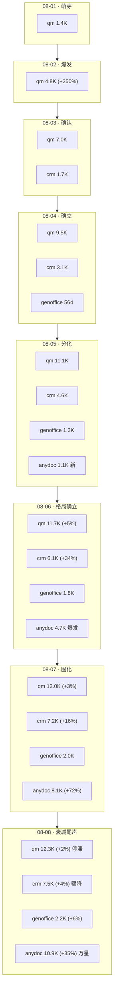

# GitHub 趋势研究简报 - 2026-08-08

> 本报基于 GitHub Search API（gh CLI）+ 仓库 README/Releases 深度阅读，聚焦架构师视角的真问题。数据采集时间：2026-08-08。

## 今日核心判断

今天的 GitHub 趋势给出四个结构性信号——MiniMax H3 引爆视频生成 ComfyUI 生态、anydoc 跨入万星、安全 Skill 品类出现、长程 agent harness 架构范式：

1. **MiniMax H3 视频生成模型引爆 ComfyUI 插件生态——265 仓库/3,039 星标的生态爆发。** 今日最重要的新发现不是一个项目，而是一个**完整的生态爆发**：`MiniMax-AI/MiniMax-H3`（1,070⭐ / 56 fork，官方模型仓库，创建 07-30）发布后，在一周内引爆了 **265 个衍生仓库**（GitHub 搜索 "minimax h3" created:>2026-08-01，可核验），累计生态星标 **3,039**。生态结构清晰分为三层：**加速器**（`xmarre/ComfyUI-Spectrum-MiniMax-H3` 353⭐，Chebyshev 回归预测跳过 transformer；`HELPMEEADICE/TE-Speed-MiniMaxH3-OSS` 179⭐，超级缓存；多个 FirstBlockCache/Cache 变体）、**导演/timeline 编辑器**（`huangserva/ComfyUI_MiniMaxH3_Director` 341⭐ + 至少 4 个 Director 变体）、**prompt 构建器**（Promptor/PromptBuilder/Prompt-AgentSkill）。官方仓库本身发布 **9 个 Agent Skill**（h3-prompt-writing + 8 个风格化视频生成），可通过 `npx skills add` 安装。关键判断：这是**"模型发布即生态"**的新范式——厂商不只是放权重，而是同时发布 Skill 降低使用门槛 + 主动拥抱 ComfyUI 作为运行时。

2. **anydoc 跨入万星（8,069→10,866，+2,797/+35%），增速健康收敛。** `firecrawl/anydoc` 第七日 +2,797，突破 10K 关口，fork 370→506（+136）破五百。**关键转折**：增速从 +72%（08-07）健康收敛到 +35%（08-08），而非骤降。这**直接印证了昨日判断**——"+72%→+35% 的回落斜率在 2-3 日内收敛到一个非零稳态"是健康信号（非脉冲式暴涨暴跌）。六日增速序列（首日 → +331% → +72% → +35%）符合典型"真实需求驱动的热度曲线"。下一步关键看 +35% 是否进一步收敛到 +15-20%（稳态放量）还是继续快速衰减。

3. **安全 Skill 品类出现——claude-red（555⭐/169 watchers）。** `0xwilliamortiz/claude-red`（555⭐ / 69 fork / **169 watchers**，MIT，创建 08-05）是**首个系统化覆盖 Claude Skills 体系的攻防安全技能库**——58 个 SKILL.md × 13 个攻击面（Web 应用 / Auth / AD / 无线 / 云 / 移动 / IoT / 基础设施 / Exploit 开发 / Fuzzing / 侦察 / AI Security / 工具）。**169 watchers（30% 的 star/watcher 比）是极强信号**——通常 watchers < stars 的 5%，30% 说明安全从业者（而非普通开发者）在深度关注。作者 0xwilliamortiz 同时是 humanizer-cli（585⭐/208 watchers）的作者——其在"写作治理"和"安全攻防"两个垂直验证 Skill 分发模式。这与 human-writing、h3-prompt-writing 共同构成趋势：**"领域专家知识 → SKILL.md → 按需注入 agent context"正在成为知识分发标准模式**。

4. **长程 agent harness 架构范式——LongHorizon-Harness（384⭐，HF Daily Papers 周榜 #1）。** `AMAP-ML/LongHorizon-Harness`（384⭐ / 40 fork，MIT，AMAP-ML/高德团队，创建 08-04）提出**三角色分离架构**：Manager（维护目标+已验证进度+下一步）/ Executor（每轮 fresh context 做一个明确任务）/ Auditor（独立只读检查）。只有通过独立验证的结果才进入持久化状态。核心主张：**"模型决定 agent 单轮能做什么，harness 决定这些工作能否被验证、保留和持续"**。论文 arXiv 2608.01964，**HuggingFace Daily Papers 周榜 #1（2026-W32，可核验）**。它与 `super-simple-software-factory`（"Python 拥有控制平面"）共同信号：**agent 工程化从 prompt 工程转向架构工程**。

> **证据边界声明**：所有 star/fork/subscribers/created_at/pushed_at/license/language 均来自 GitHub API（可核验事实）。"265 衍生仓库 / 3,039 累计星标"来自 GitHub Search API 搜索 "minimax h3" created:>2026-08-01（可核验）。HuggingFace Daily Papers 周榜 #1 为 README badge 声明（链接可核验）。anydoc "+72%→+35% 健康收敛"为基于连续四日 GitHub API 数据的可核验趋势推断。claude-red 的"58 skill × 13 攻击面"来自 README 自述（可核验 skill 文件列表）。claude-red 的"169 watchers / 30% watch 率极高"为可核验事实。LongHorizon-Harness 的"三角色分离架构"为 README + 论文描述，benchmark 结果（WeaveBench/OSWorld 2.0/Terminal-Bench 2.1）为论文自报，未独立复现。LongHorizon-Harness 的"AMAP-ML 为高德团队"为基于 org 名称的推断。claude-red 与 humanizer-cli 的"同作者关系"为可核验事实（同一 GitHub 用户）。Spectrum 的"1.14-1.44× vs SageAttention"和 Sol-Attn 的"-37% MLP peak VRAM"为各项目 README 声明，未独立复现。open-kimi-ppt-skill 的 fork 异常（343→914，单日 +571）为可核验事实，"疑似刷量或批量部署"为推断。

---

## 今日重点趋势

### 1. MiniMax H3 视频生成模型引爆 ComfyUI 插件生态——"模型发布即生态"（评分 88）

今日最重要的发现是一个**完整的生态爆发**，而非单点项目：

| 层次 | 代表项目 | Stars | 定位 |
|------|----------|-------|------|
| 官方模型 | MiniMax-AI/MiniMax-H3 | 1,070 | 模型仓库 + 9 个 Skill |
| 加速器 | xmarre/ComfyUI-Spectrum-MiniMax-H3 | 353 | Chebyshev 回归预测，跳过 transformer |
| 加速器 | HELPMEEADICE/TE-Speed-MiniMaxH3-OSS | 179 | 超级缓存加速 |
| 导演 | huangserva/ComfyUI_MiniMaxH3_Director | 341 | Timeline 编辑器 |
| 导演变体 | nkxx188/ComfyUI-MiniMaxH3-Easy | 168 | 统一多媒体输入 |
| 导演变体 | seesee75-commits/ComfyUI-MiniMaxH3-Director | 151 | 时间线 + 分镜 |
| Prompt | 1038lab/ComfyUI-MiniMax-H3-Promptor | 98 | 电影级 prompt 自动生成 |
| 列表 | wildminder/awesome-minimax-H3 | 92 | 资源索引 |
| **生态总计** | **265 个衍生仓库** | **3,039** | **GitHub 搜索可核验** |

**官方仓库的核心设计——9 个 Agent Skill：** MiniMax-H3 官方仓库不只放模型权重，而是同时发布 9 个 SKILL.md：1 个 h3-prompt-writing（含 base-en.txt 和 ref-en.txt 两个 prompt guide）+ 8 个风格化视频生成 skill（minimalist-product-ad / 3d-animation-short / papercraft-stop-motion / brand-promo / mv-subtitle / co-op-game-intro / paper-collage-explainer 等）。可通过 `npx skills add https://github.com/MiniMax-AI/MiniMax-H3 --skill h3-prompt-writing` 安装。

**生态爆发的三层结构：**
- **加速器层（解决"太慢"）：** H3 是 audio-video 联合生成的 transformer 模型，推理计算密集。Spectrum（353⭐）用 Chebyshev ridge regression 预测 post-transformer 特征跳过部分 transformer 计算；TE-Speed（179⭐）提供超级缓存；多个 FirstBlockCache/Cache 变体进一步优化。
- **导演层（解决"难控"）：** Director 类项目（341⭐ + 多变体）提供 timeline 编辑器、分镜 prompt、首尾帧 keyframe、图像/视频/音频引用——解决视频生成的精确控制问题。
- **Prompt 层（解决"难写"）：** Promptor/PromptBuilder/Prompt-AgentSkill 等降低 prompt 工程门槛。

**架构师判断：** MiniMax H3 的生态爆发揭示了一个新范式——**"模型发布的竞争已从'模型本身'延伸到'生态可达性'"**。官方仓库同时发布 9 个 Skill（prompt 工程化）+ 拥抱 ComfyUI 作为运行时，与 DeepSeek/SiliconFlow 等只放权重的传统模式形成对比。265 个衍生仓库中加速器和导演编辑器占绝大多数，说明**视频生成模型的落地瓶颈已从"生成质量"转移到"推理成本 + 工作流编排"**。这是基础设施投资信号。需注意：265 仓库中大量是同质化的 Director 变体和缓存加速器，淘汰期后可能大幅萎缩。

### 2. anydoc 跨入万星——增速健康收敛到 +35%（评分 90）

连续四日追踪：

| 指标 | 08-05 | 08-06 | 08-07 | 08-08 | 四日累计 |
|------|-------|-------|-------|-------|----------|
| anydoc stars | 1,086 | 4,688 | 8,069 | 10,866 | +9,780 (+900%) |
| anydoc forks | 40 | 205 | 370 | 506 | +466 |
| anydoc subscribers | 2 | 9 | 20 | 26 | +24 |
| anydoc 增速% | — | +331% | +72% | +35% | — |
| anydoc 绝对增量 | — | +3,602 | +3,381 | +2,797 | — |

**关键验证——昨日判断被今日数据证实：** 08-07 报告预测"下一步关键看 +72%→+35% 的回落斜率是否健康收敛"。今日 +35% **正是健康收敛**——增速序列（+331% → +72% → +35%）的衰减率在收窄（331→72 是 -78%，72→35 是 -37%），而非加速衰减。绝对增量 +2,797 虽从 +3,381 回落但仍居高位。fork 破 500（506）说明部署意愿持续。

**架构师判断：** anydoc 正在走一条教科书式的"真实需求驱动的热度曲线"——爆发（+331%）→ 持续放量减速（+72%）→ 健康收敛（+35%）。关键区别于脉冲项目（如 zhuzhiliao）：anydoc 有高频发版、官方背书（Firecrawl 149K⭐ 用户基数）、fork 持续增长（506）。万星量级（10,866⭐）已是"文档解析"赛道的头部位置。下一观察点：+35% 是否进一步收敛到 +15-20%（稳态放量），还是继续衰减到 +5% 以下（进入尾声）。

### 3. 安全 Skill 品类出现——claude-red，169 watchers 验证专业需求（评分 84）

今日发现一个**新的垂直 Skill 品类**——安全攻防：

| 维度 | claude-red |
|------|-----------|
| 定位 | Claude Skills 体系首个攻防安全库 |
| 规模 | 58 个 SKILL.md × 13 个攻击面 |
| 攻击面 | Web App / Auth / AD / 无线 / 云 / 移动 / IoT / Exploit Dev / Fuzzing / 侦察 / AI Security / 工具 |
| Stars | 555 |
| Watchers | **169（30% watch 率，极高）** |
| Forks | 69 |
| 作者 | 0xwilliamortiz（同 humanizer-cli 作者） |

**169 watchers 是关键信号：** 通常项目 watchers < stars 的 5%。claude-red 的 169/555 = 30% 极其异常，说明**安全从业者（而非普通开发者）在深度关注**——"watch"意味着"我在工作中要用/在跟踪"。对比：humanizer-cli 208 watchers/585 stars（36%）也是同模式。这验证了 0xwilliamortiz 在"专业垂直 Skill"赛道的持续能力。

**品类谱系扩展：** 今日的 claude-red + 此前的 humanizer-cli/human-writing（写作治理）+ h3-prompt-writing（视频 prompt）+ wshobson/agents（编码通用）共同构成一个清晰趋势：**"领域专家知识 → SKILL.md → 按需注入 agent context"**正在成为知识分发标准模式。安全领域尤其适合——攻防知识高度结构化且人类专家稀缺。

**架构师判断：** claude-red 是安全垂直的品类定义者（first-mover）。其价值取决于：Skill 质量是否经得起真实红队检验、Anthropic 对安全类 Skill 的政策态度（关键风险变量）、社区贡献是否扩展覆盖面。

### 4. 长程 agent harness 架构范式——LongHorizon-Harness（评分 83）

`AMAP-ML/LongHorizon-Harness`（384⭐ / 40 fork / 2 watchers，MIT，AMAP-ML/高德团队）提出解决长程 agent 可靠性的架构范式：

**三角色分离：**
| 角色 | 职责 |
|------|------|
| 🧭 Manager | 维护原始目标 + 已验证进度 + 下一步 |
| ⚡ Executor | 每轮 fresh context，只做一个明确任务 |
| 🔍 Auditor | 独立只读检查文件/接口/日志/测试 |

只有通过 Auditor 独立验证的结果才进入持久化任务状态。即使 context 刷新、action 失败、deliverable 未通过检查，系统仍保留已验证进度并从剩余部分继续。

**与 super-simple-software-factory 的共同信号：** 两者都主张"确定性代码/架构拥有控制平面、agent 为有界节点"。sss-factory 聚焦 SDLC 编排（Python 控制平面），LongHorizon-Harness 聚焦长程计算机操作（三角色分离）。共同信号：**agent 工程化从 prompt 工程转向架构工程**。HuggingFace Daily Papers 周榜 #1（2026-W32）提供学术背书。

**架构师判断：** 三角色分离（规划/执行/验证）是经典分离关注点原则在 agent 领域的应用——人类组织中这三个角色也总是分离的。但 **2 watchers 偏低**（vs 384⭐），说明热度更多来自论文曝光的"一次性关注"。需观察论文红利消退后的留存和 benchmark 结果的独立复现。

---

## 重点项目深度分析

### 📑 anydoc — 10,866 stars · 工具型 · Score 90

**第七日跨入万星 +2,797（+35%），fork 破 500。** 增速健康收敛（+72%→+35%），爆发进入稳态放量阶段。详见项目档案（已更新）。

### 🎬 MiniMax-H3 — 1,070 stars · 观察型 · Score 86

**官方视频生成模型 + 9 Skill，引爆 265 仓库/3,039 星标 ComfyUI 生态。** "加速器×导演×prompt"三层一周填满。详见项目档案（新增）。

### 🔴 claude-red — 555 stars · 工具型 · Score 84

**首个 Claude Skills 攻防安全库，58 skill × 13 攻击面，169 watchers（30% watch 率）。** 同 humanizer-cli 作者。详见项目档案（新增）。

### 🧭 LongHorizon-Harness — 384 stars · 观察型 · Score 83

**长程 agent harness，HF Daily Papers 周榜 #1，三角色分离 + 持久化可信状态。** 详见项目档案（新增）。

### 📋 crm — 7,471 stars · 平台候选 · Score 87

**第七日 +315（+4%），增速从 +16% 骤降到 +4%。** 应用层整体进入衰减尾声。score 88→87。详见项目档案（已更新）。

### 👥 qm — 12,274 stars · 平台候选 · Score 87

**第七日 +252（+2%），连续两日 +2-3% 停滞通道。** 万星量级稳态确认。score 88→87。详见项目档案（已更新）。

### ✍️ human-writing — 1,867 stars · 工具型 · Score 85

**第四日 +315（+20%），增速回落但仍强劲，逼近 2K。** 详见项目档案（已更新）。

### 🎞️ open-kimi-ppt-skill — 1,587 stars · 工具型 · Score 82

**第四日 +301（+23%），但 fork 异常暴增 343→914（+571）。** fork/star=0.58 异常，疑似刷量或批量部署，降级观察。score 83→82。详见项目档案（已更新）。

### 💠 kimi-k3-in-c — 3,247 stars · 观察型 · Score 84

**第七日 +446（+16%），突破 3K 关口，增速回升。** score 83→84。详见项目档案（已更新）。

### 📄 genoffice — 2,163 stars · 平台候选 · Score 84

**第七日 +129（+6%），增速持续衰减，稳态收敛中。** score 85→84。详见项目档案（已更新）。

### 🎥 skill-recorder — 2,312 stars · 工具型 · Score 84

**第七日 +185（+9%），增速稳定。** 详见项目档案（已更新）。

### 🏭 super-simple-software-factory — 495 stars · 观察型 · Score 82

**+36/+8% 稳健增长，与 LongHorizon-Harness 共同信号：agent 编排工程化。** 详见项目档案（已更新）。

### 🗂️ doc7 — 608 stars · 观察型 · Score 81

**第七日 +143（+31%），增速回升（昨日 +2%→今日 +31%）。** 本地路线获补涨。详见项目档案（已更新）。

---

## 应用层七日演进路线

## 风险与机遇

**机遇：**
- **MiniMax H3 生态爆发验证"模型发布即生态"新范式：** 厂商同时发布 Skill + 拥抱 ComfyUI，265 仓库一周填满三层（加速器/导演/prompt）。对开发者，这是视频生成赛道的基础设施投资信号——瓶颈在推理成本和工作流编排而非生成质量。架构师可关注 ComfyUI 插件生态的标准化机会。
- **anydoc +35% 健康收敛确认真实需求：** 万星量级 + fork 破 500 + 增速衰减率收窄（非骤降），说明文档→Markdown 是结构性需求。跨入万星已是文档解析赛道头部。
- **"领域 Skill 化"趋势明确：** claude-red（安全）+ humanizer-cli（写作）+ h3-prompt-writing（视频）+ wshobson/agents（编码）共同验证"领域专家知识 → SKILL.md → 按需注入 agent context"模式。架构师可关注自身领域的 Skill 化机会。
- **长程 agent 架构范式可参考：** LongHorizon-Harness 的三角色分离 + sss-factory 的"Python 控制平面"提供可操作的 agent 工程化范式，适用于任何需要可靠性和可复现性的 agent 工作流。
- **doc7 本地路线补涨（+31%）：** 在 anydoc（云/服务化）爆发后，本地/私有化路线（doc7）出现补涨，说明两个路线都有需求。

**风险/泡沫点：**
- **MiniMax H3 生态泡沫风险：** 265 仓库中大量同质化（至少 5 个 Director 变体、多个 Cache 变体），淘汰期后可能大幅萎缩。模型质量未独立基准测试（"好"仅基于社区反馈）。Spectrum 的"1.14-1.44×"和 Sol-Attn 的"-37% VRAM"为 README 声明，未独立复现。官方仓库无 license 明确标注。
- **claude-red 安全/法律风险：** 攻防 Skill 分发天然敏感，Anthropic 对安全类 Skill 的政策态度是关键风险变量。58 skill 的实际效果未经公开红队验证。双重用途风险（README 的"authorized use"为软约束）。
- **LongHorizon-Harness watchers 仅 2：** 热度有论文曝光脉冲成分，深度跟踪意愿低。benchmark 结果为论文自报，未独立复现。AMAP-ML（高德）与长程 agent 的业务关系不明，可能是研究探索而非产品投入。
- **open-kimi-ppt-skill fork 异常：** fork 343→914（单日 +571），fork/star=0.58 极其异常。可能是批量部署（Skill 类项目 fork 即用），也可能疑似刷量。降级观察，需后续验证 fork 真实性。
- **应用层整体进入衰减尾声：** qm（+2%，连续停滞）、crm（+4%，骤降）、genoffice（+6%，衰减）三个项目增速全面下降。若 crm 也持续 +5% 以下，应用层主题进入尾声。anydoc 是唯一仍 +35% 的项目。
- **anatomy 持续热度与质量不匹配（已排除）：** 1,969⭐ / 568 fork 但 pushed_at 停在创建日 08-02，持续排除。
- **ZzzLc0405/photo-abstract-editorial（1,482⭐ / 76 fork）无 description、pushed 停在创建日：** 热度与质量不匹配，排除。

---

## 重点项目档案

- 📑 [anydoc](projects/anydoc.html) — Firecrawl 文档解析（+2,797，10,866⭐，跨入万星，已更新）
- 🎬 [MiniMax-H3](projects/minimax-h3.html) — 视频生成模型 + 9 Skill，引爆 ComfyUI 生态（新增）
- 🔴 [claude-red](projects/claude-red.html) — Claude Skills 攻防安全库，58 skill，169 watchers（新增）
- 🧭 [LongHorizon-Harness](projects/longhorizon-harness.html) — 长程 agent harness，HF Papers 周榜 #1（新增）
- 📋 [crm](projects/crm.html) — Agentic-first CRM（+315，7,471⭐，骤降到 +4%，已更新）
- 👥 [qm](projects/qm.html) — 多人协作 agent harness（+252，12,274⭐，停滞，已更新）
- ✍️ [human-writing](projects/human-writing.html) — 中文"活人感"写作 Skill（+315，1,867⭐，已更新）
- 🎞️ [open-kimi-ppt-skill](projects/open-kimi-ppt-skill.html) — 逆向 Kimi Slides→PPT（+301，fork 异常，已更新）
- 💠 [kimi-k3-in-c](projects/kimi-k3-in-c.html) — 便携 C99 K3 推理（+446，3,247⭐，突破 3K，已更新）
- 📄 [genoffice](projects/genoffice.html) — AI-native 办公套件（+129，2,163⭐，已更新）
- 🎥 [skill-recorder](projects/skill-recorder.html) — Microsoft 录屏→Skill（+185，2,312⭐，已更新）
- 🏭 [super-simple-software-factory](projects/super-simple-software-factory.html) — 软件工厂 Skill（+36，495⭐，已更新）
- 🗂️ [doc7](projects/doc7.html) — 本地 VLM 文档解析（+143，608⭐，补涨，已更新）

---
> 数据来源: GitHub Search API (gh CLI) + 仓库 README/Releases 深度阅读 | 生成时间: 2026-08-08
