# GitHub 趋势研究简报 - 2026-08-09

> 本报基于 GitHub API（gh CLI）+ 仓库 README/Releases 深度阅读，聚焦架构师视角的真问题。数据采集时间：2026-08-09。所有 star/fork/created_at/pushed_at/license/language 均来自 GitHub API（可核验事实），推断与待观察项会显式标注。

## 今日核心判断

今天最重要的信号是**几个连续判断被市场验证**，而非全新爆发：

1. **MiniMax-H3 反而加速（+65%），模型仓库增速反超衍生生态。** `MiniMax-AI/MiniMax-H3`（1,769⭐ / 97 fork，Python，license 未标注，创建 07-30）今日 +699（1,070→1,769，+65%），衍生生态仓库从 265 增至 314（GitHub 搜索 "minimax h3" created:>2026-08-01，可核验）。**关键反转**：前几日衍生生态增速领先，今天官方仓库自身增速（+65%）反超衍生生态增量。这印证了昨日判断——"视频生成模型落地瓶颈已从'生成质量'转移到'推理成本+工作流编排'"：当加速器（Spectrum 382⭐、Turbo 291⭐）和导演（Director 406⭐）填满后，用户开始回到官方仓库做主路径集成。**加速器类项目持续领跑衍生生态**（Spectrum +29 今日，Turbo 为新进入者 291⭐）。

2. **anydoc 进入稳态（+11%），教科书式真实需求曲线收敛完成。** `firecrawl/anydoc`（12,055⭐ / 575 fork / 29 subscribers，Rust，MIT，创建 08-03）第八日 +1,189，fork 506→575。**关键验证**：增速序列 +331%（08-06）→ +72%（08-07）→ +35%（08-08）→ +11%（08-09），衰减率单调收窄（331→72 是 -78%，72→35 是 -51%，35→11 是 -69%——绝对衰减幅度在下降但比例有波动，整体收敛趋势明确）。**稳态增量约 +1K/日**，万星量级（12,055⭐）在文档解析赛道头部位置巩固。这与脉冲项目（如 open-kimi-ppt-skill 今日归档）形成鲜明对比。

3. **open-kimi-ppt-skill 被归档——昨日 fork 异常判断被验证。** `Binaryify/open-kimi-ppt-skill`（1,588⭐ / 1,113 fork，archived=true，pushed 08-07）昨日报告 "fork 异常暴增 343→914（单日+571），fork/star=0.58 异常，疑似刷量或批量部署"。**今天仓库被作者归档**。这是本报"分清热度与价值"方法论的直接验证案例——异常 fork 增速（非 star）往往是刷量/批量部署/弃坑前兆，而非真实采用信号。star 数从 1,587 到 1,588 几乎无增长，但 fork 1,113 持续异常。**案例价值**：一个 1.5K⭐ 项目因为 fork/star 比异常被提前标记，两天后归档。

4. **本地 MoE 推理路线扩展到 Apple 原生栈——Swiftlet。** `leonickson1/Swiftlet`（456⭐ / 20 fork / 3 subscribers，Swift+Metal，Apache-2.0，创建 08-03）在 iPhone 17 上跑 35B Qwen3.6 MoE（峰值 2.6GB RAM，按需流式加载 expert weights），80B 模型 4.3GB RAM。这与 `kimi-k3-in-c`（C99，今日继续 +16% 加速，3,751⭐）共同信号：**本地大模型推理从单点（C99）扩展到多平台覆盖**（Apple Swift 原生栈）。两者技术路线同构——"只驻留 dense core，按需流式加载 MoE expert"——但面向不同平台。

> **证据边界声明**：所有 star/fork/created_at/pushed_at/license/language/archived 均来自 GitHub API（可核验事实）。MiniMax-H3 衍生仓库计数 314 来自 GitHub Search API 搜索 "minimax h3" created:>2026-08-01（可核验，total_count=314，其中 stars:>10 的有 41 个）。anydoc "+331%→+72%→+35%→+11% 单调收敛" 为基于连续五日 GitHub API 数据的可核验趋势推断；"稳态增量约 +1K/日"为基于今日数据的推断，待后续验证。Swiftlet 的 "35B 模型 2.6GB RAM / 7-11 tok/s / iPhone 17 上 2.5GB RAM / 1 tok/s" 为 README 声明（表格数据，可核验但未独立复现），README 明确标注 "only about 3B parameters are active per token, so these models chat and write like large models but recall facts like small ones"（诚实披露）。Swiftlet 的 "ANEMLL 先例"为 README 引用（可核验链接）。JoyAI-Video-Edit 的 "30.19 FPS @ 720p"为 README/论文声明（arXiv 2608.03974），未独立复现。open-kimi-ppt-skill "archived=true"为 GitHub API 可核验事实；"昨日判断被验证"为基于昨日报告与今日事实的推断。Swiftlet 作者 leonickson1 followers=6，知名度低，热度可持续性待观察。所有增速百分比为基于 GitHub API 连续观测的计算值（可核验）。

---

## 今日重点趋势

### 1. MiniMax-H3 反而加速——模型仓库增速反超衍生生态（评分 88）

今日 H3 生态最显著的变化不是衍生生态继续增长，而是**官方仓库自身增速跃升**：

| 维度 | 08-08 | 08-09 | 变化 |
|------|-------|-------|------|
| 官方仓库 stars | 1,070 | 1,769 | +699（+65%） |
| 衍生生态仓库数 | 265 | 314 | +49 |
| 加速器类领头 | Spectrum 353⭐ | Spectrum 382⭐ | +29（持续） |
| 新加速器 | — | Turbo 291⭐（新进入） | 🆕 |
| 导演类领头 | Director 341⭐ | Director 406⭐ | +65 |

**架构师判断：** 这一反转印证了昨日判断——"视频生成模型落地瓶颈已从'生成质量'转移到'推理成本+工作流编排'"。当加速器（解决"太慢"）和导演（解决"难控"）在一周内填满后，用户开始回到官方仓库做主路径集成（而非只玩插件）。**模型仓库 +65% 增速 vs 衍生生态 +49 仓库增量**，说明生态从"插件爆发期"进入"主路径集成期"。加速器类（Spectrum/Turbo）持续领跑，说明**推理成本仍是首要瓶颈**（比工作流编排更痛）。

需注意：官方仓库仍无 license 标注（license=null），这是生态采用的法律风险变量。314 个衍生仓库中大量同质化（Director 变体、Cache 变体），淘汰期后可能大幅萎缩。

### 2. anydoc 进入稳态放量——教科书式真实需求曲线收敛完成（评分 90）

连续五日追踪，增速序列完成收敛：

| 指标 | 08-05 | 08-06 | 08-07 | 08-08 | 08-09 | 五日累计 |
|------|-------|-------|-------|-------|-------|----------|
| anydoc stars | 1,086 | 4,688 | 8,069 | 10,866 | 12,055 | +10,969 (+1010%) |
| anydoc forks | 40 | 205 | 370 | 506 | 575 | +535 |
| anydoc 增速% | — | +331% | +72% | +35% | +11% | — |
| anydoc 绝对增量 | — | +3,602 | +3,381 | +2,797 | +1,189 | — |

**关键验证——昨日判断被今日数据再次证实：** 08-08 报告预测"下一步关键看 +35% 是否进一步收敛到 +15-20%（稳态放量），还是继续衰减到 +5% 以下（进入尾声）"。今日 +11% **正是稳态放量区间**（落在 +15% 以下但绝对增量 +1,189 仍居高位，非骤降到零）。**稳态增量约 +1K/日**（推断，待后续验证是否维持）。

**架构师判断：** anydoc 五日增速序列（+331%→+72%→+35%→+11%）是教科书式的"真实需求驱动的热度曲线"——爆发→持续放量减速→健康收敛→稳态放量。与脉冲项目（open-kimi-ppt-skill 今日归档）形成鲜明对比：anydoc 有高频发版（7 版，但今日无新版本，发版节奏放缓）、官方背书（Firecrawl 用户基数）、fork 持续增长（575）。**关键区别**：脉冲项目的特征是 fork 异常增速（刷量/批量部署）后骤降归档，真实需求项目是 fork 稳定增长 + star 增速单调收敛到非零稳态。万星量级（12,055⭐）已是文档解析赛道头部。下一观察点：+11% 是否维持，还是继续衰减到 +5% 以下。

### 3. open-kimi-ppt-skill 被归档——异常信号判断方法论验证（评分 78）

| 维度 | 08-07 | 08-08 | 08-09 |
|------|-------|-------|-------|
| stars | 1,286 | 1,587 | 1,588（+1，几乎无增长） |
| forks | 343 | 914（+571 异常） | 1,113（+199，异常持续） |
| fork/star 比 | 0.27 | 0.58 | 0.70（持续异常） |
| 状态 | active | active（昨日标记可疑） | **archived=true（归档）** |

**架构师判断：** 这是一个"异常信号→提前标记→落地验证"的完整案例。08-08 报告基于 fork/star=0.58 异常比值（正常项目 <0.3）判断"疑似刷量或批量部署"，降级观察。今天仓库被作者归档，fork 继续异常增长（914→1,113）但 star 几乎不动（1,587→1,588）。**方法论价值**：fork 增速远超 star 增速是"刷量/批量部署/弃坑前兆"的可靠信号——fork 是机器人/脚本能轻易操作的（批量 clone-push），但 star 同样容易刷，关键是**两者的比值**。正常项目 star >> fork（因为 star 门槛低），异常项目 fork 反超或接近 star。此项目 fork/star=0.70 极端异常。归档后 star/fork 基本冻结，作为案例库保留，不再跟踪。

### 4. 本地 MoE 推理路线扩展到 Apple 原生栈——Swiftlet（评分 83）

`leonickson1/Swiftlet`（456⭐ / 20 fork / 3 subscribers，Swift，Apache-2.0，创建 08-03）核心技术：

**关键声明（README 表格，可核验但未独立复现）：**
| 模型 | 磁盘 | 峰值 RAM | 解码速度（M5 Mac） |
|------|------|----------|---------------------|
| Qwen3.6-35B-A3B, 4-bit | 18 GB | 2.6 GB | 7-11 tok/s |
| Qwen3.6-35B-A3B, 8-bit | 34 GB | 7.6 GB | 3.5-4 tok/s |
| Qwen3-Next-80B-A3B, 4-bit | 42 GB | 4.3 GB | 4.5-5 tok/s |
| 同 35B 在 iPhone 17 上 | — | 2.5 GB | 约 1 tok/s |

**技术路线与 kimi-k3-in-c 同构：** 两者都采用"只驻留 dense core + 按需流式加载 MoE expert weights"策略，但面向不同平台：
- kimi-k3-in-c：C99，跨平台，无依赖，CPU 推理，K3 模型
- Swiftlet：Swift+Metal，Apple 原生，GPU 推理，Qwen3.6/3-Next 模型

**诚实披露（README 明确）：** "only about 3B parameters are active per token, so these models chat and write like large models but recall facts like small ones"——MoE 模型的固有局限（A3B = 约 3B 活跃参数），不回避。README 还引用了 ANEMLL 的先例（"397B MoE streaming on iPhone 17 Pro as a proof of concept in early 2026"），说明这不是孤例，而是"本地大模型流式推理"赛道的延续。

**架构师判断：** Swiftlet 的价值在于把"本地大模型推理"从 C99/llama.cpp 路线扩展到 Apple 原生栈（Swift+Metal）。但需注意：作者 leonickson1 followers=6（GitHub API 可核验），知名度极低，热度可持续性存疑；3 subscribers 说明深度跟踪意愿低；解码速度（iPhone 17 上 1 tok/s）尚不实用。与 kimi-k3-in-c（8 天 3,751⭐，已验证持续增长）相比，Swiftlet 还在早期验证阶段。

---

## 重点项目深度分析

### 📑 anydoc — 12,055 stars · 工具型 · Score 90

**第八日 +1,189（+11%），稳态放量，fork 575。** 增速序列 +331%→+72%→+35%→+11% 收敛完成。详见项目档案（已更新）。

### 🎬 MiniMax-H3 — 1,769 stars · 观察型 · Score 86→88

**反而加速 +699（+65%），模型仓库增速反超衍生生态。** 生态仓库 265→314，加速器类（Spectrum/Turbo）持续领跑。score 86→88。详见项目档案（已更新）。

### 🔴 claude-red — 681 stars · 工具型 · Score 84

**第八日 +126（+23%），208 watchers 持续高位。** 安全 Skill 品类定义者地位巩固。今日无新 commit（GitHub API 可核验），增长来自曝光惯性。详见项目档案（已更新）。

### 🍎 Swiftlet — 456 stars · 观察型 · Score 83（新增）

**Swift+Metal 在 iPhone 17 上跑 35B MoE，本地推理路线扩展到 Apple 栈。** 详见项目档案（新增）。

### 🎞️ JoyAI-Video-Edit — 512 stars · 观察型 · Score 82（新增）

**京东开源实时流式视频编辑，720p 30 FPS，因果 VAE。** 详见项目档案（新增）。

### 📋 crm — 7,751 stars · 平台候选 · Score 87

**第八日 +280（+4%），连续四日衰减尾声。** 应用层整体进入衰减尾声。详见项目档案（已更新）。

### 👥 qm — 12,525 stars · 平台候选 · Score 87

**第八日 +251（+2%），连续三日停滞通道。** 万星量级稳态确认。详见项目档案（已更新）。

### 🔇 open-kimi-ppt-skill — 1,588 stars (archived) · 观察型 · Score 82→70

**已被作者归档，昨日 fork 异常判断被验证。** 降级为案例库。score 82→70。详见项目档案（已更新）。

### ✍️ human-writing — 1,985 stars · 工具型 · Score 85→84

**第五日 +118（+6%），增速骤降（+20%→+6%）。** 逼近 2K 但增长明显放缓。score 85→84。详见项目档案（已更新）。

### 💠 kimi-k3-in-c — 3,751 stars · 观察型 · Score 84→85

**第八日 +504（+16%），继续加速，fork 466→582。** 与 Swiftlet 形成"多平台本地推理"共振。score 84→85。详见项目档案（已更新）。

### 📄 genoffice — 2,249 stars · 平台候选 · Score 84

**第八日 +86（+4%），增速持续衰减。** 稳态收敛中。详见项目档案（已更新）。

### 🎥 skill-recorder — 2,509 stars · 工具型 · Score 84

**第八日 +197（+9%），增速稳定。** 三层栈"技能提取层"持续。详见项目档案（已更新）。

---

## 应用层八日演进路线

```mermaid
flowchart TB
    subgraph DAY1["08-01 · 萌芽"]
        QM1["qm 1.4K"]
    end
    subgraph DAY2["08-02 · 爆发"]
        QM2["qm 4.8K (+250%)"]
    end
    subgraph DAY3["08-03 · 确认"]
        QM3["qm 7.0K"]
        CRM3["crm 1.7K"]
    end
    subgraph DAY4["08-04 · 确立"]
        QM4["qm 9.5K"]
        CRM4["crm 3.1K"]
        GO4["genoffice 564"]
    end
    subgraph DAY5["08-05 · 分化"]
        QM5["qm 11.1K"]
        CRM5["crm 4.6K"]
        GO5["genoffice 1.3K"]
        AD5["anydoc 1.1K 新"]
    end
    subgraph DAY6["08-06 · 格局确立"]
        QM6["qm 11.7K (+5%)"]
        CRM6["crm 6.1K (+34%)"]
        GO6["genoffice 1.8K"]
        AD6["anydoc 4.7K 爆发"]
    end
    subgraph DAY7["08-07 · 固化"]
        QM7["qm 12.0K (+3%)"]
        CRM7["crm 7.2K (+16%)"]
        GO7["genoffice 2.0K"]
        AD7["anydoc 8.1K (+72%)"]
    end
    subgraph DAY8["08-08 · 衰减尾声"]
        QM8["qm 12.3K (+2%)"]
        CRM8["crm 7.5K (+4%)"]
        GO8["genoffice 2.2K"]
        AD8["anydoc 10.9K (+35%) 万星"]
    end
    subgraph DAY9["08-09 · 稳态"]
        QM9["qm 12.5K (+2%) 停滞"]
        CRM9["crm 7.8K (+4%) 衰减"]
        GO9["genoffice 2.2K (+4%)"]
        AD9["anydoc 12.1K (+11%) 稳态"]
    end
    DAY1 --> DAY2 --> DAY3 --> DAY4 --> DAY5 --> DAY6 --> DAY7 --> DAY8 --> DAY9
```

## 风险与机遇

**机遇：**
- **MiniMax-H3 加速 + 模型仓库增速反超衍生生态：** 说明生态从"插件爆发期"进入"主路径集成期"，用户回到官方仓库做主路径集成。加速器类（Spectrum/Turbo）持续领跑，推理成本仍是首要瓶颈。架构师可关注 H3 主路径集成的工具链机会。
- **anydoc 稳态放量 +11%：** 教科书式真实需求曲线收敛完成，稳态增量约 +1K/日，万星量级头部位置巩固。文档→Markdown 是结构性需求。
- **"本地 MoE 推理"赛道多平台覆盖：** Swiftlet（Apple Swift）+ kimi-k3-in-c（C99 跨平台）+ ANEMLL（先例）共同构成"本地大模型流式推理"赛道。架构师可关注"只驻留 dense core + 按需流式加载 MoE expert"模式的跨平台机会。
- **JoyAI-Video-Edit 实时流式视频编辑：** 720p 30 FPS 将视频编辑从离线批处理推向交互式流生成，因果 VAE + 有界 KV-state 推理是工程创新。架构师可关注流式媒体处理的新范式。

**风险/泡沫点：**
- **MiniMax-H3 生态泡沫风险持续：** 314 仓库中大量同质化（Director 变体、Cache 变体），淘汰期后可能大幅萎缩。官方仓库无 license 标注（license=null），是法律采用风险变量。模型质量未独立基准测试。
- **open-kimi-ppt-skill 归档验证"异常 fork 判断"：** 昨日基于 fork/star=0.58 异常比值的判断今天落地为归档。此案例验证了方法论，但也提醒：并非所有 fork 异常都是刷量，需结合 star 增速（本项目 star 几乎不动）综合判断。
- **Swiftlet 极早期 + 作者知名度低：** 456⭐ / 3 subscribers，作者 followers=6，iPhone 17 上 1 tok/s 尚不实用。README 的 RAM/速度数据为自报，未独立复现。需观察是否被 Apple 开发者社区实际采用。
- **JoyAI-Video-Edit 30 FPS 为部署基准声明：** 16B 模型 + 因果 VAE + 有界 KV-state，30.19 FPS 是论文/README 声明（arXiv 2608.03974），未独立复现。消费级 GPU 支持在 TODO（尚未实现）。
- **应用层整体进入衰减尾声（第八日确认）：** qm（+2%，连续三日停滞）、crm（+4%）、genoffice（+4%）三个项目增速全面下降到低个位数。anydoc 是唯一仍 +11% 的项目，但已从 +35% 收敛。应用层主题可能进入尾声。
- **human-writing 增速骤降（+20%→+6%）：** 中文"活人感"写作 Skill 增速明显放缓，可能是品类早期爆发后的自然回落，也可能是需求天花板。需观察是否如 anydoc 一样收敛到非零稳态。

---

## 重点项目档案

- 📑 [anydoc](projects/anydoc.html) — Firecrawl 文档解析（+1,189，12,055⭐，稳态放量，已更新）
- 🎬 [MiniMax-H3](projects/minimax-h3.html) — 视频生成模型（+699，1,769⭐，反而加速，已更新）
- 🔴 [claude-red](projects/claude-red.html) — Claude Skills 攻防安全库（+126，681⭐，已更新）
- 🍎 [Swiftlet](projects/swiftlet.html) — Swift+Metal 本地 MoE 推理（新增）
- 🎞️ [JoyAI-Video-Edit](projects/joyai-video-edit.html) — 京东实时流式视频编辑（新增）
- 📋 [crm](projects/crm.html) — Agentic-first CRM（+280，7,751⭐，衰减尾声，已更新）
- 👥 [qm](projects/qm.html) — 多人协作 agent harness（+251，12,525⭐，停滞，已更新）
- 🔇 [open-kimi-ppt-skill](projects/open-kimi-ppt-skill.html) — 已归档（昨日判断验证，降级案例库，已更新）
- ✍️ [human-writing](projects/human-writing.html) — 中文写作 Skill（+118，1,985⭐，增速骤降，已更新）
- 💠 [kimi-k3-in-c](projects/kimi-k3-in-c.html) — 便携 C99 K3 推理（+504，3,751⭐，继续加速，已更新）
- 📄 [genoffice](projects/genoffice.html) — AI-native 办公套件（+86，2,249⭐，已更新）
- 🎥 [skill-recorder](projects/skill-recorder.html) — Microsoft 录屏→Skill（+197，2,509⭐，已更新）

---
> 数据来源: GitHub API (gh CLI) + 仓库 README/Releases 深度阅读 | 生成时间: 2026-08-09
