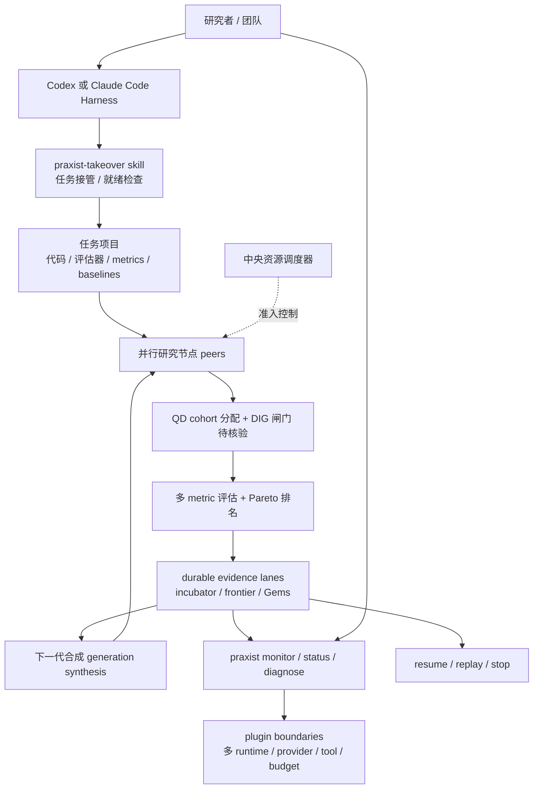

# GitHub 趋势研究简报 - 2026-08-29

> 本报基于 GitHub Search API（created/pushed:2026-08-25..2026-08-29，sort=stars，per_page=100）与各项目 README / 文档 抓取的快照。**"趋势"是基于公开元数据的观察，不是价值判断；下游采用应结合生产成熟度、合规与企业内规。** 延续 8-22..8-28 的"agent infrastructure / skills 商品化 / 多模态基础"判断，今日新增主题集中于 **"自治研究系统正式开源 + Rust 原生 Spotify 客户端 + narrative-level 去 AI 写作 skill + ChatGPT 订阅桥接 Codex + Agent-agnostic 上下文接力 + Coding Agent 世界模型"** 六条新趋势。

## 今日重点趋势

**1. autonomous-research / 可测量的计算机可执行研究系统正式开源（arXiv + PyPI 双发）（1 个核心项目）**（评分 94）

代表性项目：sapientinc/PRAXIST（1451⭐，Python，2 天）。延续 8-26 的"agent memory 基础设施"与 8-28 的"大厂多模态 embedding 正式开源"判断，今日视角变体是 **"企业级自治研究系统（autonomous research system）首次完整开源 ——Sapient Inc. 把完整的 research loop（多 peer 并行 + 多代合成 + evidence lane + 中央资源调度 + QD/DIG）做成 Codex/Claude Code 的 skill 集合并以 PyPI 包形式发布"**：

- README 自述 **"Praxist is an autonomous research system for measurable, computer-executable research. It coordinates parallel research peers, task-owned evaluation, durable evidence, and generation-to-generation synthesis"** 与 **"treats research as a persistent process rather than a sequence of disconnected prompts"** ——明确把研究建模成"长期可监控、可恢复、可重放"的进程，而非一次性 prompt。
- README + 文档自述 **"Use it when a project already runs and its objective is measurable, but the best path forward is still unknown"** ——明确边界：**必须先有一个可运行项目与可执行的评估器（evaluator），Praxist 才接管 research loop**。"parallel research peers / multi-generation synthesis / durable evidence lanes / Quality-Diversity (QD) + optional Deep Innovation Gate (DIG) / central resource scheduling / resume, replay, monitoring / plugin boundaries" 七大能力是 README 表格中明示的研究编排原语。
- 接入方式：**Codex-native mode**（用已保存的 Codex 订阅，无 API key）+ Claude Code 通过 host-specific one-line 安装。CLI：`praxist setup --interactive --install-skills codex`、`praxist status --json`、`praxist --monitor --latest`、`praxist stop <run_id>`、`praxist resume <run_dir>`。Skills 包括 `praxist-takeover-codex`、`praxist-onboarding`、`praxist-task-initialization`、`praxist-control`、`praxist-diagnostic`、`praxist-scientific-research`、`praxist-runtime-install`、`terminal-line-plot`。
- 架构边界（README 表格 **"Praxist owns / The task project owns"** 明示）：**Praxist 拥有**研究编排、生命周期、证据协议、重放、调度、扩展接口；**任务项目拥有**研究目标、可执行代码、评估器、metrics、baselines、prompts、roles、领域约束。"Praxist contains no task-specific scientific assumptions. A task remains the single source of truth for what should be tested and what counts as valid evidence." ——这是把研究方法论与领域知识严格解耦的设计，对 ML / DL 实验室科研可移植性极关键。
- 行业意义：**(1) "autonomous research"是企业研发自动化最重要品类之一**——OpenAI/DeepMind/Anthropic 都在做内部研究 agent，但完整开源 + 与主流 Coding Agent Harness 集成 + arXiv 论文 + PyPI 发布的一体化产品级实现，在公开生态非常稀缺（arXiv 2608.25955 是其论文 ID）；**(2) "research as persistent process"的工程化（resume / replay / monitoring / evidence lane / 中央资源调度）是之前 GPT Researcher / STORM / DeepResearch 等一次性 agent 缺失的能力**；**(3) "plugin boundaries"（多 runtime / 多 provider / 多 tool / 多 budget / 多 workflow）让 Praxist 不绑定 Codex/Claude Code 单点**，对采购方友好；**(4) "Fair Source License"（README 表述）而非纯 OSI 许可证意味着商业可用但有边界**，下游需读 LICENSE 文件独立核验。
- 需观察：(1) 1451⭐/2 天是否能转化为长期采用（与 8-26 memory 类项目对比，看是否昙花）；(2) "durable evidence lanes" 与"multi-generation synthesis"是否在公开 benchmark 跑出可复现证据；(3) Fair Source License 的具体边界对学术 vs 商业使用的差异；(4) QD + DIG 算法在真实 ML 研究任务上的实际收益与计算开销。

**2. native-spotify-client / Rust + egui + librespot 跨平台原生 Spotify 客户端替代（1 个核心项目）**（评分 86）

代表性项目：crmne/fastpotify（388⭐，Rust，2 天）。延续 8-22..8-28 的"agent runtime 设备化 + 本地优先"判断，但今日视角变体是 **"非 AI 赛道也出现了'去 Electron / 去 Chromium / Rust + egui + 本地驱动'的原生客户端复兴"**：

- README 自述 **"Spotify, native and fast. A lightweight Spotify client written in Rust with egui, playing music through librespot. It runs on Linux, macOS, and Windows, starts in well under a second, and stays small while it runs. There is no browser engine anywhere in the process"** ——明确去 Electron / Tauri WebView 的定位。
- 能力边界：**(a) 自身是 Spotify Connect 设备**——手机选它即可播放，gapless、320 kbps、可选音量归一化与磁盘音频缓存；**(b) 控制其他 Connect 设备**（音箱、手机、电脑）+ **mDNS 发现未登录账户的 librespot/spotifyd/硬件接收器**（README 自述"a librespot, spotifyd, or hardware receiver waiting on the LAN is invisible to Spotify's API until it has an account. Fastpotify discovers those over mDNS and connects them for you"——这是"控制层反发现"的有趣扩展）；**(c) 完整库浏览**（playlist/Liked Songs/saved albums/followed artists/podcasts/saved episodes）+ 搜索 + Home 推荐 + 艺术家页 + 队列面板 + 专辑封面取色 + 浅/深色 + 键盘优先 + 关闭窗口音乐继续（Linux status notifier）。
- 行业意义：**(1) 与 8-25 mrpub/forte（Rust 本地优先）/ nuphus（Tauri + React）形成同期合流——"去 Electron 化"已从 devtool / agent runtime 扩散到日常消费类应用**；**(2) 388⭐/2 天 + MIT + 完整多平台发布是"个人开发者也能交付跨平台原生应用"的低门槛范本**；**(3) "album-art colour" / "keyboard-first" / "window-closes-music-keeps-playing" 等细节反映 Rust + egui 在做"delightful desktop UX"上仍有大量创新空间**。
- 需观察：(1) 1451⭐ vs 388⭐ 巨大体量差说明非 AI 赛道的爆款阈值远低于 AI Coding 赛道，是否会因 Spotify API 政策变动而受冲击；(2) librespot 的协议兼容性是否长期与 Spotify 官方同步；(3) mDNS 反发现功能是否会与官方 Connect 政策产生摩擦。

**3. humanizer-skill / 从表面润色升级到叙事架构层的去 AI 化写作 skill（1 个核心项目）**（评分 86）

代表性项目：Nanako0129/sepia（245⭐，Shell 仓库主体 / Markdown，1 天）。延续 8-26 的"agent-skills 单点工作流"判断，今日视角变体是 **"humanizer 从'改词改句'升级到'narrative architecture repair'——一个 SKILL.md 同时被 Claude Code / Codex / Grok Build / Antigravity 四平台加载，专门改 LLM 写作'主题被叙述者解释 / 单线因果 / 情感只以躯体呈现 / 没有真实指涉 / 没有读者 / 线性时间 / 主角成长收尾'七类叙事架构指纹"**：

- README 自述 **"De-AI writing at the layer that actually gives AI away. Fiction gets its narrative architecture repaired before anyone touches word choice; professional documents (release notes, PR replies, postmortems, tickets, technical articles) each get rules matched to their venue"** ——明确把"AI 可检测"的根因定位在叙事架构层。
- 学术证据基础：**README 引用 Russell et al. 2026 的 StoryScope（arXiv 2604.03136，61,608 故事 / human + 5 frontier LLMs）—— 用 narrative-structure features 单独分类即可达 93.2% macro-F1；改 surface style 仅从 95.5% 降到 93.9%（"the tells that survive are architectural"）**。sepia 把 StoryScope + 11 个相关研究（README 自述）消化成三遍写作/修订协议：① narrative architecture / ② discourse flow / ③ surface style。
- 操作原语：四类操作 `write` / `review` (diagnose only) / `refactor` (minimal edits) / `recreate` (full rewrite) + 30 特征诊断 rubric + per-model fingerprint corrections（Claude/GPT/Gemini/DeepSeek/Kimi）。对 release notes / PR replies / postmortems / tickets / 技术文章各设 venue-matched rule。
- 行业意义：**(1) "humanizer 在 surface style 上失败"是被论文证伪的——意味着 narrative architecture 才是 humanizer 的下一个决胜战场**；**(2) sepia 选用 Agent Skills 规范 + 单一 SKILL.md 跨四平台（Claude Code / Codex / Grok Build / Antigravity）证明 8-26..8-28 的"skill 跨 harness"判断从'论文级'进入'生产级'**；**(3) per-model fingerprint correction（针对不同模型的写作指纹做反向调整）是 niche 但极有商业价值的方向——尤其是平台方对 AI 生成内容的标识要求越来越强时**。
- 需观察：(1) 245⭐/1 天是否能在 1 周内突破 1k⭐（与 8-28 fire-your-seo-agency 213⭐ 对比）；(2) StoryScope 数据集是否对外可下载（用于复现 93.2%）；(3) narrative architecture 修复是否真能把分类器召回从 93.2% 拉到 <30%（README 提到"selects 3-5 moves per story and leaves slack"——节制式修复比"全规则全打"更稳）。

**4. harness-economy / ChatGPT 订阅 + Codex Harness 的 MCP 只读桥接（1 个核心项目）**（评分 84）

代表性项目：XiaoDuoYa/codex-with-chatgpt（239⭐，TypeScript，1 天）。延续 8-26 的"agent-skills 单点工作流 × 真实数据"与 8-27 的"AI Coding 项目化"判断，今日视角变体是 **"在 ChatGPT 订阅闲置 vs Codex API 额度紧张的真实矛盾下，把 ChatGPT 网页订阅的'思考'与 Codex 的'执行'用 MCP 只读桥拼起来"**：

- README 自述 **"ChatGPT Plus/Pro web quota sits idle while your coding agent burns scarce API/Codex tokens on planning and review. This project moves the thinking to the subscription you already pay for; Codex only executes. No API keys, no reverse proxy — official web UI plus a read-only MCP bridge"** ——明确"思考 / 执行分离"的资源经济学叙事。
- 桥接协议：ChatGPT 通过 OAuth 受保护的**只读 MCP** 连接按需读取当前工作区的"真正需要的那几行代码"。README 自述 **"Your repository is never uploaded: ChatGPT reads exactly the lines it needs through a secure, OAuth-protected, read-only MCP connection to your current workspace"**。
- 接入 UX：one-paste install——"把下面这段话原样复制给你的编码 Agent（Codex），然后去倒杯咖啡"——零 git / Node / 终端门槛，README 自述面向"不懂技术的小白"。
- 行业意义：**(1) 思考 / 执行分离是 AI Coding 经济学的下一个高价值设计模式——订阅 vs API 的成本差异可达 10×**；**(2) "只读 MCP"是 agent 安全的关键原语——防止 agent 把整个仓库上传到第三方 LLM**；**(3) 239⭐/1 天说明 ChatGPT 订阅用户群对"释放订阅价值"的需求真实存在**。
- 需观察：(1) ChatGPT 网页版 UI 变动是否会破坏只读桥（脆弱性）；(2) OAuth 范围是否真正限定为只读（token scope 治理）；(3) "agent 自动安装 + agent 自动跑通"的安全边界——agent 在无人监督下执行 README 中的"所有事情你自己做"是新的 Prompt Injection 攻击面。

**5. agent-agnostic-ade / 跨多 Agent Harness 的上下文接力 + 持久工作空间（2 个项目）**（评分 82）

代表性项目：acryldev/acryl（219⭐，TypeScript，4 天）、XiaoDuoYa/codex-with-chatgpt（239⭐，TypeScript，1 天）。延续 8-24 的"x64dbg-mcp-server"与 8-26 的"heimdall / Perenna"agent memory 持久化判断，今日视角变体是 **"agent 不再属于单一 harness（Claude Code / Codex / OpenCode / Pi / Gemini CLI / DeepSeek Harness），而是属于'持续工作空间 + 项目上下文 + 任务 + 工件 + handoffs'的中间层；harness 来来去去，工作继续"**：

- ACRYL README 自述 **"ACRYL is an agent-agnostic Agentic Development Environment and continuity layer for software work. The project does not belong to Claude Code, Codex, OpenCode, Pi, Gemini CLI, DeepSeek, or any other individual agent. ACRYL owns the persistent workspace, project context, tasks, artifacts, and handoffs. Coding agents are replaceable workers that enter and leave the same development scene"** 与 **"Same project, Same context, Same work, Different agents"** ——明确"ADE 不属于任何单一 Agent"的定位。
- 接入的 harness 明示：Claude Code / Codex / OpenCode / Pi / Gemini CLI / DeepSeek Harness native agents + 更多（README 自述 "ACRYL is being designed to support native and external coding agents through capability-based providers"）。状态：active early development（README 自述 **"ACRYL is in active early development. Interfaces, workflows, and packaging may change while the first public foundation is established"**）。
- codex-with-chatgpt 同属该方向：ChatGPT 订阅作为 planning/review brain + Codex 作为 executor + 只读 MCP 桥——本质是把"harness 可替换性"延展到"LLM 也可替换"。
- 行业意义：**(1) 与 8-26 heimdall / Perenna 的"memory as MCP"形成同期合流——"ADE as Continuity Layer"是 next step**；**(2) "agent 可替换"对企业是 anti-lock-in 的关键价值，对个人开发者是"不把工作绑定在某家厂商的 Pro/订阅"**；**(3) 219⭐/4 天相对稳定 + MIT + Discord + 文档站说明这是"产品化路线"而非纯 skill**。
- 需观察：(1) "early development" 标签下 API 稳定性；(2) "capability-based providers"具体形态——是 manifest 文件还是动态发现；(3) handoff 协议在不同 harness 之间是否能保证语义无损。

**6. code-world-model / Coding Agent 作为世界大脑的论文 + LoRA 权重开放（1 个核心项目）**（评分 80）

代表性项目：buaacyw/code-world-model（205⭐，Python，3 天）。延续 8-26 的"agent-skills 单点工作流 × 真实数据"与 8-22 的"foundation 模型开源"判断，今日视角变体是 **"把'Coding Agent 作为世界大脑'的研究以完整可复现方式开源——论文 (arXiv 2608.25927) + LoRA 权重 (HuggingFace NTU-yiwen) + 40 例推理样本 (HuggingFace NTU-yiwen/code-world-model-inference-examples-40) + 一键安装脚本"**：

- README 自述 **"Code World Model: Coding Agent as World Brain"** ——项目页 `buaacyw.github.io/cwm/` 与 arXiv 2608.25927（README 链接）明示论文 ID。作者 Yiwen Chen（西湖大学 AGI Lab + 南洋理工）/ Guosheng Lin（南洋理工）/ Chi Zhang（西湖大学 AGI Lab）。
- 复现门槛（README 明示）：`./scripts/install_release_assets.sh "$PWD/release"` 自动下载 LoRA + 40 例紧凑样本，然后 `cd release` 运行某个 released configuration。说明设计意图是**让研究者不写一行 prompt 改动也能复现结果**。
- 行业意义：**(1) "world model × coding"是把 RL / world model 范式引入 software engineering 的关键一步——之前是 Yann LeCun 强调 world model，DeepMind Genie / V-JEPA 在视觉 / RL，CWM 是 coding 域的对应尝试**；**(2) 论文 + LoRA + 推理样本 + 一键脚本四件套同时开源，是 2026 年 ML 研究发布的"完整可复现"最低标准**；**(3) 205⭐/3 天说明学术圈对"coding agent world model"方向的高度关注**。
- 需观察：(1) "released configuration" 在独立复现后是否能跑出 README 中宣称的指标；(2) LoRA 与基础模型的搭配是否限定特定 base（依赖 README 未展开的细节）；(3) "world brain" 是否真在 coding 任务上比"非 world model" baseline 有显著增益（待 paper 实验表核实）。

## 最值得关注的方向

1. **"自治研究系统"的产品化时间窗口被打开**——PRAXIST 把"research as persistent process"工程化为完整产品（CLI + skill + evidence lane + 多 harness 接入），1451⭐/2 天说明这是真实企业痛点，下一波可能是 Stanford / CMU / DeepMind 系实验室团队发布同形态实现；
2. **"humanizer / 去 AI 化"赛道正式从表面润色升级到架构层**——StoryScope 93.2% 的分类器漏洞被 sepia 形式化，下一波可能是"AI 生成内容标识合规"产品（如 Anthropic / Google 在 C2PA / SynthID 上的进一步行动）；
3. **"思考 / 执行分离"是 AI Coding 经济学的下一战场**——ChatGPT 订阅闲置 vs Codex API 紧张的真实矛盾让 codex-with-chatgpt 239⭐/1 天，下一波可能是 Anthropic 订阅 + 任意 Harness 的等价桥；
4. **"ADE as Continuity Layer"是 agent harness 经济的护城河**——acryl 把"harness 可替换"做成中间层，是企业 anti-lock-in 与个人"不被单家厂商绑定"的双向价值；
5. **"Coding Agent × World Model"是学术前沿**——CWM 把 world model 引入 coding 任务，是软件工程自动化的潜在新范式（但 paper 复现性需独立核验）。

## 重点项目深度分析

### sapientinc/PRAXIST（1451⭐ · Score 94）

- **定位**：企业级 autonomous research system——把研究建模成"长期可监控、可恢复、可重放"的进程，通过 Codex / Claude Code skill 集合接入主流 Coding Agent Harness。
- **七大研究编排原语**（README 表格）：parallel research peers / multi-generation synthesis / durable evidence lanes / multi-metric evaluation（含 Pareto-optimal）/ Quality-Diversity (QD) + optional Deep Innovation Gate (DIG) / central resource scheduling / resume, replay, monitoring / plugin boundaries。
- **架构师速览**：

| 决策问题 | 研究判断 | 证据边界 |
|---|---|---|
| 系统边界 | Praxist 拥有研究编排/生命周期/证据协议/重放/调度/扩展接口；任务项目拥有研究目标/代码/评估器/metrics/baselines/prompts/roles/领域约束 | "Praxist owns / The task project owns" 表是 README 明确表述；具体调度器实现、evidence lane 的存储后端、QD/DIG 算法参数未公开 |
| 主路径 | 任务项目（已可运行）→ `praxist-takeover` skill 接管 → 并行研究节点 + QD/DIG 探索 → 多代合成 → durable evidence lane 保留最优候选 → `praxist --monitor` 监控 + 可 resume/replay | takeover / status / stop / resume / monitor 命令在 README 中明示；并行节点的具体调度模型（轮询 / 锦标赛 / 进化）待核验 |
| 关键权衡 | 跨 harness 覆盖广度 vs 单一 harness 集成深度；evidence lane 持久性 vs 存储成本；QD 探索 vs 计算开销；Fair Source License vs 商业可采用性 | 跨 harness、QD/Fair Source License 在 README 自述；license 具体条款（哪些使用受限制）需 LICENSE 文件独立核验 |
| 最小 PoC | 拿一个 README 中明示的 rocket_booster_recovery / rocket_booster_recovery_rust 模板（`praxist examples install`），禁用 literature search + QD + DIG，仅跑 baseline + 1 个 peer 验证端到端 PoC；通过后切换到真实 ML 任务 | examples 列表在 README 明示；模板可在仓库 `templates/tasks/` 找到；端到端真实 ML 任务的 baseline 选择需结合领域知识 |

- **架构图（MMD）**：

> 证据边界：此图只采用本档案已有可核验描述；"待核验"节点不应视为项目实现事实。

### crmne/fastpotify（388⭐ · Score 86）

- **定位**：Rust + egui + librespot 跨平台原生 Spotify 客户端替代，启动 <1s、无浏览器引擎、本地 Spotify Connect 接收 + mDNS 设备反发现。
- **核心能力**：(a) 自身是 Spotify Connect 设备（手机选它即可播放，gapless / 320 kbps / 音量归一化 / 磁盘缓存）；(b) 控制其他 Connect 设备 + **mDNS 反发现**未登录账户的 librespot / spotifyd / 硬件接收器；(c) 完整库浏览 + 搜索 + Home 推荐 + 艺术家页 + 队列面板 + 专辑封面取色 + 浅/深色 + 键盘优先 + 关闭窗口音乐继续（Linux status notifier）。
- **架构师速览**：

| 决策问题 | 研究判断 | 证据边界 |
|---|---|---|
| 系统边界 | 桌面客户端（Linux/macOS/Windows）+ librespot 协议栈；不依赖 Spotify 官方二进制 / 不内嵌浏览器引擎 | 三平台发布 + "no browser engine anywhere in the process" 是 README 明确表述；librespot 与 Spotify 官方协议的兼容性边界需独立验证 |
| 主路径 | librespot 认证 → 库 API → 本地 UI（egui 即时模式）→ 播放（librespot 解码）→ Connect 广播 | 路径抽象自 README；librespot 在跨平台上的 AP 鉴权持久化策略（PKCE / token refresh）需源码核验 |
| 关键权衡 | Rust 性能 vs egui 即时模式 UI 表现力 vs 跨平台 UX 一致性 vs Spotify API 政策依赖 | 启动时间 / 内存占用在 README 自述；UX 一致性（如 Apple Silicon / Windows ARM 表现）未给量化数据 |
| 最小 PoC | macOS 或 Linux 上以 PKCE 登录 → 验证自身作为 Connect 设备的发现 + 播放 → 验证 mDNS 发现并控制一台 librespot 节点 | PKCE / Connect 流程是 README 隐含假设；具体登录指引需 fastpotify.rocks 文档 |

### Nanako0129/sepia（245⭐ · Score 86）

- **定位**：从 narrative architecture 层面去 AI 化的小说与专业写作 skill——单一 SKILL.md 同时被 Claude Code / Codex / Grok Build / Antigravity 四平台加载，针对 LLM 写作七类叙事架构指纹做反向修复。
- **学术基础**：StoryScope（Russell et al. 2026, arXiv 2604.03136, 61,608 故事）——narrative-structure features 单独分类 93.2% macro-F1；改 surface style 仅从 95.5% 降到 93.9%。操作原语：write / review / refactor / recreate + 30 特征诊断 rubric + per-model fingerprint correction（Claude/GPT/Gemini/DeepSeek/Kimi）+ venue-matched rule（release notes / PR replies / postmortems / tickets / 技术文章）。
- **架构师速览**：

| 决策问题 | 研究判断 | 证据边界 |
|---|---|---|
| 系统边界 | 跨四平台的 Agent Skill（Claude Code / Codex / Grok Build / Antigravity）+ 三遍写作/修订协议（narrative / discourse / surface）+ venue-matched rule | 四平台兼容性是 README 明示；具体平台适配层（每个平台的 skill 加载机制）未公开 |
| 主路径 | 用户写小说/专业文 → sepia `write` 生成 → `review` 诊断 narrative 指纹 → `refactor` 局部修复 / `recreate` 全重写 | 四类操作是 README 明示；与每个 platform 的 CLI 集成命令（`/skill sepia` 等）需平台文档独立核验 |
| 关键权衡 | narrative 修复 vs "过度编辑失去 AI 指纹反被新指纹替换" 的概率 vs 跨平台语义一致性 vs StoryScope 数据集是否可下载 | StoryScope 论文 ID 与 93.2% 数字在 README 自述；研究/ 目录下 11 个相关研究是否齐全需核验；"calibrate to the human distribution, don't invert the AI one" 是 README 中明示的设计哲学 |
| 最小 PoC | 在 Claude Code 上加载 sepia skill，写 800 字虚构故事 → 跑 `review` 拿诊断 → 跑 `refactor` 修复叙事指纹 → 拿 StoryScope 分类器或等价检测工具独立复核 | Skill 安装命令是 README 明示；StoryScope 复现需另算（数据集 / 模型可获得性） |

### XiaoDuoYa/codex-with-chatgpt（239⭐ · Score 84）

- **定位**：把 ChatGPT 网页订阅（Plus/Pro）的"规划与审查大脑"与 Codex Harness 的"执行权"用 MCP 只读桥拼起来——ChatGPT 通过 OAuth 受保护的只读 MCP 连接按需读取工作区。
- **架构师速览**：

| 决策问题 | 研究判断 | 证据边界 |
|---|---|---|
| 系统边界 | ChatGPT 网页（OAuth 受保护）+ Codex Harness（执行）+ 只读 MCP 桥；用户仓库永不上传 | "Your repository is never uploaded" 是 README 明确表述；MCP token scope（read-only）的执行强度需 OAuth 配置独立验证 |
| 主路径 | 用户在 Codex 中发起任务 → Codex 通过 MCP 把"需要的几行代码"发给 ChatGPT → ChatGPT 给出规划 / 审查 → Codex 执行 | MCP 桥的请求粒度（按需取几行）是 README 明示；具体取行算法（grep / AST / 文件级）需源码核验 |
| 关键权衡 | ChatGPT 订阅利用率 vs 网页 UI 变动脆弱性 vs OAuth 治理（防止升级为读写） vs 无人监督下 agent 自动安装的安全边界 | "one-paste install" 与 "agent 自动跑通" 是 README 明示；ChatGPT 官方对网页 API / 第三方桥的政策风险未量化 |
| 最小 PoC | macOS / Linux 上按 README one-paste 装好 → 在一个空仓库里让 Codex 写一个 30 行 Python 函数 → 验证 ChatGPT 端只收到了这一文件 / 这几行 → 验证 Codex 端产物正确 | one-paste 命令与"零 git / Node / 终端门槛"是 README 明示；网络条件（访问 ChatGPT 网页）需自备 |

### acryldev/acryl（219⭐ · Score 82）

- **定位**：Agent-agnostic Agentic Development Environment 与 continuity layer——持久工作空间 + 持久项目上下文 + 任务 + 工件 + handoffs；harness 来去自由，工作继续。
- **架构师速览**：

| 决策问题 | 研究判断 | 证据边界 |
|---|---|---|
| 系统边界 | ACRYL 拥有 workspace / project context / tasks / artifacts / handoffs；harness 拥有执行；接入 Claude Code / Codex / OpenCode / Pi / Gemini CLI / DeepSeek Harness native agents | "ACRYL owns / Coding agents are replaceable workers" 是 README 明确表述；harness capability-based providers 的具体协议格式需文档站独立核验 |
| 主路径 | 用户开 ADE → 选定 harness → 任务上下文由 ACRYL 注入 → harness 执行 → 工件回写到 ACRYL → 换 harness 时上下文接力 | handoff 路径是 README 语义抽象；上下文序列化格式（JSON / Markdown / 私有）未公开 |
| 关键权衡 | 跨 harness 覆盖广度 vs 各 harness 协议差异 vs API 稳定性（early development） vs 治理与审计 | "active early development" 是 README 明示；API 变更节奏与发布周期未量化 |
| 最小 PoC | 在本地 ACRYL 启一个工作空间 → 用 Claude Code 跑一个简单任务（重命名 / 重构） → 切到 Codex 或 OpenCode 接力同一个任务 → 验证工作继续 | 最小安装命令与 harness 切换方式需 acryl.dev 文档站独立核验 |

### buaacyw/code-world-model（205⭐ · Score 80）

- **定位**：西湖大学 AGI Lab + 南洋理工的"Code World Model"研究——把 Coding Agent 作为世界大脑，论文 (arXiv 2608.25927) + LoRA 权重 (HuggingFace NTU-yiwen) + 40 例推理样本 (HuggingFace NTU-yiwen/code-world-model-inference-examples-40) + 一键安装脚本全开源。
- **架构师速览**：

| 决策问题 | 研究判断 | 证据边界 |
|---|---|---|
| 系统边界 | 论文 + LoRA + 推理样本 + install_release_assets.sh 一键脚本；研究范畴限定 coding world model | 论文 ID / LoRA / 40 例样本 / 安装脚本在 README 明示；base 模型与 LoRA 兼容性 / 评测数据集选择未在 README 给出 |
| 主路径 | 用户跑 `./scripts/install_release_assets.sh` → 进入 release/ → 跑某个 released configuration（不改动 prompt / seed） | install_release_assets.sh 与"不改动 prompt / seed"是 README 明示；具体配置清单与可运行入口需 ENVIRONMENT.md 独立核验 |
| 关键权衡 | 完整可复现 vs 数据 / 模型公开 vs "world brain" 概念 vs 评测独立性 | "world brain" 概念是 README / 项目页自述；独立 benchmark 复现 vs 论文宣称指标的偏差未量化 |
| 最小 PoC | 拉代码 → 跑 install 脚本 → 在 release/ 下跑一个最小配置 → 与 paper 中报告的指标对比 | install 流程是 README 明示；具体可运行配置清单需 ENVIRONMENT.md 独立核验 |

## 风险与机遇

- **风险 1：PRAXIST 1451⭐/2 天的"虚假峰值"风险**——autonomous research 是真实痛点但需长期采用验证；若 30 天内未在公开 ML 研究团队见到真实采用证据，应回归观察；Fair Source License 的商业边界也需独立核验
- **风险 2：humanizer 赛道从"架构修复"升级到"叙事架构指纹反向利用"**——若 sepia 类工具被用于恶意绕过 AI 生成内容标识（学校 / 新闻 / 出版合规），可能引发监管反扑；StoryScope 数据集公开也可能被攻击者用于训练新一代绕过检测器
- **风险 3：ChatGPT ↔ Codex MCP 桥的政策风险**——OpenAI 官方对"第三方桥接 ChatGPT 网页订阅"的政策不透明，若官方封禁此类桥接（类似 Anthropic 对 third-party OAuth 客户端的态度），239⭐/1 天可能归零
- **风险 4：ACRYL early development 阶段的 API 稳定性**——"active early development" 明示接口与工作流会变，企业采用需等稳定版
- **机遇 1："思考 / 执行分离"是企业 AI Coding 经济学下一战场**——codex-with-chatgpt 239⭐/1 天证明 ChatGPT 订阅闲置资源巨大，下一波可能是 Anthropic 订阅 + 任意 Harness 的等价桥；也是 ADE 类产品（ACRYL）的差异化点
- **机遇 2："Rust 原生客户端复兴"扩散到日常消费类应用**——fastpotify 388⭐/2 天证明 Rust + egui + 本地驱动可以做出"delightful desktop UX"，与 8-25..8-26 的 forte / nuphus 形成同期合流，下一波可能是 Slack / Notion / Linear 等 SaaS 的原生替代
- **机遇 3："Code World Model"是软件工程自动化的潜在新范式**——CWM 把 world model 引入 coding 任务，若独立复现成功，会与 Anthropic / DeepMind 的 agent foundation 工作形成共振

## 关键发现

- **"autonomous research system"作为企业研发自动化的下一品类**首次完整开源——PRAXIST 把"research as persistent process"做成 Codex/Claude Code skill 集合 + CLI + PyPI + arXiv 论文一体发布，1451⭐/2 天说明这是真实企业痛点
- **"humanizer / 去 AI 化"从表面润色升级到叙事架构层**——StoryScope 93.2% 的分类器漏洞被 sepia 形式化，下一波可能是"AI 生成内容标识合规"产品（SynthID / C2PA）
- **"思考 / 执行分离"是 AI Coding 经济学的下一战场**——ChatGPT 订阅闲置 vs Codex API 紧张让 codex-with-chatgpt 239⭐/1 天
- **"ADE as Continuity Layer"是 agent harness 经济的护城河**——acryl 把"harness 可替换"做成中间层，与 8-26 heimdall / Perenna 的"memory as MCP"形成同期合流
- **"Coding Agent × World Model"是学术前沿**——CWM 把 world model 引入 coding 任务，是软件工程自动化的潜在新范式（但 paper 复现性需独立核验）

## 重点项目档案

> 当日新增 6 个项目档案（projects/ 目录下新增）：
>
> - [praxist](../projects/praxist.html)（sapientinc/PRAXIST）
> - [fastpotify](../projects/fastpotify.html)（crmne/fastpotify）
> - [sepia](../projects/sepia.html)（Nanako0129/sepia）
> - [codex-with-chatgpt](../projects/codex-with-chatgpt.html)（XiaoDuoYa/codex-with-chatgpt）
> - [acryl](../projects/acryl.html)（acryldev/acryl）
> - [code-world-model](../projects/code-world-model.html)（buaacyw/code-world-model）

---
*生成时间：2026-08-29 · 数据来源：GitHub API 快照（created/pushed:2026-08-25..2026-08-29，sort=stars，per_page=100）*
