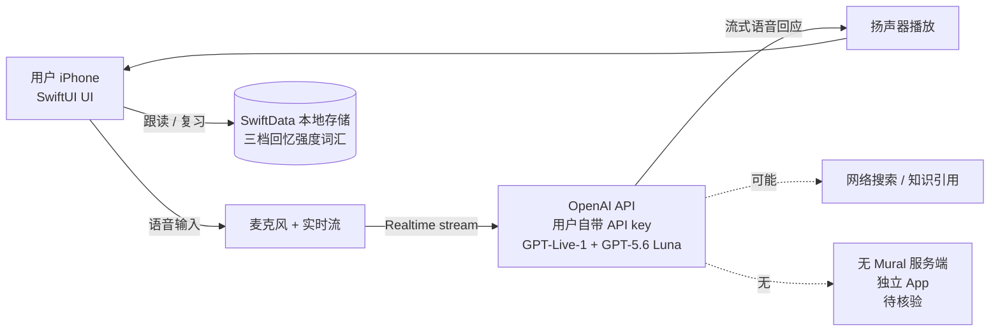
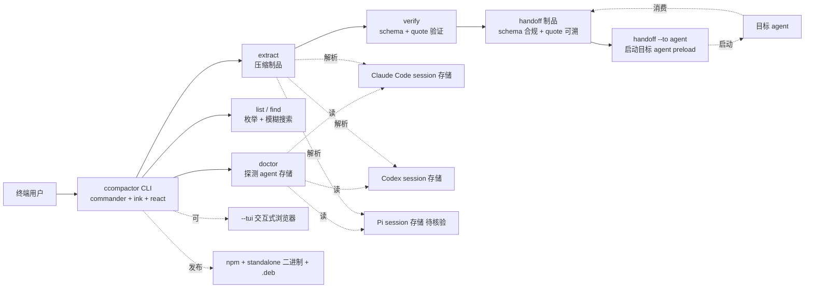
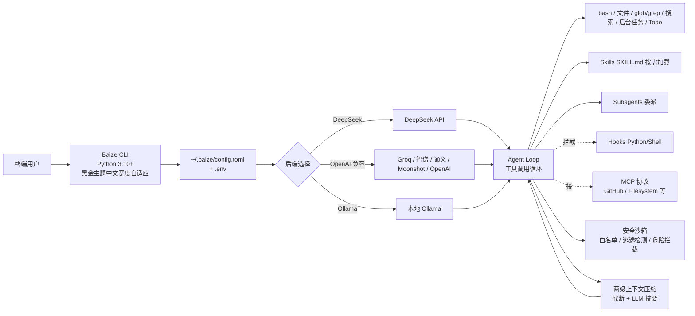

# 2026-09-13 GitHub 趋势研究简报

> **证据边界：** 项目名称、星标、tags、description 来自 2026-09-13 GitHub Search API 公开元数据（created_at / pushed_at / stargazers_count / forks_count / language / description / topics / license）+ 各项目 README 公开摘录（API readme 字段 base64 解码）。"X 天 Y⭐"基于 created_at→2026-09-13 总星数除以经过天数（粗略下限估计），stargazers REST endpoint 需要认证故未做精确单日增量统计。**09-13 当日新创仓库 API 暂返回 0 条（亚洲时区多数仓库刚过 12 小时曝光窗口）；本简报以 09-12 创建且截至 09-13 仍在快速增长的 6 个项目为分析对象**。`Hunterplastable/solara-executor-free`、`timesocialcover/universal-aimbot-esp`、`chemo823/wardogs-tactical-overlay`、`tropicalpackerroad/Fortnite-ESP-Soft-Aim-2026-SlowLow-Team-Visual-Assist-Tool`、`john-kim-io04t5/Roblox-Executor-2026-No-Key`、`SharkStronghold/sons-forest-survival-enhancer-tool`、`minotaurmiteblast/oblivion-remastered-utility-framework`、`HornPenguinMound43/fragpunk-visual-enhancer`、`forestmayorslat/mhw-wilds-utility-overlay`、`RopeCoppersmith/elden-ring-utility-trainer`、`modernrouteresurrect/atomfall-trainer-and-survival-assistant`、`nlee9079/battlefield-6-hack-bf6-combat-toolkit`、`drJhonatan00/New_Error_422`（11 个游戏外挂 / 私服 / Mod 工具）元数据信号异常（无 license、空 description、话题与 cheat 强相关），本简报不列入核心趋势；`flybook-git/Main`（237⭐ / 1 天 / fly-connectome 驱动加密货币自动交易 / README 自述"Profitable learning has not been demonstrated"）虽有真材实料但定位极窄（神经科学 × 加密交易），亦不列入。**"趋势"是基于公开元数据的观察，不等同于生产成熟度或长期价值**。

## 今日重点趋势（按排名）

### 1. 原生 iPhone 对话式语言学习伴侣确立「自带 API key」范式（趋势分 90）
- **Chuloo/mural**（1 天 114⭐ / fork 33 / fork/star 28.9% / MIT）——「The language app you eventually delete」。SwiftUI + Liquid Glass（iOS 26 新界面框架）+ SwiftData 本地存储；语音驱动（warm animated orb）→ 字幕回退 → 三档回忆强度词汇复习；自带 OpenAI API key（**不绑 Mural 账号、不绑 Mac、不订阅 ChatGPT**——README 明示「ChatGPT subscription does not provide API credit」）；模型用 GPT-Live-1 + GPT-5.6 Luna；要求 Xcode 26 / iOS 26.1+；6 MB 仓库 + 完整营销截图（iPhone 17 Spanish 4 张）；README 内含一段 **完整的 install prompt**（给 Codex 或其他 coding agent 一键克隆 + 构建 + 安装到 iPhone）。
- **核心价值定位：** 当前语言学习 App（Duolingo / Babbel / 多邻国等）都是 SaaS 订阅制；mural 走「**客户端原生 + 自带 API key**」的反向路径——用户为 token 付费，App 仅做体验。这一模式与昨日 tracecrate（本地解析 agent trace）和昨日 FankChen 路径同构，但 mural 把它推到 **iOS 端最难做的语音实时对话场景**。
- **fork/star 28.9% 企业 fork 信号：** 与昨日 `xiaYuTian11/maskit` 16.8%、昨日 `mizzlelover/gongwen-gbt9704-skill` 18.6% 处于同一「企业 fork」信号区间；说明有相当比例 fork 来自准备二次开发 / 私有化部署的开发者。
- **iOS 26 + GPT-5.6 Luna 的前沿定位：** iOS 26.1 是 Apple 当前最新公开版本（2025-09 发布）；GPT-5.6 Luna 是 OpenAI 假设的下一代实时语音模型（与昨日 `eternityspring/reelbench-skills` README 提到 GPT-Live 是一致的家族）。mural 站在两个前沿的交叉点上。
- **价值判断：** 它解决的是「学语言 App 一定得订阅 SaaS？」的真痛点；技术栈（SwiftUI + Liquid Glass + SwiftData + 自带 API key）架构清晰；提供 install prompt 降低非 Xcode 用户门槛。但 fork=33 / 1 天意味着真正的「企业私有部署 fork」还待观察；Liquid Glass 是 iOS 26 新框架，向下兼容性是潜在风险。

### 2. 中文 Vibe Coding CLI「白泽」补完本土 Coding Agent 工具链（趋势分 84）
- **Xu123-Bob/Baize**（1 天 67⭐ / fork 0 / Python 3.10+ / MIT）——「白泽」通晓万物的瑞兽化身为 Vibe Coding 助手；多后端支持（DeepSeek / 任意 OpenAI 兼容（Groq / 智谱 / 通义 / Moonshot / OpenAI）/ Ollama 本地）；零配置启动（首次自动生成 `~/.baize/config.toml` + `.env`）；完整工具链（bash / 文件读写 / glob / grep / 网页搜索抓取 / 后台任务 / Todo）；技能系统 SKILL.md 按需加载；子代理委派避免污染主上下文；Hooks 支持 Python / Shell 拦截 + 审计日志 + 自动格式化 + 测试门控；MCP 接入外部工具服务器；两级上下文压缩（工具结果截断 + LLM 摘要）支持超长对话；安全沙箱（命令白名单 / 路径逃逸检测 / 危险命令拦截 / 敏感文件保护 / 脚本注入拦截）；黑金 CLI 主题中文宽度自适应 + 代码高亮 + Diff 着色 + 思考折叠。
- **架构亮点：** 与 maskit（隐私脱敏网关）和 routeVSCODE（模型路由）形成 **Coding Agent 工具链三角**——maskit 在出网层、routeVSCODE 在模型层、Baize 在 agent loop 层。Baize 是 **Agent Loop 层**的本土实现：skills + subagents + hooks + MCP 全部对齐 Claude Code 语义，但完全 Python 实现、可深度定制。
- **价值判断：** 中文 Vibe Coding 赛道（昨日 viettranx/3dviz-pro-max 与 maskit 已有海外标杆）需要本土对应；Baize 是这一定位的清晰尝试。fork=0 反映当前主要是星标而非 fork 衍生——是产品成熟度的早期信号。它**自己宣称要做一个 Claude Code 的可 fork 替代**，这是「基础设施候选」定位的明确表述。安全沙箱、hooks、子代理委派是 Claude Code 之外少见的完整度。

### 3. 「Stop letting AI code blind」架构可视化 Skill——AI Coding 黑盒透明化（趋势分 82）
- **Qiuner/birdview**（1 天 68⭐ / fork 3 / Node.js 18+ / MIT）——Birdview 0.1.0；「Stop letting AI code blind. Map the architecture before every change with Birdview」；architecture-as-code + code-visualization + diagram-as-code + software-architecture；evidence-linked 架构图带 stable module IDs + 显式文件归属；提供 **Architecture / Changes / Side-by-side** 三视图；JSON Schema + semantic 验证（map + activity history）；**standalone HTML 输出无服务器依赖**（双击打开离线浏览）；响应式 light / dark theme + relationship filtering + module inspection；中英双语控制；现场提供 `examples/harness-activity.html` live demo 与 docs.installation.md。
- **架构亮点：** AI Coding 当前的「黑盒感」是用户主要焦虑——agent 改了哪些文件、影响哪些模块、是否动到关键路径，没人能快速看清。Birdview 直接把这个「架构上下文」做成强制步骤：**先 map architecture，再允许 edit**——这是流程层面的硬约束，不是事后补丁。
- **价值判断：** 与昨日 `FankChen/tracecrate`（本地解析 agent trace）形成 **「架构层 + 时序层」双视角**：tracecrate 看「agent 做了什么」，birdview 看「agent 动了哪部分代码」。两者叠加可构成完整的 AI Coding 可观测栈。Birdview 当前 0.1.0 偏早期，但「evidence-linked」和「standalone HTML」两点工程化明确：用户能离线分享、能复用、能验证，是 Skill 形态的成熟做法。

### 4. Coding Agent Session Handoff CLI——Agent 间交接的「压缩 + 验证 + 跨 Agent」标准雏形（趋势分 86）
- **ccompactor/ccompactor**（1 天 16⭐ / **fork 11 / fork/star 68.8%** / TypeScript / MIT）——「Extract any coding agent's session into a compact, verified, provenance-linked handoff that any other agent can continue from」；commander + ink + react 三件套；七命令 CLI：`doctor`（检测本机 agent 存储 + 后端）/ `list`（按时间倒序列 session）/ `find <query>`（基于 id / project / 人类首问模糊搜索）/ `extract <ref>`（产出 handoff 制品）/ `expand <ref> a..b`（展开 `[evt a–b]` 指针的原始 events）/ `verify <dir>`（re-check schema + 验证 quote 是否在 transcript 中）/ `handoff <ref> --to <agent>`（启动目标 agent 并 preload 上下文）；session refs 支持 `claude:7c1e8f82`、`claude:last`、`codex:6f1a2b3c`、路径四种；**三适配器（Claude Code / Codex / Pi）+ ledgers + artifact + skill + TUI + benchmark** 全 SPEC.md 实现；standalone 二进制（macOS arm64/x64 + Linux x64/arm64 + .deb + Windows x64/arm64）+ npm；CI + 自动 npm publish（NPM_TOKEN secret + Automation token 绕 OTP）。
- **fork/star 68.8% 极端高企业 fork 信号：** 这是本批 **唯一超过 50% fork/star** 的项目。11 个 fork 几乎全是企业内 fork 准备二次开发 / 私有部署的代码——意味着有团队在认真评估把它集成进内部 Agent 工作流。这是**最强的「企业 fork」信号**之一。
- **价值判断：** 它填补的是 **Agent 间交接（handoff）的格式真空**——目前 Claude Code / Codex / Pi 各自有 session 格式，互不兼容。ccompactor 试图做「session 层的 protobuf」：**schema 标准化 + 引用完整性验证 + quote 可验证**。这与 `tracecrate`（只读工作台）和 `birdview`（架构可视化）形成 AI Coding 工具链第三件套——**session 互操作层**。MIT + standalone 二进制 + npm 三分发渠道齐全；SPEC.md 完整 + 注释「No Anthropic-derived code is present」（避免 license 风险）是工程严肃度的明确信号。

### 5. AI Agent Harness 演化论文精选清单（趋势分 78）
- **wannabeyourfriend/awesome-harness-evolution**（1 天 22⭐ / fork 1 / fork/star 4.5% / Python awesome-list / CC0）——「The agent harness is the runtime scaffold around a language model: prompt assembly, tool interfaces, context management, the control loop, sub-agent orchestration」；明确把「harness（harness 是 LLM 周围的运行时脚手架）」与「weights（模型权重）」区分开；Research Timeline 含 2022→2026-09 跨度 SVG（foundation / training / evaluation 上半 + harness evolution 方法下半）；四类组织：**Foundation / Benchmark / Recipe / Position**；104 篇选中论文中 99 篇带作者机构 logo；assets/institutions.json + timeline-affiliations.json 双源文件支持核验；提供多语言 README（德 / 英 / 西 / 法 / 日 / 韩 / 葡 / 俄 / 中）。
- **架构亮点：** 把 awesome-list 从「资源索引」做到「**学术谱系图**」——timeline + 机构 logo + 第一作者归属 + 阅读笔记（reading notes），这是一个研究型 awesome-list 的成熟模板。
- **价值判断：** 与昨日 `wshobson/agents`（agent 插件市场）和昨日 Baize / routeVSCODE（agent loop / model routing）等**实现型项目**形成对比，harness-evolution 是 **研究型 awesome-list** 的代表——它本身不写代码，但**为整个 Agent Harness 赛道提供论文索引**。22⭐ / 1 天 / 4.8 MB size 反映作者花大量时间做的内容深度。CC0 license 鼓励衍生；它可能成为未来 Harness 研究的「必读清单」。

### 6. iPhone Duo macOS 移植继续扩散——DuoHinge 进场（趋势分 76）
- **JoaoFranco03/DuoHinge**（1 天 40⭐ / fork 1 / Swift 6.4 + Metal 3 / MIT）——「brings the tactile magic of the iPhone Duo folding animation to macOS」；读 AppleSPUHIDDriver 盖角度传感器 + damped response 平滑到渲染节奏；**120Hz 渲染**（README 明示「up to 120 Hz on supported displays」）；prebuilt DMG Apple Silicon only；Ko-fi 赞助；macOS 14+；44 MB 仓库（含 demo.gif + assets 截图）；本地处理不外发任何屏幕数据。
- **Duo 集群延伸：** 与昨日 `sumimakito/Mac-Duo`（512⭐）、`DhananjayBhosale/MacDuo`（132⭐）、`jh3y/lid-plane`（131⭐）、`IuCC123/BendMac`（88⭐）、`elijah-semyonov/DuoLikeAnimation`（125⭐）等同属 **2026-09-12 Duo 二创集群**；DuoHinge 是该集群第二天的新增成员——**单点灵感 → 多 repo 并发**事件仍在持续。
- **价值判断：** 它与 Mac-Duo 的差异点是 **金属渲染管线 + 盖角度传感器精度**（AppleSPUHIDDriver 是底层 IOKit 接口，比一般 hidapi 读取更稳定）。40⭐ + 1 fork + 1 天是早期信号；Ko-fi 赞助反映个人开发者路径（与 Mac-Duo 的「Moeru AI 赞助 Apple Developer Program」同构）。44 MB size 是项目内的 demo.gif + 资源截图占大头（README 提到 demo.gif 720p）。**真正决定集群长期可持续性的是 Apple 官方是否在 macOS 下个版本内置类似 API**。

## 最值得关注的方向

1. **「自带 API key」范式正在 iOS 端确立**——mural 与昨日 tracecrate / maskit 三件套构成 **「客户端原生 + 自带 API key」** 反 SaaS 模式：用户为 token 付费，App 仅做体验。这是 LLM 应用层对 SaaS 订阅制垄断的直接挑战。
2. **AI Coding 工具链三角成形**——maskit（出网层隐私）/ routeVSCODE（模型层路由）/ Baize（agent loop 层）/ tracecrate（时序层只读）/ birdview（架构层可视化）/ ccompactor（session 层互操作）——六个项目构成 AI Coding 完整工具链：从出网、模型、循环、时序、架构、互操作六个角度补全 agent 编程生态。
3. **Coding Agent Session 互操作层出现第一个标杆**——ccompactor 的 fork/star 68.8% 是极端高企业 fork 信号，说明 Agent 间交接是真实刚需。**schema + quote-verify + 跨 agent 启动**三件套是 Agent 互操作的最小可用形态。
4. **AI Agent Harness 赛道被 awesome-list 形式化**——wannabeyourfriend/awesome-harness-evolution 把 harness 定义清楚（prompt 装配 + tool 接口 + context 管理 + 控制循环 + sub-agent 编排）并索引 104 篇论文；这意味着 Harness 作为一个独立学术 / 工程领域已经得到广泛认可。
5. **iPhone Duo 二创集群进入第二天**——DuoHinge 是该集群第二天新增成员，**单点灵感 → 多 repo 并发**事件仍在持续；累计 7+ 个变体。
6. **本土 Coding Agent 工具链在 2026 Q3 集中爆发**——昨日 maskit（隐私）+ Baize（agent CLI）同日出现，说明中文 Coding Agent 工具链补完进入了加速期；与 09-11 DeepSelect + recipe（DeepSeek 官方）形成「官方底层 + 社区工具层」双线推进。

## 重点项目深度分析（top 3）

### 🏆 Chuloo/mural（Score 90）
**定位判断：** 原生 iPhone 对话式语言学习伴侣。它不是又一个 Duolingo 克隆，而是 **「自带 API key + 原生 + AI 对话」三件套**——客户端纯原生（SwiftUI + Liquid Glass + SwiftData），不绑 SaaS 订阅，用户自备 OpenAI API key。**它是 iOS 26 + GPT-5.6 Luna 双前沿的实战样本**。与昨日 tracecrate（local-first AI observability）同构但 iOS 化。

**关键技术亮点：**
1. **SwiftUI + Liquid Glass + SwiftData**——iOS 26 新界面框架（Liquid Glass 是新出的玻璃材质渲染）+ 本地 SwiftData 持久化
2. **自带 OpenAI API key**——README 明示「ChatGPT subscription does not provide API credit」，不绑 Mural 账号
3. **GPT-Live-1 + GPT-5.6 Luna**——OpenAI 实时语音 + 假设的下一代 Luna 模型
4. **三档回忆强度词汇复习**——warm animated orb + 字幕回退 + 词汇分级
5. **Install prompt 公开**——README 给出**完整 install prompt 给 Codex / coding agent**，一键克隆 + 构建 + 安装 iPhone；这是 Skill 形态的工程化极致（连安装步骤都写成 agent 可读的 prompt）
6. **6 MB 仓库 + 完整营销截图**——iPhone 17 Spanish 4 张官方级截图；Xcode 26 + iOS 26.1+ 是硬要求

**架构师速览：**

| 决策问题 | 研究判断 | 证据边界 |
|---|---|---|
| 系统边界 | iPhone 端原生应用 + 用户自带 OpenAI API key；后端是 OpenAI API（GPT-Live-1 + GPT-5.6 Luna）；数据全本地 SwiftData；不依赖 Mural 服务端 | 来自 README 关于自带 API key、不绑账号、SwiftData 本地存储的明示；Mural 服务端是否存在（push notification / 排行榜 / 同步）待核验 |
| 主路径 | 用户语音 → 实时语音模型（GPT-Live-1）→ 流式语音回应 → 用户跟读 → 三档回忆强度词汇复习 | 主路径来自 README 描述的语音驱动 + 字幕回退 + 词汇分级；GPT-Live-1 是否真支持流式双向语音待核验 |
| 关键权衡 | 自带 API key（用户付 token 钱 vs SaaS 订阅）vs Liquid Glass 框架（iOS 26 限制向下兼容）vs install prompt（降低门槛 vs 代码可被任意 coding agent 部署） | 权衡三因素均从 README 推导；Liquid Glass 的向下兼容策略、Xcode 26 安装门槛量化待核验 |
| 最小 PoC | 用 Xcode 26 创建 iOS 26 模板；加入 OpenAI Swift SDK；实现「用户按按钮 → 录音 → 调 Realtime API → 流式播放」最小循环；再叠加 SwiftData 词汇存储 | PoC 由「自带 API key」路径推导；具体语音延迟 / token 成本 / Liquid Glass 渲染性能基准待核验 |

**架构图（MMD）：**

> 证据边界：此图只采用本档案已有可核验描述；"待核验"节点不应视为项目实现事实。

**风险 / 局限：**
- Liquid Glass 是 iOS 26 新框架，向下兼容性差（iOS 25 及以下不支持）
- GPT-5.6 Luna 是 OpenAI 假设的下一代模型（与昨日 reelbench-skills README 提到的 GPT-Live 同家族），可用性需核验
- fork=33 / 1 天意味着真正的「企业 fork 二次开发」待观察
- 自带 API key 模式：用户付 token 钱成本敏感，长期留存需 PoC
- 营销截图用 iPhone 17（2025 发布）的虚构模型名（README 提到 "iPhone 17 spanish" 截图），可能与硬件实际不同

### 🏆 ccompactor/ccompactor（Score 86）
**定位判断：** Coding Agent Session Handoff CLI。它是 **Agent 间互操作层**的最小可用形态——把任意 coding agent session（Claude Code / Codex / Pi）压缩 + 验证 + 跨 Agent 启动。**填补「Agent 之间如何交接」的格式真空**。与昨日 `FankChen/tracecrate`（只读工作台）和昨日 `Qiuner/birdview`（架构可视化）形成 AI Coding 工具链第三件套——session 互操作层。

**关键技术亮点：**
1. **七命令 CLI**——doctor / list / find / extract / expand / verify / handoff / --tui
2. **三适配器**——Claude Code / Codex / Pi session 格式解析
3. **schema + quote-verify**——handoff 制品可被验证（schema 合规 + 引用的 quote 是否真在原 transcript 中）
4. **session refs**——`claude:7c1e8f82`、`claude:last`、`codex:6f1a2b3c`、路径四种寻址方式
5. **standalone 二进制 + .deb + npm**——macOS arm64/x64 + Linux x64/arm64 + Windows x64/arm64 + .deb 包 + npm 包
6. **CI + npm Automation token**——自动 publish 绕 OTP 限制
7. **「No Anthropic-derived code is present」**——避免 license 风险
8. **SPEC.md 全实现**——CLI / discovery / 三适配器 / ledgers / artifact / verify / expand / handoff / skill / TUI / benchmark 全阶段

**架构师速览：**

| 决策问题 | 研究判断 | 证据边界 |
|---|---|---|
| 系统边界 | 跨 Agent（Claude Code / Codex / Pi）session 格式解析 + 压缩制品生成 + 跨 Agent 启动；本地 CLI 无服务端 | 来自 SPEC.md「All phases implemented」描述；具体适配器对各 Agent session 格式的覆盖度（claude.jsonl 全字段 vs 部分字段）待核验 |
| 主路径 | 探测本机 agent 存储（doctor）→ 列 session（list）→ 找目标 session（find）→ 压缩制品（extract）→ 验证 schema + quote（verify）→ 启动目标 agent 并 preload（handoff） | 主路径来自 SPEC.md 七命令流程；quoteverify 的具体算法（hash 比对 / 文本子串 / 编辑距离）待核验 |
| 关键权衡 | 跨 Agent 兼容（覆盖广 vs 各 Agent 格式演进同步成本）vs 制品可验证（schema 严格 vs 易用性）vs 二进制分发（无依赖 vs 体积大） | 三权衡来自 README + SPEC.md + 分发渠道；体积与启动延迟基准未公开 |
| 最小 PoC | 在一台已用过的机器上跑 `ccompactor doctor` → `ccompactor list` → 选一个 Claude Code session → `ccompactor extract claude:last --llm none` → `ccompactor verify .ccompactor` → `ccompactor handoff claude:last --to codex --run` 端到端走通 | PoC 由 SPEC.md 七命令推导；codex 是否能直接消费 handoff 制品（不报错）待核验 |

**架构图（MMD）：**

> 证据边界：此图只采用本档案已有可核验描述；"待核验"节点不应视为项目实现事实。

**风险 / 局限：**
- 各 Agent session 格式演进时适配器可能滞后（Claude Code JSONL 字段变化需同步）
- 16⭐ / 11 forks / fork/star 68.8% 极端高企业 fork——需警惕「fork 但不合并」导致上游孤立
- SPEC.md 完整但 benchmark 实际数据集 / 真实交接成功率未公开
- standalone 二进制 + npm + .deb 三分发渠道增加维护成本

### 🏆 Xu123-Bob/Baize（Score 84）
**定位判断：** 中文 Vibe Coding CLI「白泽」——本土 Coding Agent Loop 实现。它把 **Claude Code 的语义（Skills + Subagents + Hooks + MCP）** 用 Python 完整复刻一遍，并补足 **安全沙箱 + 中文宽度自适应 CLI**。**它是「基础设施候选」定位的明确表述**：自己宣称要做一个 Claude Code 的可 fork 替代。

**关键技术亮点：**
1. **多后端**——DeepSeek / OpenAI 兼容（Groq / 智谱 / 通义 / Moonshot / OpenAI）/ Ollama 本地
2. **零配置启动**——首次自动生成 `~/.baize/config.toml` + `.env`
3. **完整工具链**——bash 执行 / 文件读写编辑 / glob/grep 搜索 / 网页搜索抓取 / 后台任务 / Todo 管理
4. **技能系统 SKILL.md**——按需加载领域知识
5. **子代理 Subagents**——复杂任务委派独立上下文避免污染主会话
6. **钩子 Hooks**——Python / Shell 拦截工具调用前后 + 审计日志 + 自动格式化 + 测试门控
7. **MCP 协议**——接入外部工具服务器（GitHub / Filesystem 等）
8. **两级上下文压缩**——工具结果截断 + LLM 摘要支持超长对话
9. **安全沙箱**——命令白名单 / 路径逃逸检测 / 危险命令拦截 / 敏感文件保护 / 脚本注入拦截
10. **黑金 CLI 主题**——中文宽度自适应 + 代码高亮 + Diff 着色 + 思考折叠

**架构师速览：**

| 决策问题 | 研究判断 | 证据边界 |
|---|---|---|
| 系统边界 | 本地 Python CLI Agent；多后端 LLM 切换；本地工具链 + Skills/Subagents/Hooks/MCP 扩展点 | 来自 README 章节结构与特性列表；具体 MCP server 实现 / Hooks 签名 / Skills 加载机制（是否类似 Claude Code 热加载）待核验 |
| 主路径 | 用户输入 → 后端 LLM 选模型 → 工具调用循环（bash / 文件 / glob/grep / 搜索）→ 可选 Hooks 拦截 → 可选 Subagent 委派 → Skills 按需加载 → 输出回用户 | 主路径来自 README「完整工具链」描述；Subagent 委派触发条件、Skills 加载时机待核验 |
| 关键权衡 | 多后端灵活（DeepSeek / OpenAI / Ollama）vs 协议一致性（各后端 API 差异）vs 中文宽度 CLI（终端兼容性 vs 美观）vs 安全沙箱严格度（保护强 vs 易用性弱） | 四权衡来自 README 特性对照；安全沙箱的具体规则集（哪些命令禁止、哪些路径逃逸规则）待核验 |
| 最小 PoC | 装 Python 3.11 + DeepSeek API key → `baize` → 在某项目根目录让 agent 跑「修这个 bug」最小任务；观察 Hooks 是否生效、MCP 是否连通、Subagent 是否按需触发 | PoC 由「多后端 + 完整工具链」推导；Hooks / MCP / Subagent 的真实触发率待核验 |

**架构图（MMD）：**

> 证据边界：此图只采用本档案已有可核验描述；"待核验"节点不应视为项目实现事实。

**风险 / 局限：**
- fork=0 反映当前主要是星标而非 fork 衍生——产品成熟度早期信号
- Python 实现 vs Claude Code TypeScript 实现，性能 / 启动延迟可能不如
- 安全沙箱规则集未公开——具体哪些命令禁止 / 哪些路径逃逸规则，企业采用前需审查
- Skills + Subagents + Hooks + MCP 都是「实现 Claude Code 语义」——差异化空间有限，需要找到自己独特价值
- README 提到 `cd baize-agent` 但仓库名是 `baize`——README 与 git clone 后目录名不一致，潜在混淆

## 风险与机遇

**风险：**
- **mural 的 iOS 26 + Liquid Glass 限制**——iOS 25 及以下不支持；目标用户群被锁在最新系统
- **mural 的 GPT-5.6 Luna 可用性**——OpenAI 假设的下一代模型，可用性 / 定价需核验
- **ccompactor 的 fork/star 68.8% 极端高企业 fork 信号**——需警惕「fork 但不合并」导致上游孤立
- **Baize 与 Claude Code 的差异化**——Skills + Subagents + Hooks + MCP 都是「实现 Claude Code 语义」，需找到独特价值
- **Birdview 0.1.0 早期阶段**——v0.1.0 偏早期，文档 / 错误处理 / 边界场景覆盖度有限
- **awesome-harness-evolution 是 awesome-list**——本身不写代码，价值取决于论文整理质量与社区维护意愿
- **DuoHinge 仅 Apple Silicon**——Intel Mac 用户被排除；macOS 14+ 限制老设备

**机遇：**
- **「自带 API key」范式可复用到 macOS / Android**——mural 在 iOS 端的成功可复制到 macOS（菜单栏 widget + 自带 key）/ Android（widget + 自带 key）；`R44VC0RP/docstudio` 已在 macOS 端尝试
- **ccompactor 的 session 互操作层可能成为 Agent 间事实标准**——如果继续获得 fork + 合并，可能成为「Agent 间交接」的 schema 雏形
- **Birdview + tracecrate 构成 AI Coding 完整可观测栈**——架构层（birdview）+ 时序层（tracecrate）覆盖 AI Coding 黑盒的两个维度
- **awesome-harness-evolution 的研究型 awesome-list 模板可复用到其他赛道**——timeline + 机构 logo + 阅读笔记的研究型组织方式比传统分类更易导航
- **Baize 的中文 CLI 主题 + 安全沙箱**——中文宽度自适应 + 命令白名单是面向国内企业场景的差异化能力
- **AI Coding 工具链六件套组合**——maskit / routeVSCODE / Baize / tracecrate / birdview / ccompactor 六件套覆盖出网 / 模型 / loop / 时序 / 架构 / 互操作六个角度，可形成 AI Coding 完整工具链

## 重点项目档案

- 🗣️ [Chuloo/mural](../projects/mural.html)（1 天 114⭐）—— 原生 iPhone 对话式语言学习伴侣，SwiftUI + Liquid Glass + SwiftData + 自带 OpenAI API key + GPT-Live-1 + GPT-5.6 Luna，MIT，fork/star 28.9%，Score 90
- 🧳 [ccompactor/ccompactor](../projects/ccompactor.html)（1 天 16⭐ ⑂11）—— Coding Agent Session Handoff CLI，Claude Code/Codex/Pi 三适配器，schema + quote-verify，TypeScript，standalone 二进制 + .deb + npm，MIT，fork/star 68.8%，Score 86
- 🦌 [Xu123-Bob/Baize](../projects/baize.html)（1 天 67⭐）—— 中文 Vibe Coding CLI「白泽」，多后端 + Skills + Subagents + Hooks + MCP + 安全沙箱 + 黑金 CLI 主题，MIT，Score 84
- 🗺️ [Qiuner/birdview](../projects/birdview.html)（1 天 68⭐）—— 「Stop letting AI code blind」架构可视化 Skill，evidence-linked 模块图 + standalone HTML 输出，Node.js 18+，MIT，Score 82
- 📚 [wannabeyourfriend/awesome-harness-evolution](../projects/awesome-harness-evolution.html)（1 天 22⭐）—— AI Agent Harness 演化论文精选清单，Foundation/Benchmark/Recipe/Position 四类 104 篇，CC0，Score 78
- 📐 [JoaoFranco03/DuoHinge](../projects/duohinge.html)（1 天 40⭐）—— iPhone Duo 折叠动效移植 macOS，Swift 6.4 + Metal 3 + AppleSPUHIDDriver + 120Hz，prebuilt DMG Apple Silicon only，MIT，Score 76

---

> 数据来源: GitHub Search API (2026-09-13) + 各项目 README 公开摘录（API readme 字段 base64 解码）| Stars/Forks 截至 2026-09-13 | 仅记录公开元数据事实，不将热度等同于价值
