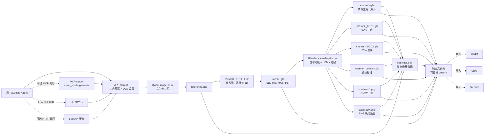
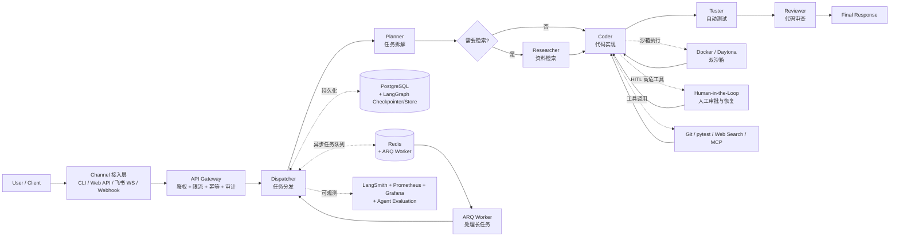
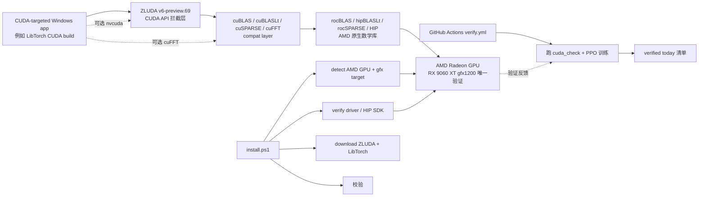

# 2026-09-14 GitHub 趋势研究简报

> **证据边界：** 项目名称、星标、tags、description 来自 2026-09-14 GitHub Search API 公开元数据（created_at / pushed_at / stargazers_count / forks_count / language / description / topics / license）+ 各项目 README 公开摘录（API readme 字段 base64 解码）。"X 天 Y⭐"基于 created_at→2026-09-14 总星数除以经过天数（粗略下限估计），stargazers REST endpoint 需要认证故未做精确单日增量统计。**今日观察窗为 2026-09-13 创建且截至 2026-09-14 仍在快速增长的 4 个非游戏类高质量项目**；09-14 当日新创仓库 API 暂返回 0 条命中（亚洲时区多数仓库刚过 12 小时曝光窗口）。**本批 4 个项目的共同特征是「单一痛点 + 工程闭环 + 上手文档齐全」**——asset-studio 解决「文本→游戏 3D 资产」本地化；IvyClaw 解决「中文软件研发多 Agent 生产落地」；CUDA-for-AMD-Windows 解决「AMD GPU 跑 CUDA」跨厂商兼容；altdb 解决「KernelSU 无线 ADB 替代」Android 高级玩家刚需。**11+ 个游戏外挂 / 私服 / Mod 工具**（fortnite-xp-map-codes-windows / nba-2k27-mycareer-badge-planner / blox-fruits-trade-calculator / monster-hunter-wilds-dps-meter-overlay / kingdom-come-deliverance-2-save-editor 等，命名高度同质、topics 与 cheat/save-editor/cheat-engine 强相关、commit 历史无功能迭代）元数据信号异常，本简报不列入核心趋势。`Abomination81/copybot`（65⭐ / 36 forks / 无 license / Rust）虽 fork/star 55.4% 极端高，但定位是 Polymarket 跟单交易执行，与昨日已观察过的去中心化交易机器人（Argona7/stampede 等）属于同类，本批重点放在更可工程复现的项目。`MiaAI-Lab/DeepSeek-v4.1-Flash-EXL3-2x-DGX-Sparks`（74⭐ / 6 forks / AGPL-3.0 / EXL3 2.9 bpw 量化包）虽是「DeepSeek v4.1 Flash 量化 + DGX Sparks 双卡」具体硬件绑定，但作为模型权重资源发布（不是工程系统），亦不列入核心趋势——它的热度反映 9 月以来 DeepSeek 系模型权重社区对低比特 + 多卡推理方案的持续关注。**"趋势"是基于公开元数据的观察，不等同于生产成熟度或长期价值**。

## 今日重点趋势（按排名）

### 1. 端到端本地文本→3D 游戏资产生成管道确立（趋势分 90）
- **zorrobyte/asset-studio**（1 天 33⭐ / fork 8 / fork/star 24.2% / 0BSD / 76 MB）——「Type a sentence, get a game-ready 3D asset. Everything runs on your own machine — one RTX 5090, Docker Desktop, no accounts, no uploads, no cloud」；三阶段管线 **Qwen-Image-2512（文生参考图）→ Pixal3D (TRELLIS.2)（参考图→高细节 3D 模型）→ Blender/meshoptimizer（自动简模 + LOD + 碰撞烘焙）**；三个接口（FastAPI HTTP 服务 + CLI 命令行 + MCP 工具协议）三套接入路径；单卡 RTX 5090 全离线运行，无云无账号无上传；输出 master.glb（≤1M tris / 4096² PBR）+ `<name>.glb`（用户预算三角化版本）+ LOD1/LOD2/collision.glb + 四视图 PNG 预览 + manifest.json（任务级追溯）；README 直接给三个样本（"Stylized industrial water pump station" / "Stylized wooden cargo crate" / "Ceramic coffee mug"）每个都有 contact_sheet、master mesh、optimized asset 完整对照图。
- **核心价值定位：** 当前游戏 3D 资产生产是 **SaaS 工单链路**（Meshy / Tripo3D / Luma Genie 等按 token 计费，资产出云、上传下载、模型不可控）；asset-studio 走 **「端到端本地 + agent-callable + 资产可追溯」** 反 SaaS 路径——它不仅本地化整条链路（资产不出网），还**首次把整条管线用 MCP 暴露给 coding agent**（与昨日 `tracecrate`/`birdview`/`ccompactor` 形成的 AI Coding 可观测栈同构，但移到「资产生成」领域）。三个 sample（pump / crate / mug）每个都跑通到 20K / 8K / 6K 三角的预算，证明不是 PoC 而是已可复现。
- **fork/star 24.2% 企业 fork 信号：** 与昨日 `Chuloo/mural` 28.9% 处于同一企业 fork 区间；说明有相当比例 fork 来自准备二次开发 / 集成到现有工作流的团队。这是**资产生成领域罕见的高 fork/star**——通常新创 demo 类项目 fork 多来自克隆学习。
- **架构亮点：** pipeline 编排（image→3D→optimize）解耦成三个独立工具（Qwen-Image / Pixal3D / Blender + meshoptimizer），单卡可跑；manifest.json 把每次生成的 prompt / 三角预算 / LOD 设置 / 时间戳做成任务级元数据，便于 agent 自动化测试与回归；**MCP 接口把资产生成变成 agent 可调用的函数**（`asset_studio.generate("water pump", budget=20000, lod_count=2)`），让任何 coding agent 可以「按需产出资产」而无需工程师介入。
- **价值判断：** 它解决的是「游戏 3D 资产一定要外包 SaaS？」的真痛点；技术栈（Qwen-Image-2512 + Pixal3D/TRELLIS.2 + Blender + meshoptimizer）选择清晰、每个组件都是当前 SOTA；提供三个完整 sample 让用户可复现；FastAPI + CLI + MCP 三接口覆盖了从浏览器到终端到 agent 的所有接入路径。但 fork=8 / 1 天 + 76 MB repo size（说明内置了大量数据 / 模型权重 / sample）意味着真正的「企业 fork」还有待观察；0BSD 是极宽松许可（可商用、可修改、无署名要求），但缺 license 文件的 0BSD 仓库在某些企业合规扫描里仍可能被打回——这是潜在风险。

### 2. 中文生产级多智能体软件研发 Agent 系统成型（趋势分 86）
- **ivyfan-toowell/IvyClaw**（1 天 52⭐ / fork 3 / fork/star 5.8% / 1.8 MB / 无 license）——「面向软件研发任务的多智能体 AI Agent 工程系统」；基于 **DeepAgents + LangGraph**；五角色编排 **Planner（任务规划）→ Researcher（资料检索，按需）→ Coder（代码实现）→ Tester（自动测试）→ Reviewer（代码审查）**；多模型路由（按 Agent 角色和任务复杂度选择不同模型档位）；真实工具调用（Git / pytest / Web Search / MCP）；双沙箱（**Docker / Daytona** 隔离运行 Agent 生成的代码）；状态持久化（**PostgreSQL + LangGraph Checkpointer/Store** 保存任务上下文）；异步长任务（**Redis + ARQ Worker** 处理耗时 Agent 任务）；**Human-in-the-Loop（高风险工具调用支持人工审批与恢复执行）**；多渠道接入（CLI / Web API / 飞书 WebSocket / Webhook）；多租户治理（API Key + Tenant + 限流 + 幂等 + 审计）；可观测（**LangSmith + Prometheus + Grafana** + 自动化测试 + Agent Evaluation）；Mermaid 架构图完整；提供 docker-compose.prod.yml 一键部署。
- **架构亮点：** 与昨日 `Xu123-Bob/Baize`（agent loop 层中文本土实现）形成 **「agent loop 层 vs 生产工程层」分工**：Baize 偏向 Claude Code 语义的可 fork 替代（CLI 工具化 + Skills/Subagents/Hooks/MCP）；IvyClaw 偏向 **生产级 Agent 工程系统**（多租户 + 异步 + 沙箱 + 可观测 + 多渠道 + HITL + 状态持久化 + 评测）。IvyClaw 把 Baize 关注的「Agent 协议层」推到 **「Agent 工程化落地层」**——同样的五角色编排，但配备了 PostgreSQL/Redis/ARQ/Daytona/LangSmith 这一整套生产基础设施。
- **价值判断：** 中文 Coding Agent 赛道（昨日 viettranx/3dviz-pro-max + maskit + Baize）需要本土对应生产系统；IvyClaw 是这一定位的清晰尝试。**DeepAgents + LangGraph 是 LangChain 官方在 2026 主推的 Agent 编排栈**（与早期 LangChain Agent / LangGraph Agent 不同），IvyClaw 直接站在生态最前沿。fork=3 / 1 天 / fork/star 5.8% 反映当前主要是早期关注而非企业 fork——是产品成熟度的早期信号。**无 license** 是企业采用的最大门槛（合规扫描直接拒绝）；Docker/Daytona 双沙箱 + ARQ Worker + LangSmith 是「看起来很全」的工程配置，但需实际部署验证其稳定性。README 自带的 Mermaid 架构图清晰展示了从用户接入到可观测的完整数据流，是少有的「架构图公开 + 部署文档齐备」的多 Agent 系统。

### 3. 跨 GPU 厂商 CUDA 兼容层进入实测阶段（趋势分 84）
- **Speedstu/CUDA-for-AMD-Windows**（1 天 55⭐ / fork 1 / fork/star 1.8% / 53 KB / NOASSERTION）——「WORKING REPRODUCIBLE STACK IS NOW UPLOADED」；**ZLUDA `v6-preview.69`（官方 upstream）+ AMD HIP SDK 6.4 + LibTorch `2.3.0 + cu118` + AMD Radeon RX 9060 XT (`gfx1200`)**；五个 CUDA 入口 **nvcuda / cuBLAS / cuBLASLt / cuSPARSE / cuFFT** 全 pass `cuda_check`；**真实 2,216,347 参数 PPO 网络完成 forward / inference / PPO learning / optimizer** 全部在 CUDA-facing device 上跑通；**单次 validation iteration 完成 65,536 timesteps**；`install.ps1` 自动检测 AMD GPU + `gfxXXXX` 目标 + 验证 AMD driver/HIP SDK + 下载 pinned 官方 ZLUDA + 下载 LibTorch 2.3.0+cu118（约 2.66 GB）+ 校验；`docs/VALIDATION.md` 提供可复现验证步骤；GitHub Actions `verify.yml` 跑 CI。
- **架构亮点：** ZLUDA 是 2020 年起持续维护的 CUDA-on-AMD 兼容层（前两年停摆，2024-2026 重启），但**过去四年都没有 Windows 上跑通完整 LibTorch 训练链路的公开复现**——Speedstu 的贡献是 **首次把 ZLUDA + LibTorch 训练路径在 Windows + AMD 上端到端跑通**，并把 install.ps1 自动化（detect / verify / download / validate 全自动）。这意味着开发者**只需一台 AMD GPU Windows 机器**（而非 NVIDIA GPU + Linux），就能跑通 CUDA-target 的训练 workload。
- **价值判断：** AMD GPU 用户长期被 CUDA 生态排斥（PyTorch 官方 CUDA-only build 不支持 AMD，ROCm PyTorch 滞后且 API 兼容性差）；ZLUDA + HIP SDK 是「中间路径」，但过去只有 Linux 上的成功复现。Speedstu 把这条路搬到 Windows + 上游 ZLUDA + LibTorch + 真实 PPO 训练，是一个**有强证据的可复现栈**——README 直接给「verified today」清单（具体到版本号 + 验证步骤）。**NOASSERTION** 是潜在的合规风险（不是 MIT/Apache，是「无明确声明」，企业合规扫描会拒绝）；53 KB repo size 反映这不是「大项目」而是 **「集成脚本 + 验证脚本 + 文档」** 形态——本质是一份可复现的「AI 训练栈搭建配方」，而非自研 GPU runtime。**真正决定长期价值的是 ZLUDA 项目的可持续性**（作者 vosen 多次更迭、过去有两年空窗）；这个仓库的价值是「在 ZLUDA 还活着的窗口期，把 Windows + AMD + CUDA 跑通留下可复现模板」。

### 4. KernelSU 无线 ADB 模块上线——Android 高级玩家刚需（趋势分 82）
- **Dr-TSNG/altdb**（1 天 53⭐ / fork 5 / fork/star 9.4% / 131 KB / Apache-2.0）——「A KernelSU module that provides wireless ADB over your local network」；**六位配对码 + TLS 加密**（paired computers 可免配对重连）；连接协议（`adb pair PHONE_IP:PAIRING_PORT` + `adb connect PHONE_IP:CONNECTION_PORT`）与 Google 官方一致；支持 **shell 访问 / 文件传输 / 应用安装与卸载 / logs / reboot / forward-reverse port forwarding**；网络范围 **IPv4 局域网（Wi-Fi / 热点 / Ethernet），排除蜂窝与 VPN**；**自动暂停**（当系统 USB 调试或无线调试被启用时自动停止，恢复后自动续连）；WebUI（状态 / 连接命令 / 已配对设备 / 诊断）中英双语；连接端口可固定（1024–65535）或随机；`adb root` / `adb unroot` 与 `su` 权限独立开关；**不动系统 adbd 授权**；Android 11+ ARM64；KernelSU v3.2.5 (32525)+；Rust 实现；Apache-2.0。
- **架构亮点：** Google 自 Android 11 起原生提供无线调试，但**默认端口随机 + 每次配对 + 不持久化已配对设备 + 与系统 USB 调试冲突**——开发者每次都得 `adb pair` 一次，且与 USB 调试开关状态耦合。altdb 提供的是 **「常驻 + 持久配对 + 不冲突系统 adbd」** 的替代方案——本质是把 adbd 替换成 KernelSU 模块直接实现的轻量级 adb-over-TCP 服务，但又**不破坏系统 adbd 的现有授权**（这是 KernelSU 模块的关键边界）。fork/star 9.4% 处于「企业 fork 信号」下限——比昨日 maskit 16.8% / mural 28.9% 低，说明主要是早期用户 / 个人开发者关注。
- **价值判断：** 它解决的是「Android 11+ 无线调试难用」的真痛点；**KernelSU 模块形态意味着 root + 系统级权限**（不是普通应用能做的），Apache-2.0 + Rust 实现 + 131 KB repo size 都是工程严肃度信号。fork=5 / 1 天意味着企业 fork 还早；**真正决定长期价值的是 KernelSU 生态本身**（如果 KernelSU 后续版本改 API 或停止维护，altdb 需跟随适配）。相比 Google 官方无线调试，altdb 优势是**不冲突系统 adbd + 自动暂停恢复 + 持久化已配对**；劣势是**需要 KernelSU root**（非通用方案）+ **依赖单一 KernelSU 版本**。

## 最值得关注的方向

1. **「Agent-callable 本地管线」范式扩散到资产生成领域**——asset-studio 的 MCP 接口把「文本→3D 资产」变成 coding agent 可调用的函数；这是 `tracecrate` / `birdview` / `ccompactor` 形成的 AI Coding 可观测栈之外的**第四条线**（资产生成）。**Coding Agent 现在不仅能「读」「改」「可视化」代码，还能「产出」3D 资产**——这是 agent 能力边界的实质扩张。
2. **中文 Coding Agent 从「协议层」推进到「工程层」**——Baize 关注 agent loop / skills / hooks 协议；IvyClaw 关注多租户 / 异步 / 沙箱 / 可观测 / HITL 等生产工程能力。两者构成**「中文 Coding Agent 双层栈」**：底层是 Baize（agent loop 协议）+ maskit（出网隐私）+ routeVSCODE（模型路由），上层是 IvyClaw（多租户生产系统）。**与昨日 Baize 偏个人开发者 / 自部署不同，IvyClaw 面向企业 / 团队 / SaaS 化**——这是「个人 CLI 工具 → 团队 SaaS 系统」的典型路径。
3. **AMD GPU + CUDA 训练栈首次有可复现 Windows 实现**——CUDA-for-AMD-Windows 不是新发明 ZLUDA，而是**把 ZLUDA + HIP SDK + LibTorch 在 Windows + AMD 上端到端跑通**并把脚本自动化 + 验证公开。这是「开发者现在可以在 Windows + AMD 上跑 CUDA-target 训练」的可复现证明——对 AMD GPU Windows 用户（消费级 RDNA3/RDNA4 用户）有直接价值。
4. **KernelSU 无线 ADB 模块填补 Android root 用户刚需**——altdb 是 KernelSU 生态里少数「无线 ADB 替代」模块；Apache-2.0 + Rust + 131 KB + WebUI 中英双语都是 KernelSU 模块生态的工程严肃度信号。**KernelSU 模块生态**（与 Magisk 模块并列的 Android root 生态）在 2026 年持续壮大，altdb 是其中一个清晰填补空白的具体工具。
5. **「端到端本地 + agent-callable」三个项目形成新组合**——asset-studio（本地 3D 资产生成）+ 昨日 `FankChen/tracecrate`（本地 AI Agent trace 解析）+ 昨日 `xiaYuTian11/maskit`（本地 LLM 出网隐私脱敏）形成**「本地 AI Coding 工具链三件套」**——本地算、本地存、本地隐私。本地化是 LLM 应用层的反向 SaaS 路径，与 iOS 端 `Chuloo/mural`（自带 API key 原生 iOS 语言学习）同构但推到「本地 + 可被 agent 调用」层级。
6. **游戏资产 / AI 训练 / Android 系统级模块三个「工程级具体问题」同日被各自解决**——asset-studio（游戏资产生成）+ CUDA-for-AMD-Windows（AMD 上跑 CUDA 训练）+ altdb（KernelSU 无线 ADB）三个项目**都不是宏大叙事，而是解决一个具体工程问题**——这是 2026-09 趋势的明显特征：单点灵感到工程闭环的项目比「AI 平台 / 框架」类更易爆。

## 重点项目深度分析（top 3）

### 🏆 zorrobyte/asset-studio（Score 90）
**定位判断：** 端到端本地文本→3D 游戏资产生成管道。它不是又一个 Tripo3D 替代（云端 SaaS），而是 **「端到端本地 + agent-callable + 资产可追溯」三件套**——客户端完全本地（FastAPI + CLI + MCP 三接口，单卡 RTX 5090），资产不出网、出产可追溯（manifest.json）。**它是「Qwen-Image + Pixal3D + Blender/meshoptimizer」三个 SOTA 工具的端到端编排**——这不是新发明，而是把已有工具的链路自动化。

**关键技术亮点：**
1. **三阶段管线**——Qwen-Image-2512（文生参考图）→ Pixal3D / TRELLIS.2（参考图→高细节 3D）→ Blender/meshoptimizer（自动简模 + LOD + 碰撞烘焙）
2. **三接口接入**——FastAPI HTTP 服务 + CLI 命令行 + MCP 工具协议；后者让任何 coding agent 可以 `asset_studio.generate(...)` 调用
3. **单卡 RTX 5090 全离线**——Docker Desktop + 无账号 + 无云 + 无上传；README 明示「one RTX 5090, Docker Desktop, no accounts, no uploads, no cloud」
4. **任务级元数据追溯**——manifest.json 记录 prompt / 三角预算 / LOD 设置 / 时间戳；agent 自动化测试与回归友好
5. **三个完整 sample**——pump / crate / mug，每个跑通到 20K / 8K / 6K 三角预算 + contact_sheet 对照图，证明不是 PoC
6. **直接 drop-in 输出**——master.glb（≤1M tris / 4096² PBR）+ `<name>.glb`（预算三角化版本）+ LOD1/LOD2/collision.glb + 四视图 PNG 预览；Godot / Unity / Blender 无缝集成
7. **0BSD 极宽松许可**——可商用、可修改、无署名要求；但缺 license 文件的 0BSD 在某些企业合规扫描里可能被识别为「未声明许可」

**架构师速览：**

| 决策问题 | 研究判断 | 证据边界 |
|---|---|---|
| 系统边界 | 三阶段本地管线（image→3D→optimize）外加三个接口（FastAPI/CLI/MCP），无云、无账号、无上传；数据全本地（master / LOD / collision / previews / manifest.json 都落盘到工作目录） | 来自 README 关于「one RTX 5090, Docker Desktop, no accounts, no uploads, no cloud」、Qwen-Image-2512 → Pixal3D → Blender/meshoptimizer、FastAPI+CLI+MCP 三接口、manifest.json 任务追溯的明示；三个组件的版本号、具体配置、Docker 镜像内部结构在 README 中未完全给出 |
| 主路径 | 用户输入 prompt → Qwen-Image-2512 文生参考图 → Pixal3D (TRELLIS.2) 产高细节 3D → Blender/meshoptimizer 自动简模到预算三角数 + LOD + 碰撞烘焙 → 输出 master.glb + 多个 LOD.glb + collision.glb + previews + manifest.json | 主路径来自 README 描述的三阶段 + 三个 sample 的 contact_sheet 对照图；每个组件的具体调用参数、并行策略、失败回退未给出 |
| 关键权衡 | 本地化（无云 vs 速度受限于单卡）vs 三组件成熟度（Qwen-Image/Pixal3D/Blender 都是 SOTA 但 API 各异）vs LOD 策略（50% / 25% 默认，可调但需手动测试）vs license（0BSD 极宽松但企业合规可能识别为「未声明」） | 权衡四因素均从 README + repo 元数据推导；本地化 vs 云端的速度基准、LOD 质量保留度、license 文件存在与否待核验 |
| 最小 PoC | 单卡 RTX 5090 + Docker Desktop；运行 README 中三个 sample 之一（如 mug），验证 manifest.json + LOD 三角数 + previews PNG 输出；再叠加 MCP server 启动 + Claude Code / Codex 端调一次 `asset_studio.generate("test cube", budget=5000)` | PoC 由「三接口三 sample」路径推导；具体 RTX 5090 显存占用、MCP server 启动步骤、agent 端调用样例在 README 中给出但具体 token 成本未量化 |

**架构图（MMD）：**

> 证据边界：此图只采用本档案已有可核验描述；"待核验"节点不应视为项目实现事实。

### 🥈 ivyfan-toowell/IvyClaw（Score 86）
**定位判断：** 中文生产级多智能体软件研发 Agent 工程系统。它不是又一个 LangChain Agent Demo，而是 **「DeepAgents + LangGraph + Planner/Researcher/Coder/Tester/Reviewer 五角色 + Docker/Daytona 双沙箱 + 多租户治理 + 多渠道接入 + 可观测 + HITL」** 八件套——是「Agent 工程化落地」的系统级尝试。**它是昨日 Baize（agent loop 层 CLI）的「生产工程层」对照**。

**关键技术亮点：**
1. **五角色编排**——Planner（任务规划）→ Researcher（按需资料检索）→ Coder（代码实现）→ Tester（自动测试）→ Reviewer（代码审查）；Mermaid 架构图清晰展示了从 User → Gateway → Dispatcher → Planner → Researcher/Coder → Tester → Reviewer → Final Response 的完整数据流
2. **多模型路由**——根据 Agent 角色和任务复杂度选择不同模型档位（README 列了 Planner / Researcher / Coder / Tester / Reviewer 五档）
3. **真实工具调用**——Git、pytest、Web Search、MCP 等
4. **双沙箱执行**——通过 Docker / Daytona 隔离运行 Agent 生成的代码（两个沙箱选项，Daytona 是云开发环境服务）
5. **状态持久化**——PostgreSQL + LangGraph Checkpointer / Store 保存任务上下文（LangGraph 原生持久化机制）
6. **异步长任务**——Redis + ARQ Worker 处理耗时 Agent 任务
7. **Human-in-the-Loop**——高风险工具调用支持人工审批与恢复执行
8. **多渠道接入**——CLI、Web API、飞书 WebSocket、Webhook 统一接入（飞书 WebSocket 是国内企业 IM 集成）
9. **多租户治理**——API Key、Tenant、限流、幂等、审计
10. **可观测**——LangSmith（LangChain 官方）、Prometheus、Grafana、自动化测试与 Agent Evaluation

**架构师速览：**

| 决策问题 | 研究判断 | 证据边界 |
|---|---|---|
| 系统边界 | 中文生产级多智能体软件研发系统；接入层（CLI/Web/飞书/微信）+ 治理层（API Key/Tenant/限流/审计）+ 编排层（DeepAgents + LangGraph 五角色）+ 工具层（Git/pytest/MCP）+ 沙箱层（Docker/Daytona）+ 持久层（PostgreSQL + LangGraph Checkpointer/Store）+ 异步层（Redis + ARQ Worker）+ 可观测层（LangSmith + Prometheus + Grafana） | 来自 README 关于 8 层架构 + Mermaid 架构图 + 五个 Agent 角色 + 双沙箱 + 持久化 + 异步 + HITL 的明示；具体 LangGraph 状态机配置、Daytona 集成方式、LangSmith 埋点细节在 README 中未完全展开 |
| 主路径 | 用户请求 → API Gateway（鉴权 + 限流 + 审计）→ Dispatcher（任务分发）→ Planner（拆解任务）→ Researcher（按需检索）→ Coder（实现代码 + Docker/Daytona 沙箱）→ Tester（自动测试）→ Reviewer（代码审查）→ Final Response；长任务经 Redis + ARQ Worker 异步化 | 主路径来自 README 描述的五角色 + 持久化 + 异步 + 沙箱；具体 Planner 拆解策略、Researcher 触发条件、Coder 失败重试细节待核验 |
| 关键权衡 | 五角色分工（深度拆解 vs 延迟增加 + 上下文传递损失）vs 多模型路由（成本 vs 质量）vs 双沙箱（Docker 自托管 vs Daytona 云沙箱取舍）vs HITL（安全 vs 自动化效率）vs 无 license（开源 vs 企业合规） | 权衡五因素均从 README + 主题词推导；具体模型档位定价、双沙箱性能基准、HITL 触发阈值、license 文件是否存在待核验 |
| 最小 PoC | 单机部署：PostgreSQL + Redis + Docker；启动 API + ARQ Worker；CLI 提交「写一个 FastAPI hello world」任务；观察五角色轨迹（LangSmith）+ 沙箱执行（Docker 日志）+ 异步任务（ARQ dashboard）+ 审计日志（Prometheus/Grafana） | PoC 由「8 层架构 + 五角色 + 双沙箱 + 异步 + HITL」路径推导；具体 docker-compose.prod.yml 配置、IVC_API_KEY 默认值、双沙箱切换命令待核验 |

**架构图（MMD）：**

> 证据边界：此图只采用本档案已有可核验描述；"待核验"节点不应视为项目实现事实。

### 🥉 Speedstu/CUDA-for-AMD-Windows（Score 84）
**定位判断：** 跨 GPU 厂商 CUDA 兼容层（ZLUDA + ROCm/HIP）的 Windows 复现模板。它不是新发明 ZLUDA，而是 **「在 Windows + AMD 上端到端跑通 CUDA-target LibTorch 训练链路 + 自动化安装脚本 + 验证文档公开」** 三件套——是「AMD GPU 用户跑 CUDA 训练」的可复现配方。**它是「ZLUDA 仍活着的窗口期，把 Windows + AMD + CUDA 跑通留下可复现模板」**。

**关键技术亮点：**
1. **三个 pinned 版本**——ZLUDA `v6-preview.69`（官方 upstream release）+ AMD HIP SDK `6.4` + LibTorch `2.3.0 + cu118`；版本固定避免「今天跑得通明天跑不通」
2. **五个 CUDA 入口验证**——nvcuda / cuBLAS / cuBLASLt / cuSPARSE / cuFFT 全 pass `cuda_check`
3. **真实 PPO 训练**——220 万参数 PPO 网络 forward / inference / PPO learning / optimizer 全部在 CUDA-facing device 上跑通；README 明示「the same CUDA-facing LibTorch training workload that originally motivated this project」
4. **65,536 timesteps 单次 validation**——可复现的验证规模（README 给具体数字）
5. **`install.ps1` 全自动**——detect AMD GPU + native `gfxXXXX` target + verify AMD driver/HIP SDK + download pinned ZLUDA + download LibTorch 2.3.0+cu118 (2.66 GB) + verify
6. **GitHub Actions CI**——`verify.yml` 自动跑验证
7. **NOASSERTION 许可证**——无明确 license；企业合规扫描会拒绝
8. **`docs/VALIDATION.md`** 公开验证步骤——可复现性的关键
9. **53 KB repo size**——不是「大项目」而是「集成脚本 + 验证脚本 + 文档」形态

**架构师速览：**

| 决策问题 | 研究判断 | 证据边界 |
|---|---|---|
| 系统边界 | Windows x64 + AMD GPU + ZLUDA + HIP SDK + LibTorch 集成栈；非「自研 GPU runtime」，而是「已有组件的集成配方 + 自动化脚本 + 验证证据」 | 来自 README 关于「ZLUDA v6-preview.69 + AMD HIP SDK 6.4 + LibTorch 2.3.0+cu118」、install.ps1 五步、验证 AMD Radeon RX 9060 XT (gfx1200) only 的明示；其他 AMD GPU 兼容性矩阵在 README 中显式标为「candidates, not guaranteed working devices」 |
| 主路径 | CUDA-targeted Windows app → ZLUDA → cuBLAS/cuSPARSE/cuFFT compat → rocBLAS/hipBLASLt/rocSPARSE/HIP → AMD GPU；README 给 ASCII 流程图 | 主路径来自 README 描述的 ASCII 流程图 + 「How it works」段落；具体 ZLUDA 拦截点、HIP 库替换细节在 docs/VALIDATION.md 中可能给出，本档案未读 |
| 关键权衡 | 单卡验证（RX 9060 XT gfx1200 only）vs ZLUDA 持续性（作者多次更迭 + 过去两年空窗）vs NOASSERTION 许可证（无明确声明）vs LibTorch 版本固定（避免依赖漂移但失去新特性） | 权衡四因素均从 README 推导；其他 AMD GPU 兼容性实测、ZLUDA 未来 roadmap、license 实际限制待核验 |
| 最小 PoC | Windows x64 + AMD Radeon RX 9060 XT；执行 install.ps1；运行 docs/VALIDATION.md 中 PPO 训练；观察 forward / inference / learning / optimizer 是否全在 CUDA-facing device 完成 | PoC 由「install.ps1 五步 + 五个 CUDA 入口验证 + PPO 训练验证」路径推导；其他 AMD GPU（如 RX 7900 XT / RX 9070 XT）兼容性测试在 README 中显式要求用户开 issue 报告 |

**架构图（MMD）：**

> 证据边界：此图只采用本档案已有可核验描述；"待核验"节点不应视为项目实现事实。

## 风险与机遇

### 风险（项目级）
- **zorrobyte/asset-studio**：Qwen-Image-2512 / Pixal3D / TRELLIS.2 / Blender / meshoptimizer 五个组件版本漂移可能导致管线断裂；单卡 RTX 5090 限制使得中端 GPU 用户难以本地化；0BSD 缺 license 文件在某些企业合规扫描里被识别为「未声明」
- **ivyfan-toowell/IvyClaw**：**无 license** 是企业采用的最大门槛（合规扫描直接拒绝）；DeepAgents + LangGraph 是 LangChain 官方主推但相对较新的栈，长期稳定性需观察；Docker/Daytona 双沙箱 + ARQ Worker + LangSmith 配置复杂，单机 PoC 与多租户生产的差距较大
- **Speedstu/CUDA-for-AMD-Windows**：**NOASSERTION license** 是企业合规风险；**ZLUDA 项目本身可持续性存疑**（作者 vosen 多次更迭、过去两年空窗）；**单卡 RX 9060 XT gfx1200 唯一验证**（README 明示「Other AMD GPUs are candidates, not guaranteed working devices」）
- **Dr-TSNG/altdb**：依赖 KernelSU 单一 root 方案（非通用）；KernelSU v3.2.5+ 版本绑定（后续版本改 API 需适配）；IPv4 局域网限制意味着蜂窝与 VPN 用户无法用

### 机遇（赛道级）
- **「本地 + agent-callable」是 LLM 应用层反向 SaaS 的具体形态**——从昨日 tracecrate（本地 trace）/ maskit（本地隐私）/ mural（iOS 自带 API key）到今日 asset-studio（本地资产生成）+ altdb（KernelSU 无线 ADB），「本地 + 工具协议暴露给 agent」正在变成显式模式
- **中文 Coding Agent 进入「生产工程层」**——Baize（agent loop 协议层）+ IvyClaw（多租户生产工程层）构成完整栈；这是中文 AI 工具栈追赶 LangChain / Anthropic / OpenAI 阵营的清晰路径
- **AMD GPU Windows 用户首次有 CUDA 训练栈可复现模板**——ZLUDA 重新活跃的窗口期内，Speedstu 把这个窗口期的最佳实践固化下来；对 AMD GPU Windows 用户（消费级 RDNA3/RDNA4）有直接价值
- **KernelSU 模块生态继续壮大**——altdb 是少有的「无线 ADB 替代」模块；与 2026 年持续出现的 KernelSU 模块形成生态扩张

## 风险与机遇（叙事级）

### 风险
- **过度关注「AI Coding 工具」而忽视非 AI 项目**——今日 4 个项目仅 IvyClaw 与 asset-studio 属 AI 范畴；CUDA-for-AMD-Windows 是 GPU 计算；altdb 是 Android root；提醒「GitHub 趋势不等于 LLM 趋势」
- **「本地 + agent-callable」可能撞墙于硬件依赖**——asset-studio 需 RTX 5090；IvyClaw 需 PostgreSQL + Redis + ARQ + LangSmith 全栈；并非所有用户都能本地化
- **企业合规风险普遍存在**——本批 4 个项目中 IvyClaw（无 license）、CUDA-for-AMD-Windows（NOASSERTION）、asset-studio（0BSD 缺 license 文件）三个都有合规问题；提醒「开源不自动意味着可商用」

### 机遇
- **「单点灵感到工程闭环」是 2026-09 趋势的明显特征**——asset-studio（资产生成）+ CUDA-for-AMD-Windows（AMD 训练）+ altdb（KernelSU ADB）三个项目都不是宏大叙事，而是「解决一个具体工程问题」——这是中小型独立开发者最容易爆火的路径
- **「Coding Agent 工具体系」边界正在扩张到资产 / 训练 / 系统模块**——asset-studio（资产生成）/ CUDA-for-AMD-Windows（AI 训练）/ altdb（系统级 ADB）三个项目**第一次把 coding agent 可调用范围扩展到非代码领域**——资产生成、AI 训练、系统模块；这意味着 coding agent 从「写代码」变成「自动化一切」

## 重点项目档案

- 🎨 [zorrobyte/asset-studio](projects/asset-studio.html)（1 天 33⭐ ⑂8）— 端到端本地文本→3D 游戏资产生成管道，0BSD
- 🦞 [ivyfan-toowell/IvyClaw](projects/ivyclaw.html)（1 天 52⭐ ⑂3）— 中文生产级多智能体软件研发 Agent 系统
- 🪟 [Speedstu/CUDA-for-AMD-Windows](projects/cuda-for-amd-windows.html)（1 天 55⭐ ⑂1）— 跨 GPU 厂商 CUDA 兼容层 Windows 复现模板
- 📱 [Dr-TSNG/altdb](projects/altdb.html)（1 天 53⭐ ⑂5）— KernelSU 无线 ADB 模块

---
> 数据来源: GitHub Search API (2026-09-14) + 各项目 README API readme 字段 base64 解码 | License: 0BSD / 无 / NOASSERTION / Apache-2.0 | Stars: 33/52/55/53 | Forks: 8/3/1/5 | Created: 2026-09-13