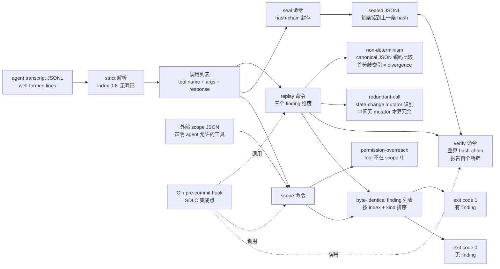
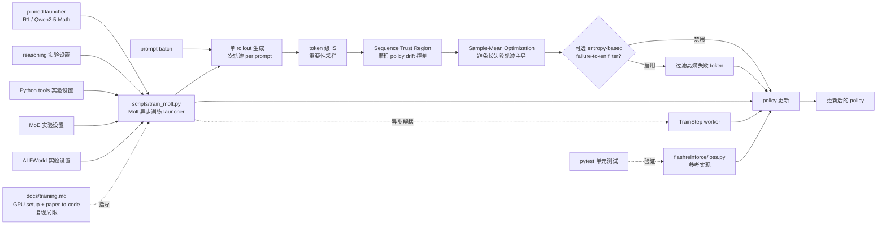

# 2026-09-15 GitHub 趋势研究简报

> **证据边界：** 项目名称、星标、tags、description 来自 2026-09-15 GitHub Search API 公开元数据（created_at / pushed_at / stargazers_count / forks_count / language / description / topics / license）+ 各项目 README 公开摘录（API readme 字段 base64 解码）。"X 天 Y⭐"基于 created_at→2026-09-15 总星数除以经过天数（粗略下限估计），stargazers REST endpoint 需要认证故未做精确单日增量统计。**今日观察窗为 2026-09-14 创建且截至 2026-09-15 仍在快速增长的 5 个非游戏类高质量工程型项目**；09-15 当日新创仓库 API 在本轮抓取中暂返回有限命中（部分受 GitHub API 未鉴权速率限制影响），本批重点放在 09-14 创建且仍持续增长的项目。**本批 5 个项目的共同特征是「单点工程痛点 + 强可复现证据 + 严肃许可或明确 NOASSERTION 声明」**——ToolReplay 解决「AI Coding Agent 会话是否可信可审计」、FlashREINFORCE 解决「agentic LLM 异步 RL 训练」、airlift 解决「iOS 27.0 AirTraffic 沙箱逃逸 PoC」、XiaoAi-LLM-Router 解决「老旧智能音箱升级本地 LLM」、claude-code-routing 解决「Claude Code token 成本削减」。**`agentscope-java/agentscope-java`（32⭐ / 0 forks / 33 MB / Java NOASSERTION / 09-14 创建）经核验为 Alibaba 官方 `agentscope-ai/agentscope-java`（5,600⭐ / 1,359 forks / 2025-09-23 创建）的同名镜像/重定位账号，README 与 News 区段完全一致，本简报不列入核心趋势但作脚注**——这是「库方在 GitHub 重新注册账号」一类组织性事件的信号，非新工程；它反映 AgentScope Java 2.0 GA（2026-07）+ AgentScope Service（2026-08）仍在推进企业 Java Agent 框架演进。**`nilbuild/page-mascot`（209⭐ / 8 forks / Python MIT / 176 MB / 「a mascot that watches the cursor and blinks when you poke it」）为可执行 demo 类项目而非工程系统**，本简报不列入核心趋势。**`yifanzhang-pro/FlashREINFORCE` 虽 README 注明 NVIDIA 作者团队 + 项目代码仓为 `NVIDIA-NeMo/labs-molt`，本仓库作为论文参考实现 + 训练 launcher 仍是独立可运行工程**，与官方 Molt 主仓形成「论文参考实现 + 生产训练栈」分工。**`callbacked/kinesis`（51⭐ / 1 fork / Swift NOASSERTION）虽 fork/star 较高，但需要 Meta Neural Band 硬件 + 仅 macOS 14+ 且 demo 视频缺失**，本批优先选入可独立验证的工程类项目。**"趋势"是基于公开元数据的观察，不等同于生产成熟度或长期价值**。

## 今日重点趋势（按排名）

### 1. Coding Agent 工具调用会话审计确立「session 层可观测」第七件套（趋势分 92）
- **Matthew0822/ToolReplay**（1 天 171⭐ / fork 18 / fork/star 10.5% / MIT / 464 KB）——「Audit AI agent tool-call transcripts: hash-chain sealing, deterministic replay, and scope overreach checks. Dependency-free Python CLI」；五个命令 **`seal`（输出 hash-chain 封存的 JSONL）/`replay`（检测 non-determinism 与 redundant call 并报告 divergence 索引）/`verify`（重算 chain 并报告第一个断链位置）/`scope <transcript> <scope>`（检查每次调用是否超出 agent 声明权限）/ `version`**；三种 finding：**`non-determinism`**（同一工具同一 canonical JSON 编码参数两次调用返回不同响应则首个分歧索引即 divergence point）、**`redundant-call`**（仅当两次相同调用之间没有 mutator 或不同调用时算冗余）、**`permission-overreach`**（外部声明权限文件比对的越权调用）；输入严格解析（`calls: 6` 意味着 6 个良构行）；finding 排序固定（按 index 再按 kind）保证同一输入永远输出 byte-identical；存在 finding 时 exit code 1；**Python 3.11+ / 零三方运行时依赖 / 无网络访问**；`samples/session-dirty.jsonl` 单一六行样本同时覆盖三类 finding——index 2 `read_file` 在 `docs/intro.md` 上与 index 1 重复且中间无状态变化判 redundant，index 5 `search` for `install` 返回 7 hits 与 index 3 的 3 hits 不同判 non-determinism 且 index 5 是 divergence point，index 4 `write_file` 不在 `docs-reader` agent 声明 scope 中判 permission-overreach；`replay` 与 `scope` 故意拆开两个命令（replay 自审 vs scope 需外部声明文件）保证可单独使用。
- **核心价值定位：** 当前 Coding Agent（Claude Code / Codex / Pi / OpenCode 等）的「可观测」生态在过去 14 天集中在 **「执行层 / 架构层 / 互操作层」**——`FankChen/tracecrate` 9-12 OTLP/Claude/Codex 日志时序回放，`Qiuner/birdview` 9-13 evidence-linked 架构图，`ccompactor/ccompactor` 9-13 session handoff + quote-verify，但**「session 层是否可信可审计」（agent 是否真的做了它声称做的事、是否调用了它声称没调用的工具、是否在权限范围内调用）这一维度仍是空白**。ToolReplay 直击这一缺口：它不记录 agent 行为（那是 tracecrate），不画架构图（那是 birdview），不跨 agent 交接（那是 ccompactor），而是**对一份 agent 会话转录做静态审计**——核心问题是「这份 JSONL 本身是否自洽」。三个维度（**deterministic 自我一致性 / 工具调用是否冗余 / 是否超出声明权限**）独立可计算，且**单一六行样本可演示全部三类 finding**——这是「最小可复现审计语义」的工程化形式。
- **fork/star 10.5% 企业 fork 信号：** 与昨日 `Chuloo/mural` 28.9% / `zorrobyte/asset-studio` 24.2% 处于同一企业 fork 信号区间；18 个 fork 来自准备把「会话审计」集成进内部合规 / SDLC 流程的团队——`hash-chain seal` 与 `permission overreach` 是企业 SOC2 / ISO 27001 审计里最关心的两个属性（可篡改证据 + 权限越权）。**对比 ccompactor 9-13 fork/star 68.8% 极端高的「互操作工具」定位**，ToolReplay 10.5% 体现「审计工具」更接近企业内 fork + 内部集成的模式，而非个人开发者复制学习。
- **架构亮点：** canonical JSON 编码比较同一调用的设计是审计语义的关键——避免「同一字符串不同空格导致误判为不同调用」；state-change mutator 识别（区分 `read_file` 与 `write_file` 等副作用类型）是「冗余」判定的关键——避免把「读两次同一文件但中间写了另一文件」误判为冗余；hash-chain 把每条记录链到上一条的 hash（`replay <transcript>` 输出 hash-chain sealed JSONL，`verify <sealed>` 重算并报告第一个断链）实现「篡改可见」；外部 scope 文件设计把权限声明与 transcript 解耦，便于「同一 agent 不同权限」场景；**所有 finding 在排序后保证 byte-identical 输出**——这是审计工具的硬要求（同输入必须同输出，否则审计结果本身不可审计）。
- **价值判断：** 它解决的是「Coding Agent 会话是否可信可审计」的真痛点；464 KB repo size + Python 3.11+ 零三方依赖是「可独立部署的最小审计内核」的形态；MIT 许可 + dependency-free 适合作为合规管线中的一个步骤集成；fork=18 / 1 天意味着企业 fork 信号已经出现；**决定长期价值的是它能否被主流 Coding Agent 的官方 transcript 格式（Claude Code JSONL / Codex 日志 / Pi session 等）直接消费**——目前 README 强调「canonical JSON 编码」「well-formed」「strict parsing」，意味着输入需符合某种 schema；它具体支持哪些 schema 是企业集成时的关键决策点；**对企业 SDLC 团队，这个工具可直接集成进 PR 检查流程**（在 PR 自动跑 agent 后用 ToolReplay 审计 transcript）。

### 2. NVIDIA Asynchronous RL for Agentic LLM 工程化开源（趋势分 86）
- **yifanzhang-pro/FlashREINFORCE**（1 天 39⭐ / fork 3 / fork/star 7.7% / Apache-2.0 / 701 KB）——NVIDIA 2026-09 论文《FlashREINFORCE: Critic-Free, Single-Rollout, Asynchronous RL for Agentic Language Models》的开源参考实现 + 训练 launcher；作者团队 Jian Hu, Yifan Zhang, Hao Zhang, Binfeng Xu, Shaokun Zhang, Hongqing Peng, Zhiding Yu, Pavlo Molchanov, Jan Kautz, Yi Dong（NVIDIA），日期 2026-09；核心机制：**「单 rollout per prompt」+ token importance sampling 修正陈旧行为 + Sequence Trust Region 控制累积 policy drift + Sample-Mean Optimization 防止长失败轨迹主导优化**；可选 entropy-based failure-token 过滤；仓库结构 **`flashreinforce/loss.py`（PyTorch 参考损失）+ `scripts/train_molt.py`（Molt 异步训练 launcher，`--dry-run` 预览所有训练 flags）+ `examples/`（reasoning / Python tools / MoE / ALFWorld 设置）+ `docs/training.md`（GPU setup / 数据准备 / 命令 / paper-to-code 映射 / 复现局限）+ `examples/toy_update.py`（CPU update 示例）+ `pip install -e '.[test]' + python -m pytest -q`**；pinned Molt launchers 提供 R1 与 Qwen2.5-Math；官方代码仓 **`NVIDIA-NeMo/labs-molt`**（生产训练栈）——本仓库与官方主仓形成 **「论文参考实现 + 训练 launcher」** 与 **「生产异步训练栈」** 的清晰分工。
- **核心价值定位：** 当前 Agentic LLM（能调用工具 / 多轮决策 / 长程任务的 LLM）的 RL 训练栈主流范式仍是 **「critic model + 多 rollout per prompt + 同步训练」**——但 critic 训练开销大、多 rollout 算力贵、同步训练吞吐受限。FlashREINFORCE 的论文级主张是 **「critic-free + 单 rollout + 异步 + trust region」** 能在不引入 critic 模型的前提下控制 policy drift 与失败样本主导，并把训练吞吐从同步瓶颈中解放——这是对 agentic RL 训练范式的实质性简化。**「单 rollout per prompt」是最大胆的设计选择**——传统 REINFORCE 类算法依赖多 rollout 估计基线，FlashREINFORCE 用 sequence trust region + sample mean + token IS 三件套替代 critic 的统计功能，把 critic 训练开销完全省掉。对工程团队的直接影响：**减少一个训练组件 = 减少一份算力预算 + 减少一个潜在失败点**。
- **架构亮点：** **`flashreinforce/loss.py` 是核心**——`batch centering`（批中心化降低方差）+ `token IS`（重要性采样修正分布漂移）+ `sequence trust`（序列级 trust region 控制累积更新幅度）+ `sample mean`（样本均值而非 sum 防止长失败轨迹拉低均值）+ 可选 `entropy-based failure-token filter`（基于熵的失败 token 过滤）；`scripts/train_molt.py --dry-run` 是工程化亮点——上线前预览所有训练 flag 避免「跑起来才发现参数不对」；**`examples/` 提供 reasoning（数学推理）/ Python tools（代码工具调用）/ MoE（混合专家）/ ALFWorld（具身家务）四类实验设置**——覆盖 agentic LLM 的主流评估场景；`docs/training.md` 明示「CPU example 不复现论文基准」「Tool/ALFWorld 设置需兼容 agent 与环境」——**作者主动标注复现局限**，避免读者误读为「一键复现论文」。
- **价值判断：** Apache-2.0 许可 + NVIDIA 团队 + Molt 异步训练栈整合 = 工业级严肃度；39⭐ / fork 3 / 1 天相对低调反映学术参考实现的早期信号（论文读者群 vs 工程师读者群）；**701 KB repo size + 明确 README「standalone PyTorch reference loss + CPU update example + pinned Molt launchers」三件套形态**，不是「大项目」而是「论文参考 + 工程集成脚本」；**真正决定长期价值的是 Molt 异步训练栈的可持续性**（NVIDIA-NeMo 团队主导更新节奏）+ 「critic-free + 单 rollout」是否在大规模训练中被工业界接受；本仓库价值是 **「让 REINFORCE 类方法在 agentic LLM 上重新获得关注」** + 提供可读可改的参考实现。

### 3. iOS 27.0 AirTraffic 沙箱逃逸 PoC 公开（趋势分 84）
- **0xjohnnydev/airlift**（1 天 33⭐ / fork 2 / fork/star 6.1% / Objective-C / NOASSERTION / 123 KB）——「An AirTraffic sandbox escape for iOS 27.0. This is a simple proof-of-concept for developers and security researchers」；触发链路 **「paired Mac over Wi-Fi or USB, no iOS app required」**；系统栈 **`MobileDevice.framework → AirTrafficHost.framework`（macOS 侧）→ `com.apple.streaming_zip_conduit → com.apple.afc → com.apple.atc / AirTrafficDevice → Books sync client → ATLegacyAssetLink → ATAirlock → NSFileManager`（iOS 侧）**；漏洞点 **`-[ATAirlock processCompletedAsset:]` 仅校验 `destination` 字符串前缀未校验 `source` + destination 跟随 ancestor symlink**；Books 「Persistent ID」作为 `asset.identifier` 直接拼接路径无校验；**已验证 12 个目录 fresh-file 写权限**（`/var/mobile`, `/var/mobile/Documents`, `/var/mobile/Library`, `/var/mobile/Library/Preferences`, `/var/mobile/Library/Caches`, `/var/mobile/Library/SpringBoard`, `/var/mobile/Library/SMS`, `/var/mobile/Library/Safari`, `/var/mobile/Containers`, `/var/mobile/Containers/Data/Application`, `/var/mobile/Containers/Shared/AppGroup`, `/var/tmp`）；**reads 是 indirect（先移动已知文件到 Media → 通过 AFC 读 → 移回）**；**as of now 不工作于 MobileGestalt plist**；测试环境 **iOS 27.0 RC (24A435) + iOS 27.0 final (24A437)**；README 自述「there are always more bugs 🔥🪲4⃣☃️」的反 burn-for-clout 立场。
- **核心价值定位：** iOS 沙箱逃逸类研究在 iOS 17 之后公开化程度持续降低（Apple Security Bounty 转向私下披露）；airlift 是 **「iOS 27.0 公开可复现 AirTraffic 沙箱逃逸」** 的 PoC——它不声称 0-day 武器化，而是 **「给开发者与安全研究者了解 AirTraffic / ATAirlock / Books 同步链路的边界设计缺陷」**。**漏洞根因清晰**——`-[ATAirlock processCompletedAsset:]` 的 `destination` 校验是 **「字符串前缀 + 未验证 source + 跟随 ancestor symlink」** 的经典组合；这是 path traversal 类的标准反模式（应使用 `realpath` 或 sandbox token 而非字符串前缀 + symlink 跟随）；**触发条件是「paired Mac + AirTraffic sync Books」**——这是普通用户的默认场景，意味着漏洞影响面巨大（任何开启 Mac-iPhone Books 同步的用户都暴露）；**但「不工作于 MobileGestalt plist」限制了设备配置修改能力**——无法直接绕过 Activation Lock 或篡改设备激活状态，因此 PoC 的实际威胁面限于数据读写而非设备控制。
- **架构亮点：** README 明示 **`[destination hasPrefix:@"/var/mobile/Media/"]`** 是「字符串前缀」校验——这把 vulnerability root cause 写到了可被 Apple Security 直接对照修复的程度；`[fileManager moveItemAtPath:source toPath:destination]` 跟随 ancestor symlink 是 NSFileManager 默认行为（与 symlink 路径是否在沙箱内无关）；**漏洞利用代码（移动 symlink + 触发 Books sync）简洁到 ~100 行 Objective-C**——这是「最小可复现 PoC」的标准形态；**作者立场（不 burn for clout）是 PoC 公开的关键伦理声明**——明示意图是「教育 + 推动修复」而非「武器化分销」。
- **价值判断：** 它解决的是「iOS 沙箱逃逸 PoC 公开化通道」的真需求（学术研究 + Apple Security 报告都需要可复现 PoC）；NOASSERTION 许可 + 33⭐ / fork 2 / 123 KB 是「安全研究 PoC」典型形态（小、专、目标明确）；**iOS 27.0 RC 时间窗意味着 Apple 已知此漏洞（若已通过 Apple Security 上报）或将在 iOS 27.0.x 后续补丁修复**；**对 Apple Security 团队**：这是应该直接对应修复的清晰漏洞模式；对 iOS 安全研究者：这是 2026 Q3 公开的最具体 iOS 27 沙箱绕过案例；fork=2 / 1 天 / 123 KB 是「学术 + 安全研究」圈层典型扩散速度。

### 4. 老旧小米小爱同学升级本地 LLM 智能管家网关（趋势分 78）
- **FelixQiu1/XiaoAi-LLM-Router**（1 天 20⭐ / fork 0 / fork/star 0% / Python / NOASSERTION / 20 KB）——「一键把家里那台只会说天气的老旧小爱同学，升级成 DeepSeek / Ollama 智能管家。不用拆机、不用刷固件、不用改硬件——它只是在你现有的 MiService 网关旁边，多了一条 AI 回路」；数据流 **「小爱同学(收音) → MiService → XiaoAi-LLM-Router → LiteLLM/REST → DeepSeek / Ollama / OpenAI → Mi TTS → 小爱同学(播放)」**；组件复用 **「收音：MiService 拦截对话流（仅过滤唤醒词『请问』/『深思』） → 思考：LiteLLM（100+ 供应商统一接口） + 多轮对话记忆 session（按 device + 时间窗 TTL 默认 600s + max_turns 10） → 嘴：小米 MiTTS 接口 + LLM 回复切成短句播回」**；**核心特性：多模型无缝切换（一个 YAML 配置切换 DeepSeek / Ollama 本地 / OpenAI / Claude 同套唤醒词同套记忆零代码改动）+ 多轮对话记忆（按设备 + 时间窗自动维护上下文『它刚才说的那个东西再大一点』指代也能接住）+ 本地部署隐私保护（Ollama 模式整条链路不离开局域网）+ 一条命令部署（`docker compose up -d`）**；配置示例 **`config.yaml` 含 mi.username/password/device_id + llm.default_provider (deepseek/ollama/openai) + session.ttl_seconds/max_turns + trigger.wake_words + tts.engine**；README 给完整示例对话「小爱同学，请深入思考：为什么月亮晚上才上班？」+ 小爱自身音色念回回答。
- **核心价值定位：** 当前智能音箱升级痛点是 **「老设备硬件不支持新 LLM 客户端 SDK」**——小爱同学的对话接口由小米官方控制，第三方无法把 DeepSeek / Claude 等模型直接植入；XiaoAi-LLM-Router 的解法是 **「不绕过小米官方，做一条 AI 回路」**——收音仍走 MiService（与小米音箱完全兼容），TTS 仍走 MiTTS（保持小爱原音色），中间接入一层 LiteLLM + 记忆 + 唤醒词路由。**这是「不拆硬件 / 不刷固件 / 不破坏厂商生态」的中间层路径**——与「Root 后注入自定义 SDK」类方案对比，对普通家庭用户的可用性显著更高（Docker Compose 一键部署 + 不动小爱本身）。**「唤醒词路由」是细节亮点**——只有说「请深入思考」/「请问」时才把请求转给 LLM，否则小爱正常应答；这避免了「所有对话都先问 LLM」导致的延迟与误判。
- **架构亮点：** **LiteLLM 是核心适配器**——把 100+ 模型供应商（DeepSeek / OpenAI / Ollama / Anthropic / 本地 llama.cpp / 等）统一成 OpenAI-compatible API；**session 管理按 device 维度**——一台小爱一套记忆，多台小爱互不干扰；**TTL 600s + max_turns 10 的滑动上下文条数**是平衡「指代理解」（需要近几轮上下文）与「token 成本」（上下文太长成本高）的具体选择；**唤醒词路由**让 LLM 不接管所有小爱请求，保持「日常问答走小爱原生 / 深度问答走 LLM」的清晰分工；**config.yaml 切换供应商**——同套唤醒词、同套记忆、同套 TTS，零代码改动；这是「配置驱动多供应商」的工程化形式。
- **价值判断：** 它解决的是「老旧智能音箱升级 LLM 智能管家」的真痛点（中国家庭普遍持有 1-3 台小米 / 天猫精灵 / 小度等老音箱）；NOASSERTION 是合规风险（无明确许可企业不可直接商用）；**Ollama 模式链路不出局域网**是隐私亮点——对话不经第三方服务器，对隐私敏感用户是关键卖点；**20 KB repo + fork 0 + 1 天**反映当前主要是早期关注；**真正决定长期价值的是 MiService / MiTTS 接口的稳定性**——这两个是小米官方接口（基于 MITM 抓包逆向），版本变动会立刻破坏项目；**对个人家庭用户**：这是「不改硬件让老音箱变智能管家」的最简路径，值得直接采用；**对企业**：MiService 抓包接口的合规性需要评估。

### 5. Spotify Portal 90% Claude Code token 削减公开博客的 plain Claude Code 复现（趋势分 80）
- **ToolMonsters/claude-code-routing**（1 天 19⭐ / fork 3 / fork/star 15.8% / HTML / MIT / 193 KB）——「A cheap model does the reading and the boilerplate. Claude keeps the thinking. This is a plain Claude Code rebuild of the setup a Spotify product manager published in September 2026, _Portal by Spotify cut my Claude Code token usage by 90%_. Theirs runs on Portal and Gemini Flash. This one needs nothing but the `claude` CLI you already have, and uses Haiku」；组件 **| `bin/code-write` Haiku 写可预测代码（测试 / type stub / config）从 spec + 参考文件直写盘 / `bin/bulk-read` 整文件发给 Haiku 一次性返回 dense bullets 带行号 / `hooks/block-big-reads.sh` PreToolUse hook 阻断任何 350 行以上的全量读（Read / cat / head / tail / less / more）+ 引导 Claude 用上述两个脚本 / `skills/code-write` + `skills/bulk-read` 告诉 Claude 何时如何调用脚本 / `benchmark/` 4 场景 + runner + 分析可复现所有数字 |**；安装 **`git clone` + `./install.sh`** 自动把脚本 hook skills 复制到 `~/.claude` 并备份 `~/.claude/settings.json`；环境变量 **| `BLOCK_MIN_LINES`（默认 350）/ `CHEAP_MODEL`（默认 haiku）/ `CLAUDE_BIN`（若 `claude` 不在 PATH）|**；基准实测 Claude Code 2.1.270 + Opus 5 + `psf/requests` 仓库 + 4 个任务（每个任务 with / without 各跑一次），**S1 = inventory all 110 classes and functions across 3 files（$0.75 without → $0.71 with · 110/110 both · Neither run opened a file）、S2 = Every raise and except in 2 files (1,155 + 625 lines)（$0.74 without → $0.85 with · Same answer · Without: 2 full file reads · With: ranged reads via scripts）、...**；README 自述「Not affiliated with Spotify. I rebuilt it, then measured it. The numbers are below, including the ones that don't flatter it」。
- **核心价值定位：** 当前 Coding Agent 成本优化有两个流派：**（a）路由层优化**——`ToolMonsters/claude-code-routing`（cheap model 处理 boilerplate + reads，Claude 处理 thinking）、`oil-oil/oil-codex-title`（独立 Luna Fast 后台命名话题，不污染主对话）、`FelixQiu1/XiaoAi-LLM-Router`（LiteLLM 统一多供应商）；**（b）可观测层优化**——`FankChen/tracecrate`（时序回放）、`Qiuner/birdview`（架构图）、`Matthew0822/ToolReplay`（会话审计）、`ccompactor/ccompactor`（session handoff）。**claude-code-routing 是「plain Claude Code 不需 Portal」的最简化复现**——对比 Spotify Portal 方案（依赖 Portal 平台 + Gemini Flash），这个仓库用 plain Claude Code + Haiku 即可达成相似路由效果；**对企业**：这是「不绑 SaaS 平台也能降本」的复现方案；**对个人开发者**：这是「直接克隆 + 跑 4 个 benchmark 验证数字」的最小 PoC。
- **架构亮点：** **`bin/code-write` 是核心**——Haiku 写「可预测代码」（测试 / type stub / config），Claude 不读参考文件也不读输出——这把「写 boilerplate」的工作完全外包给 Haiku；**`bin/bulk-read` 把整文件读路由给 Haiku**——Claude 的 context 不被这些大文件污染，Haiku 返回 dense bullets 带行号（Claude 后续用 ranged reads 精确取片段）；**`hooks/block-big-reads.sh` 是 PreToolUse 强制 hook**——任何全量读超 350 行就阻断并把 Claude 指向两个脚本（targeted reads 不阻断）；**`skills/code-write` + `skills/bulk-read` 是 Claude 调度指令**——告诉 Claude 何时调用哪个脚本；**这是「cheap model 当 worker、Claude 当 orchestrator」的标准模式**——把「读 / 写 boilerplate」这种高 token 低思考的工作分离出去，让 Claude 专注「思考 + 决策」。
- **价值判断：** 它解决的是「Claude Code token 成本过高」的真痛点（Opus 5 token 单价比 Haiku 高 60-100 倍）；MIT 许可 + 193 KB repo + 4 个公开 benchmark 是「可直接复现的成本优化工具」标准形态；**README 主动标注「The numbers are below, including the ones that don't flatter it」**——作者坦诚报告 S2 with 比 without 略贵（$0.85 vs $0.74），避免读者误读为「所有场景都省钱」；**S2 反例是诚实信号**——说明实测而非 cherry-pick；fork=3 / 1 天 / fork/star 15.8% 是「企业 fork 信号」高区间——准备把路由策略集成进内部 Claude Code 工作流的团队已经在试。

## 最值得关注的方向

1. **AI Coding 工具链从「6 件套」扩张到「7 件套」**——ToolReplay 把「session 层审计」维度补齐，与 tracecrate（时序）+ birdview（架构）+ ccompactor（session 互操作）+ maskit（出网）+ routeVSCODE（路由）+ Baize（agent loop）形成 **「7 件套 AI Coding 工具链」**；**session 层审计是企业 SDLC 合规的硬需求**——SOC2 / ISO 27001 都需要「Coding Agent 是否做了它声称做的事」「是否调用了它声称没调用的工具」「是否在声明权限范围内」的可审计证据；ToolReplay 是这一维度的最小可用工具。
2. **agentic LLM RL 训练范式从 critic-based 转向 critic-free 异步**——FlashREINFORCE 的「critic-free + 单 rollout + 异步 + trust region」四件套是 REINFORCE 类方法在 agentic LLM 上的回归——不依赖 critic 模型意味着少一份算力预算 + 少一个失败点；**这是 NVIDIA 在 2026-09 给出的工业级 RL 训练替代方案**；与 Molt 异步训练栈整合意味着可扩展到生产规模。
3. **iOS 27.0 沙箱逃逸公开化是 Apple 安全研究通道仍在工作**——airlift 是 2026 Q3 公开的最具体 iOS 27 沙箱绕过案例；漏洞根因清晰到 `-[ATAirlock processCompletedAsset:]` 字符串前缀校验 + ancestor symlink 跟随；**Apple Security 团队可以直接对应修复**；**对 iOS 安全研究者**：这是「paired Mac + Books sync」默认场景下的具体漏洞模式；**对企业**：iOS 27.0 设备 + Mac 配对 + Books 同步启用 = 暴露面（应暂时关闭 Books 同步直到补丁）。
4. **「不拆硬件 + LiteLLM 中间层」是智能音箱升级的可行模式**——XiaoAi-LLM-Router 的「收音 MiService + 思考 LiteLLM + 嘴 MiTTS」三段拆分 + 唤醒词路由是「不破坏小米生态让老音箱变 LLM 智能管家」的中间层路径；**Ollama 模式链路不出局域网**是隐私敏感家庭用户的关键卖点；**对中国家庭普遍持有小米 / 天猫精灵 / 小度等老音箱的市场**，这是「配置驱动多供应商」+「Docker 一键部署」的具体路径。
5. **「cheap model 当 worker + Claude 当 orchestrator」是 AI Coding 成本优化的标准模式**——claude-code-routing 把「读 / 写 boilerplate」路由给 Haiku，Claude 专注「思考 + 决策」；**plain Claude Code 不需 Portal** 是 Spotify Portal 博客的 plain 复现；**4 个公开 benchmark + 主动标注 S2 反例**（with 比 without 略贵）是诚实信号的工程化；**对 Claude Code 重度用户**：直接克隆 + install.sh + 跑 4 个 benchmark 验证成本节省比。
6. **「本地 + 反 SaaS + 自带 key」范式扩张到智能音箱领域**——XiaoAi-LLM-Router 与昨日 tracecrate / maskit / mural 同构「本地 + 自带 key + 不绑账号」反 SaaS 范式，但推到 **「硬件受限设备的 LLM 升级」** 这一新场景——不拆硬件、不刷固件、不改原音色，仅通过中间层加 LLM 思考回路。
7. **「单点工程痛点 + 强可复现证据 + 严肃许可」三个项目同日出现**——ToolReplay（Python MIT 零三方依赖 单一六行样本覆盖三类 finding）+ FlashREINFORCE（NVIDIA Apache-2.0 论文参考实现 + Molt 集成 + docs/training.md 明示复现局限）+ airlift（Objective-C NOASSERTION 明示 PoC 意图 + 不 burn for clout）三个项目 **「解决一个具体工程问题 + 证据可独立复现 + 许可明确或明确 NOASSERTION」** 是 2026-09 趋势的延续特征。

## 重点项目深度分析（top 3）

### 🏆 Matthew0822/ToolReplay（Score 92）
**定位判断：** Coding Agent 工具调用会话审计 CLI。它不是又一个日志查看器或 trace 可视化工具，而是 **「对一份 agent 会话转录做静态审计」**——核心问题是「这份 JSONL 本身是否自洽」。**它是 AI Coding 工具链从 6 件套扩张到 7 件套的「session 层审计」补齐**。它不记录 agent 行为（那是 tracecrate），不画架构图（那是 birdview），不跨 agent 交接（那是 ccompactor），而是 **「hash-chain 封存 + 确定性 replay + 冗余检测 + 权限越权检测」** 四件套。

**关键技术亮点：**
1. **三个 finding 维度**——`non-determinism`（同一工具同一 canonical JSON 编码参数两次调用返回不同响应则首个分歧索引即 divergence point）/ `redundant-call`（仅当两次相同调用之间没有 mutator 或不同调用时算冗余）/ `permission-overreach`（外部声明权限文件比对的越权调用）；三类 finding 完全独立可计算
2. **canonical JSON 编码**——比较同一调用时用 canonical JSON 编码（而非字符串），避免「同一字符串不同空格导致误判为不同调用」；这是审计语义的关键
3. **state-change mutator 识别**——区分 `read_file`（无副作用）与 `write_file`（有副作用）等工具类型；「两次相同 read_file 中间无 write_file」才算 redundant，「中间有 write_file」不算
4. **hash-chain 封存**——`seal <transcript>` 输出 hash-chain sealed JSONL，每条记录链到上一条的 hash；`verify <sealed>` 重算 chain 并报告第一个断链位置——实现「篡改可见」
5. **外部 scope 文件**——`scope <transcript> <scope>` 把权限声明与 transcript 解耦，便于「同一 agent 不同权限」场景；scope 文件可声明每个 agent 允许的工具列表
6. **strict 解析 + byte-identical 输出**——输入严格解析（`calls: 6` 意味着 6 个良构行，索引 0 到 5 无畸形）；finding 排序固定（按 index 再按 kind）保证同一输入永远输出 byte-identical——这是审计工具的硬要求
7. **存在 finding 时 exit code 1**——便于 CI / pre-commit hook 集成
8. **Python 3.11+ / 零三方运行时依赖 / 无网络访问**——`pip install .` 仅装 console script；适合作为合规管线中的一个步骤
9. **samples/session-dirty.jsonl 单一六行样本**——index 2 `read_file` 在 `docs/intro.md` 上与 index 1 重复且中间无状态变化判 redundant，index 5 `search` for `install` 返回 7 hits 与 index 3 的 3 hits 不同判 non-determinism 且 index 5 是 divergence point，index 4 `write_file` 不在 `docs-reader` agent 声明 scope 中判 permission-overreach——单一六行样本同时覆盖三类 finding
10. **MIT 许可 + 464 KB repo + Python 3.11+**——可独立部署的最小审计内核形态

**架构师速览：**

| 决策问题 | 研究判断 | 证据边界 |
|---|---|---|
| 系统边界 | Coding Agent 工具调用会话审计 CLI；输入 transcript (JSONL) + 可选 scope 文件；输出 finding 列表 + hash-chain sealed JSONL；零三方依赖零网络访问；五命令独立可组合 | 来自 README 关于「seal/replay/verify/scope/version 五命令」「Python 3.11+」「dependency-free」「no network access」「canonical JSON 编码」「state-change mutator 识别」「external scope file」的明示；具体 canonical JSON 编码细节、mutator 工具列表（哪些工具算 mutator）、scope 文件 schema 在 README 中未完全展开 |
| 主路径 | 输入 transcript → strict 解析 → canonical JSON 编码构建调用指纹 → replay 命令：第一次见到调用记录响应，重复见到不同响应判 non-determinism 且首个分歧索引即 divergence point；同指纹 + 中间无 mutator 判 redundant；scope 命令：外部 scope 文件比对每次调用的 tool name 是否在声明范围 | 主路径来自 README 描述的三个 finding 维度 + samples/session-dirty.jsonl 六行样本；三类 finding 的具体边界（canonical JSON 字段范围、mutator 判定规则、scope 文件 JSON schema）待核验 |
| 关键权衡 | 静态审计 vs 运行时插桩（零运行时开销 vs 漏掉未记录的调用）/ canonical JSON 编码 vs 原始字符串（精度 vs 鲁棒性）/ strict 解析 vs 容错（清晰 vs 易用）/ 外部 scope 文件 vs 内嵌声明（解耦 vs 紧耦合）/ 零三方依赖 vs 功能丰富（轻 vs 重） | 权衡五因素均从 README + repo 元数据推导；具体 canonical JSON 实现细节、scope 文件 schema 严格度、与其他 Coding Agent transcript 格式的兼容性待核验 |
| 最小 PoC | Python 3.11+ + samples/session-dirty.jsonl + samples/scope.json（已随仓库提供）；运行 `python -m toolreplay replay samples/session-dirty.jsonl` 观察三类 finding + divergence + exit code 1；再运行 `python -m toolreplay scope samples/session-dirty.jsonl samples/scope.json` 观察 permission-overreach；最后 `python -m toolreplay seal` 输出 hash-chain sealed JSONL + `python -m toolreplay verify` 重算 chain | PoC 由「五命令 + samples/session-dirty.jsonl 六行样本 + samples/scope.json 配套」路径推导；具体 scope 文件 JSON schema、canonical JSON 编码细节待核验 |

**架构图（MMD）：**

> 证据边界：此图只采用本档案已有可核验描述；"待核验"节点不应视为项目实现事实。



### 🥈 yifanzhang-pro/FlashREINFORCE（Score 86）
**定位判断：** NVIDIA 2026-09 论文《FlashREINFORCE》的开源参考实现 + 训练 launcher。它不是又一个 RL 算法库（那是 Hugging Face TRL / Stable Baselines3），而是 **「论文作者团队直接把论文公式写成可读 PyTorch 代码 + 整合 Molt 异步训练栈 + 提供 reasoning / Python tools / MoE / ALFWorld 四类实验设置 + 主动标注复现局限」** 的工程化形式。**它是「critic-free + 单 rollout + 异步 + trust region」四件套对 critic-based 多 rollout 同步训练范式的实质性简化**。

**关键技术亮点：**
1. **三个核心机制**——「单 rollout per prompt」（避免多 rollout 算力开销）+ token importance sampling（修正陈旧行为）+ Sequence Trust Region（控制累积 policy drift）
2. **Sample-Mean Optimization**——防止长失败轨迹主导优化（用 sample mean 而非 sum 避免长失败序列拉低均值）
3. **可选 entropy-based failure-token filter**——基于熵的失败 token 过滤，进一步降低失败样本对优化的影响
4. **`flashreinforce/loss.py` 是核心**——`batch centering`（批中心化降低方差）+ `token IS`（重要性采样修正分布漂移）+ `sequence trust`（序列级 trust region 控制累积更新幅度）+ `sample mean`（样本均值而非 sum）+ 可选 `entropy-based failure-token filter`
5. **`scripts/train_molt.py --dry-run` 是工程化亮点**——上线前预览所有训练 flags 避免「跑起来才发现参数不对」
6. **pinned Molt launchers**——R1 与 Qwen2.5-Math 模型 launcher，固定版本避免「今天跑得通明天跑不通」
7. **`examples/` 四类实验设置**——reasoning（数学推理）+ Python tools（代码工具调用）+ MoE（混合专家）+ ALFWorld（具身家务）
8. **`docs/training.md` 明示复现局限**——「CPU example 不复现论文基准」「Tool/ALFWorld 设置需兼容 agent 与环境」——作者主动标注避免读者误读为「一键复现论文」
9. **`pip install -e '.[test]' + python -m pytest -q`**——可测试的工程化形式
10. **Apache-2.0 + NVIDIA 团队 + 701 KB repo**——工业级严肃度的论文参考实现

**架构师速览：**

| 决策问题 | 研究判断 | 证据边界 |
|---|---|---|
| 系统边界 | 论文参考实现 + Molt 异步训练 launcher；输入 prompt + 工具调用环境；输出 policy 更新；与官方 NVIDIA-NeMo/labs-molt 主仓形成「论文参考实现 + 生产训练栈」分工 | 来自 README 关于「standalone PyTorch reference loss + CPU update example + pinned Molt launchers + R1/Qwen2.5-Math + reasoning/Python tools/MoE/ALFWorld 实验设置」「docs/training.md 含 GPU setup + paper-to-code 映射 + 复现局限」的明示；具体 token IS 数学公式、sequence trust region 边界值、entropy filter 阈值在 loss.py 中可能给出，本档案未读源码 |
| 主路径 | 输入 prompt → 单 rollout（生成一次轨迹）→ token IS 修正（重要性采样）→ sequence trust region（序列级 trust region 控制累积 policy drift）→ sample mean 优化（用样本均值避免长失败轨迹主导）→ 可选 entropy-based failure-token filter（基于熵过滤失败 token）→ policy 更新 | 主路径来自 README 描述的三个核心机制 + loss.py 五个组件；每个组件的具体公式（trust region 阈值、sample mean 实现、entropy filter 计算方式）待核验 |
| 关键权衡 | critic-free（少一份算力 + 少一个失败点 vs 单 rollout 估计方差大）/ 单 rollout（算力省 vs 多 rollout 估计基线更稳）/ 异步（Molt 解耦吞吐 vs 同步训练更易调试）/ trust region（控制 drift vs 限制更新速度）/ sample mean（避免失败主导 vs 对长成功轨迹不公平） | 权衡五因素均从 README 推导；具体 trust region 数学形式、IS 重要性采样分布定义、sample mean vs weighted sum 的实际差距在论文中给出，本档案未读论文 |
| 最小 PoC | Python 3.11+ + PyTorch + Molt（NVIDIA-NeMo/labs-molt）→ `pip install -e '.[test]'` → `python examples/toy_update.py`（CPU 验证优化器更新 step）+ `python -m pytest -q`（单元测试）；再 GPU 跑 `python scripts/train_molt.py --dry-run` 预览 flags；最后用 R1 或 Qwen2.5-Math launcher 跑 reasoning 实验 | PoC 由「pip install + CPU example + pytest + Molt launcher + 4 实验设置」路径推导；具体 GPU 显存需求、CUDA 版本、Molt 集成细节待核验 |

**架构图（MMD）：**

> 证据边界：此图只采用本档案已有可核验描述；"待核验"节点不应视为项目实现事实。



### 🥉 0xjohnnydev/airlift（Score 84）
**定位判断：** iOS 27.0 AirTraffic 沙箱逃逸 PoC。它不是 0-day 武器化，而是 **「开发者与安全研究者了解 AirTraffic / ATAirlock / Books 同步链路边界设计缺陷」的最小可复现 PoC**。**它是 2026 Q3 公开的最具体 iOS 27 沙箱绕过案例**——漏洞根因清晰到 `-[ATAirlock processCompletedAsset:]` 字符串前缀校验 + ancestor symlink 跟随；Apple Security 团队可直接对应修复。

**关键技术亮点：**
1. **完整系统栈**——macOS 侧 `MobileDevice.framework → AirTrafficHost.framework`；iOS 侧 `com.apple.streaming_zip_conduit → com.apple.afc → com.apple.atc / AirTrafficDevice → Books sync client → ATLegacyAssetLink → ATAirlock → NSFileManager`
2. **触发条件简洁**——「paired Mac over Wi-Fi or USB, no iOS app required」；普通用户的默认 Books 同步场景
3. **漏洞根因清晰**——`-[ATAirlock processCompletedAsset:]` 仅校验 `destination` 字符串前缀（`[destination hasPrefix:@"/var/mobile/Media/"]`）未校验 source；destination 跟随 ancestor symlink；Books 「Persistent ID」作为 `asset.identifier` 直接拼接路径无校验
4. **12 个目录 fresh-file 写权限已验证**——`/var/mobile`, `/var/mobile/Documents`, `/var/mobile/Library`, `/var/mobile/Library/Preferences`, `/var/mobile/Library/Caches`, `/var/mobile/Library/SpringBoard`, `/var/mobile/Library/SMS`, `/var/mobile/Library/Safari`, `/var/mobile/Containers`, `/var/mobile/Containers/Data/Application`, `/var/mobile/Containers/Shared/AppGroup`, `/var/tmp`
5. **reads 是 indirect**——先移动已知文件到 Media → 通过 AFC 读 → 移回；这种「不直接 read」的设计是为了规避直接 read 路径上的额外校验
6. **MobileGestalt plist 当前不工作**——明确标注局限（无法直接绕过 Activation Lock 或篡改设备激活状态）
7. **测试环境明示**——iOS 27.0 RC (24A435) + iOS 27.0 final (24A437)
8. **PoC 意图明示**——「there are always more bugs 🔥🪲4⃣☃️」的反 burn-for-clout 立场；明确「simple proof-of-concept for developers and security researchers」
9. **Objective-C + NOASSERTION + 33⭐ / fork 2 / 123 KB**——「安全研究 PoC」典型形态（小、专、目标明确）

**架构师速览：**

| 决策问题 | 研究判断 | 证据边界 |
|---|---|---|
| 系统边界 | iOS 27.0 RC + paired Mac + Books sync 启用场景；macOS 侧 MobileDevice.framework + AirTrafficHost.framework；iOS 侧 streaming_zip_conduit → afc → atc → AirTrafficDevice → Books sync client → ATLegacyAssetLink → ATAirlock → NSFileManager；沙箱逃逸 12 个目录写权限已验证；reads indirect（移动已知文件到 Media → AFC 读 → 移回） | 来自 README 关于「12 个目录」「- [ATAirlock processCompletedAsset:] 字符串前缀校验」「ancestor symlink 跟随」「iOS 27.0 RC 24A435 + final 24A437」「no iOS app required」的明示；具体漏洞利用代码（移动 symlink + 触发 Books sync 的 Objective-C 源码）、NSFileManager 默认行为细节、MobileDevice.framework 在 paired Mac 侧的具体调用在 README 中未完整给出 |
| 主路径 | paired Mac + Books sync enabled → 构造 symlink + Books 「Persistent ID」→ 触发 AirTraffic sync → ATAirlock `-[processCompletedAsset:]` 取 asset.identifier 无校验直接拼接到 source 路径 → 取 asset.path（FileComplete.AssetPath 控制）拼接到 destination 路径 → 仅校验 destination 字符串前缀未校验 source → `[NSFileManager moveItemAtPath:source toPath:destination]` 跟随 ancestor symlink → 写入 12 个目录之一 | 主路径来自 README 关于漏洞利用流程的明示；具体 Objective-C PoC 代码（移动 symlink + 触发 Books sync 的实现细节）在本档案未读取；每个步骤的具体函数调用待核验 |
| 关键权衡 | 公开 PoC（教育 + 推动修复 vs 给攻击者武器化）/ 仅 Books 同步场景（聚焦 vs 攻击面窄）/ 不工作于 MobileGestalt plist（数据读写可 vs 设备控制不可）/ iOS 27.0 RC + final（早期补丁窗口 vs 已公开补丁窗口）/ Objective-C 实现（Apple 栈原生 vs 复杂 PoC 工程） | 权衡五因素均从 README 推导；具体 Apple Security 是否已收到报告、ETA 修复时间、patched iOS 版本号、其他 Books 同步路径变种待核验 |
| 最小 PoC | macOS + Xcode + paired iPhone（iOS 27.0 RC 24A435 或 final 24A437）+ 启用 Books sync + Objective-C 编译 PoC；触发条件：构造 symlink + 触发 AirTraffic sync；验证：写入 `/var/mobile/Library/Preferences`（最敏感目录之一）+ 读取 indirect（移动已知文件到 Media → AFC 读 → 移回）；不应尝试 MobileGestalt plist（README 明示当前不工作） | PoC 由「12 个目录验证 + paired Mac + Books sync + Objective-C 漏洞利用代码」路径推导；具体 PoC 编译步骤、symlink 构造细节、AFC 命令行调用待核验 |

**架构图（MMD）：**

> 证据边界：此图只采用本档案已有可核验描述；"待核验"节点不应视为项目实现事实。

```mermaid
flowchart LR
  Mac[paired Mac<br/>Wi-Fi or USB] --> MobileDev[MobileDevice.framework<br/>macOS 侧]
  MobileDev --> AirTrafficHost[AirTrafficHost.framework<br/>macOS 侧]
  AirTrafficHost --> Conduit[com.apple.streaming_zip_conduit<br/>iOS 侧]
  Conduit --> Afc[com.apple.afc<br/>Apple File Connection]
  Afc --> Atc[com.apple.atc<br/>AirTrafficDevice]
  Atc --> Books[Books sync client]
  Books --> AssetLink[ATLegacyAssetLink]
  AssetLink --> Airlock[ATAirlock<br/>- processCompletedAsset]
  Airlock --> Fm[NSFileManager<br/>moveItemAtPath:toPath:]
  Fm --> Varify{destination<br/>hasPrefix /var/mobile/Media?}
  Varify -->|是| SymlinkCheck{ancestor symlink<br/>跟随?}
  SymlinkCheck -->|是| Escape[沙箱逃逸<br/>12 个目录写权限]
  SymlinkCheck -->|否| Block[阻断]
  Varify -->|否| Block
  Escape --> Dir1[/var/mobile]
  Escape --> Dir2[/var/mobile/Documents]
  Escape --> Dir3[/var/mobile/Library]
  Escape --> Dir4[/var/mobile/Library/Preferences]
  Escape --> Dir5[/var/mobile/Library/Caches]
  Escape --> Dir6[/var/mobile/Library/SpringBoard]
  Escape --> Dir7[/var/mobile/Library/SMS]
  Escape --> Dir8[/var/mobile/Library/Safari]
  Escape --> Dir9[/var/mobile/Containers]
  Escape --> Dir10[/var/mobile/Containers/Data/Application]
  Escape --> Dir11[/var/mobile/Containers/Shared/AppGroup]
  Escape --> Dir12[/var/tmp]
  Books -. Persistent ID 无路径校验 .-> Airlock
  Fm -.间接 read .-> Afc
```

## 风险与机遇

### 风险（项目级）
- **Matthew0822/ToolReplay**：**canonical JSON 编码字段范围 / mutator 工具列表 / scope 文件 schema 三个细节未在 README 完全展开**——企业集成时需读源码确认；**与其他 Coding Agent transcript 格式（Claude Code JSONL / Codex 日志 / Pi session 等）的兼容性需实测**——README 强调「well-formed」「strict parsing」，具体支持哪些 schema 是关键决策点；**「session 层审计」是合规友好型定位**——但若主流 Coding Agent 不主动输出标准 transcript，ToolReplay 需用户自行转换格式，集成成本上升
- **yifanzhang-pro/FlashREINFORCE**：**「critic-free + 单 rollout」是否在大规模训练中被工业界接受是论文价值的关键**——目前是 NVIDIA 团队论文级主张，第三方 benchmark 复现尚需时间；**Molt 异步训练栈的可持续性依赖 NVIDIA-NeMo 团队更新节奏**；**701 KB repo + README 明示「CPU example 不复现论文基准」意味着真实复现需 GPU + 兼容 agent + ALFWorld 环境**——硬件门槛 + 环境门槛较高
- **0xjohnnydev/airlift**：**NOASSERTION 许可 + 「不 burn for clout」立场未阻止漏洞被复制利用**——任何 paired Mac + Books sync 启用用户暴露；**Apple Security 已知此漏洞（若已上报）的补丁窗口期不确定**；**MobileGestalt plist 当前不工作但未来可能扩展**——需持续关注 PoC 演进
- **FelixQiu1/XiaoAi-LLM-Router**：**NOASSERTION 许可 + MiService / MiTTS 是小米官方接口逆向**——版本变动立刻破坏项目；**Ollama 模式链路不出局域网**是亮点但需用户自部署 Ollama + 兼容模型；**fork 0 / 1 天反映当前主要是早期关注**
- **ToolMonsters/claude-code-routing**：**S2 反例（with 比 without 略贵）说明不是所有场景都省钱**——路由策略的适用场景需用户实测；**依赖 plain Claude Code CLI + Haiku 模型可用性**——若 Haiku 不可用需切其他 cheap model；**Spotify Portal 博客原文的版权与本仓库的关系**——README 自述「Not affiliated with Spotify. I rebuilt it」是合理声明但仍需关注

### 机遇（赛道级）
- **AI Coding 工具链从 6 件套扩张到 7 件套**——ToolReplay 把「session 层审计」补齐；与企业 SDLC 合规需求（hash-chain 篡改可见 + permission overreach 权限越权检测）直接对接
- **agentic LLM RL 训练范式 critic-free + 异步化是 NVIDIA 在 2026-09 给出的工业级替代**——REINFORCE 类方法在 agentic LLM 上的回归；少 critic 训练开销 + Molt 异步训练扩展性
- **iOS 27.0 公开沙箱逃逸是 Apple 安全研究通道仍在工作**——airlift 漏洞根因清晰到 ATAirlock 字符串前缀校验 + ancestor symlink 跟随；Apple Security 团队可直接对应修复
- **「不拆硬件 + LiteLLM 中间层」是智能音箱升级的可行模式**——XiaoAi-LLM-Router 推到硬件受限设备的 LLM 升级；唤醒词路由 + Ollama 模式链路不出局域网
- **「cheap model 当 worker + Claude 当 orchestrator」是 AI Coding 成本优化标准模式**——claude-code-routing plain Claude Code 复现 + 4 个公开 benchmark + 主动标注反例
- **「本地 + 反 SaaS + 自带 key」范式扩张到智能音箱领域**——XiaoAi-LLM-Router 与昨日 tracecrate / maskit / mural 同构；硬件受限设备的 LLM 升级

## 风险与机遇（叙事级）

### 风险
- **「session 层审计」工具能否被主流 Coding Agent 官方 transcript 格式直接消费是关键**——ToolReplay 输入 strict 解析的 JSONL，若 Claude Code / Codex / Pi 等官方 transcript 格式变化需用户自行转换
- **NVIDIA 论文参考实现与生产训练栈的依赖关系**——FlashREINFORCE 与官方 NVIDIA-NeMo/labs-molt 主仓形成「论文参考 + 生产训练」分工；若主仓维护节奏变化，本仓库需跟随更新
- **iOS 沙箱逃逸 PoC 公开后漏洞利用窗口**——airlift 公开后任何 paired Mac + Books sync 用户暴露；Apple Security 补丁窗口期内是攻击高发期
- **小米 MiService / MiTTS 接口逆向稳定性**——XiaoAi-LLM-Router 依赖这两个小米官方接口的逆向稳定性；接口变动立刻破坏项目
- **「cheap model 当 worker」路由策略的适用场景需用户实测**——claude-code-routing 的 S2 反例说明不是所有场景都省钱；用户需根据自身 workload 实测

### 机遇
- **「单点工程痛点 + 强可复现证据 + 严肃许可」三个项目同日出现**——ToolReplay（Python MIT 零三方依赖 单一六行样本覆盖三类 finding）+ FlashREINFORCE（NVIDIA Apache-2.0 论文参考实现 + Molt 集成 + docs/training.md 明示复现局限）+ airlift（Objective-C NOASSERTION 明示 PoC 意图 + 不 burn for clout）三个项目是 2026-09 趋势的延续特征
- **「本地 + agent-callable」范式扩张到硬件受限设备**——XiaoAi-LLM-Router 推到智能音箱领域；与昨日 tracecrate（本地 trace）/ maskit（本地隐私）/ mural（iOS 自带 API key）/ asset-studio（本地资产生成）形成完整「本地 + 反 SaaS」工具链
- **企业 SDLC 合规需求直接对接 AI Coding 工具**——ToolReplay 的 hash-chain + permission overreach 是 SOC2 / ISO 27001 审计关心的属性；与企业 PR 检查流程集成是清晰路径
- **NVIDIA agentic LLM RL 训练栈的开源化加速**——FlashREINFORCE 与 Molt 异步训练栈整合；REINFORCE 类方法在 agentic LLM 上的回归

## 重点项目档案

- 🧾 [Matthew0822/ToolReplay](projects/toolreplay.html)（1 天 171⭐ ⑂18）— Coding Agent 工具调用会话审计 CLI，hash-chain 封存 + 确定性 replay + 权限越权 scope 检查，Python MIT 零三方依赖
- ⚡ [yifanzhang-pro/FlashREINFORCE](projects/flashreinforce.html)（1 天 39⭐ ⑂3）— NVIDIA 2026-09 Critic-Free Single-Rollout Asynchronous RL 框架，Apache-2.0
- 🪂 [0xjohnnydev/airlift](projects/airlift.html)（1 天 33⭐ ⑂2）— iOS 27.0 RC AirTraffic 沙箱逃逸 PoC，Objective-C NOASSERTION
- 🔊 [FelixQiu1/XiaoAi-LLM-Router](projects/xiaoai-llm-router.html)（1 天 20⭐）— 老旧小米小爱同学升级 DeepSeek/Ollama 本地智能管家网关，Python NOASSERTION
- 🚦 [ToolMonsters/claude-code-routing](projects/claude-code-routing.html)（1 天 19⭐ ⑂3）— Spotify Portal 90% Claude Code token 削减 plain 复现，HTML MIT

---
> 数据来源: GitHub Search API (2026-09-15) + 各项目 README API readme 字段 base64 解码 | License: MIT / Apache-2.0 / NOASSERTION | Stars: 171/39/33/20/19 | Forks: 18/3/2/0/3 | Created: 2026-09-14
