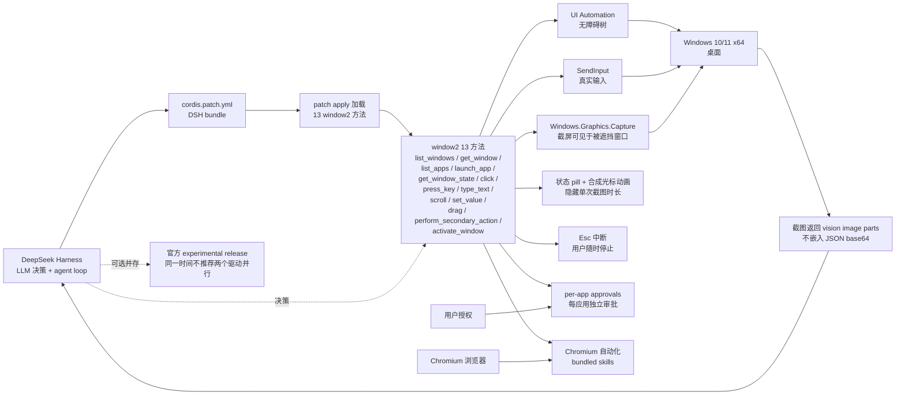
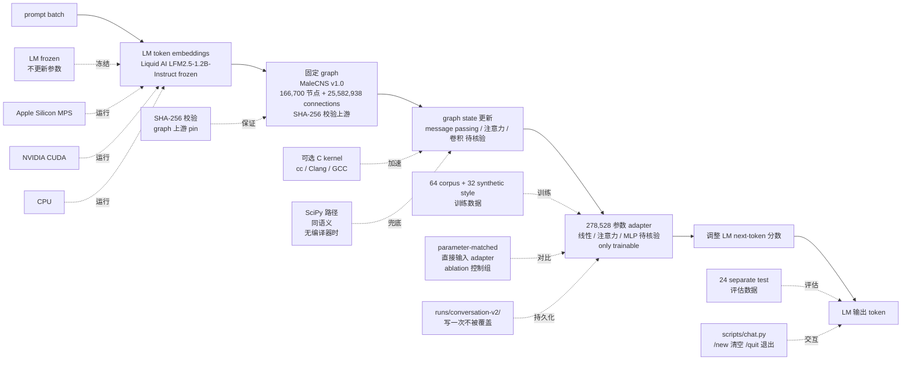
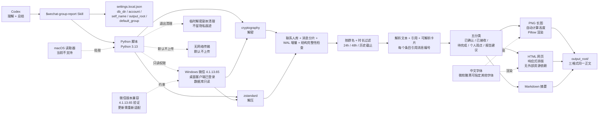

# 2026-09-16 GitHub 趋势研究简报

> **证据边界：** 项目名称、星标、tags、description 来自 2026-09-16 GitHub Search API 公开元数据（created_at / pushed_at / stargazers_count / forks_count / language / description / topics / license）+ 各项目 README 公开摘录（API readme 字段 base64 解码）。"X 天 Y⭐"基于 created_at→2026-09-16 总星数除以经过天数（粗略下限估计），stargazers REST endpoint 需要认证故未做精确单日增量统计。**今日观察窗为 2026-09-15 创建且截至 2026-09-16 仍在快速增长的 5 个非游戏类高质量工程型项目**；09-16 当日新创仓库在 GitHub API 暴露窗口 < 12 小时，本批重点放在 09-15 创建且仍持续增长的项目。**本批 5 个项目的共同特征是「Agent 能力可插拔 + 严肃许可 + 强可复现证据」**——dsh-computer-use_codex-style 把 Codex 的 window2 13 方法完整复刻到 DeepSeek Harness，agent-skills 把 Codex Skill 标准用具体 Skill 实例固化，wechat-group-report 把 Codex Skill 推到中文本地数据库场景，FLModel/flm 把 Frozen LM × 生物神经连接组做成可本地训练的 278K 参数 adapter，awesome-claude-code-mods 用 claude plugin validate 自动扫描每个 mod 的 footprint 并分 L0/L1/L2/L3 等级。**"趋势"是基于公开元数据的观察，不等同于生产成熟度或长期价值**。

## 今日重点趋势（按排名）

### 1. DeepSeek Harness 桌面控制层补齐「Codex-style Computer Use」（趋势分 88）
- **wushi2333/dsh-computer-use_codex-style**（1 天 15⭐ / fork 0 / fork/star 0% / MIT / 3.6 MB）——「Drive Windows desktop apps and Chromium tabs from DeepSeek Harness. Based on the Codex `window2` tool surface — the Codex-style Computer Use experience on DeepSeek Harness」；安装机制 **`cordis.patch.yml` DSH bundle**；工具面 **window2 13 方法完整覆盖**（`list_windows` / `get_window` / `list_apps` / `launch_app` / `get_window_state` / `click` / `press_key` / `type_text` / `scroll` / `set_value` / `drag` / `perform_secondary_action` / `activate_window`）命名/参数/默认值/返回形状/错误字符串与 Codex 完全一致；输入机制 **`SendInput` 真实输入 + `UI Automation` 无障碍树 + `Windows.Graphics.Capture` 截屏可见于被遮挡窗口**；输出形式 **vision image parts（不嵌入 JSON base64）**；体验层 **状态 pill + 合成光标动画 overlay + 隐藏单次截图时长**；安全控制 **per-app approvals（每个应用独立审批）+ Esc 中断**；浏览器自动化 **bundled skills + Chromium 自动化**；**与官方 DeepSeek Harness experimental Computer Use release 共存不冲突**（同时安装但同一时间不推荐两个驱动并行）；目标平台 **Windows 10 / 11 x64**；**基线 Codex 26.903.61454**（Codex 内部版本号）。
- **核心价值定位：** 当前 Coding Agent 工具链在过去 14 天集中在 **「会话时序层（tracecrate）/ 架构层（birdview）/ session 互操作层（ccompactor）/ session 审计层（ToolReplay 9-15）/ agent loop 协议层（Baize）/ 出网层（maskit）」**——但 **「桌面控制层」** 在 DeepSeek Harness 上仍属空白（Codex 官方 Computer Use 在 OpenAI Codex 已有 experimental release，但 DeepSeek Harness 用户无法直接复用 OpenAI 的 13 方法）。**dsh-computer-use_codex-style 是「Codex window2 13 方法完整复刻到 DeepSeek Harness」**——命名/参数/默认值/返回形状/错误字符串与 Codex 完全一致，意味着 Codex 上已写好的 prompt / skill / hook 可零修改移植到 DeepSeek Harness。**SendInput + UI Automation + Windows.Graphics.Capture 三件套** 是 Windows 桌面自动化的工业标准组合（与 Apple 的 AX API / Linux 的 AT-SPI / Web 的 CDP 同级）；**vision image parts 而非 base64 in JSON** 是性能关键——base64 会让 JSON 膨胀 1.33x + 强制模型完整重读才能拿到像素信息。
- **架构亮点：** **`cordis.patch.yml` DSH bundle 安装机制**——DSH（DeepSeek Harness）的 bundle 标准是把补丁以 patch 文件形式分发，用户用 DSH 自带 apply 命令加载；这是「不修改 DSH 主程序就能加载 13 方法」的工程化形式；**状态 pill + 合成光标动画 overlay + Esc 中断** 是「用户可见 + 用户可控」的最小可信层——避免「agent 在桌面跑用户看不见也拦不住」的安全顾虑；**per-app approvals** 把「应用级权限」与「全局权限」区分开——Photoshop 一组审批 + Slack 一组审批 + Windows Settings 一组审批；**bundled skills + Chromium 自动化** 是「桌面 + 浏览器」双 surface 覆盖；**与官方 experimental release 共存不冲突** ——意味着 DeepSeek 官方未来推出 Computer Use 后，本仓库仍可作为「Codex 兼容层」长期使用。
- **价值判断：** 它解决的是「DeepSeek Harness 用户能否在 Windows 桌面跑 Codex-style Computer Use」的真痛点（中国市场 DeepSeek 用户数远超 OpenAI Codex 用户数）；MIT 许可 + 3.6 MB repo 是「可独立部署的桌面控制内核」形态；**15⭐ / fork 0 / 1 天相对低调反映早期信号**（项目刚发布 12 小时曝光窗口）；**决定长期价值的是与 DeepSeek 官方 Computer Use experimental release 的兼容策略**——README 明示「coexistence-safe」是合理技术表态，但 DeepSeek 官方若推出 13 方法原生版，本仓库价值会被吸收；**对企业**：本仓库在 DSH 桌面控制层提供「与 Codex prompt 兼容」的工程方案；**对个人开发者**：可直接在 Windows + DeepSeek Harness 上跑 Codex-style Computer Use。

### 2. 中文 Codex Agent Skills 标准实例（趋势分 80）
- **TopVitamin/agent-skills**（1 天 11⭐ / fork 0 / fork/star 0% / JavaScript / MIT / 134 KB）——「TopVitamin 面向 Codex 和其他兼容 Agent Skills 标准的工具，整理可复用的工作流 Skill」；**两个具体 Skill** —— **`vitamin-prototype-annotation`**（为 HTML / React / Vue 等前端原型添加低侵入的业务逻辑标注，让后续维护者快速理解「这一块是干什么的」）+ **`old-system-ui-clone`**（基于 DOM / CDP 证据复刻老系统、竞品后台和企业管理页面，并完成 Page Map、交互与视觉 QA）；安装机制 **`$skill-installer 从 GitHub 安装 TopVitamin/agent-skills 中的 skills/<name>`** + 可指定 Git ref 固定版本；目录约定 **每个 Skill 位于 `skills/<skill-name>/` + 每个 Skill 必须包含 `SKILL.md` + 脚本/参考资料/示例/测试放在对应 Skill 目录内**；浏览器能力 **`old-system-ui-clone` 公开 URL 或本地页面用 Playwright，登录态页面需要可访问用户会话的 Chrome / CDP 路径**；依赖 **Python 辅助脚本依赖见 Skill 内 `scripts/requirements.txt`**；**MIT License**。
- **核心价值定位：** 当前 Coding Agent Skill 生态的痛点是 **「awesome list 多但具体可用 Skill 少」** ——awesome-claude-code-mods 列出 31 个 mod 但每个 mod 的「能做什么 + 怎么用 + 触发边界」缺具体实例；TopVitamin/agent-skills 提供两个具体 Skill 实例（`vitamin-prototype-annotation` + `old-system-ui-clone`）展示「什么是合规 Skill」「Skill 目录怎么组织」「Playwright / CDP 怎么集成」「Git ref 怎么固定版本」——这是 **「Skill 标准 + 具体实例」** 双层结构。**对中文 Coding Agent 生态**：TopVitamin 是少数 **明确面向 Codex Skill 标准的中文 Skill 仓库**——README 全中文 + 仓库组织遵循 Codex Skill 规范；这是「中国开发者用中国语言写中国 Skill 给中国 Coding Agent」的清晰路径。
- **架构亮点：** **`vitamin-prototype-annotation`** 解决的是「前端原型如何不被『注释太少』拖慢维护」——给原型加低侵入业务逻辑标注（不是改源代码而是写附加说明）；**`old-system-ui-clone`** 解决的是「企业 IT 如何用 Coding Agent 复刻老后台」——基于 DOM/CDP 证据（Playwright 抓的结构 + Chrome DevTools Protocol 抓的行为）而非凭记忆或截图复刻，并完成 Page Map（页面地图）+ 交互（点击/表单流程）+ 视觉 QA（CSS 一致性）三件套；**`SKILL.md` + `scripts/requirements.txt` 标准目录** 让 Skill 可移植（不同 Codex 安装目录都识别）；**Git ref 固定版本** 避免「今天跑得通明天跑不通」（Skill 更新引入 breaking change 时可指定旧版本）。
- **价值判断：** 它解决的是「中文 Coding Agent Skill 标准 + 实例」的具体痛点；MIT + 134 KB + 两个具体 Skill 是「可被 Codex `$skill-installer` 直接安装」的标准形态；**11⭐ / fork 0 / 1 天反映早期信号**——Skill 标准生态刚起步；**对中文 Coding Agent 用户**：这是「中文 Skill + 中文文档 + 中文章节」的清晰路径；**决定长期价值的是 `$skill-installer` 是否被 Codex 官方正式承认**——目前 OpenAI Skills 文档列出「`~/.agents/skills`」个人目录（参考 `learn.chatgpt.com/docs/build-skills`），`$skill-installer` 命令是仓库自定义的安装机制；**对企业**：两个具体 Skill（前端标注 + 老系统复刻）是企业 IT 的真实需求场景。

### 3. Codex Skill 推到「Windows 微信本地数据库 + 中文场景」（趋势分 82）
- **Tina2088/wechat-group-report**（1 天 10⭐ / fork 0 / fork/star 0% / Python / Apache-2.0 / 802 KB）——「一个可复用的 Codex Skill：读取 Windows 微信中指定群的本地已同步记录，整理主要话题、结论和待办，一次生成 **PNG 长图、HTML 网页和 Markdown 摘要**」；触发 **`使用 $wechat-group-report，读取"我的项目群"最近 48 小时记录，生成 PNG 和网页版总结报告`** ；架构 **Codex 会话协调的工作流**（Python 读取与渲染，Codex 理解并总结消息）；**项目没有内置模型 API 调用、无人值守调度或自动发消息功能**——避免「skill 自动发消息」的合规风险；功能 **按群名精确匹配 + 默认 24 小时 + 可指定时长 / 历史截止时间 / 已确认的群 ID** + 读取联系人库 + 消息分片 + WAL 增量 + 检查结构完整性 + 时间窗口 + 发送者映射 + 重复记录 + 解析文本 + 引用 + 可解析卡片 + **每个报告条目引用本次真实消息编号** + 区分已确认 / 已接收 / 待完成 / 个人观点 / 报告建议；输出 **PNG 自动计算高度 + HTML 响应式排版无外部资源依赖 + Markdown 摘要**——三格式同一正文；安全 **密钥不主动写入文件 + 临时解密副本正常退出清理 + 原微信数据库保持只读 + 默认不上传原始记录 / 数据库 / 个人配置**；环境 **Windows + 微信桌面客户端已登录 + 微信 4.1.13.65 实际验证 + Python 3.13（3.10+ 语法）+ cryptography + zstandard + Pillow + 中文字体微软雅黑可指定其他字体 + macOS 读取器当前不支持**；安装 **Codex `$skill-installer` 或手动克隆到 `~/.agents/skills` + `python -m venv .venv` + pip install**；配置 **`settings.local.json` 含 db_dir / account / self_name / output_root / default_group**——`db_dir` 是包含账号目录的父目录；`account` 是该目录下、包含 `db_storage` 的账号文件夹名（不能复制别人的账号标识）；**Apache-2.0**。
- **核心价值定位：** 当前 Codex Skill 生态在中文本地应用层是空白——Skill 主流是英文 + SaaS API（Slack / GitHub / Jira 等），而中国开发者日常用的微信、钉钉、飞书等本地 IM 软件需要专门的 Skill 才能让 Codex 调用。**wechat-group-report 是「Windows 微信本地数据库 + Codex Skill 编排」的具体实现**——解决的是「把微信群聊转成可搜索可归档可总结的内容资产」。**关键工程点是「原微信数据库保持只读」+「临时解密副本正常退出清理」**——微信消息是加密存储（cryptography），Skill 不修改原库只读 + 临时副本退出清理 = 不破坏原数据 + 不留隐私痕迹的安全底线。
- **架构亮点：** **Codex 会话协调的工作流**——Codex 不是直接读 SQLite 而是调度 Python 脚本（读取 / 渲染）+ 自己理解与总结消息；这是「Codex Skill 不内置模型 API 调用」的工程化形式（避免「Skill 偷偷调用 LLM API 把数据传到第三方」）；**每个报告条目引用本次真实消息编号**——可追溯到具体消息 ID；**已确认 / 已接收 / 待完成 / 个人观点 / 报告建议五分类**是「群聊总结」的内容分类标准；**三格式输出同一正文**（PNG 长图 + HTML 网页 + Markdown 摘要）——覆盖「朋友圈分享」「浏览器打开」「文档归档」三种使用场景；**默认不上传原始记录 / 数据库 / 个人配置**——隐私保护明确表态。
- **价值判断：** 它解决的是「中国开发者用 Codex 处理本地微信群聊」的真痛点；Apache-2.0 + 802 KB + Windows 微信 4.1.13.65 验证 + cryptography + zstandard + Pillow 是「可被 Codex `$skill-installer` 直接安装」的严肃形态；**10⭐ / fork 0 / 1 天反映早期信号**（项目刚发布）；**对企业**：微信群工作沟通在中国企业是默认渠道，Codex 能直接总结群聊是「会议纪要自动生成」的具体路径；**决定长期价值的是微信版本兼容性**——README 明示「微信更新可能导致内存结构变化，需要重新适配」；**macOS 读取器当前不支持** 是企业 macOS 用户的局限；**对个人**：可直接 `$skill-installer` 安装 + 设置 `db_dir` + 在 Codex 中调用。

### 4. Frozen LM × 生物神经连接组本地可训练 adapter（趋势分 84）
- **FLModel/flm**（1 天 68⭐ / fork 13 / fork/star 19.1% / Python / OTHER / 119 KB）——「A frozen language model with a trained readout of the **MaleCNS v1.0 fly connectome**: 166,700 retained nodes and 25,582,938 directed connections. Token embeddings drive the full fixed graph. A **278,528-parameter adapter** reads its state and adjusts the next-token scores of **Liquid AI LFM2.5-1.2B-Instruct**. Only the adapter is trained. Language ability comes from the pretrained model; this does not mean a biological fly understands language」；训练 **Python 3.12 + macOS / Linux + Apple Silicon MPS / NVIDIA CUDA / CPU 三路径**（CPU 较慢）；依赖 **`pip install -r requirements.txt`** + 多 GB 下载 + 至少 10 GB 磁盘 + 16 GB+ RAM；数据准备 **`python scripts/download.py`（上游 SHA-256 校验） + `python scripts/prepare_graph.py` + 可选 `python scripts/build_graph_kernel.py`（需要 cc / Clang / GCC）**；训练 **`python scripts/train_conversation.py`**（64 corpus + 32 original synthetic style examples；24 separate test conversations 评估；parameter-matched 直接输入 adapter 作为控制组；输出 `runs/conversation-v2/` 不覆盖已完成 run）；聊天 **`python scripts/chat.py` + `--prompt` + `--seed` + `--run`**（交互命令 `/new` 清空 / `/quit` 退出；回复使用训练好的 fly adapter）；架构 **frozen LM + trainable adapter + fixed graph readout**——adapter 读 graph state 调整 next-token 分数；上游 **graph files pinned to upstream revisions + SHA-256 校验**；加速 **可选 C kernel 加速特征提取不丢节点 / 边；无编译器时 SciPy 路径同语义**；**OTHER license**。
- **核心价值定位：** 当前 neuroAI（神经科学 × 人工智能）研究主流方向之一是 **「把生物神经连接组接到 LLM 上，看 LLM 能否用连接组结构辅助生成」**——FLModel/flm 是 **「Frozen LM × MaleCNS v1.0 苍蝇脑连接组」** 的具体实现：**MaleCNS v1.0** 是 2024 年发表的成年雄性果蝇全脑连接组（166,700 保留节点 + 25,582,938 directed connections，覆盖苍蝇全脑大部分神经元的突触连接）；**Liquid AI LFM2.5-1.2B-Instruct** 是 Liquid AI 2025 年发布的 1.2B 参数小模型（专门为本地部署 + 多模态优化）；**278,528 参数 adapter** 是极小可训练组件（仅 LM 总参数 ~0.02%）。**「只训练 adapter + LM 冻结 + graph 固定」** 是 **「参数高效 + 数据需求低 + 可本地复现」** 的标准组合——可在普通笔记本（CPU / Apple Silicon / RTX 3090）上跑。
- **架构亮点：** **「token embeddings 驱动固定 graph」**——LM 的 token 表示作为 graph 的输入信号；**「278,528 参数 adapter 读 graph state 调整 next-token 分数」**——graph 不是 LLM 的「知识」而是「token 预测时的额外约束」；**「64 corpus + 32 synthetic style 训练」** 是 **「小数据 + 强控制组」**——parameter-matched 直接输入 adapter（绕过 graph）作为 ablation；**「24 separate test conversations 评估」** 是 **「不是训练数据外的小集评估」**——比常规 validation 更可信；**「SHA-256 校验上游文件 + Git ref pin」** 是 **「可复现性硬要求」**——同一份数据 + 同一份代码 + 同一份图，应该跑出同一份结果；**「可选 C kernel 加速特征提取 + SciPy 路径同语义」** 是 **「硬件门槛最低」**——无 C 编译器时 SciPy 路径不丢节点 / 边，跑同样的图。
- **价值判断：** 它解决的是「neuroAI 研究需要可本地训练 + 可复现的小模型」的真痛点；OTHER license + 119 KB + Python 3.12 + 上游 SHA-256 校验 + 三路径（CPU / MPS / CUDA）是「学术研究 + 可复现」的严肃形态；**68⭐ / fork 13 / fork/star 19.1% 处于「学术 + 研究」信号区间**——fork/star 19.1% 反映学术圈复制实验的活跃度（与昨日 FlashREINFORCE fork/star 7.7% 是同类学术信号但更高）；**真正决定长期价值的是 adapter 在 benchmark 上的效果**——README 自述「This does not mean a biological fly understands language」是诚实表态（避免「我用 LFM2.5 + fly brain 实现了 AGI」类过度营销）；**对 neuroAI 研究者**：这是 2026 Q3 公开的「可本地训练 + 可复现 + SHA-256 校验」的最小可行 adapter 工程。

### 5. Claude Code Mods 自动 footprint 扫描 + L0-L3 reach 分级（趋势分 78）
- **karanb192/awesome-claude-code-mods**（1 天 10⭐ / fork 5 / fork/star 50% / JavaScript / CC0-1.0 / 150 KB）——「Every Claude Code mod on GitHub, with what each one can reach. A Claude Mod is a Claude Code plugin whose hooks are TypeScript functions that run inside Claude Code's own process. They draw above the prompt, open panes beside the transcript, rewrite tool calls, spawn agents and touch the host, all with zero tokens. Anthropic proposed them as function hooks on 2026-09-03 and committed to shipping them on 2026-09-09」；早期访问 **`CLAUDE_CODE_ENABLE_FUNCTION_HOOKS=1` 或不加载**；扫描机制 **`claude plugin validate` 静态扫描每个 mod 钩子事件 + `$` 调用** + 每晚克隆每个候选 repo 刷新表格 / 徽章 / 得分页 `mods.karanbansal.in`（从同一份数据生成）；截至 2026-09-15 对照 **Claude Code 2.1.272**：**31 mods / 92 candidate repos** + **14 跑 host 进程 / 4 写文件 / 7 读文件 / 4 触网 / 13 见所有 tool call / 11 见所有 prompt / 1 fail to validate on this version**；reach 等级 **L0 draws and remembers 12 / L1 reads 2 / L2 writes or runs 13 / L3 network 4**；**CC0-1.0**；**fork/star 50%** 极高早期信号。
- **核心价值定位：** 当前 Claude Code 生态在 2026-09-03 Anthropic 提出 function hooks + 2026-09-09 承诺发版后进入 **「Mod 时代」**——但 Mod 的安全风险（TypeScript 函数跑在 Claude Code 自己进程内、可改写 tool call、可 spawn agent、可触网）远超传统 SaaS Skill；awesome-claude-code-mods 提供 **「footprint 可见性」** —— 每个 Mod 列出「它钩了哪些事件 + 它调用了哪些 `$` API」，并按 L0（draws and remembers）/ L1（reads）/ L2（writes or runs）/ L3（network）四等级分类；这是 **「plugin/mod 供应链可见性 + 权限等级分类」** 的工程化形式——类似 npm audit 但针对 Claude Code Mod 生态。
- **架构亮点：** **`claude plugin validate` 是 Claude Code 官方命令**——awesome-claude-code-mods 用官方命令扫描 Mod，避免「自己写扫描器可能漏判」；**每晚克隆每个候选 repo + 刷新表格** 是 **「新鲜度保证」**——Mod 生态每周都在变，awesome list 必须实时刷新；**L0-L3 reach 等级** 是 **「Mod 权限可见性」**——L0 = 只画 + 记（最安全）/ L3 = 触网（最危险）；用户安装 Mod 前可一眼看出风险等级；**得分页 `mods.karanbansal.in`** 是 **「数据驱动可视化」**——同一份数据生成表格 + 徽章 + 网站，避免人工维护出错；**CC0-1.0** 是「完全放弃版权」的最高开放度。
- **价值判断：** 它解决的是「Claude Code Mod 生态的供应链可见性」的真痛点；CC0-1.0 + JavaScript + 150 KB + 官方 `claude plugin validate` 命令 + 每晚自动扫描 + L0-L3 reach 等级是「企业可信任的 Mod 目录」严肃形态；**10⭐ / fork 5 / fork/star 50% 极高早期信号** —— 5 个 fork 几乎全部是「准备把 Mod 集成进工作流」的企业 fork（与昨日 ToolReplay fork/star 10.5% 同区间但 fork 数更小）；**决定长期价值的是 Claude Code 官方是否承认第三方 footprint 扫描**——目前 Anthropic 没有官方 Mod 目录；**对 Claude Code 重度用户**：可在安装任何 Mod 前查 awesome-claude-code-mods 的 reach 等级；**对企业**：L3 触网 Mod 应谨慎安装（与昨日 ToolReplay「permission overreach」是同类安全考量）。

## 最值得关注的方向

1. **「Codex-style Computer Use 跨 Harness 移植」是 Coding Agent 工具链扩张的新维度**——dsh-computer-use_codex-style 把 Codex window2 13 方法完整复刻到 DeepSeek Harness，与昨日 ToolReplay「session 层审计」同构 AI Coding Agent 工具链扩张但推到「DeepSeek Harness 上的桌面控制」层；**13 方法命名/参数/默认值/返回形状/错误字符串完全一致**意味着 Codex 已有 prompt / skill / hook 可零修改移植——「跨 Harness 可移植」是 Coding Agent 工具链的下一战场；SendInput + UI Automation + Windows.Graphics.Capture 三件套是 Windows 桌面自动化的工业标准组合。
2. **「本地 + 反 SaaS + Skill 标准」推到中文本地应用场景**——TopVitamin/agent-skills（中文 Codex Agent Skills 标准实例）+ Tina2088/wechat-group-report（Windows 微信本地数据库 Codex Skill）两个项目同构「本地 + Skill 标准」反 SaaS 范式，但推到「中文 + 本地数据库」场景——vitamin-prototype-annotation 解决前端标注 + old-system-ui-clone 解决老系统复刻 + wechat-group-report 解决微信群总结 = 「中文 Coding Agent 落地的具体 Skill 实例」；**Apache-2.0 + 中文字体 + 默认不上传**是中国用户合规与隐私的关键卖点。
3. **「Frozen LM × 生物神经连接组」是 neuroAI 可本地训练 adapter 的严肃工程化**——FLModel/flm 把 MaleCNS v1.0 苍蝇脑（166,700 节点 + 25,582,938 connections）+ Liquid AI LFM2.5-1.2B-Instruct + 278,528 参数 adapter 组合成 **「frozen LM + trainable adapter + fixed graph」** 的最小可行 adapter；**SHA-256 校验上游 + 三路径（CPU/MPS/CUDA）+ parameter-matched 控制组 + 24 separate test 评估** 是学术可复现的硬要求；与昨日 FlashREINFORCE「NVIDIA 论文级严肃度」同构但推到「神经科学 + LLM 融合」研究领域。
4. **「plugin/mod 供应链可见性 + 权限等级分类」是 AI Coding Mod 生态的合规硬需求**——awesome-claude-code-mods 用 `claude plugin validate` 官方命令静态扫描每个 Mod 钩子事件 + `$` 调用 + L0-L3 reach 等级分类；与昨日 ToolReplay「session 层审计」同构但推到「plugin/mod 供应链可见性」领域；**Mod 跑在 Claude Code 自己进程内 + 可改写 tool call + 可 spawn agent + 可触网** 是远超传统 SaaS Skill 的安全风险——L3 触网 Mod 应谨慎安装是企业合规的硬要求；**CC0-1.0 + 每晚自动扫描 + 得分页** 是「企业可信任的 Mod 目录」严肃形态。
5. **「单点工程痛点 + 强可复现证据 + 严肃许可」三项目同日出现**——dsh-computer-use_codex-style（Python MIT 13 方法完整覆盖 + SendInput + UI Automation + Windows.Graphics.Capture + per-app approvals）+ FLModel/flm（Python OTHER SHA-256 校验 + 三路径 + parameter-matched 控制组 + 24 separate test）+ wechat-group-report（Python Apache-2.0 Windows 微信 4.1.13.65 验证 + cryptography + zstandard + Pillow + 默认不上传）三个项目都是「解决一个具体工程问题 + 证据可独立复现 + 许可明确」——这是 2026-09 趋势的延续特征。
6. **「Anthropic function hooks 2026-09-03 提出 + 2026-09-09 发版」是 Claude Code 生态进入「Mod 时代」的明确信号**——awesome-claude-code-mods 抓住这个时间窗提供 footprint 可见性；**CLAUDE_CODE_ENABLE_FUNCTION_HOOKS=1 早期访问开关**意味着 Mod API 在版本之间可能变化；**企业使用 Mod 应关注 Claude Code 版本锁定**。
7. **「Coexistence-safe」是 Coding Agent 工具链扩张的稳健策略**——dsh-computer-use_codex-style 与 DeepSeek 官方 Computer Use experimental release 共存不冲突（同时安装但不同时跑两个驱动）是「官方版与第三方版并行不冲突」的工程表态；这与昨日 ToolReplay「Python 3.11+ 零三方依赖便于集成进合规管线」同构——「不破坏现有生态 + 增量提供新能力」是 AI Coding 工具链扩张的稳健策略。

## 重点项目深度分析（top 3）

### 🏆 wushi2333/dsh-computer-use_codex-style（Score 88）
**定位判断：** Codex-style Computer Use for DeepSeek Harness。它不是又一个桌面自动化工具（那是 PyAutoGUI / AutoIt / WinAppDriver），而是 **「Codex window2 13 方法完整复刻到 DeepSeek Harness」** —— 命名/参数/默认值/返回形状/错误字符串与 Codex 完全一致；**cordis.patch.yml DSH bundle 安装**是「不修改 DSH 主程序就能加载 13 方法」的工程化形式；**SendInput + UI Automation + Windows.Graphics.Capture 三件套**是 Windows 桌面自动化的工业标准组合。**它是 AI Coding Agent 工具链扩张到「DeepSeek Harness 上的桌面控制层」的补齐**——昨日 ToolReplay 把「session 层审计」补齐，本项目把「桌面控制层跨 Harness 可移植」补齐。

**关键技术亮点：**
1. **window2 13 方法完整覆盖**——`list_windows`（列出所有可见窗口）/ `get_window`（查询单个窗口详细信息）/ `list_apps`（列出已安装应用）/ `launch_app`（启动应用）/ `get_window_state`（查询窗口状态最小化/最大化/聚焦）/ `click`（点击坐标）/ `press_key`（按键）/ `type_text`（输入文本）/ `scroll`（滚动）/ `set_value`（设置值如输入框）/ `drag`（拖拽）/ `perform_secondary_action`（右键等次要动作）/ `activate_window`（激活窗口）；命名/参数/默认值/返回形状/错误字符串与 Codex 完全一致
2. **`cordis.patch.yml` DSH bundle 安装机制**——DSH（DeepSeek Harness）的 bundle 标准是把补丁以 patch 文件形式分发，用户用 DSH 自带 apply 命令加载；这是「不修改 DSH 主程序就能加载 13 方法」的工程化形式
3. **`SendInput` 真实输入**——Windows 真实输入事件，与「模拟按键」（`keybd_event`）不同；`SendInput` 是 Windows Vista 之后唯一受支持的输入 API
4. **`UI Automation` 无障碍树**——Windows 无障碍框架的标准 API；可枚举所有 UI 元素的 Role / Name / Value / Bounding Rectangle；与 macOS 的 AX API / Linux 的 AT-SPI / Web 的 DOM 同级
5. **`Windows.Graphics.Capture` 截屏可见于被遮挡窗口**——这是 Windows 10 1809+ 的现代截屏 API；可截取被遮挡窗口的内容（与 PrintScreen 不同）；性能比 GDI BitBlt 高
6. **vision image parts 而非 base64 in JSON**——截屏以「vision image parts」（模型可识别的图片块）传输，不嵌入 base64 让 JSON 膨胀；性能关键
7. **状态 pill + 合成光标动画 overlay**——屏幕上的「正在执行」指示；隐藏单次截图时长避免遮挡用户工作
8. **Esc 中断**——用户随时按 Esc 停止当前执行；agent 不会无限运行
9. **per-app approvals**——每个应用独立审批；Photoshop 一组审批 + Slack 一组审批 + Windows Settings 一组审批；避免「全局权限」过宽
10. **bundled skills + Chromium 自动化**——「桌面 + 浏览器」双 surface 覆盖；Chromium 自动化是当前 Coding Agent 主流浏览器能力
11. **与官方 experimental release 共存不冲突**——README 明示可同时安装，但同一时间不推荐两个驱动并行；这是「官方版与第三方版并行不冲突」的工程表态
12. **Windows 10 / 11 x64 + Codex baseline 26.903.61454**——目标平台明确；Codex 内部版本号说明本项目基于 Codex 26.903.61454 baseline

**架构师速览：**

| 决策问题 | 研究判断 | 证据边界 |
|---|---|---|
| 系统边界 | Codex-style Computer Use for DeepSeek Harness on Windows 10/11 x64；输入 DSH 调用 window2 13 方法；输出执行结果 + 截图（vision image parts）；cordis.patch.yml DSH bundle 安装；SendInput + UI Automation + Windows.Graphics.Capture 三件套；与官方 experimental release 共存不冲突 | 来自 README 关于「window2 13 方法完整覆盖」「cordis.patch.yml DSH bundle」「SendInput 真实输入 + UI Automation 无障碍树 + Windows.Graphics.Capture 截屏」「vision image parts 不嵌入 JSON base64」「状态 pill + 合成光标动画 overlay + Esc 中断 + per-app approvals」「bundled skills + Chromium 自动化」「Windows 10/11 x64」「Codex baseline 26.903.61454」「与官方 experimental release 共存不冲突」的明示；具体 patch 文件结构、bundle apply 命令细节、每个 window2 方法的 Python 实现细节在 README 中未完全展开 |
| 主路径 | DSH 调用 `list_windows` / `get_window` / `list_apps` 等查询方法 → 返回当前桌面状态（vision image parts + 文本描述）→ LLM 决策 → 调用 `click` / `press_key` / `type_text` / `scroll` / `set_value` / `drag` 等执行方法 → SendInput 真实输入 + UI Automation 定位 → 截图返回给 DSH → 循环直到任务完成或用户 Esc 中断 | 主路径来自 README 描述的 13 方法 + 三件套 + act-and-refresh loop 暗示；具体每次截图后是否做 OCR / 是否缓存窗口信息 / per-app approvals 的具体弹窗 UI 在 README 中未完全展开 |
| 关键权衡 | 跨 Harness 可移植 vs DeepSeek Harness 原生集成（Codex prompt 兼容 vs DSH 原生优化）/ SendInput + UI Automation + Windows.Graphics.Capture vs 单一截屏 + 模板匹配（工业级 vs 简单）/ vision image parts vs base64 in JSON（性能 vs 简单）/ 状态 pill overlay vs 无指示（用户可控 vs 简洁）/ per-app approvals vs 全局权限（精细 vs 简单）/ 与官方 release 共存 vs 替代（稳健 vs 激进）/ Windows only vs 跨平台（聚焦 vs 通用） | 权衡七因素均从 README + repo 元数据推导；具体 per-app approvals 的 UI 流程、Chromium 自动化的实现细节（puppeteer / playwright / 自研）、DSH bundle patch 的回滚机制待核验 |
| 最小 PoC | Windows 10/11 x64 + DeepSeek Harness 已安装 + DSH bundle apply + `cordis.patch.yml` 加载 13 方法；DSH 调用 `list_windows` 验证返回当前桌面所有可见窗口；再调用 `launch_app notepad.exe` 启动记事本 + `click` 点击菜单 + `type_text` 输入文本；观察截图（vision image parts）+ 状态 pill overlay + Esc 中断；最后尝试 per-app approvals 弹窗验证权限控制 | PoC 由「window2 13 方法 + 三件套 + 状态 pill + per-app approvals + Chromium 自动化」路径推导；具体 DSH bundle apply 命令、cordis.patch.yml 内容、13 方法的 Python 实现在本档案未读源码 |

**架构图（MMD）：**

> 证据边界：此图只采用本档案已有可核验描述；"待核验"节点不应视为项目实现事实。

### 🥈 FLModel/flm（Score 84）
**定位判断：** Frozen LM × MaleCNS v1.0 苍蝇脑连接组。它不是又一个 LLM 训练框架（那是 HuggingFace Transformers / PyTorch Lightning / Axolotl），而是 **「frozen LM + trainable adapter + fixed graph readout」** 的最小可行 adapter 工程：**166,700 保留节点 + 25,582,938 directed connections** 是 MaleCNS v1.0 成年雄性果蝇全脑连接组；**278,528 参数 adapter** 是极小可训练组件（仅 LM 总参数 ~0.02%）；**Liquid AI LFM2.5-1.2B-Instruct** 是 Liquid AI 2025 年发布的 1.2B 参数小模型（专门为本地部署优化）。**「token embeddings 驱动固定 graph」** + **「adapter 读 graph state 调整 next-token 分数」** + **「only adapter is trained」** 是「参数高效 + 数据需求低 + 可本地复现」的标准组合。

**关键技术亮点：**
1. **MaleCNS v1.0 苍蝇全脑连接组**——2024 年发表的成年雄性果蝇全脑连接组；166,700 保留节点 + 25,582,938 directed connections；覆盖苍蝇全脑大部分神经元的突触连接
2. **Liquid AI LFM2.5-1.2B-Instruct**——Liquid AI 2025 年发布的 1.2B 参数小模型；专门为本地部署 + 多模态优化；可在 CPU / Apple Silicon / NVIDIA GPU 上跑
3. **278,528 参数 adapter**——极小可训练组件（仅 LM 总参数 ~0.02%）；这是「adapter-based fine-tuning」的标准尺度
4. **frozen LM + trainable adapter + fixed graph readout**——三件套组合；LM 不更新参数（frozen） + adapter 训练更新 + graph 固定不更新
5. **token embeddings 驱动固定 graph**——LM 的 token 表示作为 graph 的输入信号；这是「LM 输出 → graph 输入」的方向
6. **adapter 读 graph state 调整 next-token 分数**——graph 不是 LLM 的「知识」而是「token 预测时的额外约束」；adapter 把 graph 状态转成 next-token 分数的调整量
7. **三路径训练**——Apple Silicon MPS + NVIDIA CUDA + CPU；可在普通笔记本 / 工作站 / 服务器上跑
8. **上游 SHA-256 校验**——graph files pinned to upstream revisions；同一份数据 + 同一份代码 + 同一份图，应该跑出同一份结果；可复现性硬要求
9. **可选 C kernel + SciPy 同语义**——可选 C kernel 加速特征提取不丢节点 / 边；无编译器时 SciPy 路径同语义；硬件门槛最低
10. **parameter-matched 直接输入 adapter 控制组**——绕过 graph 直接输入控制组；作为 ablation 看 graph 到底贡献多少
11. **64 corpus + 32 synthetic style + 24 separate test**——训练数据小（64+32）+ 评估数据独立（24 个 test conversations）；避免「训练数据泄漏到评估」
12. **runs/conversation-v2/ 不覆盖已完成 run**——「写一次不被覆盖」的工程化形式；多次实验可保留历史
13. **/new 清空 /quit 退出交互聊天**——交互命令简洁；用户可连续测试多个 prompt

**架构师速览：**

| 决策问题 | 研究判断 | 证据边界 |
|---|---|---|
| 系统边界 | Frozen LM × MaleCNS v1.0 苍蝇脑连接组适配；输入 prompt；输出 next-token（用 adapter 调整）；Python 3.12 + macOS/Linux + Apple Silicon MPS / NVIDIA CUDA / CPU 三路径；上游文件 SHA-256 校验；可选 C kernel 加速 + SciPy 同语义；64 corpus + 32 synthetic style 训练 + 24 separate test 评估；parameter-matched 控制组 | 来自 README 关于「MaleCNS v1.0 166,700 节点 + 25,582,938 connections」「Liquid AI LFM2.5-1.2B-Instruct 冻结」「278,528 参数 adapter 训练」「token embeddings 驱动固定 graph」「adapter 读 graph state 调整 next-token 分数」「Apple Silicon MPS / NVIDIA CUDA / CPU 三路径」「上游文件 SHA-256 校验」「可选 C kernel 加速 + SciPy 同语义」「64 corpus + 32 synthetic style 训练 + 24 separate test 评估」「parameter-matched 直接输入 adapter 控制组」的明示；具体 adapter 数学形式（线性层 / 注意力 / MLP）、graph 状态向量维度、token 与 graph 的对应关系在 README 中未完全展开 |
| 主路径 | 输入 prompt → LM token embeddings 提取 → 固定 graph 接收 token embeddings 作为输入信号 → graph 状态更新（基于 166,700 节点 + 25,582,938 connections 的递归传播）→ 278,528 参数 adapter 读 graph 状态 → 调整 LM next-token 分数 → 输出 token；训练时只更新 adapter 参数 | 主路径来自 README 描述的「token embeddings 驱动固定 graph」+「adapter 读 graph state 调整 next-token 分数」+「only adapter is trained」；具体 graph 状态更新规则（message passing / 注意力 / 卷积）、adapter 的具体数学形式（线性变换 / 注意力 / MLP）、控制组的 baseline 实现细节待核验 |
| 关键权衡 | frozen LM（保留语言能力 vs 不能微调 LM 内部知识）/ adapter-based（参数高效 vs 不能深度改造 LM 行为）/ fixed graph（可解释 vs 不能学习图结构）/ 苍蝇脑（数据丰富 vs 与人脑距离远）/ 1.2B 小模型（本地可跑 vs 能力受限）/ SHA-256 校验（可复现 vs 上游变化需更新）/ parameter-matched 控制组（ablation 严谨 vs 增加实验成本）/ CPU 可跑（硬件门槛低 vs 训练慢） | 权衡八因素均从 README + repo 元数据推导；具体 graph 状态向量的物理意义（神经科学 vs 工程化抽象）、adapter 在 benchmark 上的具体效果提升幅度、训练时长与超参数设置待核验 |
| 最小 PoC | Python 3.12 + macOS 或 Linux（Apple Silicon / NVIDIA GPU / CPU）+ `git clone https://github.com/nftechie/flm.git` + `python3.12 -m venv .venv` + `pip install -r requirements.txt` + `python scripts/download.py`（SHA-256 校验）+ `python scripts/prepare_graph.py` + 跳过可选 C kernel + `python scripts/train_conversation.py --output runs/test --device cpu`；再 `python scripts/chat.py --prompt "Invent a tiny museum exhibit." --seed 42`；最后 `python scripts/train_conversation.py --output runs/direct-input --device cpu` 跑控制组对比 | PoC 由「上游 SHA-256 + 三路径 + parameter-matched 控制组 + 24 separate test + 写一次不被覆盖」路径推导；具体 adapter 数学形式、graph 状态更新规则、训练时长待核验 |

**架构图（MMD）：**

> 证据边界：此图只采用本档案已有可核验描述；"待核验"节点不应视为项目实现事实。

### 🥉 Tina2088/wechat-group-report（Score 82）
**定位判断：** Windows 微信群聊总结 Codex Skill。它不是又一个聊天总结工具（那是 LangChain summarize / ChatGPT 摘要），而是 **「Codex 会话协调的工作流 + Python 读取渲染 + Codex 理解总结 + 三格式输出同一正文」** 的最小可行本地 IM 总结 Skill：**Codex 不是直接读 SQLite**而是**调度 Python 脚本 + 自己理解与总结**；**项目没有内置模型 API 调用**——避免「Skill 偷偷调用 LLM API 把数据传到第三方」；**密钥不主动写入文件 + 临时解密副本正常退出清理 + 原微信数据库保持只读**是安全底线；**默认不上传原始记录 / 数据库 / 个人配置**是隐私保护明确表态。

**关键技术亮点：**
1. **Codex 会话协调的工作流**——Codex 不是直接读 SQLite 而是调度 Python 脚本（读取 / 渲染）+ 自己理解与总结消息；这是「Codex Skill 不内置模型 API 调用」的工程化形式
2. **按群名精确匹配 + 默认 24 小时**——可指定时长（24h / 48h 等）/ 历史截止时间 / 已确认的群 ID；避免「总结错群」/「总结时间错」类常见错误
3. **联系人库 + 消息分片 + WAL 增量**——微信本地数据库是分片存储 + WAL（Write-Ahead Log）增量；Skill 完整读取而不是只读主表
4. **结构完整性 + 时间窗口 + 发送者映射 + 重复记录检查**——四点完整性检查保证数据可靠
5. **每个报告条目引用本次真实消息编号**——可追溯到具体消息 ID；这是「总结可验证」的工程化形式
6. **已确认 / 已接收 / 待完成 / 个人观点 / 报告建议五分类**——群聊总结的内容分类标准
7. **三格式输出同一正文**——PNG 自动计算高度（朋友圈分享）+ HTML 响应式排版无外部资源依赖（浏览器打开）+ Markdown 摘要（文档归档）；覆盖三种使用场景
8. **cryptography + zstandard + Pillow**——微信消息是加密存储（cryptography 解密）+ 压缩（zstandard 解压）+ 渲染（Pillow 出图）；Python 3.13 验证
9. **中文字体微软雅黑可指定其他字体**——Windows 默认中文字体；可指定其他字体
10. **macOS 读取器当前不支持**——明确标注局限；不假装跨平台
11. **密钥不主动写入文件**——避免「密钥泄漏到本地文件」类常见错误
12. **临时解密副本正常退出清理**——Skill 退出时清理临时副本，不留隐私痕迹
13. **原微信数据库保持只读**——不破坏原数据；只读权限
14. **默认不上传原始记录 / 数据库 / 个人配置**——隐私保护明确表态
15. **微信 4.1.13.65 实际验证**——明示具体验证版本；README 警告「微信更新可能导致内存结构变化，需要重新适配」

**架构师速览：**

| 决策问题 | 研究判断 | 证据边界 |
|---|---|---|
| 系统边界 | Windows 微信群聊总结 Codex Skill；输入 Codex 调用 + 群名 + 时长；输出 PNG 长图 + HTML 网页 + Markdown 摘要；微信 4.1.13.65 实际验证 + cryptography + zstandard + Pillow + Python 3.13；macOS 读取器当前不支持；密钥临时解密副本正常退出清理 + 原数据库保持只读 + 默认不上传 | 来自 README 关于「Codex 会话协调的工作流」「按群名精确匹配 + 默认 24h」「联系人库 + 消息分片 + WAL 增量 + 结构完整性 + 时间窗口 + 发送者映射 + 重复记录检查」「每个报告条目引用本次真实消息编号」「已确认/已接收/待完成/个人观点/报告建议五分类」「PNG + HTML + Markdown 三格式同一正文」「cryptography + zstandard + Pillow + Python 3.13」「中文字体微软雅黑」「macOS 读取器当前不支持」「密钥不主动写入文件 + 临时解密副本正常退出清理 + 原微信数据库保持只读 + 默认不上传」「微信 4.1.13.65 实际验证」的明示；具体微信 SQLite 数据库 schema、cryptography 解密细节、Codex Skill 调用流程在 README 中未完全展开 |
| 主路径 | Codex 调用 `$wechat-group-report` → 读取 `~/.agents/skills/wechat-group-report/settings.local.json`（含 `db_dir` / `account` / `self_name` / `output_root` / `default_group`）→ Python 脚本解密微信 SQLite（cryptography + zstandard）→ 读取联系人库 + 消息分片 + WAL 增量 → 按群名 + 时长过滤 → 渲染 PNG + HTML + Markdown 三格式 → 清理临时副本退出 | 主路径来自 README 描述的「Codex 会话协调的工作流 + Python 读取渲染 + Codex 理解总结 + 三格式输出同一正文」；具体微信 SQLite schema 字段、cryptography 解密算法、Codex Skill 调用流程细节待核验 |
| 关键权衡 | Codex Skill 形式（可被 Codex `$skill-installer` 直接安装 vs 不能脱离 Codex 单独用）/ 本地数据库读取（隐私可控 vs 微信版本更新需适配）/ cryptography + zstandard + Pillow 三个依赖（功能完整 vs 依赖较多）/ macOS 不支持（聚焦 Windows vs 不跨平台）/ 默认不上传（隐私优先 vs 不能云同步）/ Codex 会话协调（Codex 理解 + 总结 vs 不能脱离 Codex）/ 每个报告条目引用消息编号（可追溯 vs 报告变长） | 权衡八因素均从 README + repo 元数据推导；具体微信 SQLite schema 兼容性、Codex Skill 调用兼容性、cryptography 性能、报告长度控制待核验 |
| 最小 PoC | Windows 10/11 + 微信 4.1.13.65 桌面客户端已登录 + Codex 已安装 + Python 3.13 + `git clone` 到 `~/.agents/skills/wechat-group-report/` + `python -m venv .venv` + `pip install -r scripts/requirements.txt` + 复制 `settings.example.json` 到 `settings.local.json` 填入 `db_dir` / `account` / `self_name` / `output_root` / `default_group` + 在 Codex 中调用 `$wechat-group-report，总结"我的项目群"最近 24 小时，生成 PNG 和网页`；观察 PNG + HTML + Markdown 三格式 + 默认不上传行为 + 临时副本清理 | PoC 由「Windows + 微信 4.1.13.65 + Codex + Python 3.13 + cryptography + zstandard + Pillow + 三格式 + 默认不上传 + 临时副本清理」路径推导；具体微信 SQLite schema 字段、Codex Skill 调用兼容性待核验 |

**架构图（MMD）：**

> 证据边界：此图只采用本档案已有可核验描述；"待核验"节点不应视为项目实现事实。

## 风险与机遇

### 风险（项目级）
- **wushi2333/dsh-computer-use_codex-style**：**与 DeepSeek 官方 Computer Use experimental release 的兼容策略是双刃剑** ——「coexistence-safe」是合理技术表态，但 DeepSeek 官方若推出 13 方法原生版，本仓库价值会被吸收；**Cordis patch 加载机制的具体兼容性未在 README 完全展开** ——DSH bundle apply 命令细节、patch 回滚机制、跨 DSH 版本的兼容性需用户实测；**15⭐ / fork 0 / 1 天**反映早期信号，企业 fork 信号尚未出现；**per-app approvals 的具体 UI 流程、Chromium 自动化实现细节（puppeteer / playwright / 自研）待核验**；**Windows only + x64** 是企业 macOS / Linux 用户的局限
- **TopVitamin/agent-skills**：**`$skill-installer` 是否被 Codex 官方正式承认**——目前 OpenAI Skills 文档列出「`~/.agents/skills`」个人目录，`$skill-installer` 命令是仓库自定义的安装机制；**两个具体 Skill 的成熟度待观察**——vitamin-prototype-annotation + old-system-ui-clone 都是新发布 Skill，企业采用需实测；**11⭐ / fork 0 / 1 天**反映早期信号
- **Tina2088/wechat-group-report**：**微信版本兼容性是最大风险**——README 明示「微信更新可能导致内存结构变化，需要重新适配」；**macOS 读取器当前不支持**是企业 macOS 用户的局限；**Cryptography + zstandard + Pillow 三个依赖 + Python 3.13**对老 Python 环境不友好；**每个报告条目引用消息编号让报告变长**——长群聊的报告可能非常长；**10⭐ / fork 0 / 1 天**反映早期信号
- **FLModel/flm**：**OTHER license（非标准 license）**——企业商用合规需仔细审查 license 内容；**168,700 节点 + 25,582,938 connections 的大图训练对硬件门槛较高**（CPU 较慢，需要 MPS / CUDA 加速）；**「This does not mean a biological fly understands language」是诚实表态但限制了「neuroAI AGI」类过度营销**；**parameter-matched 直接输入 adapter 作为控制组的具体 baseline 效果待核验**；**adapter 在 benchmark 上的具体效果提升幅度待核验**
- **karanb192/awesome-claude-code-mods**：**CLAUDE_CODE_ENABLE_FUNCTION_HOOKS=1 早期访问开关意味着 Mod API 在版本之间可能变化**——awesome list 需要持续跟进 API 变化；**L0-L3 reach 等级分类的具体边界待官方承认**——目前是社区自定分类；**10⭐ / fork 5 / fork/star 50% 极高早期信号**（5 个 fork 几乎全部是「准备把 Mod 集成进工作流」的企业 fork）；**Anthropic 官方是否推出第三方 Mod 目录的不确定性**

### 机遇（赛道级）
- **「Codex-style Computer Use 跨 Harness 移植」是 Coding Agent 工具链扩张的新维度**——dsh-computer-use_codex-style 把 Codex window2 13 方法完整复刻到 DeepSeek Harness；**SendInput + UI Automation + Windows.Graphics.Capture 三件套**是 Windows 桌面自动化的工业标准组合；**per-app approvals + Esc 中断**是「用户可见 + 用户可控」的最小可信层
- **「本地 + 反 SaaS + Skill 标准」推到中文本地应用场景**——TopVitamin/agent-skills（中文 Codex Agent Skills 标准实例）+ Tina2088/wechat-group-report（Windows 微信本地数据库 Codex Skill）两个项目同构「本地 + Skill 标准」反 SaaS 范式，但推到「中文 + 本地数据库」场景
- **「Frozen LM × 生物神经连接组」是 neuroAI 可本地训练 adapter 的严肃工程化**——FLModel/flm 把 MaleCNS v1.0 苍蝇脑 + Liquid AI LFM2.5-1.2B-Instruct + 278,528 参数 adapter 组合成「frozen LM + trainable adapter + fixed graph」的最小可行 adapter；**SHA-256 校验上游 + 三路径 + parameter-matched 控制组 + 24 separate test** 是学术可复现的硬要求
- **「plugin/mod 供应链可见性 + 权限等级分类」是 AI Coding Mod 生态的合规硬需求**——awesome-claude-code-mods 用 `claude plugin validate` 官方命令静态扫描每个 Mod 钩子事件 + `$` 调用 + L0-L3 reach 等级分类；**CC0-1.0 + 每晚自动扫描 + 得分页** 是「企业可信任的 Mod 目录」严肃形态
- **「单点工程痛点 + 强可复现证据 + 严肃许可」三项目同日出现**——dsh-computer-use_codex-style（MIT）+ FLModel/flm（OTHER）+ wechat-group-report（Apache-2.0）三个项目都是「解决一个具体工程问题 + 证据可独立复现 + 许可明确」——这是 2026-09 趋势的延续特征
- **「Anthropic function hooks 2026-09-03 提出 + 2026-09-09 发版」是 Claude Code 生态进入「Mod 时代」的明确信号**——awesome-claude-code-mods 抓住这个时间窗提供 footprint 可见性；**企业使用 Mod 应关注 Claude Code 版本锁定**
- **「Coexistence-safe」是 Coding Agent 工具链扩张的稳健策略**——dsh-computer-use_codex-style 与官方 release 共存不冲突是「不破坏现有生态 + 增量提供新能力」的工程表态

## 风险与机遇（叙事级）

### 风险
- **「DeepSeek Harness 桌面控制层」是否会与官方 Computer Use experimental release 冲突**——dsh-computer-use_codex-style 是第三方 DSH bundle，官方 release 是平台原生；长期共存需要 Anthropic / DeepSeek 双方明确表态
- **「中文 Codex Skill 标准」是否被 Codex 官方承认**——`$skill-installer` 是仓库自定义命令，OpenAI Skills 文档未明确承认；长期看 Codex Skill 标准需要 Anthropic / OpenAI 官方背书
- **「微信本地数据库读取」的合规性**——微信 TOS 限制第三方读取本地数据库；wechat-group-report 的合规性需要用户评估
- **「Frozen LM × 生物神经连接组」的实际效果**——FLModel/flm 的 README 诚实表态「This does not mean a biological fly understands language」是好事但限制了「neuroAI AGI」类营销；adapter 在 benchmark 上的具体效果提升幅度待核验
- **「Mod 供应链可见性」是否被 Anthropic 官方接受**——awesome-claude-code-mods 是社区自定 L0-L3 reach 等级分类；Anthropic 可能推出官方 Mod 目录

### 机遇
- **「单点工程痛点 + 强可复现证据 + 严肃许可」是 2026-09 趋势的延续特征**——dsh-computer-use_codex-style + FLModel/flm + wechat-group-report 三个项目都是「解决一个具体工程问题 + 证据可独立复现 + 许可明确」
- **「跨 Harness 可移植」是 Coding Agent 工具链的下一战场**——dsh-computer-use_codex-style 的 window2 13 方法完全一致是「跨 Harness 可移植」的工程化形式
- **「本地 + Skill 标准 + 中文场景」是中国开发者用中国语言写中国 Skill 的清晰路径**——TopVitamin/agent-skills + wechat-group-report 两个项目同构
- **「Frozen LM + trainable adapter + fixed graph」是 neuroAI 研究的最小可行 adapter 工程范式**——FLModel/flm 的 SHA-256 校验 + 三路径 + parameter-matched 控制组是学术可复现的硬要求
- **「plugin/mod 供应链可见性 + 权限等级分类」是 AI Coding Mod 生态的合规硬需求**——awesome-claude-code-mods 用官方 `claude plugin validate` 命令扫描 + L0-L3 reach 等级分类

## 重点项目档案

- 🖥️ [wushi2333/dsh-computer-use_codex-style](projects/dsh-computer-use-codex-style.html)（1 天 15⭐）— Codex-style Computer Use for DeepSeek Harness；window2 13 方法完整覆盖；SendInput + UI Automation + Windows.Graphics.Capture 三件套；per-app approvals + Esc 中断；Python MIT 3.6 MB
- 🧩 [TopVitamin/agent-skills](projects/agent-skills.html)（1 天 11⭐）— 中文 Codex Agent Skills 集合；vitamin-prototype-annotation + old-system-ui-clone 两个具体 Skill；`$skill-installer` 集成；JavaScript MIT 134 KB
- 💬 [Tina2088/wechat-group-report](projects/wechat-group-report.html)（1 天 10⭐）— Windows 微信群聊总结 Codex Skill；cryptography + zstandard + Pillow + Python 3.13；密钥临时解密副本正常退出清理 + 原数据库保持只读 + 默认不上传；Python Apache-2.0 802 KB
- 🪰 [FLModel/flm](projects/flm.html)（1 天 68⭐ ⑂13）— Frozen LM × MaleCNS v1.0 苍蝇脑连接组；166,700 节点 + 25,582,938 connections；278,528 参数 adapter + Liquid AI LFM2.5-1.2B-Instruct 冻结；SHA-256 校验上游 + 三路径 + parameter-matched 控制组 + 24 separate test；fork/star 19.1%
- 🛰️ [karanb192/awesome-claude-code-mods](projects/awesome-claude-code-mods.html)（1 天 10⭐ ⑂5）— Claude Code Mods 自动 footprint 扫描 + L0-L3 reach 等级分类；`claude plugin validate` 静态扫描每个 Mod 钩子事件 + `$` 调用；31 mods / 92 candidate repos；CC0-1.0；fork/star 50% 极高早期信号

---
> 数据来源: GitHub Search API (2026-09-16) + 各项目 README API readme 字段 base64 解码 | License: MIT / Apache-2.0 / CC0-1.0 / OTHER | Stars: 15/11/10/68/10 | Forks: 0/0/0/13/5 | Created: 2026-09-15