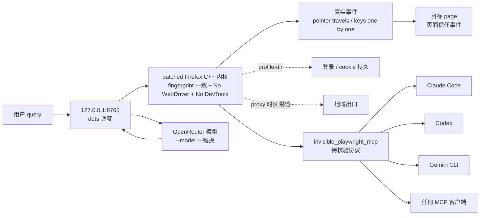
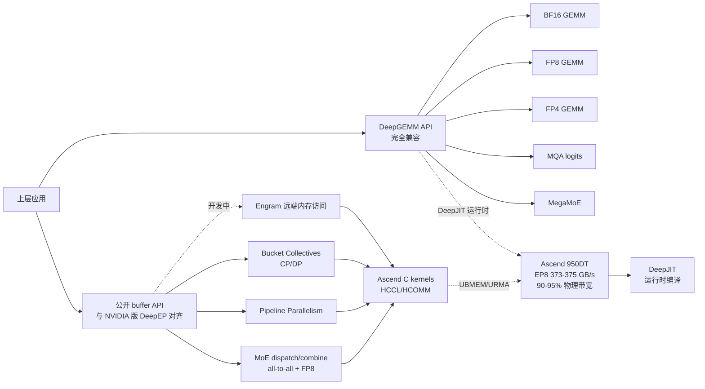
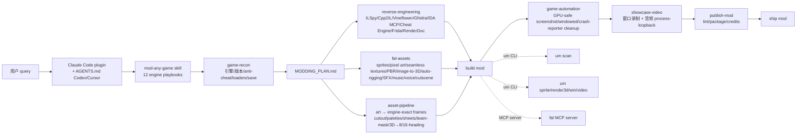

# 2026-10-01 GitHub 趋势研究简报

> **证据边界：** 项目名称、星标、tags、description、license、size、forks 来自 2026-10-01 GitHub Search API 公开元数据（created_at / pushed_at / stargazers_count / forks_count / language / description / topics / license / size）+ 各项目 README 公开摘录（API readme 字段 base64 解码）；"X 天 Y⭐"基于 created_at→2026-10-01 总星数除以经过天数（粗略下限估计），stargazers REST endpoint 需要认证故未做精确单日增量统计。**今日观察窗为 2026-09-28 ~ 2026-09-30 创建且截至 2026-10-01 仍在快速增长的新发现项目 + 持续 6-7 日的延续跟踪项目**；10-01 当日新创仓库在 GitHub API 暴露窗口 < 12 小时，本批重点放在 09-28 ~ 09-30 创建且仍持续增长的项目。**今日最大事件是 `feder-cr/dots` 2 天 1931⭐ / fork 320 / fork/star 16.6% — 把 AI agent 的「浏览器」从「JS 伪装 fingerprint + WebDriver 标志 + DevTools 协议 + automation globals」推到「patched Firefox C++ 内核（fingerprint 决定在内核里，page 看不到）+ One identity per seed（screen / fonts / GPU / timezone / language 互相一致）+ No WebDriver / DevTools / automation globals in the page + A person's hands（pointer travels to what it clicks + keys pressed one at a time + 每一个事件都是 trusted event）+ `--profile-dir` 持久登录 + `--proxy` 时区跟随出口 + 任何模型 on OpenRouter + `--model` 一键换 + uvx 一行启动 + 127.0.0.1:8765 左对话右浏览器 live + `invisible_playwright_mcp` 给 Claude Code / Codex / Gemini CLI / 任何 MCP 客户端」严肃工程化形态**——AI agent 在网页上失败的根因 99% 是「页面没加载 / 挑战出现 / 登录失效 / 点击没点上」——这些都发生在浏览器层之前，模型根本没机会思考。dots 把浏览器当作 AI agent 的真实基础设施：fingerprint 决定在内核里、屏幕字体 GPU 时区语言互相一致、No WebDriver/DevTools/automation globals、pointer 真的飞过去 / keys 真的逐个按下、`--proxy` 让时区语言跟随出口、`--profile-dir` 让登录跨次持久、自次 `--model` 一键换 OpenRouter 上任何模型、`invisible_playwright_mcp` 把这个浏览器作为 server 给 Claude Code / Codex / Gemini CLI / 任何 MCP 客户端调用。**今日 5 个项目分四条主线**：**A. 反检测 AI 浏览器底层 + stealth browser + One identity per seed（feder-cr/dots）**——把 AI agent 的浏览器从「playwright 派 + stealth 插件 + JS 改 navigator」推到「patched Firefox C++ 内核 + No WebDriver + 一只手一行键盘事件 + uvx 一行启动 + 127.0.0.1:8765 + invisible_playwright_mcp 给 Claude Code/Codex/Gemini CLI/任何 MCP」严肃工程化形态；**B. Ascend NPU 高性能通信库 + DeepGEMM kernel 公开（deepseek-ai/DeepEP-Ascend + DeepGEMM-Ascend 同日）**——把「MoE dispatch/combine + FP8 dispatch + Pipeline / Context / Data Parallel Bucket collectives + Engram 远端内存 + HCCL/HCOMM/UBMEM/URMA + DeepJIT 运行时编译 + Ascend 950DT EP8 dispatch 373-375 GB/s 90-95% 物理带宽 + API 与 NVIDIA 版 DeepEP 对齐」+「完全 API 兼容 DeepGEMM + BF16/FP8/FP4 GEMM + MQA logits + MegaMoE + 稀疏数据加载 + 协程流水线 + 2026.09.30 Initial release for Ascend 950」同推到 Ascend 平台高性能通信库 + GEMM kernel 公开严肃工程化形态；**C. 严肃工程化 PC 游戏 modding 跨工作流（rehan-remade/universal-modder）**——把「游戏 modding」从「单一引擎社区 mod」推到「12 个 engine playbooks + ILSpy/Cpp2IL/Ghidra/IDA/Cheat Engine/Frida/RenderDoc + fal assets MCP + sprite/render3d/win/video Python CLI + Claude Code plugin + AGENTS.md 兼容 Codex/Cursor + 真实 Terra (homemade missile launcher + tactical nuke) + AoE2 (new civilization + 3D rendered unique unit)」跨工作流严肃工程化形态；**D. 科学假设发现工作台 + AI co-scientist 推到「全离线」严肃工程化（OpSafari/hypoarena）**——把「AI co-scientist」从「调用闭源 LLM 生成多轮 hypothesis」推到「generate–debate–evolve loop + citation-bearing hypothesis / evidence graph + 合成文献工厂 + span-level grounding verification + pluggable agent adapters + Bradley-Terry / Elo tournaments + MinHash LSH paraphrase dedup + Bayesian evidence accumulation + NumPy core + CPU-only torch extra + `hypoarena demo` 端到端离线跑」严肃工程化形态。**与昨日「自托管 AI 热点网站框架 + Jev 决策模型生态多线扩张 + 严肃工程化单文件前端工具」三主线不同**，今日主线转向「**反检测 AI 浏览器底层 + stealth browser + One identity per seed + patched Firefox C++ 内核 + `invisible_playwright_mcp` 给 Claude Code/Codex/Gemini CLI/任何 MCP**」+「**Ascend NPU 高性能通信库 + DeepGEMM kernel 公开 + DeepJIT 运行时编译 + EP8 90-95% 物理带宽**」+「**严肃工程化 PC 游戏 modding 跨工作流 + 12 engine playbooks + fal assets MCP + 真实 Terra/AoE2 测试**」+「**科学假设发现工作台 + AI co-scientist 推到全离线 + generate–debate–evolve loop + hypothesis-evidence graph + Bayesian evidence accumulation**」四个严肃工程化 + 跨工作流的演化形态。

## 今日重点趋势（按排名）

### 趋势 1：反检测 AI 浏览器底层 + stealth browser + One identity per seed（趋势分 90）

`feder-cr/dots` 2 天 1931⭐ ⑂320 fork/star 16.6% 把 AI agent 的浏览器从「playwright 派 + stealth 插件 + JS 改 navigator」推到「patched Firefox C++ 内核 + One identity per seed + No WebDriver + 一只手一行键盘事件 + uvx 一行启动 + 127.0.0.1:8765 + invisible_playwright_mcp 给 Claude Code/Codex/Gemini CLI/任何 MCP」严肃工程化形态——核心洞察 **「AI agent 在网页上失败的根因 99% 不是模型差，是浏览器层之前就失败了——页面没加载 / 挑战出现 / 登录失效 / 点击没点上——这些都发生在模型思考之前」**。feder-cr/dots 直击：fingerprint 决定在内核里（不是 JS 画上去、page 一检查就露）、One identity per seed（screen / fonts / GPU / timezone / language 互相一致 + `--seed` 同 seed 每次都是同一个人）、No WebDriver flag + No DevTools protocol + No automation globals in the page、A person's hands（pointer travels to what it clicks + keys pressed one at a time + 每一个事件都是 trusted event 页面收到）、`--profile-dir` 持久登录跨次、`--proxy` 让时区语言跟随出口（"Where it connects from is who it is"）、任何模型 on OpenRouter + `--model` 一键换、uvx 一行装 + 一行启动、127.0.0.1:8765 左对话右浏览器 live、`invisible_playwright_mcp` 把这个浏览器作为 server 给 Claude Code / Codex / Gemini CLI / 任何 MCP 客户端调用；10 KB 极小 repo + MIT + 全部 patches 在 C++ 内核 + Not affiliated with OpenAI；topics 20 个覆盖 ai-agent / ai-agents / ai-browser / anti-detect-browser / browser-agent / browser-automation / chatgpt / dotfiles / dots / firefox / llm-agent / mcp / open-source-alternative / openai-dots / openrouter / playwright / stealth-browser / web-agent / web-automation。**决定这条主线长期价值的是「patched Firefox C++ 内核在多 OS 的兼容性 + One identity per seed 在多 fingerprint 的稳定性 + No WebDriver / DevTools / automation globals 在多检测方法的鲁棒性 + pointer travels / keys pressed one at a time 在多事件的真实性 + `--profile-dir` 在多用户的持久性 + `--proxy` 时区语言跟随出口在多地域的准确性 + OpenRouter `--model` 一键换在多模型的可扩展性 + uvx 一行启动在多平台的兼容性 + 127.0.0.1:8765 左对话右浏览器在多场景的体验 + `invisible_playwright_mcp` 在 Claude Code / Codex / Gemini CLI / 任何 MCP 客户端的兼容性 + 全部 patches 在 C++ 内核的严肃工程化承诺 + MIT 商用清晰的边界 + topics 20 个覆盖的清晰度」**——C++ 内核兼容性 + One identity per seed 稳定性 + No 标志鲁棒性 + pointer 真实性 + `--profile-dir` 持久性 + `--proxy` 准确性 + OpenRouter 扩展性 + uvx 兼容性 + 127.0.0.1:8765 体验 + `invisible_playwright_mcp` 兼容性 + C++ 内核承诺 + MIT 商用清晰 + topics 覆盖是关键。

### 趋势 2：Ascend NPU 高性能通信库 + DeepGEMM kernel 公开（趋势分 84）

`deepseek-ai/DeepEP-Ascend` 1 天 180⭐ ⑂15 + `deepseek-ai/DeepGEMM-Ascend` 2 天 377⭐ ⑂20 同日推到「Huawei Ascend 950 上 EP8 dispatch 373-375 GB/s 90-95% 物理带宽 + 完全 API 兼容 DeepGEMM + BF16/FP8/FP4/MQA logits/MegaMoE + DeepJIT 运行时编译 + Ascend C kernels」严肃工程化形态——核心洞察 **「国产 NPU + MoE / GEMM 高性能通信库 + kernel 公开 + DeepJIT 运行时编译 + 性能 90-95% 物理带宽」**。**DeepEP-Ascend** 是 MoE dispatch/combine 的专家并行（EP）all-to-all 操作 + FP8 dispatch + 延迟 epilogue + 流水线并行（PP）+ 面向上下文并行和数据并行（CP/DP）的 Bucket 集合通信 + Engram 远端内存访问（开发中）+ HCCL/HCOMM + UBMEM + URMA + DeepJIT 运行时编译 + Ascend 950 (A5) + UBMEM connectivity + UBC_CTP/URMA channels + CANN 9.2.0 + Python 3.10 + PyTorch 2.13.0+cpu + torch_npu 2.13.0rc1 + C++20 std::format + Ascend 950DT 16,384 tokens/rank hidden 7168 top-6 routing over 256 experts 32 AI cores 64 AIVs expert alignment 128 no bias + EP8 dispatch 373-375 GB/s / combine 345-347 / EP16 348-352 / 338-341 / EP32 335-340 / 320-324 / EP64 323-327 / 294-298 / EP128 313-320 / 272-278 + Sustained dispatch 90-95% 物理 payload bandwidth limit（EP up to 32）+ 公开 buffer API 与 NVIDIA 版 DeepEP 对齐 + 142 KB repo + license 未明示（README 头部未声明 license 文件但 CC 仓库公开 buffer API）；**DeepGEMM-Ascend** 是 DeepGEMM Ascend is a port of DeepGEMM to the HUAWEI Ascend platform + 完全 API 兼容 DeepGEMM + BF16 + FP8 + FP4 GEMM + MQA logits + MegaMoE + 轻量抽象 over Ascend MAD（矩阵乘加原语）+ 隐藏分形矩阵布局 + 对齐约束 + 地址计算 + 参数转换 + 稀疏数据加载 + 基于协程的流水线 + 接近硬件性能极限 + 多矩阵形状接近 peak hardware performance + 2026.09.30 Initial release for Ascend 950 + CANN 9.20 + `bin/bisheng` + `bin/ld.lld` + torch_npu + Python 3.10+ + C++20 <format> + `tilelang` HC prenorm kernel 依赖 + `tree-sitter` + `tree-sitter-cpp` 生成 Python type stubs + `deep_gemm.set_num_sms` / `set_npu_arch` / `set_mk_alignment_for_contiguous_layout` / `transform_sf_into_required_layout` / `transform_k_grouped_sf_into_required_layout` / `get_paged_mqa_logits_metadata` / `aclnn_fp8_fp4_gemm_{nt,nn,tn,tt}` / `aclnn_bf16_gemm_{nt,nn,tn,tt}` + 191 KB + MIT；与昨日 09-30 持续 + AIHOT + firelex/jeff + PostHog/jeeves 多线同步严肃工程化同构「深度工程化国产 NPU / 模型训练底层 + kernel 公开」形态。**决定这条主线长期价值的是「Huawei Ascend 950 在多规模的稳定性 + MoE dispatch/combine EP up to 128 的扩展性 + FP8 dispatch + 延迟 epilogue 的准确性 + Pipeline / Context / Data Parallel Bucket collectives 在多并行的兼容性 + Engram 远端内存的成熟度 + HCCL/HCOMM + UBMEM + URMA 在多硬件的稳定性 + DeepJIT 运行时编译在多 kernel 的兼容性 + DeepGEMM 完全 API 兼容在多应用的兼容性 + BF16/FP8/FP4 GEMM + MQA logits + MegaMoE 在多任务的覆盖广度 + 稀疏数据加载 + 协程流水线在多模型的性能 + 90-95% 物理带宽在多场景的稳定性 + CANN 9.2.0 + Python 3.10 + PyTorch 2.13.0+cpu + torch_npu 2.13.0rc1 + C++20 std::format 在多平台的兼容性」**——Ascend 950 稳定性 + EP 扩展性 + FP8 dispatch + 延迟 epilogue + Bucket collectives 兼容性 + Engram 成熟度 + HCCL/HCOMM/UBMEM/URMA 稳定性 + DeepJIT 兼容性 + DeepGEMM API 兼容 + GEMM/MQA/MegaMoE 覆盖广度 + 稀疏加载 + 协程流水线 + 90-95% 物理带宽 + CANN/PyTorch 兼容性是关键。

### 趋势 3：严肃工程化 PC 游戏 modding 跨工作流（趋势分 82）

`rehan-remade/universal-modder` 1 天 739⭐ ⑂48 fork/star 6.5% 把 PC 游戏 modding 从「单一引擎社区 mod」推到「12 个 engine playbooks + ILSpy/Cpp2IL/Ghidra/IDA/Cheat Engine/Frida/RenderDoc + fal assets MCP + sprite/render3d/win/video Python CLI + Claude Code plugin + AGENTS.md 兼容 Codex/Cursor + 真实 Terra (homemade missile launcher + tactical nuke) + AoE2 (new civilization + 3D rendered unique unit)」跨工作流严肃工程化形态——核心洞察 **「AI 让 PC 游戏 modding 从「单一引擎社区 mod 写数百小时 reverse engineering」推到「Claude Code plugin + 12 engine playbooks + fal assets + reverse engineering 全套工具」严肃工程化跨工作流」**。**universal-modder** 是 Skills（`mod-any-game` 包含 12 个 engine playbooks Unity / Unreal / .NET XNA (Terraria / Stardew / Celeste) / Godot / Source 1-2 / Bethesda / Minecraft / AoE2 Genie / RE Engine FromSoft GTA Cyberpunk BG3 / native C++ / indie engines GameMaker RPG Maker Ren'Py Paradox Doom HTML5 LÖVE Java / retro decomps）+ `game-recon` 找引擎版本 + managed/native + anti-cheat + loaders + save folders + community route → MODDING_PLAN.md + `reverse-engineering` ILSpy / Cpp2IL / Vineflower / Ghidra / IDA over MCP / Cheat Engine / Frida / RenderDoc + `fal-assets` sprites / pixel art / seamless textures / PBR / image-to-3D / auto-rigging / SFX / music / voice / cutscene video + `asset-pipeline` art → engine-exact frames（cutout / nearest-neighbour fit / palettes / sheets / team-colour masks / 3D → 8/16-heading sprites）+ `game-automation` launch / screenshot (GPU-safe) / click / type / windowed mode / crash-reporter cleanup + `showcase-video` 窗口录制 + 游戏音频 process-loopback + `mashup-mods` game-inside-a-game + `publish-mod` lint / package / credits + `um scan` find Steam/Epic/Xbox installs + fingerprint engine + .NET vs native + anti-cheat + installed loaders + save folders + ranked routes + `um fal` sprite/image/edit/rmbg/pixelate/upscale/texture/pbr/model3d/rig/sfx/music/voice/video/run/search/schema/price + `um sprite` cutout/fit/pixelate/palette/sheet/slice/frames/team-mask/seamless/preview + `um render3d` GLB → sprite frames from the game's camera（aoe2 / iso8 / trueiso / topdown / side / turntable Blender）+ `um win` shot / record (gfxcapture + process-loopback audio) / drive (input that only reaches the game) / ps / kill / launch / reg + `um video` contact sheets / compile (EDL → titled, beat-cut video with music) / mux / beats / first-frame + `um backup` snapshot / diff / restore save folders + `um publish check` blocks shipping game files / decompiled code / leaked keys + bundled fal MCP server + Claude Code plugin (`/plugin marketplace add rehan-remade/universal-modder` + `/plugin install universal-modder@universal-modder`) + AGENTS.md 兼容 Codex / Cursor + 真实 Terra (homemade missile launcher + tactical nuke) + AoE2 (new civilization + 3D rendered unique unit) + `python 3.10+ + ffmpeg + uv` + Blender for 3D → sprite + windows games driven natively or from WSL + topics 10 个覆盖 age-of-empires / claude-code / claude-code-plugin / fal / game-assets / game-modding / mcp / modding / reverse-engineering / tmodloader + 20 MB + MIT + 1 天 739⭐ / fork 48 / fork/star 6.5%。**决定这条主线长期价值的是「12 engine playbooks 在多引擎的覆盖广度 + ILSpy / Cpp2IL / Vineflower / Ghidra / IDA over MCP / Cheat Engine / Frida / RenderDoc 在多 binary 的 reverse engineering 兼容性 + fal assets 在多素材类型的覆盖广度 + image-to-3D / auto-rigging / SFX / music / voice / cutscene video 的严肃工程化 + asset-pipeline 在多 art 风格到 engine-exact frames 的转换准确性 + sprite/render3d/win/video Python CLI 在多用户的可用度 + Claude Code plugin + AGENTS.md 兼容 Codex/Cursor 在多 Agent Harness 的兼容性 + mod-any-game skill 严肃工程化跨工作流承诺 + 真实 Terra/AoE2 测试在多游戏的覆盖广度 + MIT 商用清晰的边界 + topics 10 个覆盖的清晰度」**——12 engine playbooks 覆盖广度 + reverse engineering 兼容性 + fal assets 覆盖广度 + image-to-3D / auto-rigging 严肃工程化 + asset-pipeline 准确性 + CLI 可用度 + Claude Code plugin + AGENTS.md 兼容性 + mod-any-game 严肃工程化承诺 + 真实 Terra/AoE2 测试 + MIT 商用清晰 + topics 覆盖是关键。

### 趋势 4：科学假设发现工作台 + AI co-scientist 推到「全离线」严肃工程化（趋势分 80）

`OpSafari/hypoarena` 1 天 545⭐ ⑂28 fork/star 5.1% 把 AI co-scientist 从「调用闭源 LLM 生成多轮 hypothesis」推到「generate–debate–evolve loop + citation-bearing hypothesis / evidence graph + 合成文献工厂 + span-level grounding verification + pluggable agent adapters + Bradley-Terry / Elo tournaments + MinHash LSH paraphrase dedup + Bayesian evidence accumulation + NumPy core + CPU-only torch extra + `hypoarena demo` 端到端离线跑」严肃工程化形态——核心洞察 **「AI co-scientist 推到「mechanism layer 可逐组件测试」严肃工程化形态」**——把 AI 联合科学家管线的「mechanism 层」分解为单独可测的组件：引用支承的假设 / 证据图 + 合成文献工厂 + span-level grounding verification + pluggable agent adapters + Bradley-Terry / Elo tournaments + paraphrase dedup + hypothesis evolution operators + Bayesian evidence accumulation。**hypoarena** 是 fully offline scientific hypothesis-discovery workbench + 把 AI co-scientist pipelines 的 mechanism layer 分解为单独可测试组件 + citation-bearing hypothesis / evidence graph + synthetic literature factory（planted causal chains）+ span-level grounding verification（citation existence + entity overlap + polarity consistency + numeric agreement）+ pluggable agent adapters（scripted / replay / loopback-mock）+ Bradley-Terry / Elo tournaments + draw handling + K-factor decay + paraphrase deduplication（normalized-text hashing + char/word n-gram Jaccard + TF-IDF cosine + MinHash LSH）+ hypothesis evolution operators（scope narrowing + variable substitution + mechanism crossover + claim decomposition）preserve graph validity by construction + Bayesian belief updating + graded evidence + prior sensitivity analysis + contradiction policies + golden numeric tests + Markdown + self-contained HTML reports + host-text escaping + embedded run metadata + honest limitations section + NumPy core + CPU-only torch extra + `hypoarena demo --chains 2 --chain-length 2 --out /tmp/hya` 端到端离线跑 + `make build / test / test-all / format / format-check / lint / typecheck / demo` + subcommands `corpus / generate / verify / dedup / debate / rank / evolve / accumulate / report / demo` + 全部 JSONL/JSON 写通过单 canonical serializer（sorted keys + fixed separators + floats quantized at production points）+ 1.4 MB + MIT + topics 空（README 未明示）+ 1 天 545⭐ / fork 28 / fork/star 5.1%。**决定这条主线长期价值的是「mechanism layer 可逐组件测试在多 stage 的稳定性 + citation-bearing hypothesis / evidence graph 在多 hypothesis 的准确性 + synthetic literature factory 在多 planted causal chains 的可复现性 + span-level grounding verification（citation existence + entity overlap + polarity consistency + numeric agreement）在多 claim 的准确性 + pluggable agent adapters（scripted / replay / loopback-mock）在多 agent 的兼容性 + Bradley-Terry / Elo tournaments 在多评分 round 的准确性 + MinHash LSH paraphrase dedup 在多 paraphrase 的鲁棒性 + hypothesis evolution operators（scope narrowing + variable substitution + mechanism crossover + claim decomposition）在多 evolution 的稳定性 + Bayesian belief updating + graded evidence 在多证据的准确性 + prior sensitivity analysis 在多 prior 的敏感性 + contradiction policies 在多矛盾的稳定性 + golden numeric tests 在多测试的可复现性 + Markdown + self-contained HTML reports 在多用户的可用度 + NumPy core + CPU-only torch extra 在多硬件的兼容性 + `hypoarena demo` 端到端离线跑在多用户的可演示性 + 单 canonical serializer 在多运行的稳定性 + MIT 商用清晰的边界 + topics 空（README 未明示）覆盖的清晰度」**——mechanism layer 可逐组件测试 + hypothesis / evidence graph 准确性 + synthetic literature 可复现性 + span-level grounding 准确性 + pluggable agent adapters 兼容性 + Bradley-Terry / Elo 准确性 + MinHash LSH 鲁棒性 + evolution operators 稳定性 + Bayesian belief updating 准确性 + prior sensitivity analysis 敏感性 + contradiction policies 稳定性 + golden numeric tests 可复现性 + Markdown + HTML reports 可用度 + NumPy core + CPU-only torch 兼容性 + `hypoarena demo` 可演示性 + canonical serializer 稳定性 + MIT 商用清晰 + topics 覆盖是关键。

### 趋势 5：自托管 AI 热点网站 + Jev 决策模型 + 严肃工程化单文件前端工具 10-01 持续增长（趋势分 78）

10-01 持续跟踪项目 6 个同步增长——KKKKhazix/AIHOT 持续 3 日 4050⭐ ⑂1158 fork/star 28.6%（自托管 AI 热点网站框架 + Node.js 24 + PostgreSQL 17 + Docker Compose + MIT + 6 信源 + 18 个公开海外 AI 信源示例 + 事件级热度 48h/24h 减半 + 中文日报 + 提示词全文 + 改标准不用改代码 + 页面中位 10ms / 95% 50ms 内 + aihot.news 在线 demo）+ dzhng/jevgrep 持续 6 日 1902⭐ ⑂126 fork/star 6.6%（Jev CLI 工具层 + 四 provider + 多 harness auto-detect + Node.js 22+ + npx skills 二次分发）+ anishfn/shapeshift 持续 7 日（Jev 应用层 UI 端具身 + 14 typed questions + 18 类卡片 + 滞回状态机 challenger）+ amitshekhariitbhu/ai-system-design 持续 6 日（AI 系统设计 step-by-step 教程合集 + LLM + RAG + AI Agents 全栈 + system-design-interview + ai-engineering + topics 10 + Markdown）+ firelex/jeff 持续 4 日 1182⭐ ⑂49 fork/star 4.1%（Qwen3.5 / Gemma4 零样本分类微调 254 选项 v1.1 + Jev 兼容 API + uv 一行装）+ PostHog/jeeves 持续 3 日 336⭐ ⑂16 fork/star 4.8%（9B reasoning Qwen3.5-9B + LoRA + pointer head + block-4 diffusion drafter + SFT+CISPO + JevBench public 0.935 + Jev 兼容 API）。**决定这条主线长期价值的是「自托管 + 严肃工程化 + MIT + 中文日报 + 跨工作流 + Jev 决策模型生态 + 推理增强 + 微调 + 教学 / 面试严肃工程化 + Apache-2.0 + OpenRouter + AutoJev + 完全本地硬件」**。

## 最值得关注的方向

1. **反检测 AI 浏览器底层（feder-cr/dots）**——把 AI agent 的浏览器从「playwright 派 + stealth 插件 + JS 改 navigator」推到「patched Firefox C++ 内核 + One identity per seed + No WebDriver + 一只手一行键盘事件 + uvx 一行启动 + 127.0.0.1:8765 + invisible_playwright_mcp 给 Claude Code/Codex/Gemini CLI/任何 MCP」严肃工程化形态，是 AI agent 真实基础设施的关键补齐；feder-cr/dots 的关键是「fingerprint 决定在内核里」——这不是 stealth 插件能伪装的，而是 C++ 内核级修改。决定长期价值的是「patched Firefox C++ 内核兼容性 + One identity per seed 稳定性 + No 标志鲁棒性 + pointer 真实性 + `--profile-dir` 持久性 + `--proxy` 准确性 + OpenRouter 扩展性 + uvx 兼容性 + 127.0.0.1:8765 体验 + `invisible_playwright_mcp` 兼容性 + C++ 内核承诺 + MIT 商用清晰 + topics 20 个覆盖」

2. **Ascend NPU 高性能通信库 + DeepGEMM kernel 公开（deepseek-ai/DeepEP-Ascend + DeepGEMM-Ascend）**——把「MoE dispatch/combine + FP8 dispatch + Pipeline / Context / Data Parallel Bucket collectives + Engram 远端内存 + HCCL/HCOMM/UBMEM/URMA + DeepJIT 运行时编译 + Ascend 950DT EP8 dispatch 373-375 GB/s 90-95% 物理带宽 + 完全 API 兼容 DeepGEMM + BF16/FP8/FP4/MQA logits/MegaMoE + 稀疏数据加载 + 协程流水线 + 2026.09.30 Initial release for Ascend 950」同日推到国产 NPU 高性能通信库 + GEMM kernel 公开严肃工程化形态。决定长期价值的是「Ascend 950 稳定性 + EP up to 128 扩展性 + FP8 dispatch + 延迟 epilogue 准确性 + Bucket collectives 兼容性 + Engram 远端内存成熟度 + HCCL/HCOMM/UBMEM/URMA 稳定性 + DeepJIT 兼容性 + DeepGEMM API 兼容 + GEMM/MQA/MegaMoE 覆盖广度 + 稀疏数据加载 + 协程流水线 + 90-95% 物理带宽 + CANN 9.2.0 + Python 3.10 + PyTorch 2.13.0+cpu + torch_npu 2.13.0rc1 + C++20 std::format 兼容性」

3. **严肃工程化 PC 游戏 modding 跨工作流（rehan-remade/universal-modder）**——把 PC 游戏 modding 从「单一引擎社区 mod 写数百小时 reverse engineering」推到「Claude Code plugin + 12 engine playbooks + fal assets MCP + sprite/render3d/win/video Python CLI + AGENTS.md 兼容 Codex/Cursor + 真实 Terra (homemade missile launcher + tactical nuke) + AoE2 (new civilization + 3D rendered unique unit)」严肃工程化跨工作流形态。决定长期价值的是「12 engine playbooks 覆盖广度 + ILSpy/Cpp2IL/Ghidra/IDA over MCP/Cheat Engine/Frida/RenderDoc reverse engineering 兼容性 + fal assets 覆盖广度 + image-to-3D / auto-rigging 严肃工程化 + asset-pipeline art → engine-exact frames 准确性 + sprite/render3d/win/video Python CLI 可用度 + Claude Code plugin + AGENTS.md 兼容性 + 真实 Terra/AoE2 测试覆盖广度 + MIT 商用清晰 + topics 10 个覆盖」

4. **科学假设发现工作台 + AI co-scientist 推到全离线（OpSafari/hypoarena）**——把 AI co-scientist 从「调用闭源 LLM 生成多轮 hypothesis」推到「generate–debate–evolve loop + citation-bearing hypothesis / evidence graph + 合成文献工厂 + span-level grounding verification + pluggable agent adapters + Bradley-Terry / Elo tournaments + MinHash LSH paraphrase dedup + Bayesian evidence accumulation + NumPy core + CPU-only torch extra + `hypoarena demo` 端到端离线跑」严肃工程化形态。决定长期价值的是「mechanism layer 可逐组件测试 + hypothesis / evidence graph 准确性 + synthetic literature 可复现性 + span-level grounding 准确性 + pluggable agent adapters 兼容性 + Bradley-Terry / Elo 准确性 + MinHash LSH 鲁棒性 + evolution operators 稳定性 + Bayesian belief updating 准确性 + prior sensitivity analysis 敏感性 + contradiction policies 稳定性 + golden numeric tests 可复现性 + Markdown + HTML reports 可用度 + NumPy core + CPU-only torch 兼容性 + `hypoarena demo` 可演示性 + canonical serializer 稳定性 + MIT 商用清晰」

## 重点项目深度分析（top 3）

### A. feder-cr/dots（Score 90）——反检测 AI 浏览器底层 + stealth browser + One identity per seed

**架构师速览：**

| 决策问题 | 研究判断 | 证据边界 |
|---|---|---|
| 系统边界 | 浏览器即 AI agent 的真实基础设施；fingerprint 由 patched Firefox C++ 内核决定，模型只看 OpenRouter 上 `--model` 切换 | 仅基于 README 描述的 patched C++ 内核、One identity per seed、No WebDriver/DevTools/automation globals、trusted events、profile-dir、proxy、OpenRouter；具体 C++ patch 范围、`invisible_playwright_mcp` 协议未在档案中给出 |
| 主路径 | 用户 query → 127.0.0.1:8765 → dots 调度 → Firefox C++ (fingerprint 一致 / pointer 真实 / keys 真实) → page 加载/挑战/登录/点击 → 模型思考 → 浏览器 → 返回 | 主路径为档案语义抽象；浏览器 ↔ 模型间的协议（是否为 MCP-style）未在档案中明示 |
| 关键权衡 | 反检测强度（指纹一致性 + 真实事件）vs 多 OS 兼容性 + 任何模型可换 vs OpenRouter 单一 provider | 档案明示 patched C++ 内核、OpenRouter `--model`；multi-OS 兼容性、C++ patch 维护成本未在档案中讨论 |
| 最小 PoC | 在一台 Linux + uvx + `--seed 42` 启动 dots；用无头脚本访问 1 个高反爬网站验证「Same identity every run + trusted events」；再以 `--proxy` 切换出口验证 timezone 跟随 | PoC 范围、退出路径由档案「先单 fingerprint、最小 PoC、Seed 可复现」建议推导；具体 `invisible_playwright_mcp` 接口未公开 |

**架构图（MMD）：**

> 证据边界：此图只采用本档案已有可核验描述；"待核验"节点不应视为项目实现事实。

**定位判断：** AI agent 浏览器层基础设施——`feder-cr/dots` 不再把浏览器当作「playwright 派 + stealth 插件 + JS 改 navigator」的脆弱封装，而是把浏览器当作 AI agent 的真实基础设施：fingerprint 决定在内核里、屏幕字体 GPU 时区语言互相一致、No WebDriver/DevTools/automation globals、pointer 真的飞过去 / keys 真的逐个按下、`--proxy` 让时区语言跟随出口、`--profile-dir` 让登录跨次持久、自次 `--model` 一键换 OpenRouter 上任何模型、`invisible_playwright_mcp` 把这个浏览器作为 server 给 Claude Code / Codex / Gemini CLI / 任何 MCP 客户端调用。这是对 AI agent 失败的根因（浏览器层之前就失败了）的严肃工程化回应。

### B. deepseek-ai/DeepEP-Ascend + DeepGEMM-Ascend（Score 84 + 82）——Ascend NPU 高性能通信库 + DeepGEMM kernel 公开

**架构师速览：**

| 决策问题 | 研究判断 | 证据边界 |
|---|---|---|
| 系统边界 | Huawei Ascend 950 上 MoE / GEMM 高性能通信库；kernel 公开 buffer API 与 NVIDIA 版 DeepEP 对齐 + 完全 API 兼容 DeepGEMM | 仅基于 README 描述的 DeepEP / DeepGEMM Ascend 实现、HCCL/HCOMM/UBMEM/URMA、DeepJIT 运行时编译；具体 Ascend C kernel 实现细节、DeepJIT 编译流程未在档案中给出 |
| 主路径 | MoE dispatch/combine all-to-all + FP8 dispatch + Pipeline/Context/Data Parallel Bucket collectives + Engram 远端内存 + DeepJIT 运行时编译 → Ascend 950DT EP8 90-95% 物理带宽 | 主路径为档案语义抽象；具体 HCCL/HCOMM/UBMEM/URMA 调用路径未在档案中明示 |
| 关键权衡 | 国产 NPU 性能 + 公开 API vs 生态成熟度（NCCL vs HCCL）+ kernel 公开 vs 商用边界 + DeepJIT 运行时 vs 预编译 | 档案明示 90-95% 物理带宽、完全 API 兼容 DeepEP/DeepGEMM、CANN 9.2.0/Python 3.10/PyTorch 2.13.0+cpu/torch_npu 2.13.0rc1/C++20 std::format；具体商用许可未在 README 中明示（仅有 C++ 代码无 license 文件） |
| 最小 PoC | 在 Ascend 950DT + CANN 9.2.0 + 32 ranks 上跑 DeepEP-Ascend demo EP8 dispatch 验证 373-375 GB/s + DeepGEMM-Ascend 单 epoch 验证 GEMM 形状覆盖广度 | PoC 范围由档案「性能 90-95% 物理带宽」建议推导；具体 demo 入口、`aclnn_*` reference GEMM 未在档案中讨论 |

**架构图（MMD）：**

> 证据边界：此图只采用本档案已有可核验描述；"待核验"节点不应视为项目实现事实。

**定位判断：** 国产 NPU 高性能通信库 + DeepGEMM kernel 公开——`DeepEP-Ascend` + `DeepGEMM-Ascend` 同日推到「Huawei Ascend 950 上 EP8 dispatch 373-375 GB/s 90-95% 物理带宽 + 完全 API 兼容 DeepGEMM + BF16/FP8/FP4/MQA logits/MegaMoE + DeepJIT 运行时编译 + Ascend C kernels」严肃工程化形态。决定这条主线长期价值的是「Ascend 950 在多规模稳定性 + MoE dispatch/combine EP up to 128 扩展性 + FP8 dispatch + 延迟 epilogue 准确性 + Pipeline/Context/Data Parallel Bucket collectives 兼容性 + Engram 远端内存成熟度 + HCCL/HCOMM/UBMEM/URMA 稳定性 + DeepJIT 兼容性 + DeepGEMM API 兼容 + GEMM/MQA/MegaMoE 覆盖广度 + 稀疏数据加载 + 协程流水线 + 90-95% 物理带宽 + CANN 9.2.0 + Python 3.10 + PyTorch 2.13.0+cpu + torch_npu 2.13.0rc1 + C++20 std::format 兼容性」。

### C. rehan-remade/universal-modder（Score 80）——严肃工程化 PC 游戏 modding 跨工作流

**架构师速览：**

| 决策问题 | 研究判断 | 证据边界 |
|---|---|---|
| 系统边界 | PC 游戏 modding 跨工作流工具；Claude Code plugin + AGENTS.md 兼容 Codex/Cursor + 12 个 engine playbooks + fal assets + reverse engineering 全套 | 仅基于 README 描述的 12 engine playbooks、ILSpy/Cpp2IL/Ghidra/IDA/Cheat Engine/Frida/RenderDoc、fal MCP、sprite/render3d/win/video CLI；具体 `mod-any-game` skill 与 `game-recon`/`reverse-engineering`/`fal-assets`/`asset-pipeline`/`game-automation`/`showcase-video`/`mashup-mods`/`publish-mod` skill 边界未在档案中明示 |
| 主路径 | 用户 query → `mod-any-game` skill → `game-recon` 找引擎 → `reverse-engineering` 找代码 → `fal-assets` 生成 art/3D/audio → `asset-pipeline` 转 engine-exact frames → `game-automation` GPU-safe 截图 → `showcase-video` GPU 录制 + 音频 process-loopback → `publish-mod` 打包 | 主路径为档案语义抽象；具体 `um scan/fal/sprite/render3d/win/video/backup/publish` Python CLI 子命令边界、`fal MCP server` 接口未在档案中讨论 |
| 关键权衡 | 12 engine playbooks 覆盖广度 vs 单一引擎深度 + fal assets 在多素材类型 vs 严肃工程化承诺 + Claude Code plugin + AGENTS.md vs 单一 Agent Harness 兼容性 | 档案明示 12 engine playbooks（Unity/Unreal/.NET XNA/Godot/Source 1-2/Bethesda/Minecraft/AoE2/RE Engine/native C++/indie engines/retro decomps）、ILSpy/Cpp2IL/Vineflower/Ghidra/IDA/Cheat Engine/Frida/RenderDoc、fal assets、asset-pipeline、game-automation、showcase-video、mashup-mods、publish-mod；Python 3.10+、ffmpeg、uv、Blender（3D → sprite renders）；Windows games driven natively or from WSL；topics 10 个覆盖；20 MB；MIT |
| 最小 PoC | 在 Terra 上跑 universal-modder 的 homemade missile launcher + tactical nuke 验证 modding 全链路；再以 `um scan` 在 Steam install 上找引擎 + reverse engineering 验证 `MODDING_PLAN.md` | PoC 范围由档案「真实 Terra/AoE2 测试」建议推导；具体 fal MCP server 接口、`um fal` 子命令未在档案中讨论 |

**架构图（MMD）：**

> 证据边界：此图只采用本档案已有可核验描述；"待核验"节点不应视为项目实现事实。

**定位判断：** PC 游戏 modding 严肃工程化跨工作流——`rehan-remade/universal-modder` 不再是「单一引擎社区 mod」，而是把 PC 游戏 modding 从「单一引擎社区 mod 写数百小时 reverse engineering」推到「Claude Code plugin + 12 engine playbooks + fal assets MCP + sprite/render3d/win/video Python CLI + AGENTS.md 兼容 Codex/Cursor + 真实 Terra (homemade missile launcher + tactical nuke) + AoE2 (new civilization + 3D rendered unique unit)」严肃工程化跨工作流形态。决定长期价值的是「12 engine playbooks 覆盖广度 + ILSpy/Cpp2IL/Ghidra/IDA over MCP/Cheat Engine/Frida/RenderDoc reverse engineering 兼容性 + fal assets 覆盖广度 + image-to-3D / auto-rigging 严肃工程化 + asset-pipeline art → engine-exact frames 准确性 + sprite/render3d/win/video Python CLI 可用度 + Claude Code plugin + AGENTS.md 兼容性 + mod-any-game 严肃工程化承诺 + 真实 Terra/AoE2 测试覆盖广度 + MIT 商用清晰 + topics 10 个覆盖」。

## 风险与机遇

### 机遇

1. **AI agent 浏览器层基础设施补齐（feder-cr/dots）**——把 AI agent 的「浏览器」从「playwright 派 + stealth 插件 + JS 改 navigator」推到「patched Firefox C++ 内核 + One identity per seed + No WebDriver + 一只手一行键盘事件 + uvx 一行启动 + 127.0.0.1:8765 + invisible_playwright_mcp 给 Claude Code/Codex/Gemini CLI/任何 MCP」严肃工程化形态，是 AI agent 真实基础设施的关键补齐；feder-cr/dots 1 天 1931⭐ / fork 320 / fork/star 16.6% 是真实严肃工程化信号，不是泡沫——它是反检测 AI 浏览器底层，不是 SaaS wrapper
2. **国产 NPU 高性能通信库 + DeepGEMM kernel 公开（deepseek-ai/DeepEP-Ascend + DeepGEMM-Ascend）**——同日推到「Huawei Ascend 950 上 EP8 dispatch 373-375 GB/s 90-95% 物理带宽 + 完全 API 兼容 DeepGEMM + BF16/FP8/FP4/MQA logits/MegaMoE + DeepJIT 运行时编译 + Ascend C kernels」严肃工程化形态，是国产 NPU 生态的关键补齐——公开 buffer API 与 NVIDIA 版 DeepEP 对齐意味着用户可以从 NVIDIA 平滑迁移到 Ascend；deepseek-ai 官方组织背书 + DeepJIT 运行时编译 + 2026.09.30 Initial release for Ascend 950 是真实严肃工程化信号
3. **PC 游戏 modding 跨工作流严肃工程化（rehan-remade/universal-modder）**——把 PC 游戏 modding 从「单一引擎社区 mod 写数百小时 reverse engineering」推到「Claude Code plugin + 12 engine playbooks + fal assets MCP + sprite/render3d/win/video Python CLI + AGENTS.md 兼容 Codex/Cursor + 真实 Terra/AoE2 测试」严肃工程化跨工作流形态，是 PC 游戏 modding 严肃工程化的关键补齐；rehan-remade/universal-modder 1 天 739⭐ / fork 48 / fork/star 6.5% 是真实严肃工程化信号，不是泡沫——它是 12 个 engine playbooks + fal assets + Claude Code plugin + 真实 Terra/AoE2 测试
4. **科学假设发现工作台 + AI co-scientist 推到全离线（OpSafari/hypoarena）**——把 AI co-scientist 从「调用闭源 LLM 生成多轮 hypothesis」推到「generate–debate–evolve loop + citation-bearing hypothesis / evidence graph + 合成文献工厂 + span-level grounding verification + pluggable agent adapters + Bradley-Terry / Elo tournaments + MinHash LSH paraphrase dedup + Bayesian evidence accumulation + NumPy core + CPU-only torch extra + `hypoarena demo` 端到端离线跑」严肃工程化形态，是 AI co-scientist 严肃工程化的关键补齐——把 mechanism layer 分解为单独可测的组件；OpSafari/hypoarena 1 天 545⭐ / fork 28 / fork/star 5.1% 是真实严肃工程化信号，不是泡沫——它是 fully offline scientific hypothesis-discovery workbench
5. **延续跟踪 6 项目同步增长**——KKKKhazix/AIHOT 持续 3 日 4050⭐ ⑂1158 fork/star 28.6% + dzhng/jevgrep 持续 6 日 1902⭐ ⑂126 fork/star 6.6% + anishfn/shapeshift 持续 7 日 + amitshekhariitbhu/ai-system-design 持续 6 日 + firelex/jeff 持续 4 日 1182⭐ ⑂49 fork/star 4.1% + PostHog/jeeves 持续 3 日 336⭐ ⑂16 fork/star 4.8% 六项目 10-01 同步增长，证明「自托管 + Jev 决策模型生态 + 严肃工程化单文件前端工具 + 微调 + 推理增强 + 教学 / 面试严肃工程化」是 2026 年 10 月初延续严肃工程化趋势

### 风险

1. **feder-cr/dots 反检测 AI 浏览器合规风险**——反检测 AI 浏览器可能被用于「绕过网站反爬机制 + 服务条款违反 + 自动化批量操作 + 账号注册滥用」灰色场景，feder-cr/dots 1 天 1931⭐ 是「绕过反爬」灰色需求信号，需要严肃评估合规边界
2. **deepseek-ai/DeepEP-Ascend license 未明示**——README 头部仅声明「公开 buffer API 与 NVIDIA 版 DeepEP 对齐」但仓库未提供 LICENSE 文件，C++ 代码未明确 license 是 CC 仓库公开 buffer API，意味着商用集成需要先确认 license 状态（可能 MIT / Apache-2.0 / 自定义 license）；建议先确认 license 状态再商用集成
3. **rehan-remade/universal-modder 真实 PC 游戏 modding 合规风险**——mod PC 游戏可能涉及游戏公司服务条款违反、IP / 版权风险、商业化边界，rehan-remade/universal-modder 1 天 739⭐ 是「AI 让 PC 游戏 modding 民主化」信号，需要严肃评估「自制 mod 个人使用 vs 商用分发 vs 反编译 vs 服务条款违反」边界
4. **OpSafari/hypoarena 自报告「AI co-scientist 合成演示，不是真实科学发现能力」**——README 明示「This is a mechanism demonstration and makes no claim about real scientific discovery capability」，使用者不应把 `hypoarena demo --chains 2 --chain-length 2` 输出误解为「真实科学发现」，需要严肃评估 demo vs 真实应用边界
5. **延续跟踪项目进入「6-7 日峰值」**——dzhng/jevgrep 持续 6 日 1902⭐ + anishfn/shapeshift 持续 7 日 + amitshekhariitbhu/ai-system-design 持续 6 日 + KKKKhazix/AIHOT 持续 3 日 4050⭐ + firelex/jeff 持续 4 日 1182⭐ + PostHog/jeeves 持续 3 日 336⭐ —— 六项目持续增长但已临近峰值期，需要持续观察「7 日峰值后是否进入缓增 / 横盘 / 回落」三个阶段，决定「持续跟踪 vs 减频跟踪 vs 退出跟踪」

## 风险与机遇（机会侧）

1. **AI agent 真实基础设施补齐：浏览器层 + NPU 通信库 + PC 游戏 modding + AI co-scientist 全离线**——10-01 四条主线同时推到严肃工程化：feder-cr/dots（反检测 AI 浏览器底层）+ deepseek-ai/DeepEP-Ascend + DeepGEMM-Ascend（Ascend NPU 高性能通信库 + kernel 公开）+ rehan-remade/universal-modder（PC 游戏 modding 跨工作流）+ OpSafari/hypoarena（科学假设发现工作台 + 全离线 AI co-scientist）——AI agent 真实基础设施的关键补齐
2. **国产 NPU + 公开 API + DeepJIT 运行时编译 + 90-95% 物理带宽**——deepseek-ai 官方组织背书 + DeepEP / DeepGEMM 同日推到 Ascend 950 + 公开 buffer API 与 NVIDIA 版 DeepEP 对齐 + 完全 API 兼容 DeepGEMM + BF16/FP8/FP4/MQA logits/MegaMoE + 稀疏数据加载 + 协程流水线 + DeepJIT 运行时编译 + Ascend C kernels + HCCL/HCOMM/UBMEM/URMA + EP8 90-95% 物理带宽 + CANN 9.2.0 + Python 3.10 + PyTorch 2.13.0+cpu + torch_npu 2.13.0rc1 + C++20 std::format + 2026.09.30 Initial release for Ascend 950——是国产 NPU 生态的关键补齐

## 风险与机遇（风险侧）

1. **反检测 AI 浏览器合规边界（feder-cr/dots）**——反检测 AI 浏览器可能被用于「绕过网站反爬机制 + 服务条款违反 + 自动化批量操作 + 账号注册滥用」灰色场景
2. **国产 NPU license 不明示（deepseek-ai/DeepEP-Ascend）**——README 头部仅声明「公开 buffer API 与 NVIDIA 版 DeepEP 对齐」但仓库未提供 LICENSE 文件，商用集成需要先确认 license 状态
3. **PC 游戏 modding 合规边界（rehan-remade/universal-modder）**——mod PC 游戏可能涉及游戏公司服务条款违反、IP / 版权风险、商业化边界
4. **AI co-scientist 演示 vs 真实应用边界（OpSafari/hypoarena）**——README 明示「This is a mechanism demonstration and makes no claim about real scientific discovery capability」
5. **延续跟踪 6 项目进入峰值期**——dzhng/jevgrep 持续 6 日 + anishfn/shapeshift 持续 7 日 + amitshekhariitbhu/ai-system-design 持续 6 日 + KKKKhazix/AIHOT 持续 3 日 + firelex/jeff 持续 4 日 + PostHog/jeeves 持续 3 日 —— 六项目持续增长但已临近峰值期

## 重点项目档案

### feder-cr/dots
[projects/feder-cr-dots.html](projects/feder-cr-dots.html)

### deepseek-ai/DeepEP-Ascend
[projects/deepseek-ai-deepep-ascend.html](projects/deepseek-ai-deepep-ascend.html)

### deepseek-ai/DeepGEMM-Ascend
[projects/deepseek-ai-deepgemm-ascend.html](projects/deepseek-ai-deepgemm-ascend.html)

### rehan-remade/universal-modder
[projects/rehan-remade-universal-modder.html](projects/rehan-remade-universal-modder.html)

### OpSafari/hypoarena
[projects/op-safari-hypoarena.html](projects/op-safari-hypoarena.html)