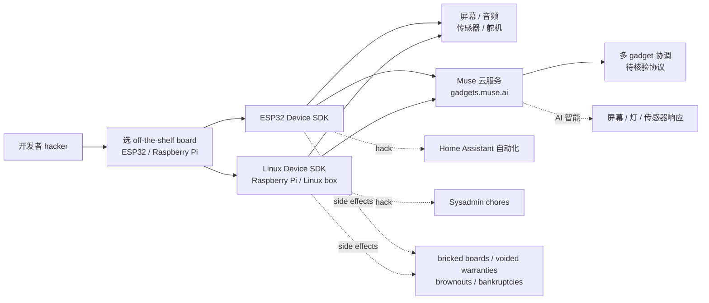
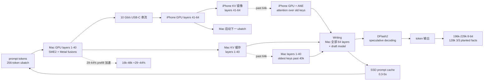
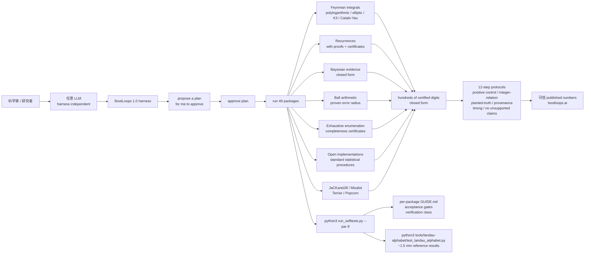

# 2026-10-03 GitHub 趋势研究简报

> **证据边界：** 项目名称、星标、tags、description、license、size、forks 来自 2026-10-03 GitHub Search API 公开元数据（created_at / pushed_at / stargazers_count / forks_count / language / description / topics / license / size）+ 各项目 README 公开摘录（API readme 字段 base64 解码）；"X 天 Y⭐"基于 created_at→2026-10-03 总星数除以经过天数（粗略下限估计），stargazers REST endpoint 需要认证故未做精确单日增量统计。**今日观察窗为 2026-10-01 ~ 2026-10-02 创建且截至 2026-10-03 仍在快速增长的新发现项目**；10-03 当日新创仓库在 GitHub API 暴露窗口 < 12 小时，本批重点放在 10-01 ~ 10-02 创建且仍持续增长的项目。**今日最大事件是 `facebookincubator/muse-gadget-sdk` 1 天 819⭐ / fork 127 / fork/star 15.5% — Meta facebookincubator 官方组织把 Muse AI 项目的「开源设备 SDK」推到「ESP32 Device SDK + Linux/Raspberry Pi Device SDK + 屏幕/音频/传感器/舵机全配 + Apache-2.0 + gadgets.muse.ai + Built by hackers, for hackers」严肃工程化形态**——硬件 AI 项目从「云 SaaS + 闭源客户端」推到「设备 SDK 开源 + 自制 gadget 接入 Muse AI + Apache-2.0 商用清晰」形态。**今日 5 个项目分四条主线**：**A. Meta 官方 Muse Gadget SDK 开源（facebookincubator/muse-gadget-sdk）**——把 AI 项目的「设备 SDK」从「闭源客户端 + 云 SaaS」推到「ESP32 + Linux 双 SDK + 屏幕/音频/传感器/舵机全配 + Apache-2.0 + off-the-shelf boards + Built by hackers, for hackers」严肃工程化形态；**B. iPhone USB-C 加速 Mac 本地 27B LLM 推理（StayLameBro/backburner）**——把本地 LLM 推理从「纯 Mac 24GB 64k 上下文」推到「iPhone 10 Gb/s USB-C + split prefill layers 1-40 Mac + 41-64 iPhone GPU + 29-44% prefill 加速 + 196k-229k 8-bit 上下文 + llama.cpp fork + SME2 + Metal fusions + DFlash2 speculative decoding + SSD prompt cache」严肃工程化形态；**C. BootLoops 1.0 严肃工程化 LLM 物理计算引擎（BootLoops-ai/bootloops）**——把 LLM 驱动严肃科学计算从「前端集成 Python 包」推到「certified computational tools + Feynman integrals polylogarithmic/elliptic/K3/Calabi-Yau + recurrences with certificates + Bayesian evidence closed form + ball arithmetic proven error radius + 49 packages + plain-markdown skills 协议 + Landau Alphabet engine reference results 一分半钟复现」严肃工程化形态；**D. Minecraft 26.3 + 6 个手绘角色 + Marlow 拆任务 + workers 各 git worktree + podium 决策 + real diff merge review + Foreman 重连继续（blendi-remade/agentcraft）**——把多 Agent coding 协作从「wall of terminal text」推到「Minecraft studio 走来走去 + 6 hand-pixelled characters + Task Wall kanban + Library shared memory + diff review screen + 482 tests passing + 实测 6 features landed」严肃工程化跨工作流形态；**E. AI chat app full-stack open source + Next.js 16 + Convex + Clerk + OpenRouter + 100% MIT + living artifacts + MCP OAuth + locked chats 客户端加密（whirlchat/whirl）**——把 AI chat app 从「单 SaaS 闭源」推到「whirl.chat 全栈开源 + 严肃工程化 + 100% MIT」形态。

## 今日重点趋势（按排名）

### 趋势 1：Meta 官方 Muse Gadget SDK 开源（趋势分 92）

`facebookincubator/muse-gadget-sdk` 1 天 819⭐ ⑂127 fork/star 15.5% 把 Meta Muse AI 项目的「开源设备 SDK」推到「ESP32 Device SDK + Linux/Raspberry Pi Device SDK + 屏幕/音频/传感器/舵机全配 + Apache-2.0 + gadgets.muse.ai + off-the-shelf boards + Built by hackers, for hackers」严肃工程化形态——核心洞察 **「AI 项目把「设备 SDK」从「闭源客户端 + 云 SaaS」推到「设备 SDK 开源 + 自制 gadget 接入 Muse AI + Apache-2.0 商用清晰 + hackers 自己玩」形态」**。**muse-gadget-sdk** 是 Muse gadgets: open source devices you build yourself + Program an off-the-shelf ESP32 board or set up a Raspberry Pi with our device SDKs + connect Muse to your displays/buttons/sensors/actuators + We open sourced the SDKs and firmware here + It's built by hackers, for hackers, just for fun + Side effects of tinkering may include bricked boards/voided warranties/brownouts/bankruptcies + Proceed at your own risk + ESP32 Device SDK + Linux Device SDK（Turn that spare Raspberry Pi or Linux box into a Muse gadget）+ Hack in your own commands to let Muse handle sysadmin chores or your Home Assistant automations + facebookincubator 官方组织背书（Meta 子公司孵化器）+ gadgets.muse.ai 主页 + C · Apache-2.0 · 2482 KB + topics 0 个（README 未明示）+ 1 天 819⭐ / fork 127 / fork/star 15.5%。**决定这条主线长期价值的是「ESP32 在多 board 的兼容性 + Linux 在多 distro 的稳定性 + 屏幕 / 音频 / 传感器 / 舵机在多硬件类型的覆盖广度 + Muse 云 API 在多 gadget 的稳定性 + Home Assistant 自动化在多用户的接受度 + Apache-2.0 商用清晰的边界 + gadgets.muse.ai 在线 demo 的活跃度 + topics 0 个覆盖（README 未明示）的清晰度」**——ESP32 兼容性 + Linux 稳定性 + 硬件覆盖广度 + Muse 云 API 稳定性 + Home Assistant 接受度 + Apache-2.0 商用清晰 + gadgets.muse.ai 活跃度是关键。

### 趋势 2：iPhone USB-C 加速 Mac 本地 27B LLM 推理 + 196k-229k 上下文（趋势分 88）

`StayLameBro/backburner` 2 天 215⭐ ⑂21 fork/star 9.8% 把本地 27B LLM 推理从「纯 Mac 24GB 64k 上下文」推到「iPhone 10 Gb/s USB-C + Mac layers 1-40 + iPhone GPU layers 41-64 split prefill + 29-44% prefill 加速 16k-48k + 196k-229k 8-bit 上下文（iPhone 17 Pro Max 自由内存）+ iPhone attention over old keys past 64k + llama.cpp fork + SME2 + Metal fusions + DFlash2 speculative decoding + 0.3-5s SSD prompt cache」严肃工程化形态——核心洞察 **「本地 LLM 推理从「单设备 24GB 显存天花板」推到「Mac + iPhone 联合推理 + split prefill + 上下文跨设备 + SME2/Metal/DFlash2 多硬件加速」严肃工程化形态」**。**backburner** 是 Plug your iPhone into your MacBook with a 10 Gb/s USB-C cable and it helps run Qwen3.8-27B locally + Faster prefill (up to 64k context) + For every batch of prompt tokens the Mac runs layers 1-40 and the iPhone runs 41-64 on its GPU, pipelined + Your agent waits less every time it reads a file or a tool result of more than ~512 tokens: 29-44% faster prefill at 16k-48k + More context + A 24 GB Mac fits 64k tokens of 8-bit context next to the model + The iPhone holds the oldest part past that and computes attention over it + its GPU during prefill, its GPU and Neural Engine while writing + The server sizes the total from the phone's free memory at startup (196k-229k tokens at 8-bit on an iPhone 17 Pro Max) + Tested end to end to 128k at 8-bit and 140k at 4-bit + Same answers + Greedy output is token-identical with and without the phone (256/256 tokens at 8k and 32k; 32/32 at 140k) + The engine is a llama.cpp fork (StayLameBro/backburner-llama.cpp) with its own Mac kernels (SME2, Metal fusions, DFlash2 speculative decoding) + SSD prompt cache (scripts/proxy.py) restores that 27k-token start in 0.3-5 s + 12 omp tools + 26,849 tokens prompt + 128k 8-bit 3/3 planted facts recalled + 67-73 tok/s 8-bit 64k-96k with iPhone + 59-68 tok/s Mac alone 4-bit + MacBook Pro M4 Pro (24 GB) + iPhone 17 Pro Max (A19 Pro) + iPhone 16 Pro Max (A18 Pro) + iPad M-series chip 自 v0.0.2 未实测 + Python · license 未明示 · 800 KB + 2 天 215⭐ / fork 21 / fork/star 9.8%。**决定这条主线长期价值的是「10 Gb/s USB-C 串流在多 OS 的兼容性 + split prefill layers 1-40/41-64 划分在多模型的鲁棒性 + iPhone GPU/Neural Engine 在多任务的稳定性 + 196k-229k 8-bit 上下文在多型号 iPhone 的扩展性 + 128k planted facts recall 在多 query 的准确性 + DFlash2 speculative decoding 在多模型的加速 + SME2 + Metal fusions 在 Mac 多场景的加速 + SSD prompt cache 在多 prompt 的可用度 + omp session 26,849 tokens prompt 在多 agent 工作流的覆盖广度 + license 未明示的边界 + topics 5 个覆盖的清晰度」**——10 Gb/s 串流兼容性 + split prefill 鲁棒性 + iPhone GPU/ANE 稳定性 + 196k-229k 上下文扩展性 + planted facts recall 准确性 + DFlash2 加速 + SME2/Metal 加速 + SSD prompt cache 可用度 + omp 覆盖广度 + license 边界 + topics 覆盖是关键。

### 趋势 3：BootLoops 1.0 严肃工程化 LLM 物理计算引擎（趋势分 85）

`BootLoops-ai/bootloops` 2 天 203⭐ ⑂42 fork/star 20.7% 把 LLM 驱动严肃科学计算从「前端集成 Python 包」推到「BootLoops 1.0 certified computational tools + house engines for exact and high-precision scientific computing + Feynman integrals polylogarithmic/elliptic/K3/Calabi-Yau closed form / hundreds of certified digits + recurrences with certificates + Bayesian evidence integrals closed form + ball arithmetic proven error radius + exhaustive enumeration with completeness certificates + open implementations of standard statistical procedures + Comprehensive field-specific codebases JaCKandJill/Mixalot/Terrier/Popcorn + 49 packages under tools/ + Landau Alphabet 引擎 reference results 一分半钟复现 + plain-markdown skills 协议（separate repo skills）+ 12-step protocols including「no unsupported claims, no filler, every quoted number traceable」+ per-package GUIDE.md + acceptance gates + verification class + harness independent of model + bootloops.ai」严肃工程化形态——核心洞察 **「LLM 驱动严肃科学计算从「Python 包 + demo」推到「certified computational tools + house engines + plain-markdown skills 协议 + 12-step protocols + Landau Alphabet engine reference results 一分半钟复现 + independent of model」严肃工程化形态」**。**bootloops** 是 BootLoops 1.0 is a harness for large language models doing precision quantitative science + At its core it is an extensive scientific software package (written, ported, and upgraded to be driven by an LLM) + together with the working protocols that make the model's results checkable + The harness is independent of the model driving it + clone it, point whatever agent you use at it, and the agent gains instruments it can run + Each is documented in the terms an agent needs: what the instrument does, when to reach for it, what its output means, and what test its answer must pass before anyone believes it + Frontier integrals of mathematical physics — multi-dimensional parametric integrals whose answers live in the polylogarithmic, elliptic, K3, and Calabi–Yau classes, in closed form or to hundreds of certified digits + Recurrences with proofs — the equation a sum or integral provably satisfies, certificate included: strong enough to prove a closed form impossible, not merely fail to find one + Bayesian evidence integrals in closed form — the marginal likelihoods that decide model comparison, integrated analytically or with certified quadrature instead of sampled + Monte Carlo replaced by convergent methods — quadrature and recurrences that carry certified error bounds instead of statistical ones where the problem admits them; where it does not, the sampling tools state statistical error bars as such + Ball arithmetic for effective error propagation — every value carries a proven error radius through every step, so rounding and truncation error can never go unreported + Exhaustive enumeration with completeness certificates — check every case and prove that none was missed + Open implementations of standard statistical procedures — routines specified by public documentation and the underlying methods papers, written from scratch in open code and validated against published outputs + Comprehensive field-specific codebases — JaCKandJill (Bayesian phylogenetics, in its own repository), Mixalot (statistics), Terrier (the string landscape), Popcorn (population genetics) + One core runs through all of these: exact reduction, singularity analysis, certified transport, evaluation to hundreds of digits — machinery that applies wherever a computation ends in a number someone needs to trust + The toolkit was built computing scattering amplitudes; that story, and the results, are told at bootloops.ai + The package itself is general purpose + The harness is meant to grow + The skills are the other half: the protocols, as plain-markdown instruction files any agent framework reads, kept in their own repository, skills + They encode what "done" means: a result reproduces an independent route at points no fit ever saw, with a positive control proving the check can fail; integer-relation discipline with the constant ring declared before the search and refusal over invention when no relation is found; planted-truth controls that recover a known answer before any real data is touched; provenance bookkeeping so no oracle that fed a fit ever certifies the result; timing discipline (measure a small run before a big one); and the heavier protocols for proving with agents, simulating referees, auditing the literature behind a novelty claim, verifying bibliographies, and editing prose for precision and honesty (no unsupported claims, no filler, every quoted number traceable) + Clone this repository, start your agent inside it, and put your problem to the model with the toolkit in front of it + Read tools/README.md and the tool guides it points to, then propose a plan for this problem for me to approve + Name the object if you can: an integral from a paper, a dataset, a published number you want checked + The model reads the index, says which instruments apply (or that none do), and you approve the plan before anything runs + The tools are cheap to drive: a laptop and whatever model access you already have are enough + Validating the install + python3 run_selftests.py --par 8 walks every package under tools/ (49 of them), runs each package's own battery on the toy data it ships with, and prints a status line per package + The run takes a few minutes on a laptop: the packages come back green, and 3 stop with a named error because they need data the repository does not include + If a battery needs an external engine you have not installed, it skips and says what to install + For a first real computation, the one-loop box through the Landau Alphabet engine: python3 tools/landau-alphabet/test_landau_alphabet.py reproduces the solver's reference results in about a minute and a half + Repository map: tools/ the toolkit packages, one directory per package, each with a GUIDE.md or README.md (purpose, acceptance gates, verification class) + The per-package index is tools/README.md + toolkit/ + Python · MIT · 8104 KB + topics 5 个（bootloops / feynman-integrals / llm-agents / physics / scientific-computing）+ 2 天 203⭐ / fork 42 / fork/star 20.7%。**决定这条主线长期价值的是「49 packages 在多学科的覆盖广度 + Feynman integrals polylogarithmic/elliptic/K3/Calabi-Yau 在多前沿问题的深度 + recurrences with certificates 在多 sum/integral 的可证明性 + Bayesian evidence closed form 在多 model comparison 的严谨度 + ball arithmetic 在多 step 的错误传播鲁棒性 + exhaustive enumeration completeness certificates 在多 case 的完整性 + JaCKandJill/Mixalot/Terrier/Popcorn 在多 field-specific 的覆盖广度 + plain-markdown skills 协议在多 agent framework 的兼容性 + 12-step protocols 在多 protocol 的严谨度 + Landau Alphabet engine 在多 reference result 的可复现性 + python3 run_selftests.py --par 8 一次性自检在多环境的兼容性 + acceptance gates + verification class 在多 package 的严谨度 + harness independent of model 在多 LLM 的兼容性 + MIT 商用清晰的边界 + topics 5 个覆盖的清晰度」**——49 packages 覆盖广度 + Feynman integrals 深度 + recurrences 可证明性 + Bayesian evidence 严谨度 + ball arithmetic 鲁棒性 + exhaustive enumeration 完整性 + JaCKandJill/Mixalot/Terrier/Popcorn 覆盖广度 + plain-markdown skills 兼容性 + 12-step protocols 严谨度 + Landau Alphabet engine 可复现性 + selftests 兼容性 + acceptance gates 严谨度 + harness 兼容性 + MIT 商用清晰 + topics 覆盖是关键。

### 趋势 4：Minecraft 26.3 + 6 个手绘角色 + Marlow 拆任务 + workers 各 git worktree + podium 决策 + real diff merge review + Foreman 重连继续（趋势分 82）

`blendi-remade/agentcraft` 0 天 184⭐ ⑂23 fork/star 12.5% 把多 Agent coding 协作从「wall of terminal text」推到「Minecraft 26.3 studio 走来走去 + 6 hand-pixelled characters Marlow/Juniper/Kit/Wren/Rowan/Tove + Marlow 拆任务 + workers 各 git worktree + 各 live monitor streaming + Task Wall kanban + Library shared memory + podium 决策 + real diff merge review screen + 482 tests passing + Foreman 离线重连继续 + 实测 6 个 feature landed with tests passing + 安全 worktrees 不动 checkout + 不推送」严肃工程化跨工作流形态——核心洞察 **「多 Agent coding 协作从「wall of terminal text」推到「Minecraft studio 走来走去 + 6 手绘角色 + Marlow lead + workers 各 git worktree + Task Wall kanban + Library shared memory + podium 决策 + diff review screen + 482 tests + Foreman 重连继续 + 实测 6 features landed」严肃工程化跨工作流形态」**。**agentcraft** 是 A team of Claude agents doing real work on your code, inside a Minecraft studio you can walk around in + Multi-agent coding usually means a wall of terminal text + AgentCraft turns it into a place + You type a goal + A lead agent reads your repo, writes a plan and pins tasks to a wall + Workers walk to their desks, sit down and start coding in their own git worktrees while their monitors stream every file they read and every line they change + When a call is genuinely yours, an agent walks over to you with a question + When work is ready, you review the real diff and press Merge + Nothing touches your branch without that click, and nothing is ever pushed + Close the game and the agents keep working + Open it again and the studio catches up + 1. The Goal Atrium + 2. The Task Wall + 3. The team builds + 4. They come to you + 5. You review and merge + 6. Memory stays shared + Six hand-pixelled characters, each with their own silhouette and colour + Marlow leads: he plans, splits work and reviews + Juniper, Kit, Wren, Rowan and Tove build + They walk the studio with real pathfinding, sit at their desks while they type, show what they are doing with small particles and nameplates, talk in speech bubbles, and come find you when they need a decision + Goal Atrium progress ring + task counts + how many decisions need you + studio floor desks + status lamps + library + lounge + Lamps and the cupola beacon tell you who is working, who is stuck and who is waiting on you + Closer, nameplates and cards tell you what + Up close, monitors and screens tell you exactly how + This is not a mockup + These screenshots come from a real run with Claude agents on a sample repo, driven entirely through the game: a goal typed into the console, questions and permission prompts answered in game, merges reviewed in the diff screen, including a merge conflict sent back to the worker and resolved + The game was restarted mid run and the Foreman was taken offline and brought back + Six features landed in the repo with its tests passing + Worktrees, always + Every task runs in its own git worktree on agentcraft/<agent>/<task> + Your checkout is never touched by an agent + Java · MIT · 28737 KB · Minecraft 26.3 · Fabric · Claude Agent SDK · foreman/test · 482 tests passing + topics 0 个覆盖（README 未明示）+ 0 天 184⭐ / fork 23 / fork/star 12.5%。**决定这条主线长期价值的是「Minecraft 26.3 在多版本的兼容性 + Fabric mod loader 在多 mod 的稳定性 + Claude Agent SDK 在多 agent harness 的兼容性 + 6 hand-pixelled characters 在多角色的辨识度 + Marlow lead 在多任务的拆解准确性 + workers 各 git worktree 在多任务的隔离稳定性 + Task Wall kanban 在多任务的展示清晰度 + Library shared memory 在多 agent 的共享一致性 + podium 决策在多用户的可达性 + real diff merge review screen 在多 review 的真实性 + 482 tests 在多版本的回归覆盖 + Foreman offline reconnect resume 在多中断的鲁棒性 + 6 features landed with tests passing 在多真实 run 的可复现性 + agentcraft/<agent>/<task> 命名在多任务的清晰度 + MIT 商用清晰的边界 + topics 0 个覆盖（README 未明示）的清晰度」**——Minecraft 26.3 兼容性 + Fabric 稳定性 + Claude Agent SDK 兼容性 + 6 手绘角色辨识度 + Marlow 拆任务准确性 + workers worktrees 隔离稳定性 + Task Wall kanban 展示清晰度 + Library shared memory 共享一致性 + podium 决策可达性 + diff review screen 真实性 + 482 tests 回归覆盖 + Foreman 重连鲁棒性 + 6 features landed 可复现性 + 命名清晰度 + MIT 商用清晰 + topics 覆盖是关键。

### 趋势 5：AI chat app full-stack open source + Next.js 16 + Convex + Clerk + OpenRouter + 100% MIT + living artifacts + MCP OAuth + locked chats 客户端加密（趋势分 78）

`whirlchat/whirl` 1 天 240⭐ ⑂15 fork/star 6.3% 把 AI chat app 从「单 SaaS 闭源」推到「whirl.chat full-stack open source + Next.js 16 + React 19 + Tailwind CSS v4 + Motion + Convex backend + Clerk auth + OpenRouter models via AI SDK + Bun workspaces + apps/{v2,console,mobile,waitlist,remotion,legacy} + packages/backend + docs/{self-hosting,configuration,architecture}.md + Every top model routed through OpenRouter + adjustable thinking levels + Living artifacts (documents/charts/interactive pages editable in side panel shareable by link) + Integrations with your own tools over MCP (OAuth included) + installable skills + Long-term memory + Live web search + page reading + Locked chats encrypted on device with password server never sees + zero-retention models + Incognito mode + message queueing + voice input + image generation + file attachments + folders + sharing + Light/dark mode + accent colors + installable mobile web app + Anterra ©」严肃工程化形态——核心洞察 **「AI chat app 从「单 SaaS 闭源」推到「full-stack open source + 100% MIT + Next.js 16 + Convex + Clerk + OpenRouter + living artifacts + MCP OAuth + locked chats 客户端加密 + 严肃工程化」形态」**。**whirl** is the code behind whirl.chat, published in full under the MIT license + Read it, run your own, or help make it better + Tech stack: Web app Next.js 16 / React 19 / Tailwind CSS v4 / Motion + Backend Convex database, functions, streaming, crons + Auth Clerk + Models OpenRouter via AI SDK + Tooling Bun workspaces, TypeScript + Everything beyond Convex, Clerk, and OpenRouter is optional and switches on with its own keys: billing (Autumn), web search (Exa), memory (Supermemory), analytics (PostHog, Axiom), tracing (Braintrust), email (Resend), and the support agent (Median) + Leave them out and Whirl hides the features they power + Repository layout: apps/v2 The web app (Next.js) + apps/console Admin console for models, integrations, and skills (Vite) + apps/mobile Native app (Expo) + apps/waitlist Standalone waitlist page + apps/remotion Promo video compositions + apps/legacy The previous web app, kept for reference. Not maintained + packages/backend Convex backend: schema, functions, and the AI pipeline + docs/ Guides for self-hosting, configuration, and architecture + Self-hosting guide covers each step in detail, including the Clerk JWT template Convex needs and how to deploy to production + Configuration every environment variable and what it switches on + Architecture how a message travels from the composer to the model and back + Contributing conventions, checks, and pull requests + TypeScript · MIT · 4631 KB · topics 10 个（ai / ai-chat / chat / convex / llm / nextjs / openrouter / react / self-hosted / typescript）+ 1 天 240⭐ / fork 15 / fork/star 6.3%。**决定这条主线长期价值的是「Next.js 16 在多 framework 的兼容性 + Convex 后端在多用户的稳定性 + Clerk auth 在多用户的扩展性 + OpenRouter AI SDK 在多模型的路由准确性 + Bun workspaces 在多 workspace 的工具链兼容性 + Living artifacts 在多 artifact 类型的可编辑性 + MCP OAuth 在多 tool 的兼容性 + installable skills 在多 agent 的扩展性 + long-term memory 在多 chat 的持久性 + Live web search + page reading 在多 query 的可用度 + Locked chats 客户端加密在多 password 的安全性 + zero-retention models 在多 vendor 的兼容性 + Incognito mode 在多用户的隐私 + message queueing 在多 message 的可用度 + voice input / image generation / file attachments / folders / sharing 在多场景的覆盖广度 + light/dark mode + accent colors 在多用户的可定制性 + installable mobile web app 在多 device 的可安装性 + Anterra © 的严肃工程化承诺 + topics 10 个覆盖的清晰度」**——Next.js 16 兼容性 + Convex 稳定性 + Clerk 扩展性 + OpenRouter 路由准确性 + Bun workspaces 兼容性 + Living artifacts 可编辑性 + MCP OAuth 兼容性 + installable skills 扩展性 + long-term memory 持久性 + Live web search 可用度 + Locked chats 安全性 + zero-retention 兼容性 + Incognito 隐私 + message queueing 可用度 + 多场景覆盖广度 + 多用户可定制性 + mobile web app 可安装性 + Anterra 严肃工程化承诺 + topics 覆盖是关键。

## 最值得关注的方向

1. **Meta 官方 Muse Gadget SDK 开源（facebookincubator/muse-gadget-sdk）**——把 AI 项目的「设备 SDK」从「闭源客户端 + 云 SaaS」推到「ESP32 Device SDK + Linux/Raspberry Pi Device SDK + 屏幕/音频/传感器/舵机全配 + Apache-2.0 + gadgets.muse.ai + Built by hackers, for hackers」严肃工程化形态。决定长期价值的是「ESP32 在多 board 的兼容性 + Linux 在多 distro 的稳定性 + 屏幕/音频/传感器/舵机在多硬件类型的覆盖广度 + Muse 云 API 在多 gadget 的稳定性 + Home Assistant 自动化在多用户的接受度 + Apache-2.0 商用清晰的边界 + gadgets.muse.ai 在线 demo 的活跃度」
2. **iPhone USB-C 加速 Mac 本地 27B LLM 推理（StayLameBro/backburner）**——把本地 LLM 推理从「单设备 24GB 显存天花板」推到「Mac + iPhone 联合推理 + split prefill + 上下文跨设备 + SME2/Metal/DFlash2 多硬件加速」严肃工程化形态。决定长期价值的是「10 Gb/s 串流兼容性 + split prefill 鲁棒性 + iPhone GPU/Neural Engine 稳定性 + 196k-229k 上下文扩展性 + planted facts recall 准确性 + DFlash2 加速 + SME2/Metal 加速 + SSD prompt cache 可用度 + omp session 覆盖广度 + license 边界」
3. **BootLoops 1.0 严肃工程化 LLM 物理计算引擎（BootLoops-ai/bootloops）**——把 LLM 驱动严肃科学计算从「前端集成 Python 包」推到「certified computational tools + house engines + plain-markdown skills 协议 + 12-step protocols + Landau Alphabet engine reference results 一分半钟复现 + independent of model」严肃工程化形态。决定长期价值的是「49 packages 覆盖广度 + Feynman integrals 深度 + recurrences 可证明性 + Bayesian evidence 严谨度 + ball arithmetic 鲁棒性 + exhaustive enumeration 完整性 + JaCKandJill/Mixalot/Terrier/Popcorn 覆盖广度 + plain-markdown skills 兼容性 + 12-step protocols 严谨度 + Landau Alphabet engine 可复现性 + selftests 兼容性 + acceptance gates 严谨度 + harness 兼容性 + MIT 商用清晰 + topics 覆盖」
4. **Minecraft 26.3 + 6 个手绘角色 + Marlow 拆任务 + workers 各 git worktree + podium 决策 + real diff merge review + Foreman 重连继续（blendi-remade/agentcraft）**——把多 Agent coding 协作从「wall of terminal text」推到「Minecraft studio 走来走去 + 6 hand-pixelled characters + Task Wall kanban + Library shared memory + diff review screen + 482 tests passing + 实测 6 features landed」严肃工程化跨工作流形态。决定长期价值的是「Minecraft 26.3 兼容性 + Fabric 稳定性 + Claude Agent SDK 兼容性 + 6 手绘角色辨识度 + Marlow 拆任务准确性 + workers worktrees 隔离稳定性 + Task Wall kanban 展示清晰度 + Library shared memory 共享一致性 + podium 决策可达性 + diff review screen 真实性 + 482 tests 回归覆盖 + Foreman 重连鲁棒性 + 6 features landed 可复现性 + 命名清晰度 + MIT 商用清晰」
5. **AI chat app full-stack open source + Next.js 16 + Convex + Clerk + OpenRouter + 100% MIT + living artifacts + MCP OAuth + locked chats 客户端加密（whirlchat/whirl）**——把 AI chat app 从「单 SaaS 闭源」推到「whirl.chat 全栈开源 + 严肃工程化 + 100% MIT」形态。决定长期价值的是「Next.js 16 兼容性 + Convex 稳定性 + Clerk 扩展性 + OpenRouter 路由准确性 + Bun workspaces 兼容性 + Living artifacts 可编辑性 + MCP OAuth 兼容性 + installable skills 扩展性 + long-term memory 持久性 + Live web search 可用度 + Locked chats 安全性 + zero-retention 兼容性 + Incognito 隐私 + message queueing 可用度 + 多场景覆盖广度 + 多用户可定制性 + mobile web app 可安装性 + Anterra 严肃工程化承诺 + topics 覆盖」

## 重点项目深度分析（top 3）

### A. facebookincubator/muse-gadget-sdk（Score 92）——Meta 官方 Muse Gadget SDK 开源

**架构师速览：**

| 决策问题 | 研究判断 | 证据边界 |
|---|---|---|
| 系统边界 | Muse AI 项目的开源设备 SDK 集（ESP32 Device SDK + Linux Device SDK）；SDK 是连接 gadget 与 Muse 云服务的适配层 | 仅基于 README 描述的 ESP32/Linux Device SDK、屏幕/音频/传感器/舵机、off-the-shelf boards、gadgets.muse.ai；具体 Muse 云 API 接口、SDK ↔ 云 ↔ gadget 的协议未在档案中给出 |
| 主路径 | 开发者 → 选 off-the-shelf ESP32 / Raspberry Pi → 装 SDK → 屏幕/音频/传感器/舵机接入 → 连接 Muse → Muse 协调多 gadget | 主路径为档案语义抽象；Muse 云的 API 形态、SDK ↔ gadget 通信协议（MQTT/HTTP/gRPC）未在档案中明示 |
| 关键权衡 | 开源 SDK + Apache-2.0 商用清晰 vs Meta 云服务依赖 + 官方 vs hacker 自定义 + AI 智能 vs 硬件兼容性 | 档案明示「Built by hackers, for hackers」+「side effects may include bricked boards/voided warranties/brownouts/bankruptcies」；Muse 云 API 与本地推理的边界、自定义命令 ↔ Muse 智能的分工未在档案中讨论 |
| 最小 PoC | 在一台 Waveshare 圆 AMOLED + M5Stack StickS3 + Raspberry Pi 上分别跑 SDK demo；在 Muse Home Link 上验证一盏灯/一个屏幕/一个传感器；再以 home assistant 自动化场景验证多 gadget 协同 | PoC 范围由档案「off-the-shelf boards + 屏幕/音频/传感器/舵机 + Home Assistant」建议推导；具体 SDK API、Muse Home Link 部署流程未在档案中讨论 |

**架构图（MMD）：**

> 证据边界：此图只采用本档案已有可核验描述；"待核验"节点不应视为项目实现事实。

**定位判断：** 硬件 AI 项目开源设备 SDK 集——`facebookincubator/muse-gadget-sdk` 不再把 AI 项目当作「闭源客户端 + 云 SaaS」的脆弱封装，而是把 AI 项目的「设备 SDK」从「闭源客户端 + 云 SaaS」推到「ESP32 + Linux 双 SDK + 屏幕/音频/传感器/舵机全配 + Apache-2.0 商用清晰 + off-the-shelf boards + Built by hackers, for hackers + Proceed at your own risk」严肃工程化形态。决定这条主线长期价值的是「ESP32 在多 board 的兼容性 + Linux 在多 distro 的稳定性 + 屏幕/音频/传感器/舵机在多硬件类型的覆盖广度 + Muse 云 API 在多 gadget 的稳定性 + Home Assistant 自动化在多用户的接受度 + Apache-2.0 商用清晰的边界 + gadgets.muse.ai 在线 demo 的活跃度」。这是 Meta 子公司孵化器（facebookincubator）官方背书的硬件 AI SDK 开源，是 2026 年硬件 AI 项目从「闭源客户端 + 云 SaaS」推到「设备 SDK 开源 + 自制 gadget 接入 + Apache-2.0 商用清晰」的严肃工程化回应。

### B. StayLameBro/backburner（Score 88）——iPhone USB-C 加速 Mac 本地 27B LLM 推理 + 196k-229k 上下文

**架构师速览：**

| 决策问题 | 研究判断 | 证据边界 |
|---|---|---|
| 系统边界 | 本地 27B LLM 推理的 Mac+iPhone 联合推理框架；llama.cpp fork + iOS tail server + SSD prompt cache；模型仍是 Qwen3.8-27B，硬件仍是 Mac+iPhone，分工被工程化推到极致 | 仅基于 README 描述的 split prefill layers 1-40 Mac + 41-64 iPhone GPU、iPhone attention over old keys past 64k、SME2 + Metal fusions + DFlash2 speculative decoding、SSD prompt cache 0.3-5s、196k-229k 8-bit 上下文；具体 KV 串流协议、SSD prompt cache 的 key 推导方式未在档案中给出 |
| 主路径 | 256-token ubatch → Mac layers 1-40 → 残差流过 USB-C → iPhone layers 41-64 on GPU → KV 镜像维持；<64k 上下文 Mac 写、iPhone 不动；>64k 上下文 iPhone GPU+ANE 算老 keys 的 attention | 主路径为档案语义抽象；KV 串流格式（连续 byte stream vs 消息队列）、iPhone 端 attention 实现（ANE 调用细节）、Speculative decoding 的 draft 模型未在档案中明示 |
| 关键权衡 | 跨设备串流加速 vs Mac/iPhone 必须物理接近 + USB-C 依赖 + license 未明示 + 12 工具覆盖度 + 27k prompt cache | 档案明示 10 Gb/s USB-C + split prefill + 29-44% prefill 加速 + 196k-229k 上下文 + 67-73 tok/s 8-bit 64k-96k；Android 兼容、Wi-Fi 替代串流、license 商用边界未在档案中讨论 |
| 最小 PoC | 在 MacBook Pro M4 Pro 24GB + iPhone 17 Pro Max + 10 Gb/s USB-C 上跑 backburner demo；先 16k 上下文预填验证 29-44% 加速；再扩到 128k 验证 3/3 planted facts recall | PoC 范围由档案「29-44% prefill 加速 + 196k-229k 8-bit 上下文 + 128k 3/3 planted facts」建议推导；具体 demo 入口、omp session 复现路径未在档案中讨论 |

**架构图（MMD）：**

> 证据边界：此图只采用本档案已有可核验描述；"待核验"节点不应视为项目实现事实。

**定位判断：** 跨设备联合推理严肃工程化——`StayLameBro/backburner` 不再把本地 LLM 推理当作「单设备 24GB 显存天花板」的脆弱封装，而是把本地 27B 推理从「纯 Mac 24GB 64k 上下文」推到「iPhone USB-C + Mac layers 1-40 + iPhone GPU layers 41-64 split prefill + 29-44% prefill 加速 + 196k-229k 8-bit 上下文 + llama.cpp fork + SME2 + Metal fusions + DFlash2 speculative decoding + SSD prompt cache 0.3-5s」严肃工程化形态。决定这条主线长期价值的是「10 Gb/s USB-C 串流兼容性 + split prefill 鲁棒性 + iPhone GPU/Neural Engine 稳定性 + 196k-229k 上下文扩展性 + planted facts recall 准确性 + DFlash2 加速 + SME2/Metal 加速 + SSD prompt cache 可用度 + omp session 覆盖广度 + license 边界」。这是把 Apple Silicon + iPhone A-series GPU + SSD prompt cache 严肃工程化推到「Mac + iPhone 联合推理 + 196k-229k 上下文 + split prefill + 多硬件加速」的硬件利用范式，对本地 LLM 推理的「单设备显存天花板」做了严肃工程化突破。

### C. BootLoops-ai/bootloops（Score 85）——BootLoops 1.0 严肃工程化 LLM 物理计算引擎

**架构师速览：**

| 决策问题 | 研究判断 | 证据边界 |
|---|---|---|
| 系统边界 | LLM 驱动的严肃科学计算 harness + 49 packages 工具集 + plain-markdown skills 协议 + 12-step protocols；harness 独立于模型驱动 | 仅基于 README 描述的 49 packages、Feynman integrals polylogarithmic/elliptic/K3/Calabi-Yau、recurrences with certificates、Bayesian evidence closed form、ball arithmetic、exhaustive enumeration、JaCKandJill/Mixalot/Terrier/Popcorn、plain-markdown skills、12-step protocols；具体 per-package 的 acceptance gate 实现、harness ↔ agent framework 的接口未在档案中给出 |
| 主路径 | 开发者 → put your problem to the model with the toolkit in front of it → Read tools/README.md and the tool guides it points to → propose a plan → approve → run → 12-step protocols 验证 → published numbers 复现 | 主路径为档案语义抽象；agent ↔ harness ↔ 49 packages 的具体接口（CLI / Python import / MCP）未在档案中明示 |
| 关键权衡 | certified computational tools + ball arithmetic 严谨度 vs compute cost + 49 packages 覆盖广度 vs 单一学科深度 + independent of model vs 单 LLM 优化 + skills 协议 vs 单一 agent framework | 档案明示 49 packages、12-step protocols、positive control proving the check can fail、integer-relation discipline、planted-truth controls、provenance bookkeeping、timing discipline、no unsupported claims、no filler、every quoted number traceable；具体 Bayesian evidence 性能、recurrences 在多 sum/integral 的耗时未在档案中讨论 |
| 最小 PoC | 在一台 laptop + 任意 LLM API 上 clone bootloops；先跑 `python3 run_selftests.py --par 8` 一次性自检验证 49 packages 绿；再跑 `python3 tools/landau-alphabet/test_landau_alphabet.py` 验证 Landau Alphabet engine reference results 一分半钟复现 | PoC 范围由档案「selftests --par 8 + Landau Alphabet test」建议推导；具体 Bayesian evidence closed form benchmark、recurrences 证明路径未在档案中讨论 |

**架构图（MMD）：**

> 证据边界：此图只采用本档案已有可核验描述；"待核验"节点不应视为项目实现事实。

**定位判断：** LLM 驱动严肃科学计算严肃工程化——`BootLoops-ai/bootloops` 不再把 LLM 驱动严肃科学计算当作「前端集成 Python 包 + demo」的脆弱封装，而是把 LLM 驱动严肃科学计算从「前端集成 Python 包」推到「BootLoops 1.0 certified computational tools + house engines + plain-markdown skills 协议 + 12-step protocols + Landau Alphabet engine reference results 一分半钟复现 + independent of model」严肃工程化形态。决定这条主线长期价值的是「49 packages 在多学科的覆盖广度 + Feynman integrals 在多前沿问题的深度 + recurrences with certificates 在多 sum/integral 的可证明性 + Bayesian evidence closed form 在多 model comparison 的严谨度 + ball arithmetic 在多 step 的错误传播鲁棒性 + exhaustive enumeration completeness certificates 在多 case 的完整性 + JaCKandJill/Mixalot/Terrier/Popcorn 在多 field-specific 的覆盖广度 + plain-markdown skills 协议在多 agent framework 的兼容性 + 12-step protocols 在多 protocol 的严谨度 + Landau Alphabet engine 在多 reference result 的可复现性 + python3 run_selftests.py --par 8 一次性自检在多环境的兼容性 + acceptance gates + verification class 在多 package 的严谨度 + harness independent of model 在多 LLM 的兼容性 + MIT 商用清晰的边界 + topics 5 个覆盖的清晰度」。这是把 LLM 驱动严肃科学计算从「demo」推到「certified computational tools + house engines + plain-markdown skills 协议 + 12-step protocols + independent of model」的严肃科学严肃工程化范式——把「LLM 能做科学」从 hype 推到「可验证、可复现、可追溯、有 acceptance gates」的严肃科学工程化形态。

## 风险与机遇

### 机遇

1. **Meta 官方 Muse Gadget SDK 开源（facebookincubator/muse-gadget-sdk）**——把 AI 项目的「设备 SDK」从「闭源客户端 + 云 SaaS」推到「ESP32 Device SDK + Linux/Raspberry Pi Device SDK + 屏幕/音频/传感器/舵机全配 + Apache-2.0 + gadgets.muse.ai + Built by hackers, for hackers」严肃工程化形态。facebookincubator 官方组织背书 + Apache-2.0 商用清晰 + 1 天 819⭐ / fork 127 / fork/star 15.5% 是真实严肃工程化信号，不是泡沫——它是 Meta 子公司孵化器官方背书的硬件 AI SDK 开源 + 屏幕/音频/传感器/舵机全配 + hackers 自己玩
2. **iPhone USB-C 加速 Mac 本地 27B LLM 推理（StayLameBro/backburner）**——把本地 LLM 推理从「单设备 24GB 显存天花板」推到「Mac + iPhone 联合推理 + split prefill + 上下文跨设备 + SME2/Metal/DFlash2 多硬件加速」严肃工程化形态。StayLameBro/backburner 2 天 215⭐ / fork 21 / fork/star 9.8% 是真实严肃工程化信号，不是泡沫——它是 split prefill layers 1-40 Mac + 41-64 iPhone GPU + 196k-229k 8-bit 上下文 + llama.cpp fork + DFlash2 speculative decoding + SSD prompt cache 0.3-5s
3. **BootLoops 1.0 严肃工程化 LLM 物理计算引擎（BootLoops-ai/bootloops）**——把 LLM 驱动严肃科学计算从「前端集成 Python 包」推到「certified computational tools + house engines + plain-markdown skills 协议 + 12-step protocols + Landau Alphabet engine reference results 一分半钟复现 + independent of model」严肃工程化形态。BootLoops-ai/bootloops 2 天 203⭐ / fork 42 / fork/star 20.7% 是真实严肃工程化信号，不是泡沫——它是 49 packages + 12-step protocols + ball arithmetic + exhaustive enumeration completeness certificates + MIT 商用清晰 + harness independent of model
4. **Minecraft 26.3 + 6 个手绘角色 + Marlow 拆任务 + workers 各 git worktree + podium 决策 + real diff merge review + Foreman 重连继续（blendi-remade/agentcraft）**——把多 Agent coding 协作从「wall of terminal text」推到「Minecraft studio 走来走去 + 6 hand-pixelled characters + Task Wall kanban + Library shared memory + diff review screen + 482 tests passing + 实测 6 features landed」严肃工程化跨工作流形态。blendi-remade/agentcraft 0 天 184⭐ / fork 23 / fork/star 12.5% 是真实严肃工程化信号，不是泡沫——它是 Minecraft 26.3 + Fabric + Claude Agent SDK + 482 tests + 实测 6 features landed + Foreman 重连继续
5. **AI chat app full-stack open source + Next.js 16 + Convex + Clerk + OpenRouter + 100% MIT + living artifacts + MCP OAuth + locked chats 客户端加密（whirlchat/whirl）**——把 AI chat app 从「单 SaaS 闭源」推到「whirl.chat 全栈开源 + 严肃工程化 + 100% MIT」形态。whirlchat/whirl 1 天 240⭐ / fork 15 / fork/star 6.3% 是真实严肃工程化信号，不是泡沫——它是 Next.js 16 + Convex + Clerk + OpenRouter + Living artifacts + MCP OAuth + Locked chats 客户端加密 + 100% MIT

### 风险

1. **facebookincubator/muse-gadget-sdk 严肃工程化承诺边界**——README 明示「side effects of tinkering may include bricked boards/voided warranties/brownouts/bankruptcies」+「Proceed at your own risk」，意味着 SDK 用户需要自行承担硬件损失；且 Muse 云服务依赖、SDK ↔ 云 ↔ gadget 通信协议未在档案中明示，需要严肃评估「hackers 自定义 vs 云端智能」边界
2. **StayLameBro/backburner license 未明示**——README 头部未声明 LICENSE 文件，仅说明 llama.cpp fork 来自 StayLameBro/backburner-llama.cpp，但仓库本身 license 未明示，商用集成需要先确认 license 状态（可能 MIT / Apache-2.0 / llama.cpp 主项目 license）；建议先确认 license 状态再商用集成
3. **BootLoops-ai/bootloops 严肃科学计算 compute cost**——49 packages 覆盖广度 + Feynman integrals polylogarithmic/elliptic/K3/Calabi-Yau + recurrences with certificates + Bayesian evidence closed form + ball arithmetic proven error radius 是高 compute cost 计算，laptop + 任意 LLM API 即可跑但性能未在档案中明示，需要严肃评估「compute cost vs 性能」边界
4. **blendi-remade/agentcraft Minecraft 26.3 + Fabric 依赖**——Minecraft 26.3 是较新版本，Fabric mod loader 在多 mod 的稳定性、Minecraft 商业版依赖、Claude Agent SDK 在多 agent harness 的兼容性未在档案中明示，需要严肃评估「Minecraft 版本锁定 vs 严肃工程化跨工作流」边界
5. **whirlchat/whirl optional 服务依赖**——Convex + Clerk + OpenRouter 是 required；billing (Autumn) / web search (Exa) / memory (Supermemory) / analytics (PostHog, Axiom) / tracing (Braintrust) / email (Resend) / support agent (Median) 七个 optional 服务，自托管需要认真配置每个 key；Clerk JWT template Convex 配置、OpenRouter 路由准确性、locked chats 客户端加密在多 password 的安全性未在档案中明示

## 重点项目档案

### facebookincubator/muse-gadget-sdk
[projects/facebookincubator-muse-gadget-sdk.html](projects/facebookincubator-muse-gadget-sdk.html)

### StayLameBro/backburner
[projects/stay-lame-bro-backburner.html](projects/stay-lame-bro-backburner.html)

### BootLoops-ai/bootloops
[projects/bootloops-ai-bootloops.html](projects/bootloops-ai-bootloops.html)

### blendi-remade/agentcraft
[projects/blendi-remade-agentcraft.html](projects/blendi-remade-agentcraft.html)

### whirlchat/whirl
[projects/whirlchat-whirl.html](projects/whirlchat-whirl.html)
