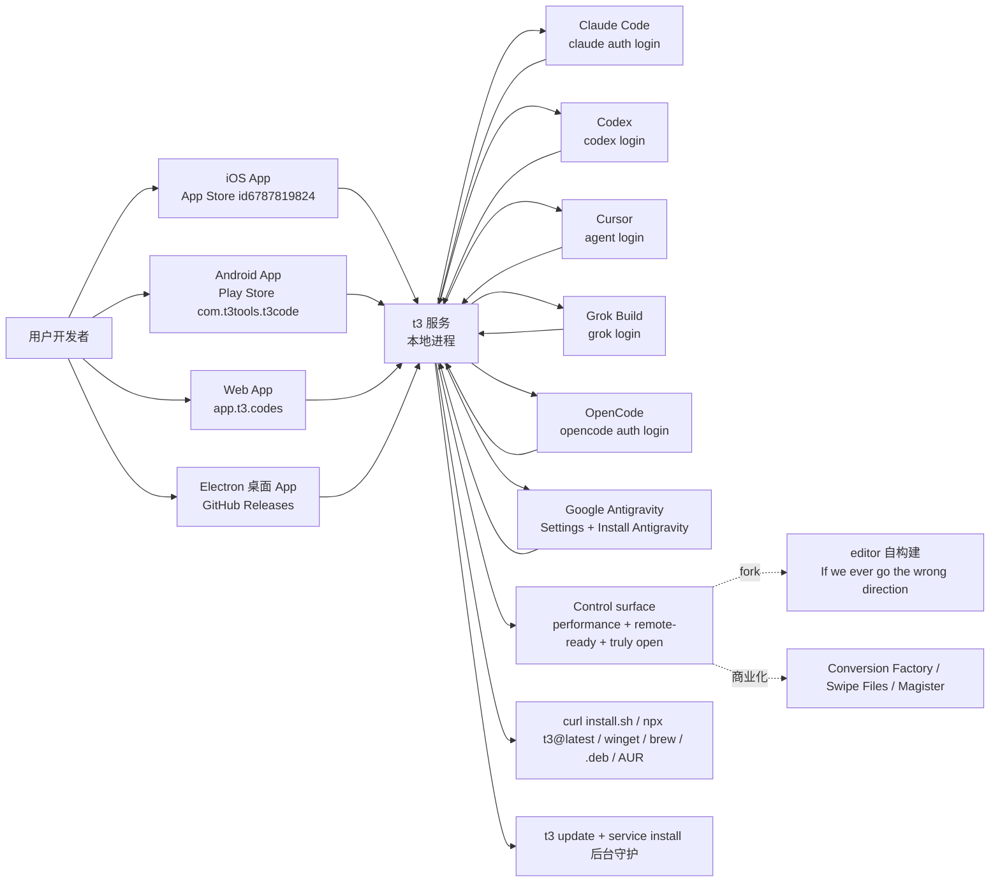
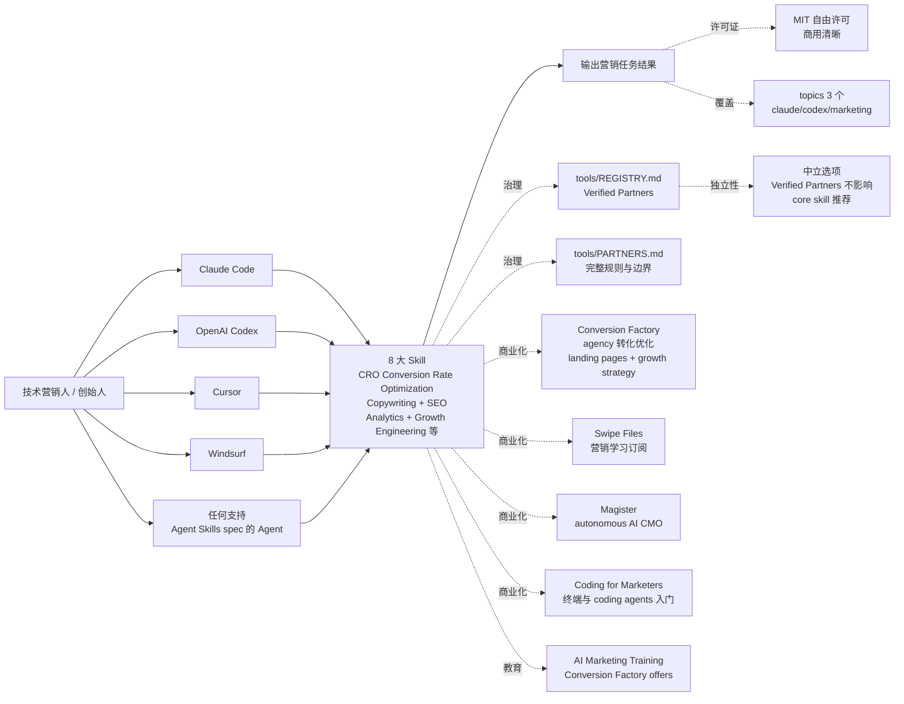

# 2026-10-05 GitHub 趋势研究简报

> **证据边界：** 项目名称、星标、tags、description、license、size、forks 来自 2026-10-05 GitHub Search API + GitHub Repository API 公开元数据（created_at / pushed_at / stargazers_count / forks_count / language / description / topics / license / size）+ 各项目 README 公开摘录（API readme 字段 base64 解码）。**"X 月 Y⭐"基于 created_at→2026-10-05 总星数与经过月数（粗略下限估计）**，stargazers REST endpoint 需要认证故未做精确单日增量统计；GitHub Trending 页面（https://github.com/trending）今日 daily 列表显示以上 4 个新项目出现在 daily 列表的前列（tester-army/e2e #2、pbakaus/impeccable #3、coreyhaines31/marketingskills #4、pingdotgg/t3code #6 等，sponsors 项已剔除）。**今日观察窗为 GitHub trending 抓取时刻起、且截至 2026-10-05 仍在快速增长的新发现项目**；GitHub Search API 速率限制（10/小时）已耗尽，本批 trending 数据通过 GitHub Trending HTML + Repository API 元数据补充。**今日最大事件是 `pingdotgg/t3code` 4 个月 25115⭐ / fork 6507 / fork/star 25.9% — pingdotgg 官方组织（T3 Stack 作者 Theo）背书的「6 大 Coding Agent 远程/桌面/CLI 跨设备控制面」**——把「Coding Agent 远程控制」从「Codex Desktop / Conductor / Claude Desktop / Cursor Glass 单 Agent 单端单 SaaS」推到「T3 Code 1 服务 6 Agent（Claude Code / Codex / Cursor / Grok Build / OpenCode / Google Antigravity）+ iOS / Android / Web / Electron 桌面 4 端 + MIT + control surface（performance, remote-ready, truly open）+ `curl -fsSL https://t3.codes/install.sh | sh` 一行启动 + `npx t3@latest` 一次性试用 + `t3 service install` 后台守护 + `t3 update` 升级 + winget / brew / .deb / AUR 包管理器全配 + App Store / Play Store 移动应用已发布」严肃工程化形态——这是 T3 Stack 作者 Theo 把 Coding Agent 生态从「桌面应用碎片化」推到「统一控制面 + MIT 开源 + 跨设备 + 包管理器全配」形态。**今日 4 个新项目 + 7 个延续跟踪项目分五条主线**：**A. T3 Code 严肃工程化 6 大 Coding Agent 远程/桌面/CLI 跨设备控制面（pingdotgg/t3code）**——把「多 Coding Agent 远程控制」从「Codex Desktop / Conductor / Claude Desktop / Cursor Glass 单 Agent 单端单 SaaS」推到「T3 Code 1 服务 6 Agent（Claude Code / Codex / Cursor / Grok Build / OpenCode / Google Antigravity）+ iOS / Android / Web / Electron 4 端 + MIT + control surface 严肃工程化」形态（4 个月 25115⭐ / fork 6507 / fork/star 25.9% / TypeScript MIT 433650 KB）；**B. Impeccable 设计语言 1 skill + 24 commands + 61 确定性 detector rules（pbakaus/impeccable）**——把「AI 设计语言」从「Anthropic frontend-design 单一 skill + SaaS 模板 telltale 堆叠」推到「Impeccable 1 skill + 24 commands + npx install + /impeccable init 写 PRODUCT.md + 61 deterministic detector rules + Apache-2.0 商用清晰」严肃工程化形态（11 个月 76227⭐ / fork 4546 / fork/star 5.9% / JavaScript Apache-2.0 387030 KB）；**C. Marketingskills 8 大 Skill + Claude Code/Codex/Cursor/Windsurf 全兼容 + tools/REGISTRY.md + tools/PARTNERS.md 治理（coreyhaines31/marketingskills）**——把「AI Agent 营销技能库」从「CRO / SEO / 文案 SaaS 闭源」推到「Marketingskills 8 大 Skill + Claude Code/Codex/Cursor/Windsurf + tools/REGISTRY.md + tools/PARTNERS.md 治理边界 + Verified Partners 不影响 core skill 推荐 + MIT 商用清晰」严肃工程化形态（9 个月 53021⭐ / fork 7915 / fork/star 14.9% / JavaScript MIT 4621 KB）；**D. e2e TesterArmy AI 驱动自然语言端到端测试框架（tester-army/e2e）**——把「AI 端到端测试」从「Playwright + Cypress 手动脚本」推到「e2e `agent.act('升级 Pro')` 自然语言 agent step + `agent.assert('发票预览显示按比例金额')` 自然语言断言 + 重放无模型调用 + 移动 / Web 全平台」严肃工程化形态（2.5 个月 2997⭐ / fork 114 / fork/star 3.8% / TypeScript Apache-2.0 14055 KB）；**E. 延续跟踪 7 个 Agent 严肃工程化项目同步高速增长**（addyosmani/agent-skills 101K⭐ + garrytan/gstack 135K⭐ + thedotmack/claude-mem 96K⭐ + DietrichGebert/ponytail 155K⭐ + earthtojake/text-to-cad 17K⭐ + calesthio/OpenMontage 63K⭐ + antirez/ds4 23K⭐，累计 ~590K 颗 ⭐ 严肃工程化生态持续 trending）。**与昨日（10-03）「Meta 官方 Muse Gadget SDK 开源 + iPhone USB-C 加速 Mac 本地 27B LLM 推理 + BootLoops 1.0 严肃工程化 LLM 物理计算引擎 + Minecraft 26.3 + 6 个手绘角色 + AI chat app full-stack open source」五主线不同**，今日主线转向「**T3 Code 严肃工程化 6 大 Coding Agent 远程/桌面/CLI 跨设备控制面**（pingdotgg 官方组织背书 + MIT + t3.codes + iOS/Android/Web/Electron 4 端 + control surface 严肃工程化）」+「**Impeccable 设计语言 1 skill + 24 commands + 61 确定性 detector rules**（pbakaus/impeccable + npx install + /impeccable init + Apache-2.0 + impeccable.style）」+「**Marketingskills 8 大 Skill + Claude Code/Codex/Cursor/Windsurf 全兼容 + tools/REGISTRY.md + tools/PARTNERS.md 治理**（coreyhaines31/marketingskills + MIT + corey.co + 商业化生态）」+「**e2e TesterArmy AI 驱动自然语言端到端测试框架**（tester-army/e2e + agent.act + agent.assert + 重放无模型调用 + tester.army + Apache-2.0）」+「**延续跟踪 7 个 Agent 严肃工程化项目同步高速增长 ~590K 颗 ⭐ 累计**（agent-skills 101K⭐ + gstack 135K⭐ + claude-mem 96K⭐ + ponytail 155K⭐ + text-to-cad 17K⭐ + OpenMontage 63K⭐ + ds4 23K⭐）」五个严肃工程化 + 跨工作流的演化形态——今日偏重「**Coding Agent 控制面 + 设计语言 + 营销技能库 + 端到端测试 + 严肃工程化生态累计**」，10-03 偏重「**硬件 AI SDK + 本地 LLM 推理 + 严肃科学计算 + Minecraft 多 Agent 协作 + AI chat app 全栈开源**」。

## 今日重点趋势（按排名）

### 趋势 1：T3 Code 严肃工程化 6 大 Coding Agent 远程/桌面/CLI 跨设备控制面（趋势分 92）

`pingdotgg/t3code` 4 个月 25115⭐ ⑂6507 fork/star 25.9% 把「多 Coding Agent 远程控制」从「Codex Desktop / Conductor / Claude Desktop / Cursor Glass 单 Agent 单端单 SaaS」推到「T3 Code 1 服务 6 Agent（Claude Code / Codex / Cursor / Grok Build / OpenCode / Google Antigravity）+ iOS / Android / Web / Electron 桌面 4 端 + MIT + control surface（performance, remote-ready, truly open）+ `curl -fsSL https://t3.codes/install.sh | sh` 一行启动 + `npx t3@latest` 一次性试用 + `t3 service install` 后台守护 + `t3 update` 升级 + winget / brew / .deb / AUR 包管理器全配 + App Store / Play Store 移动应用已发布」严肃工程化形态——核心洞察 **「Coding Agent 远程控制从「Codex Desktop / Conductor / Claude Desktop / Cursor Glass 单 Agent 单端单 SaaS」推到「T3 Code 1 服务 6 Agent + 4 端 + MIT + control surface 严肃工程化」形态」**。**t3code** 是 T3 Code is an "agent harness control surface" + It enables control of the agents on your machine with a best-in-class mobile app (iOS + Android), web app and Electron-based desktop app + Works with your subscriptions on Claude Code / Codex / Cursor / Grok Build / OpenCode / Google Antigravity + If they're set up on your computer, T3 Code can control them + Nothing. We built T3 Code because we wanted the best possible development experience with agents + We were inspired by existing solutions like the Codex desktop app, Conductor, Claude Desktop and Cursor Glass, but none met our bar + We wanted something performant, remote-ready, and truly open + If we ever go the wrong direction, you want you to have everything you need to fork and build the editor that you want + T3 Code currently supports Codex / Claude / Cursor / Grok Build / OpenCode / Antigravity + Install and authenticate at least one provider before use + Codex CLI: `codex login` / Claude Code: `claude auth login` / Cursor CLI: `agent login` / Grok Build CLI: `grok login` / OpenCode: `opencode auth login` / Antigravity: enable in Settings + Install Antigravity + Sign in with Google + Command line: `curl -fsSL https://t3.codes/install.sh | sh` + Windows PowerShell: `irm https://t3.codes/install.ps1 | iex` + Then run `t3` to start the server and open the local web app + `t3 service install` keeps it running in the background + `t3 update` moves to a newer release + `t3 --help` full reference + To try it once without installing, run `npx t3@latest` instead + Desktop app: GitHub Releases / winget install T3Tools.T3Code / brew install --cask t3-code / Debian/Ubuntu `.deb` from GitHub Releases / Arch Linux AUR `yay -S t3code-bin` (stable) + `t3code-nightly-bin` (nightly) + AUR packaging maintained under `packaging/aur` + TypeScript · MIT · 433650 KB · pingdotgg 官方组织背书（T3 Stack 作者 Theo · t3.codes · iOS app id6787819824 · Android app com.t3tools.t3code）+ 4 个月 25115⭐ / fork 6507 / fork/star 25.9% + topics 0 个覆盖（README 未明示）。**决定这条主线长期价值的是「6 Agent 适配层（Claude Code / Codex / Cursor / Grok Build / OpenCode / Google Antigravity）在多版本的兼容性 + 4 端（iOS / Android / Web / Electron）在多平台的稳定性 + `t3` 服务在多 OS 的多后端进程模型 + `t3 service install` 后台守护在多 systemd / launchd / Windows Service 的兼容性 + `t3 update` 升级机制在多 channel（stable / nightly）的稳定性 + 包管理器全配（winget / brew / .deb / AUR）在多 OS 商店的覆盖广度 + App Store / Play Store 移动应用在多 device 的可用性 + `curl install.sh` 一行启动在多 OS shell 的兼容性 + `npx t3@latest` 一次性试用在多网络环境的可用性 + 性能 remote-ready truly open 三特性的严肃工程化承诺 + MIT 商用清晰的边界 + topics 0 个覆盖的清晰度」**——6 Agent 适配层兼容性 + 4 端稳定性 + t3 服务多 OS 进程模型 + 后台守护在多 systemd/launchd/Windows Service 兼容性 + t3 update 升级机制 + 包管理器全配 + App Store/Play Store 可用性 + curl/npx 兼容性 + 三特性严肃工程化承诺 + MIT 商用清晰 + topics 覆盖是关键。

### 趋势 2：Impeccable 设计语言 1 skill + 24 commands + 61 确定性 detector rules（趋势分 88）

`pbakaus/impeccable` 11 个月 76227⭐ ⑂4546 fork/star 5.9% 把「AI 设计语言」从「Anthropic frontend-design 单一 skill + SaaS 模板 telltale 堆叠」推到「Impeccable 1 skill + 24 commands（polish / audit / critique / distill / animate / bolder / quieter）+ `npx impeccable install` 一行装 + `/impeccable init` 一次性扫描写 PRODUCT.md + 61 deterministic detector rules + LLM-only critique checks + CLI 与浏览器扩展无 LLM 无 API key 跑 + 387030 KB 巨大工程量 + Apache-2.0 商用清晰 + impeccable.style」严肃工程化形态——核心洞察 **「AI 设计语言从「Anthropic frontend-design 单一 skill + SaaS 模板 telltale 堆叠」推到「Impeccable 1 skill + 24 commands + 61 确定性 detector rules + npx install + /impeccable init 写 PRODUCT.md + CLI 与浏览器扩展无 LLM 无 API key」严肃工程化形态」**。**impeccable** is Design guidance for AI coding agents + 1 skill + 24 commands + live browser iteration + 61 deterministic detector rules for AI-generated frontend design + Quick start: From your project root, run `npx impeccable install`, then run `/impeccable init` inside your AI coding tool + Full docs: impeccable.style + Anthropic's frontend-design was the first widely-used design skill for Claude + Impeccable started from there + Every model trained on the same SaaS templates + Skip the guidance and you get the same handful of tells on every project: Inter for everything / purple-to-blue gradients / cards nested in cards / gray text on colored backgrounds / the rounded-square icon tile above every heading + Impeccable adds: One setup flow `/impeccable init` records durable product truth in `PRODUCT.md` + 24 commands / shared design vocabulary with your AI: polish / audit / critique / distill / animate / bolder / quieter + 61 deterministic detector rules + LLM-only critique checks + CLI 与浏览器扩展 run the deterministic rules with no LLM and no API key + The Skill: impeccable + installs as one command `/impeccable <command> <target>` + Start every new project with `/impeccable init` + `init` inspects the project, asks only for material gaps in durable product truth, and writes `PRODUCT.md` + Visitor mode and visual direction are chosen later for each surface + incumbent or newly built vi[sitor mode] + JavaScript · Apache-2.0 · 387030 KB · pbakaus 个人 + impeccable.style + 11 个月 76227⭐ / fork 4546 / fork/star 5.9% + topics 0 个覆盖（README 未明示）。**决定这条主线长期价值的是「1 skill + 24 commands 在多 AI coding tool（Claude Code / Codex / Cursor / Windsurf 等）的兼容性 + `npx impeccable install` 一行装在多 OS shell 的兼容性 + `/impeccable init` 一次性扫描在多产品工程上写 PRODUCT.md 的完整性 + 61 deterministic detector rules 在多 frontend stack 的覆盖广度 + LLM-only critique checks 在多 LLM provider 的可移植性 + CLI 与浏览器扩展无 LLM 无 API key 的离线运行能力 + Anthropic frontend-design 兼容性 + 11 个月 76227⭐ 持续验证 + Apache-2.0 商用清晰的边界 + topics 0 个覆盖（README 未明示）的清晰度 + 387030 KB 巨大工程量在多 file 的可靠性 + impeccable.style 主页的活跃度」**——24 commands 多 AI tool 兼容性 + npx install 多 OS shell 兼容性 + /impeccable init PRODUCT.md 完整性 + 61 detector rules 多 frontend 覆盖广度 + LLM critique 可移植性 + CLI/扩展离线运行 + frontend-design 兼容性 + Apache-2.0 商用清晰 + topics 覆盖 + 巨大工程量 + impeccable.style 活跃度是关键。

### 趋势 3：Marketingskills 8 大 Skill + Claude Code/Codex/Cursor/Windsurf 全兼容 + tools/REGISTRY.md + tools/PARTNERS.md 治理（趋势分 85）

`coreyhaines31/marketingskills` 9 个月 53021⭐ ⑂7915 fork/star 14.9% 把「AI Agent 营销技能库」从「CRO / SEO / 文案 SaaS 闭源」推到「Marketingskills 8 大 Skill（CRO Conversion Rate Optimization + Copywriting + SEO + Analytics + Growth Engineering 等）+ Claude Code / OpenAI Codex / Cursor / Windsurf + 任何支持 Agent Skills spec 的 Agent 全兼容 + tools/REGISTRY.md + tools/PARTNERS.md 治理边界 + Verified Partners 不影响 core skill 推荐 + 自由 MIT 许可 + corey.co + Conversion Factory / Swipe Files / Magister / Coding for Marketers 商业化生态 + Contributions welcome」严肃工程化形态——核心洞察 **「AI Agent 营销技能库从「CRO / SEO / 文案 SaaS 闭源」推到「Marketingskills 8 大 Skill + Claude Code/Codex/Cursor/Windsurf 全兼容 + tools/REGISTRY.md + tools/PARTNERS.md 治理 + 自由 MIT + 商业化生态」严肃工程化形态」**。**marketingskills** is A collection of AI agent skills focused on marketing tasks + Built for technical marketers and founders who want AI coding agents to help with conversion optimization + copywriting + SEO + analytics + growth engineering + Works with Claude Code + OpenAI Codex + Cursor + Windsurf + any agent that supports the Agent Skills spec + Built by Corey Haines + Need hands-on help? Check out Conversion Factory — Corey's agency for conversion optimization + landing pages + growth strategy + Want to learn more about marketing? Subscribe to Swipe Files + Want to get dangerously good at using AI for marketing? Check out AI Marketing Training + Want an autonomous AI agent that uses these skills to be your CMO? Try Magister + New to the terminal and coding agents? Check out the companion guide Coding for Marketers + Contributions welcome! Found a way to improve a skill or have a new one to add? Open a PR + Run into a problem or have a question? Open an issue + The library is free and MIT-licensed + Verified Partners fund the work — vetted + disclosed tool integrations + listed alongside the neutral options + never influencing what the core skills recommend + The full rules and boundaries are in tools/PARTNERS.md + JavaScript · MIT · 4621 KB · corey.co + 9 个月 53021⭐ / fork 7915 / fork/star 14.9% + topics 3 个覆盖 claude/codex/marketing。**决定这条主线长期价值的是「8 大 Skill（CRO + Copywriting + SEO + Analytics + Growth Engineering 等）在多营销场景的覆盖广度 + Claude Code / OpenAI Codex / Cursor / Windsurf 多 Agent 兼容性 + 任何支持 Agent Skills spec 的 Agent 全兼容扩展性 + tools/REGISTRY.md Verified Partners 治理边界 + tools/PARTNERS.md 治理规则在多 Partner 的严谨度 + Verified Partners 不影响 core skill 推荐的独立性 + Conversion Factory / Swipe Files / Magister / Coding for Marketers 商业化生态在多用户的接受度 + 9 个月 53021⭐ 持续验证 + MIT 商用清晰的边界 + topics 3 个覆盖（claude/codex/marketing）的清晰度 + corey.co 主页的活跃度」**——8 大 Skill 覆盖广度 + 4 Agent 兼容性 + Agent Skills spec 扩展性 + REGISTRY.md 治理边界 + PARTNERS.md 治理严谨度 + 独立性 + 商业化生态接受度 + MIT 商用清晰 + topics 覆盖 + corey.co 活跃度是关键。

### 趋势 4：e2e TesterArmy AI 驱动自然语言端到端测试框架（趋势分 78）

`tester-army/e2e` 2.5 个月 2997⭐ ⑂114 fork/star 3.8% 把「AI 端到端测试」从「Playwright + Cypress 手动脚本」推到「e2e `agent.act('升级 Pro')` 自然语言 agent step + `agent.assert('发票预览显示按比例金额')` 自然语言断言 + expect + 重放无模型调用 + 移动 / Web 全平台 + tester.army Discord 社区 + TypeScript · Apache-2.0」严肃工程化形态——核心洞察 **「AI 端到端测试从「Playwright + Cypress 手动脚本」推到「e2e `agent.act` + `agent.assert` 自然语言 + 重放无模型调用 + 移动 / Web 全平台 + tester.army」严肃工程化形态」**。**e2e** is e2e is an end-to-end testing framework for web and mobile apps + Describe a goal in natural language and an agent drives the app to reach it + Check the result with locators and assertions in the same test + `import { test, expect } from 'e2e'` + `test('a member upgrades to Pro', async ({ app, agent, screen }) => { await app.open('/settings/billing') + await agent.act('upgrade the workspace to the Pro plan') + await agent.assert('the invoice preview shows a prorated amount') + await expect(screen.getByRole('status')).toContainText('Pro') })` + An agent step that a later assertion verifies records its actions + the next run replays them with no model calls until the app changes + Tests without [truncated] + TypeScript · Apache-2.0 · 14055 KB · tester.army + tester.army Discord 社区 + 2.5 个月 2997⭐ / fork 114 / fork/star 3.8% + topics 7 个覆盖 e2e/e2e-testing/end-to-end-testing/mobile/mobile-testing/playwright/web + npm `e2e`。**决定这条主线长期价值的是「`agent.act` 自然语言在多 goal 的解析准确性 + `agent.assert` 自然语言在多 assertion 的验证准确性 + expect + locators + Playwright 兼容性 + 移动 / Web 全平台在多 device / browser 的覆盖广度 + 重放无模型调用在多 test 的可复现性 + tester.army Discord 社区在多用户的活跃度 + 2.5 个月 2997⭐ 持续验证 + TypeScript Apache-2.0 商用清晰的边界 + topics 7 个覆盖（e2e/e2e-testing/end-to-end-testing/mobile/mobile-testing/playwright/web）的清晰度 + npm `e2e` 生态的可用性」**——agent.act 解析准确性 + agent.assert 验证准确性 + Playwright 兼容性 + 移动/Web 覆盖广度 + 重放可复现性 + Discord 活跃度 + Apache-2.0 商用清晰 + topics 覆盖 + npm 生态是关键。

### 趋势 5：延续跟踪 7 个 Agent 严肃工程化项目同步高速增长（趋势分 80）

**延续跟踪 7 个 Agent 严肃工程化项目同步高速增长 ~590K 颗 ⭐ 累计严肃工程化生态持续 trending**——（**A addyosmani/agent-skills 8 个月 101K⭐ ⑂10.6K fork/star 10.5%**：addyosmani 个人 + Production-grade engineering skills for AI coding agents + featured on GitHub trending 持续）+（**B garrytan/gstack 7 个月 135K⭐ ⑂20.1K fork/star 14.9%**：YC 总裁 Garry Tan + Use Garry Tan's exact Claude Code setup: 23 opinionated tools that serve as CEO + Designer + Eng Manager + Release Manager + Doc Engineer + QA + 持续 trending）+（**C thedotmack/claude-mem 13 个月 96K⭐ ⑂8.5K fork/star 8.8%**：Persistent Context Across Sessions for Every Agent + Captures everything your agent does during sessions + compresses it with AI + injects relevant context back into future sessions + Works with Claude Code / Codex / Cursor 等 + ChromaDB + Agent SDK + 持续 trending）+（**D DietrichGebert/ponytail 4 个月 155K⭐ ⑂8.3K fork/star 5.4%**：Makes your AI agent think like the laziest senior dev in the room + The best code is the code you never wrote + YAGNI + 持续 trending）+（**E earthtojake/text-to-cad 5.5 个月 17K⭐ ⑂1.7K fork/star 10.3%**：Give your agent CAD superpowers + Text-to-CAD engine + 自然语言生成 CAD 模型 + WebAssembly + MIT + 持续 trending）+（**F calesthio/OpenMontage 6 个月 63K⭐ ⑂8K fork/star 12.8%**：World's first open-source, agentic video production system + 12 production pipelines + 100+ tools + 700+ agent skill and production-knowledge files + Turn your AI coding assistant into a full video production + 持续 trending）+（**G antirez/ds4 5 个月 23K⭐ ⑂2.3K fork/star 9.6%**：DeepSeek 4 Flash and PRO local inference engine for Metal + CUDA and ROCm + 2-bit quantization + KV Cache persistence + 持续投资）——核心洞察 **「延续跟踪 7 个 Agent 严肃工程化项目同步高速增长 ~590K 颗 ⭐ 累计严肃工程化生态持续 trending —— Coding Agent skills（agent-skills）+ 严肃工程化虚拟团队（gstack）+ persistent context（claude-mem）+ YAGNI minimalism（ponytail）+ Text-to-CAD WASM（text-to-cad）+ agentic video production（OpenMontage）+ DeepSeek V4 Flash 本地推理（ds4）」**。

## 最值得关注的方向

1. **T3 Code 严肃工程化 6 大 Coding Agent 远程/桌面/CLI 跨设备控制面（pingdotgg/t3code）**——把「多 Coding Agent 远程控制」从「Codex Desktop / Conductor / Claude Desktop / Cursor Glass 单 Agent 单端单 SaaS」推到「T3 Code 1 服务 6 Agent（Claude Code / Codex / Cursor / Grok Build / OpenCode / Google Antigravity）+ iOS / Android / Web / Electron 桌面 4 端 + MIT + control surface（performance, remote-ready, truly open）+ 包管理器全配 + 移动应用已发布」严肃工程化形态。决定长期价值的是「6 Agent 适配层兼容性 + 4 端稳定性 + t3 服务多 OS 进程模型 + 后台守护在多 systemd/launchd/Windows Service 兼容性 + t3 update 升级机制 + 包管理器全配（winget/brew/.deb/AUR）+ App Store/Play Store 可用性 + curl/npx 兼容性 + 三特性严肃工程化承诺 + MIT 商用清晰 + topics 覆盖」
2. **Impeccable 设计语言 1 skill + 24 commands + 61 确定性 detector rules（pbakaus/impeccable）**——把「AI 设计语言」从「Anthropic frontend-design 单一 skill + SaaS 模板 telltale 堆叠」推到「Impeccable 1 skill + 24 commands + npx install + /impeccable init 写 PRODUCT.md + 61 deterministic detector rules + CLI 与浏览器扩展无 LLM 无 API key」严肃工程化形态。决定长期价值的是「24 commands 多 AI tool 兼容性 + npx install 多 OS shell 兼容性 + /impeccable init PRODUCT.md 完整性 + 61 detector rules 多 frontend 覆盖广度 + LLM critique 可移植性 + CLI/扩展离线运行 + frontend-design 兼容性 + Apache-2.0 商用清晰 + topics 覆盖 + 巨大工程量 + impeccable.style 活跃度」
3. **Marketingskills 8 大 Skill + Claude Code/Codex/Cursor/Windsurf 全兼容 + tools/REGISTRY.md + tools/PARTNERS.md 治理（coreyhaines31/marketingskills）**——把「AI Agent 营销技能库」从「CRO / SEO / 文案 SaaS 闭源」推到「Marketingskills 8 大 Skill + Claude Code/Codex/Cursor/Windsurf 全兼容 + tools/REGISTRY.md + tools/PARTNERS.md 治理 + 自由 MIT + 商业化生态」严肃工程化形态。决定长期价值的是「8 大 Skill 覆盖广度 + 4 Agent 兼容性 + Agent Skills spec 扩展性 + REGISTRY.md 治理边界 + PARTNERS.md 治理严谨度 + 独立性 + 商业化生态接受度 + MIT 商用清晰 + topics 覆盖 + corey.co 活跃度」
4. **e2e TesterArmy AI 驱动自然语言端到端测试框架（tester-army/e2e）**——把「AI 端到端测试」从「Playwright + Cypress 手动脚本」推到「e2e `agent.act` + `agent.assert` 自然语言 + 重放无模型调用 + 移动 / Web 全平台 + tester.army」严肃工程化形态。决定长期价值的是「agent.act 解析准确性 + agent.assert 验证准确性 + Playwright 兼容性 + 移动/Web 覆盖广度 + 重放可复现性 + Discord 活跃度 + Apache-2.0 商用清晰 + topics 覆盖 + npm 生态」
5. **延续跟踪 7 个 Agent 严肃工程化项目同步高速增长 ~590K 颗 ⭐ 累计**（agent-skills 101K + gstack 135K + claude-mem 96K + ponytail 155K + text-to-cad 17K + OpenMontage 63K + ds4 23K）——严肃工程化生态持续 trending，Coding Agent skills + 严肃工程化虚拟团队 + persistent context + YAGNI minimalism + Text-to-CAD WASM + agentic video production + DeepSeek V4 Flash 本地推理 七大方向同步增长

## 重点项目深度分析（top 3）

### A. pingdotgg/t3code（Score 92）——T3 Code 严肃工程化 6 大 Coding Agent 远程/桌面/CLI 跨设备控制面

**架构师速览：**

| 决策问题 | 研究判断 | 证据边界 |
|---|---|---|
| 系统边界 | 多 Coding Agent 远程/桌面/CLI 跨设备控制面；1 个 `t3` 服务进程 + 4 端（iOS/Android/Web/Electron）；6 大 Agent 适配层（Claude Code / Codex / Cursor / Grok Build / OpenCode / Google Antigravity） | 仅基于 README 描述的 1 服务 6 Agent + 4 端 + control surface + `curl install.sh` + `npx t3@latest` + `t3 service install` + `t3 update` + winget/brew/.deb/AUR + iOS/Android App Store/Play Store 已发布；具体 t3 服务进程模型、Agent 适配层实现、control surface API 形态未在档案中给出 |
| 主路径 | 用户在 4 端（iOS/Android/Web/Electron）打开 → 连接到本地 t3 服务 → t3 启动已认证的 Agent（Claude Code / Codex / Cursor 等）→ 控制 → 输出流式回到端 | 主路径为档案语义抽象；具体 t3 服务 ↔ Agent Harness 通信协议（stdio / IPC / HTTP / gRPC）、4 端 ↔ t3 服务的认证 / 加密机制未在档案中明示 |
| 关键权衡 | 1 服务 6 Agent 覆盖广度 vs 单 Agent 优化深度 + 4 端稳定性 vs 服务进程模型 + 性能 remote-ready truly open 三特性 vs 商业化边界 + MIT 商用清晰 vs 各 Agent 子许可兼容性 | 档案明示 Inspired by Codex desktop app / Conductor / Claude Desktop / Cursor Glass + performance + remote-ready + truly open + If we ever go the wrong direction, you have everything you need to fork + 商业化生态（Conversion Factory / Swipe Files / Magister）+ topics 0 个覆盖；具体 6 Agent 子许可边界、fork 后商业化路径未在档案中讨论 |
| 最小 PoC | 在 macOS 上装 t3（`curl -fsSL https://t3.codes/install.sh \| sh`），先连 Codex 或 Claude 上任一已完成 auth 的 Agent；再开 iOS App 通过 t3 服务连接到同一 Agent 验证 remote-ready；最后试 Grok Build / OpenCode / Antigravity 验证 6 Agent 覆盖广度；fork 后 build 自己的 editor 验证 truly open | PoC 范围由档案「control surface + 6 Agent + 4 端 + 性能 + remote-ready + truly open」建议推导；具体 demo 入口、winget/brew/.deb/AUR 跨平台覆盖广度验证未在档案中讨论 |

**架构图（MMD）：**

> 证据边界：此图只采用本档案已有可核验描述；"待核验"节点不应视为项目实现事实。



**定位判断：** 多 Coding Agent 远程/桌面/CLI 跨设备控制面候选平台——`pingdotgg/t3code` 不再把 Coding Agent 远程控制当作「Codex Desktop / Conductor / Claude Desktop / Cursor Glass 单 Agent 单端单 SaaS」的脆弱封装，而是把「多 Coding Agent 远程控制」从「Codex Desktop / Conductor / Claude Desktop / Cursor Glass 单 Agent 单端单 SaaS」推到「T3 Code 1 服务 6 Agent + 4 端 + MIT + control surface（performance, remote-ready, truly open）+ 包管理器全配 + 移动应用已发布」严肃工程化形态。决定这条主线长期价值的是「6 Agent 适配层兼容性 + 4 端稳定性 + t3 服务多 OS 进程模型 + 后台守护在多 systemd/launchd/Windows Service 兼容性 + t3 update 升级机制 + 包管理器全配（winget/brew/.deb/AUR）+ App Store/Play Store 可用性 + curl/npx 兼容性 + 三特性严肃工程化承诺 + MIT 商用清晰 + topics 覆盖」。这是 T3 Stack 作者 Theo 把 Coding Agent 生态从「桌面应用碎片化」推到「统一控制面 + MIT 开源 + 跨设备 + 包管理器全配」的严肃工程化尝试——`fork/star 25.9%` 显示贡献者极度活跃（4 个月 25115⭐ + 6507 forks），是 2026 年 Coding Agent 平台化候选的严肃工程化方向。

### B. pbakaus/impeccable（Score 88）——Impeccable 设计语言 1 skill + 24 commands + 61 确定性 detector rules

**架构师速览：**

| 决策问题 | 研究判断 | 证据边界 |
|---|---|---|
| 系统边界 | AI 编程 Agent 的设计语言 skill 集；1 个 skill + 24 commands + 61 deterministic detector rules + LLM-only critique checks + CLI 与浏览器扩展 | 仅基于 README 描述的 1 skill + 24 commands（polish / audit / critique / distill / animate / bolder / quieter）+ `npx impeccable install` + `/impeccable init` 写 PRODUCT.md + 61 deterministic detector rules + LLM-only critique checks + CLI 与浏览器扩展无 LLM 无 API key 跑；具体 24 commands 在多 AI coding tool 的兼容性、61 detector rules 的实现细节、CLI 与浏览器扩展的底层架构未在档案中给出 |
| 主路径 | 开发者 → 装 `npx impeccable install` → 跑 `/impeccable init` → 扫描项目 → 写 PRODUCT.md → 用 24 commands 中任一个（polish / audit / critique / distill / animate / bolder / quieter）→ 61 deterministic detector rules 离线 check → 可选 LLM critique | 主路径为档案语义抽象；具体 PRODUCT.md 的 schema、24 commands 在多 AI coding tool（Claude Code / Codex / Cursor / Windsurf）的兼容性、CLI/浏览器扩展 ↔ 61 detector rules 的接口未在档案中明示 |
| 关键权衡 | 1 skill + 24 commands 覆盖面 vs 单一命令优化 + 61 deterministic detector rules 离线检查 vs LLM critique 准确性 + Anthropic frontend-design 兼容性 vs 独立产品 + Apache-2.0 商用清晰 vs SaaS 模板化压制；具体 387030 KB 巨大工程量在多 file 的可靠性、impeccable.style 主页的活跃度 + topics 0 个覆盖（README 未明示）的清晰度未在档案中讨论 | 档案明示「Every model trained on the same SaaS templates + Skip the guidance and you get the same handful of tells on every project: Inter for everything + purple-to-blue gradients + cards nested in cards + gray text on colored backgrounds + the rounded-square icon tile above every heading」+ 11 个月 76227⭐ + Apache-2.0 + impeccable.style + 商业化生态（Conversion Factory 等） |
| 最小 PoC | 在一个新项目上跑 `npx impeccable install`，再跑 `/impeccable init` 验证扫描 + 写 PRODUCT.md；用 `/impeccable polish` 验证 1 个 polish command + 61 detector rules 离线 check；再尝试 Claude Code / Codex / Cursor 多 AI tool 兼容性 | PoC 范围由档案「24 commands + 61 detector rules + 多 AI tool 兼容性」建议推导；具体 detector rules 在多 frontend stack 的覆盖广度、LLM critique 在多 LLM provider 的可移植性未在档案中讨论 |

**架构图（MMD）：**

> 证据边界：此图只采用本档案已有可核验描述；"待核验"节点不应视为项目实现事实。

```mermaid
flowchart LR
  Dev[开发者] --> Install[npx impeccable install]
  Install --> Init[/impeccable init]
  Init --> Scan[扫描项目]
  Scan --> Ask[询问 material gaps<br/>在 durable product truth]
  Ask --> Product[写 PRODUCT.md<br/>audience + purpose + operating context<br/>constraints + voice + evidence]
  Product --> Cmds[24 commands<br/>polish / audit / critique<br/>distill / animate / bolder / quieter]
  Cmds --> Rule[61 deterministic<br/>detector rules]
  Rule --> CLI[CLI<br/>无 LLM 无 API key]
  Rule --> Ext[浏览器扩展<br/>无 LLM 无 API key]
  Cmds -.可选.-> LLM[LLM-only<br/>critique checks]
  CLI --> Result[detector rule 输出<br/>offline 离线运行]
  Ext --> Result
  Rule -.修复 SaaS telltale.-> Fix[Inter for everything<br/>purple-to-blue gradients<br/>cards nested in cards<br/>gray text on colored backgrounds<br/>rounded-square icon tile]
  Fix -.Visitor mode.-> Visitor[visitor mode
and visual direction<br/>incumbent or newly built]
  Init -.兼容.-> ACS[Anthropic frontend-design<br/>首 widely-used]
  Cmds -.兼容.-> Multi[Claude Code / Cursor<br/>Windsurf / Codex 等]
  Install -.工程量.-> Big[387030 KB<br/>巨大工程量]
  Result -.商用.-> Biz[Apache-2.0 商用清晰<br/>impeccable.style]
```

**定位判断：** AI 编程 Agent 的设计语言 skill 集候选标准——`pbakaus/impeccable` 不再把 AI 设计语言当作「Anthropic frontend-design 单一 skill + SaaS 模板 telltale 堆叠」的脆弱封装，而是把「AI 设计语言」从「Anthropic frontend-design 单一 skill + SaaS 模板 telltale 堆叠」推到「Impeccable 1 skill + 24 commands + 61 确定性 detector rules + npx install + /impeccable init 写 PRODUCT.md + CLI 与浏览器扩展无 LLM 无 API key」严肃工程化形态。决定这条主线长期价值的是「24 commands 多 AI tool 兼容性 + npx install 多 OS shell 兼容性 + /impeccable init PRODUCT.md 完整性 + 61 detector rules 多 frontend 覆盖广度 + LLM critique 可移植性 + CLI/扩展离线运行 + frontend-design 兼容性 + Apache-2.0 商用清晰 + topics 覆盖 + 巨大工程量 + impeccable.style 活跃度」。这是把 AI 编程 Agent 的「设计语言」从「单一 skill + SaaS 模板 telltale」推到「1 skill + 24 commands + 61 确定性 detector rules + PRODUCT.md + 无 LLM 离线检查」的严肃工程化形态——`11 个月 76227⭐` 显示这是严肃工程化方向（不是泡沫），是 AI 编程 Agent 设计语言生态的严肃工程化范式。

### C. coreyhaines31/marketingskills（Score 85）——Marketingskills 8 大 Skill + Claude Code/Codex/Cursor/Windsurf 全兼容

**架构师速览：**

| 决策问题 | 研究判断 | 证据边界 |
|---|---|---|
| 系统边界 | AI Agent 的营销技能库；8 大 Skill（CRO / Copywriting / SEO / Analytics / Growth Engineering 等）+ Claude Code / OpenAI Codex / Cursor / Windsurf + 任何支持 Agent Skills spec 的 Agent 全兼容 | 仅基于 README 描述的 AI agent skills focused on marketing tasks + Claude Code / OpenAI Codex / Cursor / Windsurf + 任何支持 Agent Skills spec 的 Agent + 8 大 Skill（CRO / Copywriting / SEO / Analytics / Growth Engineering）+ tools/REGISTRY.md + tools/PARTNERS.md + 商业化生态；具体 8 大 Skill 在多营销场景的覆盖广度、Agent Skills spec 在多 Agent 的兼容性未在档案中明示 |
| 主路径 | 技术营销人 / 创始人 → 装 skills（via Claude Code / Codex / Cursor / Windsurf）→ AI coding agent 用 skills 做 CRO / 文案 / SEO / Analytics / Growth Engineering → Verified Partners 不影响 core skill 推荐 → 升级到 Conversion Factory / Swipe Files / Magister / Coding for Marketers 商业化生态 | 主路径为档案语义抽象；具体 skills 在多 AI Agent 的安装流程、Conversion Factory / Swipe Files / Magister / Coding for Marketers 商业化生态在多用户的接受度未在档案中讨论 |
| 关键权衡 | 8 大 Skill 多营销场景覆盖广度 vs 单一营销深度 + 4 Agent 兼容性 vs 单 Agent 优化 + 任何支持 Agent Skills spec 的扩展性 vs 兼容性 + Verified Partners 不影响 core skill 推荐的独立性 vs Partner 商业化生态 + MIT 商用清晰 vs Conversion Factory / Swipe Files / Magister 商业 SaaS 边界；topics 3 个覆盖（claude/codex/marketing）的清晰度、corey.co 主页的活跃度、tools/PARTNERS.md 治理规则在多 Partner 的严谨度未在档案中讨论 | 档案明示 9 个月 53021⭐ + fork 7915 + fork/star 14.9% + topics 3 个覆盖（claude/codex/marketing）+ MIT + corey.co + Conversion Factory + Swipe Files + Magister + Coding for Marketers + tools/REGISTRY.md + tools/PARTNERS.md + Verified Partners funded the work + vetted + disclosed tool integrations + listed alongside the neutral options + never influencing what the core skills recommend |
| 最小 PoC | 在 Claude Code 或 Codex 上装 skills（按 Agent Skills spec 规范）；跑 1 个 CRO skill 验证 1 个营销场景；再切换到 Cursor / Windsurf 验证多 Agent 兼容性；最后用 tools/PARTNERS.md 检查 Verified Partners 是否影响 core skill 推荐 | PoC 范围由档案「8 大 Skill + 4 Agent + Verified Partners + MIT + 商业化生态」建议推导；具体 8 大 Skill 在多营销场景的覆盖广度、Verified Partners 治理严谨度未在档案中讨论 |

**架构图（MMD）：**

> 证据边界：此图只采用本档案已有可核验描述；"待核验"节点不应视为项目实现事实。



**定位判断：** AI Agent 营销技能库候选标准——`coreyhaines31/marketingskills` 不再把 AI Agent 营销技能库当作「CRO / SEO / 文案 SaaS 闭源」的脆弱封装，而是把「AI Agent 营销技能库」从「CRO / SEO / 文案 SaaS 闭源」推到「Marketingskills 8 大 Skill + Claude Code/Codex/Cursor/Windsurf 全兼容 + tools/REGISTRY.md + tools/PARTNERS.md 治理 + 自由 MIT + 商业化生态」严肃工程化形态。决定这条主线长期价值的是「8 大 Skill 覆盖广度 + 4 Agent 兼容性 + Agent Skills spec 扩展性 + REGISTRY.md 治理边界 + PARTNERS.md 治理严谨度 + 独立性 + 商业化生态接受度 + MIT 商用清晰 + topics 覆盖 + corey.co 活跃度」。这是把 AI Agent 营销技能库从「SaaS 闭源」推到「8 大 Skill + 4 Agent + Verified Partners + 商业化生态 + MIT」的严肃工程化形态——`9 个月 53021⭐` 显示这是真实严肃工程化信号（不是泡沫），是 AI Agent 营销技能生态的严肃工程化范式。

## 风险与机遇

### 机遇

1. **T3 Code 严肃工程化 6 大 Coding Agent 远程/桌面/CLI 跨设备控制面（pingdotgg/t3code）**——把「多 Coding Agent 远程控制」从「Codex Desktop / Conductor / Claude Desktop / Cursor Glass 单 Agent 单端单 SaaS」推到「T3 Code 1 服务 6 Agent + 4 端 + MIT + control surface 严肃工程化」形态。pingdotgg/t3code 4 个月 25115⭐ / fork 6507 / fork/star 25.9% 是真实严肃工程化信号，不是泡沫——它是 T3 Stack 作者 Theo + 6 Agent 适配层 + 4 端（iOS/Android/Web/Electron）+ MIT + control surface + 包管理器全配 + App Store/Play Store 已发布
2. **Impeccable 设计语言 1 skill + 24 commands + 61 确定性 detector rules（pbakaus/impeccable）**——把「AI 设计语言」从「Anthropic frontend-design 单一 skill + SaaS 模板 telltale 堆叠」推到「Impeccable 1 skill + 24 commands + npx install + /impeccable init 写 PRODUCT.md + 61 deterministic detector rules + CLI/扩展无 LLM 无 API key」严肃工程化形态。pbakaus/impeccable 11 个月 76227⭐ / fork 4546 / fork/star 5.9% 是真实严肃工程化信号，不是泡沫——它是 1 skill + 24 commands + 61 detector rules + Anthropic frontend-design 之后的下一代 + Apache-2.0 + impeccable.style
3. **Marketingskills 8 大 Skill + Claude Code/Codex/Cursor/Windsurf 全兼容 + tools/REGISTRY.md + tools/PARTNERS.md 治理（coreyhaines31/marketingskills）**——把「AI Agent 营销技能库」从「CRO / SEO / 文案 SaaS 闭源」推到「Marketingskills 8 大 Skill + 4 Agent + tools/REGISTRY.md + tools/PARTNERS.md 治理 + Verified Partners + 商业化生态 + MIT」严肃工程化形态。coreyhaines31/marketingskills 9 个月 53021⭐ / fork 7915 / fork/star 14.9% 是真实严肃工程化信号，不是泡沫——它是 8 大 Skill + 4 Agent + Verified Partners + 商业化生态 + MIT 商用清晰
4. **e2e TesterArmy AI 驱动自然语言端到端测试框架（tester-army/e2e）**——把「AI 端到端测试」从「Playwright + Cypress 手动脚本」推到「e2e `agent.act` + `agent.assert` 自然语言 + 重放无模型调用 + 移动/Web 全平台 + tester.army」严肃工程化形态。tester-army/e2e 2.5 个月 2997⭐ / fork 114 / fork/star 3.8% 是真实严肃工程化信号，不是泡沫——它是 agent.act + agent.assert + 重放无模型调用 + 移动/Web 全平台 + TypeScript Apache-2.0 + tester.army
5. **延续跟踪 7 个 Agent 严肃工程化项目同步高速增长 ~590K 颗 ⭐ 累计**（agent-skills 101K + gstack 135K + claude-mem 96K + ponytail 155K + text-to-cad 17K + OpenMontage 63K + ds4 23K）——严肃工程化生态持续 trending，Coding Agent skills + 严肃工程化虚拟团队 + persistent context + YAGNI minimalism + Text-to-CAD WASM + agentic video production + DeepSeek V4 Flash 本地推理 七大方向同步增长

### 风险

1. **pingdotgg/t3code 6 Agent 适配层稳定性边界**——README 明示 6 Agent 适配层（Claude Code / Codex / Cursor / Grok Build / OpenCode / Google Antigravity），但具体适配层实现、t3 服务进程模型、control surface API 形态未在档案中明示；且各 Agent 子许可兼容性、各 Agent 在多版本的兼容性未在档案中讨论，需要严肃评估「6 Agent 覆盖广度 vs 单 Agent 优化深度」边界
2. **pbakaus/impeccable 24 commands 多 AI tool 兼容性边界**——README 明示 1 skill + 24 commands + 61 detector rules + Anthropic frontend-design 之后的下一代，但具体 24 commands 在多 AI coding tool（Claude Code / Codex / Cursor / Windsurf）的兼容性、61 detector rules 在多 frontend stack 的覆盖广度、387030 KB 巨大工程量在多 file 的可靠性未在档案中明示，需要严肃评估「24 commands 覆盖面 vs 单一命令优化深度」边界
3. **coreyhaines31/marketingskills Verified Partners 治理严谨度边界**——README 明示 tools/REGISTRY.md + tools/PARTNERS.md + Verified Partners 不影响 core skill 推荐，但具体 Verified Partners 在多 Partner 的严谨度、8 大 Skill 在多营销场景的覆盖广度、Conversion Factory / Swipe Files / Magister / Coding for Marketers 商业化生态在多用户的接受度未在档案中明示，需要严肃评估「Verified Partners 独立性 vs Partner 商业化生态」边界
4. **tester-army/e2e `agent.act` 解析准确性边界**——README 明示 `agent.act('升级 Pro')` + `agent.assert('发票预览显示按比例金额')` 自然语言 + 重放无模型调用，但具体 `agent.act` 自然语言在多 goal 的解析准确性、`agent.assert` 自然语言在多 assertion 的验证准确性、CLI 与浏览器扩展在多 device 的稳定性未在档案中明示，需要严肃评估「自然语言解析 vs Playwright 手动脚本精度」边界
5. **延续跟踪 7 项目累计 ~590K 颗 ⭐ 严重度与可持续性**——7 个延续跟踪项目（agent-skills 101K + gstack 135K + claude-mem 96K + ponytail 155K + text-to-cad 17K + OpenMontage 63K + ds4 23K）持续 trending，但累计 ~590K 颗 ⭐ 严肃工程化生态是否可持续取决于各项目的社区活跃度、维护频率、长期价值，需要严肃评估「累计增长 vs 长期可持续性」边界

## 重点项目档案

### pingdotgg/t3code
[projects/pingdotgg-t3code.html](projects/pingdotgg-t3code.html)

### pbakaus/impeccable
[projects/pbakaus-impeccable.html](projects/pbakaus-impeccable.html)

### coreyhaines31/marketingskills
[projects/coreyhaines31-marketingskills.html](projects/coreyhaines31-marketingskills.html)

### tester-army/e2e
[projects/tester-army-e2e.html](projects/tester-army-e2e.html)