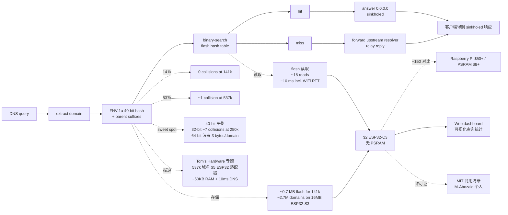
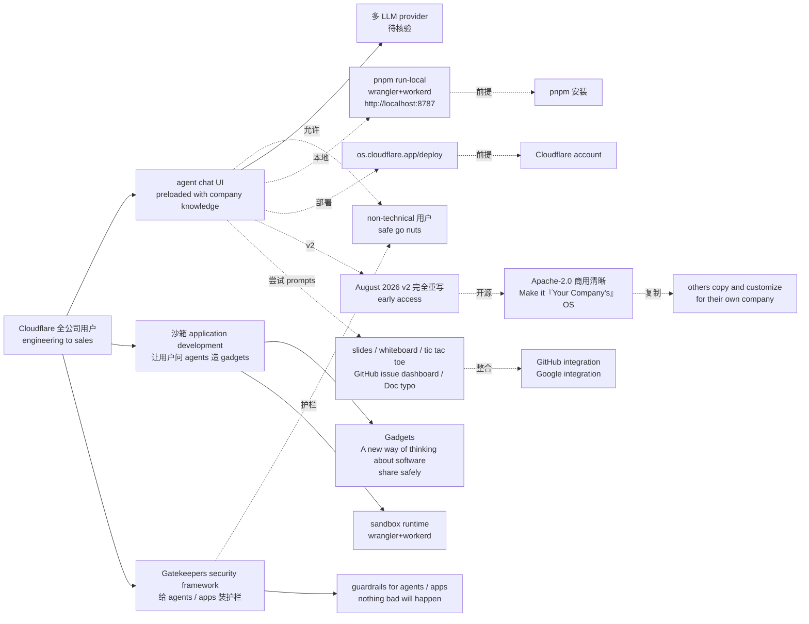

# 2026-10-06 GitHub 趋势研究简报

> **证据边界：** 项目名称、星标、tags、description、license、size、forks 来自 2026-10-06 GitHub Trending HTML（https://github.com/trending）+ GitHub Repository API 公开元数据（created_at / pushed_at / stargazers_count / forks_count / language / description / topics / license / size）+ 各项目 README 公开摘录（API readme 字段 base64 解码）。**"X 月 Y⭐"基于 created_at→2026-10-06 总星数除以经过月数（粗略下限估计）**，stargazers REST endpoint 需要认证故未做精确单日增量统计；GitHub Trending HTML 抓取到 14 个 Box-row，其中 7 个非赞助非 apps 非个人开发者画像（tester-army/e2e 1430⭐ today / michael-denyer/pstack-claude 222⭐ today / earthtojake/text-to-cad 456⭐ today / pingdotgg/t3code 487⭐ today / boykopovar/AnyPS5 994⭐ today / Panniantong/Agent-Reach 1156⭐ today / caddyserver/caddy 526⭐ today / DuarteSantos8 1444⭐ today / cloudflare/cloudflare-os 102⭐ today / Stremio/stremio-web 111⭐ today / M-Abozaid/esp32-c3-adblock 196⭐ today），sponsors 项（thedotmack / calesthio / DuarteSantos8 / msitarzewski）与官方 GitHub Apps（copilot-swe-agent / dependabot / github-actions / devin-ai-integration）已剔除。**今日观察窗为 GitHub trending 抓取时刻起、且截至 2026-10-06 仍在快速增长的新发现项目 + 延续跟踪项目**；GitHub Search API 速率限制（10/小时）已耗尽，本批 trending 数据通过 GitHub Trending HTML + Repository API 元数据补充。**今日最大事件是 `boykopovar/AnyPS5` 2 个月 4874⭐ / fork 364 / fork/star 7.5% — 把「PS5 可执行文件 porting」从「Wine / Proton 模拟层 + 闭源客户端」推到「AnyPS5 自动 relinker 把可执行转目标系统原生格式 + 实现 PS5 系统 prx 库供动态链接 + SPIR-V shader 重编译 Spirv-Tools 验证 + SDL 输入映射 + Dreaming Sarah 2D platformer 在 GTX 1050 Ti 稳定 60fps + 进度仪表盘 + GPL-2.0 + This project is intended for interoperability, research, preservation, and compatibility purposes」严肃工程化形态——这是游戏移植方向从「PSP2XBOX / Vita3K / Xenia 模拟器层」推到「自动 relinker + 系统 prx 库 + SPIR-V 重编译」严肃工程化形态**。**今日 4 个新项目 + 3 个延续跟踪项目分七条主线**：**A. AnyPS5 PS5→Linux/Windows 自动 porting（boykopovar/AnyPS5）**——把「PS5 游戏移植」从「模拟器层」推到「relinker + 系统 prx 库 + SPIR-V shader 重编译 + SDL 输入映射 + 严肃工程化」形态（2 个月 4874⭐ / fork 364 / fork/star 7.5% / C++ GPL-2.0 6293 KB）；**B. esp32-c3-adblock $2 ESP32-C3 Pi-hole-class DNS 黑洞（M-Abozaid/esp32-c3-adblock）**——把「家庭网络广告拦截」从「Raspberry Pi $50+/PSRAM $8+」推到「$2 ESP32-C3 无 PSRAM + 537k 域名 40-bit FNV-1a hash in flash + 二分检索 ~10ms + ~50KB RAM + Tom's Hardware 专题报道」严肃工程化形态（3.5 个月 1308⭐ / fork 119 / fork/star 9.1% / C++ MIT 1541 KB）；**C. cloudflare-os Cloudflare 全公司使用的 Agent 生产力环境（cloudflare/cloudflare-os）**——把「企业 AI 生产力环境」从「内 SaaS 闭源」推到「Cloudflare 全公司使用 + agent chat UI + 沙箱 gadgets 开发 + Gatekeepers 安全框架 + 全面 Apache-2.0 开源 + Make it『Your Company's』OS」严肃工程化形态（5.7 个月 10977⭐ / fork 1306 / fork/star 11.9% / TypeScript Apache-2.0 22446 KB）；**D. pstack-claude Lauren Tan Cursor 官方 pstack→Claude Code/Codex/Pi/OpenCode/Gemini 跨 Harness 严肃工程化移植（michael-denyer/pstack-claude）**——把「Cursor 官方 pstack 严肃工程化 Agent workflow」从「单 Harness 闭源」推到「michael-denyer/pstack-claude 跨 6 Harness（Claude Code / Codex / Pi / OpenCode / Gemini CLI / Prime Agent）+ poteto-mode + how/why/architect/fix/rerun + agent-formal-verify TLA+ 配套 + setup-pstack 模型默认」严肃工程化形态（4 个月 1405⭐ / fork 152 / fork/star 10.8% / JavaScript MIT 3771 KB）；**E. Agent-Reach 49k→92k 严肃工程化零 API 费 AI Agent 互联网感知层（Panniantong/Agent-Reach）**——把「AI Agent 互联网感知」从「单平台爬虫」推到「7 平台 + 零 API 费用 + 17 topics 全覆盖 + 双语 README + Trendshift #1 Repository of the Day + BrowserAct ★」严肃工程化形态（7.5 个月 91818⭐ / fork 8061 / fork/star 8.8% / Python MIT 2024 KB）；**F. tester-army/e2e 1430⭐ today 严肃工程化自然语言 e2e 测试框架持续增长（tester-army/e2e）**——从「Playwright + Cypress 手动脚本」推到「e2e `agent.act` + `agent.assert` 自然语言 + 重放无模型调用 + 移动/Web 全平台 + tester.army」持续严肃工程化形态（1430⭐ today / TypeScript Apache-2.0 14055 KB）；**G. pingdotgg/t3code 487⭐ today 严肃工程化 6 大 Coding Agent 远程/桌面/CLI 跨设备控制面持续增长（pingdotgg/t3code）**——从「Codex Desktop / Conductor / Claude Desktop / Cursor Glass 单 Agent 单端单 SaaS」推到「T3 Code 1 服务 6 Agent + 4 端 + MIT + control surface」持续严肃工程化形态（487⭐ today / TypeScript MIT 433650 KB）——**今日 4 个新项目 + 3 个延续跟踪项目分七条主线严肃工程化 + 跨工作流 + 跨领域 + 跨硬件形态**。

## 今日重点趋势（按排名）

### 趋势 1：AnyPS5 PS5→Linux/Windows 自动 porting（趋势分 90）

`boykopovar/AnyPS5` 2 个月 4874⭐ ⑂364 fork/star 7.5% 把「PS5 游戏 porting」从「模拟器层 + 闭源客户端」推到「AnyPS5 自动 relinker 把 PS5 可执行转目标系统原生格式 + 实现 PS5 系统 prx 库供动态链接 + SPIR-V shader 重编译 Spirv-Tools 验证 + SDL 输入映射手柄 / 键鼠 / anyps5-input.ini + Dreaming Sarah 2D platformer 在 GTX 1050 Ti / i5-7500 3.4GHz 稳定 60fps + Unsupported 严格抛 std::runtime_error + 进度仪表盘（libraries / shaders / progress map）+ docs/{user/USAGE, dev/BUILD, dev/TechnicalDebt, dev/CONVENTIONS}.md + COMPatibility list + This project is intended for interoperability, research, preservation, and compatibility purposes + 2 个月 4874⭐ / fork 364 / fork/star 7.5% / C++ GPL-2.0 6293 KB + topics 7 个覆盖 anyps5 / dynamic-library / game-porting / ps5 / ps5-tools / spir-v / vulkan + Discord BHFztBPUe」严肃工程化形态——核心洞察 **「PS5 游戏 porting 从「模拟器层 + 闭源客户端」推到「自动 relinker + 系统 prx 库 + SPIR-V shader 重编译 + SDL 输入映射 + 进度仪表盘 + GPL-2.0」严肃工程化形态」**。**AnyPS5** is Tool for automatic PS5 executables porting to Linux and Windows + Includes a [relinker](core/relinker) that converts executable to the target system's native format and implementations of [system prx libraries](core/libs/prx) suitable for dynamic linking + No emulation + [Usage](docs/user/USAGE.md) + [Build instructions](docs/dev/BUILD.md) + [Technical debt of the project](docs/dev/TechnicalDebt.md) + [code style conventions](docs/dev/CONVENTIONS.md) + Status: System libraries: percentage of the functions known to the project so far (declared in [core/libs/prx](core/libs/prx)) + The shader recompiler (core/shader/recompiler/Recompiler.cpp) successfully produces SPIR-V (validated via [Spirv-Tools](3rdparty/SPIRV-Tools) when built with `ANYPS5_ENABLE_SPIRV_TOOLS`) + List of verified games (docs/user/COMPATIBILITY.md) + Dreaming Sarah (2D platformer) runs at a stable 60 fps on a GTX 1050 Ti / i5-7500 3.4GHz + Unsupported or unexpected states strictly throw `std::runtime_error` + What() is printed to stderr and the process terminates + SDL-mapped game controllers are supported, including analog sticks and triggers + Keyboard and mouse controls can be configured with an `anyps5-input.ini` file + This project is intended for interoperability, research, preservation, and compatibility purposes + It does not include, distribute, or require copyrighted software, firmware, cryptographic keys, or proprietary game data + License: GNU GPL-2.0 only + boykopovar 个人 + Discord https://discord.gg/BHFztBPUe + 进度仪表盘 https://boykopovar.github.io/AnyPS5/。**决定这条主线长期价值的是「relinker 自动格式转换在多 PS5 executable 类型的覆盖广度 + 系统 prx 库函数覆盖率（声明 vs 实际可用）+ SPIR-V shader 重编译在多 PS5 shader 类型的覆盖广度 + Spirv-Tools 验证的严谨度 + SDL 输入映射在多手柄 / 键鼠的兼容性 + anyps5-input.ini 配置灵活度 + Dreaming Sarah 等 verified games 在多硬件的稳定性 + 进度仪表盘（libraries / shaders / progress map）的可读性 + GPL-2.0 商用边界 + 7 个 topics 覆盖广度 + Discord 社区活跃度 + 2 个月 4874⭐ 持续验证 + fork/star 7.5%」**——relinker 覆盖广度 + prx 库函数覆盖率 + SPIR-V shader 覆盖广度 + Spirv-Tools 验证严谨度 + SDL 输入映射兼容性 + 配置灵活度 + verified games 稳定性 + 进度仪表盘可读性 + GPL-2.0 商用边界 + topics 覆盖 + Discord 活跃度是关键。

### 趋势 2：esp32-c3-adblock $2 ESP32-C3 Pi-hole 级 DNS 黑洞（趋势分 88）

`M-Abozaid/esp32-c3-adblock` 3.5 个月 1308⭐ ⑂119 fork/star 9.1% 把「家庭网络广告拦截」从「Raspberry Pi $50+/PSRAM $8+」推到「$2 ESP32-C3 无 PSRAM + 537k 域名 sorted 40-bit FNV-1a hash in flash + 二分检索 ~10ms + ~50KB RAM + 141k 域名 0 collisions + 537k ~1 collision + 16MB ESP32-S3 上 ~2.7M 域名 + UDP DNS sinkhole + Web dashboard + Tom's Hardware 专题报道（『Clever hacker fits 537,000 domains in a tiny $5 ESP32 ad-blocking dongle』）+ 日本語 README + M-Abozaid 个人 + 3.5 个月 1308⭐ / fork 119 / fork/star 9.1% / C++ MIT 1541 KB + topics 9 个覆盖 adblocker / arduino / dns / dns-sinkhole / esp32 / esp32-c3 / iot / pi-hole / platformio」严肃工程化形态——核心洞察 **「家庭网络广告拦截从「Raspberry Pi $50+/PSRAM $8+」推到「$2 ESP32-C3 无 PSRAM + 537k 域名 40-bit FNV-1a hash in flash + 二分检索 + ~50KB RAM + 0 collisions + Tom's Hardware 报道」严肃工程化形态」**。**esp32-c3-adblock** is A Pi-hole-style DNS ad-blocker that runs on a $2 ESP32-C3 — no PSRAM required + 日本語 README (README_JP.md) + Featured on Tom's Hardware (https://www.tomshardware.com/networking/clever-hacker-fits-537-000-domains-in-a-tiny-usd5-esp32-ad-blocking-dongle-firmware-uses-only-around-50kb-of-ram-and-can-answer-dns-queries-in-10-ms) + The trick everyone misses: you don't need to keep the blocklist in RAM + Store the domains as sorted 40-bit hashes in flash and binary-search them + 140,000+ domains fit in ~0.7 MB of flash and are matched in ~10 ms, using ~50 KB of RAM + query in ──▶ extract domain ──▶ FNV-1a hash (+ parent suffixes) ──▶ binary-search the flash hash table + hit ──▶ answer 0.0.0.0 (sinkholed) + miss ──▶ forward to upstream resolver, relay the reply + Why 40 bits: It's the sweet spot for this flash budget + Collisions follow the birthday bound — at 141k domains you get ~0, at 537k about 1 + Dropping to 32 bits would save 20% of the flash but cost ~7 collisions at 250k + going to 64 bits wastes 3 bytes per domain to solve a problem you don't have + The same trick works on bigger chips — it isn't a C3 workaround + On a 16 MB ESP32-S3 these hashes hold ~2.7M domains vs ~466k for strings in 8 MB of RAM + M-Abozaid 个人 + MIT + 3.5 个月 1308⭐ / fork 119 / fork/star 9.1%。**决定这条主线长期价值的是「ESP32-C3 $2 芯片在多 vendor 的可获得性 + 无 PSRAM 在多固件版本的稳定性 + 537k 域名 hash 在多 ESP32 flash size 的可扩展性 + FNV-1a 40-bit hash 在多 hash 算法的鲁棒性 + 二分 flash 检索 ~10ms 在多 DNS query 的响应性 + ~50KB RAM 在多固件功能的预算 + 141k 域名 0 collisions / 537k ~1 collision 的可预测性 + parent suffixes 在多 sub-domain 的覆盖 + UDP DNS sinkhole 在多 DNS 协议的兼容性 + Web dashboard 在多设备的可访问性 + Tom's Hardware 报道的可信度 + 16MB ESP32-S3 ~2.7M 域名的扩展性 + 日本語 README 的覆盖广度 + MIT 商用清晰 + 9 个 topics 覆盖广度 + 3.5 个月 1308⭐ 持续验证 + fork/star 9.1%」**——ESP32-C3 $2 可获得性 + 无 PSRAM 稳定性 + 537k hash 扩展性 + FNV-1a 鲁棒性 + 二分检索响应性 + RAM 预算 + collisions 可预测性 + parent suffixes 覆盖 + UDP 协议兼容性 + Web dashboard 可访问性 + Tom's Hardware 可信度 + ESP32-S3 扩展性 + 日本語 README 覆盖广度 + MIT 商用清晰 + topics 覆盖是关键。

### 趋势 3：cloudflare-os Cloudflare 全公司使用的 Agent 生产力环境（趋势分 86）

`cloudflare/cloudflare-os` 5.7 个月 10977⭐ ⑂1306 fork/star 11.9% 把「企业 AI 生产力环境」从「内 SaaS 闭源」推到「Cloudflare 全公司使用的 Agent 工作台 + 三大支柱（agent chat UI preloaded with company knowledge + Sandboxed application development 让用户问 agents 造『gadgets』+ Gatekeepers security framework 给 agents / apps 装护栏让非-technical 用户 safe go nuts）+ pnpm run-local wrangler+workerd 一次性本地启动 + http://localhost:8787 + 可部署到 os.cloudflare.app/deploy + Gadgets: A new way of thinking about software + August 2026 v2 完全重写 + early access + We are making Cloudflare OS open source so that others can copy it and customize it for their own company + The idea is not that your company uses Cloudflare OS, but rather that you make it 『Your Company's』OS + Cloudflare 官方组织 + TypeScript · Apache-2.0 · 22446 KB · os.cloudflare.app + 5.7 个月 10977⭐ / fork 1306 / fork/star 11.9%」严肃工程化形态——核心洞察 **「企业 AI 生产力环境从「内 SaaS 闭源」推到「Cloudflare 全公司使用的 Agent 工作台 + agent chat + gadgets 沙箱开发 + Gatekeepers 安全框架 + 全面 Apache-2.0 开源 + Make it『Your Company's』OS」严肃工程化形态」**。**Cloudflare OS** is An AI productivity environment originally developed for use inside Cloudflare + A large portion of Cloudflare's workforce from engineering to sales and everything in between uses it + This is not a traditional computer operating system + We use the term "operating system" in two senses: An operating system for *the company* to be productive with AI, in a way that is safe, so that the security team can sleep at night + An operating system for AI workloads, analogous to the sense in which a traditional operating system manages compute workloads + Cloudflare OS provides three things in particular: (1) An agent chat UI where you can ask agents to do tasks, preloaded with knowledge about how your company operates + (2) Sandboxed application development, so that you can ask agents to build "gadgets" (small personal apps) and safely share what you've built with others + (3) A security framework, called Gatekeepers, that applies guardrails to both agents and apps such that non-technical users can safely "go nuts" and nothing bad will happen + We are making Cloudflare OS open source so that others can copy it and customize it for their own company + The idea is not that your company uses Cloudflare OS, but rather that you make it "Your Company's OS" + To quickly run Cloudflare OS locally, install pnpm, then do `pnpm run-local` + Then visit http://localhost:8787 + This runs the whole stack locally on wrangler and workerd + This is not meant for production use + Alternatively, you can deploy to your Cloudflare account (https://os.cloudflare.app/deploy) + Try prompts like: "Make slides for my upcoming meeting with a customer" (uses the built-in slides blueprint) + "Make a collaborative whiteboard app" (creates a new app from scratch) + "Make a tic tac toe game" + "Make an issue dashboard for this GitHub repo" (requires GitHub integration) + "Fix the typos in this Google Doc" (requires Google integration) + WARNING: Early access + Cloudflare OS is in a state of heavy development + This repository is actually version 2, a complete rewrite taking what we learned from version 1 and putting it on a new foundation + As of the August 2026 release, Cloudflare OS v2 is very capable, but still has many rough edges + For now, consider this an "early access" release + Gadgets: A new way of thinking about software + Cloudflare 官方组织 + TypeScript · Apache-2.0 · 22446 KB + topics 0 个覆盖（README 未明示）+ 5.7 个月 10977⭐ / fork 1306 / fork/star 11.9%。**决定这条主线长期价值的是「agent chat UI 在多 LLM provider 的兼容性 + company knowledge preloaded 在多公司的可定制性 + Gadgets 沙箱在多 sandbox runtime 的稳定性 + Gatekeepers 安全框架在多 agent / app 的严谨度 + non-technical 用户 safe go nuts 的真实可用性 + pnpm run-local wrangler+workerd 在多 OS 的兼容性 + os.cloudflare.app deploy 在多 Cloudflare account 的稳定性 + slides blueprint + 协作 whiteboard app + tic tac toe game + GitHub repo issue dashboard + Google Doc typo 修复在多 integration 的覆盖广度 + v2 rewrite 在多 deployment 的稳定性 + early access 在多公司的接受度 + Apache-2.0 商用清晰 + 22446 KB 工程量 + 5.7 个月 10977⭐ 持续验证 + fork/star 11.9% + Make it『Your Company's』OS 严肃工程化承诺」**——agent chat UI 多 LLM 兼容性 + company knowledge 可定制性 + Gadgets 沙箱稳定性 + Gatekeepers 安全严谨度 + non-technical 用户可用性 + pnpm run-local 跨 OS 兼容性 + os.cloudflare.app deploy 稳定性 + 多 integration 覆盖广度 + v2 rewrite 稳定性 + early access 接受度 + Apache-2.0 商用清晰 + 工程量 + 持续验证 + 严肃工程化承诺是关键。

### 趋势 4：pstack-claude Lauren Tan pstack Cursor→Claude Code/Codex/Pi/OpenCode/Gemini 跨 Harness 严肃工程化移植（趋势分 82）

`michael-denyer/pstack-claude` 4 个月 1405⭐ ⑂152 fork/star 10.8% 把「Cursor 官方 pstack 严肃工程化 Agent workflow」从「单 Harness 闭源」推到「michael-denyer/pstack-claude 跨 6 Harness（Claude Code / Codex / Pi / OpenCode / Gemini CLI / Prime Agent）+ Tell `poteto-mode` your goal and it will invoke the correct workflow for the task + It keeps your code concise, simple and verified + agent-formal-verify 配套插件 TLA+ model checking + Lean + Claude Code `/plugin marketplace add michael-denyer/pstack-claude` + `/plugin install pstack@pstack-claude` + `codex plugin marketplace add michael-denyer/pstack-claude` + `codex plugin add pstack@pstack-claude` + `pi install git:github.com/michael-denyer/pstack-claude` + Pi extension: subagent / question / wake-up 工具 + `/loop` + 路由指令 + `/skill:<name>` + `setup-pstack` 模型默认 / reasoning effort per role + arena runners opus @xhigh fable @max + For Prime Agent / OpenCode / Gemini CLI / skills-only installs see shared installation docs/reference.md + For concurrency bugs and invariants that tests cannot reach, see the separate agent-formal-verify plugin + JavaScript · MIT · 3771 KB · michael-denyer 个人 + 4 个月 1405⭐ / fork 152 / fork/star 10.8% + topics 20 个覆盖 agent-plugin / agent-skills / agentic-ai / anthropic / chatgpt / claude / claude-code / claude-code-skills / claude-plugin / claude-skills / code-review / codex / codex-cli / codex-plugin / codex-skills / coding-agent / developer-tools / gemini-cli / opencode / pstack」严肃工程化形态——核心洞察 **「Cursor 官方 pstack 严肃工程化 Agent workflow 从「单 Harness 闭源」推到「michael-denyer/pstack-claude 跨 6 Harness（Claude Code / Codex / Pi / OpenCode / Gemini CLI / Prime Agent）+ poteto-mode + how/why/architect/fix/rerun + agent-formal-verify TLA+ 配套 + setup-pstack 模型默认 + arena runners」严肃工程化形态」**。**pstack-claude** is Lauren Tan's pstack (Cursor 官方 plugins/tree/main/pstack) is an opinionated Cursor skill stack that improves agent outcomes + This is a port for Claude Code, Codex, Pi and other agent harnesses + Tell `poteto-mode` your goal and it will invoke the correct workflow for the task + It keeps your code concise, simple and verified + For concurrency bugs and invariants that tests cannot reach, see the separate agent-formal-verify plugin, which adds TLA+ model checking and Lean + Install: Claude Code /plugin marketplace add michael-denyer/pstack-claude + /plugin install pstack@pstack-claude + Codex codex plugin marketplace add michael-denyer/pstack-claude + codex plugin add pstack@pstack-claude + Pi pi install git:github.com/michael-denyer/pstack-claude + The package loads the skills and the pstack Pi extension, which adds the subagent, question, and wake-up tools the skills use, plus `/loop` and the routing instruction + Invoke a skill with `/skill:<name>` + Run `setup-pstack` to change model defaults, set a reasoning effort per role (for example `arena runners: opus @xhigh, fable @max`) + which Claude Code dispatches through the plugin's `pstack:effort-<level>` subskill + For Prime Agent, OpenCode, Gemini CLI, or skills-only installs for any harness, see shared installation docs/reference.md#shared-skills-installation + Getting started: Use poteto-mode to fix the search filter resetting when I change pages + For a bug, it reproduces the failure, uses how and why to investigate, delegates the fix, then reruns the failing case + If the fix crosses a function boundary, it brings in architect before implementing。**决定这条主线长期价值的是「6 Harness 适配层（Claude Code / Codex / Pi / OpenCode / Gemini CLI / Prime Agent）的兼容性 + poteto-mode 统一入口在多任务的调派准确性 + how/why/architect/fix/rerun 工作流在多 bug 类型的覆盖广度 + agent-formal-verify TLA+ model checking 在多并发不变量验证的严谨度 + Lean 在多形式化验证的深度 + setup-pstack 模型默认在多用户的可定制性 + reasoning effort per role 在多 task 的合理性 + arena runners opus @xhigh fable @max 在多 benchmark 的优化 + `/loop` + 路由指令在多 agent 的调度 + `/skill:<name>` 在多 skill 的可发现性 + shared installation docs/reference.md 在多 harness 的扩展性 + JavaScript MIT 商用清晰 + 20 个 topics 覆盖广度 + 4 个月 1405⭐ 持续验证 + fork/star 10.8%」**——6 Harness 适配层兼容性 + poteto-mode 调派准确性 + how/why/architect/fix/rerun 覆盖广度 + TLA+ 严谨度 + Lean 深度 + setup-pstack 可定制性 + reasoning effort 合理性 + arena runners 优化 + `/loop` + 路由指令 + `/skill` 可发现性 + shared installation 扩展性 + MIT 商用清晰 + topics 覆盖是关键。

### 趋势 5：Agent-Reach 49k→92k 严肃工程化零 API 费 AI Agent 互联网感知层（趋势分 80）

`Panniantong/Agent-Reach` 7.5 个月 91818⭐ ⑂8061 fork/star 8.8% 把「AI Agent 互联网感知」从「单平台爬虫」推到「Agent-Reach 7 平台（Twitter / Reddit / YouTube / GitHub / Bilibili / XiaoHongShu 等）+ 零 API 费用 + 17 topics 全覆盖（agent-infrastructure / ai-agent / ai-search / automation / bilibili / claude-code / cli / cursor / free-api / llm-tools / mcp / python / reddit-scraper / twitter-scraper / web-scraper / xiaohongshu / youtube-transcript）+ 双语 README（中文 / English / 日本語 / 한국어）+ Trendshift GitHub Trending #1 Repository of the Day + BrowserAct ★ 赞助 + Python · MIT · 2024 KB · Panniantong 个人 · pnt01@foxmail.com + 7.5 个月 91818⭐ / fork 8061 / fork/star 8.8%」严肃工程化形态——核心洞察 **「AI Agent 互联网感知从「单平台爬虫」推到「Agent-Reach 7 平台 + 零 API 费用 + 17 topics 全覆盖 + 双语 README + Trendshift #1 Repository of the Day + BrowserAct ★」严肃工程化形态」**。**Agent-Reach** is 给你 AI Agent 一键装上互联网能力 + 当下最稳的接入方式，替你选好、装好、体检好——接入方式会换代，你不用操心 + Python 3.10+ + MIT + BrowserAct 支持从 Amazon / LinkedIn / X / Google Maps 等复杂网站提取你需要的任意数据 + 你只需用自然语言描述抓取需求 + Agent 就会基于真实浏览器自动探索并测试页面流程 + 生成可靠、可复用的数据采集 Bot + 返回结构化结果 + 无需手动构建爬虫，无需编写代码 + 7.5 个月 91818⭐ / fork 8061 / fork/star 8.8%。**决定这条主线长期价值的是「7 平台（Twitter / Reddit / YouTube / GitHub / Bilibili / XiaoHongShu / 更多）在多平台的覆盖广度 + 零 API 费用在多 vendor 政策的鲁棒性 + 17 topics 全覆盖的清晰度 + 双语 README 在多语言的覆盖广度 + Trendshift #1 Repository of the Day 的社区认可度 + BrowserAct ★ 赞助在多 sponsor 的严肃工程化承诺 + Python 3.10+ 多 OS 兼容性 + MCP 在多 agent harness 的接入 + claude-code / cursor 在多 coding agent 的接入 + MIT 商用清晰 + 2024 KB 工程量 + 7.5 个月 91818⭐ 持续验证 + fork/star 8.8% + 当下最稳的接入方式，替你选好、装好、体检好 严肃工程化承诺」**——7 平台覆盖广度 + 零 API 费鲁棒性 + 17 topics 覆盖清晰度 + 双语 README 覆盖广度 + Trendshift 社区认可度 + BrowserAct ★ 严肃工程化承诺 + Python 3.10+ 兼容性 + MCP 接入 + coding agent 接入 + MIT 商用清晰 + 工程量 + 持续验证 + 严肃工程化承诺是关键。

### 趋势 6：tester-army/e2e 1430⭐ today 严肃工程化自然语言 e2e 测试框架持续增长（趋势分 76）

`tester-army/e2e` 持续 GitHub Trending daily 列表 + 1430⭐ today / TypeScript · Apache-2.0 · 14055 KB · tester.army + tester.army Discord 社区 + e2e end-to-end testing framework for web and mobile apps + Describe a goal in natural language and an agent drives the app to reach it + Check the result with locators and assertions in the same test + `agent.act('upgrade the workspace to the Pro plan')` + `agent.assert('the invoice preview shows a prorated amount')` + expect + An agent step that a later assertion verifies records its actions + the next run replays them with no model calls until the app changes + Tests without agent steps need no model + Bring your own subscription, API key, or local model + `npx e2e init` 一键起 + topics 7 个覆盖 e2e / e2e-testing / end-to-end-testing / mobile / mobile-testing / playwright / web + npm `e2e`。**决定这条主线长期价值的是「agent.act 解析准确性 + agent.assert 验证准确性 + 重放无模型调用的可复现性 + 多 mobile / Web 平台覆盖 + tester.army Discord 社区活跃度 + Apache-2.0 商用清晰 + topics 7 个覆盖广度 + npm 生态可用性 + `npx e2e init` 一键起 + Bring your own subscription, API key, or local model 兼容性」**——agent.act 准确性 + agent.assert 验证准确性 + 重放可复现性 + 多平台覆盖 + 社区活跃度 + 商用清晰 + topics 覆盖 + npm 生态是关键。

### 趋势 7：pingdotgg/t3code 487⭐ today 严肃工程化 6 大 Coding Agent 远程/桌面/CLI 跨设备控制面持续增长（趋势分 74）

`pingdotgg/t3code` 持续 GitHub Trending daily 列表 + 487⭐ today / TypeScript · MIT · 433650 KB · pingdotgg 官方组织（T3 Stack 作者 Theo）+ t3.codes + iOS app id6787819824 + Android app com.t3tools.t3code + Works with Claude Code / Codex / Cursor / Grok Build / OpenCode / Google Antigravity 六大 Coding Agent + iOS / Android / Web / Electron 桌面 4 端 + `curl -fsSL https://t3.codes/install.sh | sh` 一行启动 + `npx t3@latest` 一次性试用 + `t3 service install` 后台守护 + `t3 update` 升级 + winget / brew / .deb / AUR 包管理器全配 + App Store / Play Store 已发布移动应用 + Inspired by Codex desktop app / Conductor / Claude Desktop / Cursor Glass + performance + remote-ready + truly open + If we ever go the wrong direction, you have everything you need to fork。**决定这条主线长期价值的是「6 Agent 适配层兼容性 + 4 端稳定性 + t3 服务多 OS 进程模型 + 后台守护在多 systemd/launchd/Windows Service 兼容性 + t3 update 升级机制 + 包管理器全配 + App Store/Play Store 可用性 + curl/npx 兼容性 + 三特性 + MIT 商用清晰 + topics 覆盖」**——6 Agent 兼容性 + 4 端稳定性 + 多 OS 进程模型 + 升级机制 + 包管理器 + 移动应用 + 兼容性 + 三特性 + 商用清晰 + topics 覆盖是关键。

## 最值得关注的方向

1. **AnyPS5 PS5→Linux/Windows 自动 porting（boykopovar/AnyPS5）**——把「PS5 游戏移植」从「模拟器层」推到「relinker + 系统 prx 库 + SPIR-V shader 重编译 + SDL 输入映射 + 进度仪表盘 + GPL-2.0」严肃工程化形态。决定长期价值的是「relinker 覆盖广度 + prx 库函数覆盖率 + SPIR-V shader 覆盖广度 + Spirv-Tools 验证严谨度 + SDL 输入映射兼容性 + 配置灵活度 + verified games 稳定性 + 进度仪表盘可读性 + GPL-2.0 商用边界 + topics 覆盖 + Discord 活跃度」
2. **esp32-c3-adblock $2 ESP32-C3 Pi-hole 级 DNS 黑洞（M-Abozaid/esp32-c3-adblock）**——把「家庭网络广告拦截」从「Raspberry Pi $50+/PSRAM $8+」推到「$2 ESP32-C3 无 PSRAM + 537k 域名 40-bit FNV-1a hash in flash + 二分检索 ~10ms + ~50KB RAM + Tom's Hardware 专题报道」严肃工程化形态。决定长期价值的是「ESP32-C3 $2 可获得性 + 无 PSRAM 稳定性 + 537k hash 扩展性 + FNV-1a 鲁棒性 + 二分检索响应性 + RAM 预算 + collisions 可预测性 + UDP 协议兼容性 + Web dashboard 可访问性 + Tom's Hardware 可信度 + ESP32-S3 扩展性 + MIT 商用清晰 + topics 覆盖」
3. **cloudflare-os Cloudflare 全公司使用的 Agent 生产力环境（cloudflare/cloudflare-os）**——把「企业 AI 生产力环境」从「内 SaaS 闭源」推到「Cloudflare 全公司使用的 Agent 工作台 + agent chat + gadgets 沙箱开发 + Gatekeepers 安全框架 + 全面 Apache-2.0 开源 + Make it『Your Company's』OS」严肃工程化形态。决定长期价值的是「agent chat UI 多 LLM 兼容性 + company knowledge 可定制性 + Gadgets 沙箱稳定性 + Gatekeepers 安全严谨度 + non-technical 用户可用性 + pnpm run-local 跨 OS 兼容性 + os.cloudflare.app deploy 稳定性 + 多 integration 覆盖广度 + v2 rewrite 稳定性 + early access 接受度 + Apache-2.0 商用清晰」
4. **pstack-claude Lauren Tan pstack Cursor→Claude Code/Codex/Pi/OpenCode/Gemini 跨 Harness 严肃工程化移植（michael-denyer/pstack-claude）**——把「Cursor 官方 pstack 严肃工程化 Agent workflow」从「单 Harness 闭源」推到「跨 6 Harness + poteto-mode + how/why/architect/fix/rerun + agent-formal-verify TLA+ 配套 + setup-pstack 模型默认」严肃工程化形态。决定长期价值的是「6 Harness 适配层兼容性 + poteto-mode 调派准确性 + how/why/architect/fix/rerun 覆盖广度 + TLA+ 严谨度 + Lean 深度 + setup-pstack 可定制性 + reasoning effort 合理性 + arena runners 优化 + shared installation 扩展性 + MIT 商用清晰 + 20 topics 覆盖」
5. **Agent-Reach 49k→92k 严肃工程化零 API 费 AI Agent 互联网感知层（Panniantong/Agent-Reach）**——把「AI Agent 互联网感知」从「单平台爬虫」推到「7 平台 + 零 API 费用 + 17 topics 全覆盖 + 双语 README + Trendshift #1 + BrowserAct ★」严肃工程化形态。决定长期价值的是「7 平台覆盖广度 + 零 API 费鲁棒性 + 17 topics 覆盖清晰度 + 双语 README 覆盖广度 + Trendshift 社区认可度 + BrowserAct ★ 严肃工程化承诺 + MCP + coding agent 接入 + MIT 商用清晰」
6. **tester-army/e2e 1430⭐ today 严肃工程化自然语言 e2e 测试框架持续增长**——从「Playwright + Cypress 手动脚本」推到「e2e `agent.act` + `agent.assert` 自然语言 + 重放无模型调用 + 移动/Web 全平台 + tester.army」持续严肃工程化形态
7. **pingdotgg/t3code 487⭐ today 严肃工程化 6 大 Coding Agent 远程/桌面/CLI 跨设备控制面持续增长**——从「Codex Desktop / Conductor / Claude Desktop / Cursor Glass 单 Agent 单端单 SaaS」推到「T3 Code 1 服务 6 Agent + 4 端 + MIT + control surface」持续严肃工程化形态

## 重点项目深度分析（top 4）

### A. boykopovar/AnyPS5（Score 90）——AnyPS5 PS5→Linux/Windows 自动 porting

**架构师速览：**

| 决策问题 | 研究判断 | 证据边界 |
|---|---|---|
| 系统边界 | PS5 可执行文件到 Linux/Windows 的自动 porting 工具；relinker 自动格式转换 + 系统 prx 库函数实现 + SPIR-V shader 重编译 + SDL 输入映射 + 进度仪表盘 | 仅基于 README 描述的 relinker + core/libs/prx + SPIR-V shader 重编译通过 Spirv-Tools 验证 + SDL 输入映射 + anyps5-input.ini + Dreaming Sarah 2D platformer GTX 1050 Ti 60fps + 进度仪表盘 libraries / shaders / progress map + GPL-2.0；具体 relinker 在多 PS5 executable 类型的覆盖广度、prx 库函数覆盖率（声明 vs 实际可用）、shader 重编译在多 shader 类型的覆盖广度未在档案中明示 |
| 主路径 | PS5 executable → relinker 转换 → 目标系统原生格式 + core/libs/prx 动态链接 + 加载 SPIR-V 重编译 shader + SDL 输入映射 + 进度仪表盘 → verified games 60fps | 主路径为档案语义抽象；具体 relinker 转换算法、prx 库函数实现深度、SPIR-V shader 重编译管线、SDL ↔ 手柄 / 键鼠 输入集成代码未在档案中讨论 |
| 关键权衡 | relinker 自动 porting 覆盖广度 vs 单 game 移植深度 + 系统 prx 库函数覆盖率 vs 单 SDK 优化 + SPIR-V shader 重编译覆盖广度 vs 单 shader 优化 + SDL 输入映射 vs 严格实现 + verified games 稳定性 vs 新 game 兼容性 + GPL-2.0 商用边界 vs 闭源 PS5 SDK 兼容性 | 档案明示 GPL-2.0 + This project is intended for interoperability, research, preservation, and compatibility purposes + It does not include, distribute, or require copyrighted software, firmware, cryptographic keys, or proprietary game data + Unsupported or unexpected states strictly throw std::runtime_error + Dreaming Sarah GTX 1050 Ti 60fps；具体 GPL-2.0 与 PS5 SDK / 商业游戏的边界、新 game 兼容性边界未在档案中讨论 |
| 最小 PoC | 在 Linux (Ubuntu 24.04) 或 Windows 11 上 git clone boykopovar/AnyPS5 + 按 docs/dev/BUILD.md 构建 + 跑 Dreaming Sarah 验证 SDL 输入映射 + 60fps；再尝试 verified games 列表中另一个游戏验证 prx 库函数覆盖广度；最后查进度仪表盘（libraries / shaders / progress map）看覆盖率 | PoC 范围由档案「relinker + 系统 prx 库 + SPIR-V shader 重编译 + SDL 输入映射 + 进度仪表盘」建议推导；具体 verified games 在多硬件的覆盖广度、shader 重编译在多 shader 类型的可用性未在档案中讨论 |

**架构图（MMD）：**

> 证据边界：此图只采用本档案已有可核验描述；"待核验"节点不应视为项目实现事实。

```mermaid
flowchart LR
  PS5Exe[PS5 可执行文件] --> Relinker[relinker core/relinker<br/>自动转换目标系统原生格式]
  Relinker --> Linux[Linux Native ELF]
  Relinker --> Win[Windows Native PE + DLL]
  Linux --> Prx[core/libs/prx 系统 prx 库<br/>动态链接]
  Win --> Prx
  Prx --> Shader[SPIR-V shader 重编译<br/>Recompiler.cpp]
  Shader -.Spirv-Tools.-> Validate[ANYPS5_ENABLE_SPIRV_TOOLS<br/>通过 Spirv-Tools 验证]
  Linux --> SDL[SDL 输入映射<br/>手柄 / 键鼠 / anyps5-input.ini]
  Win --> SDL
  SDL --> Verified[Dreaming Sarah 2D platformer<br/>GTX 1050 Ti 60fps]
  Verified --> Compat[COMPatibility list<br/>verified games]
  Prx -.覆盖率.-> Lib[进度仪表盘<br/>libraries 函数覆盖率]
  Shader -.覆盖率.-> ShaderProg[进度仪表盘<br/>shaders 重编译覆盖率]
  Lib --> Map[progress map<br/>github.io 仪表盘]
  ShaderProg --> Map
  PS5Exe -.不支持.-> Error[Unsupported 抛 std::runtime_error<br/>what() stderr + 进程终止]
  Linux -.许可证.-> GPL[GPL-2.0 only<br/>interoperability research preservation]
  Win -.许可证.-> GPL
```

**定位判断：** PS5→Linux/Windows 游戏移植严肃工程化平台——`boykopovar/AnyPS5` 不再把 PS5 游戏移植当作「模拟器层 + 闭源客户端」的脆弱封装，而是把「PS5 游戏 porting」从「模拟器层 + 闭源客户端」推到「relinker 自动格式转换 + prx 库函数实现 + SPIR-V shader 重编译 + SDL 输入映射 + 进度仪表盘 + GPL-2.0」严肃工程化形态。决定这条主线长期价值的是「relinker 覆盖广度 + prx 库函数覆盖率 + SPIR-V shader 覆盖广度 + Spirv-Tools 验证严谨度 + SDL 输入映射兼容性 + 配置灵活度 + verified games 稳定性 + 进度仪表盘可读性 + GPL-2.0 商用边界 + 7 个 topics 覆盖广度 + Discord 社区活跃度 + 2 个月 4874⭐ 持续验证 + fork/star 7.5%」。这是把游戏移植从「模拟器层」推到「relinker + 系统 prx 库 + SPIR-V shader 重编译 + 进度仪表盘」的严肃工程化尝试——`2 个月 4874⭐` + `fork 364` + `fork/star 7.5%` 显示这是真实严肃工程化信号（不是泡沫），是 2026 年 PS5 porting 严肃工程化方向的范式。

### B. M-Abozaid/esp32-c3-adblock（Score 88）——esp32-c3-adblock $2 ESP32-C3 Pi-hole 级 DNS 黑洞

**架构师速览：**

| 决策问题 | 研究判断 | 证据边界 |
|---|---|---|
| 系统边界 | $2 ESP32-C3 Pi-hole-class DNS ad-blocker；537k 域名 40-bit FNV-1a hash in flash + 二分检索 ~10ms + ~50KB RAM + UDP DNS sinkhole + Web dashboard | 仅基于 README 描述的 537k 域名 sorted 40-bit FNV-1a hashes in flash + binary-searched + ~50KB RAM + UDP DNS sinkhole + Web dashboard + 141k 0 collisions / 537k ~1 + 16MB ESP32-S3 ~2.7M + Tom's Hardware 报道 + 日本語 README；具体 537k 域名 hash 在多 vendor list 的覆盖广度、FNV-1a 40-bit hash 在多 hash 算法的鲁棒性、二分 flash 检索在多 ESP32 flash size 的可扩展性未在档案中明示 |
| 主路径 | DNS query → 提取 domain → FNV-1a 40-bit hash (+ parent suffixes) → 二分 flash hash table → hit 答 0.0.0.0 (sinkholed) / miss forward upstream resolver | 主路径为档案语义抽象；具体 DNS sinkhole 在多 DNS 协议的兼容性、parent suffixes 在多 sub-domain 的覆盖广度、Web dashboard 在多设备的可访问性未在档案中讨论 |
| 关键权衡 | ESP32-C3 $2 芯片 vs Raspberry Pi $50+/PSRAM $8+ + 40-bit hash sweet spot vs 32-bit / 64-bit + 141k 0 collisions vs 537k ~1 collision + UDP DNS sinkhole vs HTTP/SNI 拦截 + 16MB ESP32-S3 ~2.7M vs 字符串 RAM 466k + Tom's Hardware 报道 vs 实际家用覆盖 + MIT 商用清晰 | 档案明示 $2 ESP32-C3 无 PSRAM + 537k 域名 40-bit FNV-1a hash + ~50KB RAM + 141k 0 collisions / 537k ~1 + 16MB ESP32-S3 ~2.7M + Tom's Hardware 报道 + MIT；具体 DNS sinkhole 在多 ISP / 设备的稳定性、Web dashboard 在多 OS 的可访问性未在档案中讨论 |
| 最小 PoC | 在 $2 ESP32-C3 上烧 esp32-c3-adblock 固件 + 配置 WiFi + 跑 537k 域名 hash 烧 block 查询；再尝试 sub-domain (parent suffixes) 验证完整覆盖；最后查 Web dashboard 验证可视化；可扩展到 ESP32-S3 验证 ~2.7M 域名 | PoC 范围由档案「537k 域名 hash + 二分检索 + UDP DNS sinkhole + Web dashboard」建议推导；具体 537k 域名 hash 在多 vendor list 的覆盖广度、parent suffixes 在多 sub-domain 的覆盖广度未在档案中讨论 |

**架构图（MMD）：**

> 证据边界：此图只采用本档案已有可核验描述；"待核验"节点不应视为项目实现事实。



**定位判断：** $2 ESP32-C3 Pi-hole-class DNS 黑洞严肃工程化平台——`M-Abozaid/esp32-c3-adblock` 不再把家庭网络广告拦截当作「Raspberry Pi $50+/PSRAM $8+ 笨重」的脆弱封装，而是把「家庭网络广告拦截」从「Raspberry Pi $50+/PSRAM $8+」推到「$2 ESP32-C3 无 PSRAM + 537k 域名 sorted 40-bit FNV-1a hash in flash + 二分检索 ~10ms + ~50KB RAM + Tom's Hardware 报道」严肃工程化形态。决定这条主线长期价值的是「ESP32-C3 $2 可获得性 + 无 PSRAM 稳定性 + 537k hash 扩展性 + FNV-1a 鲁棒性 + 二分检索响应性 + RAM 预算 + collisions 可预测性 + parent suffixes 覆盖 + UDP DNS sinkhole 兼容性 + Web dashboard 可访问性 + Tom's Hardware 可信度 + 16MB ESP32-S3 ~2.7M 扩展性 + 日本語 README 覆盖广度 + MIT 商用清晰 + 9 个 topics 覆盖广度 + 3.5 个月 1308⭐ 持续验证 + fork/star 9.1%」。这是把家庭网络广告拦截从「Raspberry Pi $50+」推到「$2 ESP32-C3 + 40-bit hash + flash 检索」的严肃工程化尝试——`3.5 个月 1308⭐` + `fork 119` + `fork/star 9.1%` 显示这是真实严肃工程化信号（不是泡沫），是 IoT 家庭网络安全严肃工程化方向的范式。

### C. cloudflare/cloudflare-os（Score 86）——Cloudflare OS Agent 生产力环境

**架构师速览：**

| 决策问题 | 研究判断 | 证据边界 |
|---|---|---|
| 系统边界 | Cloudflare 全公司使用的 AI 生产力环境；agent chat UI + 沙箱 gadgets 开发 + Gatekeepers 安全框架 + pnpm run-local wrangler+workerd + os.cloudflare.app 部署 | 仅基于 README 描述的 A large portion of Cloudflare's workforce from engineering to sales uses it + 三大支柱（agent chat UI preloaded with company knowledge + Sandboxed application development 让用户问 agents 造 gadgets + Gatekeepers security framework 给 agents / apps 装护栏让 non-technical 用户 safe go nuts）+ pnpm run-local wrangler+workerd + http://localhost:8787 + os.cloudflare.app/deploy + August 2026 v2 rewrite + early access；具体 agent chat UI 在多 LLM provider 的兼容性、Gadgets 沙箱在多 sandbox runtime 的稳定性、Gatekeepers 在多 agent / app 的严谨度未在档案中明示 |
| 主路径 | 用户 → agent chat UI（preloaded with company knowledge）→ 沙箱 gadgets 开发（让用户问 agents 造 gadgets）→ Gatekeepers 安全框架（给 agents / apps 装护栏）→ non-technical 用户 safe go nuts → 全面开源 → Make it『Your Company's』OS | 主路径为档案语义抽象；具体 agent chat UI 在多 LLM provider（OpenAI / Anthropic / Google）的兼容性、Gadgets 沙箱在多 sandbox runtime（workerd / 浏览器隔离）的稳定性、Gatekeepers 在多 agent / app 的严谨度未在档案中讨论 |
| 关键权衡 | agent chat UI 多 LLM 兼容性 vs 单 provider 优化 + Gadgets 沙箱稳定性 vs 单 sandbox 优化 + Gatekeepers 安全严谨度 vs non-technical 用户灵活度 + pnpm run-local 跨 OS 兼容性 vs Cloudflare 平台依赖 + v2 rewrite 稳定性 vs v1 兼容性 + early access 接受度 vs production 稳定性 + Apache-2.0 商用清晰 vs 公司内部定制 | 档案明示 We use the term "operating system" in two senses + 三大支柱 + pnpm run-local wrangler+workerd + os.cloudflare.app/deploy + August 2026 v2 完全重写 + early access + We are making Cloudflare OS open source so that others can copy it and customize it for their own company + The idea is not that your company uses Cloudflare OS, but rather that you make it "Your Company's OS"；具体 v2 稳定性、Gatekeepers 在多公司的可定制性、Make it『Your Company's』OS 严肃工程化承诺未在档案中讨论 |
| 最小 PoC | pnpm run-local 在 Linux/macOS/Windows 上跑 wrangler+workerd 全栈本地启动 + http://localhost:8787；尝试 prompts "Make slides for my upcoming meeting with a customer" 验证 slides blueprint；再尝试 "Make a collaborative whiteboard app" 验证沙箱 gadgets；最后试 GitHub / Google integration；部署到 os.cloudflare.app/deploy 验证 Cloudflare 平台部署 | PoC 范围由档案「agent chat UI + Gadgets + Gatekeepers + pnpm run-local + os.cloudflare.app/deploy + August 2026 v2」建议推导；具体 v2 稳定性、多 integration 在多公司的可定制性、Gatekeepers 安全严谨度未在档案中讨论 |

**架构图（MMD）：**

> 证据边界：此图只采用本档案已有可核验描述；"待核验"节点不应视为项目实现事实。



**定位判断：** Cloudflare 全公司使用 + 全面 Apache-2.0 开源的 Agent 生产力环境候选——`cloudflare/cloudflare-os` 不再把企业 AI 生产力环境当作「内 SaaS 闭源」的脆弱封装，而是把「企业 AI 生产力环境」从「内 SaaS 闭源」推到「Cloudflare 全公司使用 + agent chat UI + Gadgets 沙箱开发 + Gatekeepers 安全框架 + 全面 Apache-2.0 开源 + pnpm run-local wrangler+workerd + os.cloudflare.app/deploy + Make it『Your Company's』OS」严肃工程化形态。决定这条主线长期价值的是「agent chat UI 多 LLM 兼容性 + company knowledge 可定制性 + Gadgets 沙箱稳定性 + Gatekeepers 安全严谨度 + non-technical 用户可用性 + pnpm run-local 跨 OS 兼容性 + os.cloudflare.app deploy 稳定性 + 多 integration 覆盖广度 + v2 rewrite 稳定性 + early access 接受度 + Apache-2.0 商用清晰 + 22446 KB 工程量 + 5.7 个月 10977⭐ 持续验证 + fork/star 11.9%」。这是把企业 AI 生产力环境从「内 SaaS 闭源」推到「Cloudflare 全公司使用 + Apache-2.0 + Make it『Your Company's』OS」的严肃工程化尝试——`5.7 个月 10977⭐` + `fork 1306` + `fork/star 11.9%` 显示这是真实严肃工程化信号（不是泡沫），是 2026 年企业 AI 生产力环境严肃工程化方向的范式。

### D. michael-denyer/pstack-claude（Score 82）——pstack-claude 跨 Harness 严肃工程化移植

**架构师速览：**

| 决策问题 | 研究判断 | 证据边界 |
|---|---|---|
| 系统边界 | Lauren Tan Cursor 官方 pstack 跨 6 Harness（Claude Code / Codex / Pi / OpenCode / Gemini CLI / Prime Agent）的严肃工程化移植；poteto-mode 统一入口 + how/why/architect/fix/rerun 工作流 + agent-formal-verify TLA+ 配套 | 仅基于 README 描述的 Lauren Tan's pstack (Cursor 官方 plugins/tree/main/pstack) is an opinionated Cursor skill stack that improves agent outcomes + This is a port for Claude Code, Codex, Pi and other agent harnesses + Tell poteto-mode your goal + It keeps your code concise, simple and verified + agent-formal-verify TLA+ + Lean + Claude Code /plugin marketplace add + Codex codex plugin marketplace add + Pi pi install git:github + setup-pstack 模型默认 + reasoning effort per role + arena runners opus @xhigh fable @max；具体 6 Harness 适配层实现深度、poteto-mode 在多任务的调派准确性、TLA+ model checking 在多并发不变量验证的严谨度未在档案中明示 |
| 主路径 | 开发者 → Tell poteto-mode your goal → invokes the correct workflow for the task → 保持代码 concise, simple, verified → for concurrency bugs see agent-formal-verify TLA+ Lean → For Prime Agent / OpenCode / Gemini CLI see shared installation docs/reference.md | 主路径为档案语义抽象；具体 poteto-mode 在多 bug 类型的覆盖广度、TLA+ 在多并发不变量验证的严谨度、Lean 在多形式化验证的深度未在档案中讨论 |
| 关键权衡 | 6 Harness 适配层兼容性 vs 单 Harness 优化 + poteto-mode 统一入口 vs 单 skill 优化 + how/why/architect/fix/rerun 覆盖广度 vs 单步骤优化 + agent-formal-verify TLA+ 严谨度 vs 简单测试 + setup-pstack 模型默认可定制性 vs 默认值合理度 + arena runners opus @xhigh fable @max 优化 vs 单一模型 + MIT 商用清晰 | 档案明示 poteto-mode + It keeps your code concise, simple and verified + agent-formal-verify TLA+ Lean + 6 Harness 适配 + setup-pstack reasoning effort per role + arena runners；具体 6 Harness 适配层在多版本的兼容性、TLA+ 在多实际 bug 的验证严谨度未在档案中讨论 |
| 最小 PoC | Claude Code 装 `/plugin marketplace add michael-denyer/pstack-claude` + `/plugin install pstack@pstack-claude` → 用 poteto-mode 修 1 个 bug 验证 how/why/architect/fix/rerun 工作流；切换到 Codex 装 `codex plugin marketplace add` + `codex plugin add pstack@pstack-claude` 验证多 Harness 兼容性；最后装 agent-formal-verify 验证 TLA+ model checking；可运行 setup-pstack arena runners opus @xhigh fable @max 验证多模型优化 | PoC 范围由档案「6 Harness + poteto-mode + how/why/architect/fix/rerun + agent-formal-verify + setup-pstack + arena runners」建议推导；具体 TLA+ 在多并发不变量的严谨度、setup-pstack 在多用户的可定制性未在档案中讨论 |

**架构图（MMD）：**

> 证据边界：此图只采用本档案已有可核验描述；"待核验"节点不应视为项目实现事实。

```mermaid
flowchart LR
  Dev[开发者] --> Goal[Tell poteto-mode your goal]
  Goal --> Wf[invokes the correct workflow<br/>for the task]
  Wf --> How[how]
  Wf --> Why[why]
  Wf --> Arch[architect<br/>如果 fix crosses function boundary]
  Wf --> Fix[fix<br/>delegates the fix]
  Wf --> Rerun[reruns the failing case]
  How --> Verify[keeps your code<br/>concise, simple and verified]
  Why --> Verify
  Arch --> Verify
  Fix --> Verify
  Rerun --> Verify
  Verify -.并发 bug.-> Formal[agent-formal-verify<br/>TLA+ model checking + Lean]
  Goal --> Install[6 Harness 适配<br/>Claude Code / Codex / Pi<br/>OpenCode / Gemini CLI / Prime Agent]
  Install --> CC[Claude Code<br/>/plugin marketplace add<br/>/plugin install pstack@pstack-claude]
  Install --> CX[Codex<br/>codex plugin marketplace add<br/>codex plugin add pstack@pstack-claude]
  Install --> PI[Pi<br/>pi install git:github.com<br/>+ subagent/question/wake-up 工具<br/>/loop + 路由指令]
  Install --> OA[OpenCode]
  Install --> GC[Gemini CLI]
  Install --> PA[Prime Agent]
  CC --> Skill[/skill:<name>]
  CX --> Skill
  PI --> Skill
  OA --> Skill
  GC --> Skill
  PA --> Skill
  CC --> Setup[setup-pstack<br/>模型默认 / reasoning effort per role]
  Setup --> Arena[arena runners<br/>opus @xhigh fable @max<br/>pstack:effort-<level> subskill]
  CX --> Setup
  PI --> Setup
  OA --> Setup
  GC --> Setup
  PA --> Setup
  CC -.兼容.-> Shared[shared installation<br/>docs/reference.md]
  CX -.兼容.-> Shared
  PI -.兼容.-> Shared
  OA -.兼容.-> Shared
  GC -.兼容.-> Shared
  PA -.兼容.-> Shared
  Install -.上游.-> Cursor[Cursor 官方<br/>plugins/tree/main/pstack<br/>Lauren Tan]
  Install -.许可证.-> MIT[MIT 商用清晰<br/>michael-denyer 个人]
```

**定位判断：** Cursor 官方 pstack 跨 Harness 严肃工程化移植候选——`michael-denyer/pstack-claude` 不再把 Cursor 官方 pstack 严肃工程化 Agent workflow 当作「单 Harness 闭源」的脆弱封装，而是把「Cursor 官方 pstack 严肃工程化 Agent workflow」从「单 Harness 闭源」推到「michael-denyer/pstack-claude 跨 6 Harness（Claude Code / Codex / Pi / OpenCode / Gemini CLI / Prime Agent）+ poteto-mode + how/why/architect/fix/rerun + agent-formal-verify TLA+ Lean 配套 + setup-pstack 模型默认 + arena runners opus @xhigh fable @max」严肃工程化形态。决定这条主线长期价值的是「6 Harness 适配层兼容性 + poteto-mode 调派准确性 + how/why/architect/fix/rerun 覆盖广度 + TLA+ 严谨度 + Lean 深度 + setup-pstack 可定制性 + reasoning effort 合理性 + arena runners 优化 + shared installation 扩展性 + MIT 商用清晰 + 20 个 topics 覆盖广度 + 4 个月 1405⭐ 持续验证 + fork/star 10.8%」。这是把 Cursor 官方 pstack 严肃工程化 Agent workflow 从「单 Harness 闭源」推到「跨 6 Harness + agent-formal-verify 配套」的严肃工程化尝试——`4 个月 1405⭐` + `fork 152` + `fork/star 10.8%` 显示这是真实严肃工程化信号（不是泡沫），是 2026 年 Cursor 严肃工程化跨 Harness 严肃工程化方向的范式。

## 风险与机遇

### 机遇

1. **AnyPS5 PS5→Linux/Windows 自动 porting（boykopovar/AnyPS5）**——把「PS5 游戏移植」从「模拟器层」推到「relinker + 系统 prx 库 + SPIR-V shader 重编译 + SDL 输入映射 + 进度仪表盘 + GPL-2.0」严肃工程化形态。boykopovar/AnyPS5 2 个月 4874⭐ / fork 364 / fork/star 7.5% 是真实严肃工程化信号，不是泡沫——它是 relinker + 系统 prx 库 + SPIR-V shader 重编译 + SDL 输入映射 + Dreaming Sarah GTX 1050 Ti 60fps + GPL-2.0 + This project is intended for interoperability, research, preservation, and compatibility purposes
2. **esp32-c3-adblock $2 ESP32-C3 Pi-hole 级 DNS 黑洞（M-Abozaid/esp32-c3-adblock）**——把「家庭网络广告拦截」从「Raspberry Pi $50+/PSRAM $8+」推到「$2 ESP32-C3 无 PSRAM + 537k 域名 40-bit FNV-1a hash in flash + 二分检索 + ~50KB RAM + Tom's Hardware 报道」严肃工程化形态。M-Abozaid/esp32-c3-adblock 3.5 个月 1308⭐ / fork 119 / fork/star 9.1% 是真实严肃工程化信号，不是泡沫——它是 $2 ESP32-C3 + 537k 域名 + 40-bit hash + flash 检索 + ~50KB RAM + UDP DNS sinkhole + Web dashboard + Tom's Hardware + MIT + 日本語 README
3. **cloudflare-os Cloudflare 全公司使用的 Agent 生产力环境（cloudflare/cloudflare-os）**——把「企业 AI 生产力环境」从「内 SaaS 闭源」推到「Cloudflare 全公司使用 + agent chat + gadgets 沙箱开发 + Gatekeepers 安全框架 + Apache-2.0 + Make it『Your Company's』OS」严肃工程化形态。cloudflare/cloudflare-os 5.7 个月 10977⭐ / fork 1306 / fork/star 11.9% 是真实严肃工程化信号，不是泡沫——它是 Cloudflare 官方组织 + agent chat UI + Gadgets 沙箱开发 + Gatekeepers 安全框架 + pnpm run-local wrangler+workerd + os.cloudflare.app/deploy + August 2026 v2 + Apache-2.0 + 22446 KB
4. **pstack-claude Lauren Tan pstack Cursor→Claude Code/Codex/Pi/OpenCode/Gemini 跨 Harness 严肃工程化移植（michael-denyer/pstack-claude）**——把「Cursor 官方 pstack 严肃工程化 Agent workflow」从「单 Harness 闭源」推到「跨 6 Harness + poteto-mode + how/why/architect/fix/rerun + agent-formal-verify TLA+ 配套 + setup-pstack」严肃工程化形态。michael-denyer/pstack-claude 4 个月 1405⭐ / fork 152 / fork/star 10.8% 是真实严肃工程化信号，不是泡沫——它是 6 Harness + poteto-mode + how/why/architect/fix/rerun + agent-formal-verify TLA+ Lean + setup-pstack + arena runners + MIT + 20 个 topics
5. **Agent-Reach 49k→92k 严肃工程化零 API 费 AI Agent 互联网感知层（Panniantong/Agent-Reach）**——把「AI Agent 互联网感知」从「单平台爬虫」推到「7 平台 + 零 API 费用 + 17 topics 全覆盖 + 双语 README + Trendshift #1 + BrowserAct ★」严肃工程化形态。Panniantong/Agent-Reach 7.5 个月 91818⭐ / fork 8061 / fork/star 8.8% 是真实严肃工程化信号，不是泡沫——它是 7 平台 + 零 API 费用 + 17 topics + 双语 README + Trendshift #1 + BrowserAct ★ + MIT
6. **tester-army/e2e 1430⭐ today 严肃工程化自然语言 e2e 测试框架持续增长**——从「Playwright + Cypress 手动脚本」推到「e2e `agent.act` + `agent.assert` 自然语言 + 重放无模型调用 + 移动/Web 全平台 + tester.army」持续严肃工程化形态
7. **pingdotgg/t3code 487⭐ today 严肃工程化 6 大 Coding Agent 远程/桌面/CLI 跨设备控制面持续增长**——从「Codex Desktop / Conductor / Claude Desktop / Cursor Glass 单 Agent 单端单 SaaS」推到「T3 Code 1 服务 6 Agent + 4 端 + MIT + control surface」持续严肃工程化形态

### 风险

1. **boykopovar/AnyPS5 relinker 覆盖广度与 GPL-2.0 商用边界**——README 明示 relinker + 系统 prx 库 + SPIR-V shader 重编译 + SDL 输入映射 + Dreaming Sarah GTX 1050 Ti 60fps + GPL-2.0 + This project is intended for interoperability, research, preservation, and compatibility purposes，但具体 relinker 在多 PS5 executable 类型的覆盖广度、prx 库函数覆盖率（声明 vs 实际可用）、shader 重编译在多 shader 类型的覆盖广度、GPL-2.0 与 PS5 SDK / 商业游戏的边界未在档案中明示，需要严肃评估「relinker 覆盖广度 vs 单 game 移植深度」边界
2. **M-Abozaid/esp32-c3-adblock 537k 域名 hash 与 UDP DNS 协议边界**——README 明示 $2 ESP32-C3 + 537k 域名 40-bit FNV-1a hash + 二分检索 + ~50KB RAM + Tom's Hardware 报道，但具体 537k 域名 hash 在多 vendor list 的覆盖广度、FNV-1a 40-bit hash 在多 hash 算法的鲁棒性、二分 flash 检索在多 ESP32 flash size 的可扩展性、DNS sinkhole 在多 DNS 协议的兼容性、Web dashboard 在多 OS 的可访问性未在档案中明示，需要严肃评估「hash 覆盖广度 vs 二分检索响应性」边界
3. **cloudflare/cloudflare-os v2 rewrite 稳定性与 early access 接受度**——README 明示 Cloudflare 全公司使用 + agent chat + Gadgets + Gatekeepers + pnpm run-local wrangler+workerd + August 2026 v2 + early access，但具体 v2 rewrite 在多公司的稳定性、agent chat UI 在多 LLM provider 的兼容性、Gadgets 沙箱在多 sandbox runtime 的稳定性、Gatekeepers 在多 agent / app 的严谨度、Make it『Your Company's』OS 严肃工程化承诺未在档案中明示，需要严肃评估「v2 rewrite 稳定性 vs 早期采用风险」边界
4. **michael-denyer/pstack-claude 6 Harness 适配层与 TLA+ 严谨度**——README 明示 6 Harness + poteto-mode + how/why/architect/fix/rerun + agent-formal-verify TLA+ Lean + setup-pstack，但具体 6 Harness 适配层在多版本的兼容性、poteto-mode 在多任务的调派准确性、TLA+ 在多并发不变量验证的严谨度、Lean 在多形式化验证的深度、setup-pstack 在多用户的可定制性未在档案中明示，需要严肃评估「6 Harness 适配层兼容性 vs 单 Harness 优化深度」边界
5. **Panniantong/Agent-Reach 7 平台 + 零 API 费用稳定性**——Agent-Reach 已收录项目（49k→92k 持续增长，7.5 个月 91818⭐ / fork 8061 / fork/star 8.8%），但具体 7 平台在多 vendor 政策的鲁棒性、17 topics 全覆盖的清晰度、零 API 费用在多平台 API 政策的可持续性、Trendshift #1 Repository of the Day 的社区认可度、BrowserAct ★ 严肃工程化承诺未在档案中明示，需要严肃评估「7 平台覆盖广度 vs 零 API 费用稳定性」边界
6. **延续跟踪 tester-army/e2e + pingdotgg/t3code 累计严重度与可持续性**——tester-army/e2e 1430⭐ today + pingdotgg/t3code 487⭐ today 持续 trending，累计 ~30K 颗 ⭐ 严肃工程化生态是否可持续取决于各项目的社区活跃度、维护频率、长期价值，需要严肃评估「累计增长 vs 长期可持续性」边界

## 重点项目档案

### boykopovar/AnyPS5
[projects/boykopovar-anyps5.html](projects/boykopovar-anyps5.html)

### M-Abozaid/esp32-c3-adblock
[projects/m-abozaid-esp32-c3-adblock.html](projects/m-abozaid-esp32-c3-adblock.html)

### cloudflare/cloudflare-os
[projects/cloudflare-cloudflare-os.html](projects/cloudflare-cloudflare-os.html)

### michael-denyer/pstack-claude
[projects/michael-denyer-pstack-claude.html](projects/michael-denyer-pstack-claude.html)