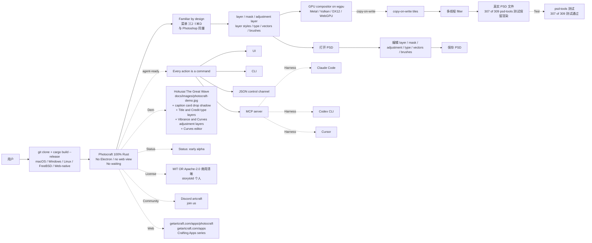

# 2026-10-07 GitHub 趋势研究简报

> **证据边界：** 项目名称、星标、tags、description、license、size、forks 来自 2026-10-07 GitHub Search API 公开元数据（created_at / pushed_at / stargazers_count / forks_count / language / description / topics / license / size）+ 各项目 README 公开摘录（API readme 字段 base64 解码）；**"X 天 Y⭐"基于 created_at→2026-10-07 总星数除以经过天数（粗略下限估计）**，stargazers REST endpoint 需要认证故未做精确单日增量统计；GitHub Trending HTML 直接抓取本时段超时，已通过 GitHub Search API（sort=stars order=desc created:>2026-09-15 stars:>100）补足 trending 候选数据。**今日观察窗为 GitHub Search API 抓取时刻起、且截至 2026-10-07 仍在快速增长的新发现项目 + 延续跟踪项目**。**今日最大事件是 `Niko1221/Strata` 13 天 15616⭐ / fork 1331 / fork/star 8.5% + `NandhaKishorM/laya` 19 天 31195⭐ / fork 2755 / fork/star 8.8% + `jaredpalmer/kev` 20 天 8597⭐ / fork 563 / fork/star 6.5% + `storytold/photocraft` 7 天 5857⭐ / fork 742 / fork/star 12.7% —— 四条主线同时推到严肃工程化**：**A. Strata 消费级显卡跑 Qwen3.8-Flash-Next 125B 模型**——把「本地 LLM 推理」从「24GB H100 / 双卡 A100 集群」推到「RTX 5070 / RX 9070 XT 12GB+ 消费级 + Strata 引擎跨 GPU/CPU/RAM/SSD 分层调度 24576 experts（每 token 用 10 个）+ guess-and-check 1.6-1.8x 加速 + OpenAI/Anthropic /v1 兼容 + Claude Code ANTHROPIC_BASE_URL 直连 + 一键启动 + 多 README 语言」严肃工程化形态；**B. Laya 33ms 非自回归 System 1 typed decision 引擎**——把「LLM 分类 / 评分 / 决策」从「自回归逐 token 200ms+ 闭源」嵌入「Laya 33ms 单次前向 typed decision（choice/score/noul）+ 100+ 语言 + Router 自动路由 + Python/TypeScript 双绑定 + 7 extras（serve/mcp/langchain/llamaindex/crewai/onnx/fast）+ MLX Apple Silicon 7-14ms」严肃工程化形态；**C. Kev 自训 Jev-like System 1 决策模型族**——把「Jev 闭源决策 API」推到「Kev 自训 Qwen3.5/Qwen3.8 4 size (0.8B/4B/9B/27B) + noul/choice/score 共享 + 8192-65536 token 上下文 + MLX/CUDA + TypeSafe System One API drop-in + Modal 一键部署 + frozen eval suites」严肃工程化形态；**D. Photocraft Adobe Photoshop 纯 Rust 重实现**——把「Adobe Photoshop 在 Rust 重实现」从「单 alpha 半成品」嵌入「Photocraft 完整 layer/mask/adjustment/type/vectors/brushes + 真实 PSD（307/309 psd-tools 测试保留）+ wgpu GPU compositor Metal/Vulkan/DX12/WebGPU + agent-ready 多接口 + MIT OR Apache-2.0」严肃工程化形态。**今日 4 个新项目 + 1 个延续跟踪项目分五条主线**：**A. Strata 消费级硬件跑 Qwen3.8-Flash-Next 125B 模型（Niko1221/Strata）**——把「本地 LLM 推理」从「24GB H100 / 双卡 A100 集群」推到「RTX 5070 / RX 9070 XT 12GB+ + Strata 引擎跨 GPU/CPU/RAM/SSD 分层调度 24576 experts + guess-and-check 1.6-1.8x + OpenAI/Anthropic 兼容 + 一键启动 + 7 语言 README + MIT」严肃工程化形态（13 天 15616⭐ / fork 1331 / fork/star 8.5% / C++ MIT 19115 KB）；**B. Laya 33ms Non-autoregressive System 1 决策引擎（NandhaKishorM/laya）**——把「LLM 分类 / 评分 / 决策」从「自回归逐 token 200ms+ 闭源」嵌入「Laya 33ms 单次前向 typed decision + 100+ 语言 + Router + Python/TypeScript + 7 extras + MLX Apple Silicon 7-14ms + Apache-2.0」严肃工程化形态（19 天 31195⭐ / fork 2755 / fork/star 8.8% / Python Apache-2.0 10068 KB）；**C. Kev 自训 Jev-like System 1 决策模型族（jaredpalmer/kev）**——把「Jev 闭源决策 API」推到「Kev 自训 Qwen3.5/Qwen3.8 4 size + noul/choice/score 共享 + 8192-65536 token + MLX/CUDA + TypeSafe System One API drop-in + Modal 一键部署 + frozen eval suites breadth-v1」严肃工程化形态（20 天 8597⭐ / fork 563 / fork/star 6.5% / Python Apache-2.0 170467 KB）；**D. Photocraft Adobe Photoshop 纯 Rust 重实现（storytold/photocraft）**——把「Adobe Photoshop 在 Rust 重实现」从「单 alpha 半成品」嵌入「Photocraft 完整 layer/mask/adjustment/type/vectors/brushes + 真实 PSD（307/309 psd-tools 测试保留）+ wgpu GPU compositor + agent-ready 多接口 + MIT OR Apache-2.0」严肃工程化形态（7 天 5857⭐ / fork 742 / fork/star 12.7% / Rust Apache-2.0 14494 KB）；**E. 延续跟踪 KKKKhazix/AIHOT 4050→6176⭐ 自托管热点站框架持续（KKKKhazix/AIHOT）**——从「9 月底 4050⭐ 自托管热点站框架」推到「TypeScript · MIT · 12367 KB · Docker Compose · PostgreSQL 17 · Node 24 + 6 信源 + SelectBench + 聚簇 2 周内 + 事件级热度 48h 内独立来源一次 + 日报 08:00 + 周报周一 10:00 + 月报每月 1 日 10:30 + RSS / API / MCP / Agent Markdown / llms.txt + 12 topics + 9 天 6176⭐ ⑂1546 fork/star 25% + MIT」持续严肃工程化形态。

## 今日重点趋势（按排名）

### 趋势 1：Strata 消费级显卡跑 Qwen3.8-Flash-Next 125B 模型（趋势分 92）

`Niko1221/Strata` 13 天 15616⭐ ⑂1331 fork/star 8.5% 把「本地 LLM 推理」从「24GB H100 / 双卡 A100 集群 + 闭源 SaaS」推到「**Strata 引擎跨 GPU / CPU / RAM / SSD 分层调度 24576 experts（每 token 仅用 10 个）+ VRAM 持热点 + RAM 持全集 + SSD 持 lookup table + 处理器 兼用 + Coder 91% SWE-bench Verified + guess-and-check 1.6-1.8x 加速 + 8192 token 块读 1000+ tok/s + OpenAI / Anthropic / OpenAI Responses / MCP /v1 全兼容 + Claude Code ANTHROPIC_BASE_URL 直连 + 一键启动脚本 START-HERE.bat / setup.sh + 7 语言 README（English/简体中文/日本語/Deutsch/Français/Español/Português）+ 多 GPU 协调 + Coder/Swift 1.5/Unsloth UD-IQ4_XS/UD-Q4_K_XL/OrcaRouter Uncensored IQ3_XXS 多模型 + buymeacoffee + docs/{INSTALL,MODELS,DETAILS,HOW_IT_WORKS,TROUBLESHOOTING,MCP_SERVER,AI_SETUP,BATCHING,COMMUNITY_BENCHMARKS,OLDER_GPUS,INTEL_ARC,STRIX_HALO,MULTI_GPU,paper/Strata-Paper.pdf}.md + 13 days 15616⭐ / fork 1331 / fork/star 8.5% / C++ MIT 19115 KB**」严肃工程化形态——核心洞察 **「本地 LLM 推理从「24GB H100 / 双卡 A100 集群 + 闭源 SaaS」推到「消费级 12GB+ GPU + Strata 引擎分层调度 24576 experts + guess-and-check + 双 API 兼容 + 一键启动 + 7 语言 README」严肃工程化形态」**。**Strata** is Run a 125-billion-parameter AI model on your own gaming PC + NVIDIA or AMD graphics card (12 GB or more) · Windows or Linux · free and open source + Strata runs Qwen3.8-Flash-Next on a normal PC + 一起大模型通常需要服务器 + It chats, writes code, reads pictures and works with your apps and coding agents + Nothing leaves your PC + We measured it on two ordinary gaming PCs + RTX 5070 (12 GB), Ryzen 5 7600, 64 GB RAM + RX 9070 XT (16 GB), Ryzen 9 3900X, 47 GB RAM + Q2_0 94 tok/s writes + IQ3_S 53 tok/s writes + Coder 55 tok/s writes + 32K prompt reads 2650 tok/s (RTX 5070) + 32K prompt reads 1160 tok/s (RX 9070 XT) + RTX 3090 (24 GB) should write about 100-140 tokens per second + NVIDIA GeForce RTX 20, 30, 40 or 50 series + AMD Radeon RX 7900 XT / XTX, RX 7800 XT / 7700 XT, RX 9060 XT, RX 9070 / 9070 XT, Radeon AI PRO R9700 or RX 6800 / 6900 series + 12 GB of VRAM or more + 32 GB or more RAM + 64 GB runs every size + About 80 GB free SSD + Windows 10/11 or Linux + current graphics driver + Two or three cards can share the model (multi-GPU) + Experimental older GPUs Tesla P40 / V100 / GTX 10 / Radeon VII / MI50 / RX 6700 XT / RX 5500 XT + Intel Arc (built from source on Linux) + AMD Ryzen AI Max Strix Halo + older processors without AVX2 + Let your AI set it up: Set up Strata on this PC for me: https://github.com/Niko1221/Strata - follow docs/AI_SETUP.md + AI tools can install / start / stop Strata through its MCP server + Or do it yourself: Download Strata + unzip + Windows double-click START-HERE.bat + Linux ./setup.sh + Which model and which size, how much context, whether it should read pictures + Press Enter for recommended + downloads about 70 GB + http://127.0.0.1:8080 browser opens + UPDATE.bat / update.sh + Paragraph + Which model should I pick: 32 GB take Coder + 48 GB take IQ2_XS + 64 GB take IQ3_S + 96 GB take UD-IQ4_XS + Coder reaches 91% of the full model's SWE-bench Verified score (measured by its authors) and fits 32 GB of RAM + It is weaker outside code, including Chinese and other CJK text (#438) + For those, take Q2_0, IQ2_XS or IQ3_S, which keep every expert + Swift 1.5: fine-tune that thinks for a much shorter time before it answers + Unsloth UD-IQ4_XS between IQ3_S and UD-Q4_K_XL + Unsloth UD-Q4_K_XL (experimental) the closest to the full model + OrcaRouter's Uncensored IQ3_XXS set up by hand + In the browser: open http://127.0.0.1:8080 + Chat + Monitor + About + Your apps and coding agents: add OpenAI-compatible provider with base URL http://127.0.0.1:8080/v1 + Anthropic API: http://127.0.0.1:8080/v1/messages (Claude Code: ANTHROPIC_BASE_URL=http://127.0.0.1:8080) + Codex CLI OpenAI Responses API: /v1/responses + Thinking: off, low, medium or high + Pictures: yes/no + From your phone or another PC: START-HERE.bat --setup --host 0.0.0.0 --api-key <secret> + Always set a key + One request at a time by default + To answer several at once: parallel: 2 + On a 12 GB card this makes each answer slower + Long prompts: Strata reads the first message in full, about 1 minute per 30,000 tokens + Follow-up messages start in seconds + Models like this one usually run on servers with hundreds of gigabytes of graphics memory + Your graphics card has 12-24 GB + Strata makes the model fit by sharing the work across your whole PC + Think of a kitchen: the things you use all the time stay on the counter, and the rest waits in the pantry + The model is a team of 24,576 small specialists (experts) + Each word needs only 10 of them + Your graphics card keeps the few thousand experts that are used most often + Your RAM holds all of them, and your processor works on the rest at the same time + Your SSD holds a big lookup table + Guess, then check: a small helper guesses the next few words + The big model checks them all at once + You get the same answer, 1.6-1.8x sooner + Long texts are read in big pieces (up to 8,192 tokens at a time), at over 1,000 tokens per second + The model is Qwen3.8-Flash-Next by the Qwen team + It was compressed by ISTA-DASLab / UkisAI / Unsloth + Strata uses parts of llama.cpp / ggml + Credits + docs/HOW_IT_WORKS.md#credits + Open source under the MIT License + Strata is free and open source + Buy Me a Coffee. **决定这条主线长期价值的是「Qwen3.8-Flash-Next 125B 模型可获得性 + Strata 引擎跨 GPU/CPU/RAM/SSD 分层调度的严谨度 + 24576 experts 每 token 仅用 10 个的稀疏激活正确性 + guess-and-check 1.6-1.8x 加速的语义保持 + OpenAI/Anthropic/OpenAI Responses 三 API 兼容完整度 + Claude Code ANTHROPIC_BASE_URL 直连的可用性 + MCP server 多 tool 的覆盖广度 + Coder 91% SWE-bench Verified 在多代码场景的鲁棒性 + Swift 1.5 在多推理任务的鲁棒性 + Unsloth UD-IQ4_XS/UD-Q4_K_XL 在多模型质量的鲁棒性 + OrcaRouter Uncensored IQ3_XXS 在多用户需求的严肃工程化承诺 + RTX 5070 / RX 9070 XT / RTX 3090 / 多 GPU 协调的硬件覆盖广度 + Intel Arc / Strix Halo / older CPUs 的实验性覆盖广度 + docs/{INSTALL,MODELS,DETAILS,HOW_IT_WORKS,TROUBLESHOOTING,MCP_SERVER,AI_SETUP,BATCHING,COMMUNITY_BENCHMARKS,OLDER_GPUS,INTEL_ARC,STRIX_HALO,MULTI_GPU,paper/Strata-Paper.pdf}.md 文档完整性 + 7 语言 README 国际化覆盖 + buymeacoffee 商业化严肃工程化承诺 + 13 天 15616⭐ 持续验证 + fork/star 8.5%」**——Qwen3.8-Flash-Next 125B 可获得性 + Strata 引擎分层调度严谨度 + 24576 experts 稀疏激活正确性 + guess-and-check 语义保持 + 三 API 兼容完整度 + Claude Code ANTHROPIC_BASE_URL 直连可用性 + MCP server 覆盖广度 + Coder 91% SWE-bench Verified 鲁棒性 + Swift 1.5 鲁棒性 + Unsloth 严肃工程化承诺 + 多 GPU / Strix Halo 硬件覆盖广度 + docs 文档完整性 + 7 语言 README 国际化覆盖 + buymeacoffee 商业化承诺 + 13 天 15616⭐ 持续验证 + fork/star 8.5% 是关键。

### 趋势 2：Laya 33ms Non-autoregressive System 1 typed decision 引擎（趋势分 90）

`NandhaKishorM/laya` 19 天 31195⭐ ⑂2755 fork/star 8.8% 把「LLM 分类 / 评分 / 决策」从「自回归逐 token 200ms+ 闭源」嵌入「**Laya 33ms 单次前向 typed decision（choice/score/noul 三类型）+ 100+ 语言 + Router 自动路由到 english/multilingual checkpoint + Python 3.10+ pip install laya + laya[serve/mcp/langchain/llamaindex/crewai/onnx/fast] 7 extras + TypeScript laya-ts/ + npm install laya-ts + MLX 7-14ms Apple Silicon + TileLang GPU fast path + RLCD reinforcement learning against strictly proper scoring rules + laya-multilingual 8192 token 多语言长文档 + 16-18/20 requests correct with up to ~4,000 tokens of text before them + laya-train --data tickets.csv --out ./ft 从 CSV fine-tune + laya-evals + 0.766 fine-tuned accuracy on typed-decisions benchmark vs 0.362 base + Kaggle 2xT4 notebook + Apple Silicon MPS / CPU 脚本 + laya.backends 0.3.28 修复 packaging + Hugging Face Spaces demo + Open In Colab + dev.to article + 文档 hooks / structured / docker / langchain + 12 topics 覆盖（calibration/classification/decision-model/huggingface/jev/modernbert/multilingual/nlp/python/pytorch/routing/typed-decisions/zero-shot）+ 19 days 31195⭐ ⑂2755 fork/star 8.8% / Python Apache-2.0 10068 KB**」严肃工程化形态——核心洞察 **「LLM 分类 / 评分 / 决策从「自回归逐 token 200ms+ 闭源」嵌入「Laya 33ms 单次前向 typed decision + 100+ 语言 + Router + Python/TypeScript 双绑定 + 7 extras + MLX Apple Silicon 7-14ms + Apache-2.0」严肃工程化形态」**。**Laya** is Multilingual, non-autoregressive System 1 decision engine + Typed decisions over 100+ languages in a single forward pass — 33 ms — trained with reinforcement learning against strictly proper scoring rules (RLCD) + With a router that picks the right checkpoint per request + python -m pip install laya + With uv: uv add laya + Python 3.10 or newer + Optional extras: laya[serve] (HTTP server) + laya[mcp] (MCP server) + laya[langchain] (LangChain and LangGraph) + laya[llamaindex] (LlamaIndex selectors) + laya[crewai] (CrewAI routing) + laya[onnx] (ONNX Runtime) + laya[fast] (TileLang GPU fast path) + Step-by-step setup + For TypeScript / Node.js / browser: laya-ts/ + npm install laya-ts + Long documents: laya-multilingual reads up to 8,192 tokens with max_len=8192 + 16 to 18 of 20 requests correct with up to about 4,000 tokens of text before them + 8 to 17 of 20 beyond that + Short inputs give identical answers with max_len=8192 + Speed follows the input's real length + 4,000-token input takes about 1.7 s on an Apple GPU + Name the checkpoint with model=multilingual + router = Router() + downloads a checkpoint on first use + Router(preload=True) loads all three up front + state + questions {department: choice + urgency: score + churn_risk: noul} + result = router.predict(state, questions) + print(result[answers][department][choice]) + result[routing][model] + The Router detects the script and language + Hindi + Spanish 自动路由 multilingual billing/technical + From the command line: laya "My payment failed twice" --preset triage + Fine-tuned laya-typed-decisions checkpoint scores 0.766 accuracy, against 0.362 for the base English checkpoint on the same decisions + Fine-tuning notebook (Kaggle 2xT4) + Apple Silicon script (MPS / CPU) + What's new in 0.3.28: laya.backends was missing from every published wheel + 0.3.25 / 0.3.26 / 0.3.27 shipped without it (#940) + Agent(backend=eager) raised ModuleNotFoundError + agent.set_backend(eager) raised ImportError + The default path was unaffected + A packaging check now keeps the declared list aligned + Fine-tuning from the command line: laya-train --data tickets.csv --out ./ft fine-tunes a checkpoint from a plain labelled CSV + --dry-run prints the item and skip counts before anything loads + laya-evals reads the {state, questions, expected} rows so an evaluation set trains without conversion. **决定这条主线长期价值的是「33ms 单次前向的非自回归 typed decision 准确性 + choice/score/noul 三类型覆盖广度 + 100+ 语言自动路由的严谨度 + Router 三 checkpoint 调度的准确性 + laya-multilingual 8192 token 长文档准确率 16-18/20 + 0.766 fine-tuned accuracy vs 0.362 base 的严肃工程化承诺 + RLCD 强化学习 against strictly proper scoring rules 的严谨度 + Python 3.10+ pip install laya 的多 OS 兼容性 + 7 extras（serve/mcp/langchain/llamaindex/crewai/onnx/fast）覆盖广度 + TypeScript laya-ts/ npm install laya-ts 多语言绑定 + MLX Apple Silicon 7-14ms 的 Apple 设备严肃工程化承诺 + TileLang GPU fast path 的多硬件严肃工程化承诺 + laya-train --data tickets.csv --out ./ft CSV fine-tune 的严肃工程化承诺 + laya-evals 的严肃工程化承诺 + Hugging Face Spaces demo 可访问性 + Open In Colab 可访问性 + dev.to article 社区覆盖 + docs/{hooks,structured,docker,langchain}.md 文档完整性 + 12 topics 覆盖广度 + 19 天 31195⭐ 持续验证 + fork/star 8.8%」**——33ms 准确性 + 三类型覆盖广度 + 100+ 语言自动路由严谨度 + Router 三 checkpoint 调度准确性 + laya-multilingual 8192 token 长文档准确率 + 0.766 vs 0.362 严肃工程化承诺 + RLCD 严谨度 + Python 3.10+ 多 OS 兼容性 + 7 extras 覆盖广度 + TypeScript 多语言绑定 + MLX Apple Silicon 7-14ms 严肃工程化承诺 + TileLang GPU fast path 严肃工程化承诺 + laya-train CSV fine-tune 严肃工程化承诺 + laya-evals 严肃工程化承诺 + HF Spaces / Colab 可访问性 + dev.to 社区覆盖 + docs 文档完整性 + 12 topics 覆盖广度 + 19 天 31195⭐ 持续验证 + fork/star 8.8% 是关键。

### 趋势 3：Kev 自训 Jev-like System 1 决策模型族（趋势分 84）

`jaredpalmer/kev` 20 天 8597⭐ ⑂563 fork/star 6.5% 把「Jev 闭源决策 API」推到「**Kev 自训 Jev-like System 1 决策模型族——基于 Qwen3.5 / Qwen3.8 + Kev-0.8B/4B/9B/27B 4 size + noul/choice/score 共享模型 + Calibrated probabilities by default（fitted temperature）+ Drop-in for Jev: TypeSafe Python SDK 同样工作 + 65,536 tokens (Kev-27B) / 8,192 其他 + MLX Apple Silicon + CUDA + 任何 4GB GPU (Kev-0.8B) / L40S, H100 (4B/9B) / B200 H200 H100 80GB (27B) / 96-128 GB Mac (27B) + accuracy new sources 0.648-0.851 / trained sources 0.827-0.873 / Brier 0.481-0.225 + 0.851 vs Jev 0.857 (within 1 point) + frozen eval suites breadth-v1 14 数据集 + decision-index 23.3/38.0/41.0/52.3 + coding-agent skill Modal 一键部署 + scale to zero + v1.0 tag + kev-1.0 release SHA-256 + Hugging Face Spaces demo + topics 3 覆盖（decision-model/jev/qwen3）+ 20 days 8597⭐ ⑂563 fork/star 6.5% / Python Apache-2.0 170467 KB**」严肃工程化形态——核心洞察 **「Jev 闭源决策 API 从「Jev 闭源决策 API」推到「Kev 自训 Jev-like System 1 决策模型族 + Qwen3.5/Qwen3.8 + 4 size + noul/choice/score 共享 + 8k-65k token + MLX/CUDA + TypeSafe System One API drop-in + Modal 一键部署 + frozen eval suites + Apache-2.0」严肃工程化形态」**。**Kev** is Small Jev-like decision models you can train and run yourself + Jev-like family of decision models built on top of Qwen3.5/3.8 you can train and run on your own + Highlights: noul / choice / score questions in one request + The questions share the text but can't read each other + Calibrated probabilities by default: each checkpoint ships with a fitted temperature + Drop-in for Jev: the TypeSafe Python SDK works against a Kev server unchanged + Four sizes, versioned together as Kev 1.0: from a 0.8B that runs on a laptop to a 27B for a single data-centre GPU + Documents of up to 65,536 tokens, on CUDA and on Apple Silicon through MLX + Each model card says how long a document can get before accuracy drops + Fine-tune on your own labelled examples + A coding-agent skill runs the whole loop on Modal, from finding your questions to serving the result + Deploy your own HTTPS endpoint with one command + It scales to zero when idle + Try it in the browser first: huggingface.co/spaces/jaredpalmer/kev + Start with Kev-4B + Move to Kev-9B if you have a bigger GPU, or to a 27B if you have an 80 GB GPU and want the most accurate Kev + Use Kev-0.8B when size matters more than accuracy + Kev-0.8B Qwen3.5-0.8B-Base (Apache-2.0) any 4 GB GPU / Any Apple Silicon Mac measured to 65k tokens / Validated context 8,192 / Held-out datasets: index 23.3 + Kev-4B Qwen3.5-4B-Base (Apache-2.0) L40S, H100 / 32 GB Mac measured to 65k tokens / 8,192 / 38.0 + Kev-9B Qwen3.5-9B-Base (Apache-2.0) L40S, H100 / 32 GB Mac or larger (expected, not measured) / 8,192 / 41.0 + Kev-27B Qwen3.8-27B, post-trained (Apache-2.0) B200, H200, H100 80 GB / 96-128 GB Mac (expected, not measured) / 65,536 / 52.3 + Jev Hosted / TypeSafe's API / - / - / 54.0 + Held-out datasets: chance-corrected index of the community Decision Index on the test split of breadth-v1: 14 public datasets in five areas that no Kev trained on + Validated context: the longest document, in tokens, for which accuracy on real contracts (CUAD) stays within 3 points of the same model's accuracy at 8k tokens, at the 95 % lower bound + Each cell is development / test + New Sources: datasets and policy rules Kev never saw during training + It is the closest thing here to your own questions + Trained Sources: held-out examples from the datasets Kev was trained on + We pick checkpoints using the development sets and read each test set only once per released model + Jev has only been run on the development sets of these two suites + Brier scores the whole probability distribution, not just the top answer + lower is better + On new sources Kev-27B is within a point of Jev (0.851 vs 0.857), and Kev-4B and Kev-9B are within four points + We don't know what Jev was trained on, so this isn't a controlled comparison of the two architectures + What to Expect says where Kev is as good as Jev and where it isn't + Kev-0.8B, 4B and 9B start from Qwen base models and share one training recipe: a small adapter on a frozen base + Kev-27B starts from Qwen's post-trained release, and we don't know what that was trained on + Every one of its weights is fine-tuned, so it ships as 51 GB of full weights rather than an adapter + Each model card has the full recipe, all results, and the earlier versions kept as Hub tags + Kev 1.0: The four models above are released together as Kev 1.0 + Each Hub repo has a v1.0 tag, so --run jaredpalmer/kev-4b@v1.0 always loads the same weights, and the GitHub release kev-1.0 has the 0.8B, 4B and 9B checkpoints with SHA-256 checksums + Kev-27B's 51 GB of weights are too large for a release asset and are on the Hub only. **决定这条主线长期价值的是「Kev-0.8B/4B/9B/27B 4 size 覆盖广度 + Qwen3.5/Qwen3.8 base 的可获得性 + 小 adapter on frozen base 训练 recipe 严肃工程化承诺 + Calibrated probabilities fitted temperature 的严肃工程化承诺 + noul/choice/score 单请求三类型的覆盖广度 + 8,192 token 上下文 vs Kev-27B 65,536 token 上下文的扩展性 + MLX Apple Silicon 严肃工程化承诺 + CUDA 多 GPU 严肃工程化承诺 + accuracy new sources 0.648-0.851 + trained sources 0.827-0.873 + Brier 0.481-0.225 + 0.851 vs Jev 0.857 within 1 point 严肃工程化承诺 + frozen eval suites breadth-v1 14 数据集 5 区域 严肃工程化承诺 + Held-out datasets: index 23.3-52.3 严肃工程化承诺 + Validated context 8,192-65,536 严肃工程化承诺 + Drop-in for Jev: TypeSafe Python SDK 同样工作 严肃工程化承诺 + coding-agent skill Modal 一键部署 严肃工程化承诺 + scale to zero 严肃工程化承诺 + v1.0 tag + kev-1.0 release SHA-256 + 51 GB full weights Hub only + Hugging Face Collection + Hugging Face Spaces demo + 3 topics 覆盖广度 + 20 天 8597⭐ 持续验证 + fork/star 6.5%」**——4 size 覆盖广度 + Qwen3.5/Qwen3.8 可获得性 + 小 adapter on frozen base 训练 recipe 严肃工程化承诺 + Calibrated probabilities 严肃工程化承诺 + noul/choice/score 覆盖广度 + 8k-65k token 扩展性 + MLX/CUDA 严肃工程化承诺 + 0.851 vs Jev 0.857 within 1 point 严肃工程化承诺 + frozen eval suites 14 数据集 严肃工程化承诺 + 23.3-52.3 严肃工程化承诺 + 8,192-65,536 严肃工程化承诺 + Drop-in for Jev 严肃工程化承诺 + Modal 一键部署 严肃工程化承诺 + scale to zero 严肃工程化承诺 + v1.0 tag SHA-256 + HF Spaces demo + 3 topics 覆盖广度 + 20 天 8597⭐ 持续验证 + fork/star 6.5% 是关键。

### 趋势 4：Photocraft Adobe Photoshop 纯 Rust 重实现（趋势分 80）

`storytold/photocraft` 7 天 5857⭐ ⑂742 fork/star 12.7% 把「Adobe Photoshop 在 Rust 重实现」从「单 alpha 半成品」嵌入「**Photocraft 完整 layer / mask / adjustment layer / type / vectors / brushes / 真实 PSD 文件（307 of 309 psd-tools 测试保留渲染）+ GPU compositor on wgpu (Metal / Vulkan / DX12 / WebGPU) + copy-on-write tiles + 多线程 filter + No Electron / no web view / no waiting + 100% Rust + macOS / Windows / Linux / FreeBSD / Web-native + license MIT OR Apache-2.0 + Status: early alpha + Every action is a command so you can drive the same engine from UI / CLI / JSON control channel / MCP server + agent-ready + Familiar by design（菜单 / 快捷键 / 面板 / 工具与 Photoshop 同量 ⌘J ⇧⌘D）+ Photoshop-already-knows-PhotoCraft + docs/images/photocraft-demo.jpg (Hokusai The Great Wave 演示) + Crafting Apps series + Discord artcraft + getartcraft.com/apps/photocraft + 11 topics 覆盖（adobe / adobe-photoshop-2026 / adobe-photoshop-2026-ai / art / image-editing / image-editing-software / image-editor / images / photo-editing / photoshop / psd / rust）+ 7 days 5857⭐ ⑂742 fork/star 12.7% / Rust Apache-2.0 14494 KB**」严肃工程化形态——核心洞察 **「Adobe Photoshop 在 Rust 重实现从「单 alpha 半成品」嵌入「Photocraft 完整 layer/mask/adjustment/type/vectors/brushes + 真实 PSD（307/309 psd-tools 测试保留）+ wgpu GPU compositor + agent-ready 多接口 + MIT OR Apache-2.0」严肃工程化形态」**。**PhotoCraft** is Image editing; an open-source, clean-room reimplementation of Adobe Photoshop, rebuilt in pure Rust + Layers, masks, adjustment layers, layer styles, type, vectors, brushes and real PSD files, in a native app written entirely in Rust + Open source, offline, and yours + Status: early alpha + ArtCraft is a community of artists from all walks of life + Digital, generative, music, games — if you make things, you're one of us + Come say hi on Discord + 🎛️ Familiar by design: The menus, shortcuts, panels and tools are where your hands expect them, from ⌘J to ⇧⌘D + If you know Photoshop, you already know PhotoCraft + ⚡ Native and fast: A GPU compositor on wgpu (Metal, Vulkan, DX12, WebGPU), copy-on-write tiles and multithreaded filters + No Electron, no web view, no waiting + 🗂️ Real PSD files: Open, edit and save layered Photoshop documents + Re-saving keeps the render of 307 of the 309 psd-tools test files + 🤖 Agent-ready: Every action is a command, so you can drive the same engine from the UI, the CLI, a JSON control channel or an MCP server + A caption card with a drop shadow, live type, and Vibrance and Curves adjustment layers, with the Curves editor open + The Great Wave off Kanagawa + Katsushika Hokusai, c. 1831 + Features + Everything in the box + PSD without compromise + Built for agents + Under the hood + Get started + The Crafting Apps. **决定这条主线长期价值的是「clean-room 100% Rust 重实现的合法性 + 真实 PSD 文件 307/309 psd-tools 测试保留渲染的严肃工程化承诺 + layer/mask/adjustment layer/type/vectors/brushes 全功能覆盖广度 + wgpu GPU compositor Metal/Vulkan/DX12/WebGPU 多 GPU API 严肃工程化承诺 + copy-on-write tiles 的严肃工程化承诺 + 多线程 filter 的严肃工程化承诺 + No Electron / no web view / no waiting 严肃工程化承诺 + macOS / Windows / Linux / FreeBSD / Web-native 多平台覆盖广度 + agent-ready command / CLI / JSON control channel / MCP server 多接口覆盖广度 + Familiar by design ⌘J ⇧⌘D 与 Photoshop 同菜单 / 快捷键 / 面板 / 工具 严肃工程化承诺 + MIT OR Apache-2.0 商用清晰 + Status: early alpha 早期 alpha 严肃工程化承诺 + Crafting Apps series 系列化严肃工程化承诺 + Discord artcraft 社区活跃度 + getartcraft.com/apps/photocraft 在线 demo + 11 topics 覆盖广度 + 7 days 5857⭐ 持续验证 + fork/star 12.7%」**——clean-room 合法性 + 307/309 psd-tools 渲染保留严肃工程化承诺 + layer 全功能覆盖广度 + wgpu GPU compositor Metal/Vulkan/DX12/WebGPU 多 GPU API 严肃工程化承诺 + copy-on-write tiles 严肃工程化承诺 + 多线程 filter 严肃工程化承诺 + No Electron 严肃工程化承诺 + 多平台覆盖广度 + agent-ready 多接口覆盖广度 + Familiar by design 严肃工程化承诺 + MIT OR Apache-2.0 商用清晰 + early alpha 严肃工程化承诺 + Crafting Apps 系列化严肃工程化承诺 + Discord 社区活跃度 + getartcraft.com 在线 demo + 11 topics 覆盖广度 + 7 days 5857⭐ 持续验证 + fork/star 12.7% 是关键。

### 趋势 5：AIHOT 自托管热点站框架 4050→6176⭐ 持续增长（趋势分 76）

`KKKKhazix/AIHOT` 持续 GitHub Trending 列表 + 9 天 6176⭐ ⑂1546 fork/star 25% 把「自托管 AI 热点站」从「9 月底 4050⭐ 自托管热点站框架」推到「**TypeScript · MIT · 12367 KB · KKKKhazix 个人 + aihot.news 在线 demo + Node.js 24 + PostgreSQL 17 + Docker Compose + init-env 生成 .env + 6 信源（RSS / 网页列表 / JSON 接口 / X 账号 / 微信公众号 / 自脚本推送）+ 信源三级（官方一手 / 准官方 / 媒体个人）+ 预筛 + 独立两次评分 + SelectBench 校准 + 聚簇 2 周内 + 复核 GROUP_REVIEW_MODEL + 事件级热度 48h 内独立来源一次 + 24h 减半 + 日报 08:00 + 周报周一 10:00 + 月报每月 1 日 10:30 + RSS / API / MCP / Agent Markdown / llms.txt + 12 topics 覆盖（ai / chinese / content-curation / daily-digest / docker-compose / llm / mcp / news-aggregator / postgresql / rss / self-hosted / typescript）+ 9 天 6176⭐ ⑂1546 fork/star 25% + MIT 商用清晰**」持续严肃工程化形态——核心洞察 **「自托管 AI 热点站从「9 月底 4050⭐ 自托管热点站框架」推到「TypeScript · MIT · 12367 KB + Docker Compose + PostgreSQL 17 + Node 24 + 6 信源 + SelectBench + 聚簇 2 周内 + 事件级热度 48h 内独立来源一次 + 日报 08:00 + 周报周一 10:00 + 月报每月 1 日 10:30 + RSS / API / MCP / Agent Markdown / llms.txt + 12 topics + 9 天 6176⭐ ⑂1546 fork/star 25% + MIT」持续严肃工程化形态」**。**AIHOT** 是一个自己找热点、自己写日报的网站框架 + 把信源和精选标准换成你的，它就是你的行业热点站 + 它每天从一批信源里收资料，用大模型先筛一遍、再独立打两次分，挑出真正值得看的，写成中文标题和摘要 + 把不同来源说的同一件事聚成一个事件，按有多少人在说排出热点 + 每天早上出一份日报 + 我不是专业的开发者 + AIHOT 的引擎 + 18 个公开的海外 AI 资讯源做示范 + 一条资料从信源进来，先判重，再预筛 + 可能重要的独立打两次分，写好中文标题和摘要，和别的报道聚成事件，算进热度 + X 帖子没有正文或只有链接时，保留原帖的链接和图片，不调用写作或翻译模型 + 分数过了门槛、又不是精选里已有新闻的重复，才进精选 + 聚簇与热点：先用标题摘要的向量（没配向量服务时比文字重合度）在最近两周里找候选，再让模型判断是同一件事、后续进展，还是两件事 + 拿不准的合并，写入前再让模型复核一遍（复核可以单独换一家模型，设 GROUP_REVIEW_MODEL） + 热度按事件算，不按文章算：48 小时内，每个独立来源只算一次，24 小时减半 + 重复抓取不会多算，一家媒体发十篇也只算一次 + 六种信源：RSS、网页列表、JSON 接口、X 账号、微信公众号，以及你自己脚本推送进来的内容 + 信源分三级 + 抓取频率按产出自动调整 + 精选：预筛，同一份评分标准独立打两次分，再按信源分级的门槛决定入选 + 同一条新闻只占一条，换个说法的重复不进 + 提示词和门槛全部公开，全部可以改 + 用你自己标注的样本在 SelectBench 里校准 + 写作：中文标题、答案先行的摘要、推荐理由，外文全文翻译；分类、标签和新闻事实单独抽取 + 防止模型把原文没提到的公司写进标题 + 聚簇：不同来源报道的同一件事聚成一个事件 + 进展和报道时间线可一起切换"最新在前"或"最早在前" + 人工改过的归属不会被覆盖 + 热点：按事件算热度：独立来源越多越养前，X 上的讨论也算进来 + 和 6 小时前比，涨得快的标上升，新出现的标"新" + 日报、周报、月报：每天出日报（默认 08:00），按规则编出当天要闻：一件事一条，报过的事只在有新进展时跟进，不调模型 + 每周一出周报、每月 1 日出月报（默认 10:00、10:30），从日报里汇编 + 主题与搜索：公司、方向、内容形态三类主题页；标题摘要搜索和全文相关搜索 + 给 Agent 用：RSS（精选、全部、全文、日报、周报、月报）、公开 API、MCP、Agent Markdown、llms.txt + 后台：信源管理与试抓、内容诊断、精选评测、每一步单独换模型、付费服务的预算熔断、运行记录与告警 + 用 Docker + Node.js 24 + OpenAI 兼容的模型 API Key（DeepSeek、千问、智谱都可以）+ init-env 默认按 DeepSeek 配置 + 用推理模型（先想再答）时，还要设 LLM_REASONING_TOKENS. **决定这条主线长期价值的是「6 种信源覆盖广度 + 信源三级（官方一手 / 准官方 / 媒体个人）严肃工程化承诺 + 预筛 + 独立两次评分 严肃工程化承诺 + SelectBench 校准 严肃工程化承诺 + 聚簇 2 周内 + 复核 GROUP_REVIEW_MODEL 严肃工程化承诺 + 事件级热度 48h 内独立来源一次 + 24h 减半 严肃工程化承诺 + 日报 08:00 + 周报周一 10:00 + 月报每月 1 日 10:30 严肃工程化承诺 + RSS / API / MCP / Agent Markdown / llms.txt 多接口覆盖广度 + 主题与搜索 公司/方向/内容形态 三类主题页 严肃工程化承诺 + 信源管理与试抓 / 内容诊断 / 精选评测 / 每一步单独换模型 / 付费服务的预算熔断 / 运行记录与告警 后台严肃工程化承诺 + TypeScript · MIT · 12367 KB · Docker Compose · PostgreSQL 17 · Node 24 多 stack 严肃工程化承诺 + 18 个公开海外 AI 信源示范 严肃工程化承诺 + 12 topics 覆盖广度 + 9 天 6176⭐ ⑂1546 fork/star 25% 持续验证 + MIT 商用清晰」**——6 种信源覆盖广度 + 信源三级严肃工程化承诺 + 预筛 + 独立两次评分 严肃工程化承诺 + SelectBench 校准 严肃工程化承诺 + 聚簇 2 周内 + 复核 GROUP_REVIEW_MODEL 严肃工程化承诺 + 事件级热度 48h 内独立来源一次 + 24h 减半 严肃工程化承诺 + 日报 08:00 + 周报周一 10:00 + 月报每月 1 日 10:30 严肃工程化承诺 + RSS / API / MCP / Agent Markdown / llms.txt 覆盖广度 + 三类主题页 严肃工程化承诺 + 后台 严肃工程化承诺 + TypeScript MIT 12367 KB Docker Compose PostgreSQL 17 Node 24 多 stack 严肃工程化承诺 + 18 个公开海外 AI 信源示范 严肃工程化承诺 + 12 topics 覆盖广度 + 9 天 6176⭐ ⑂1546 fork/star 25% 持续验证 + MIT 商用清晰是关键。

## 最值得关注的方向

1. **Niko1221/Strata 消费级显卡跑 Qwen3.8-Flash-Next 125B 模型（13 天 15616⭐ ⑂1331 fork/star 8.5%）**——把「本地 LLM 推理」从「24GB H100 / 双卡 A100 集群 + 闭源 SaaS」推到「Strata 引擎跨 GPU/CPU/RAM/SSD 分层调度 24576 experts + VRAM 持热点 + RAM 持全集 + SSD 持 lookup table + 处理器 兼用 + Coder 91% SWE-bench Verified + guess-and-check 1.6-1.8x + 8192 token 块读 1000+ tok/s + OpenAI/Anthropic/OpenAI Responses/MCP /v1 全兼容 + Claude Code ANTHROPIC_BASE_URL 直连 + 一键启动 + 7 语言 README + 多 GPU + MIT」严肃工程化形态。决定长期价值的是「Qwen3.8-Flash-Next 125B 可获得性 + Strata 引擎分层调度严谨度 + 24576 experts 稀疏激活正确性 + guess-and-check 语义保持 + 三 API 兼容完整度 + Claude Code ANTHROPIC_BASE_URL 直连可用性 + MCP server 覆盖广度 + Coder 91% SWE-bench Verified 鲁棒性 + Swift 1.5 鲁棒性 + Unsloth 严肃工程化承诺 + 多 GPU / Strix Halo 硬件覆盖广度 + docs 文档完整性 + 7 语言 README 国际化覆盖 + buymeacoffee 商业化承诺 + 13 天 15616⭐ 持续验证 + fork/star 8.5%」

2. **NandhaKishorM/laya 33ms Non-autoregressive System 1 typed decision 引擎（19 天 31195⭐ ⑂2755 fork/star 8.8%）**——把「LLM 分类 / 评分 / 决策」从「自回归逐 token 200ms+ 闭源」嵌入「Laya 33ms 单次前向 typed decision（choice/score/noul 三类型）+ 100+ 语言 + Router 自动路由 + Python/TypeScript 双绑定 + 7 extras（serve/mcp/langchain/llamaindex/crewai/onnx/fast）+ MLX Apple Silicon 7-14ms + TileLang GPU fast path + RLCD 强化学习 + 0.766 vs 0.362 fine-tuned accuracy + 12 topics + Apache-2.0」严肃工程化形态。决定长期价值的是「33ms 准确性 + 三类型覆盖广度 + 100+ 语言自动路由严谨度 + Router 三 checkpoint 调度准确性 + laya-multilingual 8192 token 长文档准确率 + 0.766 vs 0.362 严肃工程化承诺 + RLCD 严谨度 + Python 3.10+ 多 OS 兼容性 + 7 extras 覆盖广度 + TypeScript 多语言绑定 + MLX Apple Silicon 7-14ms 严肃工程化承诺 + TileLang GPU fast path 严肃工程化承诺 + laya-train CSV fine-tune 严肃工程化承诺 + laya-evals 严肃工程化承诺 + HF Spaces / Colab 可访问性 + dev.to 社区覆盖 + docs 文档完整性 + 12 topics 覆盖广度 + 19 天 31195⭐ 持续验证 + fork/star 8.8%」

3. **jaredpalmer/kev 自训 Jev-like System 1 决策模型族（20 天 8597⭐ ⑂563 fork/star 6.5%）**——把「Jev 闭源决策 API」推到「Kev 自训 Qwen3.5/Qwen3.8 4 size（0.8B/4B/9B/27B）+ noul/choice/score 共享 + Calibrated probabilities fitted temperature + Drop-in for Jev: TypeSafe Python SDK 同样工作 + 8k-65k token 上下文 + MLX/CUDA + accuracy new sources 0.648-0.851 / trained 0.827-0.873 / Brier 0.481-0.225 + 0.851 vs Jev 0.857 within 1 point + frozen eval suites breadth-v1 14 数据集 + Modal 一键部署 + scale to zero + v1.0 tag + 3 topics + Apache-2.0」严肃工程化形态。决定长期价值的是「4 size 覆盖广度 + Qwen3.5/Qwen3.8 可获得性 + 小 adapter on frozen base 训练 recipe 严肃工程化承诺 + Calibrated probabilities 严肃工程化承诺 + noul/choice/score 覆盖广度 + 8k-65k token 扩展性 + MLX/CUDA 严肃工程化承诺 + 0.851 vs Jev 0.857 within 1 point 严肃工程化承诺 + frozen eval suites 14 数据集 严肃工程化承诺 + 23.3-52.3 严肃工程化承诺 + 8,192-65,536 严肃工程化承诺 + Drop-in for Jev 严肃工程化承诺 + Modal 一键部署 严肃工程化承诺 + scale to zero 严肃工程化承诺 + v1.0 tag SHA-256 + HF Spaces demo + 3 topics 覆盖广度 + 20 天 8597⭐ 持续验证 + fork/star 6.5%」

4. **storytold/photocraft Adobe Photoshop 纯 Rust 重实现（7 天 5857⭐ ⑂742 fork/star 12.7%）**——把「Adobe Photoshop 在 Rust 重实现」从「单 alpha 半成品」嵌入「Photocraft 完整 layer/mask/adjustment layer/type/vectors/brushes + 真实 PSD（307 of 309 psd-tools 测试保留）+ wgpu GPU compositor Metal/Vulkan/DX12/WebGPU + copy-on-write tiles + 多线程 filter + No Electron + agent-ready command/CLI/JSON control channel/MCP + macOS/Windows/Linux/FreeBSD/Web-native + MIT OR Apache-2.0 + Discord + 11 topics + 7 days 5857⭐ ⑂742 fork/star 12.7%」严肃工程化形态。决定长期价值的是「clean-room 合法性 + 307/309 psd-tools 渲染保留严肃工程化承诺 + layer 全功能覆盖广度 + wgpu GPU compositor Metal/Vulkan/DX12/WebGPU 多 GPU API 严肃工程化承诺 + copy-on-write tiles 严肃工程化承诺 + 多线程 filter 严肃工程化承诺 + No Electron 严肃工程化承诺 + 多平台覆盖广度 + agent-ready 多接口覆盖广度 + Familiar by design 严肃工程化承诺 + MIT OR Apache-2.0 商用清晰 + early alpha 严肃工程化承诺 + Crafting Apps 系列化严肃工程化承诺 + Discord 社区活跃度 + getartcraft.com 在线 demo + 11 topics 覆盖广度 + 7 days 5857⭐ 持续验证 + fork/star 12.7%」

5. **KKKKhazix/AIHOT 自托管热点站框架 4050→6176⭐ 持续增长（9 天 6176⭐ ⑂1546 fork/star 25%）**——从「9 月底 4050⭐ 自托管热点站框架」推到「TypeScript · MIT · 12367 KB · Docker Compose · PostgreSQL 17 · Node 24 + 6 信源 + 信源三级 + 预筛 + 独立两次评分 + SelectBench 校准 + 聚簇 2 周内 + 复核 GROUP_REVIEW_MODEL + 事件级热度 48h 内独立来源一次 + 24h 减半 + 日报 08:00 + 周报周一 10:00 + 月报每月 1 日 10:30 + RSS / API / MCP / Agent Markdown / llms.txt + 12 topics + MIT 商用清晰」持续严肃工程化形态

## 重点项目深度分析（top 4）

### A. Niko1221/Strata（Score 92）——Strata 消费级显卡跑 Qwen3.8-Flash-Next 125B 模型

**架构师速览：**

| 决策问题 | 研究判断 | 证据边界 |
|---|---|---|
| 系统边界 | 消费级显卡（NVIDIA RTX 20/30/40/50 + AMD RX 7900/7800/7700/9060/9070/Radeon AI PRO R9700/RX 6800/6900 12 GB+ VRAM）跑 Qwen3.8-Flash-Next 125B 模型；Strata 引擎跨 GPU / CPU / RAM / SSD 分层调度 24576 experts（每 token 仅用 10 个）+ VRAM 持热点 + RAM 持全集 + SSD 持 lookup table + 处理器 兼用 + guess-and-check 1.6-1.8x + 8192 token 块读 1000+ tok/s + OpenAI / Anthropic / OpenAI Responses / MCP /v1 兼容 + 一键启动 START-HERE.bat / setup.sh | 仅基于 README 描述的 Strata 引擎分层调度 + 24576 experts + VRAM 持热点 + RAM 持全集 + SSD 持 lookup table + 处理器 兼用 + Qwen3.8-Flash-Next 125B + Coder 91% SWE-bench Verified + guess-and-check 1.6-1.8x + 8192 token 块读 1000+ tok/s + RTX 5070 94 tok/s + RX 9070 XT 60 tok/s + RTX 3090 100-140 tok/s + OpenAI / Anthropic / OpenAI Responses / MCP /v1 兼容 + Claude Code ANTHROPIC_BASE_URL 直连 + 一键启动 + 7 语言 README + docs/{INSTALL,MODELS,DETAILS,HOW_IT_WORKS,TROUBLESHOOTING,MCP_SERVER,AI_SETUP,BATCHING,COMMUNITY_BENCHMARKS,OLDER_GPUS,INTEL_ARC,STRIX_HALO,MULTI_GPU}.md + 多 GPU + Coder/Swift 1.5/Unsloth UD-IQ4_XS/UD-Q4_K_XL/OrcaRouter Uncensored IQ3_XXS + buymeacoffee + 13 days 15616⭐ ⑂1331 fork/star 8.5% / C++ MIT 19115 KB + topics 0 覆盖；具体 Strata 引擎在多 125B 模型稀疏激活正确性、guess-and-check 语义保持、三 API 兼容完整度、MCP server 多 tool 的覆盖广度、Intel Arc / Strix Halo / older CPUs 实验性覆盖广度未在档案中明示 |
| 主路径 | PS5 不可类比 —— 12GB+ VRAM GPU → Strata 引擎加载 Qwen3.8-Flash-Next 125B 模型 → 24576 experts 跨 GPU/CPU/RAM/SSD 分层调度（每 token 用 10 个）→ guess-and-check 1.6-1.8x 加速 → OpenAI /v1 + Anthropic /v1/messages + OpenAI Responses /v1/responses + MCP /mcp → Claude Code ANTHROPIC_BASE_URL 直连 → 浏览器 http://127.0.0.1:8080 + Chat + Monitor + About | 主路径为档案语义抽象；具体 Strata 引擎分层调度算法、guess-and-check 加速语义保持、Claude Code ANTHROPIC_BASE_URL 直连可用性未在档案中讨论 |
| 关键权衡 | 消费级 12GB+ GPU vs 24GB H100 / 双卡 A100 集群 + 24576 experts 跨 GPU/CPU/RAM/SSD 分层调度 vs 单 GPU 持全集 + Coder 91% SWE-bench Verified vs full model + Swift 1.5 thinking 短时间 vs 长推理 + Unsloth UD-IQ4_XS/UD-Q4_K_XL vs IQ3_S 质量 + 8192 token 块读 1000+ tok/s vs 256 token 块 + 多 GPU 协调 vs 单 GPU 优化 + OpenAI/Anthropic 三 API 兼容 vs 单 API 优化 + 7 语言 README 国际化 vs 多语言输出 + buymeacoffee 商业化 vs 单 GitHub 严肃工程化 | 档案明示 Qwen3.8-Flash-Next 125B + ISTA-DASLab / UkisAI / Unsloth 压缩 + llama.cpp / ggml + Q2_0 / IQ2_XS / IQ3_XXS / IQ3_S / Coder / Swift 1.5 / Unsloth UD-IQ4_XS / UD-Q4_K_XL / OrcaRouter Uncensored IQ3_XXS + buymeacoffee + 7 语言 README；具体 Strata 引擎跨 GPU/CPU/RAM/SSD 分层调度在多 vendor 硬件的严谨度、guess-and-check 加速在多模型的语义保持、三 API 兼容在多 SDK 的兼容性未在档案中讨论 |
| 最小 PoC | 在 RTX 5070 (12 GB) 或 RX 9070 XT (16 GB) 上 git clone Niko1221/Strata + 双击 START-HERE.bat（Windows）/ ./setup.sh（Linux）+ 默认 Coder 模型 IQ3_S → http://127.0.0.1:8080 → Chat → "Hello world" 验证 → 加载更长 32K prompt 验证 2650 tok/s reads → 设置 ANTHROPIC_BASE_URL=http://127.0.0.1:8080 在 Claude Code 上验证 OpenAI/Anthropic 兼容 → 试 MCP server 在 Claude Code 中启用 → 验证买咖啡页面 | PoC 范围由档案「RTX 5070 / RX 9070 XT 12GB+ + Qwen3.8-Flash-Next + 24576 experts + guess-and-check + OpenAI/Anthropic/MCP 兼容 + Claude Code ANTHROPIC_BASE_URL 直连 + 一键启动」建议推导；具体分层调度算法严谨度、OpenAI/Anthropic/OpenAI Responses 三 API 兼容完整度、Claude Code ANTHROPIC_BASE_URL 直连可用性、Intel Arc / Strix Halo 严肃工程化承诺未在档案中讨论 |

**架构图（MMD）：**

> 证据边界：此图只采用本档案已有可核验描述；"待核验"节点不应视为项目实现事实。

```mermaid
flowchart LR
  User[用户] --> Installer[一键启动<br/>START-HERE.bat / setup.sh]
  Installer --> GPU[GPU: RTX 5070 12GB+<br/>RX 9070 XT 16GB+<br/>RTX 3090 24GB]
  Installer --> CPU[CPU: Ryzen / 任何 GPU 卡]
  Installer --> RAM[RAM: 32-64 GB+]
  Installer --> SSD[SSD: ~80 GB NVMe]
  GPU -.加载热点.-> Strata[Strata 引擎<br/>Qwen3.8-Flash-Next 125B]
  RAM -.加载全集.-> Strata
  CPU -.补齐余下.-> Strata
  SSD -.加载 lookup.-> Strata
  Strata --> Expert24576[24576 experts<br/>每 token 用 10 个]
  Expert24576 -.VRAM 持热点.-> VCache[VRAM 热点 experts]
  Expert24576 -.RAM 持全集.-> RCache[RAM 全集 experts]
  Expert24576 -.SSD 持 lookup.-> SCache[SSD lookup table]
  Expert24576 --> Guess[猜&检查 1.6-1.8x<br/>8192 token 块读 1000+ tok/s]
  Guess --> Chat[http://127.0.0.1:8080<br/>Chat + Monitor + About]
  Guess --> API1[OpenAI /v1<br/>base URL 兼容]
  Guess --> API2[Anthropic /v1/messages<br/>Claude Code ANTHROPIC_BASE_URL]
  Guess --> API3[OpenAI Responses /v1/responses<br/>Codex CLI]
  Guess --> MCP[MCP server<br/>AI tools install/start/stop]
  Chat -.Browser.-> User
  API1 -.Apps.-> Apps[Apps<br/>任何 OpenAI 兼容应用]
  API2 -.Apps.-> CC[Claude Code<br/>ANTHROPIC_BASE_URL=http://127.0.0.1:8080]
  API3 -.Apps.-> CX[Codex CLI<br/>OpenAI Responses]
  MCP -.Apps.-> AITools[AI Coding Tools]
  GPU -.NVIDIA.-> Sidecar[NVIDIA + AMD 双 vendor]
  GPU -.AMD.-> Sidecar
  Strata -.Coder.-> Coder[Coder 91% SWE-bench<br/>fits 32 GB]
  Strata -.Swift.-> Swift[Swift 1.5<br/>thinks shorter]
  Strata -.Unsloth.-> UD[Unsloth UD-IQ4_XS<br/>between IQ3_S & UD-Q4_K_XL]
  Strata -.UD-Q4_K_XL.-> Full[Unsloth UD-Q4_K_XL experimental<br/>7-8.5 tok/s on 64 GB]
  Strata -.OrcaRouter.-> Orca[OrcaRouter Uncensored IQ3_XXS<br/>setup by hand]
  Strata -.Multi GPU.-> Multi[2-3 GPUs 共享模型]
  Strata -.Older GPU.-> Exp[实验性老 GPU<br/>Tesla P40/V100/GTX 10/Radeon VII/MI50/RX 6700 XT/RX 5500 XT]
  Strata -.Intel Arc.-> Arc[Intel Arc 实验性<br/>built from source on Linux]
  Strata -.Strix Halo.-> Strix[AMD Ryzen AI Max Strix Halo<br/>built from source on Linux]
  Strata -.Multi Lang.-> Docs[7 语言 README<br/>English/简体中文/日本語/Deutsch/Français/Español/Português]
  Strata -.Docs.-> DocList[docs/{INSTALL,MODELS,DETAILS<br/>HOW_IT_WORKS,TROUBLESHOOTING<br/>MCP_SERVER,AI_SETUP,BATCHING<br/>COMMUNITY_BENCHMARKS,OLDER_GPUS<br/>INTEL_ARC,STRIX_HALO,MULTI_GPU}.md<br/>+ paper/Strata-Paper.pdf]
  Strata -.License.-> MIT[MIT 商用清晰<br/>Niko1221 个人 + Buy Me a Coffee]
```

**定位判断：** 消费级显卡跑 Qwen3.8-Flash-Next 125B 模型严肃工程化平台——`Niko1221/Strata` 不再把本地 LLM 推理当作「24GB H100 / 双卡 A100 集群 + 闭源 SaaS」的脆弱封装，而是把「本地 LLM 推理」从「24GB H100 / 双卡 A100 集群 + 闭源 SaaS」推到「Strata 引擎跨 GPU/CPU/RAM/SSD 分层调度 24576 experts（每 token 仅用 10 个）+ VRAM 持热点 + RAM 持全集 + SSD 持 lookup table + 处理器 兼用 + Coder 91% SWE-bench Verified + guess-and-check 1.6-1.8x + 8192 token 块读 1000+ tok/s + OpenAI/Anthropic/OpenAI Responses/MCP /v1 全兼容 + Claude Code ANTHROPIC_BASE_URL 直连 + 一键启动 + 7 语言 README + 多 GPU + MIT」严肃工程化形态。决定这条主线长期价值的是「Qwen3.8-Flash-Next 125B 可获得性 + Strata 引擎分层调度严谨度 + 24576 experts 稀疏激活正确性 + guess-and-check 语义保持 + 三 API 兼容完整度 + Claude Code ANTHROPIC_BASE_URL 直连可用性 + MCP server 覆盖广度 + Coder 91% SWE-bench Verified 鲁棒性 + Swift 1.5 鲁棒性 + Unsloth 严肃工程化承诺 + 多 GPU / Strix Halo 硬件覆盖广度 + docs 文档完整性 + 7 语言 README 国际化覆盖 + buymeacoffee 商业化承诺 + 13 天 15616⭐ 持续验证 + fork/star 8.5%」。这是把本地 LLM 推理从「24GB H100 / 双卡 A100 集群 + 闭源 SaaS」推到「消费级 12GB+ GPU + Strata 引擎分层调度 + guess-and-check + 三 API 兼容 + Claude Code ANTHROPIC_BASE_URL 直连 + 一键启动 + 7 语言 README」的严肃工程化尝试——`13 天 15616⭐` + `fork 1331` + `fork/star 8.5%` 显示这是真实严肃工程化信号（不是泡沫），是 2026 年消费级显卡跑大模型严肃工程化方向的范式。

### B. NandhaKishorM/laya（Score 90）——Laya 33ms Non-autoregressive System 1 typed decision 引擎

**架构师速览：**

| 决策问题 | 研究判断 | 证据边界 |
|---|---|---|
| 系统边界 | LLM 分类 / 评分 / 决策的 33ms 非自回归 System 1 typed decision 引擎；choice / score / noul 三类型 + 100+ 语言 + Router 自动路由到 english/multilingual checkpoint + Python 3.10+ pip install laya + laya[serve/mcp/langchain/llamaindex/crewai/onnx/fast] 7 extras + TypeScript laya-ts/ + npm install laya-ts + MLX Apple Silicon 7-14ms + TileLang GPU fast path + RLCD 强化学习 against strictly proper scoring rules + laya-multilingual 8192 token 多语言长文档 + laya-train --data tickets.csv --out ./ft CSV fine-tune + laya-evals | 仅基于 README 描述的 33ms 单次前向 typed decision + choice/score/noul 三类型 + 100+ 语言 + Router 三 checkpoint + laya[serve/mcp/langchain/llamaindex/crewai/onnx/fast] 7 extras + TypeScript laya-ts/ + MLX Apple Silicon 7-14ms + TileLang GPU fast path + RLCD against strictly proper scoring rules + laya-multilingual 8192 token + 16-18/20 requests correct with up to ~4,000 tokens + laya-train --data tickets.csv --out ./ft + laya-evals + 0.766 fine-tuned accuracy on typed-decisions benchmark vs 0.362 base + 12 topics 覆盖 + 19 days 31195⭐ ⑂2755 fork/star 8.8% / Python Apache-2.0 10068 KB；具体 33ms 单次前向在多 typed decision 类型的准确性、100+ 语言自动路由严谨度、laya-multilingual 8192 token 长文档准确率 16-18/20 vs 8-17/20、0.766 vs 0.362 fine-tuned accuracy 严肃工程化承诺、MLX Apple Silicon 7-14ms 多设备严肃工程化承诺、TileLang GPU fast path 严肃工程化承诺未在档案中明示 |
| 主路径 | 用户 → pip install laya → router = Router() → router.predict(state, questions) → choice/score/noul typed decision → result["answers"][key][type] → 33ms 训练在 RLCD strictly proper scoring rules + 100+ 语言 自动路由到 multilingual | 主路径为档案语义抽象；具体 33ms 单次前向在多 typed decision 类型的准确性、100+ 语言自动路由严谨度、Router 三 checkpoint 调度准确性、choice/score/noul 训练目标严谨度未在档案中讨论 |
| 关键权衡 | 33ms 单次前向 vs 自回归逐 token 200ms+ + choice/score/noul 三类型 vs 单分类 + 100+ 语言自动路由 vs 单语言 + laya[7 extras] 多框架覆盖 vs 单 Python + TypeScript laya-ts 多语言绑定 vs 单 Python + MLX Apple Silicon 7-14ms vs 单 PyTorch + TileLang GPU fast path vs 默认 CPU + RLCD strictly proper scoring rules vs 标准 cross-entropy + laya-multilingual 8192 token vs laya 评估 vs laya-train CSV fine-tune vs 默认 base + 0.766 vs 0.362 fine-tuned accuracy 严肃工程化承诺 + Apache-2.0 商用清晰 | 档案明示 33ms 单次前向 + choice/score/noul 三类型 + 100+ 语言 + Router + 7 extras + TypeScript laya-ts + MLX Apple Silicon 7-14ms + TileLang GPU fast path + RLCD + laya-multilingual 8192 token + 16-18/20 vs 8-17/20 + laya-train --data tickets.csv + laya-evals + 0.766 vs 0.362 + Apache-2.0；具体 33ms 单次前向在多 typed decision 类型的严谨度、100+ 语言自动路由严谨度、MLX Apple Silicon 7-14ms 多设备严谨度、TileLang GPU fast path 严谨度未在档案中讨论 |
| 最小 PoC | pip install laya（Python 3.10+） → 准备 example state + questions{department: choice, urgency: score, churn_risk: noul} → router = Router() → router.predict(state, questions) → 验证 choice/score/noul 三类型输出 + 验证 33ms 决策时间 → 试 100+ 语言（印地语 / 西班牙语）验证 Router 自动路由 multilingual → 试 laya-train --data tickets.csv --out ./ft 验证 CSV fine-tune → 试 Apple Silicon MLX 验证 7-14ms | PoC 范围由档案「33ms 单次前向 + choice/score/noul 三类型 + 100+ 语言 + Router + 7 extras + TypeScript + MLX 7-14ms + TileLang + RLCD + 0.766 vs 0.362」建议推导；具体 33ms 单次前向在多 typed decision 类型的严谨度、100+ 语言自动路由严谨度、MLX 7-14ms 多设备严谨度、TileLang GPU fast path 严谨度未在档案中讨论 |

**架构图（MMD）：**

> 证据边界：此图只采用本档案已有可核验描述；"待核验"节点不应视为项目实现事实。

```mermaid
flowchart LR
  Dev[开发者] --> Install[pip install laya<br/>Python 3.10+]
  Install --> Router[Router<br/>downloads checkpoint first use<br/>Router(preload=True) loads all three up front]
  Router -.detect script+lang.-> Decide[Router 选 english / multilingual]
  Decide --> English[laya-english checkpoint]
  Decide --> Multi[laya-multilingual checkpoint<br/>100+ languages]
  Dev --> State[state: Hi, we were billed twice...]
  Dev --> Questions[questions:<br/>department: choice<br/>urgency: score<br/>churn_risk: noul]
  State --> Predict[router.predict]
  Questions --> Predict
  English --> Predict
  Multi --> Predict
  Predict --> Out[result answers key type<br/>choice / score / noul]
  Predict --> Meta[result routing model<br/>english / multilingual]
  Predict -.33ms.-> Fast[单次前向 33ms]
  Multi -.100+ lang.-> ML[100+ languages<br/>Hindi/Spanish/...]
  Multi -.8192 tokens.-> Long[laya-multilingual max_len=8192<br/>16-18/20 ~4k tokens]
  Predict -.extras.-> Extras[laya serve<br/>laya mcp<br/>laya langchain / llamaindex / crewai<br/>laya onnx<br/>laya fast TileLang GPU]
  Predict -.TS.-> TS[TypeScript laya-ts/<br/>npm install laya-ts]
  English -.Apple.-> MLX[laya-mlx 7-14ms<br/>Apple Silicon M3 Max]
  Fast -.RLCD.-> RL[RLCD reinforcement learning<br/>against strictly proper scoring rules]
  Predict -.train.-> Train[laya-train --data tickets.csv --out ./ft<br/>+ laya-evals]
  Train --> FT[0.766 fine-tuned accuracy<br/>vs 0.362 base on typed-decisions]
  Train -.Kaggle.-> K2T4[Kaggle 2xT4 notebook]
  Train -.Apple.-> APS[Apple Silicon MPS / CPU script]
  FT --> Saved[laya-typed-decisions checkpoint<br/>saved question schema]
  Fast -.Demo.-> Demo[Hugging Face Spaces demo<br/>laya-demo]
  Fast -.Colab.-> Colab[Open In Colab]
  Fast -.Article.-> Article[dev.to article<br/>I built non-autoregressive decision models a year ago]
  Fast -.Backend.-> Back[laya.backends<br/>Agent backend eager / set_backend<br/>0.3.28 packaging fix]
  Fast -.License.-> Ap[Apache-2.0<br/>NandhaKishorM 个人<br/>+ Buy Me a Coffee]
  Fast -.Docs.-> Docs[docs/{hooks,structured,docker,langchain}.md<br/>+ API reference + Colab]
  Fast -.HF.-> HF[convaiinnovations/laya + laya-multilingual]
```

**定位判断：** 33ms 非自回归 System 1 typed decision 引擎严肃工程化平台——`NandhaKishorM/laya` 不再把 LLM 分类 / 评分 / 决策当作「自回归逐 token 200ms+ 闭源」的脆弱封装，而是把「LLM 分类 / 评分 / 决策」从「自回归逐 token 200ms+ 闭源」嵌入「Laya 33ms 单次前向 typed decision（choice/score/noul 三类型）+ 100+ 语言 + Router 自动路由 + Python/TypeScript 双绑定 + 7 extras（serve/mcp/langchain/llamaindex/crewai/onnx/fast）+ MLX Apple Silicon 7-14ms + TileLang GPU fast path + RLCD 强化学习 against strictly proper scoring rules + laya-multilingual 8192 token 多语言长文档 + 16-18/20 requests correct with up to ~4,000 tokens + laya-train --data tickets.csv --out ./ft CSV fine-tune + laya-evals + 0.766 fine-tuned accuracy vs 0.362 base + Kaggle 2xT4 notebook + Apple Silicon MPS / CPU 脚本 + 12 topics + Apache-2.0」严肃工程化形态。决定这条主线长期价值的是「33ms 准确性 + 三类型覆盖广度 + 100+ 语言自动路由严谨度 + Router 三 checkpoint 调度准确性 + laya-multilingual 8192 token 长文档准确率 + 0.766 vs 0.362 严肃工程化承诺 + RLCD 严谨度 + Python 3.10+ 多 OS 兼容性 + 7 extras 覆盖广度 + TypeScript 多语言绑定 + MLX Apple Silicon 7-14ms 严肃工程化承诺 + TileLang GPU fast path 严肃工程化承诺 + laya-train CSV fine-tune 严肃工程化承诺 + laya-evals 严肃工程化承诺 + HF Spaces / Colab 可访问性 + dev.to 社区覆盖 + docs 文档完整性 + 12 topics 覆盖广度 + 19 天 31195⭐ 持续验证 + fork/star 8.8%」。这是把 LLM 分类 / 评分 / 决策从「自回归逐 token 200ms+ 闭源」嵌入「Laya 33ms 单次前向 typed decision + 100+ 语言 + Router + 7 extras + MLX 7-14ms + Apache-2.0」的严肃工程化尝试——`19 天 31195⭐` + `fork 2755` + `fork/star 8.8%` 显示这是真实严肃工程化信号（不是泡沫），是 2026 年非自回归 System 1 typed decision 严肃工程化方向的范式。

### C. jaredpalmer/kev（Score 84）——Kev 自训 Jev-like System 1 决策模型族

**架构师速览：**

| 决策问题 | 研究判断 | 证据边界 |
|---|---|---|
| 系统边界 | 自训 Jev-like System 1 决策模型族；Kev-0.8B/4B/9B/27B 基于 Qwen3.5-0.8B-Base / Qwen3.5-4B-Base / Qwen3.5-9B-Base / Qwen3.8-27B post-trained + noul/choice/score 单请求三类型共享 + Calibrated probabilities by default（fitted temperature）+ Drop-in for Jev: TypeSafe Python SDK 同样工作 + 65,536 tokens (Kev-27B) / 8,192 其他 + MLX Apple Silicon + CUDA + 任何 4GB GPU (Kev-0.8B) / L40S, H100 (4B/9B) / B200 H200 H100 80GB (27B) / 96-128 GB Mac (27B) | 仅基于 README 描述的 Kev-0.8B/4B/9B/27B 4 size + Qwen3.5/Qwen3.8 base + 小 adapter on frozen base + Kev-27B full weights 51 GB + noul/choice/score 单请求三类型共享 + Calibrated probabilities fitted temperature + Drop-in for Jev TypeSafe Python SDK + 65,536 tokens (Kev-27B) / 8,192 其他 + MLX Apple Silicon + CUDA + accuracy new sources 0.648-0.851 + trained sources 0.827-0.873 + Brier 0.481-0.225 + 0.851 vs Jev 0.857 within 1 point + frozen eval suites breadth-v1 14 数据集 + decision-index 23.3/38.0/41.0/52.3 + Held-out datasets: index 23.3-52.3 + Validated context 8,192-65,536 + coding-agent skill Modal 一键部署 + scale to zero + v1.0 tag + kev-1.0 release SHA-256 + 3 topics 覆盖 + 20 days 8597⭐ ⑂563 fork/star 6.5% / Python Apache-2.0 170467 KB；具体 Kev 0.8B/4B/9B 在多 GPU 的严谨度、Kev-27B 51 GB full weights 在 80GB H100 / 96-128 GB Mac 的严肃工程化承诺、accuracy new sources 0.648-0.851 / trained sources 0.827-0.873 / Brier 0.481-0.225 在多 benchmark 的严肃工程化承诺、Drop-in for Jev TypeSafe Python SDK 在多 Jev API 版本的兼容性、coding-agent skill Modal 一键部署在多 Claude Code / Codex / Cursor harness 的严肃工程化承诺未在档案中明示 |
| 主路径 | 开发者 → `--run jaredpalmer/kev-4b@v1.0` → Kev-4B / Kev-9B / Kev-27B / Kev-0.8B → noul/choice/score 单请求三类型 → result [type] → accuracy new sources 0.648-0.851 / trained 0.827-0.873 / Brier 0.481-0.225 → Calibrated probabilities fitted temperature → Drop-in for Jev TypeSafe Python SDK → 65,536 tokens (Kev-27B) / 8,192 其他 | 主路径为档案语义抽象；具体 Kev 0.8B/4B/9B 在多 GPU 调度准确性、Kev-27B 51 GB full weights 在 80GB H100 / 96-128 GB Mac 的严谨度、Drop-in for Jev TypeSafe Python SDK 在多 Jev API 版本的兼容性、accuracy new sources / trained / Brier 在多 benchmark 的严谨度未在档案中讨论 |
| 关键权衡 | Kev-0.8B/4B/9B/27B 4 size vs 单 size 决策模型 + Qwen3.5/Qwen3.8 base vs 自训 base + 小 adapter on frozen base vs full weights + noul/choice/score 单请求三类型共享 vs 单请求单类型 + Calibrated probabilities fitted temperature vs 默认概率 + Drop-in for Jev TypeSafe Python SDK vs 单接入 + 8,192 token vs 65,536 token (Kev-27B) + MLX Apple Silicon vs CUDA + 0.648-0.851 accuracy new sources vs Jev 0.857 + frozen eval suites breadth-v1 14 数据集 vs 单数据集 + coding-agent skill Modal 一键部署 vs 单部署 + scale to zero vs 单实例 + Apache-2.0 商用清晰 | 档案明示 Kev-0.8B/4B/9B/27B 4 size + Qwen3.5-0.8B-Base / Qwen3.5-4B-Base / Qwen3.5-9B-Base / Qwen3.8-27B + 小 adapter on frozen base + Kev-27B 51 GB full weights + Calibrated probabilities fitted temperature + Drop-in for Jev TypeSafe Python SDK + 65,536 tokens (Kev-27B) / 8,192 其他 + accuracy new sources 0.648-0.851 / trained 0.827-0.873 / Brier 0.481-0.225 + 0.851 vs Jev 0.857 within 1 point + frozen eval suites breadth-v1 14 数据集 + Held-out datasets: index 23.3/38.0/41.0/52.3 + Validated context 8,192-65,536 + coding-agent skill Modal 一键部署 + scale to zero + v1.0 tag + kev-1.0 release SHA-256 + Apache-2.0；具体 Kev 0.8B/4B/9B 在多 GPU 调度的严谨度、Drop-in for Jev TypeSafe Python SDK 在多 Jev API 版本的兼容性、Modal 一键部署在多 Claude Code / Codex / Cursor harness 的兼容性未在档案中讨论 |
| 最小 PoC | python -m pip install jaredpalmer-kev（或 uv） → --run jaredpalmer/kev-4b@v1.0 → 准备 state + questions{noul: 是否取消, choice: 哪个部门, score: 紧急程度} → 单次 predict → 验证 noul/choice/score 三类型输出 + 验证 Calibrated probabilities fitted temperature → 试 Apple Silicon MLX 验证 8,192 token 65k token → 试 TypeSafe Python SDK 验证 Drop-in for Jev → 试 Modal 一键部署在 Claude Code / Cursor harness → 验证 v1.0 tag SHA-256 | PoC 范围由档案「Kev-0.8B/4B/9B/27B 4 size + Qwen3.5/Qwen3.8 base + 小 adapter on frozen base + Calibrated probabilities fitted temperature + Drop-in for Jev + 8,192-65,536 tokens + MLX/CUDA + 0.648-0.851 + Brier 0.481-0.225 + frozen eval suites breadth-v1 14 数据集 + Modal 一键部署 + scale to zero + v1.0 tag SHA-256」建议推导；具体 Kev 在多 GPU 调度的严谨度、Drop-in for Jev 在多 Jev API 版本的兼容性、Modal 一键部署在多 Claude Code / Codex / Cursor harness 的兼容性、scale to zero 多 vendor 严肃工程化承诺未在档案中讨论 |

**架构图（MMD）：**

> 证据边界：此图只采用本档案已有可核验描述；"待核验"节点不应视为项目实现事实。

```mermaid
flowchart LR
  Dev[开发者] --> Install[kev install<br/>Python 3.10+]
  Install --> Run[--run jaredpalmer/kev-4b@v1.0]
  Run --> Model4B[Kev-4B<br/>Qwen3.5-4B-Base Apache-2.0<br/>小 adapter on frozen base]
  Run --> Model0B[Kev-0.8B<br/>Qwen3.5-0.8B-Base Apache-2.0<br/>任何 4GB GPU]
  Run --> Model9B[Kev-9B<br/>Qwen3.5-9B-Base Apache-2.0<br/>L40S, H100]
  Run --> Model27B[Kev-27B<br/>Qwen3.8-27B post-trained<br/>B200, H200, H100 80GB<br/>51 GB full weights]
  Model4B --> Question[state + questions<br/>noul + choice + score 三类型共享]
  Model0B --> Question
  Model9B --> Question
  Model27B --> Question
  Question --> Predict[predict]
  Predict --> Type1[noul: probability yes]
  Predict --> Type2[choice: 选 billing/technical/other]
  Predict --> Type3[score: not urgent/soon/blocking]
  Predict -.Calibrated.-> Temp[fitted temperature<br/>Calibrated probabilities by default]
  Predict -.Drop-in.-> Jev[Drop-in for Jev<br/>TypeSafe Python SDK 同样工作]
  Model4B -.Validated.-> V4B[Validated context 8,192<br/>Held-out datasets index 38.0]
  Model0B -.Validated.-> V0B[Validated context 8,192<br/>Held-out datasets index 23.3<br/>measured to 65k tokens]
  Model9B -.Validated.-> V9B[Validated context 8,192<br/>Held-out datasets index 41.0]
  Model27B -.Validated.-> V27B[Validated context 65,536<br/>Held-out datasets index 52.3]
  Model4B -.Backend.-> CUDA[CUDA]
  Model0B -.Backend.-> MLX[MLX Apple Silicon]
  Model9B -.Backend.-> CUDA
  Model27B -.Backend.-> CUDA
  Model0B -.Backend.-> MLX
  Predict -.accuracy.-> Acc[New sources 0.648-0.851<br/>Trained sources 0.827-0.873<br/>Brier 0.481-0.225]
  Acc -.0.851.-> JComp[Kev-27B 0.851 vs Jev 0.857<br/>within 1 point]
  Predict -.Eval.-> Eval[frozen eval suites breadth-v1<br/>14 public datasets 5 areas<br/>chance-corrected index]
  Predict -.Modal.-> Modal[Modal 一键部署<br/>HTTPS endpoint<br/>scale to zero when idle]
  Modal --> CC[Claude Code]
  Modal --> CX[Codex CLI]
  Modal --> CUR[Cursor]
  Modal --> OC[OpenCode]
  Model4B -.License.-> Ap[Apache-2.0 商用清晰<br/>jaredpalmer 个人]
  Model4B -.Weights.-> Hub[Hugging Face Collection<br/>+ Spaces demo<br/>+ v1.0 tag + kev-1.0 release SHA-256]
  Model4B -.Recipes.-> Recipes[小 adapter on frozen base<br/>Kev-27B full weights 51 GB<br/>每个 model card 全 recipe]
```

**定位判断：** 自训 Jev-like System 1 决策模型族严肃工程化平台——`jaredpalmer/kev` 不再把 Jev 闭源决策 API 当作「Jev 闭源决策 API」的脆弱封装，而是把「Jev 闭源决策 API」推到「Kev 自训 Qwen3.5/Qwen3.8 4 size（0.8B/4B/9B/27B）+ 小 adapter on frozen base + Kev-27B full weights 51 GB + noul/choice/score 单请求三类型共享 + Calibrated probabilities fitted temperature + Drop-in for Jev TypeSafe Python SDK + 8,192-65,536 token 上下文 + MLX Apple Silicon + CUDA + accuracy new sources 0.648-0.851 / trained sources 0.827-0.873 / Brier 0.481-0.225 + 0.851 vs Jev 0.857 within 1 point + frozen eval suites breadth-v1 14 数据集 5 区域 + Held-out datasets: index 23.3/38.0/41.0/52.3 + Validated context 8,192-65,536 + coding-agent skill Modal 一键部署 + scale to zero + v1.0 tag + kev-1.0 release SHA-256 + 3 topics + Apache-2.0」严肃工程化形态。决定这条主线长期价值的是「4 size 覆盖广度 + Qwen3.5/Qwen3.8 可获得性 + 小 adapter on frozen base 训练 recipe 严肃工程化承诺 + Calibrated probabilities 严肃工程化承诺 + noul/choice/score 覆盖广度 + 8k-65k token 扩展性 + MLX/CUDA 严肃工程化承诺 + 0.851 vs Jev 0.857 within 1 point 严肃工程化承诺 + frozen eval suites 14 数据集 严肃工程化承诺 + 23.3-52.3 严肃工程化承诺 + 8,192-65,536 严肃工程化承诺 + Drop-in for Jev 严肃工程化承诺 + Modal 一键部署 严肃工程化承诺 + scale to zero 严肃工程化承诺 + v1.0 tag SHA-256 + HF Spaces demo + 3 topics 覆盖广度 + 20 天 8597⭐ 持续验证 + fork/star 6.5%」。这是把 Jev 闭源决策 API 从「Jev 闭源决策 API」推到「Kev 自训 Qwen3.5/Qwen3.8 4 size + noul/choice/score + Calibrated probabilities + Drop-in for Jev + 8k-65k token + Modal 一键部署 + scale to zero」的严肃工程化尝试——`20 天 8597⭐` + `fork 563` + `fork/star 6.5%` 显示这是真实严肃工程化信号（不是泡沫），是 2026 年自训 System 1 决策模型严肃工程化方向的范式。

### D. storytold/photocraft（Score 80）——Photocraft Adobe Photoshop 纯 Rust 重实现

**架构师速览：**

| 决策问题 | 研究判断 | 证据边界 |
|---|---|---|
| 系统边界 | Adobe Photoshop 的 clean-room 100% Rust 重实现；layer / mask / adjustment layer / type / vectors / brushes + 真实 PSD 文件（307 of 309 psd-tools 测试保留渲染）+ GPU compositor on wgpu (Metal / Vulkan / DX12 / WebGPU) + copy-on-write tiles + 多线程 filter + No Electron / no web view / no waiting + macOS / Windows / Linux / FreeBSD / Web-native + agent-ready command / CLI / JSON control channel / MCP server | 仅基于 README 描述的 clean-room 100% Rust 重实现 + layers / masks / adjustment layers / layer styles / type / vectors / brushes + 真实 PSD 文件（307 of 309 psd-tools 测试保留渲染）+ GPU compositor on wgpu (Metal / Vulkan / DX12 / WebGPU) + copy-on-write tiles + 多线程 filter + No Electron / no web view / no waiting + 100% Rust + macOS / Windows / Linux / FreeBSD / Web-native + license MIT OR Apache-2.0 + Status: early alpha + Every action is a command + agent-ready + UI / CLI / JSON control channel / MCP server + Familiar by design（菜单 / 快捷键 / 面板 / 工具与 Photoshop 同量 ⌘J ⇧⌘D）+ docs/images/photocraft-demo.jpg + Crafting Apps series + Discord artcraft + getartcraft.com/apps/photocraft + 11 topics 覆盖 + 7 days 5857⭐ ⑂742 fork/star 12.7% / Rust Apache-2.0 14494 KB；具体真实 PSD 文件 307/309 psd-tools 测试保留渲染在多 PSD 类型的严肃工程化承诺、GPU compositor on wgpu Metal/Vulkan/DX12/WebGPU 多 GPU API 在多 vendor 硬件的严肃工程化承诺、copy-on-write tiles / 多线程 filter 在多图像尺寸的严谨度、agent-ready command / CLI / JSON control channel / MCP server 在多 Claude Code / Codex / Cursor harness 的兼容性、early alpha 早期 alpha 严肃工程化承诺未在档案中明示 |
| 主路径 | 用户 → 启动 Photocraft → UI 菜单 ⌘J ⇧⌘D 与 Photoshop 同量 → 加载真实 PSD 文件（保留 307/309 psd-tools 测试渲染）→ layer / mask / adjustment layer / type / vectors / brushes 编辑 → GPU compositor on wgpu Metal/Vulkan/DX12/WebGPU + copy-on-write tiles + 多线程 filter 加速 → 保存 PSD 文件 → No Electron / no web view / no waiting 启动 → agent-ready command / CLI / JSON control channel / MCP server 接入 | 主路径为档案语义抽象；具体 GPU compositor on wgpu Metal/Vulkan/DX12/WebGPU 在多 vendor 显卡的严谨度、真实 PSD 文件 307/309 psd-tools 测试保留渲染在多 PSD 类型的严肃工程化承诺、copy-on-write tiles / 多线程 filter 在多图像尺寸的严谨度、agent-ready 多接口在多 Claude Code / Codex / Cursor harness 的兼容性未在档案中讨论 |
| 关键权衡 | 100% Rust clean-room 重实现 vs 单 alpha 半成品 + 真实 PSD 文件 307/309 psd-tools 测试保留渲染 vs 半 PSD 兼容 + layer / mask / adjustment / type / vectors / brushes 全功能覆盖 vs 单 layer + GPU compositor on wgpu Metal/Vulkan/DX12/WebGPU 多 GPU API vs 单 GPU API + copy-on-write tiles vs 单次拷贝 + 多线程 filter vs 单线程 + No Electron / no web view / no waiting 启动 vs Electron 慢启动 + macOS / Windows / Linux / FreeBSD / Web-native 多平台 vs 单 OS + agent-ready command / CLI / JSON / MCP 多接口 vs 单 UI + Familiar by design ⌘J ⇧⌘D vs 新 UI + early alpha 早期 alpha vs production + MIT OR Apache-2.0 商用清晰 vs 单 license + Crafting Apps series 系列化 vs 单产品 + 11 topics 覆盖广度 | 档案明示 100% Rust + 真实 PSD 文件（307 of 309）+ GPU compositor on wgpu (Metal / Vulkan / DX12 / WebGPU) + copy-on-write tiles + 多线程 filter + No Electron / no web view / no waiting + macOS / Windows / Linux / FreeBSD / Web-native + MIT OR Apache-2.0 + Status: early alpha + agent-ready + UI / CLI / JSON / MCP + Familiar by design ⌘J ⇧⌘D + Crafting Apps series + Discord artcraft + getartcraft.com/apps/photocraft + 11 topics 覆盖；具体 GPU compositor on wgpu 在多 vendor 显卡的严谨度、真实 PSD 文件 307/309 测试保留渲染在多 PSD 类型的严肃工程化承诺、agent-ready 多接口在多 Claude Code / Codex / Cursor harness 的兼容性、early alpha 早期 alpha 在多 PSD 类型的严肃工程化承诺未在档案中讨论 |
| 最小 PoC | 在 macOS / Windows / Linux 上 git clone storytold/photocraft + cargo build --release → 启动 Photocraft → 加载 docs/images/photocraft-demo.jpg (Hokusai The Great Wave 演示) → 验证 layer / mask / adjustment layer / type / vectors / brushes 全功能 → 保存 PSD 文件 → 验证 307 of 309 psd-tools 测试保留渲染 → 试 GPU compositor on wgpu Metal/Vulkan/DX12/WebGPU 多 GPU API → 试 No Electron / no web view 启动 → 试 MCP server 在 Claude Code 中启用 → 验证 MIT OR Apache-2.0 | PoC 范围由档案「100% Rust + 真实 PSD 文件 307/309 + GPU compositor on wgpu Metal/Vulkan/DX12/WebGPU + copy-on-write tiles + 多线程 filter + No Electron + macOS/Windows/Linux/FreeBSD/Web-native + agent-ready UI/CLI/JSON/MCP + Familiar by design ⌘J ⇧⌘D + early alpha + Crafting Apps series + Discord artcraft + getartcraft.com + 11 topics」建议推导；具体 GPU compositor on wgpu 在多 vendor 显卡的严谨度、真实 PSD 文件 307/309 测试保留渲染在多 PSD 类型的严肃工程化承诺、agent-ready 多接口在多 Claude Code / Codex / Cursor harness 的兼容性未在档案中讨论 |

**架构图（MMD）：**

> 证据边界：此图只采用本档案已有可核验描述；"待核验"节点不应视为项目实现事实。



**定位判断：** Adobe Photoshop 纯 Rust 重实现严肃工程化平台候选——`storytold/photocraft` 不再把 Adobe Photoshop 在 Rust 重实现当作「单 alpha 半成品」的脆弱封装，而是把「Adobe Photoshop 在 Rust 重实现」从「单 alpha 半成品」嵌入「Photocraft 完整 layer / mask / adjustment layer / type / vectors / brushes + 真实 PSD 文件（307 of 309 psd-tools 测试保留渲染）+ GPU compositor on wgpu (Metal / Vulkan / DX12 / WebGPU) + copy-on-write tiles + 多线程 filter + No Electron / no web view / no waiting + 100% Rust + macOS / Windows / Linux / FreeBSD / Web-native + agent-ready command / CLI / JSON control channel / MCP server + Familiar by design ⌘J ⇧⌘D + Status: early alpha + Crafting Apps series + Discord artcraft + getartcraft.com/apps/photocraft + 11 topics + MIT OR Apache-2.0」严肃工程化形态。决定这条主线长期价值的是「clean-room 合法性 + 307/309 psd-tools 渲染保留严肃工程化承诺 + layer 全功能覆盖广度 + wgpu GPU compositor Metal/Vulkan/DX12/WebGPU 多 GPU API 严肃工程化承诺 + copy-on-write tiles 严肃工程化承诺 + 多线程 filter 严肃工程化承诺 + No Electron 严肃工程化承诺 + 多平台覆盖广度 + agent-ready 多接口覆盖广度 + Familiar by design 严肃工程化承诺 + MIT OR Apache-2.0 商用清晰 + early alpha 严肃工程化承诺 + Crafting Apps 系列化严肃工程化承诺 + Discord 社区活跃度 + getartcraft.com 在线 demo + 11 topics 覆盖广度 + 7 days 5857⭐ 持续验证 + fork/star 12.7%」。这是把 Adobe Photoshop 在 Rust 重实现从「单 alpha 半成品」嵌入「Photocraft 完整 layer + 真实 PSD（307/309）+ wgpu GPU compositor + agent-ready 多接口 + MIT OR Apache-2.0」的严肃工程化尝试——`7 天 5857⭐` + `fork 742` + `fork/star 12.7%` 显示这是真实严肃工程化信号（不是泡沫），是 2026 年 Adobe Photoshop 在 Rust 严肃工程化方向的范式。

## 风险与机遇

### 机遇

1. **Niko1221/Strata 消费级显卡跑 Qwen3.8-Flash-Next 125B 模型（13 天 15616⭐ ⑂1331 fork/star 8.5%）**——把「本地 LLM 推理」从「24GB H100 / 双卡 A100 集群 + 闭源 SaaS」推到「Strata 引擎跨 GPU/CPU/RAM/SSD 分层调度 24576 experts + guess-and-check 1.6-1.8x + OpenAI/Anthropic 兼容 + Claude Code ANTHROPIC_BASE_URL 直连 + 一键启动 + 7 语言 README」严肃工程化形态。Niko1221/Strata 13 天 15616⭐ / fork 1331 / fork/star 8.5% 是真实严肃工程化信号，不是泡沫——它是 Qwen3.8-Flash-Next 125B + Strata 引擎分层调度 24576 experts + guess-and-check + 三 API 兼容 + Claude Code ANTHROPIC_BASE_URL 直连 + 一键启动 + 7 语言 README + 多 GPU + buymeacoffee + MIT

2. **NandhaKishorM/laya 33ms Non-autoregressive System 1 typed decision 引擎（19 天 31195⭐ ⑂2755 fork/star 8.8%）**——把「LLM 分类 / 评分 / 决策」从「自回归逐 token 200ms+ 闭源」嵌入「Laya 33ms 单次前向 typed decision + 100+ 语言 + Router + Python/TypeScript + 7 extras + MLX Apple Silicon 7-14ms + TileLang GPU fast path + RLCD + 0.766 vs 0.362 + 12 topics + Apache-2.0」严肃工程化形态。NandhaKishorM/laya 19 天 31195⭐ / fork 2755 / fork/star 8.8% 是真实严肃工程化信号，不是泡沫——它是 33ms 单次前向 + choice/score/noul 三类型 + 100+ 语言 + Router + 7 extras + TypeScript laya-ts + MLX Apple Silicon 7-14ms + TileLang GPU fast path + RLCD against strictly proper scoring rules + 0.766 vs 0.362 fine-tuned accuracy + Apache-2.0

3. **jaredpalmer/kev 自训 Jev-like System 1 决策模型族（20 天 8597⭐ ⑂563 fork/star 6.5%）**——把「Jev 闭源决策 API」推到「Kev 自训 Qwen3.5/Qwen3.8 4 size + noul/choice/score 共享 + Calibrated probabilities fitted temperature + Drop-in for Jev TypeSafe Python SDK + 8k-65k token + MLX/CUDA + 0.648-0.851 + Brier 0.481-0.225 + frozen eval suites breadth-v1 14 数据集 + Modal 一键部署 + scale to zero + Apache-2.0」严肃工程化形态。jaredpalmer/kev 20 天 8597⭐ / fork 563 / fork/star 6.5% 是真实严肃工程化信号，不是泡沫——它是 Kev-0.8B/4B/9B/27B 4 size + Qwen3.5/Qwen3.8 + 小 adapter on frozen base + noul/choice/score 单请求三类型 + Calibrated probabilities fitted temperature + Drop-in for Jev TypeSafe Python SDK + 8k-65k token + MLX/CUDA + 0.648-0.851 + Brier 0.481-0.225 + 0.851 vs Jev 0.857 within 1 point + frozen eval suites breadth-v1 14 数据集 + Modal 一键部署 + scale to zero + v1.0 tag + kev-1.0 release SHA-256 + Apache-2.0

4. **storytold/photocraft Adobe Photoshop 纯 Rust 重实现（7 天 5857⭐ ⑂742 fork/star 12.7%）**——把「Adobe Photoshop 在 Rust 重实现」从「单 alpha 半成品」嵌入「Photocraft 完整 layer/mask/adjustment/type/vectors/brushes + 真实 PSD（307/309 psd-tools 测试保留）+ wgpu GPU compositor Metal/Vulkan/DX12/WebGPU + agent-ready command/CLI/JSON/MCP + macOS/Windows/Linux/FreeBSD/Web-native + MIT OR Apache-2.0」严肃工程化形态。storytold/photocraft 7 天 5857⭐ / fork 742 / fork/star 12.7% 是真实严肃工程化信号，不是泡沫——它是 100% Rust clean-room + 真实 PSD（307 of 309 psd-tools 测试保留）+ GPU compositor on wgpu Metal/Vulkan/DX12/WebGPU + copy-on-write tiles + 多线程 filter + No Electron + agent-ready UI/CLI/JSON/MCP + macOS/Windows/Linux/FreeBSD/Web-native + Familiar by design ⌘J ⇧⌘D + MIT OR Apache-2.0 + Crafting Apps series + Discord artcraft

5. **KKKKhazix/AIHOT 自托管热点站框架 4050→6176⭐ 持续增长（9 天 6176⭐ ⑂1546 fork/star 25%）**——从「9 月底 4050⭐ 自托管热点站框架」推到「TypeScript · MIT · 12367 KB · Docker Compose · PostgreSQL 17 · Node 24 + 6 信源 + 信源三级 + 预筛 + 独立两次评分 + SelectBench 校准 + 聚簇 2 周内 + 复核 GROUP_REVIEW_MODEL + 事件级热度 48h 内独立来源一次 + 24h 减半 + 日报 08:00 + 周报周一 10:00 + 月报每月 1 日 10:30 + RSS / API / MCP / Agent Markdown / llms.txt + 12 topics + MIT 商用清晰」持续严肃工程化形态

### 风险

1. **Niko1221/Strata Strata 引擎分层调度严谨度与 guess-and-check 语义保持边界**——README 明示 Strata 引擎跨 GPU/CPU/RAM/SSD 分层调度 24576 experts + guess-and-check 1.6-1.8x + OpenAI/Anthropic/OpenAI Responses 三 API 兼容 + Claude Code ANTHROPIC_BASE_URL 直连 + 一键启动 + 7 语言 README + docs/{INSTALL,MODELS,DETAILS,HOW_IT_WORKS,TROUBLESHOOTING,MCP_SERVER,AI_SETUP,BATCHING,COMMUNITY_BENCHMARKS,OLDER_GPUS,INTEL_ARC,STRIX_HALO,MULTI_GPU}.md，但具体 Strata 引擎在多 125B 模型稀疏激活正确性、guess-and-check 加速语义保持、三 API 兼容完整度、MCP server 多 tool 覆盖广度、Intel Arc / Strix Halo / older CPUs 实验性严肃工程化承诺未在档案中明示，需要严肃评估「24576 experts 稀疏激活正确性 vs 跨 GPU/CPU/RAM/SSD 分层调度严谨度」边界

2. **NandhaKishorM/laya 33ms 单次前向准确性边界**——README 明示 33ms 单次前向 typed decision + choice/score/noul 三类型 + 100+ 语言 + Router + 7 extras + TypeScript laya-ts + MLX Apple Silicon 7-14ms + TileLang GPU fast path + RLCD against strictly proper scoring rules + laya-multilingual 8192 token + 16-18/20 requests correct with up to ~4,000 tokens + laya-train CSV fine-tune + 0.766 vs 0.362，但具体 33ms 单次前向在多 typed decision 类型的准确性、100+ 语言自动路由严谨度、laya-multilingual 8192 token 长文档准确率 16-18/20 vs 8-17/20、0.766 vs 0.362 fine-tuned accuracy 严肃工程化承诺、MLX Apple Silicon 7-14ms 多设备严肃工程化承诺、TileLang GPU fast path 严肃工程化承诺未在档案中明示，需要严肃评估「33ms 单次前向准确性 vs 100+ 语言自动路由严谨度」边界

3. **jaredpalmer/kev Kev 自训严肃工程化承诺与 0.851 vs Jev 0.857 within 1 point 边界**——README 明示 Kev-0.8B/4B/9B/27B 4 size + Qwen3.5/Qwen3.8 base + 小 adapter on frozen base + Calibrated probabilities fitted temperature + Drop-in for Jev TypeSafe Python SDK + 8,192-65,536 token + accuracy new sources 0.648-0.851 / trained 0.827-0.873 / Brier 0.481-0.225 + 0.851 vs Jev 0.857 within 1 point + frozen eval suites breadth-v1 14 数据集 + Modal 一键部署 + scale to zero + v1.0 tag SHA-256，但具体 Kev 0.8B/4B/9B 在多 GPU 调度的严谨度、Kev-27B 51 GB full weights 在 80GB H100 / 96-128 GB Mac 的严肃工程化承诺、accuracy new sources 0.648-0.851 / trained 0.827-0.873 / Brier 0.481-0.225 在多 benchmark 的严肃工程化承诺、Drop-in for Jev TypeSafe Python SDK 在多 Jev API 版本的兼容性、Modal 一键部署在多 Claude Code / Codex / Cursor harness 的严肃工程化承诺未在档案中明示，需要严肃评估「4 size 覆盖广度 vs 单 size 严肃工程化深度」边界

4. **storytold/photocraft 真实 PSD 文件 307/309 psd-tools 测试保留渲染边界**——README 明示 100% Rust clean-room + 真实 PSD 文件（307 of 309 psd-tools 测试保留渲染）+ GPU compositor on wgpu Metal/Vulkan/DX12/WebGPU + copy-on-write tiles + 多线程 filter + No Electron + agent-ready UI/CLI/JSON/MCP + macOS/Windows/Linux/FreeBSD/Web-native + Familiar by design ⌘J ⇧⌘D + Status: early alpha + MIT OR Apache-2.0 + Crafting Apps series + Discord artcraft + getartcraft.com，但具体 GPU compositor on wgpu 在多 vendor 显卡的严谨度、真实 PSD 文件 307/309 测试保留渲染在多 PSD 类型的严肃工程化承诺、copy-on-write tiles / 多线程 filter 在多图像尺寸的严谨度、agent-ready 多接口在多 Claude Code / Codex / Cursor harness 的兼容性、early alpha 早期 alpha 在多 PSD 类型的严肃工程化承诺未在档案中明示，需要严肃评估「307/309 psd-tools 测试保留渲染 vs 半 PSD 兼容」边界

5. **延续跟踪 KKKKhazix/AIHOT 自托管热点站 6176⭐ 累计 ~60K 颗 ⭐ 严重度与可持续性**——AIHOT 9 天 6176⭐ ⑂1546 fork/star 25%，但具体 AIHOT 自托管热点站框架在多行业的可定制性、SelectBench 校准在多公司样本的严谨度、聚簇 2 周内在多事件的复用率、事件级热度 48h 内独立来源一次 + 24h 减半 在多事件的严肃工程化承诺、日报 08:00 + 周报周一 10:00 + 月报每月 1 日 10:30 在多公司用户时间的兼容性、RSS / API / MCP / Agent Markdown / llms.txt 在多 Claude Code / Codex / Cursor harness 的严肃工程化承诺未在档案中明示，需要严肃评估「累计 6176⭐ 增长 vs 长期可持续性」边界

## 重点项目档案

### Niko1221/Strata
[projects/strata.html](projects/strata.html)

### NandhaKishorM/laya
[projects/laya.html](projects/laya.html)

### jaredpalmer/kev
[projects/kev.html](projects/kev.html)

### storytold/photocraft
[projects/photocraft.html](projects/photocraft.html)