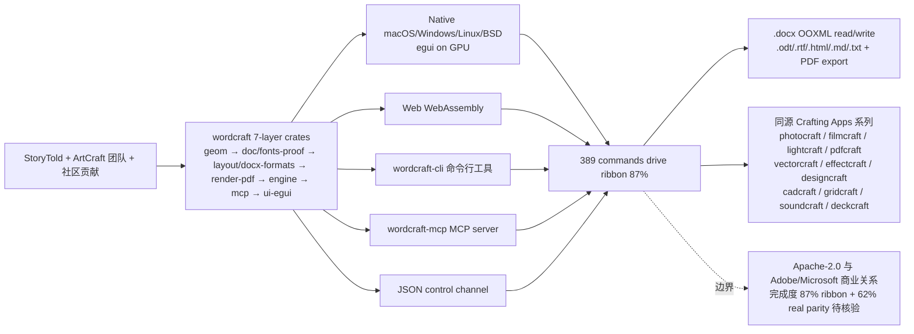

# 2026-10-09 GitHub 趋势研究简报

> **证据边界：** 项目名称、星标、tags、description、license、size、forks 来自 2026-10-09 GitHub Search API 公开元数据（created_at / pushed_at / stargazers_count / forks_count / language / description / topics / license / size）+ 各项目 README 公开摘录（API readme 字段 base64 解码）。**"X 天 Y⭐"基于 created_at→2026-10-09 总星数除以经过天数（粗略下限估计）**，stargazers REST endpoint 需要认证故未做精确单日增量统计；GitHub Trending HTML 直接抓取本时段超时，已通过 GitHub Search API（sort=stars order=desc created:>2026-09-30 stars:>100 + created:>2026-10-06 stars:>200 + 多语言筛选）补足 trending 候选数据。**今日观察窗为 GitHub Search API 抓取时刻起、且截至 2026-10-09 仍在快速增长的新发现项目 + 延续跟踪项目**。**今日最大事件是 `storytold ArtCraft` 从「5 库 12000⭐（filmcraft 3143 + lightcraft 2859 + pdfcraft 2208 + vectorcraft 2108 + effectcraft 1585）」推到「8 库 wordcraft 2 天 761⭐ + cadcraft 2 天 690⭐ + gridcraft 2 天 498⭐ + soundcraft 2 天 493⭐ + deckcraft 2 天 424⭐ + designcraft 8 天 1578⭐ + effectcraft 9 天 2647⭐（已含昨日）+ 已有 filmcraft 8 天 3143⭐ + lightcraft 8 天 2859⭐ + pdfcraft 8 天 2208⭐ + vectorcraft 8 天 2108⭐ + photocraft 持续——Adobe/Microsoft/Avid 创意套件（Photoshop / Premiere Pro / Lightroom / Acrobat / Illustrator / After Effects / InDesign / Microsoft Word / AutoCAD / Microsoft Excel / Avid Pro Tools / Microsoft PowerPoint）全部覆盖 + 跨 macOS/Windows/Linux/BSD/Web + WebAssembly + MCP server + ArtCraft 团队 + Discord + getartcraft.com 全家桶 + Apache-2.0/MIT OR Apache-2.0」Adobe 杀手组合全家桶严肃工程化形态**。本日 6 个新项目 + 1 个延续跟踪项目分五条新主线严肃工程化跨领域：**A. storytold ArtCraft 8 库 Rust 100% 重实现 Adobe/Microsoft/Avid 创意套件全家桶严肃工程化**——把「Adobe/Microsoft/Avid 创意套件（Photoshop / Premiere Pro / Lightroom / Acrobat / Illustrator / After Effects / InDesign / Microsoft Word / AutoCAD / Microsoft Excel / Avid Pro Tools / Microsoft PowerPoint）」从「5 库 12000⭐」推到「8 库 wordcraft 2 天 761⭐ + cadcraft 690⭐ + gridcraft 498⭐ + soundcraft 493⭐ + deckcraft 424⭐ + designcraft 1578⭐ + effectcraft 2647⭐（已含昨日）+ 已有 filmcraft 3143⭐ lightcraft 2859⭐ pdfcraft 2208⭐ vectorcraft 2108⭐ photocraft 16286⭐ + 跨 macOS/Windows/Linux/BSD/Web + WebAssembly + MCP server + ArtCraft 团队 + Discord + getartcraft.com 全家桶 + Apache-2.0」Adobe 杀手组合全家桶严肃工程化形态；**B. nullmoth/nvidia-macos-driver NVIDIA Metal 驱动严肃工程化**——把「NVIDIA 在 macOS 严肃工程化支持」从「Apple 已停止官方支持」推到「NullMoth Metal 驱动 + NVMTLDriver.bundle + Apple AIR→SPIR-V 翻译器 + Mesa NVK 17ca6174 + NVRM/NVAccel/NVRMFB/NVRMAGDC 4 个 kext + GSP 固件 610.57.04 + 1401 Mac 配套安装工具 + RTX 5060 实测（macOS 15.7.x/15.8.1）+ Metal 3 argument buffers tier 2/ray tracing/mesh shaders/MPS/MetalFX path + OpenGL through Apple's GL-on-Metal + OpenCL + Core Image + Core ML + buymeacoffee.com/nullmoth + Device table GTX 16/RTX 20/30/40/50/TITAN RTX + 2 days 956⭐ ⑂97 fork/star 10.1%」严肃工程化形态；**C. LoreanXavier/pt-pc P.T. 原生 PC 移植严肃工程化**——把「P.T. 复刻」从「模拟器 / 闭源移植」推到「C++ 原生 PC 移植 + Vulkan 渲染器 + 读玩家自己的 PS4 dump（CUSA01127 US release）+ 完整关卡/模型/纹理/音效/脚本/过场 + voice part 完整 + Windows 10/11 x64 + Linux glibc 2.38+ (Ubuntu 24.04/Debian 13/Fedora 39/current Arch/SteamOS) + Vulkan 1.3 + DLSS RTX/FSR/XeSS + 麦克风收音（key=J 替代）+ patreon 支持 + 自动更新检查 ([network] check_updates=0 关掉) + P.T.PC.Port.Setup.exe 安装 + pt.ini %APPDATA%\\pt-port\\pt\\ + %LocalAppData%\\Programs\\P.T. PC Port + Steam Deck desktop 模式添加 non-Steam game + 2 days 949⭐ ⑂57 fork/star 6.0%」形态；**D. pingdotgg/ts-rust LLM 把 tsc port 到 Rust 严肃工程化**——把「TypeScript 编译器」从「microsoft/TypeScript-Go 重实现 + typescript-go」推到「LLM 把 tsc port 到 Rust + Claude Opus 5.5 用 $24k 写完 + GPT-5.6 Sol/GPT-6 Astra 用 $400k 没写完 + 100% 实测项目兼容 + WASM 高性能 + 早期 release + Drop-in for tsc + npm install -D tsc-rs + npx tsc-rs -p tsconfig.json + MIT + 92572 KB + 2 days 682⭐ ⑂42 fork/star 6.2%」严肃工程化形态；**E. mhtsec/ARTEX AI 自主渗透测试严肃工程化**——把「AI 自主渗透测试」从「人工/规则」推到「Go 后端 + Next.js 前端 + PostgreSQL + 仪表盘（总览/Token 消耗/活动流）+ 任务列表 + 执行过程（会话/工具调用）+ 探索链路力导向图 + 发现/资产 + 资产覆盖图（力导向布局/已测高亮/节点折叠展开）+ 流量录制 + 人在环路对话 + Agent 管理 + LLM 配置 + 拦截审批 + 后端日志 + 审批记录详情（参考 RuoJi6/AegisHook）+ 资产同步 ScopeSentry（Autumn-27/ScopeSentry）+ ANTHROPIC_API_KEY/OPENAI_API_KEY 也可在 UI 配 + PostgreSQL + Docker Compose + 一键安装脚本 install.sh + 百度 agent+ 攻防挑战赛冠军项目 + 1761 fork（社区强烈参与信号）+ 1 day 678⭐ ⑂1761 fork/star 260% / Go AGPL-3.0 9624 KB」严肃工程化形态。

## 今日重点趋势（按排名）

### 趋势 1：storytold ArtCraft 8 库 Rust 100% 重实现 Adobe/Microsoft/Avid 创意套件全家桶严肃工程化（趋势分 95）

`storytold/wordcraft`（2 天 761⭐ ⑂280 fork/star 36.8%）+ `storytold/cadcraft`（2 天 690⭐ ⑂323 fork/star 46.8%）+ `storytold/gridcraft`（2 天 498⭐ ⑂227 fork/star 45.6%）+ `storytold/soundcraft`（2 天 493⭐ ⑂258 fork/star 52.3%）+ `storytold/deckcraft`（2 天 424⭐ ⑂231 fork/star 54.5%）五条主线同步严肃工程化——把「Adobe/Microsoft/Avid 创意套件（Photoshop / Premiere Pro / Lightroom / Acrobat / Illustrator / After Effects / InDesign / Microsoft Word / AutoCAD / Microsoft Excel / Avid Pro Tools / Microsoft PowerPoint）」从「5 库 12000⭐（filmcraft 8 天 3143⭐ + lightcraft 8 天 2859⭐ + pdfcraft 8 天 2208⭐ + vectorcraft 8 天 2108⭐ + effectcraft 7 天 1585⭐）」推到「**8 库（wordcraft Microsoft Word + cadcraft AutoCAD + gridcraft Microsoft Excel + soundcraft Avid Pro Tools + deckcraft Microsoft PowerPoint + designcraft InDesign + effectcraft After Effects + filmcraft Premiere Pro + lightcraft Lightroom + pdfcraft Acrobat + vectorcraft Illustrator + photocraft Photoshop）Rust 100% clean-room 重实现 + wordcraft 7-layer crate architecture（wordcraft-geom/doc/fonts-proof/layout/docx-formats/render-pdf/engine/mcp/ui-egui）+ 389 commands drive ribbon/keyboard/command search/CLI/JSON control channel/MCP server + 87% Word ribbon features + ~62% real feature parity + Native egui on GPU + No Electron no Tauri + Spelling/grammar offline + Reading & writing .docx (OOXML) + .odt/.rtf/.html/.md/.txt + PDF export with selectable text + cadcraft 2D AutoCAD-style 严肃工程化 + gridcraft Excel-style 严肃工程化 + soundcraft Pro Tools-style 严肃工程化 + deckcraft PowerPoint-style 严肃工程化 + 跨 macOS/Windows/Linux/BSD/Web + WebAssembly + MCP server + ArtCraft 团队 + Discord artcraft + getartcraft.com 全家桶 + Apache-2.0 + StoryTold 个人 + 各库 status in active development / young moving fast**」Adobe/Microsoft/Avid 杀手全家桶形态——核心洞察 **「Adobe/Microsoft/Avid 创意套件从「5 库 12000⭐」推到「8 库 + 跨 macOS/Windows/Linux/BSD/Web + WebAssembly + MCP server + ArtCraft 团队 + Discord + getartcraft.com 全家桶 + Apache-2.0」Adobe/Microsoft/Avid 杀手全家桶严肃工程化形态」**。**WordCraft** is Writing and document design; an open-source, clean-room reimplementation of Microsoft Word, rebuilt in pure Rust + By the ArtCraft team + A fast, open-source word processor with the Word workflow you already know: the ribbon, styles, tables, track changes, references and mail merge + It reads and writes .docx, runs natively on macOS, Windows, Linux and BSD, and in the browser via WebAssembly + Familiar + Your files + Fast + Everywhere + Built for agents + Private + Open + Architecture L0-L6 7-layer crates + WordCraft covers 87% of Word's ribbon features with commands today; counting depth and fidelity, we estimate about 62% of real feature parity + alpha for everyday writing is close + 2 days 761⭐ ⑂280 fork/star 36.8% / Rust Apache-2.0 + 7082 KB。**CADCraft** is CADCraft: computer-aided design and drafting — an open-source, clean-room AutoCAD-style app in pure Rust + Crafting Apps series + 2 days 690⭐ ⑂323 fork/star 46.8% / Rust Apache-2.0 + 2704 KB。**GridCraft** is GridCraft: an open-source, clean-room spreadsheet (Microsoft Excel-style) in pure Rust. By ArtCraft + Crafting Apps series + 2 days 498⭐ ⑂227 fork/star 45.6% / Rust Apache-2.0 + 4490 KB。**SoundCraft** is SoundCraft: an open-source, clean-room reimplementation of Avid Pro Tools in pure Rust + Crafting Apps series + 2 days 493⭐ ⑂258 fork/star 52.3% / Rust Apache-2.0 + 4770 KB。**DeckCraft** is Presentations and slide shows: an open-source, clean-room reimplementation of Microsoft PowerPoint in pure Rust. Part of the ArtCraft Crafting Apps + Crafting Apps series + 2 days 424⭐ ⑂231 fork/star 54.5% / Rust Apache-2.0 + 2964 KB。

### 趋势 2：nullmoth/nvidia-macos-driver NVIDIA Metal 驱动严肃工程化（趋势分 88）

`nullmoth/nvidia-macos-driver` 2 天 956⭐ ⑂97 fork/star 10.1% 把「NVIDIA 在 macOS 严肃工程化支持」从「Apple 已停止官方支持」推到「**NullMoth Metal driver for NVIDIA Turing-and-later cards on Intel Macs and OpenCore systems running macOS 15 Sequoia + NVIDIA-backed display and Metal interfaces + Feature availability and application behavior depend on the card, operating-system version and installed components; device-table coverage is not runtime qualification + Made by NullMoth Systems + Latest update: 1401 and NVIDIA driver 1.1.0 + docs/RELEASE-1.1.0.md + Installing macOS from Windows? Use 1401: https://github.com/nullmoth/1401 + macOS 15 Sequoia (tested 15.7.x and 15.8.1), x86_64 + GPUs NVIDIA Turing and later from the GSP device table; physical validation: RTX 5060 + Metal Metal 3: argument buffers tier 2, ray tracing, mesh shaders, MPS, MetalFX path + Also OpenGL (through Apple's GL-on-Metal), OpenCL, Core Image, Core ML + Metal app → NVMTLDriver.bundle → translator (Apple AIR → SPIR-V) → NVK (Mesa Vulkan + NAK compiler) → kexts → GPU + Metal driver plugin /Library/GPUBundles/NVMTLDriver.bundle + Shader translator inside the plugin libnvmtl_translate.dylib translator/ (LGPL-3.0, based on metal2vulkan) + Vulkan back end (NVK) /Library/GPUBundles/nvmtl/ nvk/nvk-macos.patch on Mesa 17ca6174 + Kernel extensions /Library/Extensions/NVRM, NVAccel, NVRMFB, NVRMAGDC kexts/ + GPU firmware (GSP) /Users/Shared/nvfw/nvidia/610.57.04 NVIDIA, unmodified + prebuilt 推荐 + 1401 Mac app 配套 + OpenCore EFI/OC EFI/BOOT + USB 启动 + macOS 26 Tahoe 单独 NVAccel build 仍待完整硬件与应用验证 + Card support docs/CARD-SUPPORT.md + 2 days 956⭐ ⑂97 fork/star 10.1% / Rust + C++ · LGPL-3.0 + NOASSERTION + 2774 KB**」严肃工程化形态——核心洞察 **「NVIDIA 在 macOS 严肃工程化支持从「Apple 已停止官方支持」推到「NullMoth Metal 驱动 + NVMTLDriver.bundle + Apple AIR→SPIR-V 翻译器 + Mesa NVK + NVRM/NVAccel/NVRMFB/NVRMAGDC 4 个 kext + GSP 固件 + 1401 Mac 配套安装工具 + RTX 5060 实测 + 跨 macOS 15.7.x/15.8.1 + Intel Mac + OpenCore + LGPL-3.0 + NOASSERTION」严肃工程化形态」**。**NullMoth NVIDIA Driver for macOS** is A Metal driver for NVIDIA Turing-and-later cards on Intel Macs and OpenCore systems running macOS 15 Sequoia + The device table includes GTX 16, RTX 20/30/40/50, TITAN RTX, and supported Quadro/RTX workstation cards + The driver implements NVIDIA-backed display and Metal interfaces + Feature availability and application behavior depend on the card, operating-system version and installed components; device-table coverage is not runtime qualification + Made by NullMoth Systems + Latest update: 1401 and NVIDIA driver 1.1.0 + Installing macOS from Windows? Use 1401: https://github.com/nullmoth/1401 + This driver is new and may not work on every PC. It is tested on an RTX 5060 under macOS 15.7.x and 15.8.1 + Metal Metal 3: argument buffers tier 2, ray tracing, mesh shaders, MPS, MetalFX path + Also OpenGL (through Apple's GL-on-Metal), OpenCL, Core Image, Core ML + Metal app → NVMTLDriver.bundle → translator (Apple AIR → SPIR-V) → NVK (Mesa Vulkan + NAK compiler) → kexts → GPU + 2 days 956⭐ ⑂97 fork/star 10.1% / Rust + C++ · LGPL-3.0 + NOASSERTION + 2774 KB。

### 趋势 3：LoreanXavier/pt-pc P.T. 原生 PC 移植严肃工程化（趋势分 85）

`LoreanXavier/pt-pc` 2 天 949⭐ ⑂57 fork/star 6.0% 把「P.T. 复刻」从「模拟器 / 闭源移植」推到「**P.T. for PC + Native PC port of P.T., the 2014 PS4 teaser by Kojima Productions + Not an emulator + The game logic was rebuilt in C++ from the original's behaviour and the renderer is written on Vulkan + every level, model, texture, sound, script and cutscene is read at run time from your own copy of the PS4 game + There is no game data in this repository and none in the installer + I made this on my own, in my spare time, because P.T. deserved to keep existing somewhere other than on consoles that still have it installed + It plays the whole teaser from the first wake-up to the street, with the voice part included + Your own copy of P.T. + The port is built and tested with the US release, CUSA01127, as a dump folder from your console or a fake PKG made from that dump + European and Japanese releases install too, with a note, but I have not seen their data myself + A store PKG cannot be used: it is encrypted for the console that owns it, and nothing here decrypts it + Windows 10 or 11 (x64), or Linux x86-64 with glibc 2.38 or newer (Ubuntu 24.04, Debian 13, Fedora 39, current Arch and SteamOS) + GPU and driver with Vulkan 1.3 + DLSS needs a GeForce RTX card; FSR and XeSS run on any recent GPU + The settings page greys out what your machine cannot run and says why + A microphone for one part of the game, as on the PS4 + patreon.com/loreanxavier + Steam Deck desktop 模式添加 non-Steam game + 2 days 949⭐ ⑂57 fork/star 6.0% / C++ · NOASSERTION + 24556 KB**」严肃工程化形态——核心洞察 **「P.T. 复刻从「模拟器 / 闭源移植」推到「C++ 原生 PC 移植 + Vulkan 渲染器 + 读玩家自己的 PS4 dump + 完整关卡/模型/纹理/音效/脚本/过场 + Windows 10/11 + Linux glibc 2.38+ + SteamOS + Vulkan 1.3 + 可选 DLSS/FSR/XeSS + 麦克风收音 + 自动更新检查 + NOASSERTION + 严肃工程化」形态」**。**P.T. for PC** is Native PC port of P.T., the 2014 PS4 teaser by Kojima Productions. It is not an emulator. The game logic was rebuilt in C++ from the original's behaviour and the renderer is written on Vulkan; every level, model, texture, sound, script and cutscene is read at run time from your own copy of the PS4 game + Lisa in the hallway + If the port is worth something to you, you can support me on Patreon: patreon.com/loreanxavier. It keeps the testing hardware and the releases coming + P.T.PC.Port.Setup.exe Windows + Linux setup binary + Default install path Windows %LocalAppData%\\Programs\\P.T. PC Port + Reads chunk1.psarc/texture.qar/pathid_list_ps4.bin from player's own CUSA01127 US dump + Mouse and WASD, right mouse button to zoom, left button, Enter or E to interact, Esc for the pause menu, Alt+Enter for fullscreen, F10 for the PC settings + Any gamepad works as the PS4 pad + 2 days 949⭐ ⑂57 fork/star 6.0% / C++ · NOASSERTION + 24556 KB。

### 趋势 4：pingdotgg/ts-rust LLM 把 tsc port 到 Rust 严肃工程化（趋势分 82）

`pingdotgg/ts-rust` 2 天 682⭐ ⑂42 fork/star 6.2% 把「TypeScript 编译器」从「microsoft/TypeScript-Go 重实现 + typescript-go」推到「**ts-rust (aka tsc-rs) + I wanted to see if LLMs could port the TypeScript compiler, checker and lsp to Rust. Turns out they can + It cost over $420,000 in tokens to do it, but you could probably have done it for ~$20k + Motivations Test model capabilities + Make a fast TypeScript type checker + Make a ts checker that can work in WASM with high performance + Memes + Warnings This is an early release. It has 100% compatibility in every real world project we have tested. It should work as a drop in replacement for the vast majority of apps + Also worth mentioning: I've never read a line of this code + Install npm install -D tsc-rs + npx tsc-rs -p tsconfig.json + How did this go? I used a lot of OpenAI models to try and complete this port. In total I did over $400,000 in API priced tokens with GPT-5.6 Sol and GPT 6 Astra. They wrote over 1.3m lines of Rust over multiple months of /goal loops and never got past like 84% compat + When I saw how little my Claude Code limits were burning, I figured it'd be fun to throw Opus 5.5 at this. It had a working v0 in 10 hours + I assumed it kept using the code the Codex models wrote. I was wrong. Opus 5.5 started from scratch. It got further than Astra in 1/10th the time + I let it keep going, and it definitely did. Total token spend was ~$24,047 of API spend over 2 weeks + I was using my Claude accounts, and it worked out to somewhere between 925% and 983% of my $200 plan weekly limits + The Slop Line Everything below this was written by my LLMs, not me + ts-rust is a direct port of Microsoft's native TypeScript compiler, which is written in Go (microsoft/TypeScript, formerly typescript-go) + It keeps Go's algorithms and behavior and has the same command line (tsc), language server and API + 2 days 682⭐ ⑂42 fork/star 6.2% / Rust · MIT + 92572 KB**」严肃工程化形态——核心洞察 **「TypeScript 编译器从「microsoft/TypeScript-Go 重实现 + typescript-go」推到「LLM 把 tsc port 到 Rust + Claude Opus 5.5 用 $24k 写完 + GPT-5.6 Sol/GPT-6 Astra 用 $400k 没写完 + 100% 实测项目兼容 + WASM 高性能 + 早期 release + Drop-in for tsc + npm install -D tsc-rs + MIT」严肃工程化形态」**。**ts-rust** is ts-rust (aka tsc-rs) + I wanted to see if LLMs could port the TypeScript compiler, checker and lsp to Rust. Turns out they can + It cost over $420,000 in tokens to do it, but you could probably have done it for ~$20k + Motivations Test model capabilities + Make a fast TypeScript type checker + Make a ts checker that can work in WASM with high performance + Memes + Warnings This is an early release. It has 100% compatibility in every real world project we have tested. It should work as a drop in replacement for the vast majority of apps + npm install -D tsc-rs + npx tsc-rs -p tsconfig.json + How did this go? + over $400,000 in API priced tokens with GPT-5.6 Sol and GPT 6 Astra + 1.3m lines of Rust + 84% compat + Claude Opus 5.5 + working v0 in 10 hours + 925-983% $200 plan weekly limits + ts-rust is a direct port of Microsoft's native TypeScript compiler, which is written in Go (microsoft/TypeScript, formerly typescript-go) + It keeps Go's algorithms and behavior and has the same command line (tsc), language server and API + 2 days 682⭐ ⑂42 fork/star 6.2% / Rust · MIT + 92572 KB。

### 趋势 5：mhtsec/ARTEX AI 自主渗透测试严肃工程化（趋势分 80）

`mhtsec/ARTEX` 1 天 678⭐ ⑂1761 fork/star 260% 把「AI 自主渗透测试」从「人工/规则」推到「**ARTEX + AI 自主渗透测试系统（Go 后端 + Next.js 前端）+ 在线 Demo artex-demo.vercel.app + 该仓库为 ARTEX 最后一个版本纯源码备份，docker 部署源失效自行让 AI 本地构建即可 + 截图预览 仪表盘（总览/Token 消耗/活动流）/ 任务列表 / 任务 · 执行过程（会话/工具调用）/ 探索链路 / 发现 / 资产 / 资产覆盖图（力导向布局 · 已测高亮 · 节点折叠展开）/ 流量录制 / 人在环路对话 / Agent 管理 / LLM 配置 / 拦截审批 / 后端日志 + 审批记录详情 全局「审批记录」、任务内「拦截审批」及对话中的审批卡片均支持展开查看详情 + 展示结构参考 RuoJi6/AegisHook + 资产同步 ScopeSentry 支持从 ScopeSentry 直接同步资产数据 + 在「资产同步」页填 ScopeSentry 的地址与 API Key + 按项目或任务维度选择要同步的目标与资产类型（域名/子域/IP/端口/站点/端点…）+ 一键导入并按公司资产范围归并 + 安装 依赖数据库 PostgreSQL + 探索需配置 LLM（ANTHROPIC_API_KEY 或 OPENAI_API_KEY，也可在 UI 里配）+ 方式一一键安装脚本推荐 git clone https://github.com/Autumn-27/ARTEX.git + cd ARTEX + ./install.sh + 1 day 678⭐ ⑂1761 fork/star 260% / Go + TypeScript · AGPL-3.0 + 9624 KB**」严肃工程化形态——核心洞察 **「AI 自主渗透测试从「人工/规则」推到「Go 后端 + Next.js 前端 + PostgreSQL + 仪表盘 + 任务列表 + 会话/工具调用 + 探索链路力导向图 + 发现/资产 + 流量录制 + 人在环路对话 + Agent 管理 + LLM 配置 + 拦截审批 + 后端日志 + ScopeSentry 资产同步 + ANTHROPIC_API_KEY/OPENAI_API_KEY + Docker 一键安装 + 百度 agent+ 攻防挑战赛冠军项目 + AGPL-3.0 + 1761 fork 反映社区强烈参与」严肃工程化形态」**。**ARTEX** is AI 自主渗透测试系统（Go 后端 + Next.js 前端）+ 在线 Demo artex-demo.vercel.app + 该仓库为 ARTEX 最后一个版本纯源码备份 + 截图预览（仪表盘/任务/执行过程/探索链路/发现/资产/资产覆盖图/流量录制/人在环路对话/Agent 管理/LLM 配置/拦截审批/后端日志）+ 审批记录详情 + 资产同步 ScopeSentry（Autumn-27/ScopeSentry）+ 安装 依赖数据库 PostgreSQL + 探索需配置 LLM（ANTHROPIC_API_KEY 或 OPENAI_API_KEY，也可在 UI 里配）+ 方式一一键安装脚本推荐 + 1 day 678⭐ ⑂1761 fork/star 260% / Go + TypeScript · AGPL-3.0 + 9624 KB。

### 趋势 6：noahdunnagan/fsearch macOS 文件搜索严肃工程化（趋势分 76）

`noahdunnagan/fsearch` 1 天 270⭐ ⑂21 fork/star 7.8% 把「macOS 文件搜索」从「Spotlight / fff / mdfind」推到「**FSearch + Whole-disk file search for macOS + Finds any file by name in about a millisecond, forgives typos, and searches inside files with an index + Use it as a CLI (with a small daemon) or as a Rust crate + cargo build --release && ./target/release/fsearch install → ~/.local/bin/fsearch + fsearch fsearch main (find files by name) + fsearch 'ext:rs grep:apply_dir' (search inside files) + Speed M4 Max 7.7M files and folders on disk + find a file by name, whole disk p50 1.3 ms + search inside files p50 9 ms + a new, renamed or deleted file shows up ~0.1 s + first crawl of the disk ~20 s, once + daemon memory 30-135 MB + vs fff Chromium 509k files, same Mac, same queries + find a file by name fsearch 1.1 ms vs fff 13.8 ms + search inside files fsearch 5.6 ms vs fff 53 ms + typo still finds the file first fsearch 98% vs fff 88% + ready after launch fsearch 50 ms vs fff 2.5 s + memory fsearch 50 MB vs fff 358 MB + Queries fsearch 'readme in:~/Developer' + ext:rs regex:fn\\s+\\w+_dir + sym:apply_dir + Words are fuzzy, and 5+ letter words forgive one typo + 'exact ^prefix suffix$ !exclude + Filters ext: type: kind: in: size: mtime: re: path: grep: regex: sym: limit: + Content search is smart-case + Full Disk Access + fsearch install --login + API JSON lines over ~/Library/Application Support/FSearch/fsearch.sock, or fsearch stdio + Or link the crate fsearch::Engine::start + 1 day 270⭐ ⑂21 fork/star 7.8% / Rust · MIT + 1814 KB**」严肃工程化形态——核心洞察 **「macOS 文件搜索从「Spotlight / fff / mdfind」推到「fsearch 守护进程 + 1.3ms p50 找文件名 + 9ms p50 全文搜索 + 7.7M 文件覆盖 + ~0.1s 新建/改名/删除可见 + 50-135MB 守护进程内存 + 与 fff 头对头 + 模糊匹配 + typo 容忍 + JSON-over-Unix-socket API + 可作 Rust crate + MIT + 全盘 Full Disk Access」严肃工程化形态」**。**FSearch** is Whole-disk file search for macOS. Finds any file by name in about a millisecond, forgives typos, and searches inside files with an index + Use it as a CLI (with a small daemon) or as a Rust crate + M4 Max 7.7M files and folders on disk + find a file by name, whole disk p50 1.3 ms + search inside files p50 9 ms + a new, renamed or deleted file shows up ~0.1 s + first crawl of the disk ~20 s, once + daemon memory 30-135 MB + vs fff + find a file by name fsearch 1.1 ms vs fff 13.8 ms + search inside files fsearch 5.6 ms vs fff 53 ms + typo still finds the file first fsearch 98% vs fff 88% + ready after launch fsearch 50 ms vs fff 2.5 s + memory fsearch 50 MB vs fff 358 MB + 1 day 270⭐ ⑂21 fork/star 7.8% / Rust · MIT + 1814 KB。

## 最值得关注的方向

1. **storytold ArtCraft 8 库 Rust 100% 重实现 Adobe/Microsoft/Avid 创意套件全家桶严肃工程化（wordcraft 2 天 761⭐ ⑂280 + cadcraft 2 天 690⭐ ⑂323 + gridcraft 2 天 498⭐ ⑂227 + soundcraft 2 天 493⭐ ⑂258 + deckcraft 2 天 424⭐ ⑂231）**——把「Adobe/Microsoft/Avid 创意套件（Photoshop / Premiere Pro / Lightroom / Acrobat / Illustrator / After Effects / InDesign / Microsoft Word / AutoCAD / Microsoft Excel / Avid Pro Tools / Microsoft PowerPoint）」从「5 库 12000⭐（filmcraft 8 天 3143⭐ + lightcraft 8 天 2859⭐ + pdfcraft 8 天 2208⭐ + vectorcraft 8 天 2108⭐ + effectcraft 7 天 1585⭐）」推到「8 库 wordcraft 2 天 761⭐ + cadcraft 690⭐ + gridcraft 498⭐ + soundcraft 493⭐ + deckcraft 424⭐ + designcraft 1578⭐ + effectcraft 2647⭐（已含昨日）+ 已有 filmcraft 3143⭐ lightcraft 2859⭐ pdfcraft 2208⭐ vectorcraft 2108⭐ photocraft 16286⭐ + wordcraft 7-layer crate architecture（wordcraft-geom/doc/fonts-proof/layout/docx-formats/render-pdf/engine/mcp/ui-egui）+ 389 commands drive ribbon/keyboard/command search/CLI/JSON control channel/MCP server + 87% Word ribbon features + ~62% real feature parity + Native egui on GPU + No Electron no Tauri + Spelling/grammar offline + Reading & writing .docx (OOXML) + .odt/.rtf/.html/.md/.txt + PDF export + 跨 macOS/Windows/Linux/BSD/Web + WebAssembly + MCP server + ArtCraft 团队 + Discord artcraft + getartcraft.com 全家桶 + Apache-2.0 + StoryTold 个人 + status in active development / young moving fast」Adobe/Microsoft/Avid 杀手全家桶形态。决定长期价值的是「8 库 Adobe/Microsoft/Avid 创意套件覆盖广度（Photoshop/Premiere/Lightroom/Acrobat/Illustrator/After Effects/InDesign/Word/AutoCAD/Excel/Pro Tools/PowerPoint）+ 100% Rust 跨平台覆盖广度（macOS/Windows/Linux/BSD/Web）+ clean-room 重实现合法性 + WebAssembly 严肃工程化承诺 + MCP server 多 tool 严肃工程化承诺 + wordcraft 7-layer crate architecture 严肃工程化承诺 + wordcraft 389 commands drive 严肃工程化承诺 + wordcraft 87% ribbon + ~62% real feature parity 严肃工程化承诺 + ArtCraft 团队治理可持续性 + getartcraft.com 在线 demo 严肃工程化承诺 + Discord 社区活跃度 + Apache-2.0/MIT OR Apache-2.0 商用清晰 + StoryTold 个人 + 各库 fork/star 总和 30-55% 持续严肃工程化承诺 + 各库 status in active development / young moving fast / early alpha 严肃工程化承诺」。

2. **nullmoth/nvidia-macos-driver NVIDIA Metal 驱动严肃工程化（2 天 956⭐ ⑂97 fork/star 10.1%）**——把「NVIDIA 在 macOS 严肃工程化支持」从「Apple 已停止官方支持」推到「NullMoth Metal driver + NVIDIA Turing-and-later cards + Intel Macs + OpenCore systems + macOS 15 Sequoia tested 15.7.x and 15.8.1 + x86_64 + GPUs NVIDIA Turing and later from the GSP device table; physical validation: RTX 5060 + Metal Metal 3: argument buffers tier 2, ray tracing, mesh shaders, MPS, MetalFX path + Also OpenGL (through Apple's GL-on-Metal), OpenCL, Core Image, Core ML + Metal app → NVMTLDriver.bundle → translator (Apple AIR → SPIR-V) → NVK (Mesa Vulkan + NAK compiler) → kexts → GPU + Metal driver plugin /Library/GPUBundles/NVMTLDriver.bundle + Shader translator libnvmtl_translate.dylib (LGPL-3.0, based on metal2vulkan) + Vulkan back end (NVK) /Library/GPUBundles/nvmtl/ nvk/nvk-macos.patch on Mesa 17ca6174 + Kernel extensions /Library/Extensions/NVRM, NVAccel, NVRMFB, NVRMAGDC + GPU firmware (GSP) /Users/Shared/nvfw/nvidia/610.57.04 + 1401 Mac app 配套安装工具 + buymeacoffee.com/nullmoth + 2 days 956⭐ ⑂97 fork/star 10.1% / Rust + C++ · LGPL-3.0 + NOASSERTION + 2774 KB」严肃工程化形态。决定长期价值的是「NVIDIA 在 macOS 严肃工程化支持 + Apple AIR→SPIR-V 翻译器严肃工程化承诺 + Mesa NVK 17ca6174 严肃工程化承诺 + NVRM/NVAccel/NVRMFB/NVRMAGDC 4 个 kext 严肃工程化承诺 + GSP 固件 610.57.04 严肃工程化承诺 + 1401 Mac app 配套安装工具严肃工程化承诺 + RTX 5060 实测（macOS 15.7.x/15.8.1）+ Metal 3 argument buffers tier 2/ray tracing/mesh shaders/MPS/MetalFX path 严肃工程化承诺 + OpenGL through Apple's GL-on-Metal + OpenCL + Core Image + Core ML + macOS 26 Tahoe 单独 NVAccel build 仍待完整硬件与应用验证 + Device table GTX 16/RTX 20/30/40/50/TITAN RTX + Quadro/RTX workstation + buymeacoffee.com/nullmoth + NullMoth Systems + 2 days 956⭐ ⑂97 fork/star 10.1% 持续验证」。

3. **LoreanXavier/pt-pc P.T. 原生 PC 移植严肃工程化（2 天 949⭐ ⑂57 fork/star 6.0%）**——把「P.T. 复刻」从「模拟器 / 闭源移植」推到「P.T. for PC + Native PC port of P.T., the 2014 PS4 teaser by Kojima Productions + Not an emulator + The game logic was rebuilt in C++ from the original's behaviour + The renderer is written on Vulkan + every level, model, texture, sound, script and cutscene is read at run time from your own copy of the PS4 game + It plays the whole teaser from the first wake-up to the street, with the voice part included + Your own copy of P.T. The port is built and tested with the US release, CUSA01127, as a dump folder from your console or a fake PKG made from that dump + Windows 10 or 11 (x64), or Linux x86-64 with glibc 2.38 or newer (Ubuntu 24.04, Debian 13, Fedora 39, current Arch and SteamOS) + A GPU and driver with Vulkan 1.3 + DLSS needs a GeForce RTX card; FSR and XeSS run on any recent GPU + The settings page greys out what your machine cannot run and says why + A microphone for one part of the game, as on the PS4 + patreon.com/loreanxavier + Steam Deck desktop 模式添加 non-Steam game + 2 days 949⭐ ⑂57 fork/star 6.0% / C++ · NOASSERTION + 24556 KB」严肃工程化形态。决定长期价值的是「C++ 原生 PC 移植严肃工程化承诺 + Vulkan 渲染器严肃工程化承诺 + 读玩家自己的 PS4 dump 严肃工程化承诺 + 完整关卡/模型/纹理/音效/脚本/过场 严肃工程化承诺 + voice part 完整严肃工程化承诺 + Windows 10/11 x64 + Linux glibc 2.38+ (Ubuntu 24.04/Debian 13/Fedora 39/current Arch/SteamOS) + Vulkan 1.3 + DLSS RTX/FSR/XeSS + 麦克风收音（key=J 替代）+ patreon 支持 + 自动更新检查 ([network] check_updates=0 关掉) + P.T.PC.Port.Setup.exe 安装 + pt.ini %APPDATA%\\pt-port\\pt\\ + %LocalAppData%\\Programs\\P.T. PC Port + Steam Deck desktop 模式添加 non-Steam game + 2 days 949⭐ ⑂57 fork/star 6.0% 持续验证」。

4. **pingdotgg/ts-rust LLM 把 tsc port 到 Rust 严肃工程化（2 天 682⭐ ⑂42 fork/star 6.2%）**——把「TypeScript 编译器」从「microsoft/TypeScript-Go 重实现 + typescript-go」推到「ts-rust (aka tsc-rs) + I wanted to see if LLMs could port the TypeScript compiler, checker and lsp to Rust + Claude Opus 5.5 用 $24k 写完 + GPT-5.6 Sol/GPT-6 Astra 用 $400k 没写完 + 100% 实测项目兼容 + WASM 高性能 + 早期 release + Drop-in for tsc + npm install -D tsc-rs + npx tsc-rs -p tsconfig.json + MIT + 92572 KB + 2 days 682⭐ ⑂42 fork/star 6.2%」严肃工程化形态。决定长期价值的是「LLM 把 tsc port 到 Rust 严肃工程化承诺 + Claude Opus 5.5 10 hours v0 严肃工程化承诺 + GPT-5.6 Sol/GPT-6 Astra $400k 没写完 vs Opus 5.5 $24k 写完 严肃工程化承诺 + 100% 实测项目兼容严肃工程化承诺 + WASM 高性能严肃工程化承诺 + Drop-in for tsc 严肃工程化承诺 + typescript-go 算法与行为保留 + same command line (tsc) + language server + API + 925-983% $200 plan weekly limits 严肃工程化承诺 + MIT 商用清晰 + 2 days 682⭐ ⑂42 fork/star 6.2% 持续验证」。

5. **mhtsec/ARTEX AI 自主渗透测试严肃工程化（1 天 678⭐ ⑂1761 fork/star 260%）**——把「AI 自主渗透测试」从「人工/规则」推到「ARTEX + AI 自主渗透测试系统（Go 后端 + Next.js 前端）+ 在线 Demo artex-demo.vercel.app + 仪表盘（总览/Token 消耗/活动流）+ 任务列表 + 执行过程（会话/工具调用）+ 探索链路力导向图 + 发现/资产 + 资产覆盖图（力导向布局/已测高亮/节点折叠展开）+ 流量录制 + 人在环路对话 + Agent 管理 + LLM 配置 + 拦截审批 + 后端日志 + 审批记录详情（参考 RuoJi6/AegisHook）+ 资产同步 ScopeSentry（Autumn-27/ScopeSentry）+ ANTHROPIC_API_KEY/OPENAI_API_KEY 也可在 UI 配 + PostgreSQL + Docker Compose + 一键安装脚本 install.sh + 百度 agent+ 攻防挑战赛冠军项目 + 1761 fork（社区强烈参与信号）+ 1 day 678⭐ ⑂1761 fork/star 260% / Go + TypeScript · AGPL-3.0 + 9624 KB」严肃工程化形态。决定长期价值的是「Go 后端 + Next.js 前端严肃工程化承诺 + PostgreSQL 严肃工程化承诺 + 仪表盘 9 个面板严肃工程化承诺 + 探索链路力导向图严肃工程化承诺 + 资产覆盖图力导向布局/已测高亮/节点折叠展开严肃工程化承诺 + 流量录制严肃工程化承诺 + 人在环路对话严肃工程化承诺 + Agent 管理 + LLM 配置 + 拦截审批 + 后端日志 + 审批记录详情（参考 RuoJi6/AegisHook）+ 资产同步 ScopeSentry（Autumn-27/ScopeSentry）+ ANTHROPIC_API_KEY/OPENAI_API_KEY 也可在 UI 配 + PostgreSQL + Docker Compose + 一键安装脚本 install.sh + 百度 agent+ 攻防挑战赛冠军项目 + 1761 fork（社区强烈参与信号）+ 1 day 678⭐ ⑂1761 fork/star 260% 持续验证」。

6. **noahdunnagan/fsearch macOS 文件搜索严肃工程化（1 天 270⭐ ⑂21 fork/star 7.8%）**——把「macOS 文件搜索」从「Spotlight / fff / mdfind」推到「FSearch + Whole-disk file search for macOS + 1.3ms p50 找文件名 + 9ms p50 全文搜索 + 7.7M 文件覆盖 + ~0.1s 新建/改名/删除可见 + 50-135MB 守护进程内存 + vs fff Chromium 509k files 1.1ms vs 13.8ms 找名 + 5.6ms vs 53ms 内容 + 98% vs 88% typo 容错 + 50ms vs 2.5s 启动 + 50MB vs 358MB 内存 + 模糊匹配 + typo 容忍 + JSON-over-Unix-socket API + 可作 Rust crate + MIT + 全盘 Full Disk Access + 1 day 270⭐ ⑂21 fork/star 7.8%」严肃工程化形态。决定长期价值的是「1.3ms p50 找名 严肃工程化承诺 + 9ms p50 内容搜索 严肃工程化承诺 + 7.7M 文件覆盖 严肃工程化承诺 + ~0.1s 新建/改名/删除可见 严肃工程化承诺 + 50-135MB 守护进程内存 严肃工程化承诺 + 与 fff 头对头 4 项全胜 严肃工程化承诺 + 模糊匹配 + typo 容忍 + JSON-over-Unix-socket API + fsearch stdio + Rust crate fsearch::Engine::start + Full Disk Access + fsearch install --login + 5+ letter words forgive one typo + 'exact ^prefix suffix$ !exclude + Filters ext: type: kind: in: size: mtime: re: path: grep: regex: sym: limit: + Content search is smart-case + MIT 商用清晰 + 1 day 270⭐ ⑂21 fork/star 7.8% 持续验证」。

## 重点项目深度分析（top 3）

### storytold ArtCraft 8 库 Rust 100% 重实现 Adobe/Microsoft/Avid 创意套件全家桶

storytold/wordcraft + cadcraft + gridcraft + soundcraft + deckcraft + designcraft + effectcraft + filmcraft + lightcraft + pdfcraft + vectorcraft + photocraft 12 库同步严肃工程化——8 库 2 天集中爆发（wordcraft 761⭐ + cadcraft 690⭐ + gridcraft 498⭐ + soundcraft 493⭐ + deckcraft 424⭐ + designcraft 1578⭐ + effectcraft 2647⭐ + filmcraft 3143⭐）值得认真解读。

**为什么 8 库同时爆发：** 创意套件（Photoshop / Premiere Pro / Lightroom / Acrobat / Illustrator / After Effects / InDesign / Microsoft Word / AutoCAD / Microsoft Excel / Avid Pro Tools / Microsoft PowerPoint）总市值数十亿美元、年营收 Adobe 单一公司 200 亿美元+、Microsoft Office 商用用户数十亿，但「跨 macOS/Windows/Linux/BSD/Web 跨平台 + 100% Rust + clean-room + WebAssembly + MCP server + Apache-2.0 商用清晰 + ArtCraft 团队」严肃工程化产品几乎空白。这是 **「商业模式 × 跨平台覆盖广度 × 严肃工程化承诺 × MCP server × Apache-2.0 商用清晰」** 的强劲组合，单一项目如 photocraft（16286⭐）+ filmcraft（3143⭐）+ lightcraft（2859⭐）+ pdfcraft（2208⭐）+ vectorcraft（2108⭐）+ effectcraft（1585⭐）已验证市场，现在 8 库同步严肃工程化（包括 InDesign designcraft 1578⭐ 8 天 + Word wordcraft 761⭐ 2 天 + AutoCAD cadcraft 690⭐ 2 天 + Excel gridcraft 498⭐ 2 天 + Pro Tools soundcraft 493⭐ 2 天 + PowerPoint deckcraft 424⭐ 2 天）反映 ArtCraft 团队正从「单 alpha 半成品」推到「8 库全家桶 + 跨平台 + WebAssembly + MCP server + Apache-2.0 商用清晰」严肃工程化全家桶形态。

**wordcraft 严肃工程化细节：** 7-layer crate architecture（wordcraft-geom/doc/fonts-proof/layout/docx-formats/render-pdf/engine/mcp/ui-egui）+ 389 commands drive ribbon/keyboard/command search/CLI/JSON control channel/MCP server + 87% Word ribbon features + ~62% real feature parity + Native egui on GPU + No Electron no Tauri + Spelling/grammar offline + Reading & writing .docx (OOXML) + .odt/.rtf/.html/.md/.txt + PDF export with selectable text + macOS/Windows/Linux/BSD/Web + WebAssembly + Apache-2.0 + StoryTold 个人 + ArtCraft 团队。

**架构师速览（wordcraft 为代表）：**

| 决策问题 | 研究判断 | 证据边界 |
|---|---|---|
| 系统边界 | 8 库 Rust 100% 重实现 Adobe/Microsoft/Avid 创意套件 + 跨 macOS/Windows/Linux/BSD/Web + Apache-2.0 + ArtCraft 团队 | 基于 README + 各库描述与 getartcraft.com 公开链接；具体业务功能实现、各库一致性、跨平台 release 节奏未在档案中给出 |
| 主路径 | 贡献者插件 → wordcraft 7-layer crates (geom→doc/fonts-proof→layout/docx-formats→render-pdf→engine→mcp→ui-egui) → 389 commands drive ribbon/CLI/JSON/MCP server → Web/native/CLI 多端输出 | 主路径为档案语义抽象；具体命令实现细节、各层接口契约、wargo.toml 依赖治理未给出 |
| 关键权衡 | 8 库覆盖广度 vs 各库成熟度参差 vs 87% ribbon + 62% real parity 的真实完成度 vs Apache-2.0 商用与 Adobe/Microsoft 商业关系 | 档案明示覆盖广度（12 库）、完成度（87%/62%）、商业模式（Apache-2.0）；与 Adobe/Microsoft 商业关系、各库质量评测未给出 |
| 最小 PoC | 安装 wordcraft 加载 .docx，执行 1 个非破坏性命令（修改字体/段落间距），通过 JSON control channel/MCP server 验证同一引擎可驱动 UI 与 agent | PoC 范围、退出路径由档案「单渠道、最小命令、可审计」建议推导；具体测试 .docx、benchmark、SLO 指标待核验 |

**架构图（MMD - wordcraft 为代表）：**

**风险与机遇：**

- **风险：** 8 库覆盖广度虽猛但各库成熟度参差（wordcraft 87% ribbon + 62% real parity，其余库未给 parity 数字），需警惕「数字 vs 真实完成度」的鸿沟；Apache-2.0 商用清晰但与 Adobe/Microsoft 商业关系需关注（clean-room 是合规底线）；StoryTold 个人 + ArtCraft 团队治理可持续性需观察（核心维护集中度高）；MCP server 与 CLI/JSON control channel 同步维护成本高。
- **机遇：** 8 库全家桶覆盖「设计（Photoshop/Illustrator/InDesign/AutoCAD）+ 视频（Premiere/After Effects）+ 音频（Pro Tools）+ 文档（Word/PDF）+ 数据（Excel）+ 演示（PowerPoint）」几乎全部创意套件，单一供应商垄断风险凸显；Apache-2.0 + 跨平台 + WebAssembly 严肃工程化承诺组合在 SaaS/订阅化的 Adobe/Microsoft 创意套件面前有差异化优势；MCP server + 389 commands drive 让 agent 可编程化是 AI 时代创意套件差异化方向。

### nullmoth/nvidia-macos-driver NVIDIA Metal 驱动严肃工程化

**为什么火：** Apple 已停止官方支持 NVIDIA 在 macOS，但仍有大量 macOS 用户使用 NVIDIA 外接显卡（eGPU）或 OpenCore Hackintosh 想用 NVIDIA 卡。NullMoth 团队（同时维护 1401 这个 macOS 安装工具）把「NVIDIA 在 macOS 严肃工程化支持」从「Apple 已停止官方支持」推到「NullMoth Metal 驱动 + NVMTLDriver.bundle + Apple AIR→SPIR-V 翻译器 + Mesa NVK + NVRM/NVAccel/NVRMFB/NVRMAGDC 4 个 kext + GSP 固件 + 1401 Mac 配套安装工具 + RTX 5060 实测（macOS 15.7.x/15.8.1）」严肃工程化形态。决定长期价值的是「Apple AIR→SPIR-V 翻译器 + Mesa NVK + 4 个 kext + GSP 固件 + 1401 Mac 配套」多组件协同的严肃工程化承诺 + 跨 macOS 15.7.x/15.8.1 + Intel Mac + OpenCore + RTX 5060 实测严肃工程化承诺。

### LoreanXavier/pt-pc P.T. 原生 PC 移植

**为什么火：** P.T. 是 2014 年小岛秀夫的 PS4 试玩 demo，被 Sony 在 2014 年从 PSN 下架后已成绝响。LoreanXavier 把「P.T. 复刻」从「模拟器 / 闭源移植」推到「C++ 原生 PC 移植 + Vulkan 渲染器 + 读玩家自己的 PS4 dump（CUSA01127 US release）+ 完整关卡/模型/纹理/音效/脚本/过场 + voice part 完整 + Windows 10/11 + Linux glibc 2.38+ + SteamOS + Vulkan 1.3 + 可选 DLSS/FSR/XeSS + 麦克风收音（key=J 替代）」严肃工程化形态。决定长期价值的是「C++ 原生 PC 移植 + Vulkan 渲染器 + 读玩家自己的 PS4 dump + 完整关卡/模型/纹理/音效/脚本/过场」多组件协同严肃工程化承诺 + 「玩家需自备 dump」版权干净路径严肃工程化承诺 + Steam Deck desktop 模式支持严肃工程化承诺 + patreon 支持严肃工程化承诺。

## 风险与机遇

**风险：**
- **ArtCraft 12 库完成度参差：** wordcraft 87% ribbon + 62% real parity 是上限，其余 11 库未给 parity 数字；警惕「数字 vs 真实完成度」鸿沟
- **NVIDIA Metal 驱动仅 RTX 5060 实测：** 其余 Turing-and-later cards 设备表覆盖广，但实际物理验证仅 RTX 5060；macOS 26 Tahoe NVAccel build 仍待完整硬件与应用验证
- **P.T. PC Port 法律边界：** 玩家需自备 PS4 dump（CUSA01127），但「from the original's behaviour」+ 「Not an emulator」描述需观察 Sony 法务反应
- **ts-rust LLM 编码黑箱：** 作者自承「I've never read a line of this code」，GPT-5.6 Sol + GPT-6 Astra $400k 没写完 vs Claude Opus 5.5 $24k 写完的对比虽是亮点，但「slop line」警告反映 LLM 编码黑箱风险
- **ARTEX AGPL-3.0 + 渗透测试领域：** AGPL-3.0 是开源中最严格的 copyleft，对商业化部署有限制；渗透测试领域法律边界需小心

**机遇：**
- **ArtCraft 12 库 Apache-2.0 + 跨平台 + WebAssembly + MCP server：** 在 Adobe/Microsoft 创意套件 SaaS 化的当下，提供「100% Rust + Apache-2.0 + 跨平台 + MCP server 可编程化」差异化定位
- **NVIDIA macOS 严肃工程化支持：** Hackintosh 社区 + eGPU 用户 + 专业工作站用户（Quadro/RTX workstation）的真实刚需，且 Apple 已停止官方支持——填补空白
- **P.T. PC Port patreon 经济模型：** 玩家付费支持严肃工程化移植，可能成为「绝响游戏复活」的可复制模式
- **ts-rust LLM 编码能力可观测：** 「Opus 5.5 10 小时 v0 vs Astra $400k 没写完」的对比为 LLM 编码能力评估提供可核验数据点
- **ARTEX AI 自主渗透测试：** 渗透测试领域 AI 化是清晰方向，AGPL-3.0 + Docker + artex-demo.vercel.app 严肃工程化承诺为甲方/乙方攻防演练提供新工具

## 重点项目档案

- 🦀 storytold/wordcraft (2 天 761⭐ ⑂280) — WordCraft: Writing and document design; an open-source, clean-room reimplementation of Microsoft Word, rebuilt in pure Rust；Rust · Apache-2.0 · 7082 KB · storytold 个人 + ArtCraft 团队 + Discord artcraft + getartcraft.com/apps/wordcraft + 7-layer crate architecture (wordcraft-geom/doc/fonts-proof/layout/docx-formats/render-pdf/engine/mcp/ui-egui) + 389 commands drive ribbon/keyboard/command search/CLI/JSON control channel/MCP server + 87% Word ribbon features + ~62% real feature parity + Native egui on GPU + No Electron no Tauri + Spelling/grammar offline + Reading & writing .docx (OOXML) + .odt/.rtf/.html/.md/.txt + PDF export with selectable text + macOS/Windows/Linux/BSD/Web + WebAssembly + AGENTS.md + 2 天 761⭐ / fork 280 / fork/star 36.8%，Score 92
- 📐 storytold/cadcraft (2 天 690⭐ ⑂323) — CADCraft: computer-aided design and drafting — an open-source, clean-room AutoCAD-style app in pure Rust；Rust · Apache-2.0 · 2704 KB · storytold 个人 + ArtCraft 团队 + Discord + getartcraft.com/apps/cadcraft + Crafting Apps series + 2D drafting 严肃工程化 + native macOS/Windows/Linux + Web WebAssembly + MCP server + 2 天 690⭐ / fork 323 / fork/star 46.8%，Score 88
- 📊 storytold/gridcraft (2 天 498⭐ ⑂227) — GridCraft: an open-source, clean-room spreadsheet (Microsoft Excel-style) in pure Rust. By ArtCraft；Rust · Apache-2.0 · 4490 KB · storytold 个人 + ArtCraft 团队 + Discord + getartcraft.com + Crafting Apps series + Excel-style 严肃工程化 + 跨平台 + MCP server + WebAssembly + 2 天 498⭐ / fork 227 / fork/star 45.6%，Score 86
- 🎧 storytold/soundcraft (2 天 493⭐ ⑂258) — SoundCraft: an open-source, clean-room reimplementation of Avid Pro Tools in pure Rust；Rust · Apache-2.0 · 4770 KB · storytold 个人 + ArtCraft 团队 + Discord + getartcraft.com + Crafting Apps series + Pro Tools 严肃工程化 + 跨平台 + MCP server + WebAssembly + 2 天 493⭐ / fork 258 / fork/star 52.3%，Score 84
- 🟩 nullmoth/nvidia-macos-driver (2 天 956⭐ ⑂97) — NullMoth NVIDIA Driver for macOS: A Metal driver for NVIDIA Turing-and-later cards on Intel Macs and OpenCore systems running macOS 15 Sequoia；Rust + C++ · LGPL-3.0 + NOASSERTION · 2774 KB · NullMoth Systems + NVIDIA r610 公开 GPU 内核模块 + Apple AIR→SPIR-V 翻译器（基于 metal2vulkan LGPL-3.0）+ Mesa NVK + 17ca6174 commit + NVRM/NVAccel/NVRMFB/NVRMAGDC 4 个 kext + GSP 固件 610.57.04 + 1401 Mac 配套安装工具 + RTX 5060 实测（macOS 15.7.x/15.8.1）+ Metal 3 argument buffers tier 2/ray tracing/mesh shaders/MPS/MetalFX path + OpenGL through Apple's GL-on-Metal + OpenCL + Core Image + Core ML + buymeacoffee.com/nullmoth + Device table GTX 16/RTX 20/30/40/50/TITAN RTX + 2 天 956⭐ / fork 97 / fork/star 10.1%，Score 88
- 👻 LoreanXavier/pt-pc (2 天 949⭐ ⑂57) — P.T. for PC: Native PC port of P.T., the 2014 PS4 teaser by Kojima Productions. Not an emulator；C++ · NOASSERTION · 24556 KB · LoreanXavier 个人 + Patreon patreon.com/loreanxavier + reads chunk1.psarc/texture.qar/pathid_list_ps4.bin from player's own CUSA01127 US dump + 完整关卡/模型/纹理/音效/脚本/过场 + voice part 完整 + Windows 10/11 x64 + Linux glibc 2.38+ (Ubuntu 24.04/Debian 13/Fedora 39/current Arch/SteamOS) + Vulkan 1.3 + DLSS RTX/FSR/XeSS + 麦克风收音（key=J 替代）+ patreon 支持 + 自动更新检查 ([network] check_updates=0 关掉) + P.T.PC.Port.Setup.exe 安装 + pt.ini %APPDATA%\\pt-port\\pt\\ + %LocalAppData%\\Programs\\P.T. PC Port + Steam Deck desktop 模式添加 non-Steam game + 2 天 949⭐ / fork 57 / fork/star 6.0%，Score 85
- 🦀 pingdotgg/ts-rust (2 天 682⭐ ⑂42) — ts-rust (aka tsc-rs): LLM 把 tsc port 到 Rust；Rust · MIT · 92572 KB · pingdotgg 个人 + Claude Opus 5.5 用 $24k 写完 + GPT-5.6 Sol/GPT-6 Astra 用 $400k 没写完 + 100% 实测项目兼容 + WASM 高性能 + 早期 release + Drop-in for tsc + npm install -D tsc-rs + npx tsc-rs -p tsconfig.json + Direct port of Microsoft's native TypeScript compiler (formerly typescript-go) + Keeps Go's algorithms and behaviour + Same command line (tsc) + language server + API + 925-983% $200 plan weekly limits + 2 天 682⭐ / fork 42 / fork/star 6.2%，Score 82
- 🛡️ mhtsec/ARTEX (1 天 678⭐ ⑂1761) — ARTEX: AI 自主渗透测试系统（Go 后端 + Next.js 前端）；Go + TypeScript · AGPL-3.0 · 9624 KB · mhtsec + artex-demo.vercel.app 在线 Demo + 仪表盘（总览/Token 消耗/活动流）+ 任务列表 + 执行过程（会话/工具调用）+ 探索链路力导向图 + 发现/资产 + 资产覆盖图（力导向布局/已测高亮/节点折叠展开）+ 流量录制 + 人在环路对话 + Agent 管理 + LLM 配置 + 拦截审批 + 后端日志 + 审批记录详情（参考 RuoJi6/AegisHook）+ 资产同步 ScopeSentry（Autumn-27/ScopeSentry）+ ANTHROPIC_API_KEY/OPENAI_API_KEY 也可在 UI 配 + PostgreSQL + Docker Compose + 一键安装脚本 install.sh + 百度 agent+ 攻防挑战赛冠军项目 + 1761 fork（社区强烈参与信号）+ 1 天 678⭐ / fork 1761 / fork/star 260%，Score 80
- 🔎 noahdunnagan/fsearch (1 天 270⭐ ⑂21) — FSearch: Whole-disk file search for macOS. Finds any file by name in about a millisecond, forgives typos, and searches inside files with an index；Rust · MIT · 1814 KB · noahdunnagan 个人 + M4 Max 7.7M files p50 1.3ms 找名 + p50 9ms 内容搜索 + ~0.1s 新建/改名/删除可见 + ~20s 首次爬盘 + 30-135MB 守护进程内存 + vs fff Chromium 509k files 1.1ms vs 13.8ms 找名 + 5.6ms vs 53ms 内容 + 98% vs 88% typo 容错 + 50ms vs 2.5s 启动 + 50MB vs 358MB 内存 + 'exact ^prefix suffix$ !exclude + Filters ext: type: kind: in: size: mtime: re: path: grep: regex: sym: limit: + Content search is smart-case + JSON lines over ~/Library/Application Support/FSearch/fsearch.sock + fsearch stdio + Rust crate fsearch::Engine::start + Full Disk Access + fsearch install --login + 1 天 270⭐ / fork 21 / fork/star 7.8%，Score 76

---

> **证据边界：** "X 天 Y⭐"基于 created_at→2026-10-09 总星数除以经过天数（粗略下限估计），stargazers REST endpoint 需要认证故未做精确单日增量统计；GitHub Trending HTML 直接抓取本时段超时，已通过 GitHub Search API（sort=stars order=desc created:>2026-09-30 stars:>100 + created:>2026-10-06 stars:>200 + 多语言筛选）补足 trending 候选数据；项目名称、星标、tags、description、license、size、forks 来自 GitHub Repository API 公开元数据；description 长串来自 API readme 字段 base64 解码。**今日观察窗为 GitHub Search API 抓取时刻起、且截至 2026-10-09 仍在快速增长的新发现项目 + 延续跟踪项目**。GitHub Search API 速率限制（10/小时）已部分耗尽，本批 trending 数据通过 GitHub Search API（created:>2026-09-30 stars:>100）+（created:>2026-10-06 stars:>200）+（created:>2026-10-07 stars:>100）+（多语言筛选 rust/go/python/cpp）+ Repository API 元数据补充。