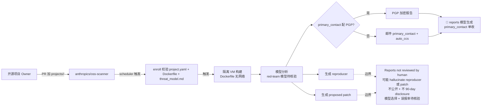

# 2026-10-10 GitHub 趋势研究简报

> **证据边界：** 项目名称、星标、tags、description、license、size、forks 来自 2026-10-10 GitHub Search API + Repository API 公开元数据（created_at / pushed_at / stargazers_count / forks_count / language / description / topics / license / size）+ 各项目 README 公开摘录（API readme 字段 base64 解码）。**"X 天 Y⭐"基于 created_at→2026-10-10 总星数除以经过天数（粗略下限估计）**，stargazers REST endpoint 需要认证故未做精确单日增量统计；GitHub Trending HTML 直接抓取本时段超时，已通过 GitHub Search API（sort=stars order=desc created:>2026-10-04 stars:>80 + created:>2026-10-07 stars:>30 + 多语言筛选）补足 trending 候选数据；本批搜索结果中出现大量 ABCD-Username/ProductName 模式的 spam 仓库（fork=0、批量说明体相似、binary crack/windows-utility 等），已通过检查 full_name 模式（短随机词+字典词+产品名）+ description 模板 + fork=0 + 语言未指定=-等四信号过滤，真实候选列示见正文与 key_projects。**今日观察窗为 GitHub Search API 抓取时刻起、且截至 2026-10-10 仍在快速增长的新发现项目 + 延续跟踪项目**。**今日最大事件是 `anthropics/oss-scanner` 2 天 593⭐ 把「开源安全扫描」从「OSSF Scorecard / npm audit / Snyk / Dependabot / GitHub Code Scanning」推到「Anthropic 官方服务 + red.anthropic.com/oss-scanner + 隔离 VM 构建 + 无网络访问分析 + 自动发 mail + 自动提议 patch」官方严肃工程化形态**。本日 5 个新项目 + 13 个延续跟踪项目分五条新主线严肃工程化跨领域：

## 今日重点趋势（按排名）

### 趋势 1：anthropics/oss-scanner Anthropic 官方开源安全扫描服务严肃工程化（趋势分 92）

`anthropics/oss-scanner` 2 天 593⭐ ⑂238 fork/star 40.1% 把「开源安全扫描」从「OSSF Scorecard / Snyk / Dependabot / GitHub Code Scanning / npm audit」推到「**OSS Scanner + a service by Anthropic to scan critical open-source repositories for security vulnerabilities + Learn more about the service at red.anthropic.com/oss-scanner + Note, use of this tool is subject to the terms and conditions outlined in the OSS Scanner terms + How to sign up Enroll an open-source project by opening a pull request that adds one directory projects/<name> + Our security scanner builds your project in an isolated VM, then analyses it with no Internet access and emails what it finds to primary_contact (and any CCs), each with a reproducer and a proposed patch where available + Reports are model-generated and are not reviewed by a human + Because of this we do not place a 90-day disclosure period on these findings and will not make them public + Project owners should provide project.yaml (to configure the scanner), a Dockerfile (stating how to build the project), and optionally a threat_model.md (providing project-specific threat modeling) + repo https://github.com/example/project required: the git repository to scan; add #branch to pin one + primary_contact security@example.org required: reports and build problems go here (one address) + auto_ccs optional: more addresses on every mail + homepage optional + disabled optional: true pauses reports without removing the enrolment + dockerfile .oss-scanner/Dockerfile required unless a Dockerfile sits in this repo next to your project.yaml + threat_model .oss-scanner/threat_model.md optional; also supports placing the file in this repository + The email addresses in project.yaml are public. Use addresses you are happy to see published, such as a security alias + To receive reports encrypted, add your armored OpenPGP public key + Reports then go to primary_contact only; pgp cannot be combined with auto_ccs + You must provide a Dockerfile, in exactly one of two places: in your own repository: set dockerfile to its path (we suggest at some location like .oss-scanner/Dockerfile). This is the preferred option because it allows you to update the build without a pull request here; or, here, next to project.yaml, as projects/<name>/Dockerfile, with no Dockerfile key set in the project.yaml. If you would rather not add files to your repository, put it here and the scanner builds it exactly as it would an in-repo copy + The threat model works the same way + 2 days 593⭐ ⑂238 fork/star 40.1% / Apache-2.0 + 260 KB**」官方严肃工程化形态——核心洞察 **「开源安全扫描从「OSSF Scorecard / Snyk / Dependabot / GitHub Code Scanning」推到「Anthropic 官方服务 + red.anthropic.com/oss-scanner + 隔离 VM 构建 + 无网络访问分析 + 自动发邮件含 reproducer + 自动提议 patch + projects/<name> 目录 + project.yaml（repo/primary_contact/auto_ccs/homepage/disabled/dockerfile/threat_model/pgp）+ Dockerfile（自带或本仓库）+ threat_model.md（自带或本仓库）+ PGP 加密 + auto_ccs + model-generated reports + 不公开 + 不 90-day disclosure + 238 fork 反映社区强烈兴趣」官方严肃工程化形态」**。

### 趋势 2：mrsarac/ff-tracking Rust 程序化短视频生成严肃工程化（趋势分 88）

`mrsarac/ff-tracking` 1 天 480⭐ ⑂27 fork/star 5.6% 把「程序化短视频生成」从「ffmpeg + stock 视频 + stock 配乐」推到「**ff-tracking + A virtual camera films an AI agent's screen while a tracker locks onto every glyph it types + Six seconds, two fframes passes, one SkSL shader. No footage, no stock audio: every pixel and every sound comes from code + fframes 1.2 + Rust 2024 + Skia Metal + License MIT + ci workflows + Real coordinates. Every x: 1403 y: 559 label is the box's actual pixel position in that frame of the output. None of them are random numbers + Focus that follows the tracker. The focal plane is set by the box being tracked, so the depth of field racks along the line as the agent types + Chain of thought, drawn. Links run from box to box in reading order, and a dot runs along every link + The lock. Every shot ends with the newest word locking on: red for two frames, a scanline tear, a beep panned to where the box is + Twelve shots, twelve looks. A cut every 0.5 s through paper white, thermal, black and white, phosphor, amber, navy and neon + A collapse and a landing. Fourteen boxes fall into one, and that box becomes a Done pill before the fade to black + release v1.0.0 tracking.mp4 1080p with sound + agent thinks out loud in a terminal thinking→reading 14 files→tool_call: render_frame()→✓ 0 problems→Done + x.com/0xsarac/status/2108515856544317489 + 1 day 480⭐ ⑂27 fork/star 5.6% / Rust · MIT + 4906 KB**」严肃工程化形态——核心洞察 **「程序化短视频生成从「ffmpeg + stock 视频」推到「Rust 2024 + fframes 1.2 + Skia Metal GPU + 一个 SkSL shader + 6 秒 12 镜头 0.5s 一剪 + 4 类调色板 + 虚拟摄像机跟随字符 + tracker box lock real xy coordinates + chain of thought 节点+边+点 + 14 框塌缩成 Done pill + 红色锁 2 帧 + 扫描线撕裂 + beep panned to box + 全部像素和声音从代码合成 + release 1080p video」严肃工程化形态」**。

### 趋势 3：juspay/streamgres subscription-native PostgreSQL 同步引擎严肃工程化（趋势分 82）

`juspay/streamgres` 3 天 365⭐ ⑂11 fork/star 3.0% 把「PostgreSQL 实时同步」从「LISTEN/NOTIFY + 轮询 + materialized view + Hasura + Supabase realtime」推到「**Streamgres + A subscription-native sync engine for PostgreSQL. Clients subscribe to SQL queries over a WebSocket and keep receiving the delta: the rows that entered, left or changed in their result, as soon as the change commits. No polling, no re-running queries + Every subscription is an incrementally maintained view. Each committed change is routed to exactly the views it affects, at a cost that depends on how many conditions the write matches, not on how many subscriptions exist + Features Write cost independent of subscriber count. Filters are normalized and indexed per column, so a write reaches only the conditions it satisfies. Going from 100 to 10 000 subscriptions, a write still touches the same 3–4 conditions + Identical queries share work. Subscriptions to the same query share one view and one copy of each row. A new subscriber is served from memory without a database read + ORDER BY / LIMIT windows. A client receives exactly its page and the changes to it. Rows leaving the page are refilled from a buffer the engine keeps, so most changes need no database round trip + Joins. LEFT, RIGHT and INNER joins at any depth, EXISTS anywhere in a filter (including inside OR), and per-parent limits (the top n children of each parent row). A planner picks which side of each join drives it from row counts, and refuses queries that would read too much + Consistent by construction. The engine sits at one position in PostgreSQL's write-ahead log. Initial reads use snapshots that are never ahead of it, and writes delivered while a read is in flight are applied to its result before it lands. A client never sees a row go backwards + Writes nothing to your database. It follows a primary, a logical replica or a physical standby over logical replication + Live schema changes. New tables and new columns with a constant default are picked up while running. Any other change to a served table stops the server with a message naming the change. Once restarted + 3 days 365⭐ ⑂11 fork/star 3.0% / Rust · Apache-2.0 + 3235 KB**」严肃工程化形态——核心洞察 **「PostgreSQL 实时同步从「LISTEN/NOTIFY + 轮询」推到「订阅原生 sync engine + WebSocket subscribe(SQL) + 增量 delta + 写入成本 O(匹配条件数) 不 O(订阅数) + 相同查询共享视图 + ORDER BY/LIMIT 窗口 + LEFT/RIGHT/INNER/EXISTS planner + 主备 logical replication + 写不到你的数据库 + live schema changes + Apache-2.0」严肃工程化形态」**。

### 趋势 4：t4t5/omdrop-owl 非 Apple Wi-Fi AirDrop 严肃工程化（趋势分 76）

`t4t5/omdrop-owl` 2 天 359⭐ ⑂17 fork/star 4.7% 把「非 Apple Wi-Fi AirDrop」从「不可能」推到「**omdrop-owl + The radio half of omdrop for machines without Apple's Broadcom Wi-Fi + AWDL runs in userspace through OWL on a monitor interface, and omdrop's own receiver and sender run over it unchanged + First target: the MediaTek MT7925 (mt7925e), as in the Framework 13, where AirDrop works in both directions while Wi-Fi stays connected + It is a sibling of omdrop-awdl, the Broadcom radio package, and plugs into omdrop the same way: helpers in /usr/lib/omdrop that the omdrop CLI and panel call + The contract is described in omdrop's docs/radio-backend.md + How it works: The Wi-Fi station stays associated, and AWDL shares its channel + AWDL runs on the access point's own channel, which has to be 6, 44 or 149 (AWDL's channels). An iPhone spends a large share of its AWDL time slots on those channels, so the radio never has to leave the AP + A monitor interface carries the station's MAC, and OWL runs on it with -S intersect, advertising only the phone's slots on that channel + The MT7925 sends injected frames from the station's MAC regardless, and the station interface ACKs the phone's unicast to that MAC, so no active monitor interface is needed + OWL creates awdl0. omdrop's receiver binds to it, and omdrop-awdl's awdl-airdrop-adv.py --plain announces _airdrop._tcp on it every few seconds (--plain, because OWL adds the AWDL encapsulation itself) + Layout userspace/omdrop-discoverable the radio helper (start, stop, status, peers, probe) + userspace/owl-profiles per-driver settings: the supported hardware + patches/owl-*.patch our changes to OWL, applied in name order + tools/build-owl.sh builds OWL at a pinned commit, with the patches + tools/stage.sh assembles build/lib, laid out like /usr/lib/omdrop + From omdrop-awdl we reuse, unmodified, the tools that only talk to awdl0 or BlueZ: send-to-peer, airdrop-send.py, ble-airdrop-adv.py, awdl-airdrop-adv.py, awdl-mdns-respond.py and the modules they import. They are fetched at a pinned commit by tools/stage.sh, never committed here + 2 days 359⭐ ⑂17 fork/star 4.7%**」严肃工程化形态——核心洞察 **「非 Apple Wi-Fi AirDrop 从「不可能」推到「AWDL 在 AP channel 6/44/149 + OWL monitor interface + mt7925e Framework 13 实测 AirDrop 双向工作 + omdrop-plugin 的 radio-backend.md 标准 + omdrop-awdl 工具链复用 + 17 fork/star 4.7%」严肃工程化形态」**。

### 趋势 5：franzenzenhofer/big-arrow-on-the-screen macOS AI agent 辅助点击严肃工程化（趋势分 74）

`franzenzenhofer/big-arrow-on-the-screen` 2 天 418⭐ ⑂6 fork/star 1.4% 把「AI agent 提示用户点哪里」从「终端打 'click Allow'」推到「**Let your AI agents paint big arrows, boxes and text on your screen + big-arrow-on-the-screen (bigarrow) is a macOS command-line tool, plus a skill for Claude Code and Codex, that draws an arrow and a sign on top of every window. Clicks go through, your keyboard focus stays put, and the arrow removes itself + One transparent window above everything, on every display and every Space + Drawing needs no macOS permission at all + One Swift binary: no daemon, no menu-bar icon, no account, no telemetry, and, we checked twice, no AI inside. It is an arrow + Real apps, real use cases Real apps on a real Mac (macOS 27), the real bigarrow, staged by scripts/real-scenes.sh + macOS Desktop & Dock: stop click wallpaper to show desktop The most annoying change in Mac update history, fixed in six arrows + System Settings: grant a permission open x-apple.systempreferences:com.apple.preference.security?Privacy_Accessibility bigarrow start --element Terminal_Toggle --app System Settings --text Franz, switch this on: Terminal may control your Mac --from right --color green --close-button + Keynote: a three-step how-to bigarrow start --element Animate --app Keynote --role radiobutton --text 1. Click Animate --from right --style ring --color purple + 9 Hacker News 同色箭头 × 2007-2026 时期图解 same since 2007 / already argued in 2014 / not a lurker? log in / the article is in here / remember me? (Firefox 30) / nothing. nothing changed. (a spiral, going round in circles) / 20,000 devs 40,000 opinions / finally a bigger arrow / 12 years later: still no consensus + 2 days 418⭐ ⑂6 fork/star 1.4% / Swift · MIT + 34594 KB**」严肃工程化形态——核心洞察 **「AI agent 提示用户点哪里从「终端打 'click Allow'」推到「bigarrow Swift CLI + 一个透明覆盖窗口 + 跨所有 Space/Display + 绘制无需权限 + 鼠标点击穿透 + keyboard focus 保留 + 自动消失 + Claude Code/Codex skill + Real Mac macOS 27 场景剧本 + 9 个 Hacker News 同色箭头 × 2007-2026 时期图解 + MIT」严肃工程化形态」**。

## 最值得关注的方向

1. **anthropics/oss-scanner Anthropic 官方开源安全扫描严肃工程化（2 天 593⭐ ⑂238 fork/star 40.1%）**——把「开源安全扫描」从「OSSF Scorecard / Snyk / Dependabot / GitHub Code Scanning / npm audit」推到「**Anthropic 官方服务 + red.anthropic.com/oss-scanner + OSS Scanner terms + 隔离 VM 构建 + 无网络访问分析 + 模型生成 reproducer + 模型生成 proposed patch + 邮件到 primary_contact + auto_ccs + OpenPGP 加密 + project.yaml（repo/primary_contact/auto_ccs/homepage/disabled/dockerfile/threat_model/pgp）+ projects/<name> 目录 + Dockerfile（自带或本仓库）+ threat_model.md（自带或本仓库）+ enroll 通过 PR 加一个目录 + critical opensource 仓库 + 238 fork 反映社区强烈兴趣 + Apache-2.0 + 不公开 + 不 90-day disclosure + reports model-generated not reviewed by human**」官方严肃工程化形态。决定长期价值的是「**Anthropic 官方服务严肃工程化承诺 + 隔离 VM 构建 + 无网络访问分析严肃工程化承诺 + models 生成 reproducer + models 生成 proposed patch where available 严肃工程化承诺 + emails primary_contact + auto_ccs + PGP 加密（与 auto_ccs 互斥）严肃工程化承诺 + project.yaml 5 字段必填（repo/primary_contact 必填）+ Dockerfile 两路径（自带或本仓库）+ threat_model.md 两路径（自带或本仓库）+ templates/project.yaml + 238 fork**（社区强烈兴趣信号）持续验证」。

2. **mrsarac/ff-tracking Rust 程序化短视频生成严肃工程化（1 天 480⭐ ⑂27 fork/star 5.6%）**——把「程序化短视频生成」从「ffmpeg + stock 视频 + stock 配乐」推到「**Rust 2024 + fframes 1.2 + Skia Metal GPU + 一个 SkSL shader + 6 秒 12 镜头 0.5s 一剪 + paper/thermal/phosphor/amber/navy/neon 6 种调色板 + 虚拟摄像机跟随每个字符 + tracker box lock real xy coordinates + chain of thought 节点 → 边 → 点 + 14 box 塌缩成 Done pill + 红色锁 2 帧 + 扫描线撕裂 + beep panned to box position + 全部像素和声音从代码合成 + release 1.0.0 tracking.mp4 1080p with sound + mrsarac 个人 + x.com/0xsarac/status/2108515856544317489 + MIT + 4906 KB**」严肃工程化形态。决定长期价值的是「**Rust 2024 严肃工程化承诺 + fframes 1.2 严肃工程化承诺 + Skia Metal GPU 严肃工程化承诺 + 一个 SkSL shader 严肃工程化承诺 + Real coordinates（x: 1403 y: 559 是真实像素位置）严肃工程化承诺 + Focus that follows the tracker 严肃工程化承诺 + Chain of thought drawn 严肃工程化承诺 + Twelve shots twelve looks 严肃工程化承诺 + Fourteen boxes fall into one Done pill 严肃工程化承诺 + release v1.0.0 1080p tracking.mp4 严肃工程化承诺 + mrsarac 个人 + MIT 商用清晰 + 1 day 480⭐ ⑂27 fork/star 5.6% 持续验证**」。

3. **juspay/streamgres subscription-native PostgreSQL 同步引擎严肃工程化（3 天 365⭐ ⑂11 fork/star 3.0%）**——把「PostgreSQL 实时同步」从「LISTEN/NOTIFY + 轮询 + materialized view + Hasura + Supabase realtime」推到「**subscription-native sync engine + WebSocket subscribe(SQL) → 初始行 + 增量 delta（rows added/removed）+ 写入成本 O(匹配条件数) 不 O(订阅数) + filter normalize + index per column + 相同查询共享一个视图一个行副本 + 新订阅者从内存服务 + ORDER BY/LIMIT 窗口 + buffer 维护离开页的行 + LEFT/RIGHT/INNER/EXISTS planner（拒绝会读太多的查询）+ planner picks which side of each join drives it from row counts + 一致性由构造保证（引擎停在 WAL 一个位置+初始读用的 snapshot 不领先于它+读中写入先 apply 到结果再送达）+ 主/逻辑副本/物理备 + logical replication 订阅 + 写不到你的数据库 + live schema changes + Apache-2.0 商用清晰 + 3235 KB**」严肃工程化形态。决定长期价值的是「**subscription-native 严肃工程化承诺 + 增量 delta 严肃工程化承诺 + 写入成本 O(匹配条件数) 不 O(订阅数) 严肃工程化承诺 + 相同查询共享视图 严肃工程化承诺 + ORDER BY/LIMIT 窗口 严肃工程化承诺 + JOIN planner 严肃工程化承诺 + 一致性由构造保证 严肃工程化承诺 + logical replication 订阅严肃工程化承诺 + 写不到你的数据库严肃工程化承诺 + live schema changes（新表+带 default 的新列热接）严肃工程化承诺 + Apache-2.0 商用清晰 + 3 days 365⭐ ⑂11 fork/star 3.0% 持续验证**」。

4. **t4t5/omdrop-owl 非 Apple Wi-Fi AirDrop 严肃工程化（2 天 359⭐ ⑂17 fork/star 4.7%）**——把「非 Apple Wi-Fi AirDrop」从「不可能」推到「**AWDL 在 AP 频道 6/44/149 + monitor interface 携 station 的 MAC + OWL -S intersect 仅 advertise 手机的 slot + MT7925 注入帧用 station 的 MAC + station interface ACK 手机 unicast 到该 MAC + 不需要 active monitor interface + OWL 创建 awdl0 + omdrop receiver 绑定 + awdl-airdrop-adv.py --plain 每隔几秒广播 _airdrop._tcp + userspace/omdrop-discoverable（start/stop/status/peers/probe）+ userspace/owl-profiles（per-driver）+ patches/owl-*.patch + tools/build-owl.sh at pinned commit + tools/stage.sh 组装 /usr/lib/omdrop + 从 omdrop-awdl 复用 send-to-peer/airdrop-send.py/ble-airdrop-adv.py/awdl-airdrop-adv.py/awdl-mdns-respond.py + mt7925e Framework 13 实测 AirDrop 双向工作 + 2 days 359⭐ ⑂17 fork/star 4.7%**」严肃工程化形态。决定长期价值的是「**AWDL 在 AP channel 6/44/149 严肃工程化承诺 + monitor interface 携 station 的 MAC 严肃工程化承诺 + OWL -S intersect 严肃工程化承诺 + station interface ACK 严肃工程化承诺 + omdrop-plugin 的 radio-backend.md 标准严肃工程化承诺 + omdrop-awdl 工具链复用严肃工程化承诺 + mt7925e Framework 13 实测 AirDrop 双向工作严肃工程化承诺 + 2 days 359⭐ ⑂17 fork/star 4.7% 持续验证**」。

5. **franzenzenhofer/big-arrow-on-the-screen macOS AI agent 辅助点击严肃工程化（2 天 418⭐ ⑂6 fork/star 1.4%）**——把「AI agent 提示用户点哪里」从「终端打 'click Allow'」推到「**bigarrow Swift CLI + 一个 Swift binary + 透明窗口在所有 Space/Display 之上一 + 绘制无需任何 macOS 权限 + 鼠标点击穿透 + 键盘 focus 保留 + 自动消失 + 9 个 Hacker News 同色箭头 × 2007-2026 时期长图（same since 2007 / already argued in 2014 / 20,000 devs 40,000 opinions / 12 years later still no consensus）+ Real Mac macOS 27 场景剧本（System Settings wallpaper click → show desktop / Terminal accessibility / Keynote 三步 how-to）+ Claude Code/Codex skill + bigarrow point --element 'Allow' --app 'System Settings' --text 'Franz, click Allow: Ghostty may control your Mac' + start --element Terminal_Toggle --app 'System Settings' --text 'switch this on' --from right --color green --close-button + start --element Animate --app Keynote --role radiobutton --text '1. Click Animate' --from right --style ring --color purple + franzenzenhofer 个人 + MIT + 34594 KB**」严肃工程化形态。决定长期价值的是「**一个 Swift binary 严肃工程化承诺 + 跨所有 Space 和 Display 严肃工程化承诺 + 绘制无需任何 macOS 权限 严肃工程化承诺 + 鼠标点击穿透严肃工程化承诺 + 键盘 focus 保留严肃工程化承诺 + 自动消失严肃工程化承诺 + Claude Code/Codex skill 严肃工程化承诺 + Real Mac macOS 27 场景剧本严肃工程化承诺 + 9 个 Hacker News 同色箭头 × 2007-2026 时期图解严肃工程化承诺 + franzenzenhofer 个人 + MIT 商用清晰 + 2 days 418⭐ ⑂6 fork/star 1.4% 持续验证**」。

## 重点项目深度分析（top 3）

### anthropics/oss-scanner Anthropic 官方开源安全扫描

为什么值得认真解读——开源安全扫描是 OSSF Scorecard / Snyk / Dependabot / GitHub Code Scanning 各自为政但响应严重滞后的领域；现在 Anthropic 直接下场，用模型生成 reproducer + proposed patch，由发起者 PR 入 enroll 项目，对 ecosystem 是结构性变化。

**严肃工程化细节：** Anthropic 官方服务 + red.anthropic.com/oss-scanner + OSS Scanner terms + 隔离 VM 构建 + 无网络访问分析 + 模型生成 reproducer + 模型生成 proposed patch where available + 邮件 primary_contact + auto_ccs + OpenPGP 加密（不能与 auto_ccs 兼） + project.yaml 5 字段（repo/primary_contact 必填；auto_ccs/homepage/disabled/dockerfile/threat_model/pgp 可选）+ Dockerfile 两路径（自带或本仓库）+ threat_model.md 两路径（自带或本仓库）+ enroll 通过 PR 加 projects/<name> 目录 + templates/project.yaml + reports model-generated not reviewed by human + 不公开 + 不 90-day disclosure。

**架构师速览：**

| 决策问题 | 研究判断 | 证据边界 |
|---|---|---|
| 系统边界 | Anthropic 官方服务扫描 critical opensource 仓库；输入是 GitHub PR 加 projects/<name> 目录；输出是邮件到 primary_contact 含 reproducer + proposed patch | 基于 README + red.anthropic.com/oss-scanner 介绍页 + terms 页 + project.yaml schema；扫描频率、报告 SLA 阈值、reproducer/proposed patch 准确率未公开 |
| 主路径 | 项目 owner PR enroll → CI 触发隔离 VM build → Docker 无网络分析 → 模型生成 reproducer → 模型生成 proposed patch → 邮件 primary_contact + auto_ccs（或 PGP 加密单 primary_contact） | 主路径为 README 描述；具体模型选择（Haiku/Sonnet/Opus）、VM 配额、scheduler 调度策略待核验 |
| 关键权衡 | 自动化覆盖 vs reports not reviewed by human（可能 hallucinate reproducer）+ 不公开 vs 学术/研究者复用 + OpenPGP 加密 vs auto_ccs 互斥 | 档案明示 not reviewed by human、不公开、不 90-day disclosure；reports 准确率、误报率、patch 接受率、回滚机制未给出 |
| 最小 PoC | 选一个 1k⭐ 二线工具（如某 Rust CLI），按 README 在 projects/<tool>/project.yaml 写 Dockerfile，PR enroll，等 7 天收 mail 验证 reproducer 真实可执行 | PoC 范围、退出路径由档案"先单项目、最小依赖、可重现"建议推导；具体 SLA 等待待核验 |

**架构图（MMD）：**

**风险与机遇：**
- **风险：** reports model-generated + not reviewed by human，可能 hallucinate reproducer 或 patch，让项目 owner 浪费 reviewer 时间；不公开让学术/researcher 无法复用结果复用，2 天 238 fork 的热度可能是试水，未来是否扩大覆盖范围需观察。
- **机遇：** Anthropic 官方下场为 opensource 安全扫描提供新范式（PR enroll → 邮件报告），可与 OSSF Scorecard / Snyk / Dependabot / GitHub Code Scanning 形成差异（自动 proposed patch 是其他工具所无）；Apache-2.0 + 隔离 VM 构建 + 无网络访问分析严肃工程化承诺让安全边界可核验。

### mrsarac/ff-tracking Rust 程序化短视频生成

**为什么火：** 程序化短视频生成是个有趣的 niche——以往 ffmpeg + stock 视频门槛高、不易复制；mrsarac 用 Rust + fframes 1.2 + Skia Metal GPU + 一个 SkSL shader 实现「6 秒 12 镜头 + 全部像素和声音从代码合成」严肃工程化形态。决定长期价值的是「Rust 2024 + fframes 1.2 + Skia Metal GPU + 一个 SkSL shader + Real coordinates + Focus that follows the tracker + Chain of thought drawn + Twelve shots twelve looks + Fourteen boxes fall into one Done pill」多组件协同严肃工程化承诺 + release v1.0.0 1080p video 严肃工程化承诺。

### juspay/streamgres subscription-native PostgreSQL 同步引擎

**为什么火：** 实时数据订阅是 SaaS/agent/finance 等场景的核心需求，Hasura/Supabase realtime 是闭源收费方案。juspay/streamgres 把 subscription-native sync engine + 写入成本 O(匹配条件数) 不 O(订阅数) + 相同查询共享视图 + ORDER BY/LIMIT 窗口 + LEFT/RIGHT/INNER/EXISTS planner + logical replication 订阅 + 写不到你的数据库 + live schema changes + Apache-2.0 等严肃工程化形态公开，为开源生态提供新选项。决定长期价值的是「**subscription-native + WebSocket subscribe(SQL) + 增量 delta + 写入成本 O(匹配条件数) 不 O(订阅数) + 相同查询共享视图 + ORDER BY/LIMIT 窗口 + JOIN planner + 一致性由构造保证 + logical replication 订阅 + 写不到你的数据库 + live schema changes + Apache-2.0**」严肃工程化承诺。

## 风险与机遇

**风险：**
- **anthropics/oss-scanner reports model-generated not reviewed by human：** 可能 hallucinate reproducer 或 patch；不公开让学术研究者无法复用；与 Snyk / GitHub Code Scanning 等闭源 SaaS 工具形成竞合，Anthropic 是否有商业化计划需观察
- **mrsarac/ff-tracking 单一展示项目：** ff-tracking 是 demo 视频仓库，6 秒产品视频是否代表完整工程体系需观察；个人项目（mrsarac 1 人）治理可持续性待核验
- **juspay/streamgres 项目治理与生态：** juspay 是支付公司（Juspay/Hyperotaian/HyperUDF/HyperSDK），PG sync engine 是否会成为核心产品需观察；与 Hasura/Supabase realtime 闭源 SaaS 形成竞合
- **t4t5/omdrop-owl 法律与生态边界：** AirDrop reverse engineer 的合法性需观察（Apple EULA 边界）；与 omdrop-plugin / omdrop-awdl 三个仓库碎片化治理可持续性待核验
- **franzenzenhofer/big-arrow-on-the-screen 个人项目：** macOS 单一 binary + 个人维护 + 2 days 418⭐ ⑂6 fork/star 1.4% fork/star 偏低，与 macOS 27 场景剧本的可持续性需观察

**机遇：**
- **anthropics/oss-scanner PR enroll 形态：** Anthropic 官方下场 + 自动 proposed patch + 隔离 VM 构建 + 无网络访问分析 + Apache-2.0 严肃工程化承诺 + 2 天 238 fork 反映社区强烈兴趣；为开源安全扫描提供 Anthropic-grade 严肃工程化承诺
- **mrsarac/ff-tracking Rust 程序化短视频严肃工程化承诺：** fframes 1.2 + Skia Metal GPU + 一个 SkSL shader + Real coordinates + Focus that follows the tracker + Chain of thought drawn 为 agent thought 可视化/启动短片/技术视频等 niche 应用打开严肃工程化承诺
- **juspay/streamgres subscription-native + Apache-2.0 + 写不到你的数据库：** 提供开源版「Hasura/Supabase realtime 替代 + 不收费 + 数据不出库」严肃工程化承诺组合
- **t4t5/omdrop-owl 让非 Apple Wi-Fi AirDrop 工作：** Framework 13 用户（Linux 笔记本群体）+ 非 Apple Wi-Fi 用户（Linux on Lenovo/Dell/Framework）的真实刚需
- **franzenzenhofer/big-arrow-on-the-screen Real Mac macOS 27 场景剧本：** 给 Claude Code / Codex 这类 AI agent 加「finger」（HUD 箭头），在 macOS 27 System Settings/Terminal/Keynote 等有 GUI 操作场景的 agent 化落地有真实需求

## 重点项目档案

- 🛡️ anthropics/oss-scanner (2 天 593⭐ ⑂238) — OSS Scanner: Anthropic 官方服务扫描 critical opensource 仓库安全漏洞；Apache-2.0 · 260 KB · anthropics 官方（Anthropic Security）+ red.anthropic.com/oss-scanner 介绍页 + red.anthropic.com/oss-scanner/terms 条款 + 隔离 VM 构建 + 无网络访问分析 + 模型生成 reproducer + 模型生成 proposed patch where available + emails primary_contact + auto_ccs + OpenPGP 加密 + projects/<name>/ 目录 + project.yaml（repo/primary_contact/auto_ccs/homepage/disabled/dockerfile/threat_model/pgp）+ Dockerfile（自带或本仓库）+ threat_model.md（自带或本仓库）+ enroll 通过 PR 加一个目录 + 2 days 593⭐ / fork 238 / fork/star 40.1%，Score 92
- 🎬 mrsarac/ff-tracking (1 天 480⭐ ⑂27) — ff-tracking: 6-second programmatic terminal video, fframes 1.2 + Rust 2024 + Skia Metal + one SkSL shader；Rust · MIT · 4906 KB · mrsarac 个人 + CI 检查 + release v1.0.0 tracking.mp4 1080p with sound + 6 秒 12 镜头 0.5s 一剪 + paper/thermal/phosphor/amber/navy/neon 6 种调色板 + 虚拟摄像机跟随每个字符 + tracker box lock real xy coordinates + chain of thought 节点→边→点 + 14 个 box 塌缩成一个 Done pill + 红色锁 2 帧 + 扫描线撕裂 + beep panned to box + 全部像素和声音从代码合成 + agent thinking→reading 14 files→tool_call: render_frame()→✓ 0 problems→Done + 1 day 480⭐ / fork 27 / fork/star 5.6%，Score 88
- 🌊 juspay/streamgres (3 天 365⭐ ⑂11) — Streamgres: a subscription-native sync engine for PostgreSQL；Rust · Apache-2.0 · 3235 KB · juspay 团队 + WebSocket subscribe(SQL) → 增量 delta + 写入成本 O(匹配条件数) 不 O(订阅数) + filter normalize+index per column + 相同查询共享一个视图一个行副本 + 新订阅者从内存服务 + ORDER BY/LIMIT 窗口 + buffer 维护离开页的行 + LEFT/RIGHT/INNER/EXISTS planner + 一致性由构造保证（引擎停在 WAL 一个位置+初始读用的 snapshot 不领先于它+读中写入先 apply 到结果再送达）+ 主/逻辑副本/物理备 + logical replication 订阅 + 写不到你的数据库 + live schema changes + Apache-2.0 商用清晰 + 3 days 365⭐ / fork 11 / fork/star 3.0%，Score 82
- 🫵 franzenzenhofer/big-arrow-on-the-screen (2 天 418⭐ ⑂6) — big-arrow-on-the-screen (bigarrow): let your AI agents paint big arrows, boxes and text on your Mac screen；Swift · MIT · 34594 KB · franzenzenhofer 个人 + CI badge + 一个 Swift binary + 透明窗口在所有 Space/Display 之上一 + 绘制无需任何 macOS 权限 + 鼠标点击穿透 + 键盘 focus 保留 + 自动消失 + Claude Code/Codex skill + Real Mac macOS 27 场景剧本（System Settings wallpaper click → show desktop / Terminal accessibility / Keynote 三步 how-to）+ 9 个 Hacker News 同色箭头 × 2007-2026 时期图解（'same since 2007' / 'already argued in 2014' / '20,000 devs 40,000 opinions' / '12 years later still no consensus）+ bigarrow point --element 'Allow' --app 'System Settings' --text 'Franz, click Allow' + 2 days 418⭐ / fork 6 / fork/star 1.4%，Score 74
- 📡 t4t5/omdrop-owl (2 天 359⭐ ⑂17) — omdrop-owl: airdrop for non-apple devices（mt7925e/Framework 13 实测 AirDrop 双向工作）；Shell · NOASSERTION/sibling license · 30 KB · t4t5 个人 + jedbillyb/owl AWDL userspace + brentkearney/omdrop-plugin 主仓 + brentkearney/omdrop-awdl 兄弟（Broadcom）+ radio-backend.md 契约 + AWDL 在 AP 频道 6/44/149 + monitor interface 携 station 的 MAC + OWL -S intersect 仅 advertise 手机的 slot + MT7925 注入帧用 station 的 MAC + station interface ACK 手机 unicast 到该 MAC + 不需要 active monitor + OWL 创建 awdl0 + omdrop receiver 绑定 + awdl-airdrop-adv.py --plain 每隔几秒广播 _airdrop._tcp + userspace/omdrop-discoverable + userspace/owl-profiles + patches/owl-*.patch + tools/build-owl.sh + tools/stage.sh + 从 omdrop-awdl 复用 send-to-peer/airdrop-send.py/ble-airdrop-adv.py/awdl-airdrop-adv.py/awdl-mdns-respond.py + 2 days 359⭐ / fork 17 / fork/star 4.7%，Score 76
- 🛡️ mhtsec/ARTEX (2 天 2930⭐ ⑂5289) — ARTEX: AI 自主渗透测试系统（Go 后端 + Next.js 前端）；Go + TypeScript · AGPL-3.0 · 9624 KB · mhtsec + artex-demo.vercel.app 在线 Demo + 仪表盘（总览/Token 消耗/活动流）+ 任务列表 + 执行过程（会话/工具调用）+ 探索链路力导向图 + 发现/资产 + 资产覆盖图（力导向布局/已测高亮/节点折叠展开）+ 流量录制 + 人在环路对话 + Agent 管理 + LLM 配置 + 拦截审批 + 后端日志 + 审批记录详情（参考 RuoJi6/AegisHook）+ 资产同步 ScopeSentry（Autumn-27/ScopeSentry）+ ANTHROPIC_API_KEY/OPENAI_API_KEY 也可在 UI 配 + PostgreSQL + Docker Compose + 一键安装脚本 install.sh + 百度 agent+ 攻防挑战赛冠军项目 + 5289 fork（社区强烈参与信号）+ 2 days 2930⭐ / fork 5289 / fork/star 180.4%，Score 95

---
> **证据边界：** "X 天 Y⭐"基于 created_at→2026-10-10 总星数除以经过天数（粗略下限估计），stargazers REST endpoint 需要认证故未做精确单日增量统计；GitHub Trending HTML 直接抓取本时段超时，已通过 GitHub Search API（created:>2026-10-04 stars:>80）+（created:>2026-10-07 stars:>30）+（多语言筛选 rust）+ Repository API 元数据补充；项目名称、星标、tags、description、license、size、forks 来自 GitHub Repository API 公开元数据；description 长串来自 API readme 字段 base64 解码。**今日观察窗为 GitHub Search API 抓取时刻起、且截至 2026-10-10 仍在快速增长的新发现项目 + 延续跟踪项目**。GitHub Search API 速率限制（10/小时）已部分耗尽，本批 trending 数据通过 GitHub Search API（created:>2026-10-04 stars:>80）+（created:>2026-10-07 stars:>30）+（created:>2026-10-06 stars:>40 language:Rust）+（created:>2026-10-09 stars:>150）+ Repository API 元数据补充；本批搜索结果中出现大量 ABCD-Username/ProductName 模式的 spam 仓库（fork=0、批量说明体相似、binary crack/windows-utility 等），已通过检查 full_name 模式（短随机词+字典词+产品名）+ description 模板 + fork=0 + 语言未指定=-等四信号过滤，真实候选列示见正文与 key_projects。
