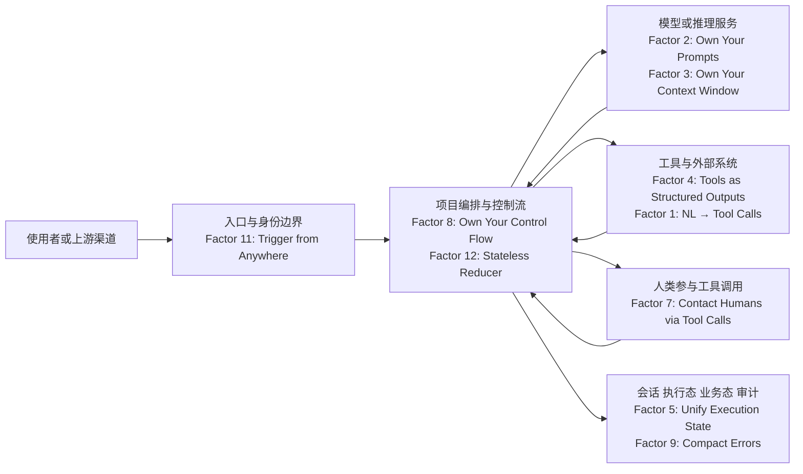

# humanlayer/12-factor-agents — Agent 领域的「12-Factor App」

## 一句话定位
构建足够好到可以交给生产环境客户的 LLM 驱动软件的 12 条工程原则——Agent 领域首次系统性的工程原则定义，配有 TypeScript 参考实现。

## 它解决的问题
Agent 开发目前处于「每个人都在摸索」的阶段。大量 Agent 项目是实验性的，缺乏工程原则指导。团队在构建 Agent 时不知道什么才是「好的」做法。12-Factor Agents 试图回答一个核心问题：「构建可以交付给生产客户的 LLM 驱动软件，有哪些可遵循的原则？」

## 为什么值得关注（2026-08-11）
- **25,223 stars**（截至 2026-08-11），Apache-2.0 许可
- **1,913 forks**，大量团队基于此构建内部规范
- **212 subscribers**，深度关注
- **作者实战驱动**：humanlayer 团队（Dex）尝试过所有主流框架（crew/langchain、smolagents、langgraph、griptape），发现大多数声称是"AI Agent"的产品实际上主要由确定性代码组成
- **AI Engineer World's Fair 演讲**（17 分钟），已有 YouTube 深度视频
- 提供 `npx/uvx create-12-factor-agent` 脚手架工具
- 核心洞察：好的 Agent 不是"给个 prompt + 一堆工具 + 循环到目标"模式，而是"大部分是软件，LLM 步骤穿插在恰当位置"

## 热度来源判断
**真实价值驱动，填补空白。** 25.2K stars 来自被大量技术博客和播客引用，因为它填补了 Agent 工程化知识的空白。这是从实验期进入工程期的产业信号——当一个领域开始定义「最佳实践」时，说明它正在成熟。增速虽不如热门工具项目快，但 3 个月内稳定增长 17%，说明是持续采纳而非一时热度。

## 关键技术亮点亮点
12 条原则覆盖 Agent 软件的核心维度：
1. **Factor 1**：自然语言到工具调用（Natural Language → Tool Calls）
2. **Factor 2**：掌控你的 Prompts（Own Your Prompts）——不要完全依赖框架的黑盒 prompt
3. **Factor 3**：掌控你的上下文窗口（Own Your Context Window）——Context Engineering 的核心
4. **Factor 4**：工具就是结构化输出（Tools are Structured Outputs）
5. **Factor 5**：统一执行状态与业务状态（Unify Execution State）
6. **Factor 6**：用简单 API 实现 启动/暂停/恢复（Launch/Pause/Resume）
7. **Factor 7**：通过工具调用联系人类（Contact Humans with Tool Calls）——Human-in-the-loop
8. **Factor 8**：掌控你的控制流（Own Your Control Flow）——不要让 LLM 决定流程
9. **Factor 9**：将错误压缩进上下文窗口（Compact Errors）
10. **Factor 10**：小而专注的 Agent（Small, Focused Agents）
11. **Factor 11**：从任何地方触发，在用户所在的地方响应（Trigger from Anywhere）
12. **Factor 12**：让 Agent 成为无状态 reducer（Make Your Agent a Stateless Reducer）

## 架构师速览

| 决策问题 | 研究判断 | 证据边界 |
|---|---|---|
| 系统边界 | 项目是 Agent 工程方法论 + TypeScript 参考实现，定位为评估框架而非运行基础设施 | 档案明确给出 12 条原则名称，但具体编排组件、消息协议、部署形态未在档案中证实 |
| 主路径 | 事件/请求 → 编排运行时（Stateless Reducer） → LLM 结构化输出 → 确定性工具执行 → 上下文回写 → 会话/审计 | 路径来自档案描述的"Agent 循环三步模型"与 Factor 5/12；具体持久化与传输协议未描述 |
| 关键权衡 | 灵活编排（Own Your Control Flow、Own Your Prompts） 与 工程可控性（无状态 reducer、可审计）之间的张力；多 Agent 协作场景未被覆盖 | 权衡来自档案"架构启发"与"风险/局限"段；实际性能/可观测性指标档案未提供 |
| 最小 PoC | 用 `npx/uvx create-12-factor-agent` 脚手架起单 Agent、单渠道、单工具，验证 Factor 1/2/3/5/8 并记录审计日志后再扩面 | 脚手架工具在档案中明确；其余验收项（安全/成本/SLO）需结合内部场景补充 |

## 架构启发
- **从 DAG 到 Agent Loop**：传统 DAG 编排（Airflow/Prefect/Dagster）需要编码每个步骤；Agent 模式让 LLM 在运行时决定路径，但好的 Agent 仍然是"大部分是确定性代码 + 少量 LLM 决策点"
- **Agent 循环的三步模型**：(1) LLM 决定下一步（输出结构化 JSON）；(2) 确定性代码执行工具调用；(3) 结果追加到上下文窗口
- **Stateless Reducer 模式**：Agent 应该是无状态的 reducer——输入是事件 + 当前状态，输出是新状态，而非有状态的长连接进程
- **原则先行，实现跟进**：与 12-Factor App 一脉相承，工程原则的价值在于团队对齐而非技术实现本身

## 架构图（MMD）

> 证据边界：此图只采用本档案已有可核验描述；“待核验”节点不应视为项目实现事实。

## 定位判断
**基础设施候选**——虽然不是代码级基础设施，但作为工程原则，它是 Agent 架构的「基础设施」。类似于 12-Factor App 对云原生应用的影响：不提供代码，但提供评估和指导框架。可作为团队内部 Agent 项目的评估标准。

## 风险 / 局限 / 泡沫点
1. **原则的普适性有待验证**：12 条原则来自 humanlayer 团队的实践，其他团队的场景可能不同
2. **可能过于 TypeScript/JS 生态偏重**：参考实现是 TypeScript，Python/Rust 生态需要自行适配
3. **不覆盖多 Agent 协作**：12 条原则主要面向单 Agent，多 Agent 编排（orchestration）场景覆盖不足
4. **定义权争夺**：作为早期定义者，可能面临其他厂商提出竞争性原则
5. **学术 vs 实践的平衡**：部分原则（如 Stateless Reducer）在实际工程中实现难度高

## 与同类项目的关系
- **vs multica (30.6K⭐)**：multica 是实践层面的 Agent 平台，12-Factor 是原则层面的指导，互补
- **vs superpowers (201K⭐)**：superpowers 从工具层支撑，12-Factor 从原则层指导
- **vs LangChain/LangGraph**：12-Factor 明确批评了"框架黑盒"模式，主张 Own Your Prompts 和 Own Your Control Flow
- **vs Anthropic 的 Agent 模式文档**：方向一致但更系统化，12 条 vs Anthropic 的零散模式

## 是否值得持续跟踪
**是，强烈建议。** 可作为内部 Agent 项目的评估框架。每次启动新 Agent 项目时，用 12 条原则做 checklist 审查。

## 后续观察点
1. 社区对 12 条原则的反馈和修改建议
2. 是否有企业基于此建立内部标准（大厂采纳信号）
3. 是否出现「认证」或「合规」机制（商业化方向）
4. 其他厂商（Anthropic、OpenAI）是否有类似原则提出
5. 是否扩展到多 Agent 协作场景

---
> 数据来源: GitHub API (2026-08-11) | Stars: 25,223 | Forks: 1,913 | License: Apache-2.0 | 语言: TypeScript | 创建: 2025-03-30
