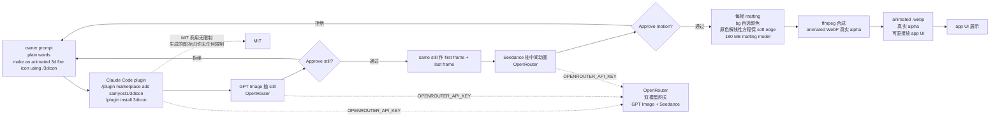

# samyost1/3dicon

## 一句话定位
一个 prompt 生成透明背景循环动画 3D 图标 Claude Code skill——同 still 作 first + last frame 无缝 loop + 选色 matting 解线性方程保 soft edge + WebP 真实 alpha + Claude Code plugin + OpenRouter 双模型（GPT Image + Seedance）+ MIT 商用无限制。

## 它解决的问题
2025-2026 年 app UI 设计需求爆发，3D 图标 / 透明背景循环动画图标是高频需求但设计成本高——3D 图标设计成本高 + 循环动画图标更复杂 + 透明背景难（halo / 边缘硬）+ WebP alpha 真实感差 + 不能无缝 loop + 一次性 prompt 不审阅 + 多模型管理复杂 + Claude Code skill 集成 + 商用版权。3dicon 直击——它提供 **Claude Code plugin**（`/plugin marketplace add samyost1/3dicon` + `/plugin install 3dicon`）+ **OPENROUTER_API_KEY 双模型**（GPT Image + Seedance 都走 OpenRouter）+ **ffmpeg**（PATH 必需）+ **180 MB matting model**（首次运行下载）+ **Same still as both first + last frame**（loop 闭合无可见接缝）+ **Color-solved background removal**（bg 自选颜色，原色解线性方程保 soft edge 而不是留 halo）+ **Animated WebP 真实 alpha**（可直接放 app UI）+ **两阶段审阅**（先生成 still 让用户 approve 再提议 motion 让用户 approve 才花 motion）+ **Mermaid 流程图**（prompt → still → first + last → video → matting → WebP alpha）+ **MIT 商用无限制**（生成的图标归你无任何限制）。解决的是 **「一个 prompt → 透明循环 3D 图标 + same still 双端 + 选色 matting + WebP alpha + Claude Code plugin + OpenRouter 双模型 + MIT 商用无限制」** 的「视觉生成 Agent Skill 严肃工程化」缺位问题。

## 为什么值得关注
- **Stars:** 379（截至 2026-09-25），2 天突破 379，增速极快
- **Forks:** 36，社区贡献较活跃
- **License:** MIT（完全开源商用）
- **语言:** Python
- **活跃度:** created 2026-09-23，pushed_at 2026-09-23
- **规模:** 7.7MB，含 skill + README + examples + matting 模型
- **Topics:** 未填写 GitHub topics
- **Claude Code plugin** —— `/plugin marketplace add samyost1/3dicon` + `/plugin install 3dicon`
- **OpenRouter 双模型** —— GPT Image + Seedance 都走 OpenRouter
- **MIT 商用无限制** —— 生成的图标归你无任何限制

## 热度来源判断
samyost1/3dicon 的热度是 **「视觉生成 Agent Skill 严肃工程化刚需 × 一个 prompt → 透明循环 3D 图标 × same still 双端 × 选色 matting 解线性方程 × WebP 真实 alpha × Claude Code plugin × OpenRouter 双模型 × MIT 商用无限制」** 的强劲组合。app UI 视觉生成是 2026 年最热赛道，但 3D 图标 / 透明背景循环动画图标的设计成本高、循环无缝难、透明背景边缘硬（halo）、商用版权风险。3dicon 直击痛点——一个 **Claude Code plugin + OpenRouter 双模型 + ffmpeg + 180 MB matting model + same still 双端 + 选色 matting + WebP 真实 alpha + 两阶段审阅 + MIT 商用无限制**。热度**真实且具视觉生成 Agent Skill 严肃工程化潜力**——但需警惕：Claude Code plugin 在多 client（Cursor / Codex / Gemini CLI / OpenCode / Copilot / Pi / Goose）的兼容性；OpenRouter 双模型（GPT Image + Seedance）在多 vendor 的稳定性；ffmpeg 在多 OS 的可用度；180 MB matting model 在多 GPU 的下载 / 运行速度；same still 双端在 Seedance 的 loop 闭合度；选色 matting 在 bg 自选颜色的精确度；Animated WebP 真实 alpha 在多 app UI 的兼容性；MIT 商用无限制在商业使用的可用度。

## 关键技术亮点
1. **Same still as both first + last frame** —— model 返回到原位 loop 闭合无可见接缝
2. **Color-solved background removal** —— bg 用自选颜色，原色可精确解线性方程而不是猜测，软边保持软而不是留 halo
3. **两阶段审阅** —— 先生成 still 让用户 approve 再提议 motion 让用户 approve 才花 motion
4. **OpenRouter 双模型** —— 图像模型 (GPT Image) + 视频模型 (Seedance) 都走 OpenRouter
5. **Claude Code plugin** —— `/plugin marketplace add samyost1/3dicon` + `/plugin install 3dicon`
6. **ffmpeg + 180 MB matting model** —— ffmpeg PATH 必需；首次运行下载 180 MB matting model
7. **Animated WebP 真实 alpha** —— 直接放 app UI
8. **MIT 商用无限制** —— 生成的图标归你无任何限制
9. **Mermaid 流程图** —— `prompt → still → first + last → video → matting → WebP alpha`
10. **OPENROUTER_API_KEY 一个 key 走双模型** —— 简化 vendor 管理

## 架构师速览

| 决策问题 | 研究判断 | 证据边界 |
|---|---|---|
| 系统边界 | Claude Code skill（plugin marketplace + plugin install）+ Python pipeline（GPT Image 抽 still + Seedance 抽视频 + matting model 抽 alpha）+ ffmpeg（合成 animated WebP）+ OpenRouter 双模型 API 网关；用户装 plugin 配 OPENROUTER_API_KEY + ffmpeg PATH，prompt 触发 pipeline | 仅基于 README 公开摘录 + GitHub Search API 元数据；具体 Claude Code plugin 实现、GPT Image / Seedance 版本、matting model 实现（自研 / 开源）、ffmpeg 命令、OPENROUTER 路由未在档案中给出 |
| 主路径 | owner prompt（plain words `make an animated 3d fire icon using /3dicon`）→ GPT Image 抽 still image → 显示 still 让 owner approve → same still 作为 first frame + last frame 提交 Seedance 抽中间动画 → 提议 motion 让 owner approve → 每帧 matting（bg 自选颜色，原色解线性方程保 soft edge）→ ffmpeg 合成 animated WebP（真实 alpha）→ 输出 animated WebP 文件 | 主路径为 README 语义抽象；GPT Image / Seedance 版本、matting model 算法、ffmpeg 命令参数、OPENROUTER 路由、plugin 触发机制均待核验 |
| 关键权衡 | 一个 prompt 自动生成 vs 两阶段审阅控制成本 vs same still 双端 vs loop 闭合度 vs 选色 matting vs bg 自选颜色精确度 vs WebP 真实 alpha vs halo 风险 vs ffmpeg 依赖 vs 180 MB matting model 下载 vs OpenRouter 双模型 vs vendor 锁定 vs Claude Code plugin vs 跨 client 兼容性 vs MIT 商用无限制 vs 商业使用可用度 | 档案明示「Same still as both first + last frame + Color-solved background removal + 两阶段审阅 + OpenRouter 双模型 + ffmpeg + 180 MB matting model + Animated WebP + MIT 商用无限制」九点权衡；具体 GPT Image / Seedance 版本、matting model 算法、plugin 跨 client 兼容性均待核验 |
| 最小 PoC | `/plugin marketplace add samyost1/3dicon` + `/plugin install 3dicon` 装到 Claude Code → `pip install -r requirements.txt` + `cp .env.example .env` + 配 OPENROUTER_API_KEY + `ffmpeg` PATH 上 → 在 Claude Code prompt `make an animated 3d fire icon using /3dicon` → 验证 still + motion 两阶段审阅 → 输出 animated WebP 在 app UI 验证真实 alpha | PoC 范围、退出路径由档案「plugin 装 + pip install + OpenRouter key + ffmpeg + 两阶段审阅 + WebP alpha 验证」建议推导；具体 GPT Image / Seedance 版本、matting model 算法、OPENROUTER 路由、plugin 触发机制均待核验 |

## 架构启发
samyost1/3dicon 的核心启发是 **「Same still as both first + last frame + Color-solved background removal」是循环动画 + 透明背景的严肃工程化路径**。当前所有视觉生成 Agent Skill 都是「生成 still + 生成 video + 默认 matting」的简单管线，循环动画不无缝（first + last frame 不同）、透明背景有 halo（默认 matting 边缘硬）。3dicon 尝试做 **「same still 双端 + 选色 matting」** 的工程化 trick——同 still 作 first + last frame 让 Seedance 返回到原位 loop 闭合无可见接缝；bg 自选颜色让原色解线性方程保 soft edge 而不是留 halo。更深层的启发是：**「两阶段审阅 + OpenRouter 双模型 + Claude Code plugin」是视觉生成 Agent Skill 严肃工程化的关键模式**——两阶段审阅（still 审阅 + motion 审阅）控制 owner 成本；OpenRouter 一个 key 走 GPT Image + Seedance 双模型简化 vendor 管理；Claude Code plugin 让用户直接在 agent 中调用；vs SaaS API，OPENROUTER_API_KEY 让 owner 用自己的 subscription。再深一层：**「MIT 商用无限制」是视觉生成工具的核心信任边界**——生成的图标归你无任何限制，是「工具不接管 owner 输出」的明确表态。

## 架构图（MMD）

> 证据边界：此图只采用本档案已有可核验描述；"待核验"节点不应视为项目实现事实。

## 定位判断
**工具型 + 视觉生成 Agent Skill。** samyost1/3dicon 不仅是 Claude Code plugin，更是 **视觉生成 Agent Skill 严肃工程化** 的标志——它提供 Same still as both first + last frame + Color-solved background removal + 两阶段审阅 + OpenRouter 双模型 + ffmpeg + 180 MB matting model + Animated WebP 真实 alpha + MIT 商用无限制，让 app UI 设计师一个 prompt 生成透明背景循环动画 3D 图标商用无限制。379⭐ / fork 36 / Claude Code plugin / OpenRouter 双模型 / MIT 商用无限制显示视觉生成 Agent Skill 严肃工程化雏形。但「工具化」取决于一个关键问题：跨 client（Cursor / Codex / Gemini CLI / OpenCode / Copilot / Pi / Goose）的兼容性 vs 跨 vendor（OpenAI / Anthropic / Replicate / Runway / Stability / Luma / Pika）的稳定集成 vs matting model 在多 OS / 多 GPU 的兼容性。目前定位是「视觉生成 Agent Skill 严肃工程化」的标志性样本。

## 风险/局限/泡沫点
- **跨 client 兼容性:** 仅 Claude Code plugin 已实现；Cursor / Codex / Gemini CLI / OpenCode / Copilot / Pi / Goose 未实现
- **OpenRouter 厂商锁定:** OpenRouter 双模型（GPT Image + Seedance）依赖 OpenRouter 网关稳定性
- **Same still 双端 loop 闭合度:** same still 作为 first + last frame 在 Seedance 的 loop 闭合度需要长期验证
- **选色 matting 精确度:** bg 自选颜色 + 原色解线性方程的精确度需要长期验证
- **ffmpeg 依赖:** ffmpeg 必须在 PATH 上；多 OS（macOS / Linux / Windows）的 ffmpeg 安装 / 编译 / 版本兼容性
- **180 MB matting model 下载:** 首次运行下载 180 MB matting model；多 GPU 的下载速度 / 磁盘空间
- **Animated WebP alpha 兼容性:** Animated WebP 真实 alpha 在多 app UI（iOS / Android / Web / Desktop）的兼容性需要长期验证
- **GPT Image / Seedance 版本绑定:** GPT Image + Seedance 是 OpenRouter 上的特定 vendor 模型；新版本切换 / vendor 关闭的风险
- **个人项目属性:** samyost1 个人维护，社区治理 / 长期维护可持续性存疑

## 与同类项目的关系
- **vs lhlGitHub/threejs-architecture-effects:** threejs-architecture-effects 是 Agent Skill Three.js 古建程序化；3dicon 是 Agent Skill 透明循环 3D 图标，互补（都强调程序化几何 + 跨 Harness）
- **vs wshobson/agents:** wshobson 是 Agent Skills 跨平台；3dicon 是单 Claude Code plugin，互补
- **vs 各类 SaaS 视觉生成工具（Midjourney / DALL-E / Stable Diffusion / Runway / Pika / Luma）:** 那些是 SaaS；3dicon 是 Agent Skill + OpenRouter 双模型 + Claude Code plugin + MIT 商用无限制
- **vs 各类 AI 图标工具（Icons8 / Flaticon / Noun Project）:** 那些是图标库；3dicon 是 prompt 生成透明循环 3D 图标
- **vs 各类 GIF / Lottie / Rive 动画工具:** 那些是手工或脚本；3dicon 是 prompt 生成 + same still 双端 + 选色 matting + Animated WebP

## 是否值得持续跟踪
**值得跟踪（视觉生成 Agent Skill 严肃工程化）。** samyost1/3dicon 代表了「app UI 视觉生成严肃工程化」的方向，无论其本身成败，这一方向是行业趋势。建议关注：跨 client（Cursor / Codex / Gemini CLI / OpenCode / Copilot / Pi / Goose）的 plugin 兼容性；Same still 双端在 Seedance 的 loop 闭合度；选色 matting 在多 bg 自选颜色的精确度；Animated WebP 真实 alpha 在多 app UI 的兼容性；对视觉生成 Agent Skill 开发者，可参考「一个 prompt → 透明循环 3D 图标 + same still 双端 + 选色 matting」的具体路径；对 Claude Code plugin 严肃工程化，可参考 `/plugin marketplace add` + `/plugin install` + OpenRouter 双模型 + ffmpeg + matting model 的集成；对 app UI 设计师，可生成透明背景循环动画 3D 图标商用无限制；对组织 / 企业，是 MIT 开源 + 商用无限制严肃工程化参考。

## 后续观察点
- 跨 client（Cursor / Codex / Gemini CLI / OpenCode / Copilot / Pi / Goose）的 plugin 兼容性扩展
- Same still 双端在 Seedance 的 loop 闭合度扩展
- 选色 matting 在多 bg 自选颜色的精确度扩展
- Animated WebP 真实 alpha 在多 app UI（iOS / Android / Web / Desktop）的兼容性扩展
- OpenRouter 双模型稳定性（GPT Image / Seedance 版本切换）
- ffmpeg 在多 OS（macOS / Linux / Windows）的安装 / 编译 / 版本兼容性
- 180 MB matting model 在多 GPU 的下载 / 运行速度
- MIT 商用无限制在商业使用的实际边界
- 两阶段审阅在 owner 控制成本的实用性
- Mermaid 流程图在文档化的清晰度

---
> 数据来源: GitHub API (2026-09-25) | Stars: 379 | Forks: 36 | License: MIT | 语言: Python | 创建: 2026-09-23 | pushed_at: 2026-09-23 | Topics: 无