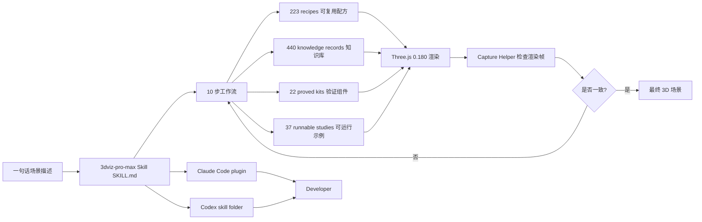

# viettranx/3dviz-pro-max

## 一句话定位
Agent Skill for creative 3D visualization——把"一句话"变成 Three.js / Blender 可探索 3D 场景；10 步工作流 + 223 recipes + 440 knowledge records + 22 proved kits + 37 runnable studies；Claude Code + Codex plugin。

## 它解决的问题
AI 生成 3D 内容时常见痛点：(1) 缺少结构化工作流，agent 不知道先选 renderer 还是先建模；(2) 缺少可复用 templates，每次都从零开始；(3) 缺少验证工具，agent 描述场景与实际渲染不一致；(4) 单次 prompt 缺乏"机制"指导。3dviz-pro-max 把这些都打包成 Agent Skill：声明式 10 步工作流 + 大量 recipes / kits / studies + 配套 capture helper 让 agent 检查自己渲染的帧。

## 为什么值得关注（2026-09-11）
- **Stars:** 131（截至 2026-09-11），1 天即达 131⭐
- **Forks:** 23 / 1 天 = 23 forks/日，**17.6% fork/star 偏高**，说明 fork 学习/二次开发活跃
- **License:** MIT
- **语言:** JavaScript
- **活跃度:** created 2026-09-10，pushed_at 2026-09-10，1 天内完成发布
- **规模:** 71MB（含大量 GLTF / 3D 资源 + 示例）

## 热度来源判断
3dviz-pro-max 的热度是 **"Agent Skill 形态的 3D 可视化模板 × 结构化工作流 × 大量可复用资源"** 的组合。它与昨日 EverettFish/holo-card-studio（1 天 779⭐，2026-09-08）属于同构（Codex/Claude Skill 把"一句话"变成可探索 3D 场景），但 viettranx 把"技能 + 模板库 + 验证流程"打包得更结构化：223 recipes + 440 knowledge + 22 proved kits + 37 runnable studies 的规模远超一般的 Skill 仓库。**17.6% fork/star 反映 fork 学习/二次开发活跃**。热度**真实且具模板化潜力**——但需观察 recipes / kits 的实际复用率。

## 关键技术亮点
1. **10 步结构化工作流**——shape the world → model its rules → make it interactive → check what actually appears
2. **223 recipes**——可复用的 3D 场景配方
3. **440 knowledge records**——3D 概念与约束的知识库
4. **22 proved kits**——经过验证的可运行组件
5. **37 runnable studies**——可运行的 3D 示例
6. **Capture helper**——agent 检查自己渲染的帧而非描述
7. **Three.js 0.180 + Blender + GLTF**——主流 3D 技术栈
8. **Claude Code plugin + Codex skill folder**——双 Harness 安装
9. **Skill 文件 + docs/installation.md + examples/**——完整的安装与使用文档

## 架构师速览

| 决策问题 | 研究判断 | 证据边界 |
|---|---|---|
| 系统边界 | Agent Skill 形态的 3D 可视化模板集合；10 步工作流 + recipes + knowledge + kits + studies；不包含运行时 / 推理引擎 | 仅基于 README 明示的 223/440/22/37 数量级、Three.js 0.180、Claude Code/Codex 安装；具体 recipe 内容与 kit 验证标准未在档案中给出 |
| 主路径 | 一句话描述 → Skill 读取工作流 → 选择 recipe/kit/study → 渲染 → capture helper 检查帧 → 迭代 | 主路径为 README "What it is" 语义抽象；具体 capture helper 实现（截图 + 视觉对比）以仓库代码为准 |
| 关键权衡 | 模板丰富度 vs 仓库体积 vs 验证标准 vs 跨 Harness 维护 | 档案明示"recipes + kits + studies + capture helper"四层结构；71MB 体积反映资源丰富度 |
| 最小 PoC | 安装 Claude Code plugin，给 agent 一句话场景描述（如"build a small fantasy village I can explore"），让 agent 用现有项目栈渲染并 capture 帧 | PoC 范围由 README "Start with one sentence" 语义推导；具体场景选择、Harness 配置需自行验证 |
| 风险 | 71MB 仓库体积偏大、跨 Harness 同步维护成本、recipe 复用率未知 | 档案明示三项风险 |

## 架构启发
3dviz-pro-max 的核心启发是 **"Agent Skill 不再是'一段提示词'，而是'可复用模板 + 验证流程'"**。一般 Skill 仓库只是 SKILL.md + 几个 examples；3dviz-pro-max 把 recipes（配方）+ knowledge（知识）+ kits（验证组件）+ studies（可运行示例）四层结构打包，达到"工作流级"复用。**更深层的启发是：3D 内容生成需要 capture helper（让 agent 检查自己渲染的帧）才能避免"描述与渲染不一致"**。这是 AI 生成视觉内容的通用模式——可推广到视频、设计图、动画等领域。

## 架构图（MMD）

> 证据边界：此图只采用本档案已有可核验描述；"待核验"节点不应视为项目实现事实。

## 定位判断
**工具型项目（Agent Skill for creative 3D）。** 3dviz-pro-max 是"Agent Skill + 模板库 + 验证流程"模式的代表。它的价值与 AI 生成 3D 内容的渗透率正相关——可视化、教学、游戏原型、AR/VR 内容。**值得持续跟踪**工具型定位。

## 风险 / 局限 / 泡沫点
- **71MB 仓库体积偏大**——含大量 GLTF / 3D 资源与示例，可能影响 clone 速度
- **跨 Harness 同步维护成本**——Claude Code plugin + Codex skill folder 格式各异且持续演变
- **recipe 复用率未知**——223 recipes 中实际被复用的比例需要观察
- **capture helper 实现细节未公开**——是截图对比还是元数据对比？
- **个人项目属性**——单作者维护
- **依赖 Three.js 0.180 + Blender**——版本升级需要适配

## 与同类项目的关系
- **vs EverettFish/holo-card-studio（昨日上榜）：** 单场景 Skill（3D 全息闪卡）；3dviz-pro-max 是模板集合
- **vs cclank/clay-safari（前日上榜）：** 黏土风格 3D 双语儿童；3dviz-pro-max 是通用模板
- **vs Anthropic 官方 Skills：** 通用 Skills；3dviz-pro-max 是 3D 场景专属
- **vs wshobson/agents：** 通用 Agent 插件市场；3dviz-pro-max 是垂直 3D 场景
- **vs three.js / Blender 官方示例：** 基础示例；3dviz-pro-max 是 Agent 可消费的 Skill 形态

## 是否值得持续跟踪
**值得跟踪（Agent Skill 3D 可视化模板化）。** 3dviz-pro-max 验证了"Agent Skill + 模板库 + 验证流程"的产品形态。建议关注：(1) recipes / kits 的实际复用率；(2) 是否被 Anthropic / OpenAI 等官方推荐；(3) 是否扩展到视频 / 动画 / 设计图领域。对 AI 生成 3D 内容的开发者，本仓库直接提供工作流级复用；对 Skill 生态观察者，它是"模板 + 验证"模式的代表样本。

## 后续观察点
- recipes / kits 的实际复用率（看 issue / discussion 中的引用）
- 是否被 Anthropic / OpenAI / Cursor 官方推荐
- capture helper 的实现细节（截图对比 / 元数据对比 / LLM 评分）
- 71MB 体积是否影响 clone 速度（看用户反馈）
- 是否扩展到视频 / 动画 / 设计图领域
- Three.js 0.180 升级到更高版本的兼容性

---
*首次记录：2026-09-11*
> 数据来源: GitHub API (2026-09-11) | Stars: 131 | Forks: 23 | License: MIT | 语言: JavaScript | 创建: 2026-09-10
