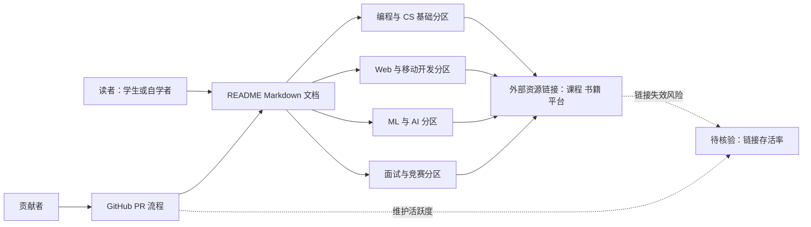

# dipakkr/A-to-Z-Resources-for-Students

## 一句话定位
面向学生和自学开发者的综合资源清单——涵盖编程、算法、设计、面试、竞赛、开源等全方位学习路径的 awesome-list。

## 它解决的问题
自学者面对海量在线学习资源时不知从何开始、如何规划路径。这个项目将分散的优质学习资源（课程、书籍、工具、社区、竞赛平台）按主题系统化整理，降低信息搜索成本，提供结构化的学习路线图。

## 为什么值得关注
- **Stars:** 22,135 stars，教育类 awesome-list 的经典项目
- **Forks:** 4,820，大量用户 fork 后定制自己的学习清单
- 涵盖范围广：编程语言、Web 开发、移动开发、ML/AI、CS 基础、面试准备等
- 经典老牌项目，长期维护
- 对 HR/教育机构也有参考价值

## 热度来源判断
- **历史积累（高）**：运营多年，Stars 是长期沉淀的结果
- **学生群体刚需（高）**：每年新增开发者群体都需要学习资源导航
- **awesome-list 文化（中）**：GitHub awesome-list 天然容易获得 stars
- **更新趋缓（注意）**：最后更新 2026-06-17，可能维护力度下降

## 关键技术亮点亮点
1. **分类体系完善**：从编程基础到前沿技术，覆盖完整开发者成长路径
2. **资源质量筛选**：精选而非简单堆砌，每类资源都有简要说明
3. **社区贡献驱动**：接受 PR 补充新资源，保持内容新鲜度
4. **多维度组织**：按技术栈、按学习阶段、按资源类型（视频/书/互动）分类

## 架构师速览

| 决策问题 | 研究判断 | 证据边界 |
|---|---|---|
| 系统边界 | 这是一个面向学生/自学者的"策展型"awesome-list，本身不承担运行时职责；其边界是 Markdown 文档、社区贡献流（PR）与外部学习资源链接集合，不存在模型、工具编排或身份系统。 | 档案明确为"资源型"awesome-list；未声明任何运行时组件、协议或部署形态。 |
| 主路径 | 读者 → README 分类导航 → 主题分区（编程/算法/面试/ML等）→ 外部资源链接（课程/书籍/平台）；维护侧为贡献者 → PR 审核 → 仓库 Markdown 更新。 | 路径基于"分类体系完善""社区贡献驱动"两条档案描述推断；具体分区数量与命名需以 README 源码核验。 |
| 关键权衡 | 覆盖面广度 vs 单主题深度；社区 PR 速度 vs 链接有效性核实；人力维护 vs AI 个性化推荐替代风险。 | 档案在"时效性风险""深度不足""AI 冲击"中明示；具体衰减率与替代率无量化数据。 |
| 最小 PoC | 无需 PoC；以"链接有效率""最近一次 commit 时间""新增 AI/LLM 相关分区"三项作为采纳与持续使用的最小验收。 | 档案为资源导航类项目，不存在可部署组件；Stars/Forks 不构成生产可用性证据（待核验：最近更新是否仍为 2026-06-17）。 |

## 架构启发
- **策展即产品**：信息过载时代，高质量的资源筛选和路径规划本身就是高价值产品
- **awesome-list 模式的威力**：单一 Markdown 文件+社区贡献，低维护成本高杠杆
- **教育内容需要路径化**：资源清单+学习路径的组合比单纯资源列表更实用

## 架构图（MMD）

> 证据边界：此图只采用本档案已有可核验描述；“待核验”节点不应视为项目实现事实。

## 定位判断
**经典资源型项目**。非技术工具，是学习导航。价值在于信息筛选和结构化，但长期面临时效性挑战。

## 风险/局限/泡沫点
- **时效性风险**：技术资源更新快，部分链接可能失效或过时
- **维护可持续性**：依赖单一维护者，有断更风险
- **深度不足**：覆盖面广但每个主题深度有限，进阶者帮助不大
- **AI 冲击**：ChatGPT 等 AI 工具可直接推荐个性化学习路径，削弱此类清单价值
- **同质化**：GitHub 上类似 awesome-list 很多，差异化不强

## 与同类项目的关系
- **vs freeCodeCamp**：freeCodeCamp 提供互动课程，此项目提供资源导航
- **vs roadmap.sh**：roadmap.sh 提供可视化学习路线图，更结构化
- **vs OSSU**：OSSU 提供完整大学等效 CS 课程体系，更学术
- **vs各类 awesome-* 列表**：更综合，覆盖非技术主题（设计、面试、创业）

## 是否值得持续跟踪
**一般关注即可。** 作为资源参考工具仍有价值，但不是需要密切跟踪的技术项目。建议定期检查链接有效性和新资源更新。

## 后续观察点
- 是否增加 AI/LLM 时代新资源（prompt engineering、agent 开发等）
- 是否转型为更互动的形式（如网站、社区）
- 链接失效率和维护活跃度
- 是否有教育机构正式采用

---
> 数据来源: GitHub API (2026-06-17) | Stars: 22,135 | Forks: 4,820
