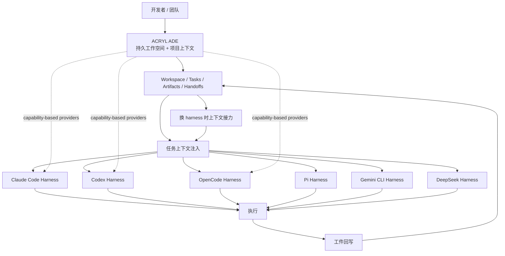

# acryldev/acryl

## 一句话定位
Agent-agnostic 的 Agentic Development Environment（ADE）与上下文接力层——持久工作空间 + 持久项目上下文 + 任务 + 工件 + handoffs；harness 来去自由，工作继续。

## 它解决的问题
当前 AI Coding 工具都是"agent ↔ harness"紧绑定的形态：Claude Code 项目属于 Claude Code，Codex 项目属于 Codex，OpenCode 项目属于 OpenCode。一旦切换 harness，工作上下文（项目记忆、任务进度、对话历史、修改历史）几乎全部丢失；企业也面临单一 vendor lock-in 风险。ACRYL 直接解决 **"agent 不属于任何单一 harness，而是属于持续工作空间 + 项目上下文"**——同一项目可以在不同 harness 间切换，工作继续。

## 为什么值得关注（2026-08-29）
- **Stars:** 219（截至 2026-08-29），4 天起步
- **Forks:** 待核验（API 检索未单独返回）
- **License:** MIT
- **语言:** TypeScript
- **活跃度:** created 2026-08-25，pushed_at 2026-08-29，4 天相对稳定
- **接入面:** Claude Code / Codex / OpenCode / Pi / Gemini CLI / DeepSeek Harness native agents + 更多（README 明示 "ACRYL is being designed to support native and external coding agents through capability-based providers"）
- **状态:** active early development（README 明示 "ACRYL is in active early development. Interfaces, workflows, and packaging may change while the first public foundation is established"）
- **配套:** acryl.dev 网站 + acryl.dev/docs 文档站 + Discord

## 热度来源判断
ACRYL 的热度是 **"AI Coding 用户对 vendor lock-in 的焦虑 × 跨多 harness 上下文接力的真实需求 × anti-lock-in 的双向价值（企业 / 个人）"** 的组合。219⭐/4 天相对稳定说明这不是昙花一现，而是有真实采用信号。但需警惕：(1) "active early development" 状态意味着 API 稳定性差，企业大规模采用需等稳定版；(2) capability-based providers 的具体协议格式未公开；(3) handoff 协议在不同 harness 之间的语义无损性需独立验证。

## 关键技术亮点
1. **agent-agnostic 定位**（README 明示）："ACRYL is an agent-agnostic Agentic Development Environment and continuity layer for software work. The project does not belong to Claude Code, Codex, OpenCode, Pi, Gemini CLI, DeepSeek, or any other individual agent"
2. **ADE / continuity layer 双轨**："ACRYL owns the persistent workspace, project context, tasks, artifacts, and handoffs. Coding agents are replaceable workers that enter and leave the same development scene"
3. **六大 harness 原生接入**：Claude Code / Codex / OpenCode / Pi / Gemini CLI / DeepSeek Harness native agents
4. **capability-based providers 架构**："ACRYL is being designed to support native and external coding agents through capability-based providers"——通过 capability 描述而非硬编码对接，扩展性更强
5. **核心口号**："Same project, Same context, Same work, Different agents"（README 自述）
6. **完整产品形态**：MIT + Discord + acryl.dev 网站 + 文档站——不是 skill 仓库而是产品级项目

## 架构师速览

| 决策问题 | 研究判断 | 证据边界 |
|---|---|---|
| 系统边界 | ACRYL 拥有 workspace / project context / tasks / artifacts / handoffs；harness 拥有执行；接入 Claude Code / Codex / OpenCode / Pi / Gemini CLI / DeepSeek Harness native agents | "ACRYL owns / Coding agents are replaceable workers" 是 README 明确表述；harness capability-based providers 的具体协议格式需文档站独立核验 |
| 主路径 | 用户开 ADE → 选定 harness → 任务上下文由 ACRYL 注入 → harness 执行 → 工件回写到 ACRYL → 换 harness 时上下文接力 | handoff 路径是 README 语义抽象；上下文序列化格式（JSON / Markdown / 私有）未公开 |
| 关键权衡 | 跨 harness 覆盖广度 vs 各 harness 协议差异 vs API 稳定性（early development） vs 治理与审计 | "active early development" 是 README 明示；API 变更节奏与发布周期未量化 |
| 最小 PoC | 在本地 ACRYL 启一个工作空间 → 用 Claude Code 跑一个简单任务（重命名 / 重构） → 切到 Codex 或 OpenCode 接力同一个任务 → 验证工作继续 | 最小安装命令与 harness 切换方式需 acryl.dev 文档站独立核验 |

## 架构启发
ACRYL 的核心启发是 **"ADE（Agentic Development Environment）是 agent harness 经济的护城河"**。当前 AI Coding 市场是"agent ↔ harness"紧绑定的：Claude Code 项目属于 Claude Code，Codex 项目属于 Codex。一旦切换 harness，工作上下文几乎全部丢失；企业也面临单一 vendor lock-in 风险。ACRYL 把"持续工作空间 + 项目上下文 + 任务 + 工件 + handoffs"做成中间层，让 harness 变成"可替换的工人"——这是把"应用与基础设施解耦"的云原生思想引入 AI Coding 生态的关键一步。更深层的启发是 **"capability-based providers" 的扩展性设计**——不硬编码每个 harness 的接入协议，而是通过 capability 描述，让新 harness 接入成本降低。这与 Kubernetes 把"节点"抽象为 capability 描述（CPU / 内存 / GPU）而非物理机器的设计哲学一脉相承。最深层的启发是 **"anti-lock-in" 的双向价值**——对企业是 anti-vendor-lock-in 的关键价值，对个人开发者是"不把工作绑定在某家厂商的 Pro/订阅"。

## 架构图（MMD）

> 证据边界：此图只采用本档案已有可核验描述；"待核验"节点不应视为项目实现事实。

## 定位判断
**平台候选项目（agent-agnostic ADE 与 continuity layer）**。ACRYL 试图成为"AI Coding 的 Kubernetes"——agent 与 harness 解耦，工作空间与项目上下文持续存在，harness 来去自由。219⭐/4 天的稳定曲线 + MIT + Discord + 文档站 + 多 harness 原生接入，说明这是"产品化路线"而非纯 skill。但"ADE as continuity layer"赛道成功的关键在于：(1) 各 harness 协议差异的兼容性深度；(2) API 稳定性（当前 early development）；(3) 与 heimdall / Perenna（8-26 memory 类项目）等 agent memory 项目的差异化；(4) 企业大规模采用的稳定性需求。

## 风险 / 局限 / 泡沫点
- **early development 阶段的 API 稳定性**：README 明示接口与工作流会变，企业大规模采用需等稳定版
- **capability-based providers 协议未公开**：具体格式需文档站独立核验，下游开发者接入门槛不透明
- **跨 harness 语义无损性**：handoff 协议在不同 harness 之间是否能保证任务上下文 / 工件 / 修改历史的语义无损，需独立验证
- **与 8-26 heimdall / Perenna 等 memory 项目的边界**：memory 项目专注 agent memory，ACRYL 专注工作空间 + 上下文接力，两者边界是否清晰需观察
- **个人 / 小团队项目属性**：acryldev 个人维护，长期可持续性 / 治理结构待观察
- **vendor 政策风险**：若主流 harness（Claude Code / Codex）推出"官方 ADE 集成"，ACRYL 可能被挤压

## 与同类项目的关系
- **vs Claude Code / Codex / OpenCode 各自官方工具**：官方工具是"agent ↔ harness"紧绑定；ACRYL 是 agent-agnostic 抽象层
- **vs heimdall / Perenna（8-26 memory 项目）**：memory 项目解决"agent memory 持久化"；ACRYL 解决"工作空间 + 上下文接力"——是更高阶抽象
- **vs rome-os/rome（8-25 agent OS）**：rome 把 agent runtime 推到 OS 层；ACRYL 把 ADE 推到"上下文接力"层——两者不同切面但都朝"agent 基础设施"方向走
- **vs wshobson/agents（8-22 跨平台 skill 仓库）**：wshobson 是 skill 聚合市场；ACRYL 是 ADE 与 continuity layer
- **vs codex-with-chatgpt（8-29 同日项目）**：codex-with-chatgpt 是"LLM 可替换"（ChatGPT 思考 + Codex 执行）；ACRYL 是"harness 可替换"——两者都朝"anti-lock-in"方向但层面不同

## 是否值得持续跟踪
**值得跟踪（agent-agnostic ADE 与 continuity layer 代表）**。ACRYL 代表了"ADE as continuity layer"的赛道方向，与"memory as MCP"（8-26）形成同期合流，是 AI Coding 生态被低估的基础设施层。建议关注：API 稳定性、capability-based providers 协议公开、跨 harness 语义无损性、企业大规模采用案例、与主流 harness 官方 ADE 集成的博弈。对 AI Coding 用户，这是值得试验的 anti-lock-in 工具；对 AI Coding 产品设计者，这是"agent ↔ harness 解耦"的范式参考。

## 后续观察点
- 30/60/90 天 stars / forks 曲线（4 天 219⭐ 是稳定起点）
- API 稳定性（early development → stable 版本的过渡时间）
- capability-based providers 协议公开
- 跨 harness 语义无损性的独立 benchmark
- 企业大规模采用案例
- 与 heimdall / Perenna 等 memory 项目的差异化定位
- 主流 harness 官方是否推出"ADE 集成"挤压第三方

---
*首次记录：2026-08-29*
