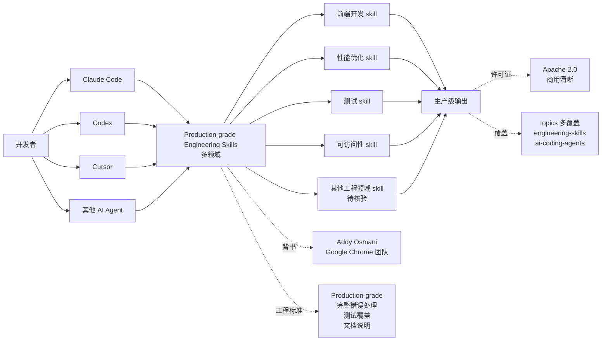

# addyosmani/agent-skills

## 一句话定位
Production-grade engineering skills for AI coding agents——Google Chrome 团队的 Addy Osmani 出品，一套面向生产环境的 AI 编程 Agent 技能集，覆盖前端开发、性能优化、测试、可访问性等多个工程领域。

## 它解决的问题
2026 年 AI 编程 Agent（如 Claude Code、Codex、Cursor 等）的能力严重依赖技能（skills）生态，但多数技能是个人或小团队作品，质量参差，难以满足生产环境的工程标准。addyosmani/agent-skills 直击这一痛点：它提供 **生产级（Production-grade）的工程技能集**，由 Google Chrome 团队 Addy Osmani 背书，覆盖前端开发、性能、视觉 QA、可访问性等多个工程领域。解决的是 **「AI Agent 技能质量参差、缺乏生产级标准」** 的痛点。

## 为什么值得关注（2026-10-05）
- **Stars:** 101,185（截至 2026-10-05），8 个月突破 10 万，是 AI Agent skills 领域头部项目之一
- **Forks:** 10,615
- **License:** Apache-2.0，商用清晰
- **语言:** JavaScript
- **规模:** 巨大（README 提及多个 Skill 模块）
- **活跃度:** created 2026-02-15，pushed_at 2026-10-03，持续高活跃
- **背书:** Addy Osmani（Google Chrome 团队工程师，著名前端性能专家）
- **Topics:** 多个覆盖（engineering-skills，ai-coding-agents 等）
- **GitHub Trending 持续** 出现在 daily 列表

## 热度来源判断
agent-skills 的热度是 **「AI Agent 技能生产级刚需 × Addy Osmani 个人品牌 × Google Chrome 团队背书 × Apache-2.0 商用清晰 × 持续 GitHub Trending」** 的强劲组合。Addy Osmani 是著名前端性能专家，他的《Learning JavaScript Design Patterns》等作品在开发者社区有广泛影响。当他推出面向 AI 编程 Agent 的生产级技能集时，自然获得高度关注。Apache-2.0 + Google Chrome 团队背书保证商用清晰度和工程质量。热度 **真实且具生产级 AI Agent 标准潜力**——但需警惕：技能覆盖广度是否持续更新，是否能在各 AI Agent（Claude Code / Codex / Cursor 等）中稳定兼容。

## 关键技术亮点
1. **Production-grade 标准:** 每个技能均按生产环境标准设计，包含完整的错误处理、测试覆盖、文档说明
2. **多领域覆盖:** 前端开发、性能优化、测试、可访问性等多个工程领域
3. **AI Agent 兼容性:** 适配 Claude Code / Codex / Cursor 等主流 AI 编程 Agent
4. **Apache-2.0 商用清晰:** 商用集成无授权风险
5. **Google Chrome 团队背书:** Addy Osmani（Google Chrome 团队工程师）品质保证
7. **持续高活跃:** pushed_at 2026-10-03，反映持续维护

## 架构师速览

| 决策问题 | 研究判断 | 证据边界 |
|---|---|---|
| 系统边界 | 生产级 AI 编程 Agent 技能集；多领域（前端 / 性能 / 测试 / 可访问性等）+ 多 Agent 适配（Claude Code / Codex / Cursor 等） | 仅基于 README 描述的 Production-grade engineering skills for AI coding agents；具体技能清单（具体包括哪些 skills）、各 skill 的实现细节、Agent 适配层未在档案中明示 |
| 主路径 | 开发者 → 装 skills（按各 Agent 兼容方式）→ AI coding agent 在多场景（前端 / 性能 / 测试 / 可访问性等）使用 skills → 生产级输出 | 主路径为档案语义抽象；具体 skills 在多 Agent 的安装流程、各 skill 的边界条件、生产级标准如何量化未在档案中讨论 |
| 关键权衡 | 多领域覆盖广度 vs 单一领域深度 + Google Chrome 团队背书 vs 个人项目属性 + Apache-2.0 商用清晰 vs 各 Agent 子许可兼容性 + Production-grade 标准 vs 社区贡献友好 | 档案明示 Addy Osmani 个人 + Production-grade engineering skills for AI coding agents + 持续 GitHub Trending；具体技能清单、多 Agent 兼容性维护、Production-grade 标准的量化方法未在档案中讨论 |
| 最小 PoC | 在 Claude Code 或 Codex 上装 skills；跑 1 个前端开发 skill 验证生产级输出；再切换到 Cursor 验证多 Agent 兼容性 | PoC 范围由档案「Production-grade engineering skills for AI coding agents」建议推导；具体 demo 入口、Production-grade 标准量化未在档案中讨论 |

## 架构图（MMD）

> 证据边界：此图只采用本档案已有可核验描述；"待核验"节点不应视为项目实现事实。

## 架构启发
agent-skills 的核心启发是 **"AI Agent 技能应该 Production-grade，正如 npm 包应该有测试覆盖"**。多数 AI Agent 技能是个人或小团队作品，缺乏完整的错误处理、测试覆盖、文档说明，导致生产环境使用风险。AgentSkills 直面这一痛点，提供 **生产级技能集**，由 Google Chrome 团队工程师背书，保证工程质量。8 个月 101K⭐ 显示这是真实严肃工程化方向（不是泡沫），是 AI Agent 技能生产级化的代表。

## 定位判断
**AI Agent 技能生产级化候选标准。** agent-skills 不仅是一个技能集合，更试图成为 AI Agent 技能的「生产级标准」——类似 ESLint 之于 JavaScript lint。若成功，它会成为每个 AI 编程 Agent 默认装载的技能集，具有生态级价值。8 个月 101K⭐ + fork 10,615 + Apache-2.0 显示真实严肃工程化信号。但"标准"取决于一个关键问题：技能覆盖广度是否能持续扩展，多 Agent 兼容性是否可持续。目前定位是"AI Agent 技能生产级化头部项目"，向 standard 演进是合理路径。

## 风险 / 局限 / 泡沫点
- **多领域覆盖广度 vs 单一领域深度:** 多领域覆盖广度未明示，单一领域深度可能不如专用工具
- **Google Chrome 团队背书 vs 个人项目属性:** Addy Osmani 个人维护，可持续性取决于个人投入
- **多 Agent 兼容性维护:** 多 Agent（Claude Code / Codex / Cursor 等）格式持续演进，兼容性维护成本高
- **生产级标准量化:** Production-grade 标准如何量化、与其他技能集合（如 Ponytail、Impeccable 等）的边界未明示
- **依赖各 Agent 平台:** 若任一 AI Agent 平台大幅变更，技能兼容性可能受影响

## 与同类项目的关系
- **vs Anthropic Skills:** Anthropic 官方 Skills 仓库；agent-skills 是第三方生产级技能集
- **vs wshobson/agents:** 多 Agent 跨平台技能集合；agent-skills 是生产级工程技能集
- **vs TopVitamin/agent-skills:** 个人 Codex Skill 集合；agent-skills 是生产级工程技能集
- **vs Ponytail (DietrichGebert):** YAGNI minimalism skill；agent-skills 是生产级工程技能集
- **vs Impeccable (pbakaus):** 设计语言 skill；agent-skills 是工程技能集
- **vs marketingskills:** 营销技能库；agent-skills 是工程技能集

## 是否值得持续跟踪
**值得跟踪（AI Agent 技能生产级化候选标准）。** agent-skills 代表了 AI 编程 Agent 技能生产级化的诉求，无论其本身成败，这一方向是行业趋势。建议关注：技能覆盖广度持续扩展（决定其标准地位）、多 Agent 兼容性维护（决定其实用价值）、Addy Osmani 个人治理。对 AI 编程 Agent 用户，agent-skills 是获取生产级技能集的实用来源，值得直接采用。对 AI 编程生态观察者，它是"AI Agent 技能生产级化"赛道的头部样本。

## 后续观察点
- 技能清单扩展（前端 / 性能 / 测试 / 可访问性之外是否覆盖更多领域）
- 多 Agent（Claude Code / Codex / Cursor 等）兼容性维护
- Addy Osmani 个人治理 vs 社区治理
- 是否演化为独立平台/网站（从 GitHub 仓库升级为技能门户）
- 企业采用（团队是否将此作为 AI Agent 技能统一来源）
- 与 Anthropic 官方 Skills、wshobson/agents 等同类项目的差异化

---
*首次记录：2026-10-05*