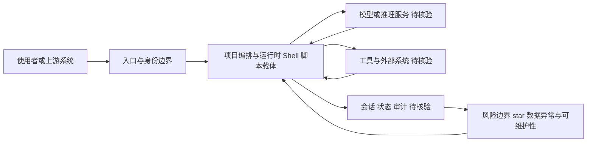

# agency-agents — 完整 AI Agency 工具箱

## 一句话定位

开箱即用的 AI Agent 工具箱——从前端专家到 Reddit 社区运营，从"趣味注入器"到"现实检验器"，每个 Agent 都是一个有个性、有流程、有交付物的专家。

## 它解决的问题

个人和小团队想要部署专业化 AI Agent，但不想从零构建。agency-agents 提供了一系列预设的 Agent 模板，Shell 脚本即可部署。

## 为什么值得关注

1. **月增 67K+ stars**：GitHub 月度 trending 第一，数据极其抢眼
2. **"AI Agency"概念**：把 Agent 从工具提升到"Agency"（代理机构）的概念
3. **Shell 脚本实现**：技术门槛低，任何人可以快速部署

## 热度来源判断

⚠️ **泡沫嫌疑高**。原因：
- 月增 67K stars 对于一个 Shell 脚本集合来说异常——即使考虑到 AI Agent 热潮
- "从前端专家到 Reddit 运营"的描述更像营销话术而非技术文档
- Star 质量需要验证：是否存在 star farming 行为
- Shell 脚本作为 Agent 载体，工程深度有限

## 关键技术亮点亮点

- 预设多个专业化 Agent 模板
- 每个Agent有个性（personality）、流程（processes）、交付物（deliverables）
- Shell 脚本实现，部署简单

## 架构师速览

| 决策问题 | 研究判断 | 证据边界 |
|---|---|---|
| 系统边界 | 入口/身份、项目编排运行时、模型推理、工具与外部系统、会话/状态/审计五条边界；执行载体以 Shell 脚本实现，深度受限于脚本能力 | "Shell Agent / Shell 脚本实现"为档案明确表述；具体身份协议、模型供应商、工具清单未在档案中出现，组件按职责抽象 |
| 主路径 | 上游系统或使用者 → 入口与身份 → 编排/运行时 → 模型与外部工具调用 → 会话/状态/审计回写 | 主路径来自档案"Agent 模板 / 个性 / 流程 / 交付物"的描述抽象，非源码级调用图 |
| 关键权衡 | 扩展速度与权限、可观测性、供应商耦合之间的平衡；Shell 载体在复杂场景下的可维护性是硬约束 | "工程深度不足 / 复杂场景难以维护"为档案明示风险；权限、可观测性细节档案未证实 |
| 最小 PoC | 先在单一渠道、最小工具权限、可审计日志下运行一个预设 Agent 模板，验收 star 真实性、维护活跃度、退出路径后再扩面 | "不建议企业 PoC / 短期关注"为档案结论；具体模板选型、SLO、成本指标档案未给出 |

## 架构启发

**反面启发**：这个项目展示了 AI Agent 领域"标题党"的一面。月增 67K stars 的 Shell 脚本集合，反映了市场对 Agent 的狂热可能已经超过了对工程质量的追求。

## 架构图（MMD）

> 证据边界：此图只采用本档案已有可核验描述；“待核验”节点不应视为项目实现事实。

## 定位判断

**工具型（泡沫嫌疑）**。作为 Agent 模板集合有参考价值，但 star 数据异常，不建议作为技术决策依据。

## 风险/局限/泡沫点

1. **Star 数据异常**：月增 67K 需要进一步验证
2. **技术深度不足**：Shell 脚本的工程天花板很低
3. **过度包装**：Agent "个性"和"交付物"的描述更偏营销
4. **不可维护**：Shell 脚本在复杂场景下难以维护和扩展

## 与同类项目的关系

- **vs Superpowers**：Superpowers 提供的是工程化的 Skill 框架，agency-agents 提供的是 Agent 模板。工程深度差距巨大。
- **vs Archon**：Archon 是工作流引擎，agency-agents 是 Agent 集合。完全不同层级。
- **vs CrewAI**：CrewAI 是 Agent 编排框架，agency-agents 更像是 CrewAI 的"快速启动模板包"。

## 是否值得持续跟踪

**⚠️ 短期关注**。主要关注 star 数据是否真实、是否有实际使用案例涌现。如果证明是泡沫，可以作为反面案例记录。

## 是否值得企业 PoC

**❌ 不建议**。工程深度不足以支撑企业级使用。

## 后续观察点

1. Star 增速是否可持续
2. 是否有真实的交付案例
3. 社区 issue/PR 质量
4. 是否有企业用户反馈
