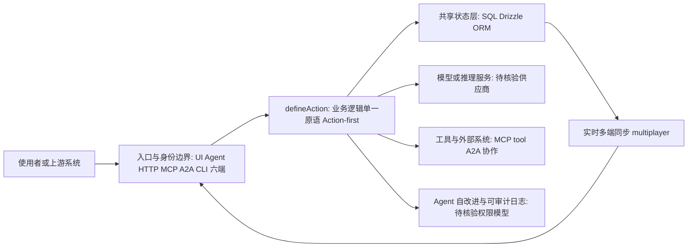

# agent-native

## 一句话定位
Agent-Native 全栈应用框架——定义"UI 与 Agent 等公民"的架构模式，一次 defineAction 六端复用（UI/Agent/HTTP/MCP/A2A/CLI）。

## 它解决的问题
当前 Agent + 应用的集成模式有三种：SaaS 工具（UI 精致但 AI 附加）、纯 Agent（AI 强大但无 UI）、内部工具（混合但维护成本高）。没有一种架构让 Agent 和 UI 真正平等地共享同一套业务逻辑。agent-native 定义了一种新范式：Action-first 设计，一次定义，全端复用。

## 为什么值得关注（2026-06-28）
- BuilderIO 团队出品（Qwik/Mitosis/Builder.io），有深厚的前端框架设计经验
- 周增 1,569 stars，在框架赛道中增速不错
- 首次系统化定义"Agent-Native Application"架构模式
- 提供完整的 cloneable 模板（Mail/Plans/Design/Content/Slides/Analytics），不是 scaffold
- `/visual-plan` 和 `/visual-recap` skill 可以独立于框架使用

## 热度来源判断
BuilderIO 品牌背书 + Agent-Native 概念新颖 + 完整模板降低试用门槛。增速合理，不是泡沫型暴涨。但总量还小（2.7K），处于早期采纳者阶段。

## 关键技术亮点亮点
1. **Action-first 架构：** `defineAction` 定义一次业务逻辑，UI 点击、Agent 命令、HTTP API、MCP tool、A2A 调用、CLI 命令全部复用。消除了"业务逻辑在 UI 和 Agent 中各写一遍"的问题。
2. **SQL-backed shared state：** 一个数据库，UI 和 Agent 的修改实时互相同步。基于 Drizzle ORM，支持任何 SQL 数据库。
3. **Real-time multiplayer：** 人类和 Agent 同时编辑同一文档，Agent 作为 first-class peer。这比"Agent 做完给人类审核"模式更紧密。
4. **Agent 自改进：** Agent 可以给应用添加功能、修 bug、改进 UI——因为 Agent 能直接调用 defineAction 修改应用代码。
5. **A2A 协作：** Tag 另一个 Agent，跨应用协调。

## 架构师速览

| 决策问题 | 研究判断 | 证据边界 |
|---|---|---|
| 系统边界 | agent-native 是 TypeScript 全栈框架，承担 UI/Agent/HTTP/MCP/A2A/CLI 六端共享业务逻辑的编排层；持久化基于 Drizzle ORM 与 SQL 数据库；归属 BuilderIO 团队 | 具体传输协议、部署形态、模型供应商适配须以源码核验 |
| 主路径 | defineAction 定义业务逻辑 → UI 点击 / Agent 命令 / HTTP / MCP tool / A2A / CLI 任一入口触发 → 调用同一 Action → 写入共享 SQL 状态 → 实时多端同步 | "一次定义六端复用"宣称来自档案，真实一致性保证与冲突策略未公开 |
| 关键权衡 | Action-first 统一抽象带来开发效率与跨端一致性，但会引入框架锁定（Action API 绑定）、迁移成本高、模板生态仅 6 个（Mail/Plans/Design/Content/Slides/Analytics），且与 Vercel AI SDK、Mastra 存在定义权竞争 | 企业采纳案例、生产部署证据尚未给出 |
| 最小 PoC | 优先复用一个 cloneable 模板（如 Mail），验证单渠道 + 最小工具权限 + 可审计日志下的 defineAction 复用程度与多端同步延迟；将安全边界、成本、SLO 与退出路径作为验收项 | PoC 中实测的同步一致性、Agent 自改代码的权限模型需现场验证 |

## 架构启发
agent-native 的核心启发是"Action 作为通用原语"：

传统架构：UI → Controller → Service → DB（UI 是入口）
Agent 架构：Agent → Tool → Service → DB（Agent 是入口）
agent-native：Action → DB（UI/Agent/HTTP 都是 Action 的消费者）

这种设计让 Action 成为单一真实来源（Single Source of Truth），所有消费方式都是等价的。对架构师的启发是：在设计 Agent 时代应用时，先定义 Action 再考虑消费方式。

## 架构图（MMD）

> 证据边界：此图只采用本档案已有可核验描述；“待核验”节点不应视为项目实现事实。

## 定位判断
处于 L4 框架层，试图定义 Agent 时代全栈应用的默认架构。如果成功，可能类似 Rails 之于 MVC、Next.js 之于 React SSR。但目前仍处于早期（2.7K），需要观察生态发展。

## 风险 / 局限 / 泡沫点
1. **概念超前于市场：** 大多数团队还在"给现有应用加 Chat"阶段，"Agent-Native 应用"需要从零设计。
2. **框架锁定风险：** 采用 agent-native 意味着全面拥抱其 Action 体系，迁移成本高。
3. **模板生态尚薄：** 6 个模板不够覆盖企业常见场景（CRM/ERP/Ops），需要社区贡献。
4. **与 Vercel AI SDK / Mastra 等竞争：** 虽然定位不同，但都在争夺"Agent 应用框架"定义权。

## 与同类项目的关系
- **vs Vercel AI SDK：** Vercel AI SDK 偏向"Chat UI + Tool calling"，agent-native 定义完整的 Action-first 应用架构。不同层级。
- **vs Mastra：** Mastra 是 Agent 框架（定义 Agent 行为），agent-native 是应用框架（定义应用如何 Agent-native）。互补。
- **vs OpenSpec：** OpenSpec 从规格约束 Agent 行为，agent-native 从架构层面让 Agent 原生集成。可以组合。

## 是否值得持续跟踪
**是。** BuilderIO 团队有框架设计基因，agent-native 的架构理念值得深入研究。建议每月跟踪一次，重点关注模板生态和企业采纳信号。

## 后续观察点
1. 模板生态发展——是否有社区贡献新模板
2. 企业采纳案例——是否有公司在生产环境构建 agent-native 应用
3. Action-first 模式的实际开发体验——是否真的能做到"一次定义六端复用"
4. 与 Vercel/Mastra 等框架的关系——是竞争还是融合

---
*首次记录：2026-06-28*
