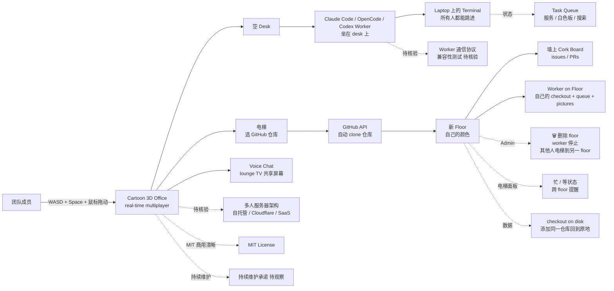

# AgentSystemLabs/agent-office

## 一句话定位
**Cartoon 3D office your team walks around in together** —— 把 Claude Code / OpenCode / Codex worker 坐在空 desk 上，看它在 laptop 上的 terminal，跳进那个 terminal 与所有人一起；issues 和 pull requests 挂在墙上的 cork board 上；用 voice chat + lounge TV 共享屏幕；**每个 project 是一个 floor** —— 乘电梯选 GitHub 仓库，office 把它 clone 并开一个新 floor，刷成自己的颜色。

## 它解决的问题
2026 年 Claude Code / OpenCode / Codex 等 coding agent 的协作方式同构问题：**团队多人协作时，每个 agent 在自己的 terminal / IDE 工作 + 看不到其他人 + 看不到 issues / PRs + 听不到 voice + 不能共享屏幕 + 没有"团队在一起"的感觉** —— 这是个人开发者工具 vs 团队协作工具的根本差距。agent-office 直击这一痛点：它给团队一个 **"3D 多人共看 agent 干活" 的具体路径** —— WASD + Space + 鼠标拖动 orbit camera 在卡通 3D office 走 + 看到每个 worker 的 terminal + 跳进那个 terminal 与所有人一起 + 墙上的 cork board 显示 issues / PRs + voice chat + lounge TV 共享屏幕 + 每个 project 是一个 floor + 电梯选 GitHub 仓库自动 clone + 刷成自己的颜色。解决的是 **"agent 团队协作 + 3D 多人 + 透明 + 跨 worker + 跨项目"** 的具体问题。

## 为什么值得关注（2026-09-29）
- **Stars:** 269（截至 2026-09-29），3 天突破 270，**09-26 ~ 09-29 严肃工程化个人 / 团队协作工具持续铺开中的典型样本**
- **Forks:** 59，**fork/star 21.9%** 典型高 fork + 团队协作严肃工程化持续关注信号
- **License:** MIT（商用清晰）
- **语言:** TypeScript
- **规模:** 1751 KB（约 1.7 MB —— TypeScript 中型项目）
- **活跃度:** created 2026-09-26，pushed_at 2026-09-28，持续高活跃
- **Topics:** 无（仓库未添加 topics，但 README 内容清晰）
- **核心创新:** 每个 project 是一个 floor；电梯选 GitHub 仓库自动 clone；刷成自己的颜色
- **核心抽象:** WASD 走 + Space 跳 + 鼠标拖动 orbit camera；real-time multiplayer
- **核心机制:** 每个 worker 在 laptop 上显示自己的 terminal；所有人都能跳进那个 terminal

## 热度来源判断
agent-office 的热度是 **"3D 多人共看 agent 干活 + 每个 project 一个 floor + 电梯选仓库自动 clone + 跨 worker voice chat + MIT"** 的强劲组合。09-22 ~ 09-28 七日内严肃工程化个人 / 团队协作工具多线同时铺开：09-23 freestylefly/WeChatBridge（macOS 微信 Share Extension）+ 09-23 unreallabsai/unreal-agent（async-first Go harness 八组件）+ 09-24 SewCabinSpout/cleanupper（macOS 终端清理 Trash-first）+ 09-24 edison-land/paragravity（Chromium 多账号并行）+ 09-25 yetone/magpie（Wails 菜单栏 + 跨 Agent 网关）+ 09-28 dzhng/jevgrep + 09-28 supermemoryai/company-brain + 09-28 feitangyuan/onetake。agent-office 把这条主线推到 **"3D 多人 + 每个 project 一个 floor + 跨 worker voice + 实时 multiplayer"**。269⭐ / 59f / fork/star 21.9% 是较高典型高 fork 严肃工程化持续关注信号。热度**真实且具团队协作严肃工程化生态价值**——这是 "严肃工程化个人 / 团队协作工具从单点 CLI / App → 3D 多人协作 + 每个 project 一个 floor" 演化关键信号。

## 关键技术亮点
1. **3D 卡通 office** —— cartoon 3D office your team walks around in together
2. **每个 project 一个 floor** —— A floor per project；first time the office starts walks you through picking your first project；otherwise start inside the elevator；电梯选 GitHub 仓库自动 clone
3. **WASD + Space + 鼠标拖动 orbit camera** —— walk around；real-time multiplayer（每个人都能看到其他人移动）
4. **每 worker 一个 laptop terminal** —— sit a Claude Code / OpenCode / Codex worker at any empty desk；watch its terminal on the laptop in front of it；jump into that terminal with everyone else
5. **Issues / PRs 在 cork board 上** —— issues and pull requests hang on cork boards on the wall
6. **Voice chat + lounge TV 共享屏幕** —— talk over voice and put your screen on the lounge TV
7. **每个 floor 自己的颜色** —— every project has its own colors；always know where you are
8. **电梯显示忙 / 等状态** —— the elevator panel shows how many workers are busy or waiting on someone on each floor；heads-up when a worker on another floor starts waiting
9. **Admin 删除 floor** —— admins can take a project off the building with the 🗑；checkout stays on disk with its workers, queue and pictures
10. **安静的 screen** —— top bar holds just the floor you're on, 🤖 Workers and the ☰ menu
11. **菜单收纳** —— issues, PRs, the queue, services, the whiteboard, search, voice, screen sharing, settings；每个开关可关；Pin anything you use a lot
12. **跨 worker 跨项目数据保持** —— checkout stays on disk；adding the same repository again moves back into it

## 架构师速览

| 决策问题 | 研究判断 | 证据边界 |
|---|---|---|
| 系统边界 | 3D 多人协作 agent 工具；仓库是 TypeScript 客户端 + 模拟多人 + 跨 worker 协调 | 描述层准确；具体多人服务器（自托管 / Cloudflare / SaaS）+ worker 协议 + voice / screen sharing 实现均待核验 |
| 主路径 | 启动 office → 选 project → clone GitHub 仓库 → 开 floor → 雇佣 worker → 看 terminal → voice / screen → admin 可删除 floor | 主路径为 README 表述；具体多人服务器架构、worker 通信协议、GitHub API 集成、voice / screen streaming 实现均待核验 |
| 关键权衡 | 3D 多人协作体验 vs 性能 vs 单用户 vs 多人 vs 每个 project 一个 floor 抽象 vs 电梯选仓库自动 clone vs MIT 商用清晰 vs 持续维护承诺 | README 明示 "first time walks you through picking your first project" + "电梯选 GitHub 仓库" + "每个 floor 自己的颜色"——每个 project 一个 floor 是核心抽象；多人扩展性是核心权衡 |
| 最小 PoC | (1) 单机启动 office + 选 1 个 GitHub 仓库；(2) 雇佣 1 个 worker (Claude Code) 坐在 desk；(3) 看 terminal；(4) WASD 走 + Space 跳；(5) 验证 floor 颜色；(6) voice / screen sharing 待多人验证 | PoC 范围、退出路径由"先单机 + 单 worker + 单项目、可物理化验证"建议推导；多人协议、worker 兼容性、voice / screen 实现待核验 |

## 架构图（MMD）

> 证据边界：此图只采用本档案已有可核验描述；"待核验"节点不应视为项目实现事实。

## 架构启发
agent-office 的核心启发是 **"agent 工具已从个人 CLI / App → 3D 多人协作 + 每个 project 一个 floor + 跨 worker voice"**。当前 agent 工具生态多以"个人开发者 CLI / App"为主（jevgrep CLI / magpie 菜单栏 / cometixcode TUI / company-brain Slack teammate），但 agent-office 把 **3D 多人协作 + 每个 project 一个 floor + 跨 worker voice + WASD 物理化走 + lounge TV 共享屏幕** 同时推到严肃工程化形态——这意味着 **agent 工具已从"个人开发者" → "团队协作"演化**。更深层的启发：**每个 project 一个 floor 的抽象** —— "A floor per project" + "电梯选 GitHub 仓库自动 clone" + "刷成自己的颜色"——这是用 3D 物理隐喻表达"多项目并行"的具体形态。

## 定位判断
**3D 多人协作 agent 工具的具体路径（工具型 + 团队协作）。** agent-office 不仅是 3D 多人游戏，更是 **"3D 多人共看 agent 干活 + 每个 project 一个 floor + 跨 worker voice + MIT"** 的严肃工程化代表。269⭐ + 59f 已显示团队协作严肃工程化持续关注。但"多人服务器架构" + "worker 通信协议兼容性"是核心风险——3D 多人体验依赖 server-side 持续投入。目前定位是"agent 团队协作严肃工程化最具代表性的 3D 多人工具"，向多人扩展 + 跨 worker 兼容性是合理演化。

## 风险 / 局限 / 泡沫点
- **3D 多人服务器架构未明示** —— 多人协议、跨地域延迟、server 成本未在 README 中说明
- **worker 通信协议兼容性** —— Claude Code / OpenCode / Codex 三个 worker 的兼容是否完整未明示
- **voice / screen sharing 实现** —— lounge TV 共享屏幕的技术实现未明示（WebRTC / LiveKit / 自托管？）
- **GitHub API 集成** —— clone 仓库 + 拉取 issues / PRs 的 OAuth 流程未明示
- **卡通 3D office 性能** —— 大型 3D 场景 + 多人 multiplayer 的客户端性能
- **每个 project 一个 floor 的扩展性** —— 团队 100 个项目 = 100 个 floor；电梯 UI 是否够用
- **个人 / 团队项目属性** —— AgentSystemLabs 组织维护；持续维护承诺 + 长期风险
- **商业化路径不清晰** —— MIT 商用清晰；但 SaaS / 付费版 / 赞助不清晰

## 与同类项目的关系
- **vs dzhng/jevgrep（09-26 ~ 09-29 持续）:** CLI 工具层 + 多 provider + 多 harness；agent-office 是 3D 多人协作
- **vs yetone/magpie（09-25 ~ 09-29 持续）:** 跨 Agent 模型统一网关菜单栏 App；agent-office 是 3D 多人协作
- **vs supermemoryai/company-brain（09-25 ~ 09-29 持续）:** 商用 Slack 记忆副驾开源；agent-office 是 3D 多人协作
- **vs freestylefly/WeChatBridge（09-23 ~ 09-29 持续）:** macOS 微信 Share Extension；agent-office 是 3D 多人
- **vs unreallabsai/unreal-agent（09-23 ~ 09-29 持续）:** async-first Go harness 八组件；agent-office 是 3D 多人协作

## 是否值得持续跟踪
**值得跟踪（3D 多人协作 agent 工具严肃工程化代表样本）。** agent-office 代表了 **"agent 工具已从个人 CLI / App → 3D 多人协作 + 每个 project 一个 floor + 跨 worker voice"** 的演化方向。建议关注：(1) 多人服务器架构的明示（自托管 / Cloudflare / SaaS）；(2) worker 通信协议的兼容性扩展（Claude Code / OpenCode / Codex / Cursor / Copilot）；(3) voice / screen sharing 的实现细节；(4) 每个 project 一个 floor 抽象在大规模团队（100+ 项目）的扩展性；(5) GitHub API 集成的 OAuth 流程与企业版兼容。对团队 / 企业用户，这个工具是"3D 多人共看 agent 干活"的具体形态，值得关注。

## 后续观察点
- 多人服务器架构的明示（自托管 / Cloudflare / SaaS）
- worker 通信协议的兼容性扩展
- voice / screen sharing 的实现细节
- 每个 project 一个 floor 在大规模团队的扩展性
- GitHub API 集成的 OAuth 流程与企业版兼容
- 卡通 3D office 性能与多人同步的客户端表现
- MIT 商用清晰的边界在企业 / 商业复用的实际情况
- AgentSystemLabs 组织持续维护承诺

---
> 数据来源: GitHub API (2026-09-29) | Stars: 269 | Forks: 59 | License: MIT | 语言: TypeScript | 创建: 2026-09-26 | 规模: 1751 KB