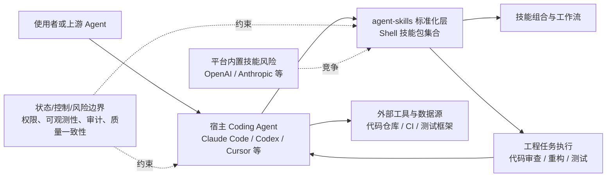

# agent-skills

## 一句话定位
为 AI Coding Agent 提供生产级工程技能的标准化集合，由前端架构师 Addy Osmani 主导。

## 它解决的问题
AI Coding Agent 缺乏标准化的工程能力——每个 Agent 都在重复造轮子写 Prompt 来实现代码审查、重构、测试等工程任务。agent-skills 提供经过验证的、可直接复用的工程技能包，让任何 Agent 都能获得专业级工程能力。

## 为什么值得关注（2026-06-12）
日增 3,275 stars，总量 54,532，是 Agent Skills 品类中 star 最高且增长最稳定的项目。由 Google Chrome 团队的前端架构师 Addy Osmani 主导，技术背书强。标志着 Agent 能力从"Prompt 模板"向"标准化技能包"的演进。

## 热度来源判断
**真实需求驱动。** Addy Osmani 的个人品牌带来了初始关注，但持续增长来自于开发者社区对 Agent 技能标准化的真实渴望。54K stars 中有大量来自一线开发者的实际使用反馈。这不是泡沫——是 Agent 生态成熟过程中的必然需求。

## 关键技术亮点亮点
1. **技能标准化接口：** 不是简单的 Prompt 模板，而是定义了 Agent 技能的标准格式和调用协议
2. **生产级验证：** 每个技能都经过实际工程场景验证，不是 demo 级别的玩具
3. **跨 Agent 兼容：** Shell 语言编写，理论上兼容所有支持 Shell 执行的 Agent（Claude Code、Codex、Cursor 等）
4. **技能组合能力：** 支持多个技能组合使用，形成复杂工程工作流

## 架构师速览

| 决策问题 | 研究判断 | 证据边界 |
|---|---|---|
| 系统边界 | agent-skills 定位在 AI Coding Agent 之上的"技能标准化层"：以 Shell 脚本为载体，向下接入 Claude Code、Codex、Cursor 等支持 Shell 执行的 Agent，向上暴露工程技能（审查、重构、测试等）的统一调用接口，本身不包含模型推理与外部工具实现。 | 边界来源：语言=Shell、标签=agent-skills/coding-agent/engineering/standardization/skill-marketplace；具体接口协议、注册中心、版本与依赖模型未在 README 证实。 |
| 主路径 | 宿主 Agent 触发技能 → 加载 Shell 技能包 → 执行工程任务（代码审查/重构/测试）→ 返回结果给 Agent；多技能可组合形成工作流。 | "技能组合能力"与"跨 Agent 兼容"为档案明确描述；技能加载、组合与返回协议细节（IPC、stdio、Skill manifest 字段）未在档案中给出。 |
| 关键权衡 | (1) 标准化通用性 vs. 复杂技能表达能力（Shell 模型受限）；(2) 社区贡献速度 vs. 技能质量一致性；(3) 第三方标准 vs. 平台内置技能被绕过（OpenAI/Anthropic 内置风险）。 | 档案直接列出 Shell 局限、质量挑战、被大厂平台内置取代风险；未给出性能基准、权限模型、可观测性等数据。 |
| 最小 PoC | 选取一个高频工程任务（如代码审查），在单一宿主 Agent（待选定Claude Code / Codex / Cursor）与最小工具权限、可审计日志下，验证技能加载、调用与结果回写 3 个动作；验收项纳入权限边界、日志可审计性、退出路径。 | 验收项来自档案"采用建议"；具体目标 Agent、Skill manifest 字段、性能与兼容性数据需源码核验。 |

## 架构启发
Agent 架构正在从"单体 Prompt"向"技能注册 + 能力调度"演进。这和微服务架构从单体到服务拆分的路径惊人相似：
- 单体 Prompt → 技能拆分 → 技能注册 → 技能市场 → 技能编排
- 类似：单体应用 → 微服务 → 服务注册 → API Gateway → 编排引擎

技能市场可能成为 Agent 生态的平台层机会，类似 npm 对 JavaScript 生态的意义。

## 架构图（MMD）

> 证据边界：此图只采用本档案已有可核验描述；“待核验”节点不应视为项目实现事实。

## 定位判断
在 Agent 生态中处于"技能标准制定者"的位置。如果成功建立标准，将成为 Agent 时代的"npm"。但目前仍处于早期阶段，标准尚未固化。

## 风险 / 局限 / 泡沫点
1. **被大厂平台内置取代的风险：** OpenAI、Anthropic 等 Agent 平台可能直接内置技能系统，绕过第三方标准
2. **标准碎片化：** 多个"skill"项目各自为政，可能无法形成统一标准
3. **Shell 语言的局限性：** 复杂技能可能需要更丰富的编程模型
4. **质量一致性挑战：** 社区贡献的技能质量参差不齐

## 与同类项目的关系
- **vs. taste-skill：** taste-skill 更偏概念营销（"给 AI 好品味"），agent-skills 更偏工程落地
- **vs. pm-skills：** pm-skills 聚焦产品管理领域，agent-skills 聚焦工程能力，互补关系
- **vs. harness (revfactory)：** harness 是"元技能"——自动生成技能，agent-skills 是技能本身

## 是否值得持续跟踪
**是，强烈建议持续跟踪。** 这是 Agent 技能标准化方向最核心的项目，将直接影响 Agent 架构的演进方向。

## 后续观察点
1. 技能标准是否被主流 Agent 平台（Claude Code、Cursor、Copilot）采纳
2. 社区技能贡献的质量和增速
3. 是否出现技能编排/组合的高级抽象层

---
*首次记录：2026-06-12*
