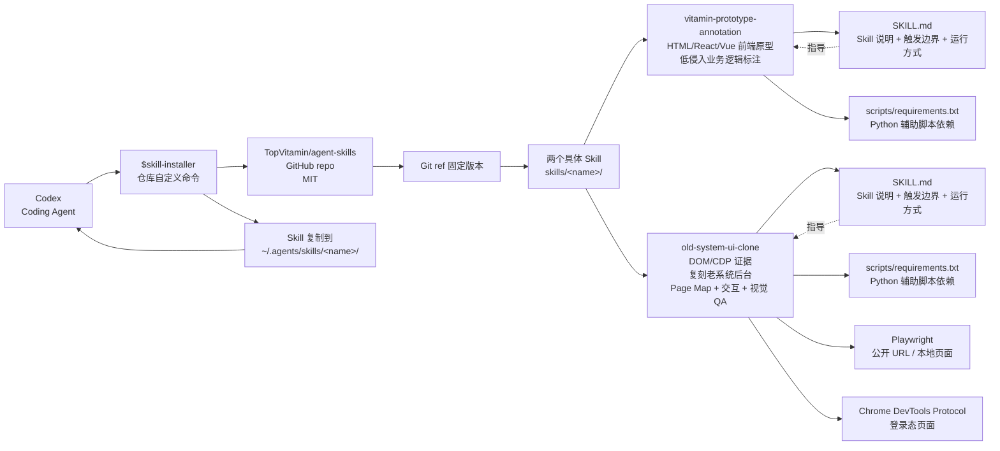

# TopVitamin/agent-skills

## 一句话定位
中文 Codex Agent Skills 集合——提供两个具体 Skill 实例（`vitamin-prototype-annotation` 为 HTML/React/Vue 等前端原型添加低侵入业务逻辑标注 + `old-system-ui-clone` 基于 DOM/CDP 证据复刻老系统后台/竞品后台/企业管理页面并完成 Page Map + 交互 + 视觉 QA），遵守 Codex Skill 标准目录约定（每个 Skill 位于 `skills/<name>/` + 必须包含 `SKILL.md` + scripts/requirements.txt），可被 Codex `$skill-installer` 集成并指定 Git ref 固定版本。

## 它解决的问题
当前 Coding Agent Skill 生态的痛点是 **「awesome list 多但具体可用 Skill 少」** ——awesome-claude-code-mods 列出 31 个 mod 但每个 mod 的「能做什么 + 怎么用 + 触发边界」缺具体实例。**TopVitamin/agent-skills 提供两个具体 Skill 实例**（`vitamin-prototype-annotation` + `old-system-ui-clone`）展示「什么是合规 Skill」「Skill 目录怎么组织」「Playwright / CDP 怎么集成」「Git ref 怎么固定版本」——这是 **「Skill 标准 + 具体实例」** 双层结构。**对中文 Coding Agent 生态**：TopVitamin 是少数明确面向 Codex Skill 标准的中文 Skill 仓库——README 全中文 + 仓库组织遵循 Codex Skill 规范；这是「中国开发者用中国语言写中国 Skill 给中国 Coding Agent」的清晰路径。

## 为什么值得关注（2026-09-16）
- **Stars:** 11（截至 2026-09-16），1 天 11⭐
- **Forks:** 0
- **Watchers/Subscribers:** 0
- **Open Issues:** 0
- **License:** MIT（极宽松，企业友好）
- **语言:** JavaScript（仓库元数据 + README 元信息）
- **活跃度:** created 2026-09-15，pushed_at 2026-09-15
- **规模:** 134 KB（极小）
- **Skills 数量:** 2 个具体 Skill（vitamin-prototype-annotation + old-system-ui-clone）
- **浏览器能力:** 公开 URL 或本地页面用 Playwright；登录态页面需可访问用户会话的 Chrome / CDP 路径

## 热度来源判断
TopVitamin/agent-skills 的热度是 **「中文 Codex Skill 标准 + 两个具体 Skill 实例 + MIT 许可 + SKILL.md 标准目录」** 的组合。**中文 Coding Agent 生态在 Skill 层面是空白**——主流 Skill 仓库（awesome-claude-code-mods 等）以英文为主，中国开发者日常用的工具（前端原型 / 老系统复刻 / 微信群总结 等）需要专门的中文 Skill。**两个具体 Skill 击中企业 IT 真需求** —— `vitamin-prototype-annotation` 解决「前端原型如何不被『注释太少』拖慢维护」；`old-system-ui-clone` 解决「企业 IT 如何用 Coding Agent 复刻老后台」。**MIT + 134 KB + `$skill-installer` 集成 + Git ref 固定版本**是「可被 Codex 直接安装」的标准形态。热度 **真实且有中国市场刚需**——但 fork=0 / 1 天反映项目刚发布，企业 fork 信号尚未出现；**真正决定长期价值的是 `$skill-installer` 是否被 Codex 官方正式承认**。

## 关键技术亮点
1. **两个具体 Skill 实例**——`vitamin-prototype-annotation`（为 HTML/React/Vue 等前端原型添加低侵入业务逻辑标注）+ `old-system-ui-clone`（基于 DOM/CDP 证据复刻老系统/竞品后台/企业管理页面并完成 Page Map + 交互 + 视觉 QA）
2. **`$skill-installer` 集成机制**——Codex 中运行 `$skill-installer` 从 GitHub 安装 `TopVitamin/agent-skills` 中的某个 Skill；这是「Codex 直接安装 Skill」的标准命令
3. **Git ref 固定版本**——可指定 Git ref（如 `v1.0.0` 或 commit hash）固定安装版本；避免「今天跑得通明天跑不通」（Skill 更新引入 breaking change 时可指定旧版本）
4. **`SKILL.md` 标准目录约定**——每个 Skill 位于 `skills/<skill-name>/` + 必须包含 `SKILL.md`（Skill 说明/触发边界/运行方式以 `SKILL.md` 为准）+ scripts/requirements.txt（Python 辅助脚本依赖）
5. **Playwright 浏览器能力**——`old-system-ui-clone` 公开 URL 或本地页面用 Playwright 抓取 DOM 结构；登录态页面需要可访问用户会话的 Chrome / CDP 路径
6. **Page Map + 交互 + 视觉 QA 三件套**——`old-system-ui-clone` 不只复刻 UI 还完成 Page Map（页面地图）+ 交互（点击/表单流程）+ 视觉 QA（CSS 一致性）三件套
7. **MIT License**——极宽松，企业可直接商用
8. **仓库全中文**——README + Skill 描述均为中文；降低中国开发者认知负担

## 架构师速览

| 决策问题 | 研究判断 | 证据边界 |
|---|---|---|
| 系统边界 | 中文 Codex Agent Skills 集合；输入 Codex 调用 `$skill-installer`；输出 Skill 安装到 `~/.agents/skills/`；两个具体 Skill（vitamin-prototype-annotation + old-system-ui-clone）；遵守 Codex Skill 标准目录约定（每个 Skill 位于 `skills/<name>/` + 必须包含 `SKILL.md` + scripts/requirements.txt）；可指定 Git ref 固定版本 | 来自 README 关于「TopVitamin 面向 Codex 和其他兼容 Agent Skills 标准的工具」「两个具体 Skill：vitamin-prototype-annotation + old-system-ui-clone」「`$skill-installer 从 GitHub 安装 TopVitamin/agent-skills 中的 skills/<name>`」「Git ref 固定版本」「SKILL.md + scripts/requirements.txt 标准目录」「公开 URL/本地页面用 Playwright，登录态页面需可访问用户会话的 Chrome/CDP 路径」「MIT License」的明示；具体每个 Skill 的 SKILL.md 内容、Playwright 脚本实现细节在 README 中未完全展开 |
| 主路径 | Codex 用户运行 `$skill-installer 从 GitHub 安装 TopVitamin/agent-skills 中的 skills/vitamin-prototype-annotation` → DSH bundle apply → Skill 复制到 `~/.agents/skills/<name>/` → Codex 识别新 Skill → 用户调用 Skill → Skill 的 SKILL.md 描述触发边界 + scripts/requirements.txt 依赖 + 实际执行（前端标注 / 老系统复刻） | 主路径来自 README 描述的 `$skill-installer 集成` + Codex Skill 标准目录约定；具体 `$skill-installer` 命令实现（仓库自定义还是 Codex 官方命令）、每个 Skill 的 SKILL.md 内容、Playwright 脚本实现细节待核验 |
| 关键权衡 | 中文章节（低认知负担 vs 国际化局限）/ 两个具体 Skill（具体可用 vs 覆盖面窄）/ `$skill-installer` 自定义命令（可立即使用 vs 是否被 Codex 官方承认）/ Git ref 固定版本（稳定 vs 不能自动更新）/ Playwright + CDP（强大 vs Chrome 依赖）/ SKILL.md 标准（兼容 Codex Skill 生态 vs 不能跨 Harness） | 权衡六因素均从 README + repo 元数据推导；具体两个 Skill 的成熟度、企业采用度、`$skill-installer` 官方承认情况待核验 |
| 最小 PoC | Codex 已安装 + 运行 `$skill-installer 从 GitHub 安装 TopVitamin/agent-skills 中的 skills/vitamin-prototype-annotation` + 验证 Skill 复制到 `~/.agents/skills/vitamin-prototype-annotation/` + 在 Codex 中调用 Skill 处理一个简单 HTML 原型验证「低侵入业务逻辑标注」生效；再安装 `old-system-ui-clone` + 用 Playwright 抓一个公开 URL 验证 Page Map + 交互 + 视觉 QA 三件套生效 | PoC 由「两个具体 Skill + `$skill-installer` + Git ref + SKILL.md + Playwright + CDP」路径推导；具体 Skill 实现细节、`$skill-installer` 命令实现在本档案未读源码 |

## 架构启发
TopVitamin/agent-skills 的核心启发是 **「Skill 标准 + 具体实例」双层结构**。当前 Skill 生态主流是「awesome list」（列出名字 + 链接 + 一句话描述），但 **「具体 Skill 怎么写 + 触发边界 + 依赖怎么声明」** 没有标准。TopVitamin/agent-skills 提供两个具体 Skill 实例 + 完整 SKILL.md 标准目录约定，展示了 **「什么是合规 Skill」**。更深层的启发是 **「中国开发者用中国语言写中国 Skill 给中国 Coding Agent」** 的清晰路径——全中文 README + 中文 Skill 描述 + 遵守 Codex Skill 标准目录 = 「可被 Codex 直接安装的中文 Skill 实例」。这与昨日 ToolReplay「session 层审计」英文优先 + AgentScope Java 中文版镜像形成对比——Coding Agent 工具链在中文场景的「本土化实例」是清晰方向。

## 架构图（MMD）

> 证据边界：此图只采用本档案已有可核验描述；"待核验"节点不应视为项目实现事实。

## 定位判断
**工具型项目（中文 Codex Skill 标准实例集合）。** TopVitamin/agent-skills 不是又一个 Skill 列表（那是 awesome-claude-code-mods），而是 **「中文 + Codex Skill 标准 + 两个具体实例」** —— `vitamin-prototype-annotation`（前端标注）+ `old-system-ui-clone`（老系统复刻）两个 Skill 击中企业 IT 真需求场景。**MIT + 134 KB + SKILL.md 标准目录 + `$skill-installer` 集成**是「可被 Codex 直接安装」的标准形态。**目前定位是「中文 Codex Skill 标准实例的标杆」**——向上是 Codex 官方 Skill 标准，向下是「中国开发者用中文写 Skill」的具体路径。

## 风险/局限/泡沫点
- **`$skill-installer` 是否被 Codex 官方正式承认**——目前 OpenAI Skills 文档列出「`~/.agents/skills`」个人目录（参考 `learn.chatgpt.com/docs/build-skills`），`$skill-installer` 命令是仓库自定义的安装机制；长期看 Codex Skill 标准需要 Anthropic / OpenAI 官方背书
- **两个具体 Skill 的成熟度待观察**——vitamin-prototype-annotation + old-system-ui-clone 都是新发布 Skill，企业采用需实测
- **11⭐ / fork 0 / 1 天**反映早期信号，企业 fork 信号尚未出现
- **中文章节**——降低中国开发者认知负担但国际化局限；非中国用户难以采用
- **Playwright + Chrome / CDP 依赖**——浏览器能力要求是使用门槛；登录态页面需要可访问用户会话
- **Git ref 固定版本**是双刃剑——稳定但不能自动更新；用户需手动升级

## 与同类项目的关系
- **vs awesome-claude-code-mods**：awesome-claude-code-mods 是「英文 + Claude Code Mods 自动扫描列表」；TopVitamin/agent-skills 是「中文 + Codex Skill 标准 + 两个具体实例」——定位互补
- **vs Tina2088/wechat-group-report（今日另一项目）**：两者都是 Codex Skill，但一个聚焦「Windows 微信群聊总结」一个聚焦「中文 Skill 标准集合」；都遵守 SKILL.md 标准目录
- **vs wshobson/agents（agents.md）**：wshobson/agents 是「多 Harness 跨平台 Agent 插件市场」；TopVitamin/agent-skills 是「中文 Codex Skill 标准实例」——范围更聚焦
- **vs OpenAI Skills 官方文档**：OpenAI Skills 文档是英文官方标准；TopVitamin/agent-skills 是中文实例集合——补充而非替代

## 是否值得持续跟踪
**值得跟踪（中文 Codex Skill 标准实例）。** TopVitamin/agent-skills 代表了中文 Coding Agent 生态的 **「Skill 标准 + 具体实例」** 双层方向——无论 Codex 官方是否推出中文 Skill 标准，本仓库的两个具体 Skill 实例有清晰价值。建议关注：**(a) `$skill-installer` 是否被 Codex 官方正式承认**（决定能否长期集成）；**(b) 两个具体 Skill 的企业采用度**（决定是否被广泛使用）；**(c) 是否扩展更多 Skill**（决定是否能成为中文 Skill 标准集合）。**对中文 Coding Agent 用户**：本仓库是「中文 Skill 实例 + 中文文档」的清晰路径；**对企业 IT**：两个具体 Skill（前端标注 + 老系统复刻）是企业 IT 的真实需求场景；**对 Coding Agent 生态观察者**：这是「中文 Skill 标准」赛道的清晰样本。

## 后续观察点
- 是否扩展更多 Skill（从 2 个扩展到 10+ 个）
- `$skill-installer` 是否被 Codex 官方正式承认（决定能否长期集成）
- 两个具体 Skill 的企业采用度（是否有 fork / 内部集成）
- 是否演化为中文 Coding Agent Skill 标准制定者（类似 awesome-claude-code-mods 的角色）
- 是否扩展到多 Harness（Claude Code / Pi / OpenCode 等）

---
> 数据来源: GitHub API (2026-09-16) | Stars: 11 | Forks: 0 | License: MIT | 语言: JavaScript | 创建: 2026-09-15