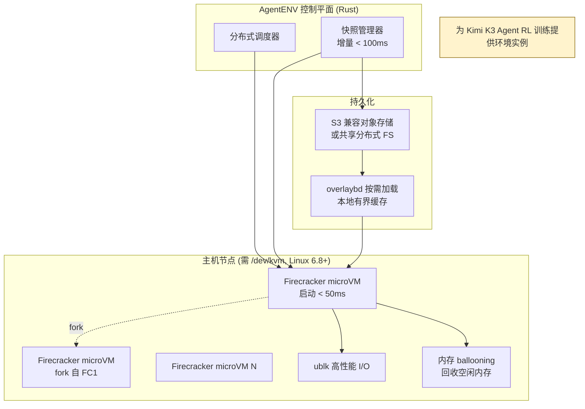

# kvcache-ai/AgentENV

## 一句话定位
Rust 实现的分布式 Agent 环境平台——用 Firecracker 微虚拟机大规模运行 Agent 训练/运行环境，支持快照 fork、50ms 恢复、增量快照，**为 Kimi K3 的 Agent RL 训练提供底层基础设施**。

## 它解决的问题
目标用户是做 Agent RL 训练 / 大规模 Agent 部署的团队。痛点是：训练 Agent 需要海量、可快速创建/销毁/分叉的隔离环境实例，传统容器启动慢、快照重、密度低；RL 训练时环境实例的生命周期管理（创建、暂停、恢复、fork、迁移）成为瓶颈。

AgentENV 把 Firecracker microVM + 快照语义 + 分布式调度做成平台，让「环境实例」成为可弹性伸缩的一等公民。

## 为什么值得关注（2026-07-29）
- 明确声明** powering agentic RL training for Kimi K3**（Moonshot 的 Open Frontier Intelligence 模型）。这是头部实验室级 Agent 训练基础设施开源的标志性事件。
- 工程指标硬核：环境启动/恢复 < 50ms，暂停 < 100ms，增量快照（内存+文件系统）< 100ms 即使在重度磁盘修改下。
- Rust 实现 + Firecracker + overlaybd + ublk + 内存 ballooning——技术栈是当前 Agent 运行时基础设施的最前沿组合。

## 热度来源判断
热度来自**真实工程刚需**而非炒作。Agent RL 训练的环境管理是公认难题，开源一个已被 Kimi K3 验证过的方案具有高复现价值。Star 数（1.4K）相对克制，说明受众是基础设施从业者而非大众——这是高质量信号。Fork 126 也符合「少数团队认真想复现/改造」的分布。

## 关键技术亮点亮点
1. **Firecracker microVM + overlaybd 按需加载**：大规模运行 OCI 镜像，本地磁盘做有界缓存（热数据保留、冷数据驱逐），镜像可超磁盘容量，全集群启动快且无需预热每台主机。
2. **快照即资源语义**：环境启动/恢复 < 50ms，暂停 < 100ms。空闲环境快速释放 CPU/内存，新工作到来时恢复——让「idle 环境几乎免费」。
3. **原生 snapshot + fork**：增量快照内存和文件系统变更（< 100ms，即使重度磁盘修改）；运行中的环境可 fork 成多个独立沙箱用于并行 agent 工作流；快照持久化到 S3 兼容存储或共享分布式文件系统。
4. **高性能 I/O + 密度保持**：ublk 高性能 I/O，跨存储和内存快照数据共享主机页缓存；内存 ballooning 回收可回收 guest 内存，支撑高 overcommit，环境运行越久越分散仍保密度。

## 架构启发
核心启发是**「环境即快照、即 fork、即迁移」是 Agent RL 训练的正确抽象**。传统容器的「启动一个新实例」语义对 RL 太重；AgentENV 把环境做成**可暂停/恢复/分叉的快照对象**，让 RL 的「并行探索 N 条轨迹」「从检查点回滚重探索」变成低成本操作。这对架构师的启发是：**当你需要大规模、可分叉、可回滚的隔离执行单元时，microVM + 快照 > 容器 > 进程**。

## 定位判断
在 Agent 基础设施层定位为**基础设施候选**。它不解决应用问题，而是提供 Agent 大规模训练/运行所需的虚拟化层。开源 + Kimi K3 验证 = 复现门槛显著降低。是今日最具基础设施价值的项目。

## 风险 / 局限 / 泡沫点
1. **强依赖 `/dev/kvm` + Linux 6.8+**：只能在支持嵌套虚拟化的 Linux 主机上运行，云上需特定实例类型，本地开发机受限。
2. **当前无鉴权**：README 明确警告「AgentENV 目前不支持授权，不要暴露到公网」。生产化前必须前置鉴权代理。这是早期阶段信号。
3. **运维复杂度高**：Firecracker + overlaybd + ublk + 内存 ballooning + 分布式调度，运维门槛高于普通容器编排。
4. **受众窄**：只有做 Agent RL 训练 / 大规模 Agent 部署的团队才需要，通用性低于容器编排——这既是护城河也是天花板。

## 与同类项目的关系
- **vs E2B / CubeSandbox**：同为 Agent 沙箱/环境方案。E2B 偏托管云沙箱，CubeSandbox（腾讯，Rust/KVM）偏安全隔离；AgentENV 聚焦**RL 训练场景的快照/fork/恢复语义**，定位更底层、更偏训练基础设施。
- **vs Kubernetes**：K8s 管理容器生命周期；AgentENV 管理 microVM 的快照/fork/恢复——两者层次不同，AgentENV 更接近「为 Agent 定制的虚拟化层」。
- **与 Kimi K3 的关系**：AgentENV 是 Kimi K3 Agent RL 训练的底座，两者构成「模型 + 训练基础设施」的开源组合。

## 是否值得持续跟踪
**是，深度跟踪。** 对做 Agent 平台/训练基础设施的团队有直接参考价值。即使不直接采用，其快照/fork/恢复的设计思想值得吸收。

## 后续观察点
1. 鉴权与多租户支持何时加入（当前明确缺失，是生产化的硬阻塞）。
2. 非 RL 场景的适用性——能否用于在线 Agent 服务的弹性扩缩容（而不仅是训练）。
3. 与主流 K8s 生态的集成路径（作为 K8s 之下的虚拟化层，还是独立编排）。

---
*首次记录：2026-07-29* · *数据来源: GitHub Search API (gh CLI) + README*
