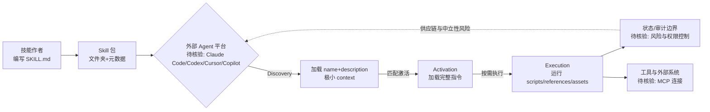

# Agent Skills 规范

## 一句话定位
Anthropic 发起的开放标准——定义 AI Agent 技能包的格式规范（SKILL.md），让 Agent 能力实现"一次编写，跨产品复用"。

## 它解决的问题
Agent 生态的碎片化问题：每个 Agent 平台（Claude Code/Codex/Cursor/Copilot）各有自己的扩展机制，技能不可移植。开发者为每个平台重复编写相同的能力定义。

## 为什么值得关注（2026-07-02）
同一天 GitHub Trending 同时出现 nvidia/skills、microsoft/skills、google/agents-cli、vercel-labs/skills（24.8K⭐），全部基于或兼容 Agent Skills 格式。这是事实标准形成的信号。

## 热度来源判断
生态驱动。不是单个项目的热度，而是整个行业的标准化趋势。Anthropic 发起+多巨头采纳，网络效应已经启动。

## 关键技术亮点亮点
1. **极简格式**——一个 Skill = 一个文件夹 + SKILL.md（元数据+指令），无复杂依赖
2. **三阶段渐进加载**——Discovery（名称+描述）→ Activation（完整指令）→ Execution（执行+脚本），精巧的 context 管理设计
3. **Progressive Disclosure**——只在需要时加载完整指令，大量 skills 可共存而 context 开销极小
4. **可组合**——scripts/references/assets 等可选目录，从纯指令到含代码的完整工作流
5. **跨平台设计**——规范本身不绑定任何 Agent 平台

## 架构师速览

| 决策问题 | 研究判断 | 证据边界 |
|---|---|---|
| 系统边界 | 该项目（agentskills/agentskills）是 SKILL.md 格式规范的说明文档（Markdown），本身不实现编排运行时，落地需依赖 Claude Code/Codex/Cursor/Copilot 等外部 Agent 平台 | 仅基于档案中"语言: Markdown"、"Anthropic 发起的开放标准"与"跨平台设计，不绑定任何 Agent 平台"的事实；具体 SDK/运行时组件待源码核验 |
| 主路径 | 技能编写（文件夹+SKILL.md）→ 三阶段渐进加载（Discovery→Activation→Execution）→ Agent 平台加载并按需执行 scripts/references/assets | 路径完全取自档案"关键技术亮点"与"架构启发"两节；具体触发匹配机制与 token 预算未在档案中给出 |
| 关键权衡 | 扩展速度（极简格式、低门槛） vs. 安全供应链（恶意脚本风险）、质量参差（低门槛）、中立性（Anthropic 主导，可能产生不兼容私有扩展） | 权衡项均直接引自档案"风险/局限"节；各厂商实际扩展差异未在档案中具名披露 |
| 最小 PoC | 单一渠道（如 Claude Code）+ 最小工具权限 + 可审计日志的环境下，编写一个纯指令型 Skill（仅 SKILL.md，无 scripts），验证 Discovery 加载与指令注入 | PoC 设计来自档案"架构师速览-采用建议"；实际可验证的运行时行为、context 占用与权限模型均"待核验" |

## 架构启发
三阶段渐进加载是 Agent context 管理的优秀设计模式。Agent 的根本约束是 context window——不可能把所有能力都塞进去。Skills 的 Discovery 阶段只加载 name+description（几百 token），匹配后才加载完整指令（几千 token），执行时才运行脚本。这种"懒加载"模式值得所有 Agent 架构借鉴。

## 架构图（MMD）

> 证据边界：此图只采用本档案已有可核验描述；“待核验”节点不应视为项目实现事实。

## 定位判断
基础设施候选。如果 Agent 生态类比 Web 生态，Skills 规范就是 Agent 的 npm/pip——能力分发的标准层。

## 风险 / 局限 / 泡沫点
1. **规范碎片化**——每家巨头虽然采纳格式，但可能扩展不兼容的私有特性
2. **Anthropic 主导**——虽然是开放标准，但 Anthropic 是主要推动者，中立性待验证
3. **安全风险**——第三方 Skills 可能包含恶意脚本，供应链安全问题
4. **质量参差不齐**——低门槛意味着大量低质量 Skills 涌入

## 与同类项目的关系
- **MCP（Model Context Protocol）** — 互补：MCP 定义 Agent 与外部工具的连接，Skills 定义 Agent 的知识和工作流
- **LSP（Language Server Protocol）**—— 类比：LSP 标准化了编辑器与语言服务器，Skills 标准化 Agent 与能力包
- **obra/superpowers** — 超集：基于 Skills 格式但升级为完整开发方法论

## 是否值得持续跟踪
是。这是 Agent 生态标准化的重要信号，可能定义未来数年 Agent 能力分发的基本范式。

## 后续观察点
1. 是否出现 Skills 注册中心/市场（类似 npm registry）
2. 非 Anthropic 系 Agent（如 Google Gemini、AWS Bedrock）是否采纳
3. 是否出现 Skills 安全扫描/签名机制
4. 社区贡献的 Skills 数量增长趋势

---
*首次记录：2026-07-02*
