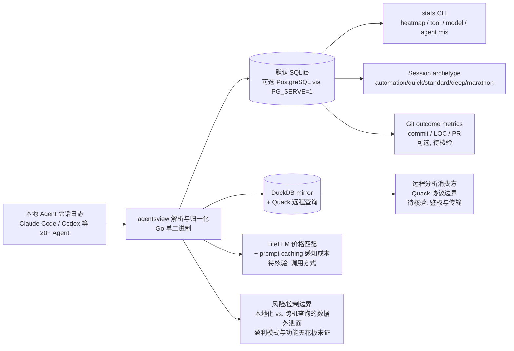

## 2026-06-20 更新

stars 从 1,592 到 2,935（周增 1,382，接近翻倍）。新增：
- LiteLLM 价格匹配 + prompt caching 感知成本计算
- PostgreSQL 后端支持（PG_SERVE=1）
- DuckDB mirror + Quack 协议远程查询
- Session archetype 分类（automation/quick/standard/deep/marathon）
- stats 命令含 heatmap、tool/model/agent mix
- 可选 Git outcome metrics（commit/LOC/PR）

---

# agentsview

## 一句话定位
Coding Agent 的本地会话分析与用量统计工具，支持 Claude Code、Codex 等 20+ Agent，号称 ccusage 的 100x 替代。

## 它解决的问题
开发者使用多个 Coding Agent 后，缺乏统一的会话回溯和用量分析工具。看不到每个 Agent 的 token 消耗、会话质量、任务完成率等关键指标。agentsview 提供本地化的 Agent 会话智能分析。

## 为什么值得关注（2026-06-12）
日增 98 stars，总量 1,592。虽然 star 数不高，但切入了一个真实且被忽视的需求——Coding Agent 的可观测性和成本管理。随着 Agent 使用量增长，这个需求会越来越强。

## 热度来源判断
**小众但真实。** 1.6K stars 不是爆发式增长，但用户群体精准——重度 Agent 用户。作为 ccusage 的替代品切入，定位清晰。

## 关键技术亮点亮点
1. **20+ Agent 支持：** 不仅支持 Claude Code，还支持 Codex、OpenCode 等 20+ Agent
2. **Local-first：** 数据完全本地化，不依赖云服务
3. **会话智能分析：** 不只是统计 token，还分析会话质量
4. **Go 实现：** 编译为单二进制，零依赖部署

## 架构师速览

| 决策问题 | 研究判断 | 证据边界 |
|---|---|---|
| 系统边界 | agentsview 是本地化会话分析/可观测层，读取 Claude Code、Codex 等 20+ Agent 的本地会话数据，输出统计与图表，不调度 Agent 也不介入模型调用 | 档案明确"Local-first"、Go 单二进制、标签含 session-intelligence/ccusage 替代；2026-06-20 更新提到 LiteLLM 价格匹配、PG_SERVE=1、DuckDB mirror、Quack 协议、Git outcome metrics，未给出源码细节 |
| 主路径 | 解析本地 Agent 会话日志 → 归一化为统一 schema → 落盘到默认 SQLite（可选 PG/DuckDB） → 计算 token/成本/archetype/heatmap → CLI stats 查询 | 更新明确列出 DuckDB mirror + Quack 远程查询、PG_SERVE=1、stats 含 heatmap/tool/model/agent mix；具体协议细节、是否 server-sent、是否嵌入式 HTTP 未在档案确认 |
| 关键权衡 | 单二进制零依赖的部署简洁性 vs. PG/DuckDB 后端的扩展性；本地隐私优势 vs. 跨机协作(Quack)需要的数据外泄面；功能广度(20+ Agent) vs. 单 Agent 深度 | 档案列出"零依赖部署"、"本地化处理"为优势与 Quack 协议并存；star 2,935、生产案例、SLO、计费模型未披露 |
| 最小 PoC | 在 macOS/Linux 单机导入一个 Claude Code 会话目录，启用默认 SQLite 后端，跑 `stats` 验证 heatmap、archetype、token/cost 统计；再以 PG_SERVE=1 切换 PostgreSQL 验证多机可查询路径 | 上述命令/路径名取自档案"stats 命令含 heatmap、tool/model/agent mix"与"PG_SERVE=1"；CLI 子命令全名、配置项、schema 迁移方式属待核验 |

## 架构启发
Coding Agent 的可观测性是 Agent 工具链中被低估的方向。类似于：
- APM 对 Web 应用的价值 → 会话分析对 Agent 的价值
- Datadog/New Relic → agentsview 之于 Agent

Local-first 设计值得关注——Agent 会话数据可能包含敏感代码，本地化处理是正确选择。

## 架构图（MMD）

> 证据边界：此图只采用本档案已有可核验描述；“待核验”节点不应视为项目实现事实。

## 定位判断
Coding Agent 工具链中的"可观测性"组件。目前是小工具，但如果扩展到 Agent 性能优化领域，价值会显著提升。

## 风险 / 局限 / 泡沫点
1. **市场规模有限：** 只有重度 Agent 用户才会付费
2. **Agent 平台内置分析：** Claude Code 等可能内置类似功能
3. **功能天花板：** 本地分析的深度受限于本地数据
4. **盈利模式不明：** 开源免费工具的可持续性存疑

## 与同类项目的关系
- **vs. ccusage：** ccusage 只做 Claude Code 用量统计，agentsview 覆盖 20+ Agent 且功能更丰富
- **vs. LangSmith：** LangSmith 做 LLM 应用全链路可观测，agentsview 聚焦 Coding Agent 会话分析

## 是否值得持续跟踪
**观察。** 方向正确但 star 数偏低，需要观察增长趋势和功能迭代速度。

## 后续观察点
1. 是否扩展到 Agent 性能优化建议（不只是分析）
2. 月度 star 增速是否加速
3. 是否被 Agent 平台收购或集成

---
*首次记录：2026-06-12*
