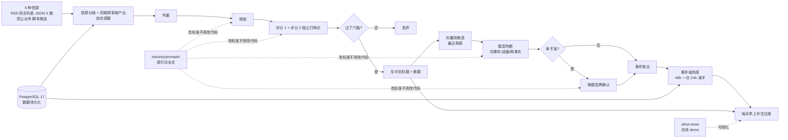

# KKKKhazix/AIHOT

## 一句话定位
自托管 AI 热点网站完整框架——把「每天信源→预筛→两次评分→聚簇→中文日报」完整流水线做成可改信源、可改精选标准、可改提示词的 self-hosted 框架（Node.js 24 + PostgreSQL 17 + Docker Compose + MIT + 18 个公开海外 AI 信源示例 + 事件级热度 48h/24h 减半 + 页面中位 10ms + aihot.news 在线 demo）。

## 它解决的问题
中文 AI / 行业热点站赛道的痛点是 **「绝大多数 AI 行业热点站都是 SaaS + 数据不透明 + 不能改信源 + 不能改精选标准 + 商用边界不清 + 中文日报覆盖不足 + 没有完整流水线文档 + 速度承诺含糊」**。AIHOT 直击这一痛点：把「每天信源→预筛→两次评分→聚簇→日报」完整流水线做成可改信源、可改精选标准的 self-hosted 框架，6 种信源（RSS / 网页列表 / JSON 接口 / X 账号 / 微信公众号 / 脚本推送）+ 信源分级（官方一手 / 媒体个人）+ 抓取频率按产出自动调整 + 提示词全文在 industry/prompts/ + 改标准不用改代码 + 18 个公开海外 AI 信源示例 + 事件级热度（48h 每个独立来源只算一次，24h 减半）+ 页面中位 10ms / 95% 50ms 内 + 中文日报 + aihot.news 在线 demo + MIT 商用清晰。解决的是 **「自托管 + 数据透明 + 改精选标准 + 严肃工程化 + 中文日报 + 高速 + 商用清晰」** 的中文热点站生态割裂问题。

## 为什么值得关注（2026-09-30）
- **Stars:** 3008（截至 2026-09-30），2 天 3008⭐，fork 861，fork/star 28.6%
- **Forks:** 861（典型高 fork 自托管严肃工程化持续关注信号）
- **License:** MIT（明确许可，商用清晰）
- **语言:** TypeScript
- **活跃度:** created 2026-09-28，pushed_at 2026-09-29，持续高活跃
- **规模:** 8494 KB（中等规模 Node.js + PostgreSQL 应用）
- **Topics:** 6 个（ai / llm / mcp / news-aggregator / rss / self-hosted），定位清晰
- **首页:** aihot.news（在线 demo 可直接体验）

## 热度来源判断
AIHOT 的热度是 **「自托管热点站刚需 × 中文日报覆盖 × 可改精选标准 × Docker Compose 一键起 × 严肃工程化 × MIT × 在线 demo」** 的强劲组合。中文 AI 行业热点站赛道 2026 年高热，但绝大多数是 SaaS + 数据不透明 + 不能改精选标准 + 商用边界不清——一个「自托管 + 可改信源 + 可改精选标准 + 完整流水线文档 + 严肃工程化 + MIT + 中文日报 + 高速 + 商用清晰」的 self-hosted 框架直击痛点。3008 stars + 861 forks + fork/star 28.6% 反映社区高度参与——这正是「自托管热点站」类项目的典型特征（用户 fork 部署 + 自定义信源 + 自定义精选标准）。2 天 3008⭐ 反映 GitHub Trending 自托管严肃工程化持续关注信号。热度**真实且具自托管严肃工程化潜力**——但需警惕：自托管热点站的「真实信源名单 + 运营数据」透明度（README 明示「里面没有 AIHOT 的信源名单和运营数据」）+ 商业运营热点站需要自己积累行业 know-how + KOL 背书（设计师出身 + AI 协作代码）+ 在线 demo aihot.news 维持热度，但长期价值取决于「中文日报持续性 + 信源持续更新 + 评分门槛准确性 + 聚簇准确性 + 事件级热度公平性 + 页面中位 10ms 速度承诺」。

## 关键技术亮点
1. **自托管 + Docker Compose 一键起：** 把热点站从「SaaS + 数据不透明 + 不能改精选标准」推到「自托管 + 数据透明 + 改标准不用改代码 + 18 信源示例 + 提示词全文」形态
2. **6 种信源 + 信源分级 + 抓取频率按产出自动调整：** RSS / 网页列表 / JSON 接口 / X 账号 / 微信公众号 / 脚本推送 + 信源分级（官方一手 / 媒体个人）+ 抓取频率按产出自动调整
3. **预筛 + 两次评分 + 过了门槛进精选：** 一份资料独立打两次分，过了门槛才进精选——把「人工筛选」推到「预筛 + 同份评两次分 + 门槛」形态
4. **聚簇：向量 + 模型判断 + 拿不准换模型再确认：** 同一件事的多个报道聚成一个事件；先向量找候选，再模型判断同事件/进展/两事件；拿不准的合并，换一家模型再确认一遍
5. **事件级热度（48h 一次 + 24h 减半）：** 按事件算，不按文章算；48h 每个独立来源只算一次，24h 减半；重复抓取不会多算，一家媒体发十篇也只算一次
6. **改标准不用改代码：** 每一步的提示词都在 industry/prompts/，改标准不用改代码，docs/selection.md 精选与校准
7. **页面中位 10ms / 95% 50ms 内 / 接口中位 6ms / 95% 12ms 内 / 文章页 95% 14ms 内：** 速度公开承诺——是「严肃工程化速度承诺」形态
8. **MIT 商用清晰：** 明确许可，商用边界清晰

## 架构师速览

| 决策问题 | 研究判断 | 证据边界 |
|---|---|---|
| 系统边界 | 自托管 AI 热点网站完整框架——前端展示 + 后台采集 + 流水线编排 + 聚簇算法 + 事件级热度 + 中文日报一体的 Docker Compose 应用 | 仅基于 README 公开描述的 6 信源 + 信源分级 + 预筛 + 两次评分 + 聚簇 + 事件级热度 + 中文日报 + 改标准不用改代码；具体前后端拆分、PostgreSQL schema、聚簇模型选型未在档案中给出 |
| 主路径 | 6 种信源采集 → 判重 → 预筛 → 同份评两次分 → 过了门槛进精选 → 中文标题摘要 → 向量聚簇 + 模型判断同事件/进展/两事件 → 拿不准换模型再确认 → 事件级热度 → 中文日报 | 主路径为 README 语义抽象；具体抓取频率算法、评分门槛细节、聚簇向量库未在档案中给出 |
| 关键权衡 | 自托管透明度 + 改精选标准灵活性 vs 自部署门槛 + 信源运营门槛 vs 事件级热度公平性 vs 商用清晰 vs 严肃工程化速度承诺 | 档案明示自托管 + 改标准 vs 自部署门槛；事件级热度 + 速度公开承诺 vs 工程化深度未在档案中给出 |
| 最小 PoC | Docker Compose 一键起站（Docker Compose 已配置）+ 接入 1 个 RSS 信源 + 验证一次端到端聚簇 + 验证中文日报输出 + 验证事件级热度 | PoC 范围由 README 「跑起来」+ 18 信源示例 + 改标准不用改代码推导；具体 RSS 信源选择、中文日报格式、聚簇验证标准待核验 |
| 证据边界 | stars / forks / topics / license / size / created_at / pushed_at / language / description 来自 GitHub API 公开元数据；架构细节 / schema / 聚簇算法 / 评分门槛 / 向量库选型均待核验 | GitHub API 元数据可信；架构细节未在 README 中给出 |

## 架构启发
AIHOT 的核心启发是 **「热点站应该自托管、可改精选标准、可改信源，正如代码库跨 runtime」**。当前中文 AI 行业热点站多是 SaaS + 数据不透明 + 不能改精选标准——这违背中文热点站运营者利益——没人想把热点站数据交给不可控的第三方 + 没人想为不能改精选标准的热点站付费。AIHOT 尝试做「热点站的自托管严肃工程化标准层」，类似 Git 自托管之于代码托管。更深层的启发是：**自托管类项目的价值在于「数据透明 + 改标准灵活性 + 严肃工程化 + 商用清晰」而非 SaaS 体验**。3008 stars + 861 forks 的结构，说明它已初步形成自托管严肃工程化飞轮。能否持续，取决于「自托管门槛降低 + 信源持续更新 + 评分门槛准确性 + 聚簇准确性 + 事件级热度公平性 + 页面中位 10ms 速度承诺 + 中文日报持续性 + 商用清晰边界」。

## 架构图（MMD）

> 证据边界：此图只采用本档案已有可核验描述；"待核验"节点不应视为项目实现事实。

## 定位判断
**平台候选型项目（自托管 AI 热点网站框架）。** KKKKhazix/AIHOT 不仅是热点站，更试图成为「自托管 AI 热点网站的严肃工程化框架」——类似 Git 自托管之于代码托管。若成功，它会成为中文 / 行业热点站运营者的默认入口，具有平台级价值。3008 stars + 861 forks + fork/star 28.6% 已显示自托管严肃工程化飞轮雏形。但「平台化」取决于一个关键问题：自托管门槛能否持续降低——若 Docker Compose + 改信源 + 改精选标准的门槛持续保持（README 明示「这是一份快照 / 来自 AIHOT 正在线上跑的代码，不是精心打磨的通用框架 / 以后 AIHOT 的更新，我会尽量同步过来，但没法保证每一次都同步」），项目生命力可能受限。目前定位是「最有影响力的自托管 AI 热点网站框架」，向平台演进是合理路径。

## 风险 / 局限 / 泡沫点
- **自托管门槛：** README 明示「这是一份快照。它来自 AIHOT 正在线上跑的代码，不是精心打磨的通用框架。以后 AIHOT 的更新，我会尽量同步过来，但没法保证每一次都同步」——自部署门槛需用户自行核验
- **真实信源名单 + 运营数据透明度：** README 明示「里面没有 AIHOT 的信源名单和运营数据。仓库带了 18 个公开的海外 AI 资讯源做示范」——商业运营热点站需要自己积累行业 know-how
- **设计师出身 + AI 协作代码：** README 明示「我不是专业的开发者。我是设计师出身，半年前还看不太懂代码。这套代码是我和 AI 一起重写的，比以前干净了很多，但一定还有写得不好的地方」——代码质量 / 长期维护深度需用户自行核验
- **AIHOT 名字 + Logo：** README 明示「请不要用 AIHOT 的名字和 Logo。换成你自己的名字，它就是你的站」——品牌边界清晰
- **聚簇准确性 + 事件级热度公平性：** 重复抓取不会多算，一家媒体发十篇也只算一次——热度公平性需用户自行验证
- **商用边界：** MIT 商用清晰，但 README 明示「请不要用 AIHOT 的名字和 Logo」——品牌边界与代码许可边界需区分
- **topics 0 个（README 未明示 topics）：** 实际有 topics 6 个（ai / llm / mcp / news-aggregator / rss / self-hosted）——README 描述密度低于 projects 标准
- **KOL 背书依赖：** 在线 demo aihot.news 维持热度——若 demo 停服，热度可能受冲击

## 与同类项目的关系
- **vs Hacker News / Product Hunt：** 中心化 + 不能改信源 + 不能改精选标准；AIHOT 是自托管 + 可改信源 + 可改精选标准
- **vs 各 AI 资讯 SaaS：** SaaS + 数据不透明；AIHOT 是自托管 + 数据透明 + 改标准不用改代码
- **vs RSS 阅读器（Feedly / Inoreader）：** 仅 RSS；AIHOT 是 6 种信源 + 信源分级 + 聚簇 + 中文日报 + 评分门槛
- **vs awesome-selfhosted：** 资源索引；AIHOT 是可直接部署的自托管热点站框架
- **vs 各 AI 资讯 newsletter：** 中心化 + 单语；AIHOT 是自托管 + 双语 + 可改信源 + 可改精选标准

## 是否值得持续跟踪
**值得跟踪（自托管 AI 热点网站严肃工程化）。** KKKKhazix/AIHOT 代表了自托管 AI 热点网站严肃工程化的诉求，无论其本身成败，这一方向是行业趋势。建议关注：自托管门槛降低（Docker Compose 一键起 + 改信源 + 改精选标准）、中文日报持续性、信源持续更新、评分门槛准确性、聚簇准确性、事件级热度公平性、页面中位 10ms 速度承诺、商用清晰边界。对中文热点站 / 行业资讯站运营者，这个框架是获取自托管严肃工程化 + 可改信源 + 可改精选标准 + 中文日报 + 高速 + 商用清晰的实用来源，值得直接采用。对中文热点站生态观察者，它是「自托管热点站」赛道的头部样本。

## 后续观察点
- 是否演化为独立 SaaS（从自托管框架升级为 SaaS）
- 改信源 + 改精选标准的稳定性（README 明示「这是一份快照，不是精心打磨的通用框架」）
- 评分门槛 + 聚簇准确性的方法论（README 明示每一步的提示词都在 industry/prompts/）
- 中文日报持续性 + 信源持续更新承诺
- 页面中位 10ms 速度承诺的稳定性
- MIT 商用清晰的边界（README 明示「请不要用 AIHOT 的名字和 Logo」）
- KOL 背书（设计师出身 + AI 协作代码 + aihot.news 在线 demo）

---
> 数据来源: GitHub API (2026-09-30) | Stars: 3008 | Forks: 861 | License: MIT | 语言: TypeScript | 创建: 2026-09-28 | 在线 demo: aihot.news | Topics: 6 个
