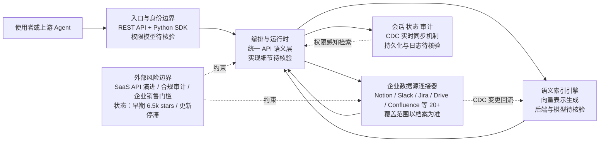

# airweave-ai/airweave

## 一句话定位
面向 AI Agent 的开源上下文检索层（context retrieval layer）——将企业分散的数据源（Notion、Slack、Jira、Google Drive 等）统一接入，为 Agent 提供实时、语义化的上下文供给。

## 它解决的问题
AI Agent 在企业场景中的最大瓶颈不是模型能力，而是"不知道该知道什么"——企业知识分散在几十个 SaaS 工具和内部系统中，Agent 无法实时获取决策所需的上下文。传统 RAG 只能检索文档库，但企业真正的工作上下文在项目管理工具、通讯记录、CRM 中。Airweave 解决的是"Agent 的企业数据接入层"问题：通过统一的数据连接器框架，将异构数据源实时同步、语义索引，并通过单一 API 为 Agent 提供上下文查询。

## 为什么值得关注
- **定位精准:** RAG → Agent Context 的演进是 2026 年的核心趋势
- **6,541 stars:** 增长稳健，说明市场痛点真实存在
- **MIT 许可证:** 纯开源，利于社区采纳和企业采用
- **企业级数据连接器:** 覆盖 Notion、Slack、Jira、Drive、Confluence 等主流工具
- **Agent 基础设施卡位:** 处于 Agent 技术栈的"数据层"关键位置

## 热度来源判断
热度来自企业 AI Agent 部署浪潮的推动。2025-2026 年企业开始大规模尝试 AI Agent，但发现数据接入是最大障碍。Airweave 精准切中了这个痛点，在 Hacker News、AI 工程师社区中获得关注。与 Glean（企业搜索独角兽）的对比叙事也推动了讨论热度。

## 关键技术亮点亮点
- 统一数据连接器框架：支持 20+ 企业数据源的开箱即用连接
- 语义索引引擎：自动将结构化和非结构化数据转化为向量表示
- 实时同步：变更数据捕获（CDC）机制，保持 Agent 上下文新鲜度
- 权限感知检索：尊重源系统的访问控制，确保 Agent 只看到授权数据
- Python SDK + REST API：灵活集成到任何 Agent 框架

## 架构师速览

| 决策问题 | 研究判断 | 证据边界 |
|---|---|---|
| 系统边界 | Airweave 定位为 Agent 与企业 SaaS 数据源之间的上下文检索层，封装 20+ 连接器并以单一 API 暴露 | 仅档案描述的“统一数据连接器框架”与语义索引表述，无源码级组件清单，协议与部署形态待核验 |
| 主路径 | 数据源 → 连接器 → 语义索引 → 权限过滤 → Agent 查询 API；变更通过 CDC 机制回流索引 | “实时同步 CDC”与“权限感知检索”出自档案综述，CDC 实现细节、索引后端、查询接口契约均待核验 |
| 关键权衡 | 连接器覆盖广度（20+ SaaS）vs 各源 API 演进导致的维护负担及权限/合规复杂度 | 维护成本、竞争压力为档案推断；性能、SLO、安全模型未在档案中给出证据 |
| 最小 PoC | 选 1 个高频 SaaS（如 Notion）+ 1 个低权限账号，跑通同步→语义索引→Agent 查询，记录权限边界与变更延迟 | 档案未给出 PoC 模板与基准；连接器成熟度、合规要求、退出路径均待核验 |

## 架构启发
Airweave 代表了 RAG 架构的演进方向：从"文档检索"到"上下文编排"。对架构师的启发是：**Agent 的价值不取决于模型有多强，而取决于它能否获取正确的上下文**。企业 AI 的核心架构挑战不是模型部署，而是数据管道——Airweave 将这个复杂度封装为一层基础设施。

## 架构图（MMD）

> 证据边界：此图只采用本档案已有可核验描述；“待核验”节点不应视为项目实现事实。

## 定位判断
**平台候选（早期）。** 处于 Agent 基础设施栈的数据层，如果成功将成为企业 Agent 的"数据总线"。但目前仍处于早期阶段（6.5k stars），需要验证企业级采用和商业化能力。定位为"开源版 Glean for Agents"。

## 风险/局限/泡沫点
- **连接器维护成本高:** 每个 SaaS 的 API 都在变化，20+ 连接器的维护负担巨大
- **竞争激烈:** Glean（商业）、LlamaIndex（开源）、CrewAI（Agent 框架内置）都在抢这个赛道
- **企业销售门槛:** 企业数据接入涉及安全审计、合规审批，开源项目切入困难
- **6.5k stars 偏低:** 相比 Agent 框架动辄 10 万+，说明市场认知度仍有限
- **更新停滞:** pushed_at 停留在 2026-06-05，活跃度需要关注

## 与同类项目的关系
- 与 **Glean**（企业搜索独角兽）是"开源 vs 商业"的直接对标
- 与 **LlamaIndex** 在 RAG 数据层维度竞争——LlamaIndex 更通用，Airweave 更聚焦 Agent 上下文
- 与 **n8n** 互补——n8n 编排工作流，Airweave 提供数据上下文
- 与 **LangChain** 在数据加载维度有重叠，但 Airweave 聚焦"实时企业数据"
- 与 **Cohere Coral**、**Glean Assistant** 在企业 AI 搜索维度竞争

## 是否值得持续跟踪
**推荐跟踪。** 企业 Agent 数据接入是 2026-2027 年的关键赛道，Airweave 的开源定位有差异化优势。建议关注其企业连接器的增长和企业客户采用情况。

## 后续观察点
- 数据连接器的数量和质量增长
- 是否获得融资或企业客户背书
- 与主流 Agent 框架（LangChain、CrewAI）的集成深度
- 安全和合规认证（SOC2、ISO27001）
- 项目活跃度是否恢复（6月后更新停滞值得关注）

---
> 数据来源: GitHub API (airweave-ai/airweave) | 星标: 6,541 | 语言: Python | 许可证: MIT
