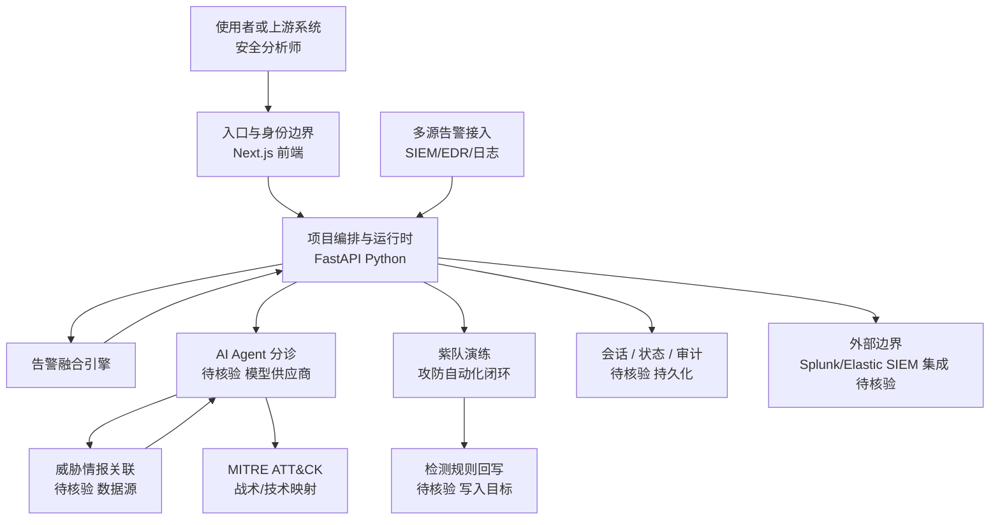

# AiSOC

## 一句话定位
开源 AI 驱动的安全运营中心（SOC），集成告警融合、紫队演练、Agent 辅助分诊和 MITRE ATT&CK 框架。

## 它解决的问题
传统 SOC 工具（Splunk、QRadar）价格昂贵且需要大量人工。安全团队面临告警疲劳、响应迟缓、人员不足等问题。AiSOC 用 AI Agent 自动化分诊和调查流程，降低安全运营的人力门槛。

## 为什么值得关注（2026-05-17）
- AI + 安全运营是确定性趋势，但大多数项目停留在检测层面
- AiSOC 覆盖了完整的 SOC 工作流：告警融合 → 分诊 → 调查 → 演练
- MIT 许可、可自部署，适合中小企业安全团队
- 代表安全赛道从"漏洞驱动"向"平台化"的演进方向

## 热度来源判断
- AI 安全是热门话题
- 开源 SOC 填补了中小企业的空白
- 技术栈现代（FastAPI + Next.js）吸引开发者
- 泡沫风险中等 — 实际 SOC 部署需要大量数据集成和调优

## 关键技术亮点亮点
1. **AI Agent 辅助分诊** — Agent 自动分析告警，关联威胁情报，生成分诊建议
2. **紫队演练** — 攻防一体化的自动化演练，验证检测规则有效性
3. **MITRE ATT&CK 框架深度集成** — 告警映射到 ATT&CK 战术和技术
4. **告警融合引擎** — 多源告警聚合，减少告警疲劳

## 架构师速览

| 决策问题 | 研究判断 | 证据边界 |
|---|---|---|
| 系统边界 | AiSOC 是覆盖"告警融合 → AI 分诊 → 紫队演练 → ATT&CK 映射"的 AI 编排层；前端 Next.js，后端 FastAPI（Python），MIT 许可可自部署 | 数据源/告警接入器、模型供应商、持久化层未在档案中给出 |
| 主路径 | 告警接入 → 融合引擎聚合 → Agent 分诊与威胁情报关联 → ATT&CK 战术/技术映射 → 紫队演练闭环回写检测规则 | 协议、消息队列、数据库选型与状态存储未在档案中说明 |
| 关键权衡 | SOC 效果 vs 数据质量/集成广度；AI 自动化深度 vs 可审计与合规可解释性；开源灵活 vs 与 Splunk/Elastic 等既有 SIEM 集成成熟度 | 性能基准、模型选型、合规认证均未披露 |
| 最小 PoC | 单源告警接入 + 单 ATT&CK 映射 + Agent 最小权限分诊 + 全审计日志；验收项：分诊准确率基线、与目标 SIEM 集成接口、成本与 SLO、回滚路径 | 项目生产案例、基准测试、与商业 SIEM 集成深度均待核验 |

## 架构启发
- 安全运营平台需要 AI Agent 作为"虚拟分析师"层
- 紫队演练自动化是安全验证的关键方向
- FastAPI + Next.js 的前后端分离架构适合安全工具的快速迭代

## 架构图（MMD）

> 证据边界：此图只采用本档案已有可核验描述；“待核验”节点不应视为项目实现事实。

## 定位判断
工具型产品，有潜力向平台型演进。目前适合中小企业安全团队使用，但与商业 SOC（Splunk SOAR）相比功能深度还有差距。

## 风险 / 局限 / 泡沫点
1. **SOC 效果高度依赖数据质量** — 缺乏足够训练数据时 AI 分诊准确率有限
2. **安全合规要求** — 不同行业的合规要求差异大，开源方案需要大量定制
3. **与现有 SIEM 集成有限** — 需要与 Splunk/Elastic 等已有工具链集成才能真正落地
4. **971 stars，项目较新** — 生产环境使用案例不足

## 与同类项目的关系
- vs **Splunk SOAR**：AiSOC 开源免费但功能深度不足
- vs **Shuffle SOAR**：同为开源 SOAR，AiSOC 更偏 AI 驱动
- vs **TheHive**：TheHive 偏事件响应，AiSOC 更偏 AI 分析

## 是否值得持续跟踪
**是。** AI 安全运营是一个确定性趋势，AiSOC 的架构方向正确。

## 后续观察点
1. 是否有真实安全团队在生产环境使用
2. AI 分诊的准确率是否有公开基准测试
3. 与主流 SIEM（Splunk/Elastic）的集成进展

---
*首次记录：2026-05-17*
