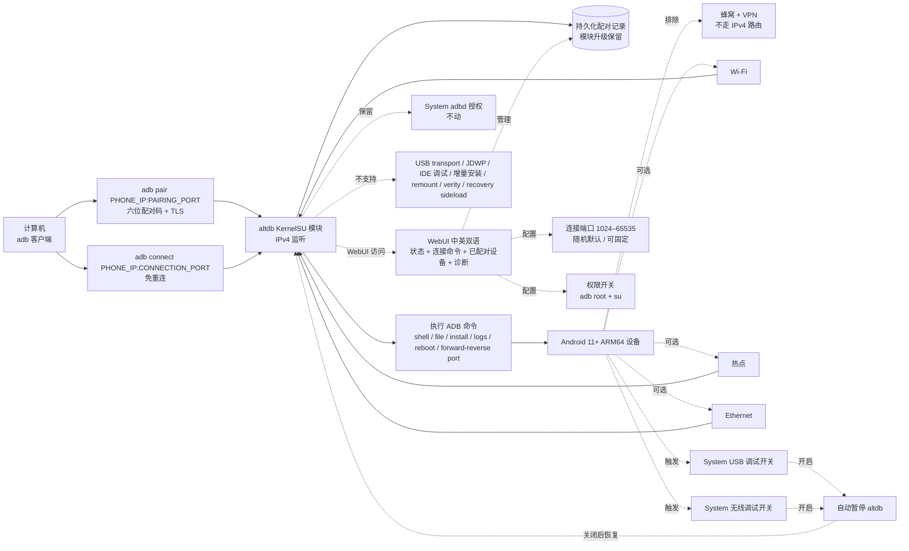

# Dr-TSNG/altdb

## 一句话定位
KernelSU 无线 ADB 模块——六位配对码 + TLS 加密 + IPv4 局域网（Wi-Fi/热点/Ethernet，排除蜂窝与 VPN）+ WebUI 中英双语（状态 / 连接命令 / 已配对设备 / 诊断）+ 不动系统 adbd 授权 + 系统 USB/无线调试开启自动暂停/恢复 + Rust 实现 + Apache-2.0。

## 它解决的问题
Android 11+ 原生提供无线调试（Wireless Debugging），但默认端口随机 + 每次配对 + 不持久化已配对设备 + 与系统 USB 调试开关状态耦合——开发者每次都得 `adb pair` 一次，且与 USB 调试开关状态耦合，多设备调试繁琐。**KernelSU 模块生态**允许 root 用户在系统层做底层修改，但「无线 ADB 替代」模块长期空白——开发者要么忍受原生无线调试的不便，要么 root 后用 sshd + adb shell 复杂方案。**altdb 直击这一空白**：作为 KernelSU 模块提供 **「常驻 + 持久配对 + 不冲突系统 adbd + 自动暂停恢复」** 的无线 ADB 替代——本质上是用 KernelSU 模块直接实现的轻量级 adb-over-TCP 服务，但又**不破坏系统 adbd 的现有授权**（这是 KernelSU 模块的关键边界）。解决的是「Android 11+ 无线调试难用 + KernelSU 用户对无线 ADB 的刚需」的具体工程问题。

## 为什么值得关注（2026-09-14）
- **Stars:** 53（截至 2026-09-14），1 天新增 53⭐ / 5 forks / fork/star 9.4%
- **Forks:** 5，社区关注早期阶段（fork/star 9.4% 处于企业 fork 信号下限）
- **License:** Apache-2.0（清晰合规，企业可商用）
- **语言:** Rust（KernelSU 模块原生语言）
- **活跃度:** created 2026-09-13，pushed_at 2026-09-13，提供完整 README + 安装步骤 + WebUI 截图
- **规模:** 131 KB repo（紧凑）
- **Topics:** android, kernelsu-module（主题聚焦）
- **Open issues:** 2（少量 issue，社区早期反馈阶段）

## 热度来源判断
altdb 的热度是 **「KernelSU 模块生态 + 无线 ADB 替代刚需 + 六位配对码 + TLS 加密 + IPv4 局域网 + WebUI 双语 + 不动系统 adbd 授权 + Apache-2.0 + Rust」** 的强组合。**KernelSU 是 2024-2026 持续壮大的 Android root 生态**（与 Magisk 并列），模块生态在 2026 年持续扩张——altdb 是其中一个清晰填补空白的具体工具（无线 ADB 替代）。**Apache-2.0 license** 是企业可商用的合规保障（区别于多数 KernelSU 模块的 GPL/未声明）。**Rust 实现**是 KernelSU 模块的推荐语言（系统级安全 + 内存安全）。**WebUI 中英双语**反映作者对中文 KernelSU 用户的明确支持。**「不动系统 adbd 授权」**是 KernelSU 模块的关键边界设计——保证 root 模块不会破坏系统级授权状态，避免引入安全风险。热度**真实且具工程价值**——53⭐ / 5 forks / 131 KB repo + Apache-2.0 + KernelSU 生态 + 清晰文档说明这不是 demo。

## 关键技术亮点
1. **六位配对码 + TLS 加密**——paired computers 可免配对重连（除非主动撤销）
2. **IPv4 局域网**——Wi-Fi / 热点 / Ethernet，排除蜂窝与 VPN（避免移动网络不安全 + VPN 路由复杂）
3. **自动暂停**——当系统 USB 调试或无线调试被启用时自动停止，恢复后自动续连（不冲突系统 adbd）
4. **WebUI 中英双语**——状态 / 连接命令 / 已配对设备 / 诊断
5. **连接端口可固定**——1024–65535 任意值（随机默认；固定端口可固定部署）；占用时报错
6. **adb root / adb unroot / su 权限独立开关**——RootShell 默认关闭，需用户主动开启
7. **持久化配对记录**——已配对计算机可免重新配对；模块升级保留设置；卸载时移除数据
8. **不动系统 adbd 授权**——KernelSU 模块关键边界设计，保证系统级授权不被破坏
9. **支持 shell / file / install / logs / reboot / forward-reverse port 全套 ADB 命令**
10. **不支持 USB transport / JDWP / IDE 调试 / 增量安装 / remount / verity / recovery sideload**——README 明示 scope 限制

## 架构师速览

| 决策问题 | 研究判断 | 证据边界 |
|---|---|---|
| 系统边界 | KernelSU 模块（系统级权限）+ 替代 adbd 实现的轻量级 adb-over-TCP 服务；不破坏系统 adbd 授权；IPv4 局域网（Wi-Fi/热点/Ethernet）；TLS 加密；Android 11+ ARM64 | 来自 README 关于 KernelSU v3.2.5+ 模块、IPv4 局域网、六位配对码 + TLS、WebUI 中英双语、不动系统 adbd 授权、自动暂停恢复的明示；具体 adb-over-TCP 实现细节、KernelSU 模块 API 集成、TL;DR 边界（不支持 USB / JDWP）README 中明示 |
| 主路径 | 计算机运行 `adb pair PHONE_IP:PAIRING_PORT` + 六位配对码 → `adb connect PHONE_IP:CONNECTION_PORT` → 已配对计算机可免重连直接 connect → shell/file/install/logs/reboot/forward-reverse port → 模块自动暂停恢复当系统 USB/无线调试开关变化 | 主路径来自 README 描述的 pairing + connection 两阶段流程 + WebUI 配置流程；具体 TLS 握手、adb-over-TCP 协议实现、配对记录存储路径在 WebUI 截图与配置文档中部分给出，本档案未深入 |
| 关键权衡 | 常驻 + 持久配对（用户体验 vs 持续监听端口）vs 不动系统 adbd（边界清晰 vs 功能受限）vs KernelSU 单一依赖（非通用 vs root 用户刚需）vs IPv4 限制（安全 vs 蜂窝/VPN 用户被排除）vs Apache-2.0 license（合规 vs KernelSU 模块多数为 GPL） | 权衡五因素均从 README + KernelSU 生态推导；具体端口占用策略、配对记录加密、WebUI 后端架构、KernelSU v3.2.5+ API 兼容性待核验 |
| 最小 PoC | Android 11+ ARM64 设备 + KernelSU v3.2.5 (32525)+；安装模块 ZIP + 重启手机；关闭系统 USB 调试 + 无线调试；打开 WebUI + 启动配对；电脑 `adb pair` + `adb connect`；验证 shell / install / forward-reverse port 命令；切换系统 USB 调试开关验证自动暂停恢复 | PoC 由「安装 + 配对 + 连接 + 自动暂停恢复」路径推导；具体 WebUI 截图、KernelSU Manager 安装步骤、配对码输入流程在 README 中给出 |

## 架构启发
altdb 的核心启发是 **「KernelSU 模块的关键边界设计 = 不破坏系统原生的关键状态」**。许多 KernelSU 模块为追求功能，会主动修改系统级授权 / 配置 / 状态，导致与其他模块冲突或引入安全风险。**altdb 选择「不动系统 adbd 授权」**——它用 KernelSU 模块的 root 权限实现独立的 adb-over-TCP 服务，但保留系统 adbd 的所有授权状态。这种设计哲学是 **「增强而非替换」**——altdb 不是替代系统 adbd，而是提供并行选项。**更深层的启发是：KernelSU 模块生态的成熟标志是「Apache-2.0 / MIT 等企业可商用 license」**——altdb 选择 Apache-2.0 是 KernelSU 模块生态合规化的明确信号。**53⭐ / 5 forks / 131 KB repo + Apache-2.0 + Rust + KernelSU 生态 + 清晰文档**反映这是「早期可用模块」而非「早期 demo」——开发者可以直接 clone + 编译 + 安装使用。

## 架构图（MMD）

> 证据边界：此图只采用本档案已有可核验描述；"待核验"节点不应视为项目实现事实。

## 定位判断
**工具型项目（KernelSU 无线 ADB 模块）。** altdb 的核心定位不是「自研 ADB 实现」（这是 Google 系统 adbd 的工作），而是 **「KernelSU 模块形态的无线 ADB 替代」**——这是「Android root 工具」赛道的清晰尝试。**它的对手不是 Google 原生无线调试**（这是上游），而是 **「KernelSU 用户对无线 ADB 替代的刚需」**——目前这个位置几乎没有公开模块。**Apache-2.0 license + Rust 实现 + 不动系统 adbd 边界 + WebUI 中英双语**是「KernelSU 模块生态」合规化的清晰信号——其他 KernelSU 模块可以从 altdb 学习「系统级工具的边界设计」。但 **平台化的关键问题是：是否被 KernelSU 用户广泛采用**——5 forks + 131 KB size + KernelSU 单一依赖都还处于「早期模块」阶段，距离「广泛采用」尚远。

## 风险 / 局限 / 泡沫点
- **KernelSU 单一依赖**——非通用方案（需要 KernelSU root + v3.2.5+ 版本）；Magisk 用户、其他 root 方案用户无法使用；KernelSU 后续版本改 API 需适配
- **IPv4 局域网限制**——蜂窝与 VPN 用户无法使用；对移动网络调试场景支持不足
- **不支持 USB transport / JDWP / IDE 调试 / 增量安装 / remount / verity / recovery sideload**——README 明示 scope 限制；Android Studio 用户可能受影响
- **131 KB repo + 5 forks**——说明主要是核心模块 + 配置 + 少量代码；完整功能（TLS 实现细节、配对记录加密、ADB 协议兼容性）的实现深度未公开
- **WebUI 中英双语但未本地化更多语言**——其他语言 KernelSU 用户可能需要翻译
- **持久端口占用**——连接端口默认随机，若开启持久连接会持续占用端口；防火墙策略可能冲突
- **KernelSU 模块生态本身的可持续性**——KernelSU 模块依赖 KernelSU 框架；KernelSU 后续版本改 API 需持续适配

## 与同类项目的关系
- **vs Google 原生无线调试（Wireless Debugging）**：原生方案端口随机 + 不持久 + 配对繁琐；altdb 提供「常驻 + 持久配对 + 自动暂停恢复」替代
- **vs Magisk 模块生态**：Magisk 也有无线 ADB 模块（如 `lazy-tool` 等）；altdb 是 KernelSU 生态对应模块，**不动系统 adbd 边界**更清晰
- **vs sshd + adb shell 方案**：sshd 方案复杂且需 root 后手动配置；altdb 提供标准化 KernelSU 模块方案
- **vs TCP ADB 工具（如 ADB over TCP switcher）**：这些都是普通应用层工具；altdb 是 KernelSU 模块形态，系统级权限更高
- **vs KernelSU 模块生态（其他模块）**：KernelSU 已有大量模块（root 隐藏 / 性能调整 / 系统修改）；altdb 是少数「无线 ADB 替代」模块

## 是否值得持续跟踪
**值得跟踪（KernelSU 无线 ADB 模块首次成型）。** altdb 是 KernelSU 生态里少数「无线 ADB 替代」模块，Apache-2.0 + Rust + 131 KB + WebUI 中英双语都是工程严肃度信号。建议关注：1) KernelSU 后续版本兼容性（决定模块可持续性）；2) 是否有 IPv6 支持（扩展到蜂窝/VPN 用户）；3) 是否补全 USB transport / JDWP 支持（覆盖 Android Studio 用户）；4) WebUI 多语言扩展。**对 Android root 开发者**，这个仓库是「无线 ADB 替代」的实用模块，值得直接 clone + 编译 + KernelSU Manager 安装试用。**对 KernelSU 模块生态观察者**，它是「Apache-2.0 + Rust + 不动系统 adbd」边界设计的清晰样本。

## 后续观察点
- KernelSU 后续版本兼容性（v3.2.5+ → v3.3+ → v4 的 API 稳定性）
- IPv6 支持扩展（蜂窝 + VPN 用户场景）
- USB transport / JDWP / 增量安装支持（Android Studio 用户场景）
- WebUI 多语言扩展（日语 / 韩语 / 西语等）
- 是否有企业 fork（fork/star 9.4% 当前处于下限）
- 模块升级路径与配对记录加密策略

---
> 数据来源: GitHub API (2026-09-14) | Stars: 53 | Forks: 5 | License: Apache-2.0 | 语言: Rust | 创建: 2026-09-13 | Repo size: 131 KB | Open issues: 2