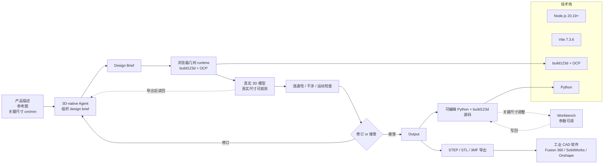

# amagine-ai/Amagine3D

## 一句话定位
**Amagine3D——硬件需求 → 可编辑 3D 设计**——`amagine.ai` 开源的 3D 能力层，专注 **parametric CAD**（参数化计算机辅助设计）+ 智能硬件外壳 / 多部件装配结构生成，输入"产品描述 + 参考图 + 关键尺寸"，输出完整 Python + build123d 源码（可调 + 可写回）+ STEP / STL / 3MF 导出文件。15 天 2,109⭐ / 90 forks / 5 open issues / Python 5.1MB / Apache-2.0。

## 它解决的问题
2026 下半年 AI 生成 3D 工具爆发，但绝大多数是"文生 3D 模型"——只能产出静态 mesh（顶点 + 面），**不可编辑、不可参数化、不可导出工业标准格式**。硬件开发者面对三个痛点：(1) **不可编辑**——AI 生成的模型无法调整尺寸 / 替换部件；(2) **格式封闭**——只支持 3D viewer 的 glTF / obj，不支持工业 STEP / STL / 3MF；(3) **无装配结构**——只能生成单一物体，无法处理"内部组件 + 外壳 + 装配公差"的多部件硬件设计。

`Amagine3D` 走 **"参数化 CAD + 可编辑源码 + 工业格式导出"** 路线：
- 输入：产品描述 + 参考图 + 关键尺寸（cm/mm）
- 设计流程：3D-native Agent 先组织需求为 design brief → 在浏览器几何 runtime 中运行 build123d 源码构建真实模型 → Agent 可看到模型真实尺寸 + 接收 part connectivity / interference / motion 检查结果 → 决定修订或接受
- 输出：完整 Python + build123d 源码（关键尺寸在 workbench 中可调整，可写回源码无需重新调用模型）+ 单色设计的 STEP + STL + 多色设计的 3MF + 各色 STL
- 工业标准格式：STEP / STL / 3MF——直接进入 CAD 工作流（Fusion 360 / SolidWorks / Onshape）

## 为什么值得关注（2026-09-02）
- **15 天 2,109⭐ / 90 forks**（GitHub API 可核验）：硬件开发者群体关注度明确
- **Apache-2.0**：商业可用，对企业友好
- **可编辑源码**：每个生成保留 Python + build123d 源码，关键尺寸可调整 + 写回，无需重新调用模型——这是"文生 3D"工具的关键差异化
- **多部件装配**：从内部组件开始排布 mounts + interfaces，再创建外壳 + 控制 + 热管理结构；多部件（盖 / 铰链 / 锁扣）协同开发含装配公差 + 打印公差；铰链 / 滑盖等刚体机构可沿运动路径检查碰撞 + 操作间隙
- **Node.js 20.19+ / Vite 7.3.6 / build123d + OCP runtime**：浏览器内运行 build123d（OCP = OpenCascade Python 绑定）几何引擎
- **中英双语文档**：README 含 `docs/README.zh-CN.md` 链接
- **示例（BUSY Bar Desktop Device Enclosure）**：用公开信息生成 productivity multi-tool 外壳（前面显示区 + 顶部物理控制 + 内部空间围绕组件）

## 热度来源判断
**"文生 3D 工具爆发 × 硬件开发者参数化需求 × 工业标准格式输出"三重驱动。** 2026 下半年文生 3D 工具爆发（Meshy / Tripo / Rodin 等），但都只产静态 mesh。硬件开发者 / 创客 / 工业设计师需要的是"可编辑的 CAD 设计 + 工业标准格式"——`Amagine3D` 直击这一空白。Apache-2.0 + 5.1MB Python + Node.js 20.19+ / Vite 7.3.6 技术栈合理（Python AI Agent + 浏览器几何 runtime + Vite 前端构建）。

**关键证据 vs 推断：** 2,109⭐ / 90 forks / 5.1MB / Python / Apache-2.0 / created 2026-08-19 15:31:34Z / pushed 2026-08-29 12:40:40Z——GitHub API 当日截取。**风险：** "可编辑源码"承诺的边界（哪些参数可调 / 哪些不行）；build123d + OCP 在浏览器内运行的性能与精度；STEP / STL 导出质量（工业 CAD 软件兼容性）；5 open issues 中是否含 blocker；模型 / 资产版权边界（参考图来自第三方时的合规）。

## 关键技术亮点
1. **参数化 CAD（parametric CAD）**：每个生成保留完整 Python + build123d 源码，关键尺寸在 workbench 可调
2. **多部件装配设计**：从内部组件排布 mounts + interfaces，再创建外壳 / 控制 / 热管理结构；多部件（盖 / 铰链 / 锁扣）协同含装配公差 + 打印公差
3. **刚体机构检查**：铰链 / 滑盖等机构沿运动路径检查碰撞 + 操作间隙
4. **3D-native Agent**：在浏览器几何 runtime 中运行 build123d 源码 → Agent 看到模型真实尺寸 + 接收 connectivity / interference / motion 检查结果 → 决策修订或接受
5. **格式输出分级**：单色设计 → STEP + STL；多色设计 → 3MF + 各色 STL
6. **导出后核验**：导出模型文件被 Agent 读回，进一步迭代
7. **build123d + OCP runtime**：浏览器内运行 OpenCascade 几何引擎，Python 源码直接执行
8. **Node.js 20.19+ / Vite 7.3.6**：现代前端构建栈
9. **3MF 颜色感知**：多色设计直接生成 3MF 颜色 + 各色 STL
10. **BUSY Bar 示例**：公开信息生成的 productivity multi-tool 外壳，验证完整工作流

## 架构师速览

| 决策问题 | 研究判断 | 证据边界 |
|---|---|---|
| 系统边界 | 3D-native Agent 设计层 + 浏览器几何 runtime（build123d + OCP）+ Python + build123d 源码产出层 + STEP / STL / 3MF 格式导出层 + Node.js 20.19+ / Vite 7.3.6 前端层 | 五要素是 README 明示；具体 Agent 决策延迟、build123d + OCP 在浏览器内的性能基线、STEP / STL 导出与工业 CAD 软件兼容性均待 README / 代码独立核验 |
| 主路径 | 产品描述 + 参考图 + 关键尺寸 → Agent 组织 design brief → 在浏览器几何 runtime 运行 build123d 源码构建真实模型 → Agent 看到真实尺寸 + 检查 connectivity / interference / motion → 决策修订或接受 → 输出可编辑 Python + build123d 源码 + STEP / STL / 3MF | 主路径为 README 描述；具体 Agent 推理步数、build123d 执行时间、格式转换细节均待 README / 代码独立核验 |
| 关键权衡 | "可编辑源码" vs "文生 3D 工具的'一键出图'便捷性"；"工业格式输出" vs "通用 3D viewer 兼容性"；"多部件装配" vs "单物体生成简单性"；"Apache-2.0 开源" vs "商业产品边界"；"Python + build123d 学习曲线" vs "设计师上手成本" | 5.1MB 来自 API；Apache-2.0 商业可用；具体可编辑参数范围、生成质量边界需 README 核验 |
| 最小 PoC | 安装 Node.js 20.19+ → clone 仓库 → npm install → npm run dev 启动 → 在 UI 中输入产品描述 + 参考图 + 关键尺寸（如"10x5x3 cm 黑色塑料外壳"）→ 验证 Agent 生成 design brief + 浏览器内 build123d 几何 → 调整关键尺寸观察源码更新 → 导出 STEP / STL 在 Fusion 360 / Onshape 中打开验证 | 安装命令需 README 独立核验；build123d + OCP 在浏览器内启动时间、模型生成耗时、STEP / STL 工业兼容性需独立 benchmark |

## 架构启发
`Amagine3D` 的核心启发是 **"AI 生成 3D 不应止于静态 mesh"**。Meshy / Tripo / Rodin 等文生 3D 工具的输出是"3D 截图"——只可观赏不可编辑。硬件开发者 / 创客 / 工业设计师真正需要的是 **"AI 生成可调源码 + 工业格式导出"**：`Amagine3D` 走"AI Agent + 参数化 CAD + Python 源码 + build123d 运行时"路线，把"AI 输出"从 mesh 提升到"可编辑设计 + 工业标准"。

更深层的启发是 **"AI 输出应该是源码而非黑盒结果"**。代码生成（Cursor / Claude Code）已经验证"AI 输出源码 → 人类编辑"是高效模式；3D 设计应该学习这条路线——AI 生成 Python + build123d 源码，设计师在 IDE 中调整参数，无需重新调用 AI。这与 [Karpathy 的 "Software 2.0"](https://karpathy.medium.com/software-2-0-a64152b37c35) 思路一脉相承——但要从"模型权重"扩展到"AI 生成的源码"。

对 3D / 工业软件生态的启发是 **"AI 生成 + 工业标准格式"组合可能催生新的工作流**——AI 在浏览器内通过 build123d + OCP 直接产出 STEP / STL / 3MF，绕过传统 CAD 软件的学习曲线，对创客 / 硬件爱好者 / 中小企业是重大利好。

## 架构图（MMD）

> 证据边界：此图只采用本档案已有可核验描述；"待核验"节点不应视为项目实现事实。

## 定位判断
**工具型项目（AI 参数化 CAD 工具）。** `Amagine3D` 不是"又一个文生 3D 工具"，而是"AI 生成可编辑参数化 CAD 设计 + 工业格式导出"的具体实现。15 天 2.1k⭐ / Apache-2.0 已显示社区关注度。能否持续，取决于：(1) 可编辑参数范围能否扩展（"哪些参数可调"的承诺需要兑现）；(2) 工业格式导出质量（STEP / STL / 3MF 与专业 CAD 软件兼容性）；(3) 与 Meshy / Tripo / Rodin 等文生 3D 工具的差异化能否维持。

目前定位是"硬件开发者最值得尝试的 AI 3D 工具之一"——对创客 / 硬件爱好者 / 中小企业硬件开发者，"AI 生成可调源码 + 工业格式"组合解决了真实痛点。

## 风险/局限/泡沫点
- **可编辑参数范围未明**："关键尺寸可调"承诺的边界（哪些参数可调 / 哪些不行）需 README 独立核验
- **build123d + OCP 浏览器性能**：OpenCascade 在浏览器内运行启动时间 + 大模型生成耗时的真实表现需 benchmark
- **工业 CAD 软件兼容性**：STEP / STL 导出与 Fusion 360 / SolidWorks / Onshape 等专业 CAD 软件的兼容性是工业采用关键
- **5 open issues**：可能含 blocker
- **模型 / 资产版权边界**：参考图来自第三方（BUSY Bar 等）时的合规性需采用方自评
- **Python + build123d 学习曲线**：对非 Python 用户上手成本较高
- **浏览器内几何 runtime 的限制**：超大模型（高精度机械装配）可能在浏览器内性能不足
- **多色 3MF 的工业兼容性**：3MF 颜色在工业 3D 打印机的支持度需观察

## 与同类项目的关系
- **vs Meshy / Tripo / Rodin / Tripo3D**：这些是文生 3D 工具，输出静态 mesh；本项目是 AI 参数化 CAD + 可编辑源码 + 工业格式。两者定位完全不同
- **vs OpenSCAD**：OpenSCAD 是程序员友好的参数化 CAD 语言；本项目是 AI 驱动的参数化 CAD 生成，输出可读 build123d 源码
- **vs Fusion 360 / SolidWorks / Onshape**：这些是商业 / 工业 CAD 软件；本项目是 AI 生成 + 开源工具链
- **vs FreeCAD**：FreeCAD 是开源参数化 CAD 软件；本项目是 AI 驱动的 FreeCAD 风格生成（build123d + OCP 路线）
- **vs Cursor / Claude Code**：代码生成（AI 输出可编辑源码）的思路一脉相承；本项目把"AI 输出源码"扩展到 3D 设计

## 是否值得持续跟踪
**值得跟踪（AI 参数化 CAD 代表）。** `Amagine3D` 代表了 AI 3D 工具的下一个阶段——从"静态 mesh 输出"到"可编辑参数化设计 + 工业格式导出"。无论项目本身成败，这一方向是行业趋势。建议关注：可编辑参数范围扩展、工业格式兼容性验证、与 Meshy / Tripo 等文生 3D 工具的整合可能性。

对硬件开发者 / 创客 / 中小企业硬件设计师，这个项目是"AI 加速硬件设计"的具体实现；对 AI 代码生成生态，它是"AI 输出源码"思路向 3D 设计领域的扩展；对开源 3D 生态，它是"build123d + OCP 在浏览器内运行"的样本。

## 后续观察点
- 可编辑参数范围扩展（哪些参数可调 / 哪些不行）
- 工业 CAD 软件兼容性验证（STEP / STL / 3MF 在 Fusion 360 / SolidWorks / Onshape 的兼容性）
- 与 Meshy / Tripo 等文生 3D 工具的整合可能性（先用 Meshy 生成 mesh → 用 Amagine3D 重建参数化设计）
- build123d + OCP 在浏览器内性能优化（启动时间 / 模型生成耗时）
- 是否扩展到机械设计 / 电路外壳 / 家具设计等垂直行业
- amagine.ai 商业产品边界（开源版本 vs 商业服务）
- 中英文档同步维护情况

---
> 数据来源: GitHub API (2026-09-02) | Stars: 2,109 | Forks: 90 | License: Apache-2.0 | 语言: Python | 创建: 2026-08-19 | Pushed: 2026-08-29 | Open Issues: 5 | Size: 5.1MB