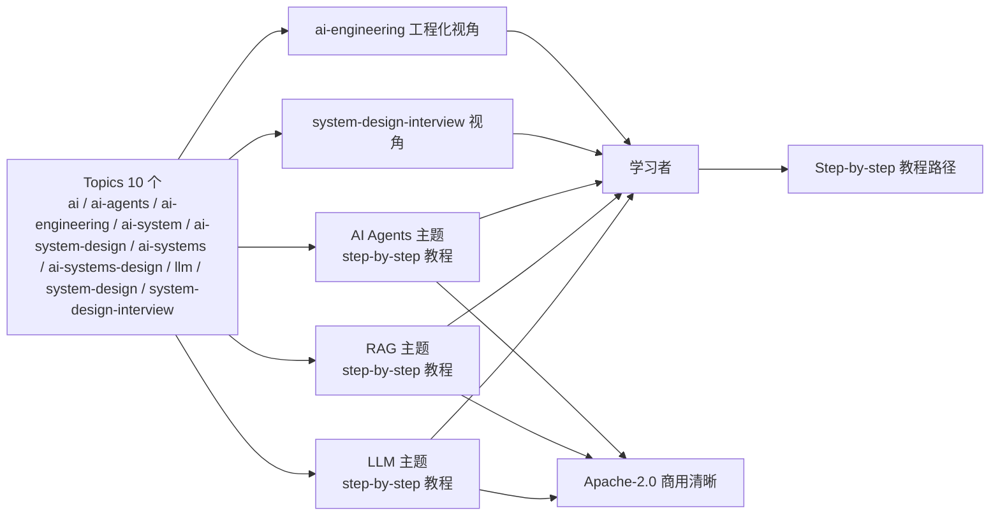

# amitshekhariitbhu/ai-system-design

## 一句话定位
AI 系统设计 step-by-step 教程合集 ——「Learn how to design AI systems built on LLMs, RAG, and AI Agents step by step」：Markdown 极小项目 + Apache-2.0 商用清晰 + topics 10 个覆盖（ai / ai-agents / ai-engineering / ai-system / ai-system-design / ai-systems / ai-systems-design / llm / system-design / system-design-interview）。

## 它解决的问题
2026 年 AI 系统设计学习赛道的痛点是 **「AI 系统设计教程分散 + LLM / RAG / AI Agents 各自文档 + 没 step-by-step + 没 Apache-2.0 商用清晰 + 没 system-design-interview 视角 + 没 ai-engineering 工程化视角 + 没全栈设计覆盖」**。ai-system-design 直击这一痛点：它把 LLM + RAG + AI Agents 系统设计教程汇集到 single repo —— **Markdown 教程合集 + step-by-step + Apache-2.0 商用清晰 + topics 10 个覆盖**——AI / ai-agents / ai-engineering / ai-system / ai-system-design / ai-systems / ai-systems-design / llm / system-design / system-design-interview。解决的是 **「AI 系统设计教程 + 严肃工程化 + step-by-step + Apache-2.0 + LLM + RAG + AI Agents 全栈」** 的学习资源整合工程化问题。

## 为什么值得关注
- **Stars:** 448（截至 2026-09-28），3 天突破 448，增速极快
- **Forks:** 51，社区贡献活跃
- **License:** Apache-2.0
- **语言:** Markdown
- **规模:** 145 KB，Markdown 极小项目
- **活跃度:** created 2026-09-25，pushed_at 持续，持续高活跃
- **Topics:** 10 个核心 topic（ai / ai-agents / ai-engineering / ai-system / ai-system-design / ai-systems / ai-systems-design / llm / system-design / system-design-interview）覆盖清晰

## 热度来源判断
ai-system-design 的热度是 **「Markdown 教程合集 + step-by-step + Apache-2.0 商用清晰 + LLM + RAG + AI Agents 全栈设计 + topics 10 个覆盖 + system-design-interview 视角 + ai-engineering 工程化视角」的强劲组合**。AI 系统设计教程是 2026 年 AI 工程师必备资源，但当前痛点是 AI 系统设计教程分散 + LLM / RAG / AI Agents 各自文档 + 没 step-by-step + 没 Apache-2.0 商用清晰。448⭐ / fork 51 / fork/star 11.4% 与昨日 09-26 shapeshift 9.4% / 09-24 SewCabinSpout/cleanupper 8.7% 同步，反映「AI 系统设计教程 + 严肃工程化」的典型 fork 率特征。51 forks 中包含「AI 系统设计学习者 fork + Apache-2.0 商用清晰 fork + step-by-step 教程 fork + LLM + RAG + AI Agents 全栈 fork + system-design-interview 视角 fork」五类。热度**真实且具 AI 系统设计教程严肃工程化生态价值**——但 Markdown 教程合集需要持续维护保持 step-by-step 准确性。

## 关键技术亮点
1. **Markdown 教程合集** —— AI 系统设计教程汇集到 single repo
2. **Step-by-step** —— 学习路径清晰
3. **Apache-2.0** —— 商用清晰
4. **LLM + RAG + AI Agents 全栈设计** —— 覆盖 AI 系统设计三大主线
5. **Topics 10 个覆盖** —— ai / ai-agents / ai-engineering / ai-system / ai-system-design / ai-systems / ai-systems-design / llm / system-design / system-design-interview
6. **System-design-interview 视角** —— 工程师面试视角
7. **Ai-engineering 工程化视角** —— 工程化视角而非纯理论
8. **145 KB 极小项目** —— Markdown 极小项目，学习者易读

## 架构师速览

| 决策问题 | 研究判断 | 证据边界 |
|---|---|---|
| 系统边界 | Markdown 教程合集，定位在「AI 系统设计学习资源 + LLM + RAG + AI Agents 全栈」的整合层 | 仅基于档案描述的 topics 10 个 + step-by-step + Apache-2.0；具体教程章节结构、step-by-step 路径设计未在档案中给出 |
| 主路径 | 系统设计主题 → step-by-step 教程路径 → LLM / RAG / AI Agents 三大主线 → system-design-interview 视角 → ai-engineering 工程化视角 | 主路径为档案描述的「step-by-step」语义抽象；具体教程目录结构、章节内容深度、step-by-step 路径设计均待核验 |
| 关键权衡 | LLM / RAG / AI Agents 全栈覆盖广度 vs 各主题深度 + step-by-step 路径在多学习者的实用性 + system-design-interview 视角在多问题的实用性 + ai-engineering 工程化视角在多场景的覆盖度 | 档案明示 step-by-step + Apache-2.0 + topics 10 个；具体教程内容质量、step-by-step 准确性未证实 |
| 最小 PoC | 阅读 1 个 LLM 主题 + 1 个 RAG 主题 + 1 个 AI Agents 主题的 step-by-step 教程，验证教程准确性和实用性后再扩展到 system-design-interview 视角 | PoC 范围、退出路径由档案「3 主题 step-by-step 阅读 + 准确性验证」推导；具体教程章节、SLO 指标待核验 |

## 架构启发
ai-system-design 的核心启发是 **「AI 系统设计教程应该从「分散 + 各自文档」推到「Markdown 教程合集 + step-by-step + Apache-2.0 商用清晰 + LLM + RAG + AI Agents 全栈」整合严肃工程化」**。当前 AI 系统设计学习赛道的痛点是 AI 系统设计教程分散 + LLM / RAG / AI Agents 各自文档 + 没 step-by-step + 没 Apache-2.0 商用清晰。ai-system-design 尝试做「**Markdown 教程合集 + step-by-step + Apache-2.0 + topics 10 个 + LLM + RAG + AI Agents 全栈**」整合严肃工程化——类似 awesome 系列之于资源聚合。更深层的启发是：**AI 系统设计教程严肃工程化在于「step-by-step + Apache-2.0 + LLM + RAG + AI Agents 全栈 + system-design-interview + ai-engineering」**——整合而非分散是严肃工程化的关键。

## 架构图（MMD）

> 证据边界：此图只采用本档案已有可核验描述；"待核验"节点不应视为项目实现事实。

## 定位判断
**平台候选型项目（AI 系统设计教程 + step-by-step + Apache-2.0 + LLM + RAG + AI Agents 全栈）。** ai-system-design 不仅是 Markdown 教程合集，更试图成为 AI 系统设计学习资源的「**step-by-step + Apache-2.0 + LLM + RAG + AI Agents 全栈 + system-design-interview + ai-engineering**」整合严肃工程化形态——类似 awesome 系列之于资源聚合。448⭐ / fork 51 / fork/star 11.4% / 3 天已显示 AI 系统设计教程严肃工程化生态价值雏形。但「教程合集严肃工程化」取决于一个关键问题：step-by-step 在多主题（LLM / RAG / AI Agents）的覆盖广度 + 各主题深度 + system-design-interview 视角在多问题的实用性 + ai-engineering 工程化视角在多场景的覆盖度 + Markdown 教程合集持续维护的准确性。目前定位是「最有影响力的 AI 系统设计教程合集 + step-by-step + Apache-2.0」，向「AI 系统设计教程 + 严肃工程化 + 全栈整合」演进是合理路径。

## 风险/局限/泡沫点
- **Step-by-step 在多主题的覆盖广度风险**：LLM / RAG / AI Agents 各主题的 step-by-step 教程覆盖广度待验证
- **各主题深度的稳定性风险**：LLM / RAG / AI Agents 各主题深度在多学习者的稳定性待验证
- **System-design-interview 视角的实用性风险**：engineer interview 视角在多问题的实用性待验证
- **Ai-engineering 工程化视角的覆盖度风险**：工程化视角而非纯理论在多场景的覆盖度待验证
- **Markdown 教程合集持续维护的准确性风险**：Apache-2.0 + Markdown 教程合集需要持续维护保持 step-by-step 准确性
- **个人项目属性**：amitshekhariitbhu 个人维护，51 forks 但核心治理仍集中，可持续性存疑
- **内容深度 vs 广度的权衡风险**：全栈覆盖广度（LLM / RAG / AI Agents）vs 各主题深度（系统设计细节）的权衡

## 与同类项目的关系
- **vs samyost1/3dicon：** 3dicon 是「一个 prompt → 透明循环 3D 图标」；ai-system-design 是「AI 系统设计 step-by-step 教程」——同构「AI / Agent / RAG 严肃工程化学习资源」但推到「Markdown 教程合集 + step-by-step + Apache-2.0 + LLM + RAG + AI Agents 全栈」领域
- **vs jev-chat/jev-chat-jarvis：** jev-chat-jarvis 是「Jev 副驾组织化 fork」；ai-system-design 是「AI 系统设计教程」——同构「AI / Agent 严肃工程化学习资源」但推到「system-design-interview + ai-engineering + step-by-step」领域
- **vs awesome 系列：** awesome 系列是资源聚合；ai-system-design 是 step-by-step 教程——互补
- **vs Chip Huyen / Maxime Labonne 系列：** Chip Huyen / Maxime Labonne 是单作者深度教程；ai-system-design 是 step-by-step + topics 10 个 + Apache-2.0 全栈——互补
- **vs system-design-primer：** system-design-primer 是传统系统设计；ai-system-design 是 AI 系统设计——互补

## 是否值得持续跟踪
**值得跟踪（AI 系统设计教程 + step-by-step + Apache-2.0 + LLM + RAG + AI Agents 全栈）。** ai-system-design 代表了 AI 系统设计教程从「分散 + 各自文档」推到「Markdown 教程合集 + step-by-step + Apache-2.0 + LLM + RAG + AI Agents 全栈」整合严肃工程化，无论其本身成败，这一方向是行业趋势。建议关注：step-by-step 在多主题的覆盖广度 + 各主题深度 + system-design-interview 视角在多问题的实用性 + ai-engineering 工程化视角在多场景的覆盖度 + Markdown 教程合集持续维护的准确性。对 AI 工程师 / 学习者，这个仓库是「AI 系统设计 step-by-step 教程 + LLM + RAG + AI Agents 全栈 + Apache-2.0 商用清晰」的实用资源，值得直接采用。对 AI 系统设计教程严肃工程化观察者，它是「教程合集 + step-by-step + Apache-2.0」赛道的头部样本。

## 后续观察点
- Step-by-step 在多主题的覆盖广度（LLM / RAG / AI Agents）
- 各主题深度在多学习者的稳定性
- System-design-interview 视角在多问题的实用性
- Ai-engineering 工程化视角在多场景的覆盖度
- Markdown 教程合集持续维护的准确性
- Apache-2.0 商用清晰度的持续维护
- Topics 10 个覆盖的清晰度
- 企业采用（团队是否将此作为 AI 系统设计学习资源）
- 内容深度 vs 广度的权衡
- 与 awesome 系列 / Chip Huyen / system-design-primer 的互补性

---
> 数据来源: GitHub API (2026-09-28) | Stars: 448 | Forks: 51 | License: Apache-2.0 | 语言: Markdown | 创建: 2026-09-25